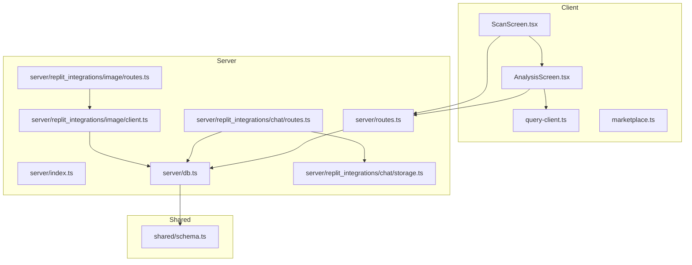
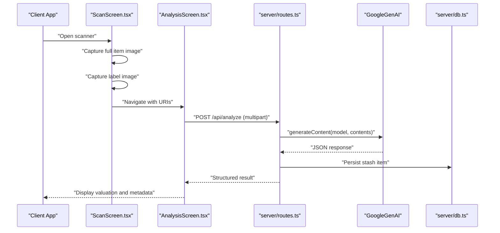
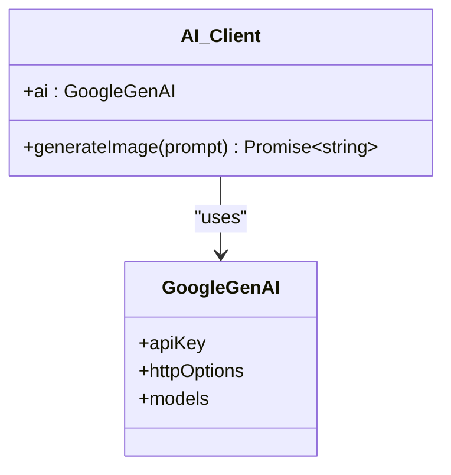
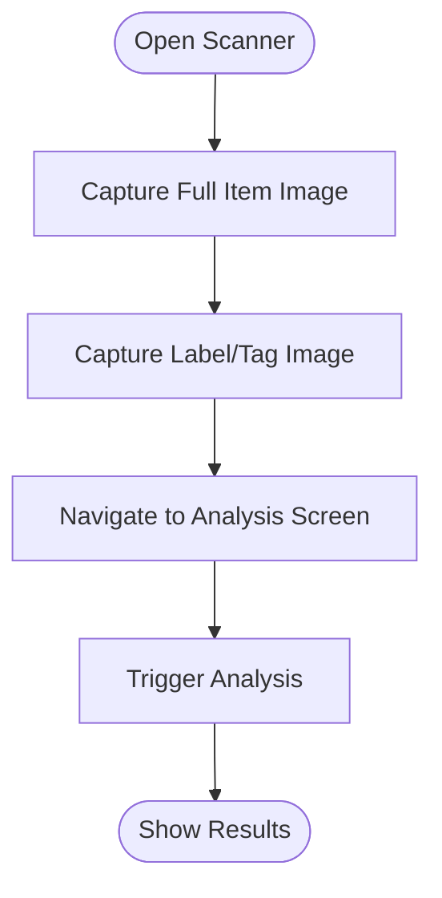
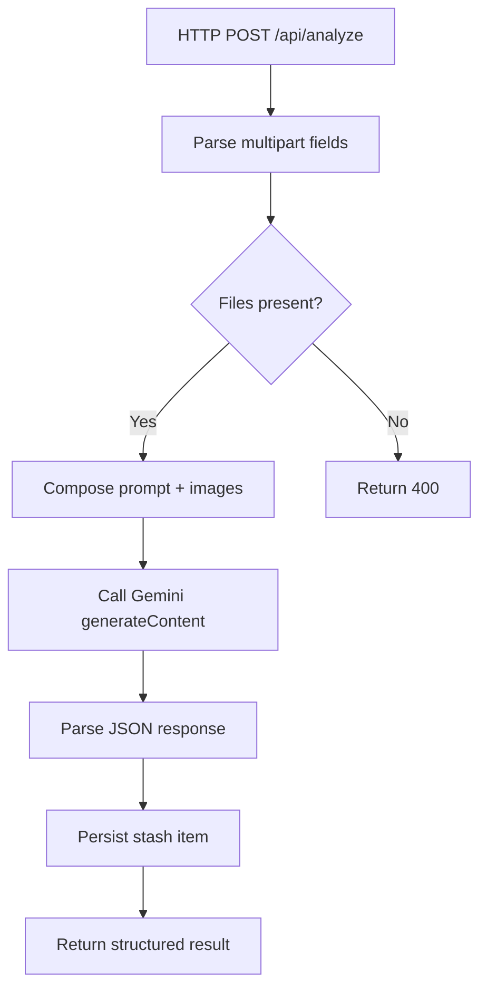
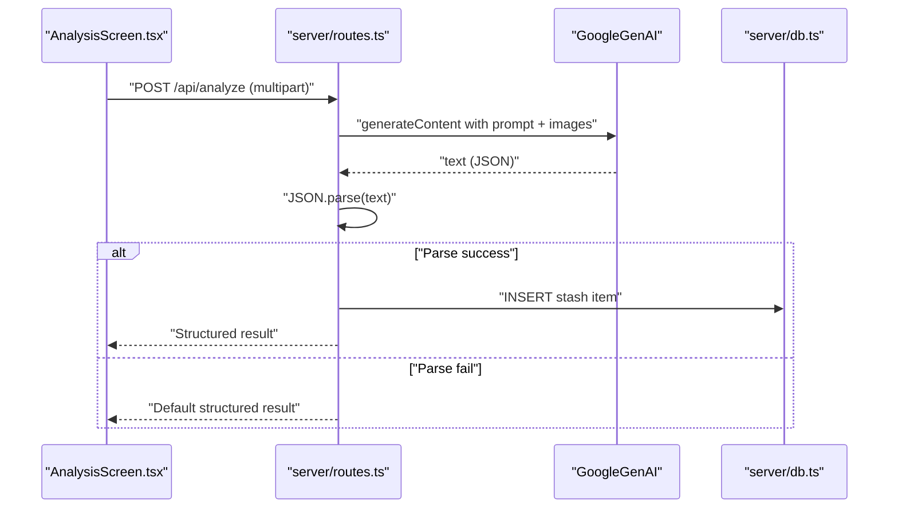
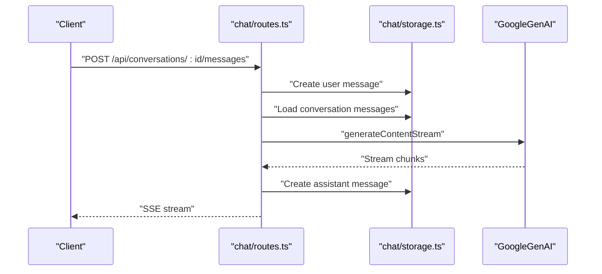
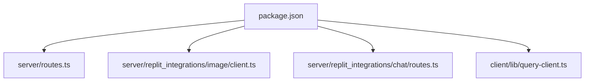

# AI Integration

<cite>
**Referenced Files in This Document**
- [server/index.ts](file://server/index.ts)
- [server/routes.ts](file://server/routes.ts)
- [server/db.ts](file://server/db.ts)
- [server/replit_integrations/chat/routes.ts](file://server/replit_integrations/chat/routes.ts)
- [server/replit_integrations/chat/storage.ts](file://server/replit_integrations/chat/storage.ts)
- [server/replit_integrations/image/client.ts](file://server/replit_integrations/image/client.ts)
- [server/replit_integrations/image/routes.ts](file://server/replit_integrations/image/routes.ts)
- [client/screens/ScanScreen.tsx](file://client/screens/ScanScreen.tsx)
- [client/screens/AnalysisScreen.tsx](file://client/screens/AnalysisScreen.tsx)
- [client/lib/marketplace.ts](file://client/lib/marketplace.ts)
- [client/lib/query-client.ts](file://client/lib/query-client.ts)
- [shared/schema.ts](file://shared/schema.ts)
- [package.json](file://package.json)
- [ENVIRONMENT.md](file://ENVIRONMENT.md)
</cite>

## Table of Contents
1. [Introduction](#introduction)
2. [Project Structure](#project-structure)
3. [Core Components](#core-components)
4. [Architecture Overview](#architecture-overview)
5. [Detailed Component Analysis](#detailed-component-analysis)
6. [Dependency Analysis](#dependency-analysis)
7. [Performance Considerations](#performance-considerations)
8. [Troubleshooting Guide](#troubleshooting-guide)
9. [Conclusion](#conclusion)
10. [Appendices](#appendices)

## Introduction
This document explains the AI integration system centered on Google Gemini API usage and the image processing pipeline. It covers AI configuration, prompt engineering strategies, response processing workflows, dual-image capture for item analysis, image upload handling, multipart request processing, the AI-powered appraisal engine, error handling, rate limiting considerations, fallback mechanisms, chat integration, and practical examples for AI API usage, prompt templates, and response parsing. It also addresses performance optimization, caching strategies, and cost management for AI service usage.

## Project Structure
The AI integration spans the backend Express server, shared database schema, and the React Native client. Key areas include:
- Backend AI routes for item analysis and publishing
- Replit AI Integrations for chat and image generation
- Client-side dual-image capture and analysis flow
- Database schema for storing stash items and chat conversations

**Diagram sources**
- [server/index.ts](file://server/index.ts#L1-L247)
- [server/routes.ts](file://server/routes.ts#L1-L493)
- [server/db.ts](file://server/db.ts#L1-L19)
- [server/replit_integrations/chat/routes.ts](file://server/replit_integrations/chat/routes.ts#L1-L126)
- [server/replit_integrations/chat/storage.ts](file://server/replit_integrations/chat/storage.ts#L1-L44)
- [server/replit_integrations/image/client.ts](file://server/replit_integrations/image/client.ts#L1-L38)
- [server/replit_integrations/image/routes.ts](file://server/replit_integrations/image/routes.ts#L1-L41)
- [client/screens/ScanScreen.tsx](file://client/screens/ScanScreen.tsx#L1-L394)
- [client/screens/AnalysisScreen.tsx](file://client/screens/AnalysisScreen.tsx#L1-L484)
- [client/lib/query-client.ts](file://client/lib/query-client.ts#L1-L80)
- [client/lib/marketplace.ts](file://client/lib/marketplace.ts#L1-L129)
- [shared/schema.ts](file://shared/schema.ts#L1-L122)

**Section sources**
- [server/index.ts](file://server/index.ts#L1-L247)
- [server/routes.ts](file://server/routes.ts#L1-L493)
- [server/db.ts](file://server/db.ts#L1-L19)
- [server/replit_integrations/chat/routes.ts](file://server/replit_integrations/chat/routes.ts#L1-L126)
- [server/replit_integrations/chat/storage.ts](file://server/replit_integrations/chat/storage.ts#L1-L44)
- [server/replit_integrations/image/client.ts](file://server/replit_integrations/image/client.ts#L1-L38)
- [server/replit_integrations/image/routes.ts](file://server/replit_integrations/image/routes.ts#L1-L41)
- [client/screens/ScanScreen.tsx](file://client/screens/ScanScreen.tsx#L1-L394)
- [client/screens/AnalysisScreen.tsx](file://client/screens/AnalysisScreen.tsx#L1-L484)
- [client/lib/query-client.ts](file://client/lib/query-client.ts#L1-L80)
- [client/lib/marketplace.ts](file://client/lib/marketplace.ts#L1-L129)
- [shared/schema.ts](file://shared/schema.ts#L1-L122)

## Core Components
- AI configuration and Gemini client initialization for both analysis and image generation
- Dual-image capture workflow on the client and multipart upload handling on the server
- AI-powered appraisal engine with structured prompt engineering and JSON response parsing
- Chat integration with streaming responses and persistent storage
- Marketplace publishing utilities for WooCommerce and eBay
- Database schema for stash items and chat conversations

**Section sources**
- [server/routes.ts](file://server/routes.ts#L11-L17)
- [server/replit_integrations/image/client.ts](file://server/replit_integrations/image/client.ts#L1-L38)
- [client/screens/ScanScreen.tsx](file://client/screens/ScanScreen.tsx#L17-L62)
- [client/screens/AnalysisScreen.tsx](file://client/screens/AnalysisScreen.tsx#L66-L112)
- [server/replit_integrations/chat/routes.ts](file://server/replit_integrations/chat/routes.ts#L72-L123)
- [client/lib/marketplace.ts](file://client/lib/marketplace.ts#L81-L128)
- [shared/schema.ts](file://shared/schema.ts#L29-L76)

## Architecture Overview
The AI integration architecture leverages Replit’s AI Integrations service to access Google Gemini APIs without requiring a direct API key. The client captures two images (full item and label) and sends them as multipart form data to the backend. The server composes a structured prompt, invokes the Gemini model, parses the JSON response, and persists the result. Chat and image generation endpoints use similar patterns with streaming and modalities.

**Diagram sources**
- [client/screens/ScanScreen.tsx](file://client/screens/ScanScreen.tsx#L26-L62)
- [client/screens/AnalysisScreen.tsx](file://client/screens/AnalysisScreen.tsx#L66-L112)
- [server/routes.ts](file://server/routes.ts#L140-L226)
- [server/db.ts](file://server/db.ts#L1-L19)

## Detailed Component Analysis

### AI Configuration and Gemini Client
- The server initializes the GoogleGenAI client using Replit AI Integrations variables for API key and base URL.
- The client exposes a reusable AI instance and a convenience function to generate images with multimodal responses.

**Diagram sources**
- [server/replit_integrations/image/client.ts](file://server/replit_integrations/image/client.ts#L1-L38)

**Section sources**
- [server/routes.ts](file://server/routes.ts#L11-L17)
- [server/replit_integrations/image/client.ts](file://server/replit_integrations/image/client.ts#L1-L38)
- [ENVIRONMENT.md](file://ENVIRONMENT.md#L43-L46)

### Dual-Image Capture Workflow
- The client implements a two-step capture flow: full item image followed by label close-up.
- Navigation passes both URIs to the analysis screen, which triggers the AI analysis.

**Diagram sources**
- [client/screens/ScanScreen.tsx](file://client/screens/ScanScreen.tsx#L17-L62)
- [client/screens/AnalysisScreen.tsx](file://client/screens/AnalysisScreen.tsx#L34-L64)

**Section sources**
- [client/screens/ScanScreen.tsx](file://client/screens/ScanScreen.tsx#L17-L62)
- [client/screens/AnalysisScreen.tsx](file://client/screens/AnalysisScreen.tsx#L34-L64)

### Image Upload Handling and Multi-Part Requests
- The server defines a multipart upload field configuration for two images: fullImage and labelImage.
- The upload middleware enforces a 10 MB file size limit and stores files in memory.

**Diagram sources**
- [server/routes.ts](file://server/routes.ts#L19-L22)
- [server/routes.ts](file://server/routes.ts#L140-L226)

**Section sources**
- [server/routes.ts](file://server/routes.ts#L19-L22)
- [server/routes.ts](file://server/routes.ts#L140-L226)

### AI-Powered Appraisal Engine
- Prompt engineering focuses on extracting a concise title, detailed description, category, value range, condition, SEO-optimized metadata, and tags.
- The server constructs a parts array with text prompt and optional inline image data.
- The model responds with JSON; the server attempts to parse it and falls back to a default structured response if parsing fails.

**Diagram sources**
- [client/screens/AnalysisScreen.tsx](file://client/screens/AnalysisScreen.tsx#L66-L112)
- [server/routes.ts](file://server/routes.ts#L140-L226)
- [server/db.ts](file://server/db.ts#L1-L19)

**Section sources**
- [server/routes.ts](file://server/routes.ts#L150-L174)
- [server/routes.ts](file://server/routes.ts#L196-L221)

### Response Processing and Structured Output
- The server expects a strict JSON schema and validates the response before persisting.
- A fallback mechanism ensures the client receives a usable structure even if the AI response is malformed.

**Section sources**
- [server/routes.ts](file://server/routes.ts#L163-L174)
- [server/routes.ts](file://server/routes.ts#L206-L221)

### Chat Integration for User Assistance
- The chat endpoint supports creating conversations, retrieving histories, and streaming AI responses.
- Messages are persisted to the database and streamed via Server-Sent Events.

**Diagram sources**
- [server/replit_integrations/chat/routes.ts](file://server/replit_integrations/chat/routes.ts#L72-L123)
- [server/replit_integrations/chat/storage.ts](file://server/replit_integrations/chat/storage.ts#L14-L42)

**Section sources**
- [server/replit_integrations/chat/routes.ts](file://server/replit_integrations/chat/routes.ts#L19-L123)
- [server/replit_integrations/chat/storage.ts](file://server/replit_integrations/chat/storage.ts#L14-L42)
- [shared/schema.ts](file://shared/schema.ts#L64-L76)

### Image Generation Endpoint
- The image generation endpoint accepts a text prompt and returns base64-encoded image data with proper MIME type.
- It uses multimodal configuration to produce both text and image responses.

**Section sources**
- [server/replit_integrations/image/routes.ts](file://server/replit_integrations/image/routes.ts#L6-L38)
- [server/replit_integrations/image/client.ts](file://server/replit_integrations/image/client.ts#L16-L36)

### Marketplace Publishing Utilities
- The client provides helpers to publish items to WooCommerce and eBay using stored credentials.
- The server exposes endpoints to perform the external API calls and update local records.

**Section sources**
- [client/lib/marketplace.ts](file://client/lib/marketplace.ts#L81-L128)
- [server/routes.ts](file://server/routes.ts#L228-L296)
- [server/routes.ts](file://server/routes.ts#L298-L488)

### Database Schema for AI Workflows
- Stash items include fields for title, description, category, estimated value, condition, tags, image URLs, SEO metadata, and publication flags.
- Chat conversations and messages support persistent storage of user-assisted interactions.

**Section sources**
- [shared/schema.ts](file://shared/schema.ts#L29-L76)

## Dependency Analysis
The AI integration relies on several key dependencies and environment configurations:
- GoogleGenAI SDK for Gemini API access
- Multer for multipart uploads
- Drizzle ORM and PostgreSQL for persistence
- React Query for client-side caching and data fetching
- Expo ecosystem for camera and image picking

**Diagram sources**
- [package.json](file://package.json#L19-L67)
- [server/routes.ts](file://server/routes.ts#L1-L17)
- [server/replit_integrations/image/client.ts](file://server/replit_integrations/image/client.ts#L1-L10)
- [server/replit_integrations/chat/routes.ts](file://server/replit_integrations/chat/routes.ts#L1-L17)
- [client/lib/query-client.ts](file://client/lib/query-client.ts#L1-L80)

**Section sources**
- [package.json](file://package.json#L19-L67)
- [ENVIRONMENT.md](file://ENVIRONMENT.md#L43-L46)

## Performance Considerations
- Image size limits and multipart handling reduce payload overhead.
- Client-side caching via React Query minimizes redundant network calls.
- Streaming chat responses improve perceived latency.
- Recommendations:
  - Implement client-side image compression before upload.
  - Add optimistic updates for stash saves and marketplace publishes.
  - Introduce exponential backoff for AI API retries.
  - Cache frequently accessed prompts and default responses.
  - Monitor AI quota usage and implement circuit breakers.

[No sources needed since this section provides general guidance]

## Troubleshooting Guide
Common issues and remedies:
- AI API failures
  - Verify AI integrations environment variables are configured.
  - Check server logs for detailed error messages.
  - Implement fallback responses when JSON parsing fails.
- Rate limiting and quotas
  - Monitor usage and throttle requests.
  - Use exponential backoff and circuit breaker patterns.
- Marketplace publishing errors
  - Validate credentials and tokens.
  - Inspect external service responses and error payloads.
- Database connectivity
  - Confirm DATABASE_URL and SSL settings.
  - Ensure migrations are applied.

**Section sources**
- [ENVIRONMENT.md](file://ENVIRONMENT.md#L191-L195)
- [server/routes.ts](file://server/routes.ts#L222-L225)
- [client/lib/marketplace.ts](file://client/lib/marketplace.ts#L81-L128)
- [server/db.ts](file://server/db.ts#L7-L16)

## Conclusion
The AI integration system combines a robust Gemini client, structured prompt engineering, and a streamlined dual-image capture workflow to deliver accurate item appraisals. The backend handles multipart uploads, AI response parsing, and persistence, while the client provides a seamless user experience with camera capture and analysis results. Chat and image generation endpoints extend the AI capabilities, and marketplace publishing utilities integrate with external platforms. By following the recommended performance and troubleshooting practices, the system can maintain reliability and cost efficiency.

[No sources needed since this section summarizes without analyzing specific files]

## Appendices

### Practical Examples and Templates
- Example AI API usage
  - Initialize client with environment variables and call generateContent with structured parts.
  - Reference: [server/routes.ts](file://server/routes.ts#L11-L17), [server/replit_integrations/image/client.ts](file://server/replit_integrations/image/client.ts#L1-L38)
- Prompt templates
  - Use a strict JSON schema prompt to guide the model to return structured data.
  - Reference: [server/routes.ts](file://server/routes.ts#L150-L174)
- Response parsing
  - Attempt JSON.parse and fall back to a default structured object on failure.
  - Reference: [server/routes.ts](file://server/routes.ts#L206-L221)

**Section sources**
- [server/routes.ts](file://server/routes.ts#L11-L17)
- [server/replit_integrations/image/client.ts](file://server/replit_integrations/image/client.ts#L1-L38)
- [server/routes.ts](file://server/routes.ts#L150-L174)
- [server/routes.ts](file://server/routes.ts#L206-L221)