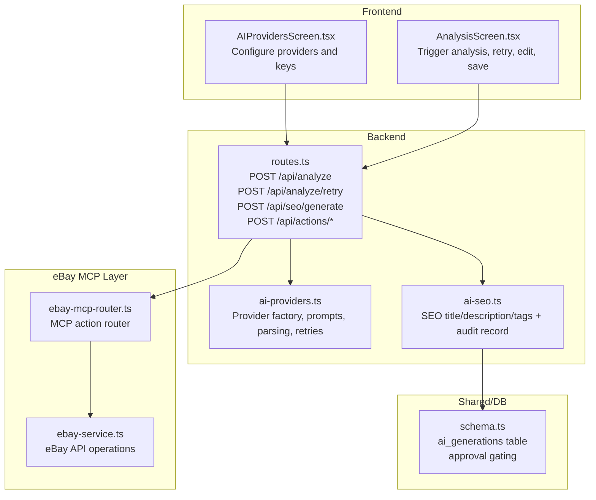
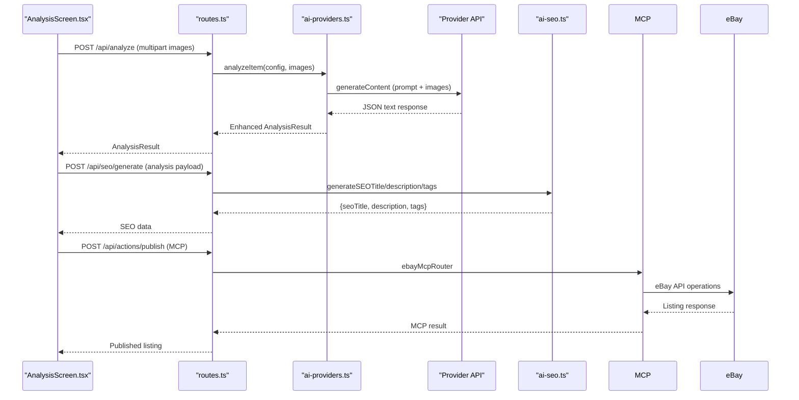
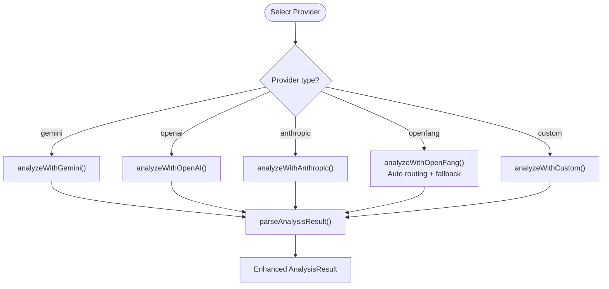
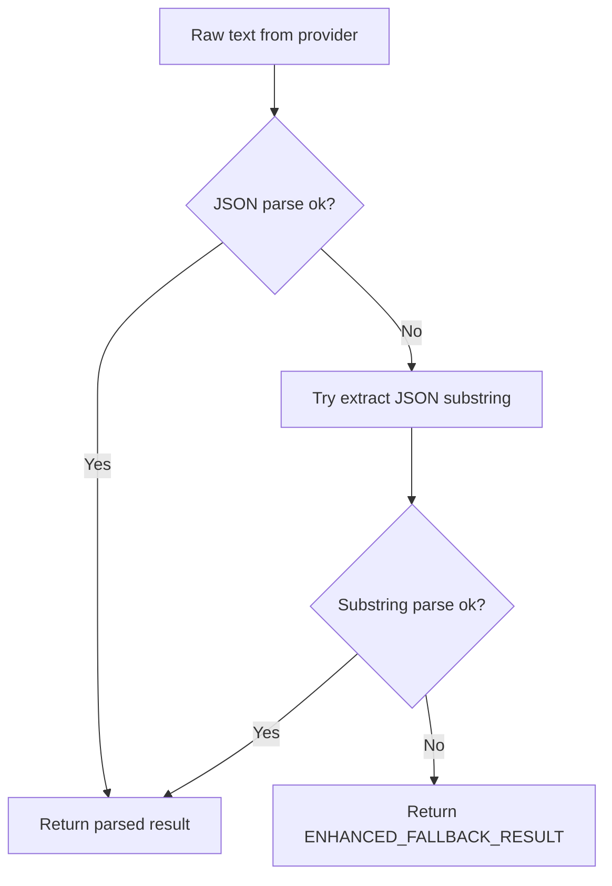
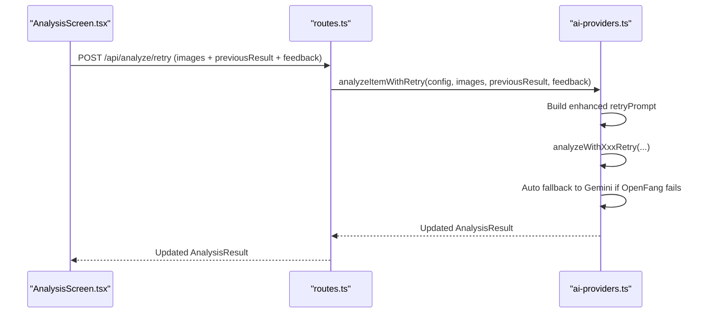
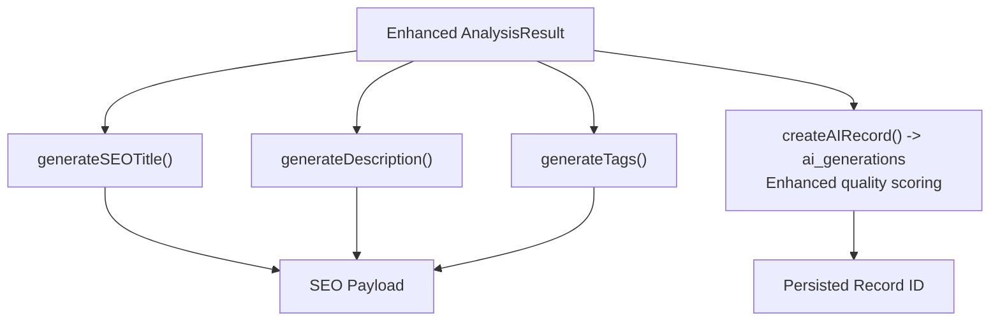
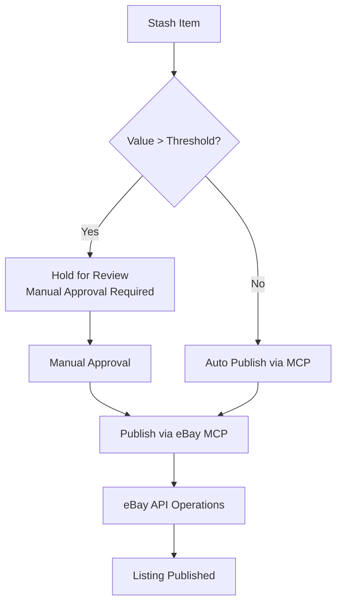
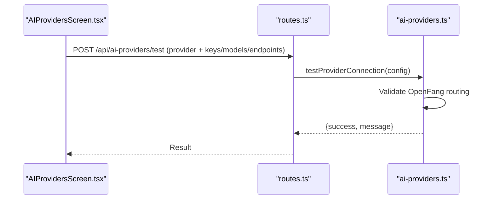
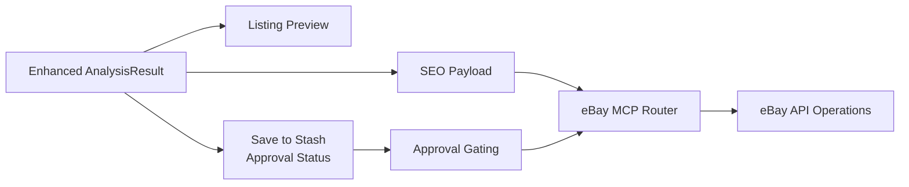
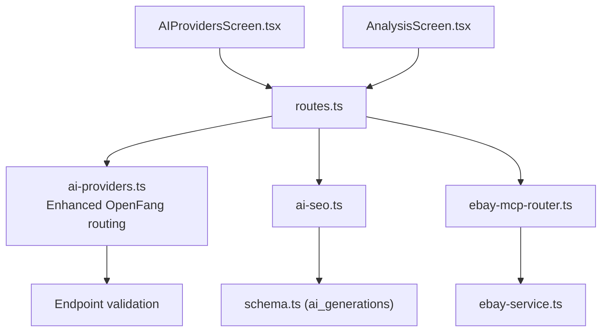

# AI Integration

<cite>
**Referenced Files in This Document**
- [ai-providers.ts](file://server/ai-providers.ts)
- [ai-seo.ts](file://server/ai-seo.ts)
- [routes.ts](file://server/routes.ts)
- [AIProvidersScreen.tsx](file://client/screens/AIProvidersScreen.tsx)
- [AnalysisScreen.tsx](file://client/screens/AnalysisScreen.tsx)
- [ebay-mcp-router.ts](file://server/ebay-mcp-router.ts)
- [ebay-service.ts](file://server/ebay-service.ts)
- [schema.ts](file://shared/schema.ts)
</cite>

## Update Summary
**Changes Made**
- Added comprehensive OpenFang provider support with automatic vision model routing
- Enhanced AI analysis workflow with improved retry mechanisms and fallback strategies
- Integrated eBay MCP (Marketplace Control Protocol) for advanced marketplace automation
- Implemented sophisticated approval gating system for high-value items
- Expanded AnalysisResult interface with enhanced authentication and market analysis fields
- Added eBay MCP router and service layer for marketplace operations

## Table of Contents
1. [Introduction](#introduction)
2. [Project Structure](#project-structure)
3. [Core Components](#core-components)
4. [Architecture Overview](#architecture-overview)
5. [Detailed Component Analysis](#detailed-component-analysis)
6. [Dependency Analysis](#dependency-analysis)
7. [Performance Considerations](#performance-considerations)
8. [Troubleshooting Guide](#troubleshooting-guide)
9. [Conclusion](#conclusion)
10. [Appendices](#appendices)

## Introduction
This document explains Hidden-Gem's AI integration system, focusing on the enhanced AI provider factory supporting Google Gemini, OpenAI, Anthropic, OpenFang, and custom/local endpoints. The system now features comprehensive OpenFang integration with automatic vision model routing, sophisticated approval gating for high-value items, and advanced eBay MCP (Marketplace Control Protocol) integration. It covers configuration options, API key management, provider selection logic, the enhanced item analysis workflow from image capture through AI processing to authentication results and market valuation, SEO optimization for marketplace listings, retry mechanisms, error handling, and fallback strategies. The system now includes comprehensive marketplace publishing integration with approval gating and eBay MCP automation.

## Project Structure
The AI integration spans four layers with enhanced marketplace automation:
- Frontend (React Native): Screens for configuring AI providers and reviewing analysis results.
- Backend (Express): Routes for image analysis, retry analysis, SEO generation, eBay MCP operations; provider abstraction and parsing logic.
- Marketplace Layer: eBay MCP router and service layer for automated marketplace operations.
- Shared/Infrastructure: Database schema for AI records, marketplace approvals, and batch utilities.

**Diagram sources**
- [AIProvidersScreen.tsx:104-263](file://client/screens/AIProvidersScreen.tsx#L104-L263)
- [AnalysisScreen.tsx:78-143](file://client/screens/AnalysisScreen.tsx#L78-L143)
- [routes.ts:672-711](file://server/routes.ts#L672-L711)
- [ai-providers.ts:380-442](file://server/ai-providers.ts#L380-L442)
- [ai-seo.ts:80-111](file://server/ai-seo.ts#L80-L111)
- [ebay-mcp-router.ts:1-181](file://server/ebay-mcp-router.ts#L1-L181)
- [ebay-service.ts:1-678](file://server/ebay-service.ts#L1-L678)
- [schema.ts:174-187](file://shared/schema.ts#L174-L187)

**Section sources**
- [routes.ts:44-711](file://server/routes.ts#L44-L711)
- [ai-providers.ts:1-696](file://server/ai-providers.ts#L1-L696)
- [ai-seo.ts:1-112](file://server/ai-seo.ts#L1-L112)
- [ebay-mcp-router.ts:1-181](file://server/ebay-mcp-router.ts#L1-L181)
- [ebay-service.ts:1-678](file://server/ebay-service.ts#L1-L678)
- [schema.ts:174-187](file://shared/schema.ts#L174-L187)

## Core Components
- **Enhanced AI Provider Factory**: Selects and invokes the appropriate provider (Gemini, OpenAI, Anthropic, OpenFang, Custom) with validated configuration and images. OpenFang now provides automatic vision model routing with fallback strategies.
- **Advanced Analysis Prompt and Result Parsing**: A comprehensive prompt drives detailed authentication assessment, market valuation, item identification, SEO metadata, and item specifics. Results are parsed into an expanded AnalysisResult shape with robust fallbacks and enhanced authentication fields.
- **Sophisticated Retry Mechanism**: Seller feedback triggers refined analysis using retry prompts with improved fallback logic, particularly for OpenFang provider failures.
- **Enhanced SEO Generation**: Produces eBay-compliant titles, formatted descriptions, and tags; optionally persists an audit trail with quality scoring.
- **eBay MCP Integration**: Comprehensive marketplace automation through MCP actions including publish, update, offer, and reprice operations with authentication and error handling.
- **Approval Gating System**: Sophisticated approval system for high-value items with configurable thresholds and manual review workflows.
- **Frontend Provider Configuration**: Secure local storage for keys; model selection; connection tests per provider including OpenFang routing.
- **Marketplace Integration**: Results feed into listing previews, approval gating, and automated publishing through eBay MCP.

**Section sources**
- [ai-providers.ts:380-442](file://server/ai-providers.ts#L380-L442)
- [ai-providers.ts:131-180](file://server/ai-providers.ts#L131-L180)
- [ai-providers.ts:398-442](file://server/ai-providers.ts#L398-L442)
- [ai-seo.ts:17-74](file://server/ai-seo.ts#L17-L74)
- [ebay-mcp-router.ts:44-178](file://server/ebay-mcp-router.ts#L44-L178)
- [ebay-service.ts:497-678](file://server/ebay-service.ts#L497-L678)
- [AIProvidersScreen.tsx:104-263](file://client/screens/AIProvidersScreen.tsx#L104-L263)
- [AnalysisScreen.tsx:78-143](file://client/screens/AnalysisScreen.tsx#L78-L143)

## Architecture Overview
The enhanced AI pipeline begins when the frontend captures item and label images and sends them to the backend. The backend selects the active provider, constructs a multimodal prompt with images, queries the provider (with OpenFang routing), parses the response, and returns a rich analysis. The frontend displays results, allows edits, and supports retry with feedback. Enhanced SEO generation produces marketplace-ready content and optionally stores an audit record. The system now includes eBay MCP automation for marketplace operations and sophisticated approval gating for high-value items.

**Diagram sources**
- [AnalysisScreen.tsx:111-143](file://client/screens/AnalysisScreen.tsx#L111-L143)
- [routes.ts:672-711](file://server/routes.ts#L672-L711)
- [ai-providers.ts:380-396](file://server/ai-providers.ts#L380-L396)
- [ai-seo.ts:80-111](file://server/ai-seo.ts#L80-L111)
- [ebay-mcp-router.ts:44-112](file://server/ebay-mcp-router.ts#L44-L112)
- [ebay-service.ts:520-561](file://server/ebay-service.ts#L520-L561)

## Detailed Component Analysis

### Enhanced AI Provider Factory and Configuration
- **Provider Types**: Supports "gemini", "openai", "anthropic", "openfang", and "custom".
- **Configuration Options**:
  - provider: Selected AI provider.
  - apiKey: Optional; falls back to environment variables for Gemini/OpenFang.
  - endpoint: Required for "custom"; validated against private/internal address patterns.
  - model: Provider-specific model name; defaults applied when omitted.
- **OpenFang Integration**: Automatic vision model routing with fallback to gpt-4o, gemini-2.5-flash, or claude-sonnet-4-20250514 when vision models are unavailable.
- **Environment Variables**:
  - Gemini: AI_INTEGRATIONS_GEMINI_API_KEY and AI_INTEGRATIONS_GEMINI_BASE_URL (auto-configured on Replit).
  - OpenFang: OPENFANG_API_KEY and OPENFANG_BASE_URL.
- **Frontend Storage**:
  - Secure local storage for API keys and model preferences; supports web and native secure stores.
- **Provider Selection Logic**:
  - analyzeItem dispatches to provider-specific handlers based on config.provider.
  - Enhanced fallback logic: OpenFang failures automatically fall back to Gemini.
  - testProviderConnection validates connectivity for each provider including OpenFang routing.

**Diagram sources**
- [ai-providers.ts:380-396](file://server/ai-providers.ts#L380-L396)
- [ai-providers.ts:131-180](file://server/ai-providers.ts#L131-L180)

**Section sources**
- [ai-providers.ts:3-41](file://server/ai-providers.ts#L3-L41)
- [ai-providers.ts:182-222](file://server/ai-providers.ts#L182-L222)
- [ai-providers.ts:380-396](file://server/ai-providers.ts#L380-L396)
- [AIProvidersScreen.tsx:104-263](file://client/screens/AIProvidersScreen.tsx#L104-L263)
- [ENVIRONMENT.md:43-46](file://ENVIRONMENT.md#L43-L46)

### Enhanced Analysis Prompt and Result Interpretation
- **Expanded Prompt Scope**: Authentication assessment, market valuation, item identification, SEO metadata, and item specifics (aspects).
- **Enhanced Output Schema**: Unified AnalysisResult with comprehensive fields including brand, subtitle, descriptions, value ranges, confidence, authenticity assessment, market analysis, aspects, and marketplace categories.
- **Improved Parsing and Fallback**:
  - Attempts strict JSON parse; if that fails, extracts JSON substring; falls back to predefined default result if parsing fails.
  - Enhanced fallback defaults for new fields including authentication details and market analysis.
  - Merges partial results with fallback defaults to maintain backward compatibility.

**Diagram sources**
- [ai-providers.ts:131-180](file://server/ai-providers.ts#L131-L180)
- [ai-providers.ts:101-129](file://server/ai-providers.ts#L101-L129)

**Section sources**
- [ai-providers.ts:48-99](file://server/ai-providers.ts#L48-L99)
- [ai-providers.ts:131-180](file://server/ai-providers.ts#L131-L180)
- [ai-providers.ts:101-129](file://server/ai-providers.ts#L101-L129)

### Advanced Retry Mechanism and Feedback Loop
- **Enhanced Retry Prompt Template**: Incorporates prior analysis and seller feedback to refine the assessment with improved fallback logic.
- **Advanced Retry Flow**:
  - Frontend collects feedback and re-sends images plus previous result and feedback.
  - Backend reconstructs a retry prompt and calls analyzeItemWithRetry with enhanced fallback.
  - Provider-specific retry handlers execute the updated prompt with OpenFang routing fallback.
  - Automatic fallback from OpenFang to Gemini when vision model routing fails.
- **Use Cases**: Correcting misidentified brands, overlooked details, condition assessments, or authenticity concerns.

**Diagram sources**
- [AnalysisScreen.tsx:145-179](file://client/screens/AnalysisScreen.tsx#L145-L179)
- [routes.ts:672-711](file://server/routes.ts#L672-L711)
- [ai-providers.ts:418-442](file://server/ai-providers.ts#L418-L442)

**Section sources**
- [ai-providers.ts:398-442](file://server/ai-providers.ts#L398-L442)
- [routes.ts:672-711](file://server/routes.ts#L672-L711)
- [AnalysisScreen.tsx:145-179](file://client/screens/AnalysisScreen.tsx#L145-L179)

### Enhanced SEO Optimization and Audit Trail
- **SEO Content Generation**:
  - generateSEOTitle: Builds eBay-compliant titles under 80 characters.
  - generateDescription: Formats marketplace descriptions with condition, brand, category, materials, color, dimensions, features, and market value.
  - generateTags: Produces SEO tags from brand, category, color, style, condition, material, and features.
- **Enhanced Audit Trail**:
  - createAIRecord persists the analysis and generated listing to the ai_generations table, including model used, tokens used, cost estimate, and quality score.
  - Enhanced quality scoring based on brand detection and analysis completeness.

**Diagram sources**
- [ai-seo.ts:17-74](file://server/ai-seo.ts#L17-L74)
- [ai-seo.ts:80-111](file://server/ai-seo.ts#L80-L111)
- [schema.ts:174-187](file://shared/schema.ts#L174-L187)

**Section sources**
- [ai-seo.ts:17-111](file://server/ai-seo.ts#L17-L111)
- [schema.ts:174-187](file://shared/schema.ts#L174-L187)

### eBay MCP Integration and Approval Gating
- **MCP Router Operations**:
  - Publish: Creates inventory item, creates offer, and publishes listing through eBay API.
  - Update: Updates existing eBay listings with partial updates.
  - Offer: Makes offers on existing listings.
  - Reprice: Updates listing prices programmatically.
  - Authentication: Optional API key protection for MCP operations.
- **Approval Gating System**:
  - High-value threshold configuration per user.
  - Automatic hold for items exceeding threshold unless approved.
  - Manual approval workflow for high-value items.
  - Enhanced marketplace integration with approval status tracking.
- **Marketplace Operations**:
  - eBay API integration with proper authentication and error handling.
  - Category mapping and listing validation.
  - Automated publishing workflows with MCP.

**Diagram sources**
- [routes.ts:490-512](file://server/routes.ts#L490-L512)
- [routes.ts:633-903](file://server/routes.ts#L633-L903)
- [ebay-mcp-router.ts:44-178](file://server/ebay-mcp-router.ts#L44-L178)
- [ebay-service.ts:520-678](file://server/ebay-service.ts#L520-L678)

**Section sources**
- [routes.ts:490-512](file://server/routes.ts#L490-L512)
- [routes.ts:633-903](file://server/routes.ts#L633-L903)
- [ebay-mcp-router.ts:44-178](file://server/ebay-mcp-router.ts#L44-L178)
- [ebay-service.ts:520-678](file://server/ebay-service.ts#L520-L678)

### Frontend Provider Configuration and Testing
- **Enhanced Configuration Screen**:
  - Allows selecting the active provider and toggling between providers including OpenFang.
  - Stores API keys securely (SecureStore on native, AsyncStorage on web).
  - Supports model selection for OpenAI and Anthropic; endpoint and model for custom providers.
  - OpenFang configuration with automatic routing and fallback options.
- **Connection Testing**:
  - Tests connectivity per provider using testProviderConnection including OpenFang routing validation.
  - Surfaces success/error messages with provider-specific feedback.
  - Enhanced testing for OpenFang routing capabilities.

**Diagram sources**
- [AIProvidersScreen.tsx:211-263](file://client/screens/AIProvidersScreen.tsx#L211-L263)
- [routes.ts:604-695](file://server/routes.ts#L604-L695)
- [ai-providers.ts:604-695](file://server/ai-providers.ts#L604-L695)

**Section sources**
- [AIProvidersScreen.tsx:104-263](file://client/screens/AIProvidersScreen.tsx#L104-L263)
- [routes.ts:604-695](file://server/routes.ts#L604-L695)
- [ENVIRONMENT.md:43-46](file://ENVIRONMENT.md#L43-L46)

### Enhanced Marketplace Publishing Integration
- **Advanced Listing Preview**: The frontend renders eBay title, category, and aspects from the enhanced analysis result with approval status.
- **Approval Gating Integration**: Users can save items to stash with approval status tracking and high-value threshold enforcement.
- **eBay MCP Automation**: Seamless integration with eBay through MCP actions for publishing, updating, and managing listings.
- **Enhanced eBay Integration**: Separate endpoints manage listing updates, deletions, token refresh, and MCP operations with comprehensive error handling.

**Diagram sources**
- [AnalysisScreen.tsx:590-633](file://client/screens/AnalysisScreen.tsx#L590-L633)
- [routes.ts:838-859](file://server/routes.ts#L838-L859)
- [routes.ts:861-906](file://server/routes.ts#L861-L906)
- [ebay-mcp-router.ts:44-178](file://server/ebay-mcp-router.ts#L44-L178)

**Section sources**
- [AnalysisScreen.tsx:590-633](file://client/screens/AnalysisScreen.tsx#L590-L633)
- [routes.ts:838-906](file://server/routes.ts#L838-L906)
- [ebay-mcp-router.ts:44-178](file://server/ebay-mcp-router.ts#L44-L178)

## Dependency Analysis
- **Enhanced Provider Abstraction**:
  - routes.ts depends on ai-providers.ts for analysis and retry logic with OpenFang routing.
  - ai-seo.ts depends on shared schema types and db for audit records.
  - eBay MCP router depends on ebay-service for marketplace operations.
- **Security and Validation**:
  - ai-providers.ts enforces custom endpoint URL validity and blocks private/internal addresses.
  - eBay MCP router includes optional API key authentication.
  - Frontend uses secure storage for API keys.
- **Enhanced Rate Limiting Utilities**:
  - batch utilities support concurrency control and exponential backoff for batch processing.
  - OpenFang routing includes intelligent fallback strategies.

**Diagram sources**
- [routes.ts:9-18](file://server/routes.ts#L9-L18)
- [ai-providers.ts:188-222](file://server/ai-providers.ts#L188-L222)
- [ai-seo.ts:13-15](file://server/ai-seo.ts#L13-L15)
- [schema.ts:174-187](file://shared/schema.ts#L174-L187)
- [ebay-mcp-router.ts:1-181](file://server/ebay-mcp-router.ts#L1-L181)
- [ebay-service.ts:1-678](file://server/ebay-service.ts#L1-L678)
- [AIProvidersScreen.tsx:104-263](file://client/screens/AIProvidersScreen.tsx#L104-L263)
- [AnalysisScreen.tsx:78-143](file://client/screens/AnalysisScreen.tsx#L78-L143)

**Section sources**
- [ai-providers.ts:188-222](file://server/ai-providers.ts#L188-L222)
- [ebay-mcp-router.ts:15-27](file://server/ebay-mcp-router.ts#L15-L27)
- [ebay-service.ts:42-66](file://server/ebay-service.ts#L42-L66)

## Performance Considerations
- **Enhanced Concurrency and Retries**:
  - Use batch utilities to limit concurrent requests and retry on rate limit/quota errors with exponential backoff.
  - OpenFang routing includes intelligent fallback strategies to minimize API failures.
- **Cost Optimization**:
  - Prefer lower-cost models for initial analysis; reserve higher-capability models for retries or complex items.
  - Monitor tokens used and adjust prompts to reduce length.
  - OpenFang automatic routing optimizes for vision capabilities to reduce unnecessary API calls.
- **Rate Limiting Strategies**:
  - Respect provider quotas; implement jittered delays and capped concurrency.
  - Use SSE-friendly batch processing for long-running tasks.
  - Enhanced fallback logic reduces repeated failures.
- **Image Handling**:
  - Keep images within size limits; compress where possible to reduce payload sizes.
  - OpenFang routing intelligently selects vision-capable models to optimize performance.

## Troubleshooting Guide
- **Enhanced Provider Connectivity**:
  - Use the provider test function to validate keys, endpoints, and models including OpenFang routing capabilities.
  - Check environment variables for Gemini and OpenFang integration.
  - Verify OpenFang base URL and API key configuration for automatic routing.
- **Parsing Failures**:
  - If AI returns non-JSON or malformed JSON, the parser extracts a JSON substring; otherwise, an enhanced fallback result is returned.
  - Enhanced fallback includes comprehensive authentication and market analysis defaults.
- **Retry Failures**:
  - Ensure previousResult and feedback are provided; verify provider configuration matches the original analysis.
  - OpenFang failures automatically fall back to Gemini for improved reliability.
- **SEO Generation Errors**:
  - Confirm analysis object is present; check audit record creation if sellerId and imageUrl are provided.
- **eBay MCP Issues**:
  - Verify MCP API key authentication if enabled.
  - Check eBay credentials and refresh tokens for marketplace operations.
  - Review MCP action responses for detailed error information.

**Section sources**
- [AIProvidersScreen.tsx:211-263](file://client/screens/AIProvidersScreen.tsx#L211-L263)
- [ENVIRONMENT.md:191-195](file://ENVIRONMENT.md#L191-L195)
- [ai-providers.ts:131-180](file://server/ai-providers.ts#L131-L180)
- [routes.ts:672-711](file://server/routes.ts#L672-L711)
- [routes.ts:840-859](file://server/routes.ts#L840-L859)
- [ebay-mcp-router.ts:15-27](file://server/ebay-mcp-router.ts#L15-L27)

## Conclusion
Hidden-Gem's enhanced AI integration provides a robust, extensible pipeline for item analysis, authentication, market valuation, and SEO optimization. The system now features comprehensive OpenFang integration with automatic vision model routing, sophisticated approval gating for high-value items, and advanced eBay MCP automation. The provider factory supports multiple backends with secure configuration and validation, while the frontend enables seamless provider selection, testing, and result iteration. The system includes enhanced retry logic, fallback parsing, approval gating, and an audit trail for traceability, integrating smoothly with marketplace publishing workflows through comprehensive eBay MCP operations.

## Appendices

### Enhanced Provider Configuration Examples
- **Gemini (Replit integration)**:
  - Leave API key blank to use Replit's configured key; optional custom key overrides.
- **OpenAI**:
  - Provide API key and select model (e.g., gpt-4o).
- **Anthropic**:
  - Provide API key and select model (e.g., claude-sonnet-4-20250514).
- **OpenFang**:
  - Multi-model AI routing with automatic vision model selection and fallback to gpt-4o, gemini-2.5-flash, or claude-sonnet-4-20250514.
- **Custom/Local**:
  - Provide endpoint URL (OpenAI-compatible), optional API key, and model name.

**Section sources**
- [AIProvidersScreen.tsx:311-563](file://client/screens/AIProvidersScreen.tsx#L311-L563)
- [ENVIRONMENT.md:43-46](file://ENVIRONMENT.md#L43-L46)

### Enhanced Analysis Workflow Patterns
- **Initial Analysis**: Send full item and label images; receive structured result with comprehensive authentication, valuation, and SEO metadata.
- **Editing**: Adjust title, subtitle, price, condition, descriptions, aspects, and categories with enhanced approval gating.
- **Retry**: Provide feedback to refine the analysis; resend images and previous result with improved fallback logic.
- **Approval Gating**: High-value items automatically held for review until manual approval.

**Section sources**
- [AnalysisScreen.tsx:111-179](file://client/screens/AnalysisScreen.tsx#L111-L179)
- [routes.ts:672-711](file://server/routes.ts#L672-L711)
- [routes.ts:490-512](file://server/routes.ts#L490-L512)

### Enhanced Result Processing Patterns
- Use generateSEOTitle, generateDescription, and generateTags for marketplace-ready content.
- Persist audit records with createAIRecord for compliance and analytics.
- Integrate with eBay MCP for automated marketplace operations.
- Implement approval gating for high-value items with configurable thresholds.

**Section sources**
- [ai-seo.ts:17-111](file://server/ai-seo.ts#L17-L111)
- [schema.ts:174-187](file://shared/schema.ts#L174-L187)
- [ebay-mcp-router.ts:44-178](file://server/ebay-mcp-router.ts#L44-L178)
- [routes.ts:490-512](file://server/routes.ts#L490-L512)