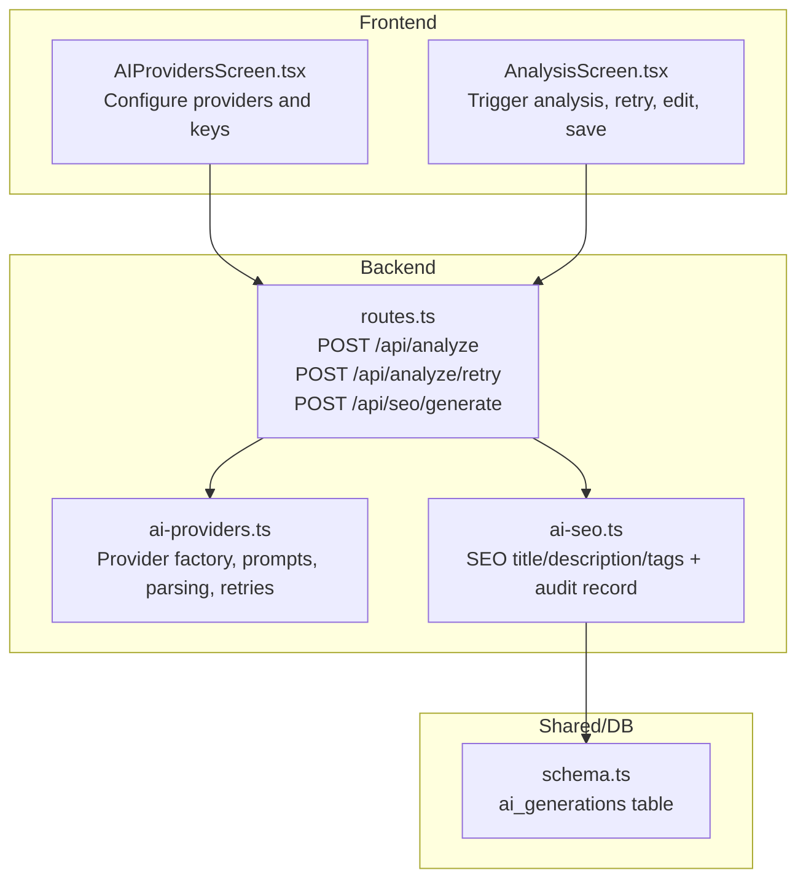
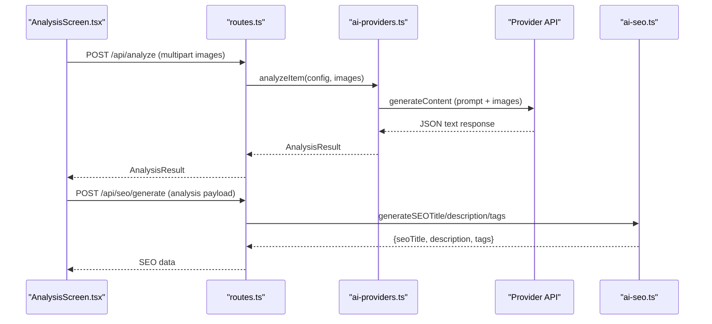
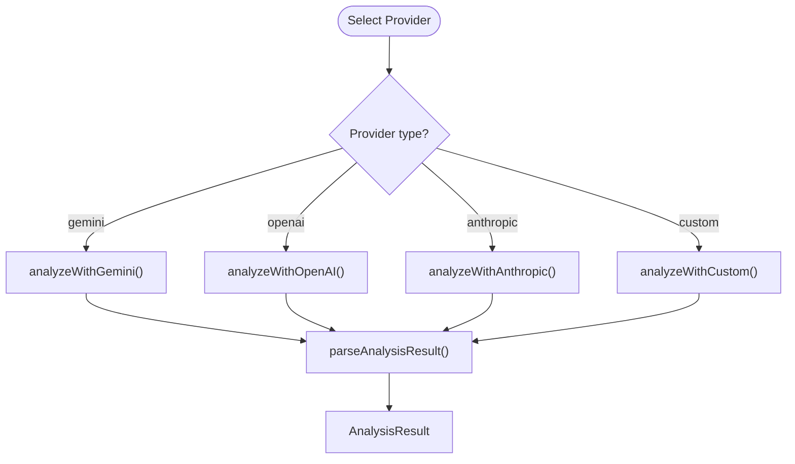
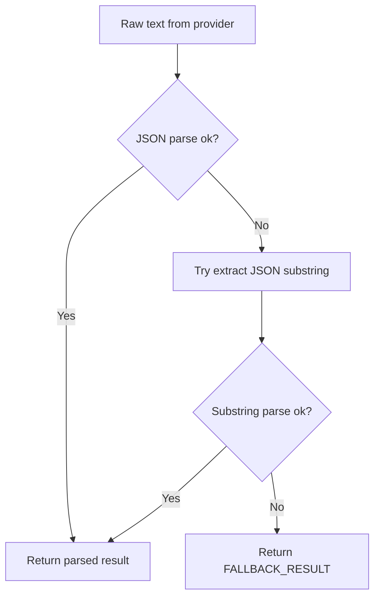
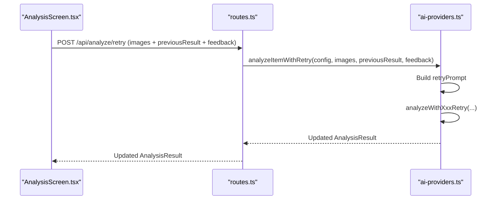
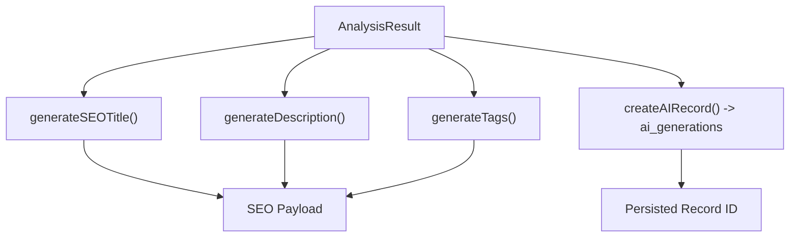
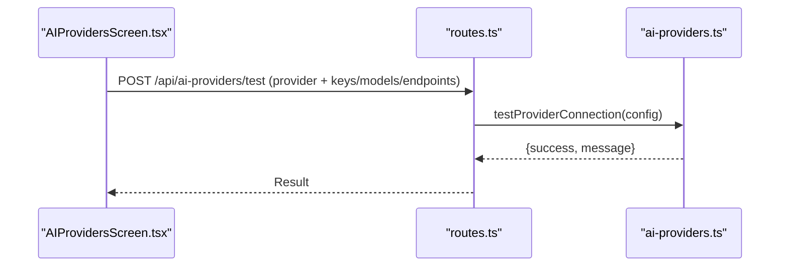
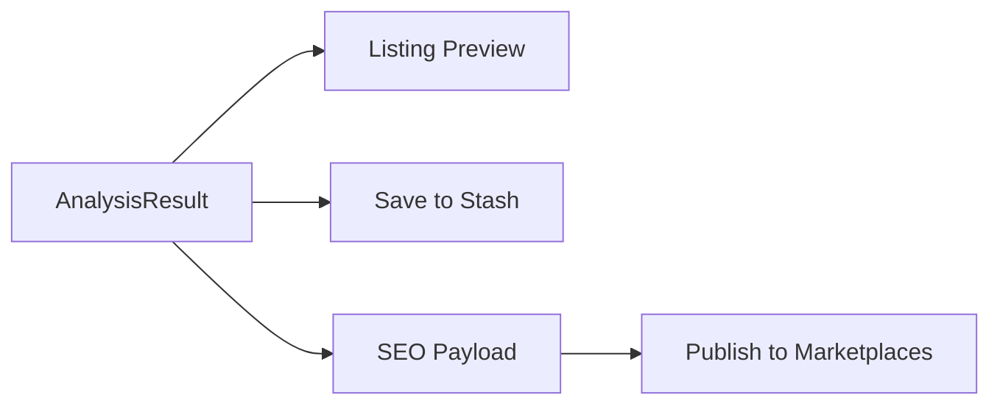
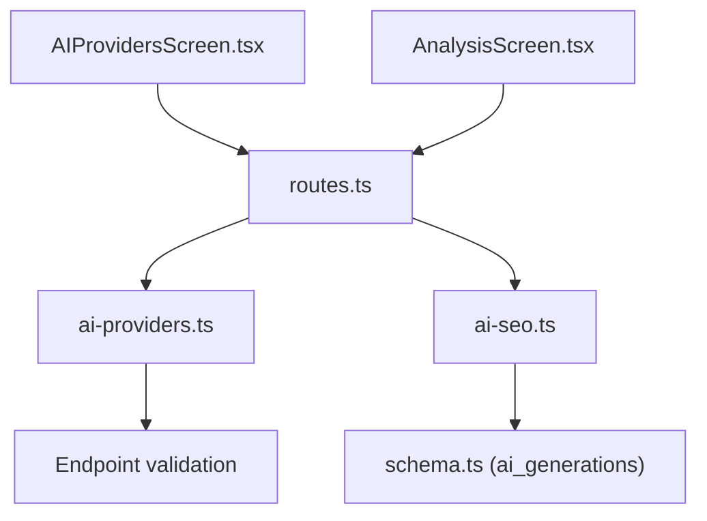

# AI Integration

<cite>
**Referenced Files in This Document**
- [ai-providers.ts](file://server/ai-providers.ts)
- [ai-seo.ts](file://server/ai-seo.ts)
- [routes.ts](file://server/routes.ts)
- [AIProvidersScreen.tsx](file://client/screens/AIProvidersScreen.tsx)
- [AnalysisScreen.tsx](file://client/screens/AnalysisScreen.tsx)
- [ENVIRONMENT.md](file://ENVIRONMENT.md)
- [schema.ts](file://shared/schema.ts)
- [utils.ts](file://server/replit_integrations/batch/utils.ts)
</cite>

## Table of Contents
1. [Introduction](#introduction)
2. [Project Structure](#project-structure)
3. [Core Components](#core-components)
4. [Architecture Overview](#architecture-overview)
5. [Detailed Component Analysis](#detailed-component-analysis)
6. [Dependency Analysis](#dependency-analysis)
7. [Performance Considerations](#performance-considerations)
8. [Troubleshooting Guide](#troubleshooting-guide)
9. [Conclusion](#conclusion)
10. [Appendices](#appendices)

## Introduction
This document explains Hidden-Gem’s AI integration system, focusing on the AI provider factory supporting Google Gemini, OpenAI, Anthropic, and custom/local endpoints. It covers configuration options, API key management, provider selection logic, the item analysis workflow from image capture through AI processing to authentication results and market valuation, SEO optimization for marketplace listings, retry mechanisms, error handling, and fallback strategies. It also documents the AI analysis pipeline, result interpretation, integration with the marketplace publishing system, performance considerations, cost optimization, and rate limiting strategies.

## Project Structure
The AI integration spans three layers:
- Frontend (React Native): Screens for configuring AI providers and reviewing analysis results.
- Backend (Express): Routes for image analysis, retry analysis, and SEO generation; provider abstraction and parsing logic.
- Shared/Infrastructure: Database schema for AI records and batch utilities for rate-limited processing.

**Diagram sources**
- [AIProvidersScreen.tsx](file://client/screens/AIProvidersScreen.tsx#L104-L263)
- [AnalysisScreen.tsx](file://client/screens/AnalysisScreen.tsx#L78-L143)
- [routes.ts](file://server/routes.ts#L672-L711)
- [ai-providers.ts](file://server/ai-providers.ts#L380-L442)
- [ai-seo.ts](file://server/ai-seo.ts#L80-L111)
- [schema.ts](file://shared/schema.ts#L174-L187)

**Section sources**
- [ENVIRONMENT.md](file://ENVIRONMENT.md#L12-L68)
- [routes.ts](file://server/routes.ts#L44-L711)
- [ai-providers.ts](file://server/ai-providers.ts#L1-L696)
- [ai-seo.ts](file://server/ai-seo.ts#L1-L112)
- [schema.ts](file://shared/schema.ts#L174-L187)

## Core Components
- AI Provider Factory: Selects and invokes the appropriate provider (Gemini, OpenAI, Anthropic, Custom) with validated configuration and images.
- Analysis Prompt and Result Parsing: A structured prompt drives a comprehensive appraisal; results are parsed into a unified AnalysisResult shape with robust fallbacks.
- Retry Mechanism: Seller feedback triggers a refined analysis using a retry prompt template.
- SEO Generation: Produces eBay-compliant titles, formatted descriptions, and tags; optionally persists an audit trail.
- Frontend Provider Configuration: Secure local storage for keys; model selection; connection tests per provider.
- Marketplace Integration: Results feed into listing previews and can be saved to stash for later publishing.

**Section sources**
- [ai-providers.ts](file://server/ai-providers.ts#L380-L442)
- [ai-providers.ts](file://server/ai-providers.ts#L131-L180)
- [ai-providers.ts](file://server/ai-providers.ts#L398-L442)
- [ai-seo.ts](file://server/ai-seo.ts#L17-L74)
- [AIProvidersScreen.tsx](file://client/screens/AIProvidersScreen.tsx#L104-L263)
- [AnalysisScreen.tsx](file://client/screens/AnalysisScreen.tsx#L78-L143)

## Architecture Overview
The AI pipeline begins when the frontend captures item and label images and sends them to the backend. The backend selects the active provider, constructs a multimodal prompt with images, queries the provider, parses the response, and returns a rich analysis. The frontend displays results, allows edits, and supports retry with feedback. SEO generation produces marketplace-ready content and optionally stores an audit record.

**Diagram sources**
- [AnalysisScreen.tsx](file://client/screens/AnalysisScreen.tsx#L111-L143)
- [routes.ts](file://server/routes.ts#L672-L711)
- [ai-providers.ts](file://server/ai-providers.ts#L380-L396)
- [ai-seo.ts](file://server/ai-seo.ts#L80-L111)

## Detailed Component Analysis

### AI Provider Factory and Configuration
- Provider Types: Supports “gemini”, “openai”, “anthropic”, and “custom”.
- Configuration Options:
  - provider: Selected AI provider.
  - apiKey: Optional; falls back to environment variables for Gemini.
  - endpoint: Required for “custom”; validated against private/internal address patterns.
  - model: Provider-specific model name; defaults applied when omitted.
- Environment Variables:
  - Gemini: AI_INTEGRATIONS_GEMINI_API_KEY and AI_INTEGRATIONS_GEMINI_BASE_URL (auto-configured on Replit).
- Frontend Storage:
  - Secure local storage for API keys and model preferences; supports web and native secure stores.
- Provider Selection Logic:
  - analyzeItem dispatches to provider-specific handlers based on config.provider.
  - testProviderConnection validates connectivity for each provider.

**Diagram sources**
- [ai-providers.ts](file://server/ai-providers.ts#L380-L396)
- [ai-providers.ts](file://server/ai-providers.ts#L131-L180)

**Section sources**
- [ai-providers.ts](file://server/ai-providers.ts#L3-L41)
- [ai-providers.ts](file://server/ai-providers.ts#L182-L222)
- [ai-providers.ts](file://server/ai-providers.ts#L380-L396)
- [AIProvidersScreen.tsx](file://client/screens/AIProvidersScreen.tsx#L104-L263)
- [ENVIRONMENT.md](file://ENVIRONMENT.md#L43-L46)

### Analysis Prompt and Result Interpretation
- Prompt Scope: Authentication assessment, market valuation, item identification, SEO metadata, and item specifics (aspects).
- Output Schema: Unified AnalysisResult with legacy and enhanced fields (brand, subtitles, descriptions, value ranges, confidence, authenticity, market analysis, aspects, marketplace categories).
- Parsing and Fallback:
  - Attempts strict JSON parse; if that fails, extracts JSON substring; falls back to predefined default result if parsing fails.
  - Merges partial results with fallback defaults to maintain backward compatibility.

**Diagram sources**
- [ai-providers.ts](file://server/ai-providers.ts#L131-L180)
- [ai-providers.ts](file://server/ai-providers.ts#L101-L129)

**Section sources**
- [ai-providers.ts](file://server/ai-providers.ts#L48-L99)
- [ai-providers.ts](file://server/ai-providers.ts#L131-L180)
- [ai-providers.ts](file://server/ai-providers.ts#L101-L129)

### Retry Mechanism and Feedback Loop
- Retry Prompt Template: Incorporates prior analysis and seller feedback to refine the assessment.
- Retry Flow:
  - Frontend collects feedback and re-sends images plus previous result and feedback.
  - Backend reconstructs a retry prompt and calls analyzeItemWithRetry.
  - Provider-specific retry handlers execute the updated prompt.
- Use Cases: Correcting misidentified brands, overlooked details, condition assessments, or authenticity concerns.

**Diagram sources**
- [AnalysisScreen.tsx](file://client/screens/AnalysisScreen.tsx#L145-L179)
- [routes.ts](file://server/routes.ts#L672-L711)
- [ai-providers.ts](file://server/ai-providers.ts#L418-L442)

**Section sources**
- [ai-providers.ts](file://server/ai-providers.ts#L398-L442)
- [routes.ts](file://server/routes.ts#L672-L711)
- [AnalysisScreen.tsx](file://client/screens/AnalysisScreen.tsx#L145-L179)

### SEO Optimization and Audit Trail
- SEO Content Generation:
  - generateSEOTitle: Builds eBay-compliant titles under 80 characters.
  - generateDescription: Formats marketplace descriptions with condition, brand, category, materials, color, dimensions, features, and market value.
  - generateTags: Produces SEO tags from brand, category, color, style, condition, material, and features.
- Audit Trail:
  - createAIRecord persists the analysis and generated listing to the ai_generations table, including model used, tokens used, cost estimate, and quality score.

**Diagram sources**
- [ai-seo.ts](file://server/ai-seo.ts#L17-L74)
- [ai-seo.ts](file://server/ai-seo.ts#L80-L111)
- [schema.ts](file://shared/schema.ts#L174-L187)

**Section sources**
- [ai-seo.ts](file://server/ai-seo.ts#L17-L111)
- [schema.ts](file://shared/schema.ts#L174-L187)

### Frontend Provider Configuration and Testing
- Configuration Screen:
  - Allows selecting the active provider and toggling between providers.
  - Stores API keys securely (SecureStore on native, AsyncStorage on web).
  - Supports model selection for OpenAI and Anthropic; endpoint and model for custom providers.
- Connection Testing:
  - Tests connectivity per provider using testProviderConnection and surfaces success/error messages.

**Diagram sources**
- [AIProvidersScreen.tsx](file://client/screens/AIProvidersScreen.tsx#L211-L263)
- [routes.ts](file://server/routes.ts#L604-L695)
- [ai-providers.ts](file://server/ai-providers.ts#L604-L695)

**Section sources**
- [AIProvidersScreen.tsx](file://client/screens/AIProvidersScreen.tsx#L104-L263)
- [routes.ts](file://server/routes.ts#L604-L695)
- [ENVIRONMENT.md](file://ENVIRONMENT.md#L43-L46)

### Marketplace Publishing Integration
- Listing Preview: The frontend renders eBay title, category, and aspects from the analysis result.
- Stashing: Users can save the item to their stash with the AI analysis included.
- eBay Integration: Separate endpoints manage listing updates, deletions, and token refresh.

**Diagram sources**
- [AnalysisScreen.tsx](file://client/screens/AnalysisScreen.tsx#L590-L633)
- [routes.ts](file://server/routes.ts#L838-L859)
- [routes.ts](file://server/routes.ts#L861-L906)

**Section sources**
- [AnalysisScreen.tsx](file://client/screens/AnalysisScreen.tsx#L590-L633)
- [routes.ts](file://server/routes.ts#L838-L906)

## Dependency Analysis
- Provider Abstraction:
  - routes.ts depends on ai-providers.ts for analysis and retry logic.
  - ai-seo.ts depends on shared schema types and db for audit records.
- Security and Validation:
  - ai-providers.ts enforces custom endpoint URL validity and blocks private/internal addresses.
  - Frontend uses secure storage for API keys.
- Rate Limiting Utilities:
  - batch utilities support concurrency control and exponential backoff for batch processing.

**Diagram sources**
- [routes.ts](file://server/routes.ts#L9-L18)
- [ai-providers.ts](file://server/ai-providers.ts#L188-L222)
- [ai-seo.ts](file://server/ai-seo.ts#L13-L15)
- [schema.ts](file://shared/schema.ts#L174-L187)
- [AIProvidersScreen.tsx](file://client/screens/AIProvidersScreen.tsx#L104-L263)
- [AnalysisScreen.tsx](file://client/screens/AnalysisScreen.tsx#L78-L143)

**Section sources**
- [ai-providers.ts](file://server/ai-providers.ts#L188-L222)
- [utils.ts](file://server/replit_integrations/batch/utils.ts#L48-L89)

## Performance Considerations
- Concurrency and Retries:
  - Use batch utilities to limit concurrent requests and retry on rate limit/quota errors with exponential backoff.
- Cost Optimization:
  - Prefer lower-cost models for initial analysis; reserve higher-capability models for retries or complex items.
  - Monitor tokens used and adjust prompts to reduce length.
- Rate Limiting Strategies:
  - Respect provider quotas; implement jittered delays and capped concurrency.
  - Use SSE-friendly batch processing for long-running tasks.
- Image Handling:
  - Keep images within size limits; compress where possible to reduce payload sizes.

[No sources needed since this section provides general guidance]

## Troubleshooting Guide
- Provider Connectivity:
  - Use the provider test function to validate keys, endpoints, and models.
  - Check environment variables for Gemini integration.
- Parsing Failures:
  - If AI returns non-JSON or malformed JSON, the parser extracts a JSON substring; otherwise, a fallback result is returned.
- Retry Failures:
  - Ensure previousResult and feedback are provided; verify provider configuration matches the original analysis.
- SEO Generation Errors:
  - Confirm analysis object is present; check audit record creation if sellerId and imageUrl are provided.

**Section sources**
- [AIProvidersScreen.tsx](file://client/screens/AIProvidersScreen.tsx#L211-L263)
- [ENVIRONMENT.md](file://ENVIRONMENT.md#L191-L195)
- [ai-providers.ts](file://server/ai-providers.ts#L131-L180)
- [routes.ts](file://server/routes.ts#L672-L711)
- [routes.ts](file://server/routes.ts#L840-L859)

## Conclusion
Hidden-Gem’s AI integration provides a robust, extensible pipeline for item analysis, authentication, market valuation, and SEO optimization. The provider factory supports multiple backends with secure configuration and validation, while the frontend enables seamless provider selection, testing, and result iteration. The system includes retry logic, fallback parsing, and an audit trail for traceability, integrating smoothly with marketplace publishing workflows.

[No sources needed since this section summarizes without analyzing specific files]

## Appendices

### Provider Configuration Examples
- Gemini (Replit integration):
  - Leave API key blank to use Replit’s configured key; optional custom key overrides.
- OpenAI:
  - Provide API key and select model (e.g., gpt-4o).
- Anthropic:
  - Provide API key and select model (e.g., claude-sonnet-4-20250514).
- Custom/Local:
  - Provide endpoint URL (OpenAI-compatible), optional API key, and model name.

**Section sources**
- [AIProvidersScreen.tsx](file://client/screens/AIProvidersScreen.tsx#L311-L563)
- [ENVIRONMENT.md](file://ENVIRONMENT.md#L43-L46)

### Analysis Workflow Patterns
- Initial Analysis: Send full item and label images; receive structured result with authentication, valuation, and SEO metadata.
- Editing: Adjust title, subtitle, price, condition, descriptions, aspects, and categories.
- Retry: Provide feedback to refine the analysis; resend images and previous result.

**Section sources**
- [AnalysisScreen.tsx](file://client/screens/AnalysisScreen.tsx#L111-L179)
- [routes.ts](file://server/routes.ts#L672-L711)

### Result Processing Patterns
- Use generateSEOTitle, generateDescription, and generateTags for marketplace-ready content.
- Persist audit records with createAIRecord for compliance and analytics.

**Section sources**
- [ai-seo.ts](file://server/ai-seo.ts#L17-L111)
- [schema.ts](file://shared/schema.ts#L174-L187)