# AI Provider System

<cite>
**Referenced Files in This Document**
- [ai-providers.ts](file://server/ai-providers.ts)
- [routes.ts](file://server/routes.ts)
- [AIProvidersScreen.tsx](file://client/screens/AIProvidersScreen.tsx)
- [AnalysisScreen.tsx](file://client/screens/AnalysisScreen.tsx)
- [ai-seo.ts](file://server/ai-seo.ts)
- [schema.ts](file://shared/schema.ts)
- [types.ts](file://shared/types.ts)
- [EmmaChat.tsx](file://client/components/EmmaChat.tsx)
- [chat/routes.ts](file://server/replit_integrations/chat/routes.ts)
- [chat/storage.ts](file://server/replit_integrations/chat/storage.ts)
- [chat/index.ts](file://server/replit_integrations/chat/index.ts)
</cite>

## Update Summary
**Changes Made**
- Enhanced AI provider system with Emma Floating Chat Assistant integration
- Added comprehensive chat endpoints with stash context integration
- Implemented authentication middleware for protected chat access
- Integrated real-time SSE streaming with live typing indicators
- Added personalized greeting messages and suggested prompts
- Extended stash context functionality for user-specific AI assistance
- Enhanced provider selection logic to support new chat capabilities

## Table of Contents
1. [Introduction](#introduction)
2. [Project Structure](#project-structure)
3. [Core Components](#core-components)
4. [Architecture Overview](#architecture-overview)
5. [Detailed Component Analysis](#detailed-component-analysis)
6. [Dependency Analysis](#dependency-analysis)
7. [Performance Considerations](#performance-considerations)
8. [Troubleshooting Guide](#troubleshooting-guide)
9. [Conclusion](#conclusion)

## Introduction
This document describes the AI provider factory system in Hidden-Gem, which abstracts multiple AI services behind a unified interface for item analysis and listing generation. The system now includes OpenFang as a sophisticated multi-model AI routing provider alongside existing Gemini, OpenAI, and Anthropic services. **Updated**: Enhanced with Emma Floating Chat Assistant integration featuring real-time SSE streaming, personalized greetings, stash context integration, and comprehensive chat functionality. The system covers provider configuration, authentication, endpoint management, validation, security restrictions for custom endpoints, unified analysis interface, provider-specific implementations, connection testing, error handling, and performance considerations.

## Project Structure
The AI provider system spans both the backend server and the React Native client, now including comprehensive chat functionality:
- Backend: AI provider factory, routes, SEO utilities, and chat integration
- Frontend: Provider configuration UI, analysis workflow, and Emma chat assistant
- Shared: Types and database schema for AI audit trails and chat storage

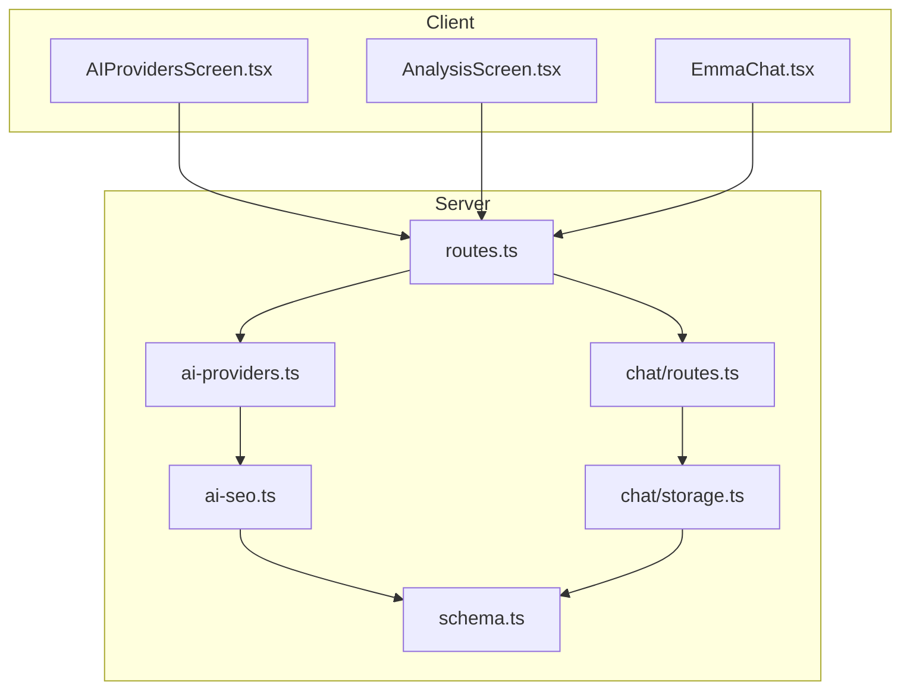

**Diagram sources**
- [routes.ts:905-930](file://server/routes.ts#L905-L930)
- [ai-providers.ts:822-983](file://server/ai-providers.ts#L822-L983)
- [ai-seo.ts:1-110](file://server/ai-seo.ts#L1-L110)
- [schema.ts:236-255](file://shared/schema.ts#L236-L255)
- [EmmaChat.tsx:1-556](file://client/components/EmmaChat.tsx#L1-L556)
- [chat/routes.ts:1-137](file://server/replit_integrations/chat/routes.ts#L1-L137)
- [chat/storage.ts:1-67](file://server/replit_integrations/chat/storage.ts#L1-L67)

**Section sources**
- [routes.ts:1-1549](file://server/routes.ts#L1-L1549)
- [ai-providers.ts:1-983](file://server/ai-providers.ts#L1-L983)
- [AIProvidersScreen.tsx:1-1126](file://client/screens/AIProvidersScreen.tsx#L1-L1126)
- [AnalysisScreen.tsx:1-1398](file://client/screens/AnalysisScreen.tsx#L1-L1398)
- [ai-seo.ts:1-110](file://server/ai-seo.ts#L1-L110)
- [schema.ts:1-453](file://shared/schema.ts#L1-L453)
- [EmmaChat.tsx:1-556](file://client/components/EmmaChat.tsx#L1-L556)
- [chat/routes.ts:1-137](file://server/replit_integrations/chat/routes.ts#L1-L137)
- [chat/storage.ts:1-67](file://server/replit_integrations/chat/storage.ts#L1-L67)

## Core Components
- AIProviderConfig: Unified configuration interface for all providers including OpenFang
- AIProviderType: Enumerated provider types including the new "openfang" with multi-model routing
- AnalysisResult: Unified result structure for all providers with enhanced fields
- Provider factory functions: analyzeItem, analyzeItemWithRetry, testProviderConnection
- Provider-specific implementations: Google Gemini, OpenAI, Anthropic, OpenFang (enhanced), Custom
- **New**: EmmaChat component with real-time streaming and personalized interaction
- **New**: Chat routes with authentication middleware and stash context integration
- **New**: Chat storage layer for conversation persistence and message management
- Connection testing and validation utilities with OpenFang-specific routing verification
- Security restrictions for custom endpoints

**Section sources**
- [ai-providers.ts:3-51](file://server/ai-providers.ts#L3-L51)
- [ai-providers.ts:216-226](file://server/ai-providers.ts#L216-L226)
- [ai-providers.ts:822-983](file://server/ai-providers.ts#L822-L983)
- [EmmaChat.tsx:21-41](file://client/components/EmmaChat.tsx#L21-L41)
- [chat/routes.ts:5-17](file://server/replit_integrations/chat/routes.ts#L5-L17)
- [chat/storage.ts:5-20](file://server/replit_integrations/chat/storage.ts#L5-L20)

## Architecture Overview
The system exposes a unified API to clients while delegating provider-specific logic to dedicated handlers. The backend validates configurations, enforces security, and parses provider responses into a standardized format. **Updated**: The enhanced OpenFang provider adds sophisticated multi-model routing capabilities with automatic vision model selection and intelligent fallback mechanisms. **Updated**: Emma Floating Chat Assistant provides real-time AI assistance with personalized greetings, suggested prompts, and stash context integration. **Updated**: The system now includes comprehensive chat functionality with authentication middleware and SSE streaming.

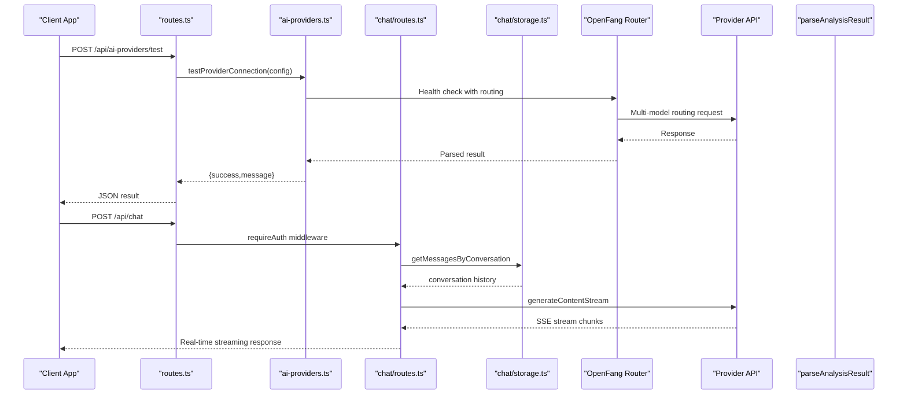

**Diagram sources**
- [routes.ts:905-930](file://server/routes.ts#L905-L930)
- [routes.ts:348-418](file://server/routes.ts#L348-L418)
- [ai-providers.ts:398-463](file://server/ai-providers.ts#L398-L463)
- [ai-providers.ts:150-214](file://server/ai-providers.ts#L150-L214)
- [chat/routes.ts:74-135](file://server/replit_integrations/chat/routes.ts#L74-L135)
- [chat/storage.ts:51-66](file://server/replit_integrations/chat/storage.ts#L51-L66)

## Detailed Component Analysis

### AI Provider Factory
The factory defines a unified interface and implements provider-specific logic with validation and security checks. **Updated**: The factory now includes OpenFang as a supported provider with advanced multi-model routing capabilities and automatic fallback mechanisms. **Updated**: Gemini is configured as the default provider, while OpenFang provides optional multi-model routing.

```mermaid
classDiagram
class AIProviderConfig {
+string provider
+string apiKey
+string endpoint
+string model
}
class AnalysisResult {
+string title
+string description
+string category
+string estimatedValue
+string condition
+string seoTitle
+string seoDescription
+string[] seoKeywords
+string[] tags
+string brand
+string subtitle
+string shortDescription
+string fullDescription
+number estimatedValueLow
+number estimatedValueHigh
+number suggestedListPrice
+string confidence
+string authenticity
+number authenticityConfidence
+string authenticityDetails
+string[] authenticationTips
+string marketAnalysis
+Record~string,string[]~ aspects
+string ebayCategoryId
+string wooCategory
}
class ProviderFactory {
+analyzeItem(config, images) AnalysisResult
+analyzeItemWithRetry(config, images, previousResult, feedback) AnalysisResult
+testProviderConnection(config) {success,message}
-validateProvider(provider) boolean
-validateCustomEndpoint(endpoint) void
-parseAnalysisResult(text) AnalysisResult
}
AIProviderConfig --> ProviderFactory : "consumes"
AnalysisResult --> ProviderFactory : "produces"
```

**Diagram sources**
- [ai-providers.ts:10-15](file://server/ai-providers.ts#L10-L15)
- [ai-providers.ts:17-51](file://server/ai-providers.ts#L17-L51)
- [ai-providers.ts:216-226](file://server/ai-providers.ts#L216-L226)
- [ai-providers.ts:822-983](file://server/ai-providers.ts#L822-L983)

**Section sources**
- [ai-providers.ts:10-15](file://server/ai-providers.ts#L10-L15)
- [ai-providers.ts:17-51](file://server/ai-providers.ts#L17-L51)
- [ai-providers.ts:216-226](file://server/ai-providers.ts#L216-L226)
- [ai-providers.ts:822-983](file://server/ai-providers.ts#L822-L983)

### Provider Selection Logic
The factory routes requests based on the provider field, with validation and fallback behavior. **Updated**: The enhanced OpenFang provider uses sophisticated routing with automatic model selection and intelligent fallback mechanisms. **Updated**: Gemini is configured as the default provider with OpenFang as an optional multi-model routing option.

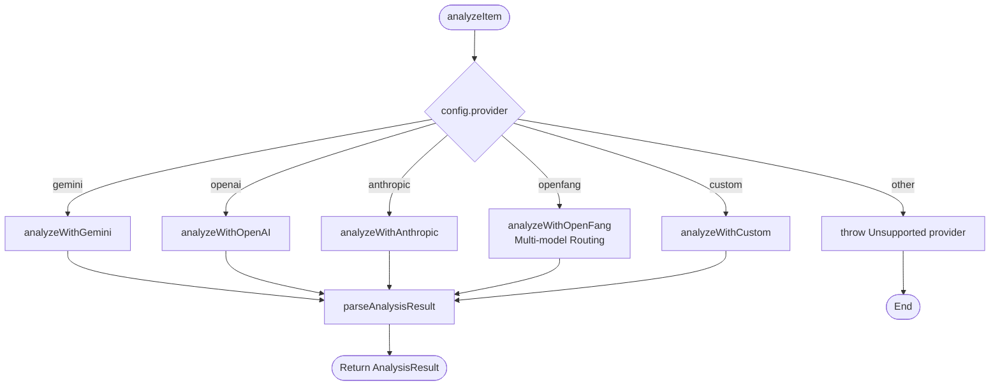

**Diagram sources**
- [ai-providers.ts:515-533](file://server/ai-providers.ts#L515-L533)
- [ai-providers.ts:282-308](file://server/ai-providers.ts#L282-L308)
- [ai-providers.ts:310-349](file://server/ai-providers.ts#L310-L349)
- [ai-providers.ts:351-396](file://server/ai-providers.ts#L351-L396)
- [ai-providers.ts:398-463](file://server/ai-providers.ts#L398-L463)
- [ai-providers.ts:465-513](file://server/ai-providers.ts#L465-L513)

**Section sources**
- [ai-providers.ts:515-533](file://server/ai-providers.ts#L515-L533)

### Validation and Security
- Provider validation ensures only supported providers are accepted (including the new "openfang")
- Custom endpoint validation enforces HTTPS and blocks private/internal addresses
- API key requirements per provider with OpenFang-specific routing verification
- **New**: Authentication middleware for protected chat access with bearer token validation

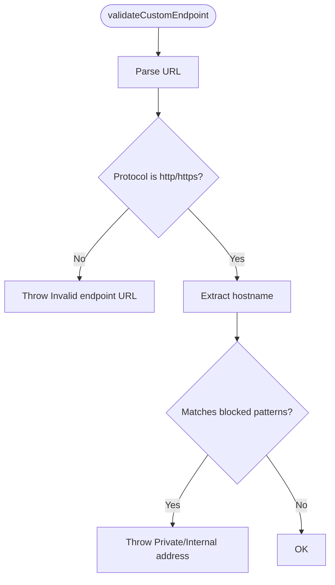

**Diagram sources**
- [ai-providers.ts:228-280](file://server/ai-providers.ts#L228-L280)

**Section sources**
- [ai-providers.ts:216-226](file://server/ai-providers.ts#L216-L226)
- [ai-providers.ts:228-280](file://server/ai-providers.ts#L228-L280)

### Unified Analysis Interface
The system standardizes provider outputs into a single result structure, merging defaults for backward compatibility with enhanced fields for better item analysis.

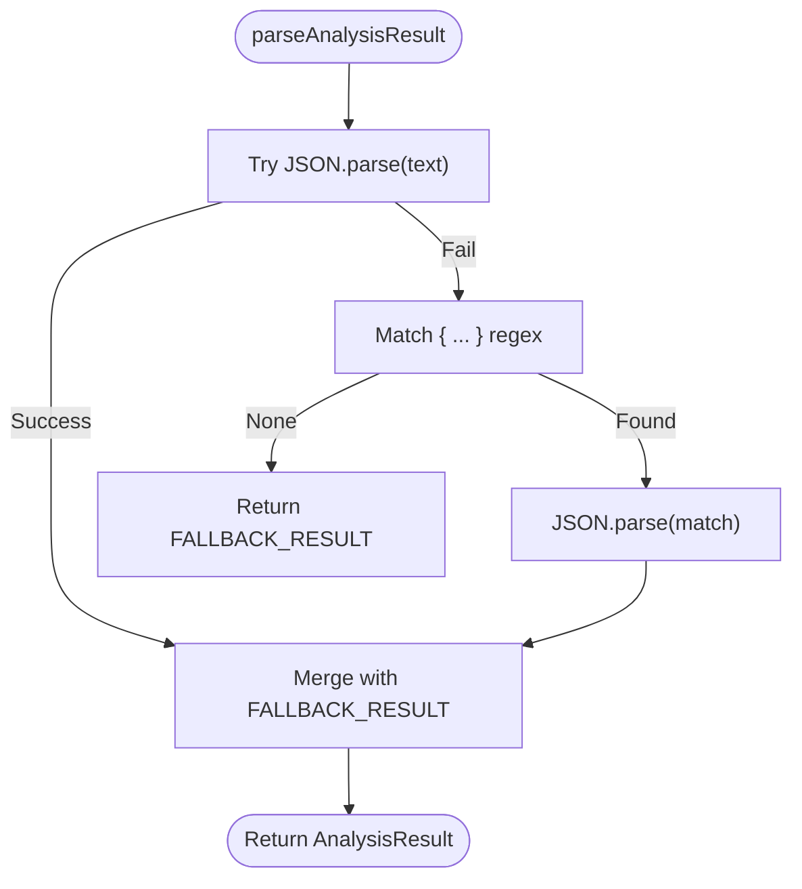

**Diagram sources**
- [ai-providers.ts:150-214](file://server/ai-providers.ts#L150-L214)
- [ai-providers.ts:111-148](file://server/ai-providers.ts#L111-L148)

**Section sources**
- [ai-providers.ts:150-214](file://server/ai-providers.ts#L150-L214)
- [ai-providers.ts:111-148](file://server/ai-providers.ts#L111-L148)

### Provider-Specific Implementations

#### Google Gemini (Default Provider)
- Uses @google/genai SDK
- Supports Replit AI integrations via environment variables
- Model defaults to a modern Flash model
- Response parsed as JSON
- **Updated**: Now configured as the default provider for optimal user experience

**Section sources**
- [ai-providers.ts:282-308](file://server/ai-providers.ts#L282-L308)

#### OpenAI
- Requires API key
- Sends images as base64 data URLs
- Uses Chat Completions with JSON response format
- Validates response and extracts content

**Section sources**
- [ai-providers.ts:310-349](file://server/ai-providers.ts#L310-L349)

#### Anthropic
- Requires API key
- Sends images as base64 with image type
- Uses Messages API with Claude models
- Extracts text content from response

**Section sources**
- [ai-providers.ts:351-396](file://server/ai-providers.ts#L351-L396)

#### OpenFang (Enhanced - Optional Multi-Model Routing)
- **New Provider**: Sophisticated multi-model AI routing with automatic vision model selection
- Requires API key and base URL configuration
- Supports advanced routing configuration with "prefer" and "fallback" arrays
- Built-in fallback to GPT-4o, Gemini 2.5 Flash, and Claude Sonnet 4 for reliability
- Automatic vision model selection for optimal image analysis performance
- Intelligent routing that prefers vision-capable models for image-heavy analysis
- Comprehensive fallback mechanisms to ensure analysis completion even with provider issues
- **Updated**: Available as optional multi-model routing option alongside the default Gemini provider

**Updated** Enhanced with multi-model routing capabilities, automatic vision model selection, and improved fallback mechanisms

**Section sources**
- [ai-providers.ts:398-463](file://server/ai-providers.ts#L398-L463)
- [ai-providers.ts:703-769](file://server/ai-providers.ts#L703-L769)

#### Custom Provider
- Validates endpoint URL and security restrictions
- Supports optional API key
- Builds OpenAI-compatible request body
- Detects existing v1/chat/completions endpoints

**Section sources**
- [ai-providers.ts:465-513](file://server/ai-providers.ts#L465-L513)
- [ai-providers.ts:228-280](file://server/ai-providers.ts#L228-L280)

### Connection Testing
The system provides a health-check endpoint for each provider, validating credentials and endpoint accessibility. **Updated**: The enhanced OpenFang provider includes specialized connection testing with routing verification and multi-model capability validation.

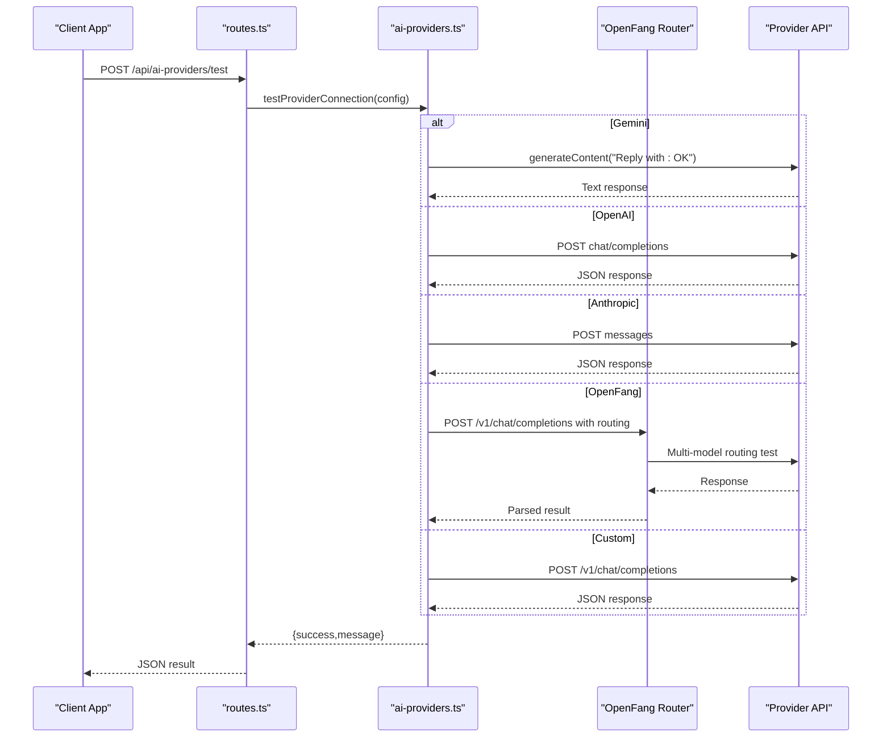

**Diagram sources**
- [routes.ts:905-930](file://server/routes.ts#L905-L930)
- [ai-providers.ts:822-983](file://server/ai-providers.ts#L822-L983)

**Section sources**
- [routes.ts:905-930](file://server/routes.ts#L905-L930)
- [ai-providers.ts:822-983](file://server/ai-providers.ts#L822-L983)

### Retry Mechanism
The system supports re-analysis with feedback, preserving the original prompt structure and adding a retry prompt template. **Updated**: The enhanced OpenFang provider maintains routing configuration during retries with intelligent fallback handling.

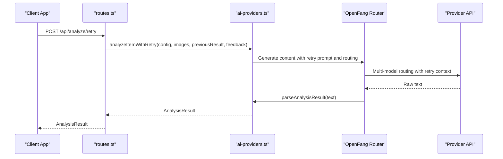

**Diagram sources**
- [routes.ts:932-1018](file://server/routes.ts#L932-L1018)
- [ai-providers.ts:555-582](file://server/ai-providers.ts#L555-L582)
- [ai-providers.ts:584-611](file://server/ai-providers.ts#L584-L611)
- [ai-providers.ts:703-769](file://server/ai-providers.ts#L703-L769)

**Section sources**
- [routes.ts:932-1018](file://server/routes.ts#L932-L1018)
- [ai-providers.ts:555-582](file://server/ai-providers.ts#L555-L582)
- [ai-providers.ts:584-611](file://server/ai-providers.ts#L584-L611)
- [ai-providers.ts:703-769](file://server/ai-providers.ts#L703-L769)

### Client Integration

#### Provider Configuration UI
The client allows users to configure providers, select models, and test connections. **Updated**: The enhanced OpenFang provider includes comprehensive multi-model routing configuration with automatic model selection and routing preference management. **Updated**: Gemini is pre-selected as the default provider.

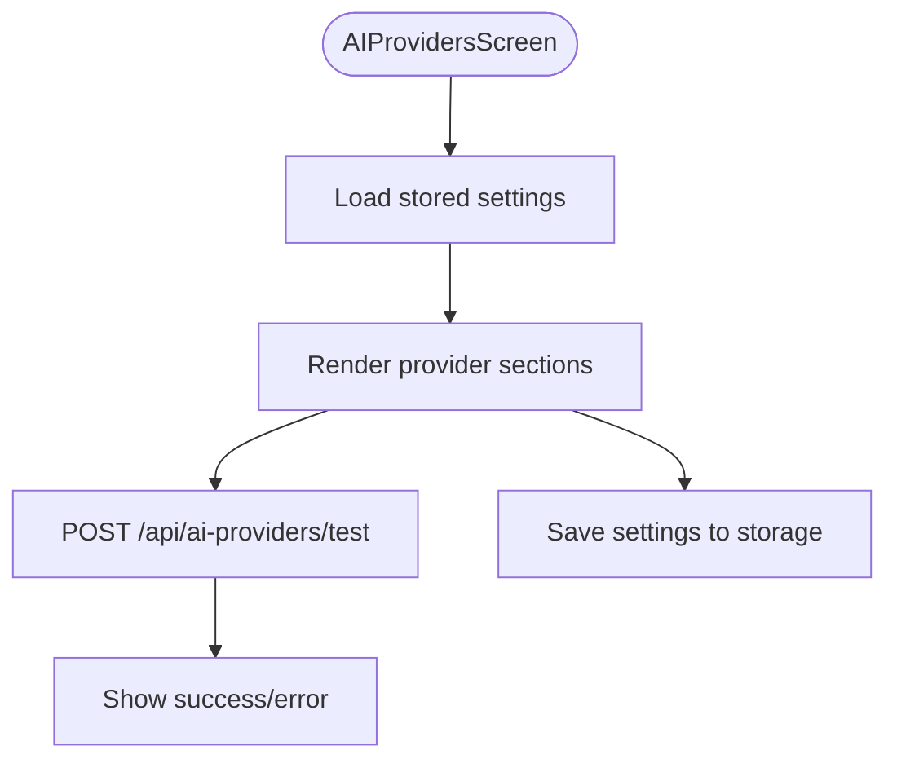

**Diagram sources**
- [AIProvidersScreen.tsx:171-213](file://client/screens/AIProvidersScreen.tsx#L171-L213)

**Section sources**
- [AIProvidersScreen.tsx:171-213](file://client/screens/AIProvidersScreen.tsx#L171-L213)

#### Analysis Workflow
The client triggers analysis, displays results, and supports editing and retry. **Updated**: The enhanced OpenFang provider maintains sophisticated routing configuration throughout the analysis process with automatic fallback handling. **Updated**: Gemini is configured as the default provider with OpenFang as an optional enhancement.

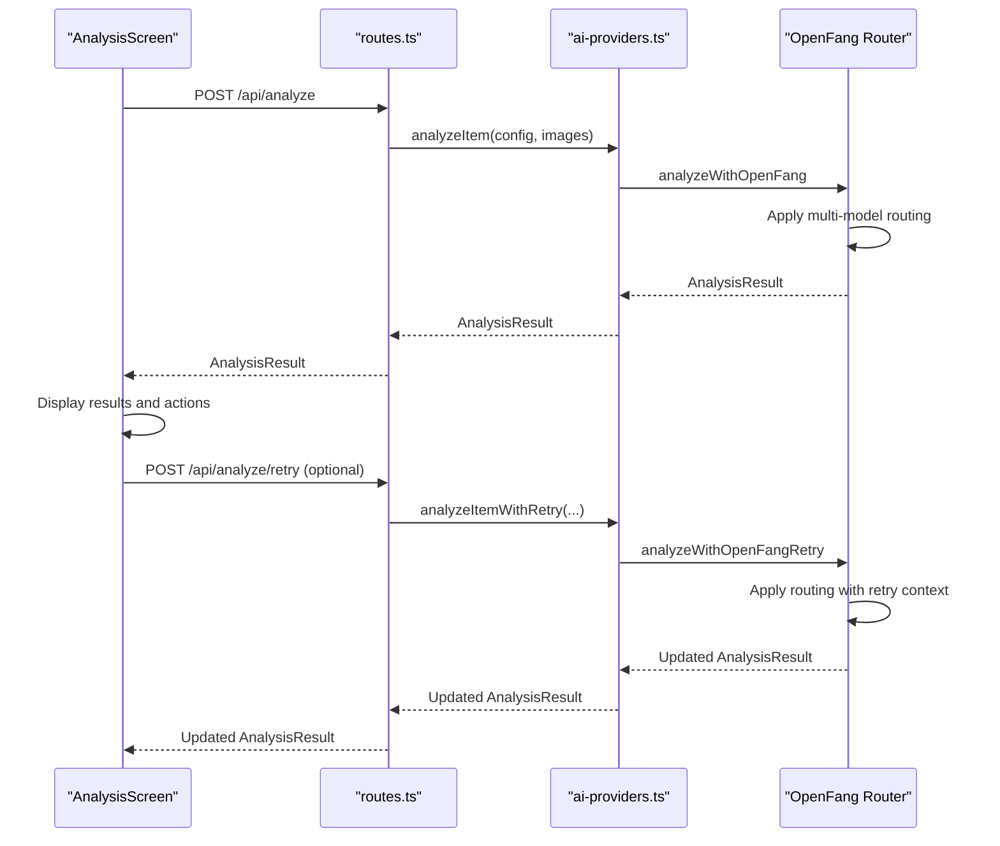

**Diagram sources**
- [AnalysisScreen.tsx:212-256](file://client/screens/AnalysisScreen.tsx#L212-L256)
- [AnalysisScreen.tsx:258-304](file://client/screens/AnalysisScreen.tsx#L258-L304)
- [routes.ts:348-418](file://server/routes.ts#L348-L418)
- [routes.ts:932-1018](file://server/routes.ts#L932-L1018)

**Section sources**
- [AnalysisScreen.tsx:212-256](file://client/screens/AnalysisScreen.tsx#L212-L256)
- [AnalysisScreen.tsx:258-304](file://client/screens/AnalysisScreen.tsx#L258-L304)
- [routes.ts:348-418](file://server/routes.ts#L348-L418)
- [routes.ts:932-1018](file://server/routes.ts#L932-L1018)

### Default Provider Logic
**Updated**: The system now implements Gemini as the default AI provider with OpenFang as an optional multi-model routing option. The default provider selection logic prioritizes user experience while maintaining flexibility for advanced users.

**Updated** Gemini is now the default provider, while OpenFang remains available as an optional multi-model routing option

**Section sources**
- [routes.ts:384-394](file://server/routes.ts#L384-L394)
- [routes.ts:969-979](file://server/routes.ts#L969-L979)
- [AIProvidersScreen.tsx:143](file://client/screens/AIProvidersScreen.tsx#L143)

### Emma Floating Chat Assistant

#### Chat Architecture
The Emma Floating Chat Assistant provides real-time AI assistance with comprehensive chat functionality including personalized greetings, suggested prompts, and stash context integration.

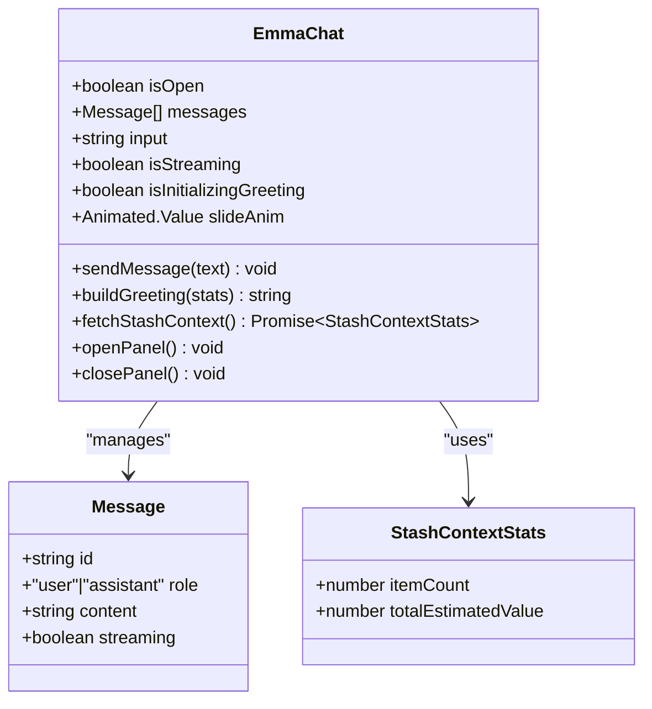

**Diagram sources**
- [EmmaChat.tsx:42-413](file://client/components/EmmaChat.tsx#L42-L413)
- [EmmaChat.tsx:21-41](file://client/components/EmmaChat.tsx#L21-L41)

#### Chat Routes and Authentication
The system provides protected chat endpoints with authentication middleware and stash context integration.

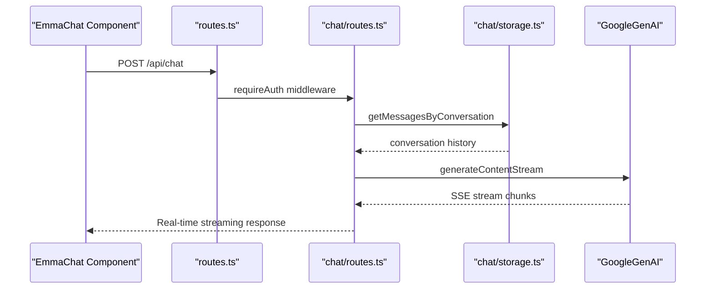

**Diagram sources**
- [chat/routes.ts:74-135](file://server/replit_integrations/chat/routes.ts#L74-L135)
- [chat/storage.ts:51-66](file://server/replit_integrations/chat/storage.ts#L51-L66)
- [routes.ts:1514-1516](file://server/routes.ts#L1514-L1516)

#### Stash Context Integration
The system integrates with stash data to provide personalized chat experiences based on user inventory.

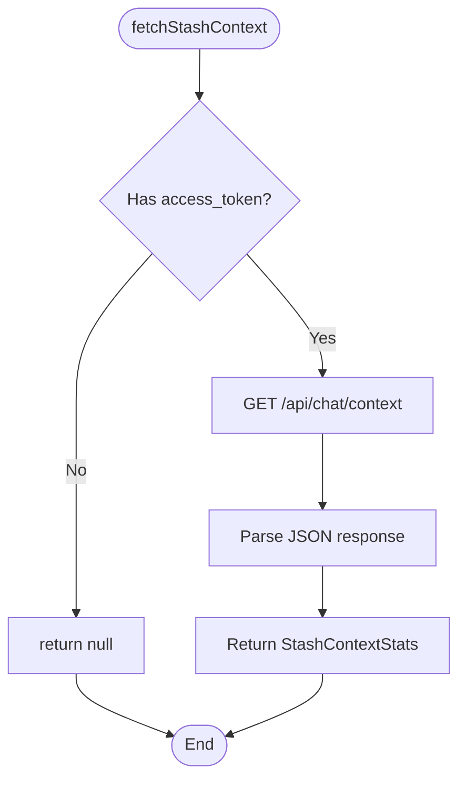

**Diagram sources**
- [EmmaChat.tsx:74-87](file://client/components/EmmaChat.tsx#L74-L87)
- [routes.ts:1501-1503](file://server/routes.ts#L1501-L1503)

**Section sources**
- [EmmaChat.tsx:1-556](file://client/components/EmmaChat.tsx#L1-L556)
- [chat/routes.ts:1-137](file://server/replit_integrations/chat/routes.ts#L1-L137)
- [chat/storage.ts:1-67](file://server/replit_integrations/chat/storage.ts#L1-L67)
- [routes.ts:1501-1516](file://server/routes.ts#L1501-L1516)

### SEO Generation and Audit Trail
The system generates SEO metadata and persists AI generations to the database.


**Diagram sources**
- [ai-seo.ts:17-72](file://server/ai-seo.ts#L17-L72)
- [ai-seo.ts:78-109](file://server/ai-seo.ts#L78-L109)
- [schema.ts:236-255](file://shared/schema.ts#L236-L255)

**Section sources**
- [ai-seo.ts:17-72](file://server/ai-seo.ts#L17-L72)
- [ai-seo.ts:78-109](file://server/ai-seo.ts#L78-L109)
- [schema.ts:236-255](file://shared/schema.ts#L236-L255)

## Dependency Analysis
The system exhibits clear separation of concerns with enhanced chat functionality:
- Client depends on server routes for AI operations and chat assistance
- Server routes depend on the AI provider factory and chat integration
- Factory depends on provider SDKs and environment variables
- Chat routes depend on authentication middleware and chat storage
- SEO utilities depend on shared types and schema

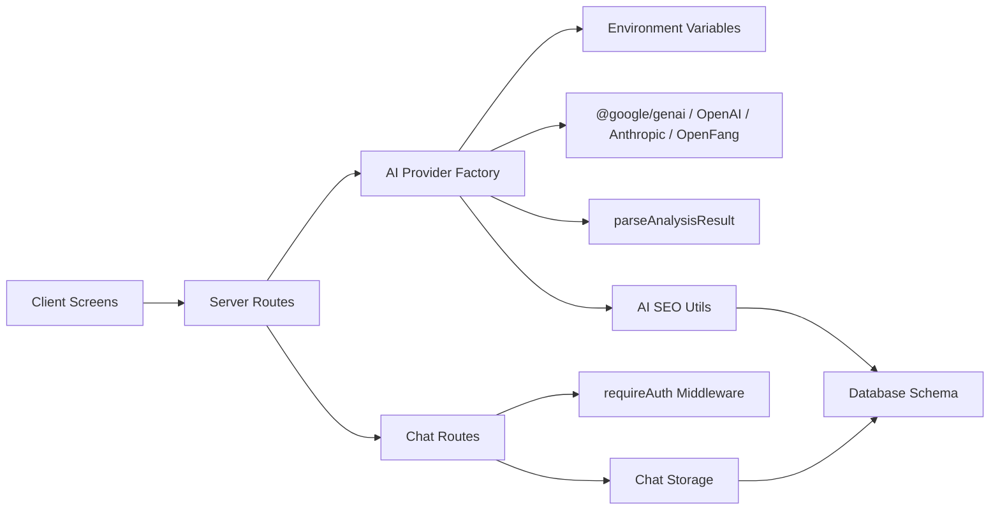

**Diagram sources**
- [routes.ts:18-24](file://server/routes.ts#L18-L24)
- [ai-providers.ts:1-3](file://server/ai-providers.ts#L1-L3)
- [chat/routes.ts:19](file://server/replit_integrations/chat/routes.ts#L19)
- [ai-seo.ts:13-15](file://server/ai-seo.ts#L13-L15)
- [schema.ts:236-255](file://shared/schema.ts#L236-L255)

**Section sources**
- [routes.ts:18-24](file://server/routes.ts#L18-L24)
- [ai-providers.ts:1-3](file://server/ai-providers.ts#L1-L3)
- [chat/routes.ts:19](file://server/replit_integrations/chat/routes.ts#L19)
- [ai-seo.ts:13-15](file://server/ai-seo.ts#L13-L15)
- [schema.ts:236-255](file://shared/schema.ts#L236-L255)

## Performance Considerations
- **Gemini**: Uses modern Flash model by default; configured as the default provider for optimal balance of speed and accuracy
- OpenAI: JSON response format reduces parsing overhead; ensure model selection aligns with budget and speed targets
- Anthropic: Uses Messages API; consider token limits and model capabilities
- **OpenFang**: Advanced multi-model routing with automatic vision model selection; built-in fallback mechanisms reduce provider downtime risk and improve analysis reliability
- Custom: Endpoint detection avoids extra round-trips; ensure endpoint performance and reliability
- Retry mechanism: Adds latency; use judiciously based on feedback quality
- **Emma Chat**: Real-time SSE streaming with efficient chunk processing; consider memory usage for long conversations
- **Chat Authentication**: Bearer token validation adds minimal overhead; ensure token caching for better performance
- CORS and logging middleware: Add minimal overhead; ensure they remain efficient under load

## Troubleshooting Guide
Common issues and resolutions:
- Provider not supported: Verify provider is one of gemini, openai, anthropic, openfang, custom
- Missing API key: OpenAI, Anthropic, and OpenFang require API keys; Gemini can use Replit integration
- Invalid endpoint URL: Must be HTTPS and not a private/internal address
- OpenAI/Anthropic/OpenFang errors: Check API keys, quotas, and endpoint availability
- Custom endpoint failures: Ensure endpoint supports OpenAI-compatible chat/completions
- **OpenFang routing issues**: Verify base URL configuration, routing preferences, and fallback model availability
- **OpenFang multi-model failures**: Check that vision-capable models are available in the routing configuration
- **Default provider issues**: If Gemini fails, verify Replit AI integration configuration or configure custom API key
- **Emma Chat streaming issues**: Check SSE headers, network connectivity, and server-side streaming configuration
- **Chat authentication failures**: Verify bearer token validity and user session status
- **Stash context loading**: Ensure user has items in stash and database queries execute successfully
- CORS issues: Verify allowed origins and headers in server setup
- Database connectivity: Confirm DATABASE_URL and migration status

**Section sources**
- [ai-providers.ts:216-226](file://server/ai-providers.ts#L216-L226)
- [ai-providers.ts:228-280](file://server/ai-providers.ts#L228-L280)
- [routes.ts:909-913](file://server/routes.ts#L909-L913)
- [chat/routes.ts:122-133](file://server/replit_integrations/chat/routes.ts#L122-L133)

## Conclusion
The AI provider factory system provides a robust, secure, and extensible abstraction over multiple AI services. **Updated**: The enhanced OpenFang integration significantly improves the system's capabilities with sophisticated multi-model routing, automatic vision model selection, and intelligent fallback mechanisms. **Updated**: Emma Floating Chat Assistant adds comprehensive real-time AI assistance with personalized greetings, suggested prompts, and stash context integration. **Updated**: The system now includes authentication middleware, SSE streaming, and comprehensive chat functionality. **Updated**: Gemini is configured as the default provider for optimal user experience, while OpenFang remains available as an optional multi-model routing option for advanced users. The system standardizes configuration, enforces security, and offers a unified result format. The client integrates seamlessly with provider testing, analysis workflows, and chat assistance, while the backend maintains clean separation of concerns and supports future provider additions. **Updated**: The OpenFang provider serves as the primary multi-model execution handler, providing enhanced reliability and performance through its advanced routing capabilities while maintaining Gemini as the default choice for most users. **Updated**: The Emma Chat Assistant provides continuous AI support with real-time streaming and personalized user experience.