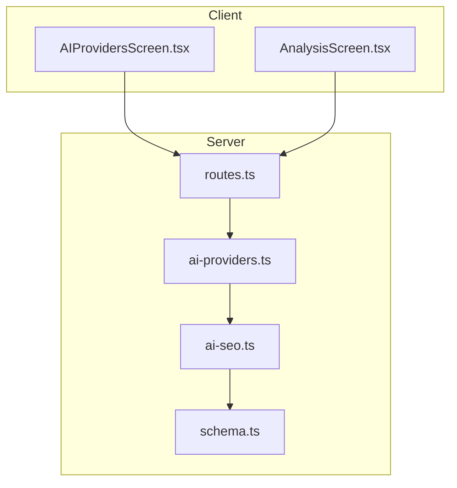
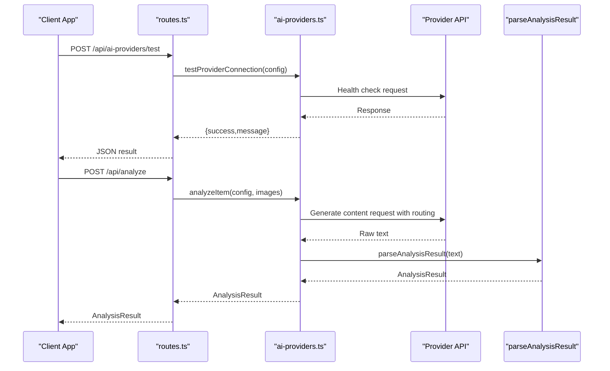
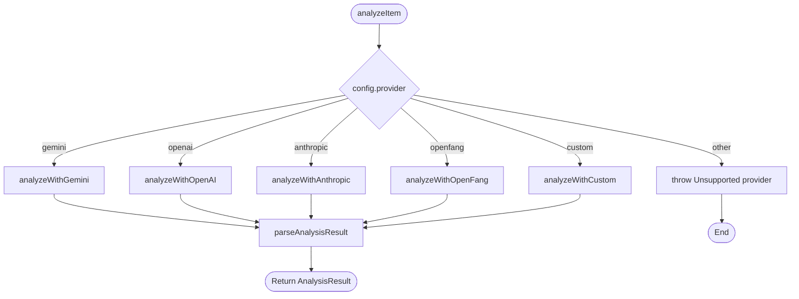
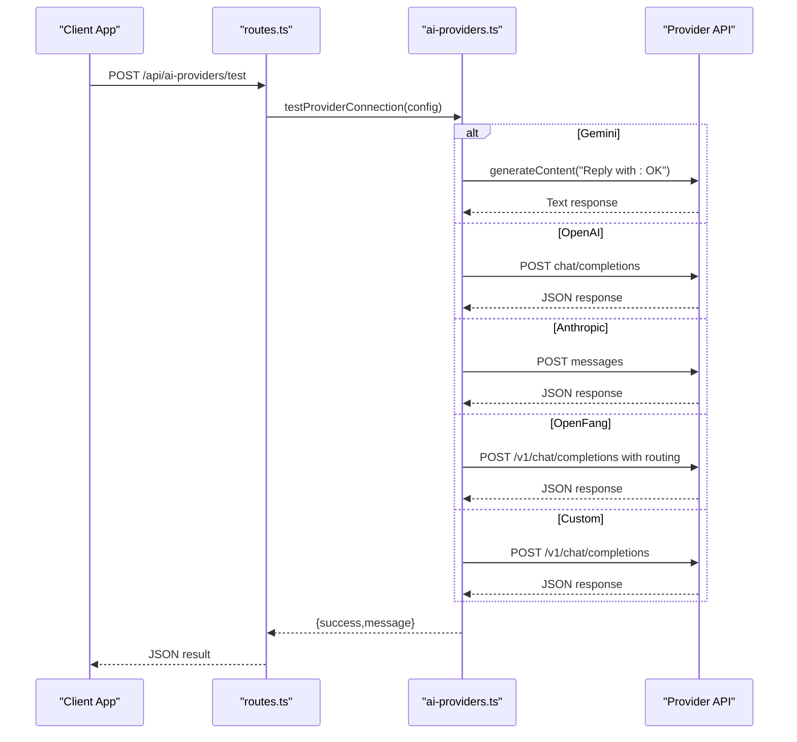
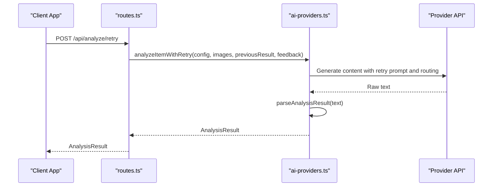
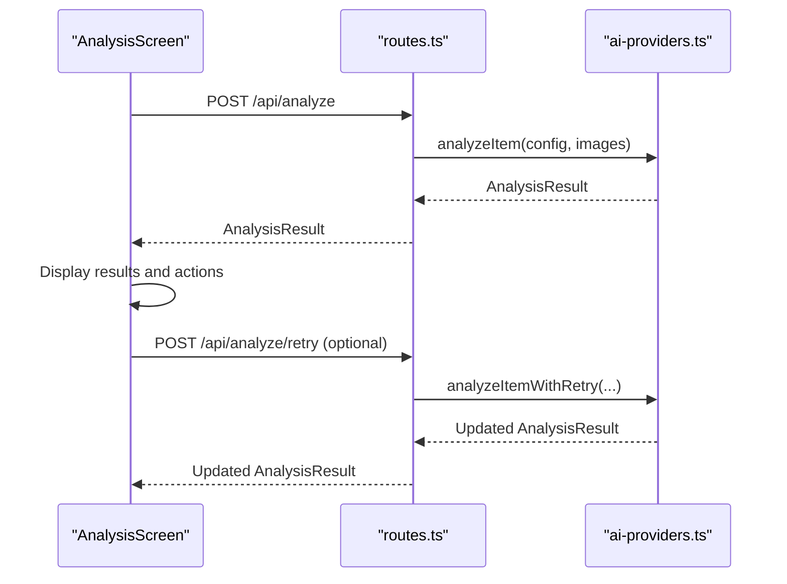
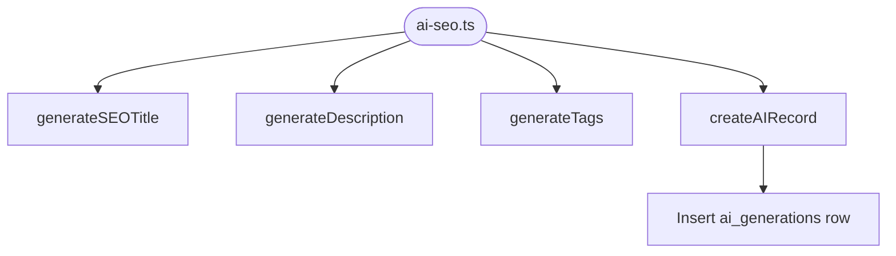
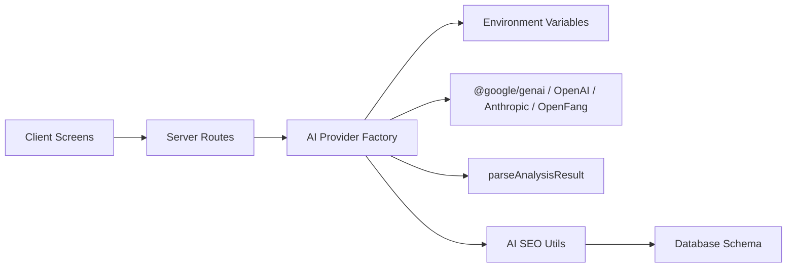

# AI Provider System

<cite>
**Referenced Files in This Document**
- [ai-providers.ts](file://server/ai-providers.ts)
- [routes.ts](file://server/routes.ts)
- [AIProvidersScreen.tsx](file://client/screens/AIProvidersScreen.tsx)
- [AnalysisScreen.tsx](file://client/screens/AnalysisScreen.tsx)
- [ai-seo.ts](file://server/ai-seo.ts)
- [ENVIRONMENT.md](file://ENVIRONMENT.md)
- [index.ts](file://server/index.ts)
- [types.ts](file://shared/types.ts)
- [schema.ts](file://shared/schema.ts)
- [0004_openfang_settings.sql](file://migrations/0004_openfang_settings.sql)
</cite>

## Update Summary
**Changes Made**
- Added OpenFang provider as a new AI provider alongside existing Gemini, OpenAI, and Anthropic services
- Enhanced AI providers configuration screen with OpenFang multi-model routing capabilities
- Updated database schema with OpenFang settings columns
- Added OpenFang-specific implementation with automatic model routing and fallback mechanisms
- Updated provider selection logic to support OpenFang routing configuration

## Table of Contents
1. [Introduction](#introduction)
2. [Project Structure](#project-structure)
3. [Core Components](#core-components)
4. [Architecture Overview](#architecture-overview)
5. [Detailed Component Analysis](#detailed-component-analysis)
6. [Dependency Analysis](#dependency-analysis)
7. [Performance Considerations](#performance-considerations)
8. [Troubleshooting Guide](#troubleshooting-guide)
9. [Conclusion](#conclusion)

## Introduction
This document describes the AI provider factory system in Hidden-Gem, which abstracts multiple AI services behind a unified interface for item analysis and listing generation. The system now includes OpenFang as a new provider option alongside existing Gemini, OpenAI, and Anthropic services. It covers provider configuration, authentication, endpoint management, validation, security restrictions for custom endpoints, unified analysis interface, provider-specific implementations, connection testing, error handling, and performance considerations.

## Project Structure
The AI provider system spans both the backend server and the React Native client:
- Backend: AI provider factory, routes, and SEO utilities
- Frontend: Provider configuration UI and analysis workflow
- Shared: Types and database schema for AI audit trails



**Diagram sources**
- [routes.ts:649-711](file://server/routes.ts#L649-L711)
- [ai-providers.ts:380-396](file://server/ai-providers.ts#L380-L396)
- [ai-seo.ts:1-112](file://server/ai-seo.ts#L1-L112)
- [schema.ts:174-187](file://shared/schema.ts#L174-L187)

**Section sources**
- [routes.ts:44-929](file://server/routes.ts#L44-L929)
- [ai-providers.ts:1-696](file://server/ai-providers.ts#L1-L696)
- [AIProvidersScreen.tsx:1-807](file://client/screens/AIProvidersScreen.tsx#L1-L807)
- [AnalysisScreen.tsx:1-743](file://client/screens/AnalysisScreen.tsx#L1-L743)
- [ai-seo.ts:1-112](file://server/ai-seo.ts#L1-L112)
- [schema.ts:1-344](file://shared/schema.ts#L1-L344)

## Core Components
- AIProviderConfig: Unified configuration interface for all providers
- AIProviderType: Enumerated provider types including the new "openfang"
- AnalysisResult: Unified result structure for all providers
- Provider factory functions: analyzeItem, analyzeItemWithRetry, testProviderConnection
- Provider-specific implementations: Google Gemini, OpenAI, Anthropic, OpenFang, Custom
- Connection testing and validation utilities
- Security restrictions for custom endpoints

**Section sources**
- [ai-providers.ts:3-41](file://server/ai-providers.ts#L3-L41)
- [ai-providers.ts:182-222](file://server/ai-providers.ts#L182-L222)
- [ai-providers.ts:380-396](file://server/ai-providers.ts#L380-L396)

## Architecture Overview
The system exposes a unified API to clients while delegating provider-specific logic to dedicated handlers. The backend validates configurations, enforces security, and parses provider responses into a standardized format. The new OpenFang provider adds multi-model routing capabilities with automatic vision model selection and fallback mechanisms.



**Diagram sources**
- [routes.ts:649-670](file://server/routes.ts#L649-L670)
- [routes.ts:299-385](file://server/routes.ts#L299-L385)
- [ai-providers.ts:604-695](file://server/ai-providers.ts#L604-L695)
- [ai-providers.ts:131-180](file://server/ai-providers.ts#L131-L180)

## Detailed Component Analysis

### AI Provider Factory
The factory defines a unified interface and implements provider-specific logic with validation and security checks. The factory now includes OpenFang as a supported provider with advanced routing capabilities.

```mermaid
classDiagram
class AIProviderConfig {
+string provider
+string apiKey
+string endpoint
+string model
}
class AnalysisResult {
+string title
+string description
+string category
+string estimatedValue
+string condition
+string seoTitle
+string seoDescription
+string[] seoKeywords
+string[] tags
+string brand
+string subtitle
+string shortDescription
+string fullDescription
+number estimatedValueLow
+number estimatedValueHigh
+number suggestedListPrice
+string confidence
+string authenticity
+number authenticityConfidence
+string authenticityDetails
+string[] authenticationTips
+string marketAnalysis
+Record~string,string[]~ aspects
+string ebayCategoryId
+string wooCategory
}
class ProviderFactory {
+analyzeItem(config, images) AnalysisResult
+analyzeItemWithRetry(config, images, previousResult, feedback) AnalysisResult
+testProviderConnection(config) {success,message}
-validateProvider(provider) boolean
-validateCustomEndpoint(endpoint) void
-parseAnalysisResult(text) AnalysisResult
}
AIProviderConfig --> ProviderFactory : "consumes"
AnalysisResult --> ProviderFactory : "produces"
```

**Diagram sources**
- [ai-providers.ts:3-41](file://server/ai-providers.ts#L3-L41)
- [ai-providers.ts:182-186](file://server/ai-providers.ts#L182-L186)
- [ai-providers.ts:188-222](file://server/ai-providers.ts#L188-L222)
- [ai-providers.ts:131-180](file://server/ai-providers.ts#L131-L180)
- [ai-providers.ts:380-396](file://server/ai-providers.ts#L380-L396)

**Section sources**
- [ai-providers.ts:3-41](file://server/ai-providers.ts#L3-L41)
- [ai-providers.ts:182-222](file://server/ai-providers.ts#L182-L222)
- [ai-providers.ts:131-180](file://server/ai-providers.ts#L131-L180)
- [ai-providers.ts:380-396](file://server/ai-providers.ts#L380-L396)

### Provider Selection Logic
The factory routes requests based on the provider field, with validation and fallback behavior. The new OpenFang provider uses advanced routing with automatic model selection.



**Diagram sources**
- [ai-providers.ts:380-396](file://server/ai-providers.ts#L380-L396)
- [ai-providers.ts:224-248](file://server/ai-providers.ts#L224-L248)
- [ai-providers.ts:250-287](file://server/ai-providers.ts#L250-L287)
- [ai-providers.ts:289-332](file://server/ai-providers.ts#L289-L332)
- [ai-providers.ts:334-378](file://server/ai-providers.ts#L334-L378)
- [ai-providers.ts:334-389](file://server/ai-providers.ts#L334-L389)

**Section sources**
- [ai-providers.ts:380-396](file://server/ai-providers.ts#L380-L396)

### Validation and Security
- Provider validation ensures only supported providers are accepted (including the new "openfang")
- Custom endpoint validation enforces HTTPS and blocks private/internal addresses
- API key requirements per provider


**Diagram sources**
- [ai-providers.ts:188-222](file://server/ai-providers.ts#L188-L222)

**Section sources**
- [ai-providers.ts:182-186](file://server/ai-providers.ts#L182-L186)
- [ai-providers.ts:188-222](file://server/ai-providers.ts#L188-L222)

### Unified Analysis Interface
The system standardizes provider outputs into a single result structure, merging defaults for backward compatibility.


**Diagram sources**
- [ai-providers.ts:131-180](file://server/ai-providers.ts#L131-L180)
- [ai-providers.ts:101-129](file://server/ai-providers.ts#L101-L129)

**Section sources**
- [ai-providers.ts:131-180](file://server/ai-providers.ts#L131-L180)
- [ai-providers.ts:101-129](file://server/ai-providers.ts#L101-L129)

### Provider-Specific Implementations

#### Google Gemini
- Uses @google/genai SDK
- Supports Replit AI integrations via environment variables
- Model defaults to a modern Flash model
- Response parsed as JSON

**Section sources**
- [ai-providers.ts:224-248](file://server/ai-providers.ts#L224-L248)

#### OpenAI
- Requires API key
- Sends images as base64 data URLs
- Uses Chat Completions with JSON response format
- Validates response and extracts content

**Section sources**
- [ai-providers.ts:250-287](file://server/ai-providers.ts#L250-L287)

#### Anthropic
- Requires API key
- Sends images as base64 with image type
- Uses Messages API with Claude models
- Extracts text content from response

**Section sources**
- [ai-providers.ts:289-332](file://server/ai-providers.ts#L289-L332)

#### OpenFang
- **New Provider**: Multi-model AI routing with automatic vision model selection
- Requires API key and base URL
- Supports automatic model routing with fallback mechanisms
- Uses advanced routing configuration with "prefer" and "fallback" arrays
- Built-in fallback to GPT-4o, Gemini 2.5 Flash, and Claude Sonnet 4

**Updated** Enhanced with multi-model routing capabilities and automatic vision model selection

**Section sources**
- [ai-providers.ts:334-389](file://server/ai-providers.ts#L334-L389)
- [ai-providers.ts:618-674](file://server/ai-providers.ts#L618-L674)

#### Custom Provider
- Validates endpoint URL and security restrictions
- Supports optional API key
- Builds OpenAI-compatible request body
- Detects existing v1/chat/completions endpoints

**Section sources**
- [ai-providers.ts:334-378](file://server/ai-providers.ts#L334-L378)
- [ai-providers.ts:188-222](file://server/ai-providers.ts#L188-L222)

### Connection Testing
The system provides a health-check endpoint for each provider, validating credentials and endpoint accessibility. The new OpenFang provider includes specialized connection testing with routing verification.



**Diagram sources**
- [routes.ts:649-670](file://server/routes.ts#L649-L670)
- [ai-providers.ts:604-695](file://server/ai-providers.ts#L604-L695)
- [ai-providers.ts:808-831](file://server/ai-providers.ts#L808-L831)

**Section sources**
- [routes.ts:649-670](file://server/routes.ts#L649-L670)
- [ai-providers.ts:604-695](file://server/ai-providers.ts#L604-L695)
- [ai-providers.ts:808-831](file://server/ai-providers.ts#L808-L831)

### Retry Mechanism
The system supports re-analysis with feedback, preserving the original prompt structure and adding a retry prompt template. The new OpenFang provider maintains routing configuration during retries.



**Diagram sources**
- [routes.ts:672-711](file://server/routes.ts#L672-L711)
- [ai-providers.ts:418-442](file://server/ai-providers.ts#L418-L442)
- [ai-providers.ts:444-602](file://server/ai-providers.ts#L444-L602)
- [ai-providers.ts:618-674](file://server/ai-providers.ts#L618-L674)

**Section sources**
- [routes.ts:672-711](file://server/routes.ts#L672-L711)
- [ai-providers.ts:418-442](file://server/ai-providers.ts#L418-L442)
- [ai-providers.ts:444-602](file://server/ai-providers.ts#L444-L602)
- [ai-providers.ts:618-674](file://server/ai-providers.ts#L618-L674)

### Client Integration

#### Provider Configuration UI
The client allows users to configure providers, select models, and test connections. The new OpenFang provider includes multi-model routing configuration with automatic model selection.


**Diagram sources**
- [AIProvidersScreen.tsx:104-263](file://client/screens/AIProvidersScreen.tsx#L104-L263)

**Section sources**
- [AIProvidersScreen.tsx:104-263](file://client/screens/AIProvidersScreen.tsx#L104-L263)

#### Analysis Workflow
The client triggers analysis, displays results, and supports editing and retry. The new OpenFang provider maintains routing configuration throughout the analysis process.



**Diagram sources**
- [AnalysisScreen.tsx:111-143](file://client/screens/AnalysisScreen.tsx#L111-L143)
- [AnalysisScreen.tsx:145-179](file://client/screens/AnalysisScreen.tsx#L145-L179)
- [routes.ts:299-385](file://server/routes.ts#L299-L385)
- [routes.ts:672-711](file://server/routes.ts#L672-L711)

**Section sources**
- [AnalysisScreen.tsx:111-143](file://client/screens/AnalysisScreen.tsx#L111-L143)
- [AnalysisScreen.tsx:145-179](file://client/screens/AnalysisScreen.tsx#L145-L179)
- [routes.ts:299-385](file://server/routes.ts#L299-L385)
- [routes.ts:672-711](file://server/routes.ts#L672-L711)

### SEO Generation and Audit Trail
The system generates SEO metadata and persists AI generations to the database.



**Diagram sources**
- [ai-seo.ts:17-74](file://server/ai-seo.ts#L17-L74)
- [ai-seo.ts:80-111](file://server/ai-seo.ts#L80-L111)
- [schema.ts:174-187](file://shared/schema.ts#L174-L187)

**Section sources**
- [ai-seo.ts:17-74](file://server/ai-seo.ts#L17-L74)
- [ai-seo.ts:80-111](file://server/ai-seo.ts#L80-L111)
- [schema.ts:174-187](file://shared/schema.ts#L174-L187)

## Dependency Analysis
The system exhibits clear separation of concerns:
- Client depends on server routes for AI operations
- Server routes depend on the AI provider factory
- Factory depends on provider SDKs and environment variables
- SEO utilities depend on shared types and schema



**Diagram sources**
- [routes.ts:9-11](file://server/routes.ts#L9-L11)
- [ai-providers.ts:1-3](file://server/ai-providers.ts#L1-L3)
- [ENVIRONMENT.md:43-46](file://ENVIRONMENT.md#L43-L46)
- [ai-seo.ts:13-15](file://server/ai-seo.ts#L13-L15)
- [schema.ts:174-187](file://shared/schema.ts#L174-L187)

**Section sources**
- [routes.ts:9-11](file://server/routes.ts#L9-L11)
- [ai-providers.ts:1-3](file://server/ai-providers.ts#L1-L3)
- [ENVIRONMENT.md:43-46](file://ENVIRONMENT.md#L43-L46)
- [ai-seo.ts:13-15](file://server/ai-seo.ts#L13-L15)
- [schema.ts:174-187](file://shared/schema.ts#L174-L187)

## Performance Considerations
- Gemini: Uses modern Flash model by default; consider model selection for latency vs. accuracy trade-offs
- OpenAI: JSON response format reduces parsing overhead; ensure model selection aligns with budget and speed targets
- Anthropic: Uses Messages API; consider token limits and model capabilities
- **OpenFang**: Advanced multi-model routing with automatic vision model selection; built-in fallback mechanisms reduce provider downtime risk
- Custom: Endpoint detection avoids extra round-trips; ensure endpoint performance and reliability
- Retry mechanism: Adds latency; use judiciously based on feedback quality
- CORS and logging middleware: Add minimal overhead; ensure they remain efficient under load

## Troubleshooting Guide
Common issues and resolutions:
- Provider not supported: Verify provider is one of gemini, openai, anthropic, openfang, custom
- Missing API key: OpenAI, Anthropic, and OpenFang require API keys; Gemini can use Replit integration
- Invalid endpoint URL: Must be HTTPS and not a private/internal address
- OpenAI/Anthropic/OpenFang errors: Check API keys, quotas, and endpoint availability
- Custom endpoint failures: Ensure endpoint supports OpenAI-compatible chat/completions
- **OpenFang routing issues**: Verify base URL configuration and routing fallback settings
- CORS issues: Verify allowed origins and headers in server setup
- Database connectivity: Confirm DATABASE_URL and migration status

**Section sources**
- [ai-providers.ts:182-186](file://server/ai-providers.ts#L182-L186)
- [ai-providers.ts:188-222](file://server/ai-providers.ts#L188-L222)
- [routes.ts:19-56](file://server/routes.ts#L19-L56)
- [ENVIRONMENT.md:18-32](file://ENVIRONMENT.md#L18-L32)

## Conclusion
The AI provider factory system provides a robust, secure, and extensible abstraction over multiple AI services. The addition of OpenFang as a new provider enhances the system's capabilities with advanced multi-model routing and automatic fallback mechanisms. It standardizes configuration, enforces security, and offers a unified result format. The client integrates seamlessly with provider testing and analysis workflows, while the backend maintains clean separation of concerns and supports future provider additions.