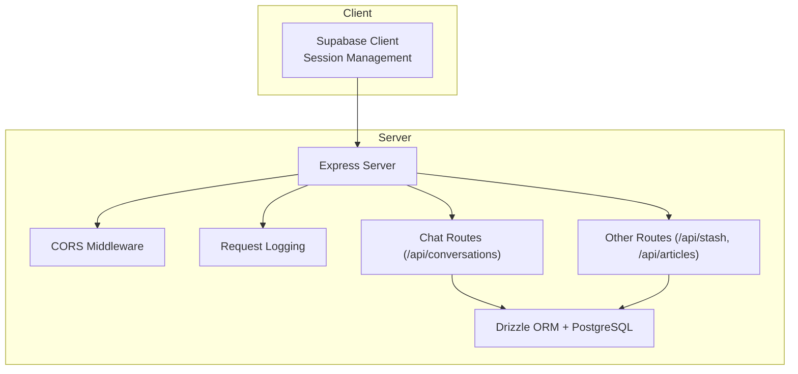
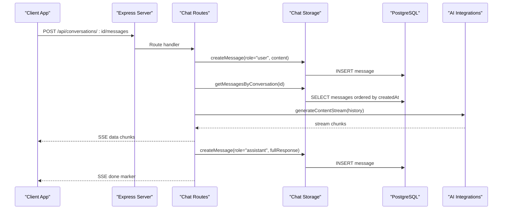
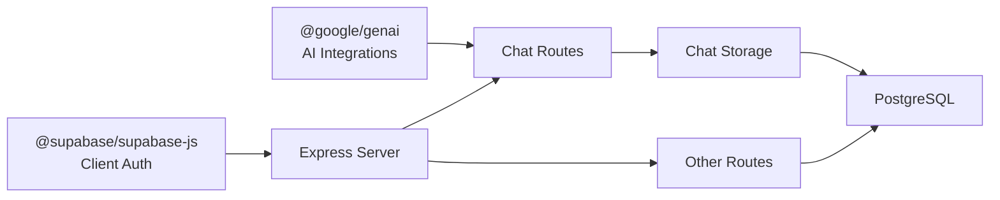
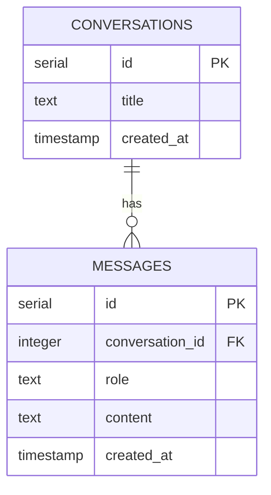

# Chat Integration

<cite>
**Referenced Files in This Document**
- [server/index.ts](file://server/index.ts)
- [server/routes.ts](file://server/routes.ts)
- [server/db.ts](file://server/db.ts)
- [server/replit_integrations/chat/index.ts](file://server/replit_integrations/chat/index.ts)
- [server/replit_integrations/chat/routes.ts](file://server/replit_integrations/chat/routes.ts)
- [server/replit_integrations/chat/storage.ts](file://server/replit_integrations/chat/storage.ts)
- [shared/schema.ts](file://shared/schema.ts)
- [shared/models/chat.ts](file://shared/models/chat.ts)
- [client/lib/supabase.ts](file://client/lib/supabase.ts)
- [package.json](file://package.json)
</cite>

## Table of Contents
1. [Introduction](#introduction)
2. [Project Structure](#project-structure)
3. [Core Components](#core-components)
4. [Architecture Overview](#architecture-overview)
5. [Detailed Component Analysis](#detailed-component-analysis)
6. [Dependency Analysis](#dependency-analysis)
7. [Performance Considerations](#performance-considerations)
8. [Troubleshooting Guide](#troubleshooting-guide)
9. [Conclusion](#conclusion)
10. [Appendices](#appendices)

## Introduction
This document describes the chat integration system that powers user assistance and conversational AI within the application. It explains the chat service architecture, routing configuration, and message handling workflows. It documents the integration with external AI services, message persistence, and conversation state management. It also details the chat API endpoints, request/response formats, authentication requirements, and practical examples for initializing chats, sending and receiving messages, and managing conversation threads. Storage mechanisms for chat history, user sessions, and message metadata are covered, along with error handling strategies, customization guidance, and troubleshooting steps.

## Project Structure
The chat integration spans backend and shared data schema layers:
- Backend server exposes chat endpoints and integrates with an AI service.
- Shared schema defines database tables for conversations and messages.
- Client-side session management is handled via Supabase.

**Diagram sources**
- [server/index.ts](file://server/index.ts#L224-L246)
- [server/replit_integrations/chat/routes.ts](file://server/replit_integrations/chat/routes.ts#L19-L124)
- [server/routes.ts](file://server/routes.ts#L24-L492)
- [server/db.ts](file://server/db.ts#L1-L19)
- [shared/schema.ts](file://shared/schema.ts#L64-L76)
- [client/lib/supabase.ts](file://client/lib/supabase.ts#L1-L39)

**Section sources**
- [server/index.ts](file://server/index.ts#L1-L247)
- [server/replit_integrations/chat/index.ts](file://server/replit_integrations/chat/index.ts#L1-L4)
- [shared/schema.ts](file://shared/schema.ts#L64-L76)

## Core Components
- Chat routes module registers endpoints for listing, creating, retrieving, and deleting conversations, and for streaming AI responses to posted messages.
- Chat storage module encapsulates database operations for conversations and messages using Drizzle ORM.
- Shared schema defines the conversations and messages tables with foreign key relationships and timestamps.
- Server middleware sets up CORS, body parsing, logging, and error handling.
- Supabase client manages user sessions on the client.

Key responsibilities:
- Expose REST endpoints under /api/conversations.
- Persist conversations and messages to PostgreSQL via Drizzle ORM.
- Stream AI responses using the Gemini-compatible AI Integrations service.
- Provide conversation retrieval with associated messages.

**Section sources**
- [server/replit_integrations/chat/routes.ts](file://server/replit_integrations/chat/routes.ts#L19-L124)
- [server/replit_integrations/chat/storage.ts](file://server/replit_integrations/chat/storage.ts#L14-L42)
- [shared/schema.ts](file://shared/schema.ts#L64-L76)
- [server/index.ts](file://server/index.ts#L16-L98)
- [client/lib/supabase.ts](file://client/lib/supabase.ts#L1-L39)

## Architecture Overview
The chat service is implemented as a modular Express router registered by the server. It streams AI responses using a Gemini-compatible integration and persists all interactions in a PostgreSQL database through Drizzle ORM.

**Diagram sources**
- [server/replit_integrations/chat/routes.ts](file://server/replit_integrations/chat/routes.ts#L71-L123)
- [server/replit_integrations/chat/storage.ts](file://server/replit_integrations/chat/storage.ts#L34-L41)
- [server/db.ts](file://server/db.ts#L1-L19)

## Detailed Component Analysis

### Chat Routes Module
Responsibilities:
- GET /api/conversations: List all conversations.
- GET /api/conversations/:id: Retrieve a specific conversation with its messages.
- POST /api/conversations: Create a new conversation.
- DELETE /api/conversations/:id: Remove a conversation and its messages.
- POST /api/conversations/:id/messages: Send a user message, stream AI response, and persist assistant reply.

Behavior highlights:
- Uses a Gemini-compatible AI service via @google/genai with AI Integrations configuration.
- Streams AI responses using Server-Sent Events (SSE) to support real-time chat UI updates.
- Persists both user and assistant messages after streaming completes.
- Handles errors gracefully, including early-exit scenarios when SSE headers are already sent.

Endpoints and behaviors:
- GET /api/conversations: Returns array of conversations ordered by creation time.
- GET /api/conversations/:id: Returns conversation plus associated messages; 404 if not found.
- POST /api/conversations: Creates a new conversation with a default title if none provided.
- DELETE /api/conversations/:id: Deletes messages and conversation; cascade deletion applies.
- POST /api/conversations/:id/messages: Saves user message, builds context from prior messages, streams AI response, saves assistant message, and ends stream.

Streaming and SSE:
- Sets Content-Type to text/event-stream and caches headers appropriately.
- Emits data frames containing incremental content and a terminal frame indicating completion.

Error handling:
- Catches exceptions during retrieval, creation, deletion, and streaming.
- Writes SSE error frames when streaming fails after headers are sent.
- Returns JSON error bodies otherwise.

**Section sources**
- [server/replit_integrations/chat/routes.ts](file://server/replit_integrations/chat/routes.ts#L19-L124)

### Chat Storage Module
Responsibilities:
- Retrieve a single conversation by ID.
- Retrieve all conversations ordered by creation time.
- Create a new conversation with a given title.
- Delete a conversation and its messages (cascading delete).
- Fetch messages for a conversation ordered by creation time.
- Insert a new message with role and content.

Implementation details:
- Uses Drizzle ORM with PostgreSQL connection pool.
- Enforces referential integrity via foreign keys and cascade deletes.
- Returns inserted rows for create operations to maintain consistency.

**Section sources**
- [server/replit_integrations/chat/storage.ts](file://server/replit_integrations/chat/storage.ts#L14-L42)
- [server/db.ts](file://server/db.ts#L1-L19)

### Shared Schema
Defines the database schema for chat data:
- conversations table: id, title, createdAt.
- messages table: id, conversationId (FK), role, content, createdAt.

Constraints and relationships:
- messages.conversationId references conversations.id with onDelete: cascade.
- createdAt defaults to current timestamp for both tables.

Validation and types:
- Zod insert schemas are generated for runtime validation of inserts.

**Section sources**
- [shared/schema.ts](file://shared/schema.ts#L64-L76)
- [shared/models/chat.ts](file://shared/models/chat.ts#L6-L34)

### Server Setup and Middleware
Middleware stack:
- CORS: Allows specified Replit domains and localhost origins for development.
- Body parsing: Captures rawBody for signature verification and parses JSON/URL-encoded requests.
- Request logging: Logs API requests with response bodies and durations.
- Error handling: Centralized handler returning JSON errors.

Routing registration:
- Registers chat routes and other application routes.
- Serves Expo manifests and landing page for non-API paths.

**Section sources**
- [server/index.ts](file://server/index.ts#L16-L98)
- [server/index.ts](file://server/index.ts#L224-L246)
- [server/routes.ts](file://server/routes.ts#L24-L492)

### Client Session Management
Supabase client:
- Initializes a client with URL and anonymous key from environment variables.
- Configures auth storage for mobile vs web platforms.
- Provides a singleton client instance for authentication and session persistence.

Note: The chat service itself does not require client authentication tokens; however, the client uses Supabase for user sessions.

**Section sources**
- [client/lib/supabase.ts](file://client/lib/supabase.ts#L1-L39)

## Dependency Analysis
External dependencies and integrations:
- AI service: @google/genai configured to use AI Integrations endpoint.
- Database: Drizzle ORM with PostgreSQL via node-postgres.
- Express server: CORS, body parsing, logging, and error handling middleware.
- Client auth: @supabase/supabase-js for session management.

**Diagram sources**
- [server/replit_integrations/chat/routes.ts](file://server/replit_integrations/chat/routes.ts#L11-L17)
- [server/replit_integrations/chat/storage.ts](file://server/replit_integrations/chat/storage.ts#L1-L3)
- [server/db.ts](file://server/db.ts#L1-L19)
- [server/index.ts](file://server/index.ts#L224-L246)
- [client/lib/supabase.ts](file://client/lib/supabase.ts#L1-L39)
- [package.json](file://package.json#L19-L67)

**Section sources**
- [package.json](file://package.json#L19-L67)
- [server/replit_integrations/chat/routes.ts](file://server/replit_integrations/chat/routes.ts#L11-L17)
- [server/db.ts](file://server/db.ts#L1-L19)

## Performance Considerations
- Streaming AI responses: Using SSE reduces latency and improves perceived responsiveness by delivering partial content incrementally.
- Database queries: Ordering messages by creation time ensures correct conversation context; keep indexes on foreign keys and timestamps.
- Middleware overhead: Request logging captures response bodies; consider adjusting log verbosity in production.
- AI service throughput: The Gemini-compatible integration is used without local API keys; ensure adequate quotas and retry strategies if needed.
- Memory usage: Multer is used elsewhere in the server for uploads; avoid large payloads for chat unless extended.

[No sources needed since this section provides general guidance]

## Troubleshooting Guide
Common issues and resolutions:
- Missing environment variables:
  - DATABASE_URL must be set for database connectivity.
  - AI Integrations requires AI_INTEGRATIONS_GEMINI_API_KEY and AI_INTEGRATIONS_GEMINI_BASE_URL.
  - Supabase requires EXPO_PUBLIC_SUPABASE_URL and EXPO_PUBLIC_SUPABASE_ANON_KEY for client auth.
- CORS errors:
  - Ensure the origin is included in allowed Replit domains or development localhost origins.
- 500 errors on chat endpoints:
  - Verify database connectivity and that chat tables exist.
  - Confirm AI Integrations credentials and base URL are correct.
- SSE streaming failures:
  - If headers are already sent, the route writes an SSE error frame and closes the stream.
- Conversation not found:
  - GET /api/conversations/:id returns 404 if the conversation does not exist.

Operational checks:
- Confirm server startup logs show successful middleware setup and port binding.
- Validate chat endpoints using a REST client to inspect responses and status codes.

**Section sources**
- [server/db.ts](file://server/db.ts#L7-L9)
- [server/replit_integrations/chat/routes.ts](file://server/replit_integrations/chat/routes.ts#L11-L17)
- [client/lib/supabase.ts](file://client/lib/supabase.ts#L20-L24)
- [server/index.ts](file://server/index.ts#L16-L53)
- [server/replit_integrations/chat/routes.ts](file://server/replit_integrations/chat/routes.ts#L36-L44)

## Conclusion
The chat integration provides a robust, streaming-capable conversational AI experience backed by persistent storage and modular routing. It leverages AI Integrations for seamless AI responses, maintains conversation state through relational tables, and exposes straightforward REST endpoints for client consumption. With proper environment configuration and middleware setup, the system supports scalable chat workflows while offering clear error handling and extensibility for future enhancements.

[No sources needed since this section summarizes without analyzing specific files]

## Appendices

### API Reference: Chat Endpoints
- GET /api/conversations
  - Description: Retrieve all conversations.
  - Response: Array of conversation objects.
- GET /api/conversations/:id
  - Description: Retrieve a specific conversation with all associated messages.
  - Response: Conversation object with a messages array.
  - Status Codes: 200 OK, 404 Not Found.
- POST /api/conversations
  - Description: Create a new conversation.
  - Request Body: { title?: string }.
  - Response: New conversation object.
  - Status Codes: 201 Created, 500 Internal Server Error.
- DELETE /api/conversations/:id
  - Description: Delete a conversation and all its messages.
  - Response: No content.
  - Status Codes: 204 No Content, 500 Internal Server Error.
- POST /api/conversations/:id/messages
  - Description: Send a user message and stream AI response.
  - Request Body: { content: string }.
  - Response: Server-Sent Events stream of incremental content followed by a completion marker.
  - Status Codes: 200 OK (stream), 500 Internal Server Error.

Authentication:
- The chat endpoints do not require bearer tokens.
- Client session management is handled separately via Supabase.

**Section sources**
- [server/replit_integrations/chat/routes.ts](file://server/replit_integrations/chat/routes.ts#L19-L124)

### Data Model: Conversations and Messages

**Diagram sources**
- [shared/schema.ts](file://shared/schema.ts#L64-L76)

### Practical Examples

- Initialize a new conversation:
  - Endpoint: POST /api/conversations
  - Example request body: { "title": "First Chat" }
  - Expected response: Conversation object with id and title.

- Start a chat thread:
  - Create a conversation.
  - Send the first message to POST /api/conversations/:id/messages with content.

- Receive streamed responses:
  - Subscribe to SSE events on POST /api/conversations/:id/messages.
  - Accumulate data frames until a completion marker is received.

- Retrieve a conversation with messages:
  - GET /api/conversations/:id returns the conversation and its messages array.

- Delete a conversation:
  - DELETE /api/conversations/:id removes the conversation and all related messages.

**Section sources**
- [server/replit_integrations/chat/routes.ts](file://server/replit_integrations/chat/routes.ts#L48-L123)

### Customization and Integration Guidance
- AI model selection:
  - The route uses a specific model identifier; adjust as needed for advanced reasoning or speed.
- Prompt engineering:
  - The AI service is primarily used for chat streaming in this module; other routes demonstrate structured prompts for analysis tasks.
- Frontend integration:
  - Use SSE event listeners to render incremental tokens.
  - Persist user selections and preferences via Supabase where applicable.

**Section sources**
- [server/replit_integrations/chat/routes.ts](file://server/replit_integrations/chat/routes.ts#L93-L112)
- [server/routes.ts](file://server/routes.ts#L140-L226)
- [client/lib/supabase.ts](file://client/lib/supabase.ts#L1-L39)