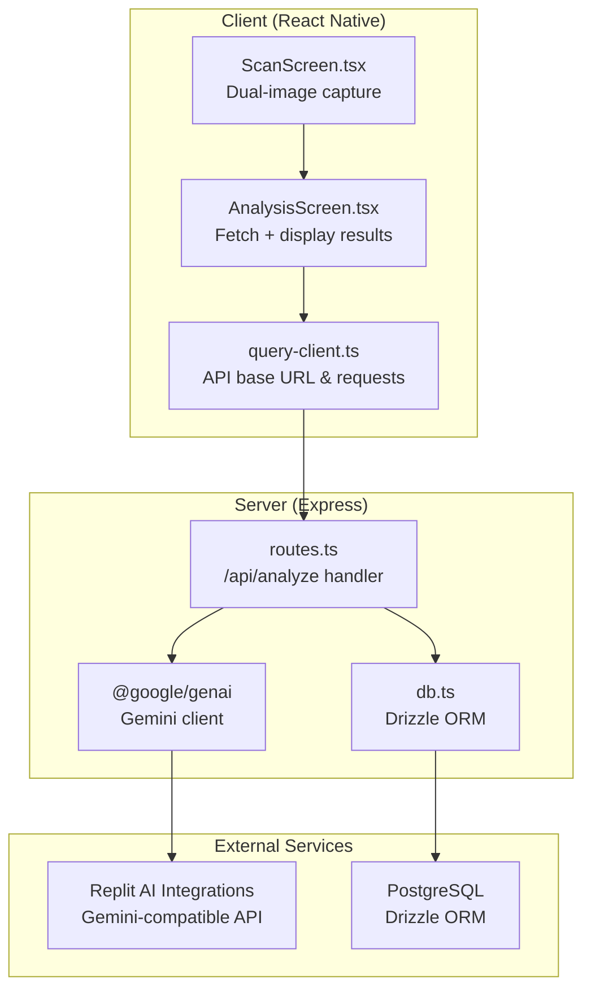
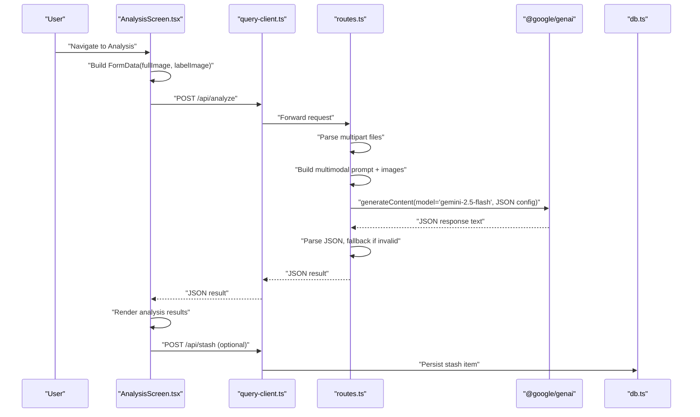
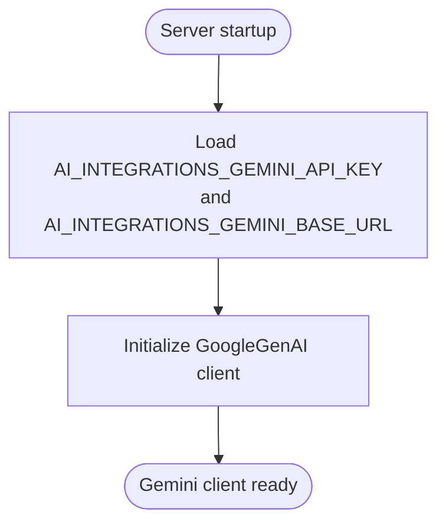
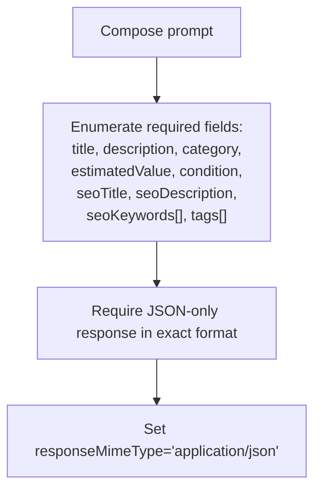
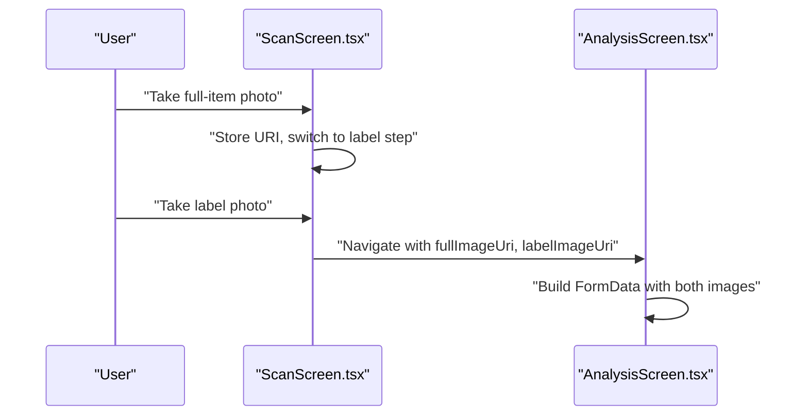
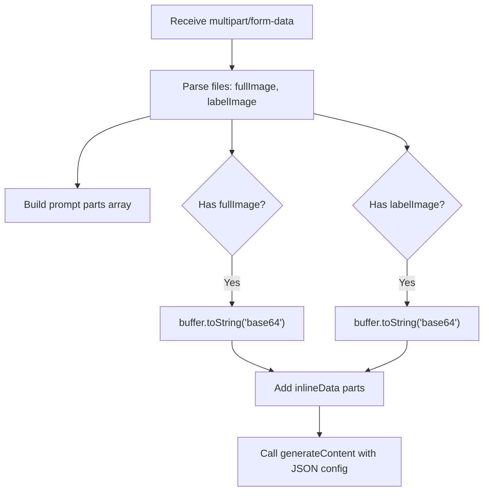
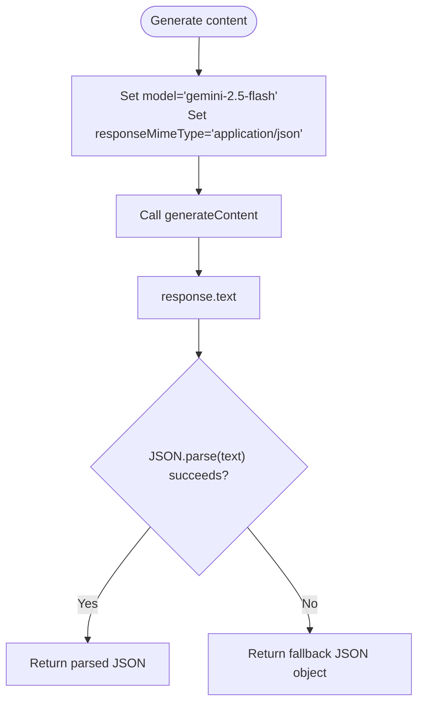
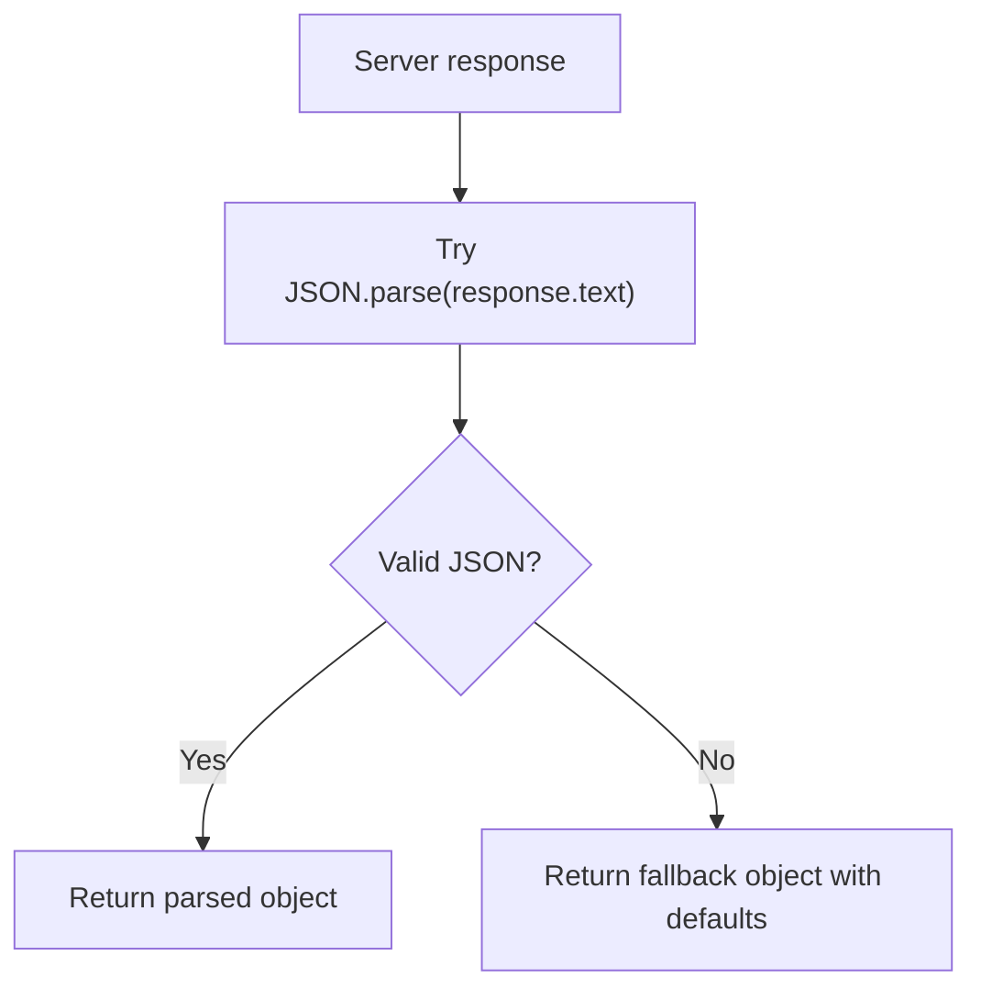
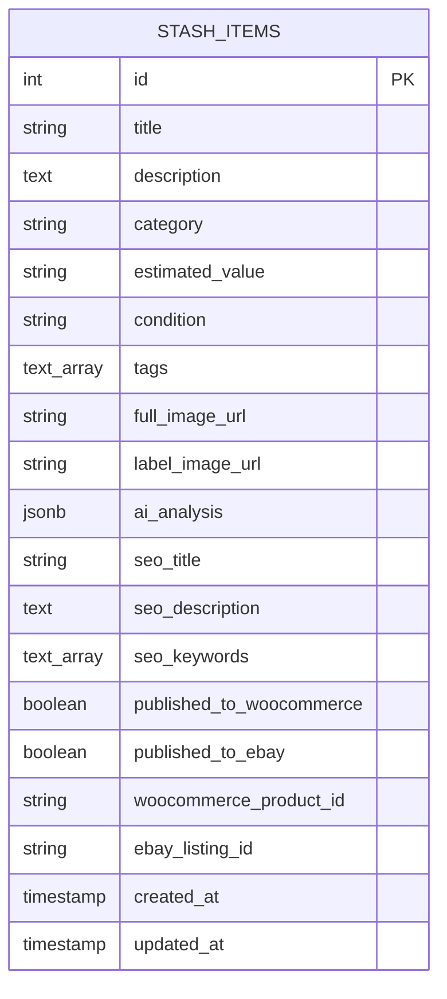
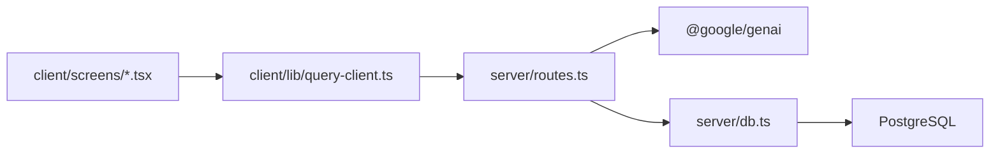

# Gemini API Integration

<cite>
**Referenced Files in This Document**
- [ENVIRONMENT.md](file://ENVIRONMENT.md)
- [package.json](file://package.json)
- [server/index.ts](file://server/index.ts)
- [server/routes.ts](file://server/routes.ts)
- [server/db.ts](file://server/db.ts)
- [server/replit_integrations/image/client.ts](file://server/replit_integrations/image/client.ts)
- [server/replit_integrations/chat/client.ts](file://server/replit_integrations/chat/client.ts)
- [client/lib/query-client.ts](file://client/lib/query-client.ts)
- [client/screens/ScanScreen.tsx](file://client/screens/ScanScreen.tsx)
- [client/screens/AnalysisScreen.tsx](file://client/screens/AnalysisScreen.tsx)
- [shared/schema.ts](file://shared/schema.ts)
</cite>

## Table of Contents
1. [Introduction](#introduction)
2. [Project Structure](#project-structure)
3. [Core Components](#core-components)
4. [Architecture Overview](#architecture-overview)
5. [Detailed Component Analysis](#detailed-component-analysis)
6. [Dependency Analysis](#dependency-analysis)
7. [Performance Considerations](#performance-considerations)
8. [Troubleshooting Guide](#troubleshooting-guide)
9. [Conclusion](#conclusion)

## Introduction
This document explains the Google Gemini API integration powering the AI-powered item analysis system. It covers configuration, authentication, model selection, prompt engineering, image processing for dual-image capture, multipart request handling, API initialization, content generation requests, response parsing, error handling, rate limiting considerations, fallback mechanisms, and troubleshooting guidance. The integration leverages Replit AI Integrations for Gemini access and supports the two-image scanning workflow (full item + label close-up) used for professional appraisals.

## Project Structure
The integration spans client and server components:
- Client captures two images (full item and label) and submits them to the backend.
- Server receives multipart/form-data, constructs a multimodal Gemini request, and returns structured JSON.
- Database persists stash items with AI analysis and SEO metadata.

**Diagram sources**
- [client/screens/ScanScreen.tsx](file://client/screens/ScanScreen.tsx#L26-L62)
- [client/screens/AnalysisScreen.tsx](file://client/screens/AnalysisScreen.tsx#L66-L112)
- [client/lib/query-client.ts](file://client/lib/query-client.ts#L7-L17)
- [server/routes.ts](file://server/routes.ts#L140-L226)
- [server/db.ts](file://server/db.ts#L1-L19)
- [server/replit_integrations/image/client.ts](file://server/replit_integrations/image/client.ts#L4-L10)

**Section sources**
- [ENVIRONMENT.md](file://ENVIRONMENT.md#L43-L46)
- [package.json](file://package.json#L21-L21)

## Core Components
- Gemini client configuration via Replit AI Integrations with environment variables for API key and base URL.
- Prompt engineering specifying a strict JSON schema for item analysis.
- Dual-image capture and multipart upload on the client.
- Server-side multimodal request construction and JSON response validation with fallback.
- Database schema supporting stash items with AI analysis and SEO metadata.

**Section sources**
- [server/routes.ts](file://server/routes.ts#L11-L17)
- [server/routes.ts](file://server/routes.ts#L150-L174)
- [client/screens/ScanScreen.tsx](file://client/screens/ScanScreen.tsx#L26-L62)
- [client/screens/AnalysisScreen.tsx](file://client/screens/AnalysisScreen.tsx#L70-L84)
- [shared/schema.ts](file://shared/schema.ts#L29-L50)

## Architecture Overview
The AI analysis flow integrates client image capture, server-side Gemini processing, and structured response handling.

**Diagram sources**
- [client/screens/AnalysisScreen.tsx](file://client/screens/AnalysisScreen.tsx#L66-L112)
- [client/lib/query-client.ts](file://client/lib/query-client.ts#L26-L43)
- [server/routes.ts](file://server/routes.ts#L140-L226)
- [server/db.ts](file://server/db.ts#L1-L19)

## Detailed Component Analysis

### Gemini Client Configuration and Authentication
- The server initializes the Gemini client using Replit AI Integrations with environment variables for API key and base URL.
- The client retrieves the API base URL from an environment variable and uses it to construct absolute URLs for requests.

**Diagram sources**
- [server/routes.ts](file://server/routes.ts#L11-L17)
- [ENVIRONMENT.md](file://ENVIRONMENT.md#L43-L46)

**Section sources**
- [server/routes.ts](file://server/routes.ts#L11-L17)
- [ENVIRONMENT.md](file://ENVIRONMENT.md#L43-L46)
- [client/lib/query-client.ts](file://client/lib/query-client.ts#L7-L17)

### Prompt Engineering and JSON Schema Specification
- The prompt instructs the model to act as an expert appraiser and reseller assistant.
- It enumerates nine required fields and mandates a strict JSON response in the specified format.
- The server sets the response MIME type to JSON to encourage structured output.

**Diagram sources**
- [server/routes.ts](file://server/routes.ts#L150-L174)
- [server/routes.ts](file://server/routes.ts#L196-L202)

**Section sources**
- [server/routes.ts](file://server/routes.ts#L150-L174)
- [server/routes.ts](file://server/routes.ts#L196-L202)

### Dual-Image Capture Pipeline
- The client captures two images sequentially: full item, then label close-up.
- Images are passed to the analysis screen and submitted as multipart form data.

**Diagram sources**
- [client/screens/ScanScreen.tsx](file://client/screens/ScanScreen.tsx#L26-L62)
- [client/screens/AnalysisScreen.tsx](file://client/screens/AnalysisScreen.tsx#L70-L84)

**Section sources**
- [client/screens/ScanScreen.tsx](file://client/screens/ScanScreen.tsx#L26-L62)
- [client/screens/AnalysisScreen.tsx](file://client/screens/AnalysisScreen.tsx#L70-L84)

### Multipart Request Handling and Base64 Encoding
- The server uses Multer with memory storage to accept two files: fullImage and labelImage.
- Each file’s buffer is base64-encoded and included as inlineData with appropriate MIME type.

**Diagram sources**
- [server/routes.ts](file://server/routes.ts#L19-L22)
- [server/routes.ts](file://server/routes.ts#L140-L149)
- [server/routes.ts](file://server/routes.ts#L176-L194)

**Section sources**
- [server/routes.ts](file://server/routes.ts#L19-L22)
- [server/routes.ts](file://server/routes.ts#L140-L149)
- [server/routes.ts](file://server/routes.ts#L176-L194)

### Model Selection and Response Formatting
- Model selected: gemini-2.5-flash.
- Response configuration enforces JSON output via responseMimeType.
- The server attempts to parse the returned text as JSON; on failure, it returns a controlled fallback response.

**Diagram sources**
- [server/routes.ts](file://server/routes.ts#L196-L202)
- [server/routes.ts](file://server/routes.ts#L206-L221)

**Section sources**
- [server/routes.ts](file://server/routes.ts#L196-L202)
- [server/routes.ts](file://server/routes.ts#L206-L221)

### Response Parsing and Validation
- The client expects a JSON object matching the schema defined in the prompt.
- The server validates the JSON and returns a controlled fallback if parsing fails.

**Diagram sources**
- [server/routes.ts](file://server/routes.ts#L206-L221)
- [client/screens/AnalysisScreen.tsx](file://client/screens/AnalysisScreen.tsx#L167-L228)

**Section sources**
- [server/routes.ts](file://server/routes.ts#L206-L221)
- [client/screens/AnalysisScreen.tsx](file://client/screens/AnalysisScreen.tsx#L167-L228)

### Data Persistence and Schema
- The stash item schema includes fields for AI analysis, SEO metadata, and image URLs.
- The server persists items after successful analysis.

**Diagram sources**
- [shared/schema.ts](file://shared/schema.ts#L29-L50)

**Section sources**
- [shared/schema.ts](file://shared/schema.ts#L29-L50)
- [server/routes.ts](file://server/routes.ts#L99-L127)

## Dependency Analysis
- The server depends on @google/genai for Gemini integration and Multer for multipart uploads.
- The client depends on React Native APIs for camera/image picking and @tanstack/react-query for API requests.
- Database access uses Drizzle ORM with PostgreSQL.

**Diagram sources**
- [package.json](file://package.json#L21-L50)
- [client/lib/query-client.ts](file://client/lib/query-client.ts#L1-L80)
- [server/routes.ts](file://server/routes.ts#L1-L10)
- [server/db.ts](file://server/db.ts#L1-L19)

**Section sources**
- [package.json](file://package.json#L19-L67)
- [server/index.ts](file://server/index.ts#L1-L247)

## Performance Considerations
- Image size limits: Multer is configured with a 10 MB limit per file to balance quality and performance.
- Network efficiency: Submitting two images as multipart form data is efficient; avoid unnecessary conversions.
- Response parsing: Enforce JSON response from Gemini to reduce post-processing overhead.
- Retry and timeout strategies: Consider adding retries and timeouts around Gemini calls for resilience.

[No sources needed since this section provides general guidance]

## Troubleshooting Guide
Common issues and resolutions:
- Missing environment variables: Ensure AI_INTEGRATIONS_GEMINI_API_KEY and AI_INTEGRATIONS_GEMINI_BASE_URL are configured via Replit AI Integrations.
- API quota exceeded: Monitor usage and consider upgrading quotas or switching models.
- JSON parsing errors: The server falls back to a default JSON object; verify prompt adherence and model behavior.
- CORS and origin issues: The server dynamically configures CORS for allowed origins and localhost for Expo web dev.
- Database connectivity: Confirm DATABASE_URL is set and reachable.

**Section sources**
- [ENVIRONMENT.md](file://ENVIRONMENT.md#L191-L194)
- [server/routes.ts](file://server/routes.ts#L11-L17)
- [server/index.ts](file://server/index.ts#L16-L53)
- [server/db.ts](file://server/db.ts#L7-L9)

## Conclusion
The Gemini integration implements a robust, multimodal item analysis pipeline with strict prompt engineering and JSON schema enforcement. The dual-image capture workflow, multipart upload handling, and structured response parsing provide a reliable foundation for AI-powered appraisals. Proper environment configuration, error handling, and fallback mechanisms ensure resilience and a consistent user experience.