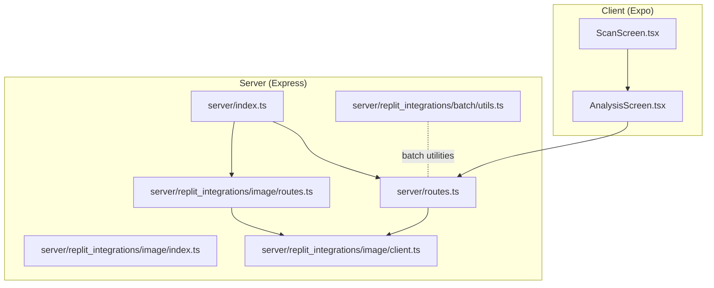
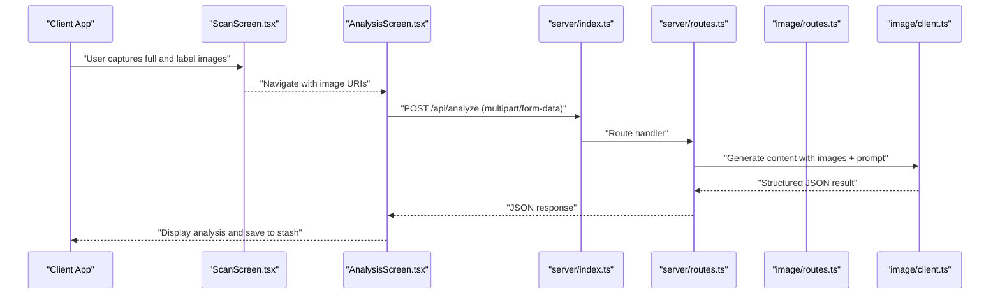
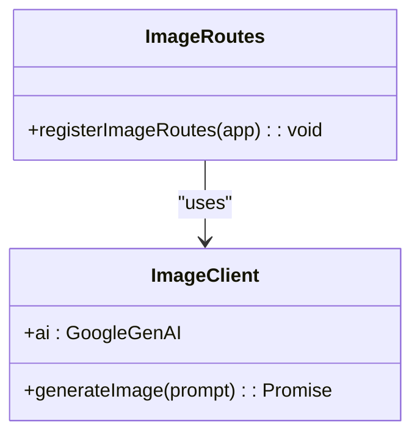
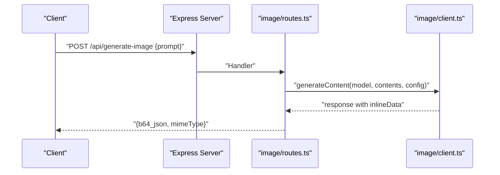
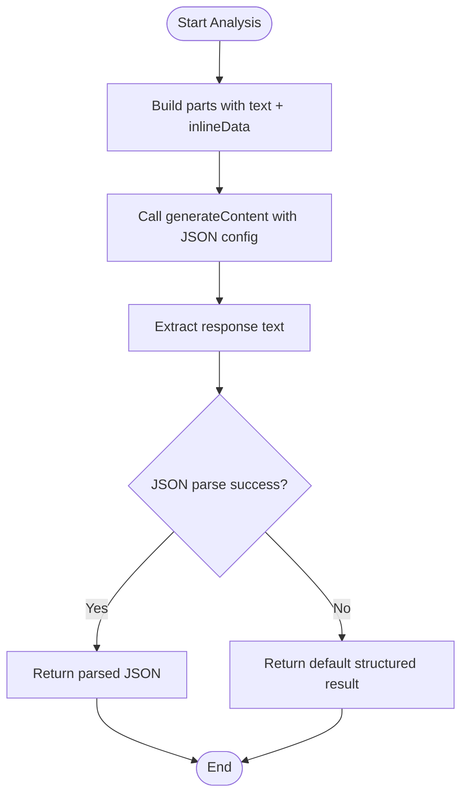
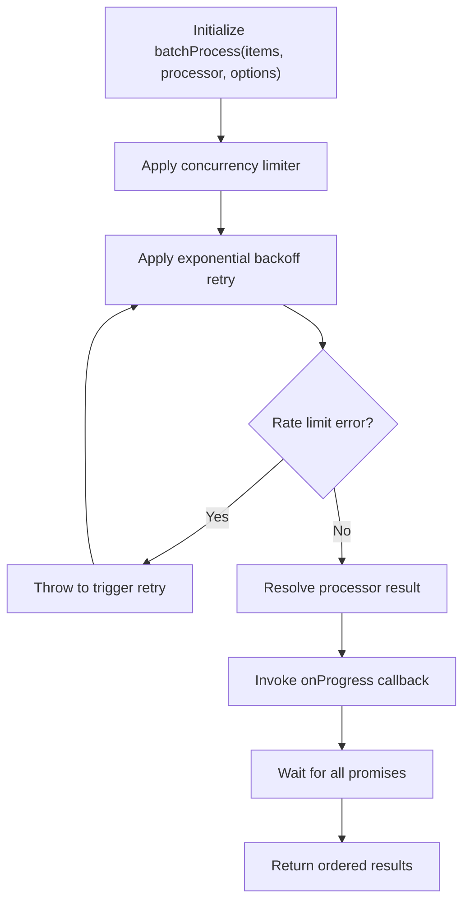
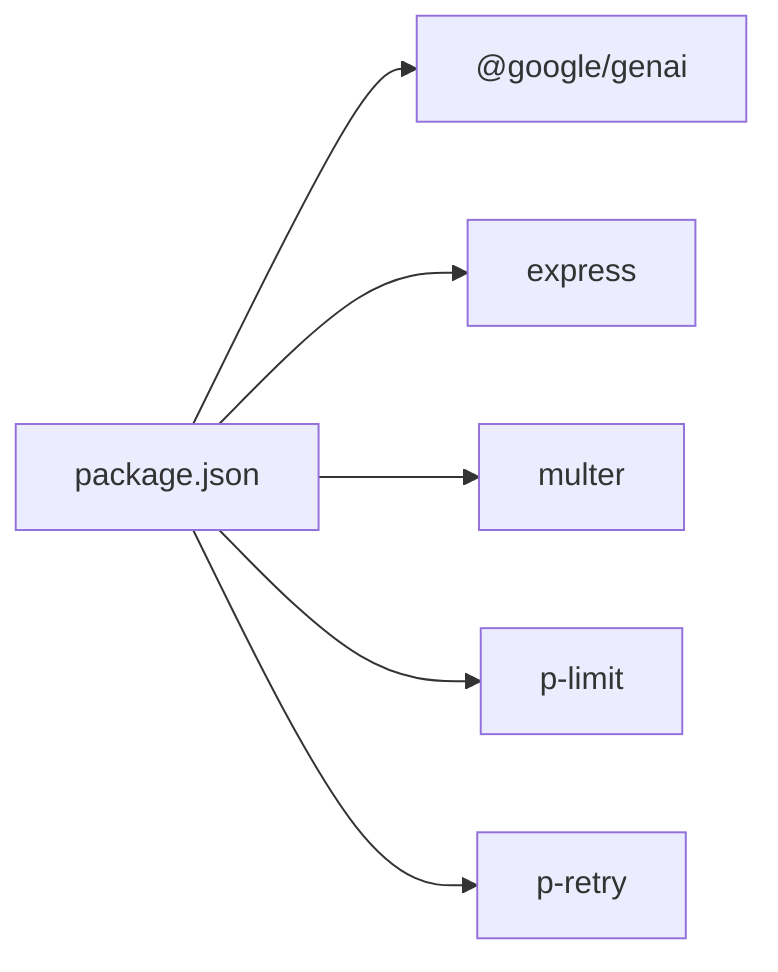

# Image Generation Capabilities

<cite>
**Referenced Files in This Document**
- [server/index.ts](file://server/index.ts)
- [server/routes.ts](file://server/routes.ts)
- [server/replit_integrations/image/index.ts](file://server/replit_integrations/image/index.ts)
- [server/replit_integrations/image/client.ts](file://server/replit_integrations/image/client.ts)
- [server/replit_integrations/image/routes.ts](file://server/replit_integrations/image/routes.ts)
- [server/replit_integrations/batch/utils.ts](file://server/replit_integrations/batch/utils.ts)
- [client/screens/ScanScreen.tsx](file://client/screens/ScanScreen.tsx)
- [client/screens/AnalysisScreen.tsx](file://client/screens/AnalysisScreen.tsx)
- [ENVIRONMENT.md](file://ENVIRONMENT.md)
- [package.json](file://package.json)
</cite>

## Table of Contents
1. [Introduction](#introduction)
2. [Project Structure](#project-structure)
3. [Core Components](#core-components)
4. [Architecture Overview](#architecture-overview)
5. [Detailed Component Analysis](#detailed-component-analysis)
6. [Dependency Analysis](#dependency-analysis)
7. [Performance Considerations](#performance-considerations)
8. [Troubleshooting Guide](#troubleshooting-guide)
9. [Conclusion](#conclusion)
10. [Appendices](#appendices)

## Introduction
This document explains the image generation capabilities of the project, focusing on automated image processing and enhancement features powered by the Gemini AI model via Replit’s AI Integrations service. It covers the service architecture, client configuration, API integration patterns, supported formats and modalities, endpoint specifications, response handling, and integration with the main AI analysis workflow. Practical examples demonstrate single image generation, batch processing, and result retrieval. Guidance is included for performance optimization, queue management, and troubleshooting common issues.

## Project Structure
The image generation feature is implemented as a dedicated module under server/replit_integrations/image and integrates with the broader server routes. The frontend captures images in the scanning flow and triggers analysis that leverages image generation capabilities indirectly through the AI pipeline.

**Diagram sources**
- [server/index.ts](file://server/index.ts#L224-L246)
- [server/routes.ts](file://server/routes.ts#L24-L492)
- [server/replit_integrations/image/index.ts](file://server/replit_integrations/image/index.ts#L1-L2)
- [server/replit_integrations/image/routes.ts](file://server/replit_integrations/image/routes.ts#L1-L39)
- [server/replit_integrations/image/client.ts](file://server/replit_integrations/image/client.ts#L1-L36)
- [server/replit_integrations/batch/utils.ts](file://server/replit_integrations/batch/utils.ts#L1-L160)
- [client/screens/ScanScreen.tsx](file://client/screens/ScanScreen.tsx#L1-L394)
- [client/screens/AnalysisScreen.tsx](file://client/screens/AnalysisScreen.tsx#L1-L484)

**Section sources**
- [server/index.ts](file://server/index.ts#L1-L246)
- [server/routes.ts](file://server/routes.ts#L1-L492)
- [server/replit_integrations/image/index.ts](file://server/replit_integrations/image/index.ts#L1-L2)
- [server/replit_integrations/image/routes.ts](file://server/replit_integrations/image/routes.ts#L1-L39)
- [server/replit_integrations/image/client.ts](file://server/replit_integrations/image/client.ts#L1-L36)
- [server/replit_integrations/batch/utils.ts](file://server/replit_integrations/batch/utils.ts#L1-L160)
- [client/screens/ScanScreen.tsx](file://client/screens/ScanScreen.tsx#L1-L394)
- [client/screens/AnalysisScreen.tsx](file://client/screens/AnalysisScreen.tsx#L1-L484)

## Core Components
- Image generation client: Initializes the AI client using Replit’s Gemini-compatible integration and generates images from prompts, returning a base64 data URL.
- Image generation routes: Exposes a POST endpoint to accept a prompt and return the generated image payload.
- AI analysis pipeline: Accepts uploaded images and text prompts, sends them to the Gemini model, and returns structured results. While not generating new images, it demonstrates the integration pattern used for image enhancement in the broader workflow.
- Batch utilities: Provides concurrency control and retry mechanisms for scalable processing of AI tasks.

Key implementation references:
- Image generation client and model selection: [server/replit_integrations/image/client.ts](file://server/replit_integrations/image/client.ts#L16-L36)
- Image generation endpoint: [server/replit_integrations/image/routes.ts](file://server/replit_integrations/image/routes.ts#L5-L39)
- AI analysis with images: [server/routes.ts](file://server/routes.ts#L140-L226)
- Batch processing utilities: [server/replit_integrations/batch/utils.ts](file://server/replit_integrations/batch/utils.ts#L69-L160)

**Section sources**
- [server/replit_integrations/image/client.ts](file://server/replit_integrations/image/client.ts#L1-L36)
- [server/replit_integrations/image/routes.ts](file://server/replit_integrations/image/routes.ts#L1-L39)
- [server/routes.ts](file://server/routes.ts#L140-L226)
- [server/replit_integrations/batch/utils.ts](file://server/replit_integrations/batch/utils.ts#L1-L160)

## Architecture Overview
The image generation capability is layered:
- Client-side scanning and analysis screens capture images and orchestrate requests.
- The server exposes a dedicated image generation endpoint and integrates AI analysis routes.
- The AI client communicates with Replit’s Gemini-compatible API to produce images or structured results containing images.

**Diagram sources**
- [client/screens/ScanScreen.tsx](file://client/screens/ScanScreen.tsx#L17-L87)
- [client/screens/AnalysisScreen.tsx](file://client/screens/AnalysisScreen.tsx#L62-L112)
- [server/index.ts](file://server/index.ts#L224-L246)
- [server/routes.ts](file://server/routes.ts#L140-L226)
- [server/replit_integrations/image/client.ts](file://server/replit_integrations/image/client.ts#L16-L36)

## Detailed Component Analysis

### Image Generation Service
The service initializes an AI client using Replit’s Gemini-compatible integration and exposes a function to generate images from text prompts. The response is returned as a base64 data URL, enabling immediate rendering in browsers or apps.

**Diagram sources**
- [server/replit_integrations/image/client.ts](file://server/replit_integrations/image/client.ts#L1-L36)
- [server/replit_integrations/image/routes.ts](file://server/replit_integrations/image/routes.ts#L1-L39)

Implementation highlights:
- Model: gemini-2.5-flash-image
- Response modality: TEXT and IMAGE
- Returns: base64 data URL with detected or default MIME type

**Section sources**
- [server/replit_integrations/image/client.ts](file://server/replit_integrations/image/client.ts#L1-L36)
- [server/replit_integrations/image/routes.ts](file://server/replit_integrations/image/routes.ts#L1-L39)

### API Endpoints and Integration Patterns
- Endpoint: POST /api/generate-image
  - Request body: { prompt: string }
  - Response: { b64_json: string, mimeType: string }
  - Status codes: 400 (invalid prompt), 500 (generation failure)
- Integration pattern: The endpoint validates input, invokes the AI client, extracts the image part, and returns the base64 payload with MIME type.

**Diagram sources**
- [server/replit_integrations/image/routes.ts](file://server/replit_integrations/image/routes.ts#L5-L39)
- [server/replit_integrations/image/client.ts](file://server/replit_integrations/image/client.ts#L16-L36)

**Section sources**
- [server/replit_integrations/image/routes.ts](file://server/replit_integrations/image/routes.ts#L1-L39)

### AI Analysis Workflow Integration
While the primary image generation endpoint returns images, the broader AI analysis workflow demonstrates how images are embedded into prompts and processed to produce structured results. This pattern can be extended to include image generation as part of the AI-assisted enhancement pipeline.

**Diagram sources**
- [server/routes.ts](file://server/routes.ts#L140-L226)

**Section sources**
- [server/routes.ts](file://server/routes.ts#L140-L226)

### Batch Processing and Scalability
The batch utilities provide concurrency control and exponential backoff for rate-limited or quota-exceeded scenarios. These utilities can be applied to image generation workloads to manage throughput and resilience.

**Diagram sources**
- [server/replit_integrations/batch/utils.ts](file://server/replit_integrations/batch/utils.ts#L69-L109)

**Section sources**
- [server/replit_integrations/batch/utils.ts](file://server/replit_integrations/batch/utils.ts#L1-L160)

## Dependency Analysis
External dependencies relevant to image generation and AI processing:
- @google/genai: Provides the Google GenAI SDK for model interactions.
- Express and Multer: Serve APIs and handle multipart form uploads for image analysis.
- p-limit and p-retry: Enable controlled concurrency and resilient retries for batch processing.

**Diagram sources**
- [package.json](file://package.json#L19-L67)

**Section sources**
- [package.json](file://package.json#L1-L85)

## Performance Considerations
- Concurrency tuning: Adjust batch concurrency to balance throughput and rate limits.
- Retry strategy: Use exponential backoff to handle transient quota/rate limit errors.
- Payload size: Keep prompts concise and leverage model configurations to reduce latency.
- Caching: Store frequently requested images or derived assets to minimize repeated generation.
- Queue management: Implement a job queue for high-volume image generation tasks to avoid overload.

[No sources needed since this section provides general guidance]

## Troubleshooting Guide
Common issues and resolutions:
- Missing prompt: Ensure the prompt field is present in the request body for the image generation endpoint.
- No image data in response: Validate that the model returned an inlineData part; otherwise, surface a clear error.
- Rate limit/quota exceeded: Apply the batch utilities with retries and backoff; monitor error messages indicating 429 or quota exceeded.
- Environment configuration: Confirm AI integration variables are configured via Replit secrets and accessible to the server process.

Operational references:
- Endpoint validation and error handling: [server/replit_integrations/image/routes.ts](file://server/replit_integrations/image/routes.ts#L8-L12)
- Error logging and generic handler: [server/index.ts](file://server/index.ts#L207-L222)
- Environment variables for AI integrations: [ENVIRONMENT.md](file://ENVIRONMENT.md#L43-L46)

**Section sources**
- [server/replit_integrations/image/routes.ts](file://server/replit_integrations/image/routes.ts#L1-L39)
- [server/index.ts](file://server/index.ts#L207-L222)
- [ENVIRONMENT.md](file://ENVIRONMENT.md#L43-L46)

## Conclusion
The image generation feature leverages Replit’s Gemini-compatible integration to deliver robust image generation capabilities. The modular design separates concerns between client-side capture, server-side orchestration, and AI model interactions. By adopting the provided batch utilities and following the integration patterns demonstrated in the analysis workflow, teams can scale image generation, improve reliability under rate limits, and seamlessly incorporate generated imagery into the broader AI-driven appraisal process.

[No sources needed since this section summarizes without analyzing specific files]

## Appendices

### API Reference: Image Generation Endpoint
- Method: POST
- Path: /api/generate-image
- Request body:
  - prompt: string (required)
- Response:
  - b64_json: string (base64-encoded image)
  - mimeType: string (detected or default image MIME type)
- Status codes:
  - 400: Prompt is required
  - 500: Failed to generate image

**Section sources**
- [server/replit_integrations/image/routes.ts](file://server/replit_integrations/image/routes.ts#L5-L39)

### Practical Examples
- Single image generation:
  - Send a POST request to /api/generate-image with a prompt.
  - Receive a base64 data URL and render the image in the client.
- Batch processing:
  - Use batchProcess to concurrently generate images with controlled concurrency and retries.
  - Stream progress via batchProcessWithSSE for long-running jobs.
- Result retrieval:
  - Decode the base64 payload to display or persist the image.
  - Store the resulting image URI or base64 data alongside analysis results.

**Section sources**
- [server/replit_integrations/batch/utils.ts](file://server/replit_integrations/batch/utils.ts#L69-L160)
- [server/replit_integrations/image/routes.ts](file://server/replit_integrations/image/routes.ts#L29-L33)

### Integration Notes
- Scanning and analysis:
  - Capture full and label images in the scanning flow.
  - Submit both images along with a structured prompt to the analysis endpoint.
  - Use the returned structured data to enrich listings and enhance the appraisal process.

**Section sources**
- [client/screens/ScanScreen.tsx](file://client/screens/ScanScreen.tsx#L26-L87)
- [client/screens/AnalysisScreen.tsx](file://client/screens/AnalysisScreen.tsx#L66-L112)
- [server/routes.ts](file://server/routes.ts#L140-L226)