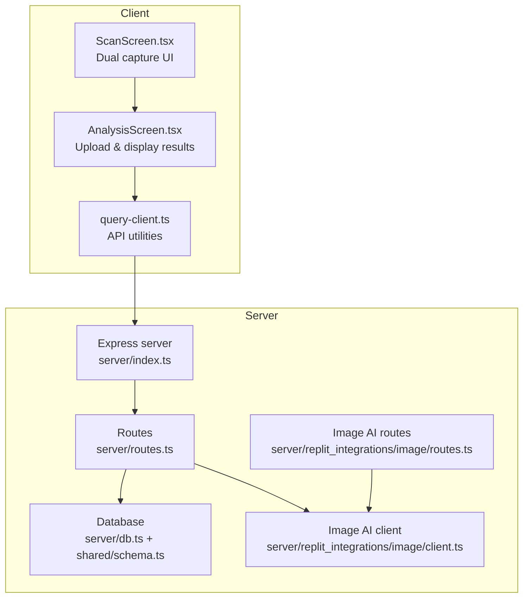
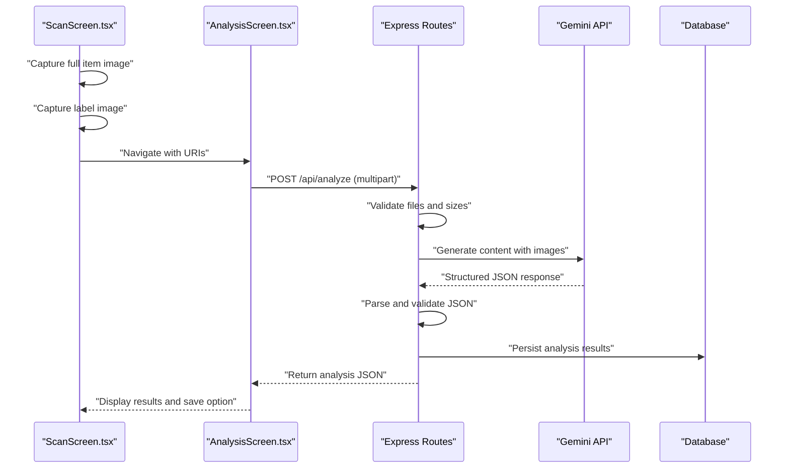
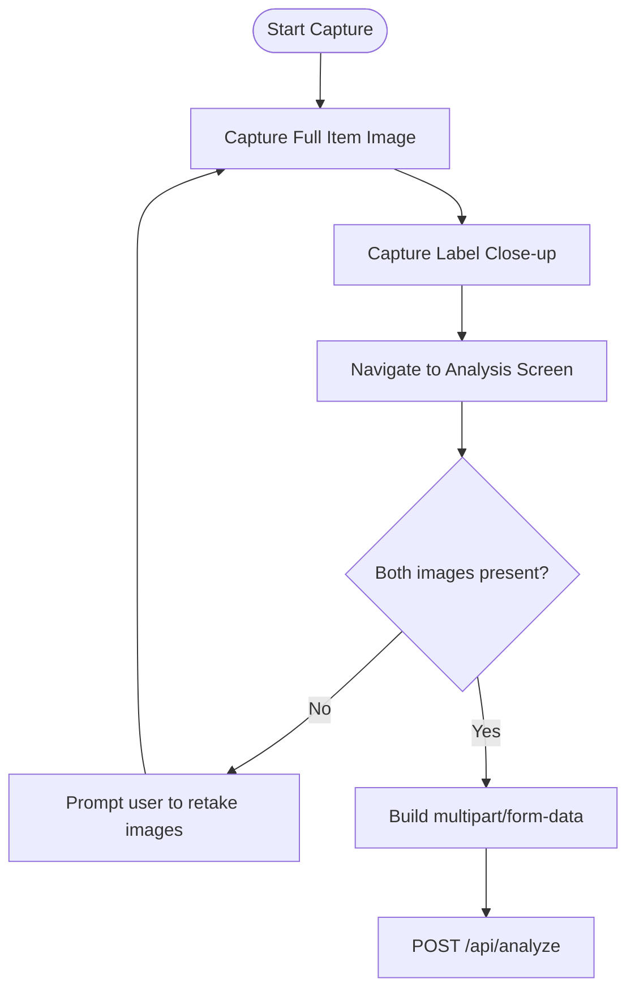
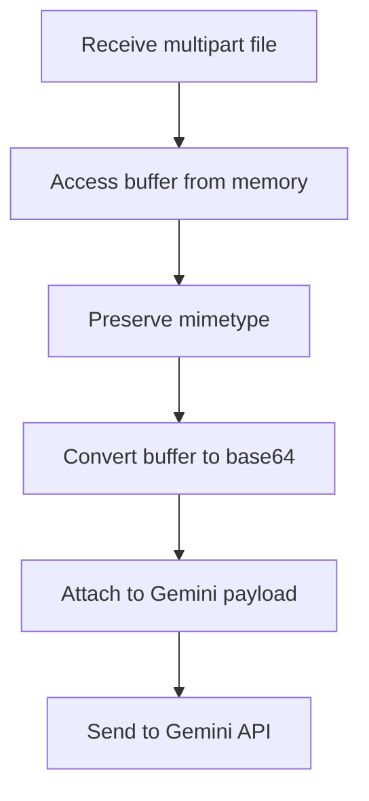
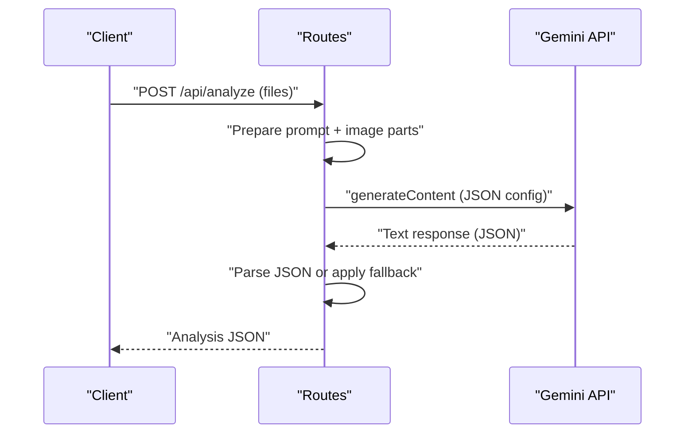
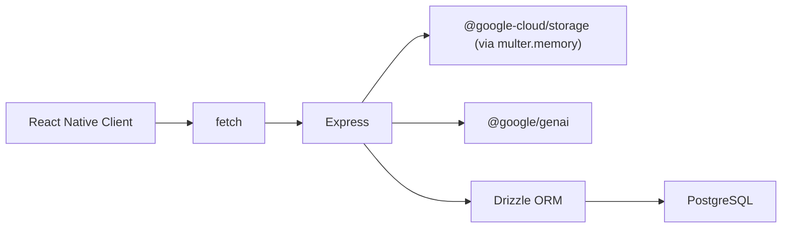

# Image Processing Pipeline

<cite>
**Referenced Files in This Document**
- [server/index.ts](file://server/index.ts)
- [server/routes.ts](file://server/routes.ts)
- [server/replit_integrations/image/client.ts](file://server/replit_integrations/image/client.ts)
- [server/replit_integrations/image/routes.ts](file://server/replit_integrations/image/routes.ts)
- [client/screens/ScanScreen.tsx](file://client/screens/ScanScreen.tsx)
- [client/screens/AnalysisScreen.tsx](file://client/screens/AnalysisScreen.tsx)
- [client/lib/query-client.ts](file://client/lib/query-client.ts)
- [shared/schema.ts](file://shared/schema.ts)
- [server/db.ts](file://server/db.ts)
- [package.json](file://package.json)
</cite>

## Table of Contents
1. [Introduction](#introduction)
2. [Project Structure](#project-structure)
3. [Core Components](#core-components)
4. [Architecture Overview](#architecture-overview)
5. [Detailed Component Analysis](#detailed-component-analysis)
6. [Dependency Analysis](#dependency-analysis)
7. [Performance Considerations](#performance-considerations)
8. [Troubleshooting Guide](#troubleshooting-guide)
9. [Conclusion](#conclusion)

## Introduction
This document explains the image processing pipeline for a dual-image capture workflow and file upload handling. It covers:
- Multer configuration for memory storage and multipart form data processing
- Dual-image capture for full item and label images, including validation and quality checks
- Base64 encoding for image data transmission and MIME type handling
- Buffer management and memory considerations
- Integration with AI analysis via the Gemini API
- Practical examples of preprocessing, validation logic, error handling, and performance optimization
- Troubleshooting guidance for upload failures and format compatibility issues

## Project Structure
The image processing pipeline spans the client and server:
- Client captures two images (full item and label) and sends them to the backend
- Server validates and processes the images, then passes them to the Gemini API for analysis
- Results are stored in the database and returned to the client

**Diagram sources**
- [server/index.ts](file://server/index.ts#L1-L247)
- [server/routes.ts](file://server/routes.ts#L1-L493)
- [server/replit_integrations/image/client.ts](file://server/replit_integrations/image/client.ts#L1-L38)
- [server/replit_integrations/image/routes.ts](file://server/replit_integrations/image/routes.ts#L1-L41)
- [client/screens/ScanScreen.tsx](file://client/screens/ScanScreen.tsx#L1-L394)
- [client/screens/AnalysisScreen.tsx](file://client/screens/AnalysisScreen.tsx#L1-L484)
- [client/lib/query-client.ts](file://client/lib/query-client.ts#L1-L80)
- [server/db.ts](file://server/db.ts#L1-L19)
- [shared/schema.ts](file://shared/schema.ts#L1-L122)

**Section sources**
- [server/index.ts](file://server/index.ts#L1-L247)
- [server/routes.ts](file://server/routes.ts#L1-L493)
- [client/screens/ScanScreen.tsx](file://client/screens/ScanScreen.tsx#L1-L394)
- [client/screens/AnalysisScreen.tsx](file://client/screens/AnalysisScreen.tsx#L1-L484)
- [client/lib/query-client.ts](file://client/lib/query-client.ts#L1-L80)
- [server/db.ts](file://server/db.ts#L1-L19)
- [shared/schema.ts](file://shared/schema.ts#L1-L122)

## Core Components
- Multer configuration for memory storage and file size limits
- Dual-image capture UI and upload flow
- AI analysis integration with Gemini
- Database schema for storing processed results
- API utilities for client-server communication

**Section sources**
- [server/routes.ts](file://server/routes.ts#L19-L22)
- [client/screens/ScanScreen.tsx](file://client/screens/ScanScreen.tsx#L26-L87)
- [client/screens/AnalysisScreen.tsx](file://client/screens/AnalysisScreen.tsx#L71-L112)
- [server/replit_integrations/image/client.ts](file://server/replit_integrations/image/client.ts#L16-L36)
- [shared/schema.ts](file://shared/schema.ts#L29-L50)
- [client/lib/query-client.ts](file://client/lib/query-client.ts#L7-L17)

## Architecture Overview
The dual-image capture workflow:
1. Client captures a full-item image and a close-up label image
2. Client uploads both images as multipart/form-data
3. Server validates and prepares images for AI analysis
4. Server sends images to Gemini API with a structured prompt
5. Server parses the AI response and stores results in the database
6. Client displays the analysis results and allows saving to stash

**Diagram sources**
- [client/screens/ScanScreen.tsx](file://client/screens/ScanScreen.tsx#L26-L62)
- [client/screens/AnalysisScreen.tsx](file://client/screens/AnalysisScreen.tsx#L66-L112)
- [server/routes.ts](file://server/routes.ts#L140-L226)
- [server/db.ts](file://server/db.ts#L1-L19)
- [shared/schema.ts](file://shared/schema.ts#L29-L50)

## Detailed Component Analysis

### Multer Configuration and Multipart Upload Handling
- Memory storage is used to keep uploaded files in RAM buffers
- File size limit is set to 10 MB per file
- The endpoint accepts two fields: fullImage and labelImage, each with a maxCount of 1

Implementation highlights:
- Multer initialization with memory storage and size limits
- Field-based upload handling for dual images
- MIME type preservation from the client

Practical implications:
- Large images increase memory pressure; consider compression or streaming to disk for very large files
- Always validate MIME types and file extensions on the server side

**Section sources**
- [server/routes.ts](file://server/routes.ts#L19-L22)
- [server/routes.ts](file://server/routes.ts#L140-L149)

### Dual-Image Capture Workflow (Full Item and Label)
Client-side behavior:
- Two-step capture flow: full item image followed by label image
- Navigation passes both URIs to the analysis screen
- Gallery picker supports selecting existing images

Validation and quality checks:
- Ensure both images are present before attempting analysis
- Prefer JPEG for smaller payload sizes
- Verify image orientation and focus for readable labels

**Diagram sources**
- [client/screens/ScanScreen.tsx](file://client/screens/ScanScreen.tsx#L26-L87)
- [client/screens/AnalysisScreen.tsx](file://client/screens/AnalysisScreen.tsx#L66-L112)

**Section sources**
- [client/screens/ScanScreen.tsx](file://client/screens/ScanScreen.tsx#L26-L87)
- [client/screens/AnalysisScreen.tsx](file://client/screens/AnalysisScreen.tsx#L66-L112)

### Base64 Encoding, MIME Type Handling, and Buffer Management
Server-side processing:
- Images are accessed as buffers from Multer’s memory storage
- Buffers are converted to base64 strings for inclusion in the Gemini API payload
- MIME types are preserved from the original uploads

Buffer management considerations:
- Large images consume significant memory; consider streaming or disk-based storage for very large files
- Ensure buffers are released after use to avoid leaks

**Diagram sources**
- [server/routes.ts](file://server/routes.ts#L178-L194)

**Section sources**
- [server/routes.ts](file://server/routes.ts#L178-L194)

### AI Analysis Integration with Gemini
Prompt structure:
- A structured prompt requests a JSON response containing title, description, category, estimated value, condition, SEO metadata, and tags
- The prompt enforces strict JSON formatting to simplify parsing

Gemini API call:
- Model selection and response configuration specify JSON output
- Response is parsed; fallback values are provided if JSON parsing fails

**Diagram sources**
- [server/routes.ts](file://server/routes.ts#L150-L226)

**Section sources**
- [server/routes.ts](file://server/routes.ts#L150-L226)

### Database Storage and Schema
Schema fields for stash items include:
- Title, description, category, estimated value, condition
- Tags array and SEO fields
- URLs for full and label images
- AI analysis JSON
- Flags for marketplace publishing integrations

Persistence:
- After successful analysis, the client posts the results to the stash endpoint
- Server inserts a record with all analysis fields and image URLs

**Section sources**
- [shared/schema.ts](file://shared/schema.ts#L29-L50)
- [server/routes.ts](file://server/routes.ts#L99-L127)

### Client-Side Upload and Display
Client-side upload:
- Builds a FormData object with both images
- Sends to /api/analyze using fetch
- Handles errors and retries gracefully

Display and save:
- Shows loading, success, and error states
- On success, allows saving to stash with full and label image URLs included

**Section sources**
- [client/screens/AnalysisScreen.tsx](file://client/screens/AnalysisScreen.tsx#L71-L112)
- [client/screens/AnalysisScreen.tsx](file://client/screens/AnalysisScreen.tsx#L114-L122)

## Dependency Analysis
Key dependencies and their roles:
- Express: Web server and middleware stack
- Multer: Memory-based file upload handling
- @google/genai: Gemini API client for multimodal content generation
- Drizzle ORM + PostgreSQL: Database persistence
- React Query: Client-side caching and API utilities

**Diagram sources**
- [server/index.ts](file://server/index.ts#L1-L247)
- [server/routes.ts](file://server/routes.ts#L1-L493)
- [package.json](file://package.json#L19-L67)

**Section sources**
- [package.json](file://package.json#L19-L67)
- [server/index.ts](file://server/index.ts#L1-L247)
- [server/routes.ts](file://server/routes.ts#L1-L493)

## Performance Considerations
- Memory footprint: Using memory storage increases RAM usage proportional to image sizes; consider disk-based storage for larger images
- Compression: Prefer JPEG for photos; adjust quality to balance size and readability
- Concurrency: Limit concurrent image analyses to prevent resource exhaustion
- Network: Minimize payload size by compressing images before upload
- Caching: Cache AI prompts and frequently used assets where appropriate

[No sources needed since this section provides general guidance]

## Troubleshooting Guide
Common issues and resolutions:
- Upload failures
  - Symptoms: 400/413 errors when posting images
  - Causes: Exceeding file size limits or missing fields
  - Resolution: Ensure images are under 10 MB; verify both fullImage and labelImage are included
  - Reference: [server/routes.ts](file://server/routes.ts#L19-L22), [server/routes.ts](file://server/routes.ts#L140-L149)

- Corrupted or invalid images
  - Symptoms: AI returns fallback values or parsing errors
  - Causes: Unsupported formats or unreadable labels
  - Resolution: Validate MIME types and ensure clear, focused shots; retry with corrected images
  - Reference: [server/routes.ts](file://server/routes.ts#L178-L194), [server/routes.ts](file://server/routes.ts#L206-L221)

- AI response parsing errors
  - Symptoms: Fallback JSON returned instead of structured data
  - Causes: Non-JSON response or model refusal
  - Resolution: Confirm prompt compliance and model configuration; retry analysis
  - Reference: [server/routes.ts](file://server/routes.ts#L196-L221)

- Client-side upload errors
  - Symptoms: “Analysis failed” message
  - Causes: Network issues or incorrect API base URL
  - Resolution: Verify EXPO_PUBLIC_DOMAIN; check network connectivity and CORS configuration
  - Reference: [client/lib/query-client.ts](file://client/lib/query-client.ts#L7-L17), [client/screens/AnalysisScreen.tsx](file://client/screens/AnalysisScreen.tsx#L85-L91)

- Marketplace publishing errors
  - Symptoms: 400/401 responses when publishing to WooCommerce/eBay
  - Causes: Missing credentials or policy misconfiguration
  - Resolution: Validate credentials and required policies; ensure environment matches production or sandbox
  - Reference: [server/routes.ts](file://server/routes.ts#L228-L296), [server/routes.ts](file://server/routes.ts#L298-L488)

**Section sources**
- [server/routes.ts](file://server/routes.ts#L19-L22)
- [server/routes.ts](file://server/routes.ts#L140-L149)
- [server/routes.ts](file://server/routes.ts#L178-L194)
- [server/routes.ts](file://server/routes.ts#L206-L221)
- [client/lib/query-client.ts](file://client/lib/query-client.ts#L7-L17)
- [client/screens/AnalysisScreen.tsx](file://client/screens/AnalysisScreen.tsx#L85-L91)
- [server/routes.ts](file://server/routes.ts#L228-L296)
- [server/routes.ts](file://server/routes.ts#L298-L488)

## Conclusion
The image processing pipeline integrates a robust dual-image capture flow, efficient memory-based upload handling, and reliable AI-powered analysis via Gemini. By validating inputs, managing buffers carefully, and providing resilient error handling, the system delivers accurate item analysis and seamless integration with marketplace publishing. For optimal performance, consider compression, size limits, and careful memory management, especially for high-resolution images.

[No sources needed since this section summarizes without analyzing specific files]