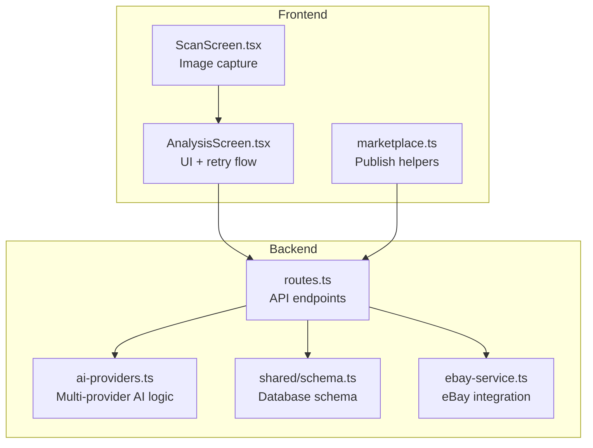
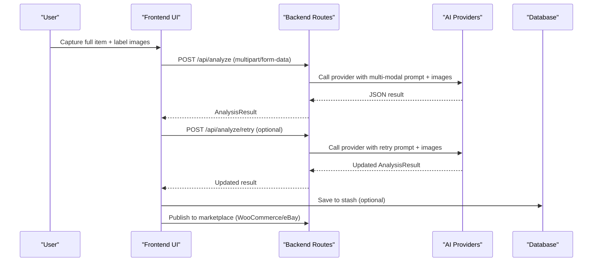
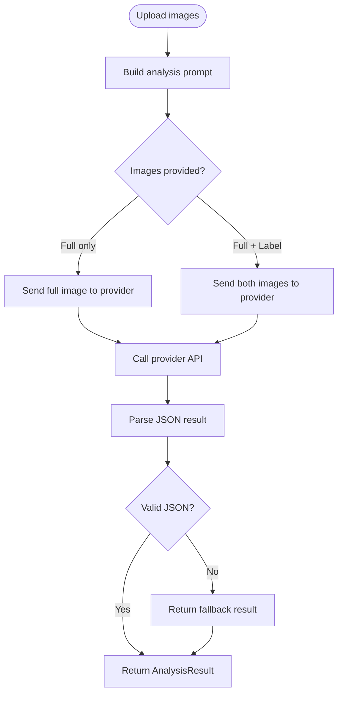
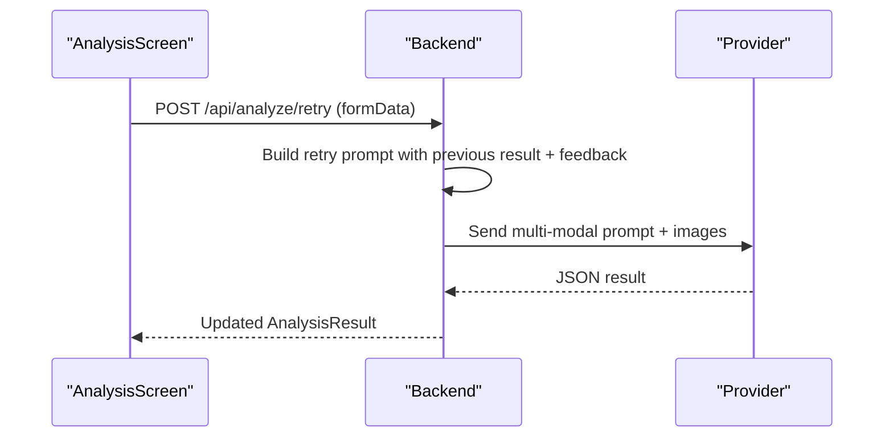
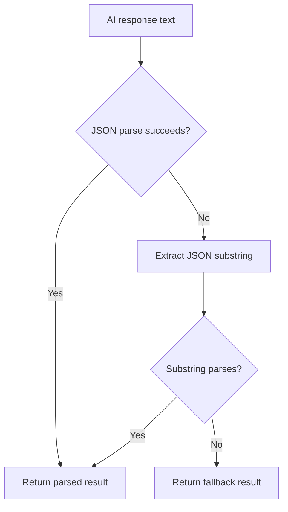
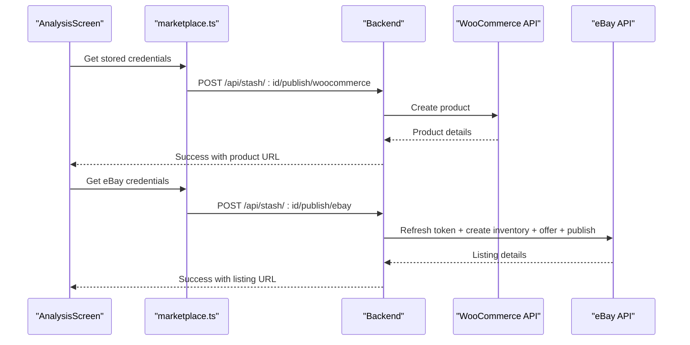
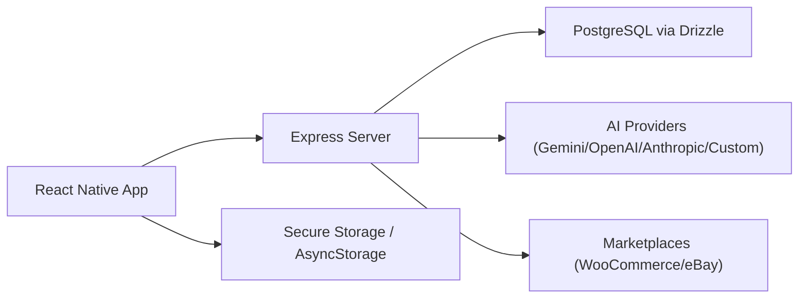

# Item Analysis Workflow

<cite>
**Referenced Files in This Document**
- [server/index.ts](file://server/index.ts)
- [server/routes.ts](file://server/routes.ts)
- [server/ai-providers.ts](file://server/ai-providers.ts)
- [client/screens/AnalysisScreen.tsx](file://client/screens/AnalysisScreen.tsx)
- [client/screens/ScanScreen.tsx](file://client/screens/ScanScreen.tsx)
- [client/lib/marketplace.ts](file://client/lib/marketplace.ts)
- [server/ebay-service.ts](file://server/ebay-service.ts)
- [shared/schema.ts](file://shared/schema.ts)
- [ENVIRONMENT.md](file://ENVIRONMENT.md)
- [package.json](file://package.json)
</cite>

## Table of Contents
1. [Introduction](#introduction)
2. [Project Structure](#project-structure)
3. [Core Components](#core-components)
4. [Architecture Overview](#architecture-overview)
5. [Detailed Component Analysis](#detailed-component-analysis)
6. [Dependency Analysis](#dependency-analysis)
7. [Performance Considerations](#performance-considerations)
8. [Troubleshooting Guide](#troubleshooting-guide)
9. [Conclusion](#conclusion)

## Introduction
This document explains the complete item analysis workflow in Hidden-Gem's AI system. It covers the end-to-end pipeline from image capture through AI processing to result generation, including multi-modal input handling, retry mechanisms with seller feedback, result parsing and validation, and integration with marketplace publishing (WooCommerce and eBay). It also documents the AnalysisResult interface, authentication assessment criteria, and practical guidance for performance optimization, rate limiting, and cost management.

## Project Structure
The system comprises:
- A React Native frontend that captures images and displays analysis results
- An Express backend that orchestrates AI analysis, marketplace publishing, and data persistence
- Shared database schema and types for cross-boundary consistency
- Marketplace integration utilities for secure credential handling and API publishing

**Diagram sources**
- [client/screens/ScanScreen.tsx](file://client/screens/ScanScreen.tsx#L17-L98)
- [client/screens/AnalysisScreen.tsx](file://client/screens/AnalysisScreen.tsx#L78-L143)
- [client/lib/marketplace.ts](file://client/lib/marketplace.ts#L81-L129)
- [server/routes.ts](file://server/routes.ts#L299-L385)
- [server/ai-providers.ts](file://server/ai-providers.ts#L380-L396)
- [shared/schema.ts](file://shared/schema.ts#L29-L50)
- [server/ebay-service.ts](file://server/ebay-service.ts#L386-L430)

**Section sources**
- [server/index.ts](file://server/index.ts#L1-L262)
- [server/routes.ts](file://server/routes.ts#L1-L929)
- [shared/schema.ts](file://shared/schema.ts#L1-L344)

## Core Components
- Image capture and retry UI: The frontend captures two images (full item and label) and presents the analysis results with editing and retry capabilities.
- AI analysis orchestration: The backend accepts multipart/form-data, constructs multi-modal prompts, and queries supported AI providers.
- Multi-modal provider support: The system supports Gemini, OpenAI, Anthropic, and a custom endpoint with standardized input formats.
- Retry mechanism: Incorporates seller feedback into a structured prompt template to refine the analysis.
- Result parsing and validation: Robust JSON parsing with fallback to a safe default result when AI output is incomplete.
- Marketplace publishing: Securely stores credentials and publishes listings to WooCommerce and eBay.

**Section sources**
- [client/screens/ScanScreen.tsx](file://client/screens/ScanScreen.tsx#L26-L87)
- [client/screens/AnalysisScreen.tsx](file://client/screens/AnalysisScreen.tsx#L111-L179)
- [server/routes.ts](file://server/routes.ts#L299-L385)
- [server/ai-providers.ts](file://server/ai-providers.ts#L131-L180)
- [client/lib/marketplace.ts](file://client/lib/marketplace.ts#L81-L129)

## Architecture Overview
The workflow begins with the user capturing two images, sending them to the backend, and receiving a structured analysis result. The frontend allows edits and retries based on seller feedback. Listings can be published to marketplace platforms using stored credentials.

**Diagram sources**
- [client/screens/ScanScreen.tsx](file://client/screens/ScanScreen.tsx#L26-L87)
- [client/screens/AnalysisScreen.tsx](file://client/screens/AnalysisScreen.tsx#L111-L179)
- [server/routes.ts](file://server/routes.ts#L299-L385)
- [server/ai-providers.ts](file://server/ai-providers.ts#L418-L442)
- [shared/schema.ts](file://shared/schema.ts#L29-L50)

## Detailed Component Analysis

### Analysis Prompt Structure and Multi-Modal Inputs
- The initial analysis prompt instructs the AI to assess authentication, market valuation, item identification, SEO, and categorization. It enforces strict JSON output requirements.
- Multi-modal inputs are constructed from uploaded images:
  - Full item image (required for context)
  - Label/tag image (optional but improves authentication insights)
- Providers accept inputs differently:
  - Gemini: inlineData with base64 mimeType/data
  - OpenAI: image_url with data URL scheme
  - Anthropic: image source with base64 media_type
  - Custom: configurable endpoint with standardized message structure

**Diagram sources**
- [server/routes.ts](file://server/routes.ts#L299-L385)
- [server/ai-providers.ts](file://server/ai-providers.ts#L48-L99)
- [server/ai-providers.ts](file://server/ai-providers.ts#L224-L248)

**Section sources**
- [server/routes.ts](file://server/routes.ts#L299-L385)
- [server/ai-providers.ts](file://server/ai-providers.ts#L48-L99)

### AnalysisResult Interface and Enhanced Fields
The AnalysisResult interface combines legacy fields for backward compatibility with enhanced fields for richer analysis:
- Legacy fields: title, description, category, estimatedValue, condition, SEO fields, tags
- Enhanced fields: brand, subtitle, short/full descriptions, numeric value range, suggested list price, confidence, authentication assessment, market analysis, aspects taxonomy, marketplace category IDs

Authentication assessment criteria:
- authenticity: Enumerated values including Authentic, Likely Authentic, Uncertain, Likely Counterfeit, Counterfeit
- authenticityConfidence: 0–100 numeric confidence score
- authenticityDetails: Free-text explanation of indicators
- authenticationTips: Practical tips for verification

Confidence scoring:
- confidence: high/medium/low categorical confidence aligned with authenticity confidence

**Section sources**
- [server/ai-providers.ts](file://server/ai-providers.ts#L12-L41)
- [server/ai-providers.ts](file://server/ai-providers.ts#L50-L69)

### Retry Mechanism Workflow with Seller Feedback
The retry flow incorporates seller feedback into a structured prompt template:
- Previous appraisal is embedded into the retry prompt
- Seller feedback is inserted verbatim
- The system preserves image inputs and calls the same provider logic
- Updated result is returned for review and optional saving

**Diagram sources**
- [client/screens/AnalysisScreen.tsx](file://client/screens/AnalysisScreen.tsx#L145-L179)
- [server/routes.ts](file://server/routes.ts#L672-L711)
- [server/ai-providers.ts](file://server/ai-providers.ts#L398-L416)

**Section sources**
- [server/routes.ts](file://server/routes.ts#L672-L711)
- [server/ai-providers.ts](file://server/ai-providers.ts#L398-L442)

### Result Parsing, Validation, and Fallback Strategies
- Attempt direct JSON.parse of AI response
- If failure, extract the first JSON object substring and parse
- If still invalid, return a comprehensive fallback result with safe defaults for all fields
- Merge parsed result with fallback defaults to ensure all fields are populated

**Diagram sources**
- [server/ai-providers.ts](file://server/ai-providers.ts#L131-L180)
- [server/ai-providers.ts](file://server/ai-providers.ts#L101-L129)

**Section sources**
- [server/ai-providers.ts](file://server/ai-providers.ts#L131-L180)

### Marketplace Publishing Integration
- Frontend securely stores marketplace credentials using platform-specific secure storage on native and AsyncStorage on web.
- Backend exposes endpoints to publish to WooCommerce and eBay using stored credentials.
- eBay integration includes token refresh, inventory updates, and listing creation/publishing.

**Diagram sources**
- [client/lib/marketplace.ts](file://client/lib/marketplace.ts#L81-L129)
- [server/routes.ts](file://server/routes.ts#L387-L455)
- [server/routes.ts](file://server/routes.ts#L457-L647)
- [server/ebay-service.ts](file://server/ebay-service.ts#L386-L430)

**Section sources**
- [client/lib/marketplace.ts](file://client/lib/marketplace.ts#L19-L79)
- [server/routes.ts](file://server/routes.ts#L387-L455)
- [server/routes.ts](file://server/routes.ts#L457-L647)
- [server/ebay-service.ts](file://server/ebay-service.ts#L386-L430)

### Data Persistence and Schema
- Stash items store analysis results, images, and marketplace publication flags.
- The schema defines JSONB fields for flexible analysis outputs and arrays for tags/keywords.

**Section sources**
- [shared/schema.ts](file://shared/schema.ts#L29-L50)

## Dependency Analysis
The system exhibits clear separation of concerns:
- Frontend depends on React Navigation, Expo camera/image picker, and React Query for API interactions
- Backend depends on Express, Multer for uploads, Drizzle ORM for database operations, and external AI APIs
- Security-sensitive credentials are handled via secure storage on native platforms and AsyncStorage on web

**Diagram sources**
- [package.json](file://package.json#L24-L76)
- [server/db.ts](file://server/db.ts#L1-L19)
- [client/lib/marketplace.ts](file://client/lib/marketplace.ts#L1-L129)

**Section sources**
- [package.json](file://package.json#L24-L76)
- [server/db.ts](file://server/db.ts#L1-L19)

## Performance Considerations
- Image size limits: Multer is configured to limit uploads to approximately 10 MB per file. Keep images under 2MB for faster processing and reduced latency.
- Provider selection: Choose models appropriate for the task—flash models for speed, pro models for accuracy. Adjust model parameters in provider configuration.
- Network efficiency: Compress images before upload and avoid redundant re-analyses when edits are minor.
- Rate limiting: Respect provider quotas and implement exponential backoff on rate limit errors. Monitor provider usage and adjust concurrency.
- Cost management: Track tokens/costs per request. Prefer smaller, focused prompts and reuse validated results when possible.
- Caching: Cache intermediate results (e.g., processed images) on the device to reduce repeated uploads during retries.

[No sources needed since this section provides general guidance]

## Troubleshooting Guide
Common issues and resolutions:
- AI provider connectivity failures:
  - Verify API keys and endpoint URLs are configured correctly
  - Use the provider test endpoint to validate connectivity
- Invalid JSON from AI:
  - Ensure the prompt enforces strict JSON output
  - Confirm responseMimeType is set to application/json for Gemini
- Upload errors:
  - Check Multer limits and MIME types
  - Validate image formats supported by providers
- Marketplace publishing errors:
  - Confirm credentials are stored and accessible
  - For eBay, ensure business policies are configured in Seller Hub
- Database connectivity:
  - Ensure DATABASE_URL is set and reachable
  - Apply migrations using drizzle-kit

**Section sources**
- [server/routes.ts](file://server/routes.ts#L649-L670)
- [server/ai-providers.ts](file://server/ai-providers.ts#L604-L695)
- [ENVIRONMENT.md](file://ENVIRONMENT.md#L18-L68)

## Conclusion
Hidden-Gem’s item analysis workflow integrates robust multi-modal AI analysis, structured result parsing with fallbacks, and a seamless retry mechanism driven by seller feedback. The system supports secure marketplace publishing to both WooCommerce and eBay, with clear separation of concerns between frontend UX, backend orchestration, and database persistence. By following the outlined best practices for performance, rate limiting, and cost management, teams can maintain reliable, scalable AI-driven item analysis at scale.