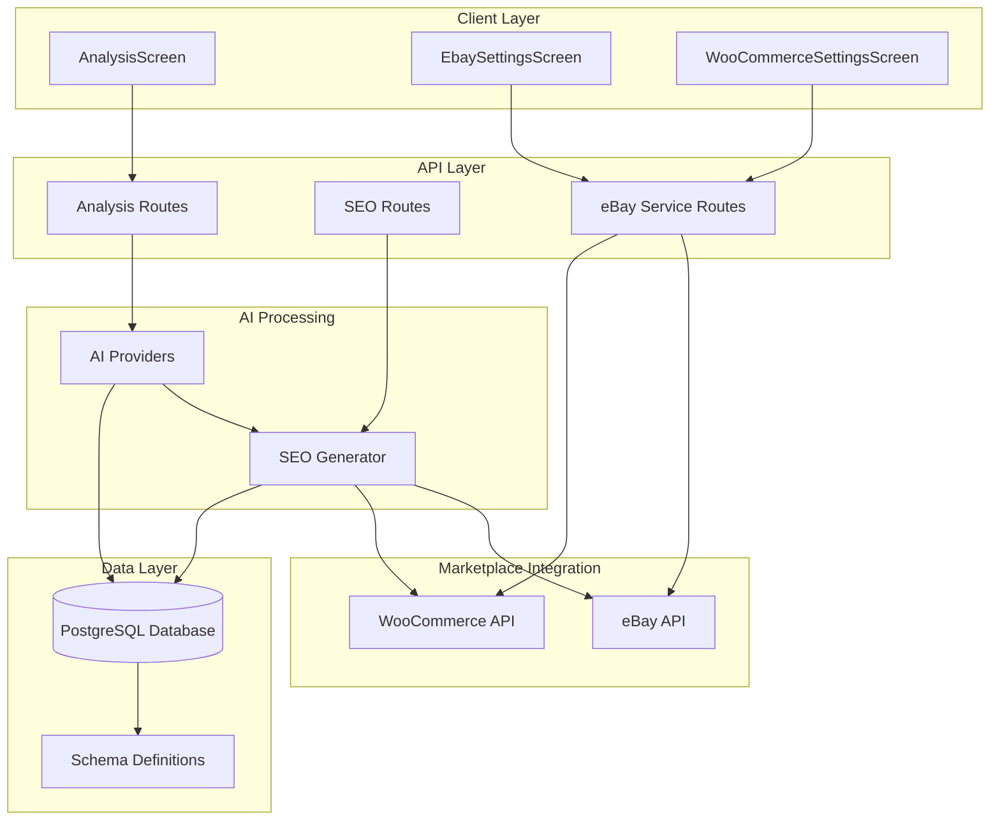
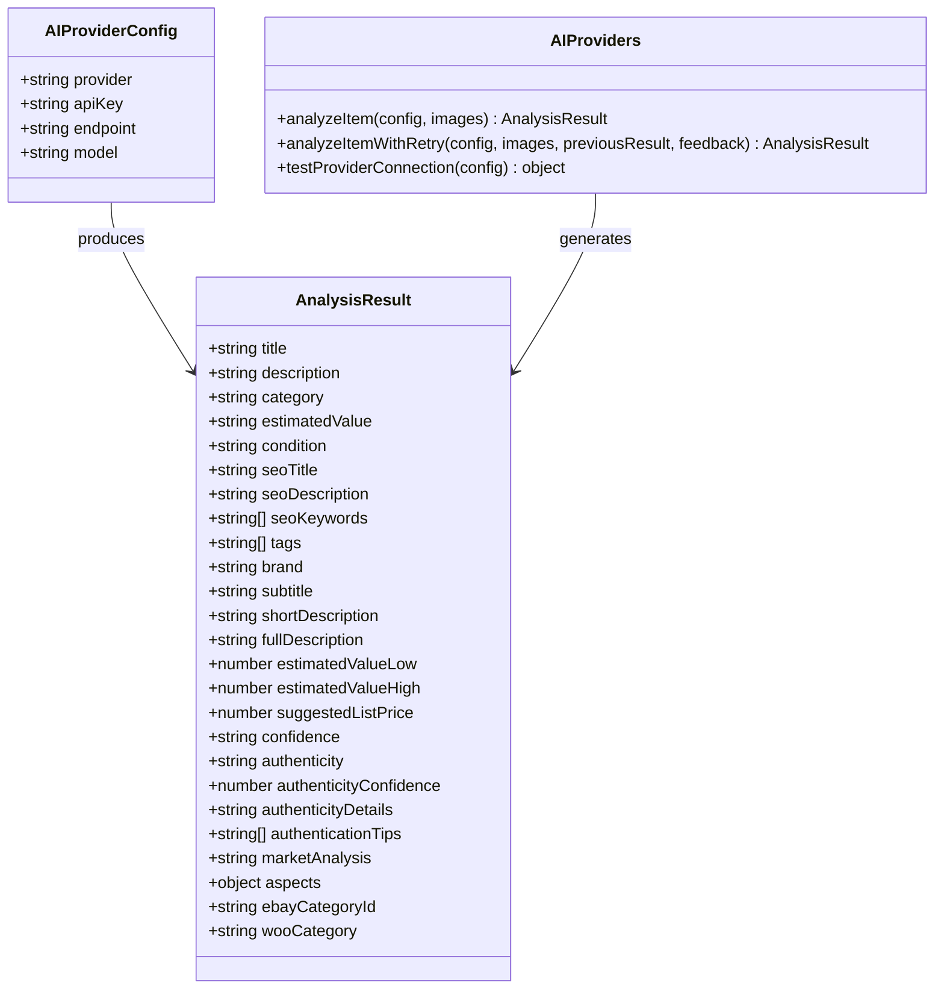
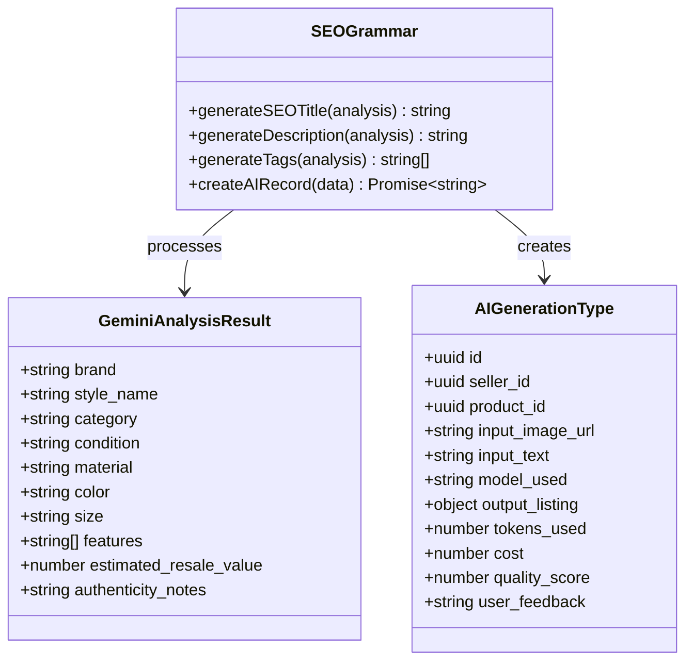
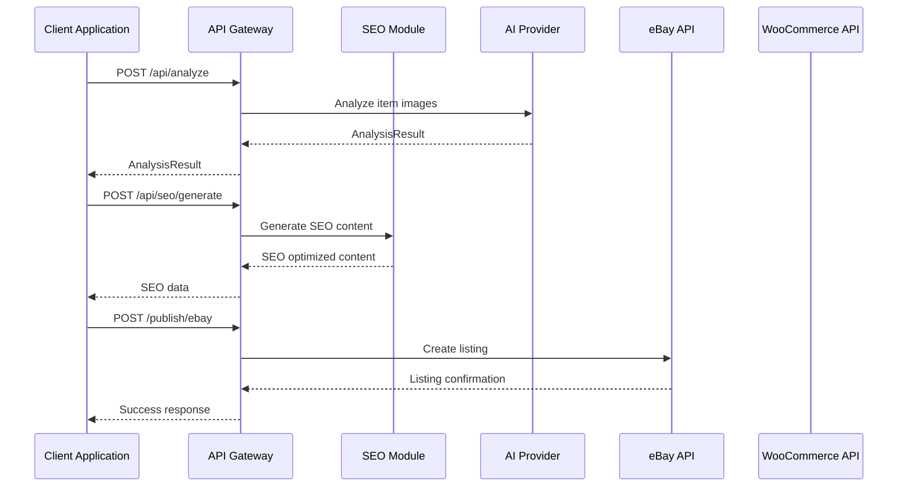
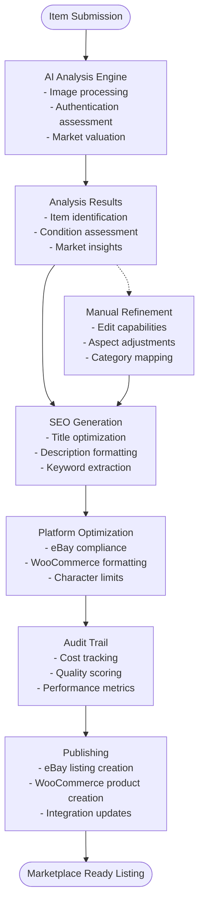
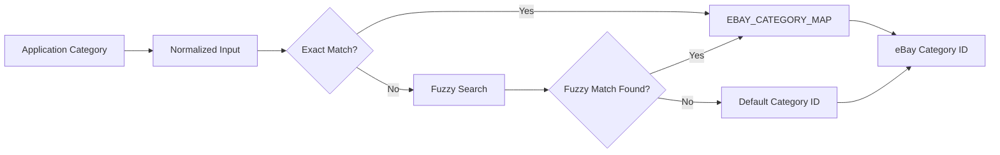
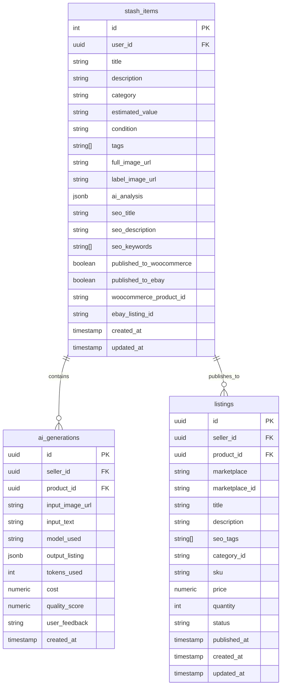

# SEO Optimization System

<cite>
**Referenced Files in This Document**
- [ai-seo.ts](file://server/ai-seo.ts)
- [routes.ts](file://server/routes.ts)
- [ai-providers.ts](file://server/ai-providers.ts)
- [ebay-service.ts](file://server/ebay-service.ts)
- [types.ts](file://shared/types.ts)
- [schema.ts](file://shared/schema.ts)
- [AnalysisScreen.tsx](file://client/screens/AnalysisScreen.tsx)
- [EbaySettingsScreen.tsx](file://client/screens/EbaySettingsScreen.tsx)
- [WooCommerceSettingsScreen.tsx](file://client/screens/WooCommerceSettingsScreen.tsx)
</cite>

## Table of Contents
1. [Introduction](#introduction)
2. [System Architecture](#system-architecture)
3. [Core Components](#core-components)
4. [SEO Content Generation Workflow](#seo-content-generation-workflow)
5. [Platform-Specific Optimizations](#platform-specific-optimizations)
6. [Data Flow and Integration](#data-flow-and-integration)
7. [Quality Assurance and Best Practices](#quality-assurance-and-best-practices)
8. [Performance Considerations](#performance-considerations)
9. [Troubleshooting Guide](#troubleshooting-guide)
10. [Conclusion](#conclusion)

## Introduction

The Hidden-Gem AI-powered SEO optimization system transforms AI analysis results into marketplace-ready listings for eBay and WooCommerce platforms. This system provides automated SEO title generation, meta description creation, and keyword targeting while ensuring platform-specific compliance and optimization strategies.

The system integrates three core components: AI-powered item analysis, SEO content generation, and marketplace publishing. It leverages advanced AI providers (Gemini, OpenAI, Anthropic) for comprehensive item appraisal and authentication assessment, then applies platform-specific SEO strategies to maximize visibility and conversion rates.

## System Architecture

The SEO optimization system follows a modular architecture with clear separation of concerns:

**Diagram sources**
- [routes.ts](file://server/routes.ts#L44-L929)
- [ai-seo.ts](file://server/ai-seo.ts#L1-L112)
- [ai-providers.ts](file://server/ai-providers.ts#L1-L696)

## Core Components

### AI Analysis Engine

The AI analysis engine provides comprehensive item appraisal and authentication assessment through multiple provider support:

**Diagram sources**
- [ai-providers.ts](file://server/ai-providers.ts#L5-L41)
- [ai-providers.ts](file://server/ai-providers.ts#L224-L396)

**Section sources**
- [ai-providers.ts](file://server/ai-providers.ts#L1-L696)
- [types.ts](file://shared/types.ts#L102-L116)

### SEO Content Generation Module

The SEO module transforms AI analysis results into platform-optimized listing content:

**Diagram sources**
- [ai-seo.ts](file://server/ai-seo.ts#L17-L111)
- [types.ts](file://shared/types.ts#L55-L73)

**Section sources**
- [ai-seo.ts](file://server/ai-seo.ts#L1-L112)
- [schema.ts](file://shared/schema.ts#L174-L187)

### Marketplace Integration Layer

The system provides seamless integration with eBay and WooCommerce platforms:

**Diagram sources**
- [routes.ts](file://server/routes.ts#L299-L385)
- [routes.ts](file://server/routes.ts#L840-L859)

**Section sources**
- [routes.ts](file://server/routes.ts#L44-L929)

## SEO Content Generation Workflow

### Analysis to Listing Pipeline

The SEO optimization workflow follows a structured pipeline from item analysis to marketplace publication:

**Diagram sources**
- [routes.ts](file://server/routes.ts#L299-L385)
- [ai-seo.ts](file://server/ai-seo.ts#L80-L111)

### SEO Prompt Engineering Strategies

The system employs sophisticated prompt engineering for optimal AI performance:

**Primary Analysis Prompt Structure:**
- Authentication assessment with detailed indicator evaluation
- Market valuation research with comparable sales analysis
- Item identification with comprehensive categorization
- SEO optimization with platform-specific requirements
- Item specifics with structured aspect extraction

**Retry Analysis Enhancement:**
- Previous appraisal context preservation
- Feedback incorporation mechanism
- Iterative improvement workflow
- Quality validation and confidence scoring

**Section sources**
- [ai-providers.ts](file://server/ai-providers.ts#L48-L99)
- [ai-providers.ts](file://server/ai-providers.ts#L398-L442)

## Platform-Specific Optimizations

### eBay Platform Optimization

The eBay integration ensures strict compliance with marketplace requirements:

**Character Limit Management:**
- Title enforcement: 80-character maximum
- Subtitle optimization: 55-character maximum
- Category mapping: Automatic category ID resolution
- Condition standardization: eBay-specific condition values

**Listing Structure Compliance:**
- Inventory item creation with product details
- Offer creation with pricing and policies
- Multi-image support with proper formatting
- Authentication notes integration

**Category Mapping System:**

**Diagram sources**
- [ebay-service.ts](file://server/ebay-service.ts#L297-L313)

**Section sources**
- [ebay-service.ts](file://server/ebay-service.ts#L274-L313)
- [routes.ts](file://server/routes.ts#L520-L570)

### WooCommerce Platform Optimization

The WooCommerce integration focuses on e-commerce best practices:

**Product Structure Optimization:**
- Simple product type configuration
- Short description for storefront display
- Detailed description for product pages
- Category hierarchy establishment
- Image optimization and CDN integration

**API Integration Features:**
- REST API authentication handling
- Product synchronization workflows
- Stock level management
- Pricing strategy implementation
- SEO-friendly URL generation

**Section sources**
- [routes.ts](file://server/routes.ts#L409-L450)
- [WooCommerceSettingsScreen.tsx](file://client/screens/WooCommerceSettingsScreen.tsx#L1-L512)

## Data Flow and Integration

### Database Schema Integration

The system maintains comprehensive data persistence across all optimization stages:

**Diagram sources**
- [schema.ts](file://shared/schema.ts#L29-L50)
- [schema.ts](file://shared/schema.ts#L174-L187)
- [schema.ts](file://shared/schema.ts#L153-L172)

### Integration Patterns

The system implements robust integration patterns for seamless marketplace operations:

**Credential Management:**
- Secure credential storage with platform-specific encryption
- OAuth token refresh mechanisms
- Credential validation and testing
- Environment-specific configuration management

**Synchronization Workflows:**
- Asynchronous job queuing for marketplace operations
- Retry mechanisms for failed operations
- Conflict resolution strategies
- Status monitoring and reporting

**Section sources**
- [schema.ts](file://shared/schema.ts#L1-L344)
- [EbaySettingsScreen.tsx](file://client/screens/EbaySettingsScreen.tsx#L1-L568)

## Quality Assurance and Best Practices

### Content Quality Metrics

The system implements comprehensive quality assurance measures:

**Authentication Confidence Scoring:**
- Multi-factor authentication verification
- Confidence percentage calculation
- Detailed authentication reports
- Expert tip integration for manual verification

**Market Analysis Validation:**
- Comparable sales research
- Trend analysis and seasonal factors
- Price range validation
- Market sentiment assessment

**SEO Optimization Standards:**
- Character limit compliance checking
- Keyword density optimization
- Platform-specific formatting validation
- Performance impact measurement

### Error Handling and Recovery

Robust error handling ensures system reliability:

**AI Provider Failover:**
- Multiple provider support with automatic switching
- Retry logic with exponential backoff
- Fallback content generation
- Error logging and reporting

**Marketplace Integration Resilience:**
- Network timeout handling
- Rate limiting compliance
- Partial failure recovery
- Transaction rollback capabilities

**Section sources**
- [ai-providers.ts](file://server/ai-providers.ts#L604-L695)
- [routes.ts](file://server/routes.ts#L855-L858)

## Performance Considerations

### Optimization Strategies

The system incorporates multiple performance optimization techniques:

**AI Processing Efficiency:**
- Image compression and optimization
- Batch processing capabilities
- Caching mechanisms for repeated analyses
- Model selection based on complexity requirements

**Database Performance:**
- Index optimization for query performance
- Connection pooling for concurrent operations
- Data archiving for historical analysis
- Monitoring and alerting for performance degradation

**Network Optimization:**
- CDN integration for asset delivery
- API endpoint caching
- Asynchronous processing for long-running operations
- Load balancing for high-traffic scenarios

### Scalability Architecture

The system is designed for horizontal scalability:

**Microservice Design:**
- Separate services for analysis, SEO, and publishing
- Independent scaling of different components
- Container orchestration support
- Cloud-native deployment patterns

**Resource Management:**
- Auto-scaling based on workload
- Resource quota enforcement
- Memory optimization for image processing
- CPU allocation for AI computations

## Troubleshooting Guide

### Common Issues and Solutions

**AI Analysis Failures:**
- Verify API key configuration for selected provider
- Check image format and size requirements
- Review network connectivity and firewall settings
- Monitor provider rate limits and quotas

**SEO Generation Problems:**
- Validate analysis result completeness
- Check character limit compliance
- Review platform-specific formatting requirements
- Test with sample data to isolate issues

**Marketplace Integration Issues:**
- Verify credential validity and expiration
- Check marketplace API status and maintenance schedules
- Review permission scopes and access levels
- Monitor API response codes and error messages

### Debugging Tools and Techniques

**Development Environment:**
- Local API testing with mock data
- Database query optimization analysis
- Performance profiling and bottleneck identification
- Logging and monitoring implementation

**Production Monitoring:**
- Real-time error tracking and alerting
- Performance metrics collection and analysis
- User experience monitoring and feedback
- Automated health checks and self-healing capabilities

**Section sources**
- [routes.ts](file://server/routes.ts#L855-L858)
- [ai-providers.ts](file://server/ai-providers.ts#L604-L695)

## Conclusion

The Hidden-Gem AI-powered SEO optimization system provides a comprehensive solution for transforming AI analysis results into marketplace-ready listings. Through sophisticated prompt engineering, platform-specific optimizations, and robust integration patterns, the system delivers high-quality SEO content that maximizes visibility and conversion rates across eBay and WooCommerce platforms.

The modular architecture ensures maintainability and extensibility, while comprehensive quality assurance measures guarantee reliable operation. The system's focus on performance optimization and scalability positions it for growth and adaptation to evolving marketplace requirements.

Key strengths include:
- Advanced AI-powered item analysis with authentication assessment
- Platform-specific SEO optimization with character limit compliance
- Robust marketplace integration with error handling and recovery
- Comprehensive audit trail and quality metrics
- Scalable architecture supporting future enhancements

The system represents a significant advancement in automated e-commerce optimization, providing resellers with powerful tools to enhance their marketplace presence and improve business outcomes.