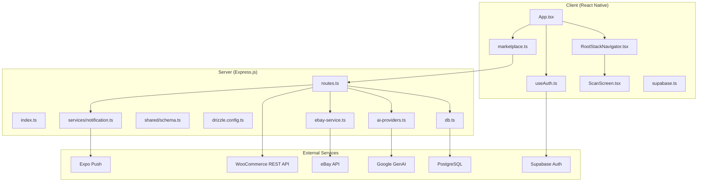
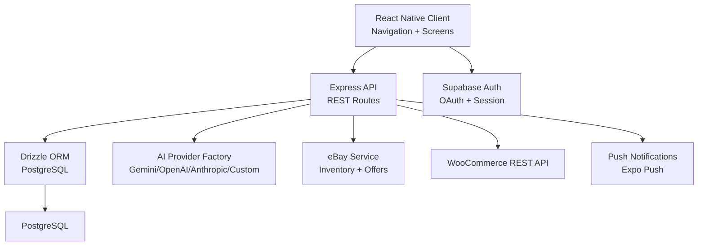
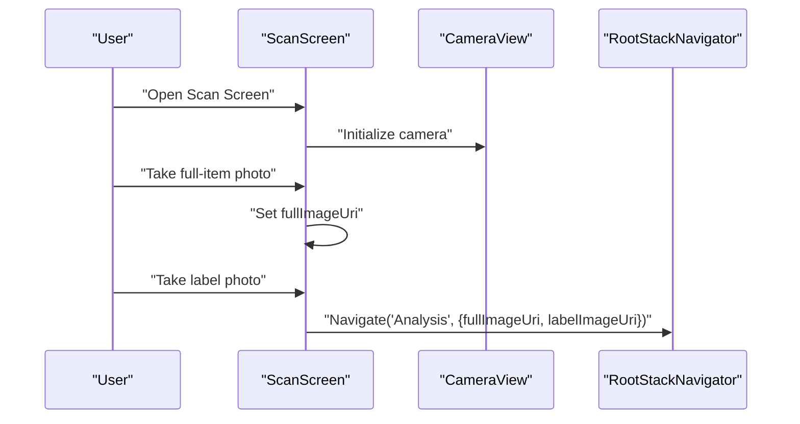
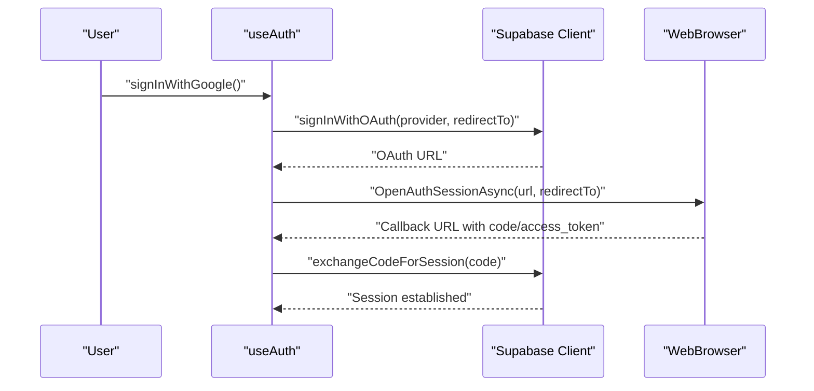
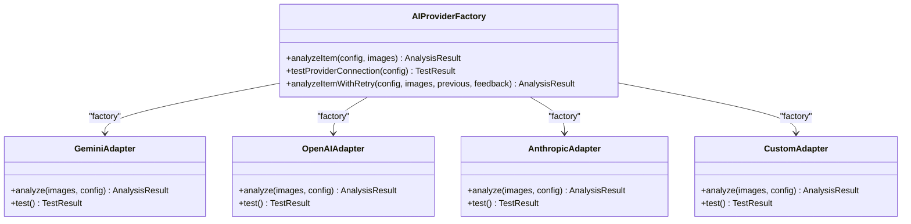
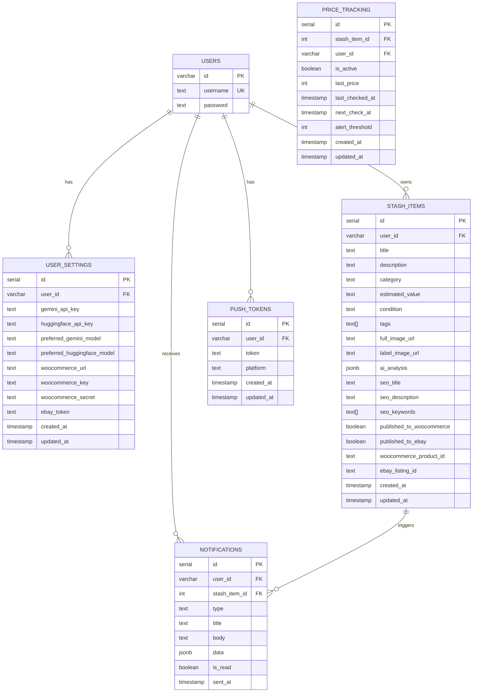
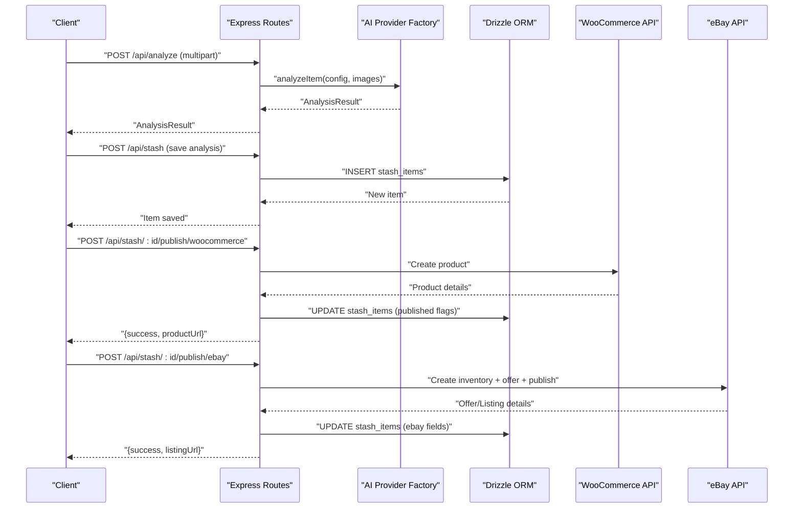
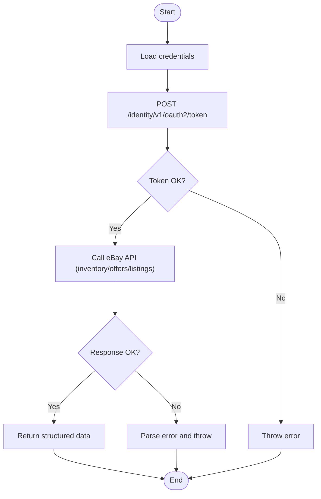
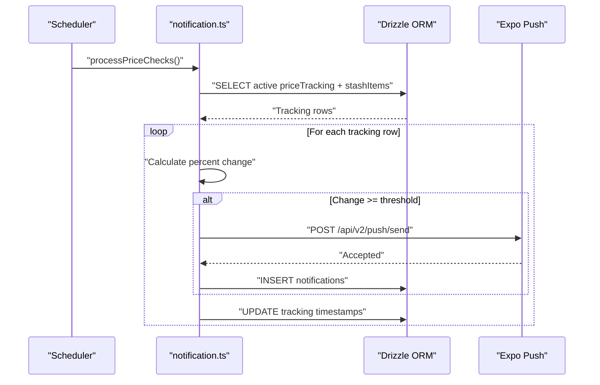
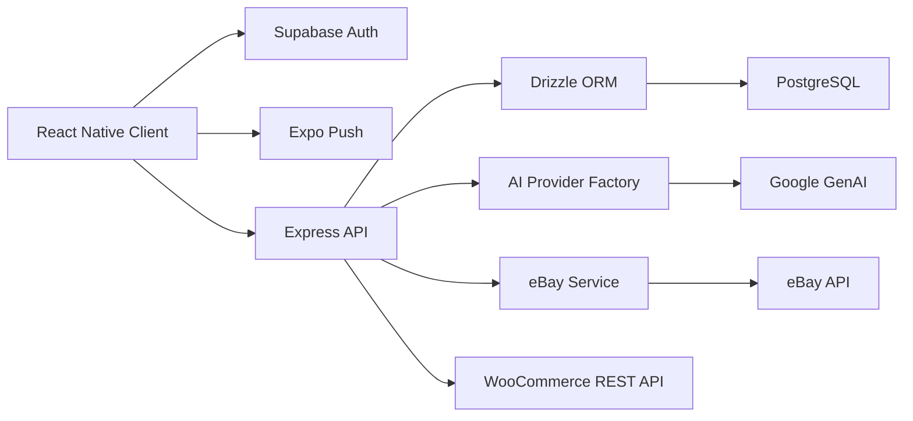

# Architecture Overview

<cite>
**Referenced Files in This Document**
- [package.json](file://package.json)
- [server/index.ts](file://server/index.ts)
- [server/routes.ts](file://server/routes.ts)
- [server/db.ts](file://server/db.ts)
- [drizzle.config.ts](file://drizzle.config.ts)
- [shared/schema.ts](file://shared/schema.ts)
- [client/App.tsx](file://client/App.tsx)
- [client/navigation/RootStackNavigator.tsx](file://client/navigation/RootStackNavigator.tsx)
- [client/screens/ScanScreen.tsx](file://client/screens/ScanScreen.tsx)
- [client/lib/supabase.ts](file://client/lib/supabase.ts)
- [client/hooks/useAuth.ts](file://client/hooks/useAuth.ts)
- [client/lib/marketplace.ts](file://client/lib/marketplace.ts)
- [server/ai-providers.ts](file://server/ai-providers.ts)
- [server/ebay-service.ts](file://server/ebay-service.ts)
- [server/services/notification.ts](file://server/services/notification.ts)
- [shared/types.ts](file://shared/types.ts)
</cite>

## Table of Contents
1. [Introduction](#introduction)
2. [Project Structure](#project-structure)
3. [Core Components](#core-components)
4. [Architecture Overview](#architecture-overview)
5. [Detailed Component Analysis](#detailed-component-analysis)
6. [Dependency Analysis](#dependency-analysis)
7. [Performance Considerations](#performance-considerations)
8. [Troubleshooting Guide](#troubleshooting-guide)
9. [Conclusion](#conclusion)

## Introduction
This document describes the full-stack architecture of Hidden-Gem, a mobile-first application that enables users to capture item photos, analyze them via AI, and publish listings to marketplace platforms (eBay and WooCommerce). The system comprises:
- React Native frontend with TypeScript and Expo
- Express.js backend with TypeScript
- PostgreSQL database with Drizzle ORM and schema-driven migrations
- Authentication via Supabase
- AI analysis powered by a pluggable provider factory supporting multiple AI backends
- Real-time and push notification support via Expo Push
- Marketplace integrations for eBay and WooCommerce

## Project Structure
The repository follows a monorepo-like structure with clear separation of concerns:
- client: React Native mobile UI, navigation, screens, and shared UI components
- server: Express.js API, route handlers, services, and integrations
- shared: Shared database schema and type definitions
- migrations: Drizzle-generated migration files
- .maestro: Test flows for Maestro UI testing

**Diagram sources**
- [client/App.tsx](file://client/App.tsx#L1-L67)
- [client/navigation/RootStackNavigator.tsx](file://client/navigation/RootStackNavigator.tsx#L1-L133)
- [client/screens/ScanScreen.tsx](file://client/screens/ScanScreen.tsx#L1-L394)
- [client/lib/supabase.ts](file://client/lib/supabase.ts#L1-L39)
- [client/hooks/useAuth.ts](file://client/hooks/useAuth.ts#L1-L151)
- [client/lib/marketplace.ts](file://client/lib/marketplace.ts#L1-L129)
- [server/index.ts](file://server/index.ts#L1-L262)
- [server/routes.ts](file://server/routes.ts#L1-L929)
- [server/db.ts](file://server/db.ts#L1-L19)
- [shared/schema.ts](file://shared/schema.ts#L1-L344)
- [drizzle.config.ts](file://drizzle.config.ts#L1-L19)
- [server/ai-providers.ts](file://server/ai-providers.ts#L1-L696)
- [server/ebay-service.ts](file://server/ebay-service.ts#L1-L474)
- [server/services/notification.ts](file://server/services/notification.ts#L1-L414)

**Section sources**
- [package.json](file://package.json#L1-L95)
- [server/index.ts](file://server/index.ts#L1-L262)
- [server/routes.ts](file://server/routes.ts#L1-L929)
- [server/db.ts](file://server/db.ts#L1-L19)
- [drizzle.config.ts](file://drizzle.config.ts#L1-L19)
- [shared/schema.ts](file://shared/schema.ts#L1-L344)
- [client/App.tsx](file://client/App.tsx#L1-L67)
- [client/navigation/RootStackNavigator.tsx](file://client/navigation/RootStackNavigator.tsx#L1-L133)
- [client/screens/ScanScreen.tsx](file://client/screens/ScanScreen.tsx#L1-L394)
- [client/lib/supabase.ts](file://client/lib/supabase.ts#L1-L39)
- [client/hooks/useAuth.ts](file://client/hooks/useAuth.ts#L1-L151)
- [client/lib/marketplace.ts](file://client/lib/marketplace.ts#L1-L129)
- [server/ai-providers.ts](file://server/ai-providers.ts#L1-L696)
- [server/ebay-service.ts](file://server/ebay-service.ts#L1-L474)
- [server/services/notification.ts](file://server/services/notification.ts#L1-L414)
- [shared/types.ts](file://shared/types.ts#L1-L116)

## Core Components
- React Native Frontend
  - Navigation: Native stack navigator with modal presentation for analysis
  - Screens: Authentication, scanning, analysis, settings, and marketplace configuration
  - Authentication: Supabase-based OAuth and session management
  - Marketplace helpers: Encapsulate credentials retrieval and publish calls
- Express Backend
  - Routing: REST endpoints for notifications, analytics, stash items, AI provider testing, and marketplace publishing
  - Database: Drizzle ORM with PostgreSQL schema and migrations
  - AI Provider Factory: Pluggable AI analysis with Gemini, OpenAI, Anthropic, and custom endpoints
  - Integrations: eBay and WooCommerce publishing flows
  - Notifications: Push notifications via Expo and price tracking automation
- Shared Layer
  - Schema: Database schema definitions and Zod insert schemas
  - Types: Canonical types for FlipAgent domain entities

**Section sources**
- [client/navigation/RootStackNavigator.tsx](file://client/navigation/RootStackNavigator.tsx#L18-L31)
- [client/screens/ScanScreen.tsx](file://client/screens/ScanScreen.tsx#L17-L62)
- [client/lib/marketplace.ts](file://client/lib/marketplace.ts#L19-L79)
- [server/routes.ts](file://server/routes.ts#L44-L800)
- [server/db.ts](file://server/db.ts#L1-L19)
- [shared/schema.ts](file://shared/schema.ts#L1-L344)
- [server/ai-providers.ts](file://server/ai-providers.ts#L380-L396)
- [server/ebay-service.ts](file://server/ebay-service.ts#L42-L62)
- [server/services/notification.ts](file://server/services/notification.ts#L31-L129)

## Architecture Overview
Hidden-Gem employs a layered architecture:
- Presentation Layer (React Native): Handles UI, navigation, camera capture, and user interactions
- Application Layer (Express): Implements business logic, orchestrates AI analysis, and manages marketplace publishing
- Persistence Layer (PostgreSQL): Stores user data, settings, stash items, marketplace listings, and notifications
- Integration Layer: Calls external APIs (eBay, WooCommerce, GenAI) and push notification service

**Diagram sources**
- [client/App.tsx](file://client/App.tsx#L1-L67)
- [server/index.ts](file://server/index.ts#L1-L262)
- [server/routes.ts](file://server/routes.ts#L1-L929)
- [server/db.ts](file://server/db.ts#L1-L19)
- [shared/schema.ts](file://shared/schema.ts#L1-L344)
- [server/ai-providers.ts](file://server/ai-providers.ts#L380-L396)
- [server/ebay-service.ts](file://server/ebay-service.ts#L42-L62)
- [server/services/notification.ts](file://server/services/notification.ts#L5-L26)

## Detailed Component Analysis

### Mobile-First Navigation and Camera Capture
The client initializes the app with a dark theme, global error boundary, and React Query provider. Navigation is driven by a native stack navigator with modals for analysis. The scan screen coordinates camera permissions, flash toggling, and dual-shot capture (full item + label close-up), then navigates to the analysis screen.

**Diagram sources**
- [client/screens/ScanScreen.tsx](file://client/screens/ScanScreen.tsx#L26-L62)
- [client/navigation/RootStackNavigator.tsx](file://client/navigation/RootStackNavigator.tsx#L51-L85)

**Section sources**
- [client/App.tsx](file://client/App.tsx#L1-L67)
- [client/navigation/RootStackNavigator.tsx](file://client/navigation/RootStackNavigator.tsx#L34-L131)
- [client/screens/ScanScreen.tsx](file://client/screens/ScanScreen.tsx#L17-L87)

### Authentication and Supabase Integration
Authentication is handled via Supabase with OAuth flows for Google and password-based login. The hook manages session state, persistence, and browser redirect handling across platforms.

**Diagram sources**
- [client/hooks/useAuth.ts](file://client/hooks/useAuth.ts#L72-L137)
- [client/lib/supabase.ts](file://client/lib/supabase.ts#L20-L38)

**Section sources**
- [client/hooks/useAuth.ts](file://client/hooks/useAuth.ts#L12-L151)
- [client/lib/supabase.ts](file://client/lib/supabase.ts#L1-L39)

### AI Provider Factory Pattern
The backend implements a Factory pattern to select and invoke AI providers. The factory supports Gemini, OpenAI, Anthropic, and custom endpoints, with validation and retry logic. A test endpoint validates provider connectivity.

**Diagram sources**
- [server/ai-providers.ts](file://server/ai-providers.ts#L380-L396)
- [server/ai-providers.ts](file://server/ai-providers.ts#L604-L695)

**Section sources**
- [server/ai-providers.ts](file://server/ai-providers.ts#L3-L41)
- [server/ai-providers.ts](file://server/ai-providers.ts#L224-L248)
- [server/ai-providers.ts](file://server/ai-providers.ts#L250-L287)
- [server/ai-providers.ts](file://server/ai-providers.ts#L289-L332)
- [server/ai-providers.ts](file://server/ai-providers.ts#L334-L378)
- [server/ai-providers.ts](file://server/ai-providers.ts#L604-L695)

### Database and Repository Pattern with Drizzle ORM
The backend uses Drizzle ORM with a shared schema and migrations. The database layer encapsulates queries and updates, enabling a clean repository-style abstraction.

**Diagram sources**
- [shared/schema.ts](file://shared/schema.ts#L6-L293)
- [server/db.ts](file://server/db.ts#L1-L19)

**Section sources**
- [drizzle.config.ts](file://drizzle.config.ts#L1-L19)
- [shared/schema.ts](file://shared/schema.ts#L1-L344)
- [server/db.ts](file://server/db.ts#L1-L19)

### API Workflows: Camera-to-Marketplace Publishing
The end-to-end flow from camera capture to marketplace publishing involves:
- Client captures two images and navigates to Analysis
- Backend performs AI analysis via the provider factory
- Client saves analysis result to stash
- Client publishes to marketplace using stored credentials
- Backend validates credentials, calls marketplace APIs, updates stash, and records publication metadata

**Diagram sources**
- [server/routes.ts](file://server/routes.ts#L299-L385)
- [server/routes.ts](file://server/routes.ts#L387-L455)
- [server/routes.ts](file://server/routes.ts#L457-L647)
- [server/ai-providers.ts](file://server/ai-providers.ts#L380-L396)
- [client/lib/marketplace.ts](file://client/lib/marketplace.ts#L81-L129)

**Section sources**
- [server/routes.ts](file://server/routes.ts#L299-L385)
- [server/routes.ts](file://server/routes.ts#L387-L455)
- [server/routes.ts](file://server/routes.ts#L457-L647)
- [client/lib/marketplace.ts](file://client/lib/marketplace.ts#L19-L79)

### eBay Integration Service
The eBay service encapsulates OAuth token refresh, inventory CRUD, and listing management. It maps categories and handles environment-specific base URLs.

**Diagram sources**
- [server/ebay-service.ts](file://server/ebay-service.ts#L42-L62)
- [server/ebay-service.ts](file://server/ebay-service.ts#L386-L430)

**Section sources**
- [server/ebay-service.ts](file://server/ebay-service.ts#L1-L474)

### Notifications and Price Tracking
The notification service manages push tokens, sends push notifications via Expo, and runs periodic price checks to alert users of significant value changes.

**Diagram sources**
- [server/index.ts](file://server/index.ts#L247-L259)
- [server/services/notification.ts](file://server/services/notification.ts#L332-L413)

**Section sources**
- [server/services/notification.ts](file://server/services/notification.ts#L1-L414)
- [server/index.ts](file://server/index.ts#L227-L261)

## Dependency Analysis
The project leverages modern, complementary technologies:
- React Native + Expo for cross-platform mobile development
- Express.js for a lightweight, scalable backend
- Drizzle ORM with PostgreSQL for robust data modeling
- Supabase for authentication and secure storage
- AI providers via a pluggable factory
- eBay and WooCommerce REST APIs for marketplace publishing
- Expo Push for real-time notifications

**Diagram sources**
- [package.json](file://package.json#L24-L76)
- [server/index.ts](file://server/index.ts#L1-L262)
- [server/db.ts](file://server/db.ts#L1-L19)
- [shared/schema.ts](file://shared/schema.ts#L1-L344)
- [server/ai-providers.ts](file://server/ai-providers.ts#L224-L248)
- [server/ebay-service.ts](file://server/ebay-service.ts#L42-L62)

**Section sources**
- [package.json](file://package.json#L1-L95)

## Performance Considerations
- AI Analysis
  - Use provider selection and retry logic to improve accuracy and reduce rework
  - Consider caching analysis results per item to avoid repeated calls
- Database
  - Index frequently queried columns (e.g., user_id, stash_item_id)
  - Batch updates for price tracking to minimize round trips
- Network
  - Compress images before upload and enforce reasonable size limits
  - Implement exponential backoff for external API calls
- Offline
  - Persist stash items locally and queue publish actions for later retries
  - Use React Query with optimistic updates for responsive UX

## Troubleshooting Guide
- Authentication
  - Verify Supabase URL and keys are configured; check redirect URL for OAuth
- AI Provider Testing
  - Use the test endpoint to validate provider connectivity and credentials
- eBay Publishing
  - Ensure OAuth refresh token is present and environment matches sandbox/production
  - Confirm business policies are configured in Seller Hub
- Push Notifications
  - Register tokens for the user and confirm Expo push endpoint accessibility
- Database
  - Ensure DATABASE_URL is set and migrations are applied

**Section sources**
- [client/lib/supabase.ts](file://client/lib/supabase.ts#L20-L38)
- [server/routes.ts](file://server/routes.ts#L649-L670)
- [server/ebay-service.ts](file://server/ebay-service.ts#L42-L62)
- [server/services/notification.ts](file://server/services/notification.ts#L31-L58)
- [drizzle.config.ts](file://drizzle.config.ts#L7-L9)

## Conclusion
Hidden-Gem’s architecture balances mobile-first UX with a robust backend, leveraging a Factory pattern for AI providers, Drizzle ORM for data consistency, and Supabase for authentication. The system integrates seamlessly with eBay and WooCommerce, supports real-time notifications, and is designed for scalability and maintainability.