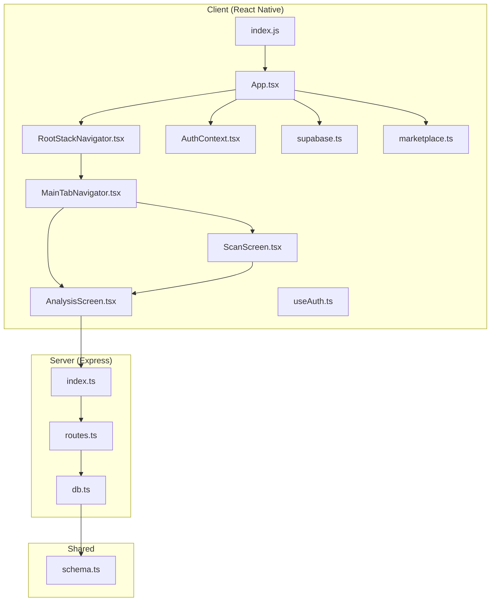
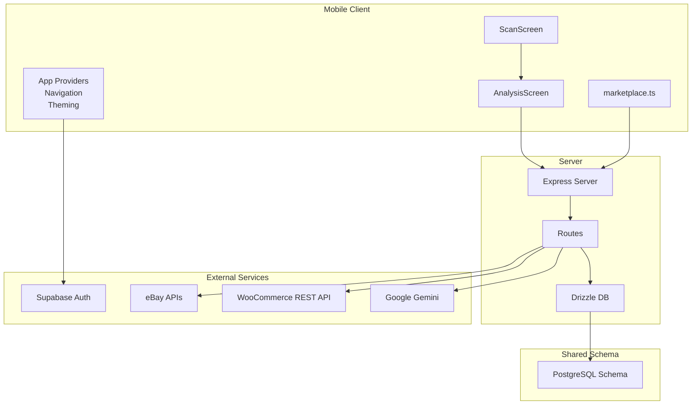
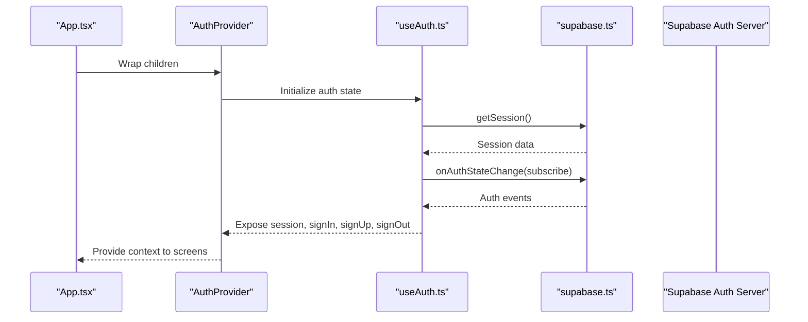
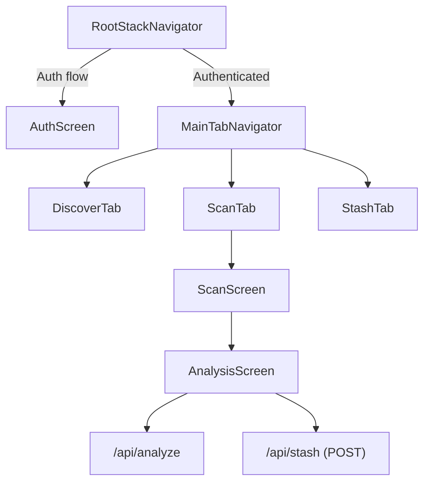
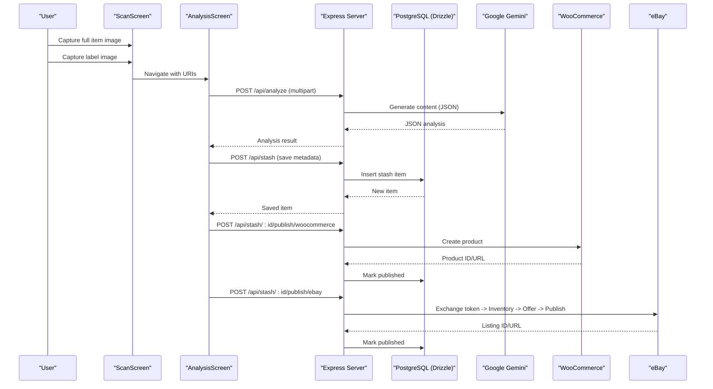
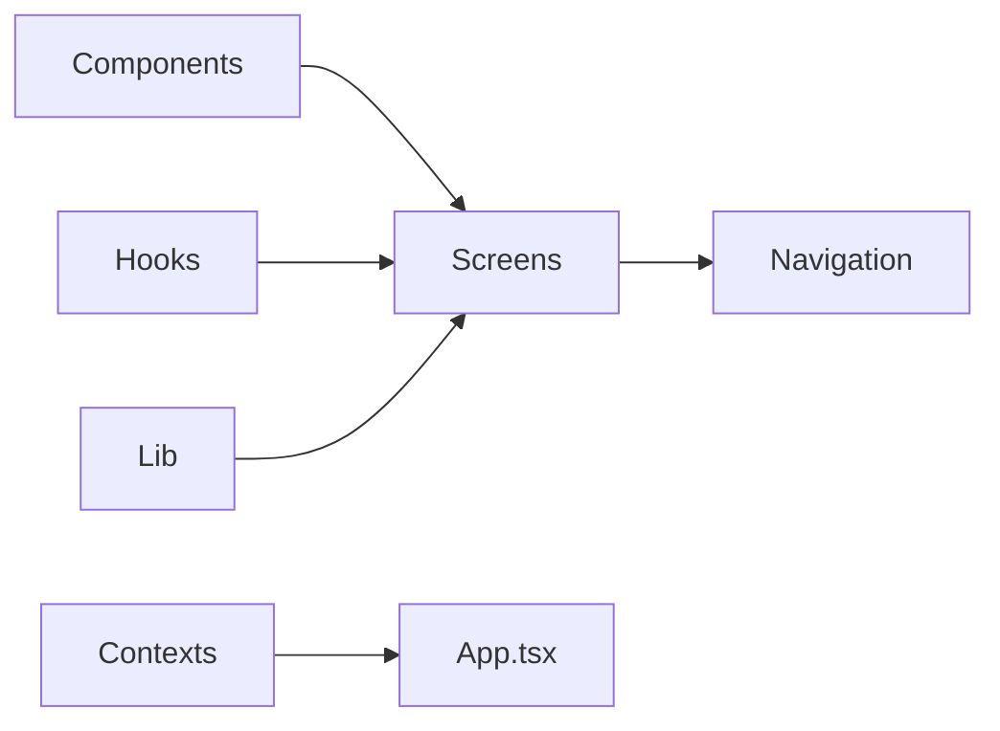
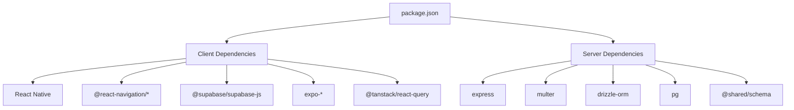

# Architecture Overview

<cite>
**Referenced Files in This Document**
- [package.json](file://package.json)
- [client/App.tsx](file://client/App.tsx)
- [client/index.js](file://client/index.js)
- [client/contexts/AuthContext.tsx](file://client/contexts/AuthContext.tsx)
- [client/hooks/useAuth.ts](file://client/hooks/useAuth.ts)
- [client/lib/supabase.ts](file://client/lib/supabase.ts)
- [client/navigation/RootStackNavigator.tsx](file://client/navigation/RootStackNavigator.tsx)
- [client/navigation/MainTabNavigator.tsx](file://client/navigation/MainTabNavigator.tsx)
- [client/screens/ScanScreen.tsx](file://client/screens/ScanScreen.tsx)
- [client/screens/AnalysisScreen.tsx](file://client/screens/AnalysisScreen.tsx)
- [client/lib/marketplace.ts](file://client/lib/marketplace.ts)
- [server/index.ts](file://server/index.ts)
- [server/routes.ts](file://server/routes.ts)
- [server/db.ts](file://server/db.ts)
- [shared/schema.ts](file://shared/schema.ts)
</cite>

## Table of Contents
1. [Introduction](#introduction)
2. [Project Structure](#project-structure)
3. [Core Components](#core-components)
4. [Architecture Overview](#architecture-overview)
5. [Detailed Component Analysis](#detailed-component-analysis)
6. [Dependency Analysis](#dependency-analysis)
7. [Performance Considerations](#performance-considerations)
8. [Troubleshooting Guide](#troubleshooting-guide)
9. [Conclusion](#conclusion)

## Introduction
This document describes the system architecture of Hidden-Gem, a React Native mobile application integrated with an Express.js backend and a shared PostgreSQL schema. The system enables users to capture item photos via the mobile app, analyze them using AI, and publish listings to external marketplaces (WooCommerce and eBay). Cross-cutting concerns include authentication via Supabase, theming and navigation, state management with React Query, and robust error handling across client and server boundaries.

## Project Structure
The repository follows a modular structure separating client-side React Native code, server-side Express routes, and shared schema definitions. The client initializes the app with providers for authentication, theming, navigation, and error handling. The server exposes REST endpoints for data retrieval, AI analysis, and marketplace publishing, backed by a shared Postgres schema.

**Diagram sources**
- [client/index.js](file://client/index.js#L1-L6)
- [client/App.tsx](file://client/App.tsx#L1-L57)
- [client/navigation/RootStackNavigator.tsx](file://client/navigation/RootStackNavigator.tsx#L1-L124)
- [client/navigation/MainTabNavigator.tsx](file://client/navigation/MainTabNavigator.tsx#L1-L192)
- [client/screens/ScanScreen.tsx](file://client/screens/ScanScreen.tsx#L1-L394)
- [client/screens/AnalysisScreen.tsx](file://client/screens/AnalysisScreen.tsx#L1-L484)
- [client/contexts/AuthContext.tsx](file://client/contexts/AuthContext.tsx#L1-L31)
- [client/hooks/useAuth.ts](file://client/hooks/useAuth.ts#L1-L151)
- [client/lib/supabase.ts](file://client/lib/supabase.ts#L1-L39)
- [client/lib/marketplace.ts](file://client/lib/marketplace.ts#L1-L129)
- [server/index.ts](file://server/index.ts#L1-L247)
- [server/routes.ts](file://server/routes.ts#L1-L493)
- [server/db.ts](file://server/db.ts#L1-L19)
- [shared/schema.ts](file://shared/schema.ts#L1-L122)

**Section sources**
- [package.json](file://package.json#L1-L85)
- [client/index.js](file://client/index.js#L1-L6)
- [client/App.tsx](file://client/App.tsx#L1-L57)
- [server/index.ts](file://server/index.ts#L1-L247)

## Core Components
- Authentication Provider: Implements the provider pattern around Supabase for session management, sign-in/sign-up, and Google OAuth.
- Navigation: Stack-based root navigator with a bottom-tabbed main navigator for Discover, Scan, and Stash.
- Theming: Centralized theme applied via NavigationContainer and styled components.
- State Management: React Query for caching and invalidation of stash and analytics data.
- Marketplace Integration: Client helpers to retrieve saved marketplace credentials and publish items to WooCommerce/eBay via server endpoints.
- Backend Routes: REST endpoints for articles, stash CRUD, AI analysis, and marketplace publishing.

**Section sources**
- [client/contexts/AuthContext.tsx](file://client/contexts/AuthContext.tsx#L1-L31)
- [client/hooks/useAuth.ts](file://client/hooks/useAuth.ts#L1-L151)
- [client/navigation/RootStackNavigator.tsx](file://client/navigation/RootStackNavigator.tsx#L1-L124)
- [client/navigation/MainTabNavigator.tsx](file://client/navigation/MainTabNavigator.tsx#L1-L192)
- [client/App.tsx](file://client/App.tsx#L1-L57)
- [client/lib/marketplace.ts](file://client/lib/marketplace.ts#L1-L129)
- [server/routes.ts](file://server/routes.ts#L1-L493)

## Architecture Overview
The system is composed of three primary layers:
- Mobile Client: React Native app with navigation, camera capture, AI analysis UI, and marketplace publishing flows.
- Backend Server: Express server handling CORS, logging, static Expo asset serving, and REST endpoints.
- Shared Database: Drizzle ORM schema defining users, settings, stash items, articles, and chat entities.

System boundaries:
- Client-to-Server: REST API calls for stash operations, AI analysis, and marketplace publishing.
- AI Integration: Google Gemini API invoked by the server to analyze item images.
- Marketplace Integrations: Server communicates with WooCommerce REST API and eBay APIs for publishing.

**Diagram sources**
- [client/screens/ScanScreen.tsx](file://client/screens/ScanScreen.tsx#L1-L394)
- [client/screens/AnalysisScreen.tsx](file://client/screens/AnalysisScreen.tsx#L1-L484)
- [client/lib/marketplace.ts](file://client/lib/marketplace.ts#L1-L129)
- [server/index.ts](file://server/index.ts#L1-L247)
- [server/routes.ts](file://server/routes.ts#L1-L493)
- [server/db.ts](file://server/db.ts#L1-L19)
- [shared/schema.ts](file://shared/schema.ts#L1-L122)

## Detailed Component Analysis

### Authentication Provider Pattern
The client implements a provider pattern to encapsulate Supabase authentication state and operations. The AuthProvider wraps the app and exposes a hook to consume session state and authentication actions. The useAuth hook manages session retrieval, real-time auth state changes, and OAuth flows (including Google sign-in with browser redirects and code exchange).

**Diagram sources**
- [client/App.tsx](file://client/App.tsx#L1-L57)
- [client/contexts/AuthContext.tsx](file://client/contexts/AuthContext.tsx#L1-L31)
- [client/hooks/useAuth.ts](file://client/hooks/useAuth.ts#L1-L151)
- [client/lib/supabase.ts](file://client/lib/supabase.ts#L1-L39)

**Section sources**
- [client/contexts/AuthContext.tsx](file://client/contexts/AuthContext.tsx#L1-L31)
- [client/hooks/useAuth.ts](file://client/hooks/useAuth.ts#L1-L151)
- [client/lib/supabase.ts](file://client/lib/supabase.ts#L1-L39)

### Navigation Architecture
The navigation hierarchy uses a root stack navigator that either shows an authentication screen or the main tab navigator. The main tabs include Discover, Scan, and Stash. The Scan tab integrates camera capture and image selection, while the Analysis screen orchestrates AI analysis and saving results to the stash.

**Diagram sources**
- [client/navigation/RootStackNavigator.tsx](file://client/navigation/RootStackNavigator.tsx#L1-L124)
- [client/navigation/MainTabNavigator.tsx](file://client/navigation/MainTabNavigator.tsx#L1-L192)
- [client/screens/ScanScreen.tsx](file://client/screens/ScanScreen.tsx#L1-L394)
- [client/screens/AnalysisScreen.tsx](file://client/screens/AnalysisScreen.tsx#L1-L484)
- [server/routes.ts](file://server/routes.ts#L140-L226)

**Section sources**
- [client/navigation/RootStackNavigator.tsx](file://client/navigation/RootStackNavigator.tsx#L1-L124)
- [client/navigation/MainTabNavigator.tsx](file://client/navigation/MainTabNavigator.tsx#L1-L192)
- [client/screens/ScanScreen.tsx](file://client/screens/ScanScreen.tsx#L1-L394)
- [client/screens/AnalysisScreen.tsx](file://client/screens/AnalysisScreen.tsx#L1-L484)

### Data Flow: Camera Capture to Marketplace Publishing
The end-to-end flow from camera capture to marketplace publishing involves:
- Camera capture and image selection in the Scan screen.
- Uploading both full and label images to the server’s AI analysis endpoint.
- Saving the AI-generated metadata to the stash via a server endpoint.
- Publishing to marketplace integrations using stored credentials.

**Diagram sources**
- [client/screens/ScanScreen.tsx](file://client/screens/ScanScreen.tsx#L1-L394)
- [client/screens/AnalysisScreen.tsx](file://client/screens/AnalysisScreen.tsx#L1-L484)
- [server/routes.ts](file://server/routes.ts#L140-L226)
- [server/routes.ts](file://server/routes.ts#L228-L296)
- [server/routes.ts](file://server/routes.ts#L298-L488)
- [server/db.ts](file://server/db.ts#L1-L19)
- [shared/schema.ts](file://shared/schema.ts#L29-L50)

**Section sources**
- [client/screens/ScanScreen.tsx](file://client/screens/ScanScreen.tsx#L1-L394)
- [client/screens/AnalysisScreen.tsx](file://client/screens/AnalysisScreen.tsx#L1-L484)
- [server/routes.ts](file://server/routes.ts#L140-L226)
- [server/routes.ts](file://server/routes.ts#L228-L296)
- [server/routes.ts](file://server/routes.ts#L298-L488)
- [server/db.ts](file://server/db.ts#L1-L19)
- [shared/schema.ts](file://shared/schema.ts#L29-L50)

### Modular Component Structure
- Components: Reusable UI primitives (buttons, cards, themed text/view) under client/components.
- Screens: Feature-focused views for navigation and user actions.
- Hooks: Custom hooks for auth, theme, and screen options.
- Lib: Client utilities for Supabase, marketplace integrations, and React Query configuration.
- Contexts: Provider for authentication state.

**Diagram sources**
- [client/App.tsx](file://client/App.tsx#L1-L57)
- [client/navigation/RootStackNavigator.tsx](file://client/navigation/RootStackNavigator.tsx#L1-L124)
- [client/navigation/MainTabNavigator.tsx](file://client/navigation/MainTabNavigator.tsx#L1-L192)

**Section sources**
- [client/App.tsx](file://client/App.tsx#L1-L57)

## Dependency Analysis
- Client dependencies include React Navigation, Supabase JS, Expo camera/image picker, React Query, and Drizzle ORM for TypeScript schema generation.
- Server depends on Express, Multer for multipart uploads, Drizzle ORM with PostgreSQL, and the shared schema.
- External integrations: Supabase for auth, Google Gemini for AI analysis, WooCommerce REST API, and eBay APIs.

**Diagram sources**
- [package.json](file://package.json#L19-L67)

**Section sources**
- [package.json](file://package.json#L19-L67)

## Performance Considerations
- Image Upload Limits: Multer is configured with a 10 MB file size limit for AI analysis. Consider chunked uploads or compression for larger assets.
- AI Prompt Efficiency: The Gemini prompt is comprehensive; consider trimming optional fields to reduce latency when not needed.
- Caching: React Query caches stash counts and lists; invalidate appropriately after mutations to keep UI in sync.
- Network Resilience: Add retries and exponential backoff for AI and marketplace endpoints.
- Database Queries: Use selective field projections and pagination for articles and stash lists.

## Troubleshooting Guide
Common areas to inspect:
- Authentication: Verify Supabase URL and anonymous key environment variables and ensure OAuth redirect URLs match platform expectations.
- Camera Permissions: Handle permission denials gracefully and guide users to enable camera access.
- AI Analysis Failures: Confirm Gemini API key and base URL environment variables are set; handle JSON parsing fallbacks.
- Marketplace Publishing:
  - WooCommerce: Ensure credentials and store URL are valid; confirm product creation response and update flags.
  - eBay: Validate refresh token and required business policies; handle token exchange and offer/publish steps.
- Server Logging: Enable request logging and error handler to capture failures during route execution.

**Section sources**
- [client/lib/supabase.ts](file://client/lib/supabase.ts#L1-L39)
- [client/screens/ScanScreen.tsx](file://client/screens/ScanScreen.tsx#L1-L394)
- [client/screens/AnalysisScreen.tsx](file://client/screens/AnalysisScreen.tsx#L1-L484)
- [server/routes.ts](file://server/routes.ts#L11-L17)
- [server/routes.ts](file://server/routes.ts#L228-L296)
- [server/routes.ts](file://server/routes.ts#L298-L488)
- [server/index.ts](file://server/index.ts#L207-L222)

## Conclusion
Hidden-Gem’s architecture cleanly separates concerns across the React Native client, Express server, and shared database schema. The provider pattern for authentication, structured navigation, and modular components support maintainability. The data flow from camera capture to AI analysis and marketplace publishing leverages external services while keeping sensitive credentials on the client and server respectively. Robust error handling, state management, and schema-driven development contribute to a scalable foundation for future enhancements.