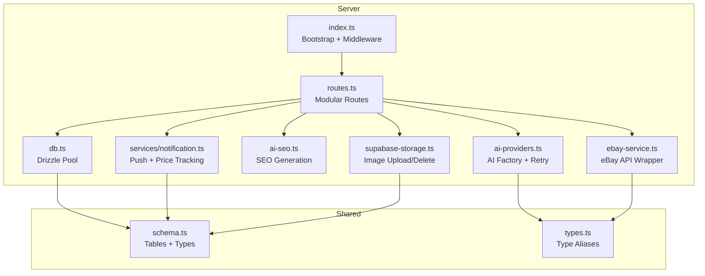
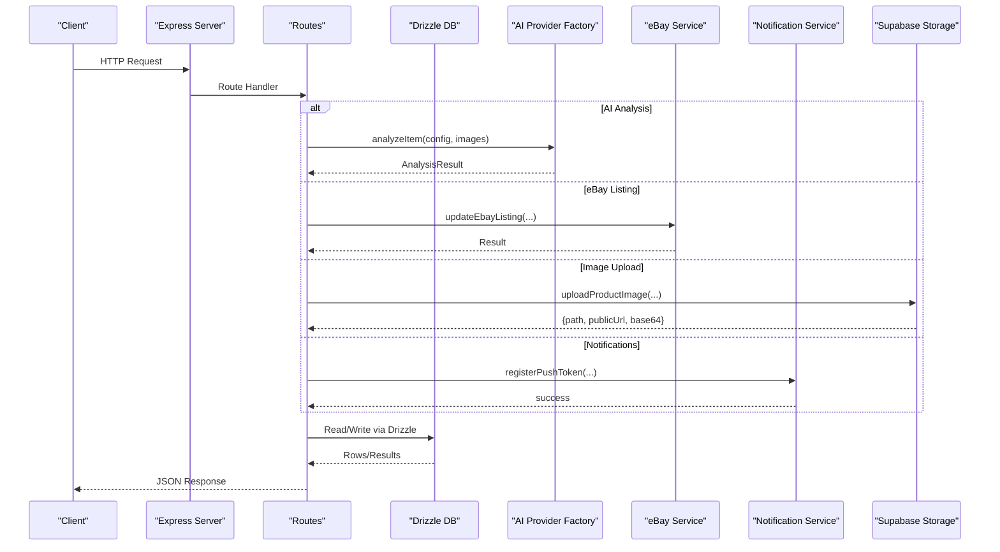
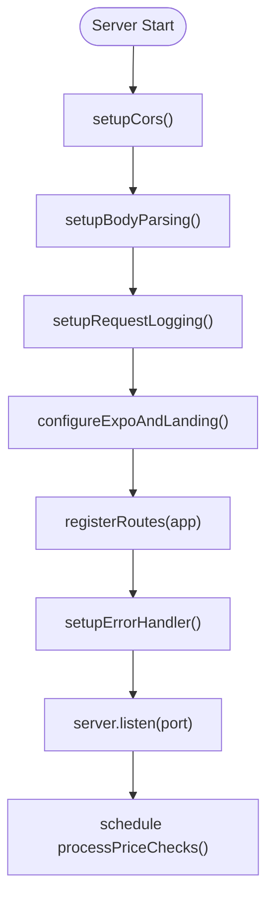
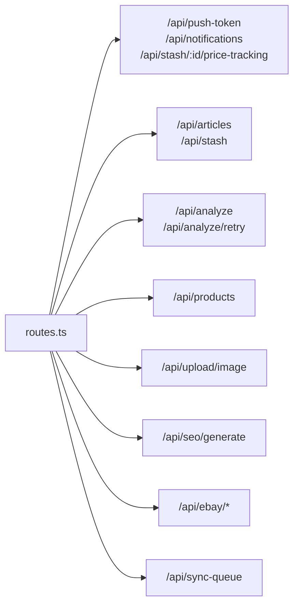
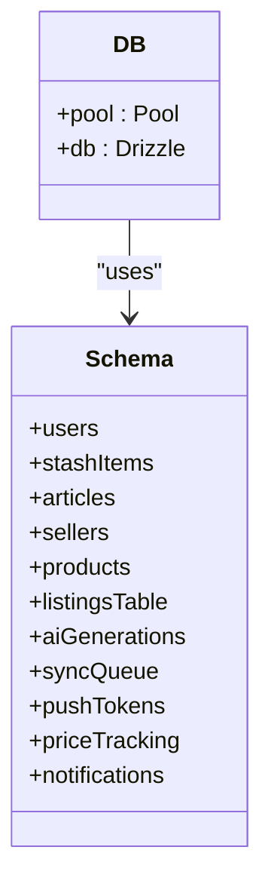
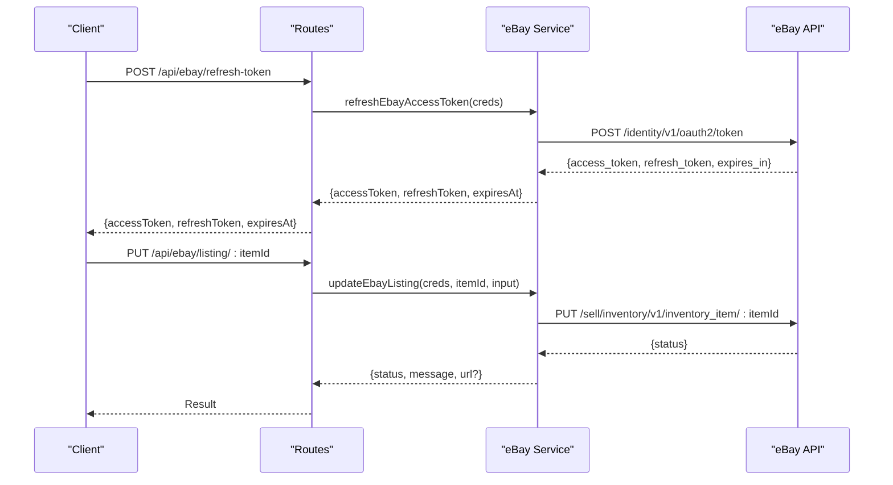
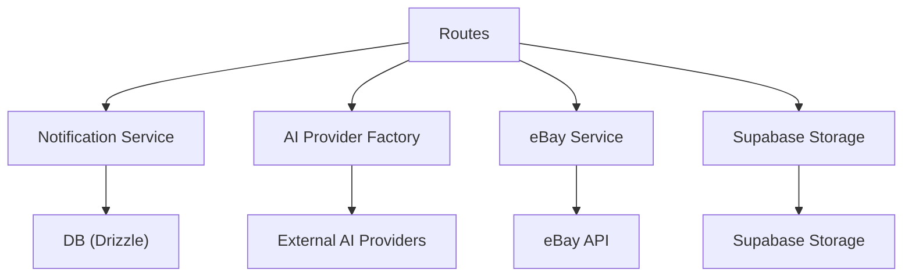
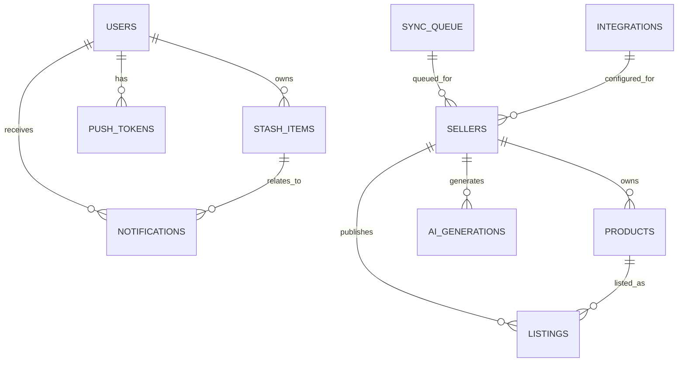
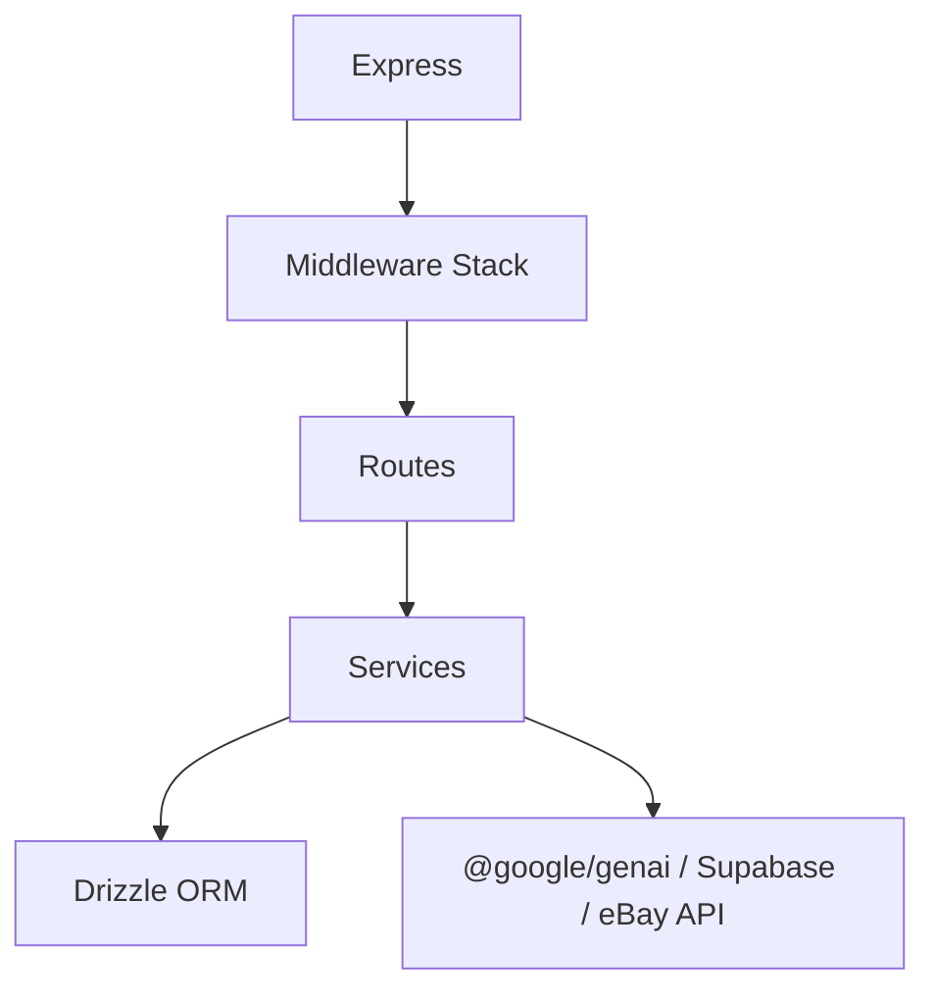

# Backend Services

<cite>
**Referenced Files in This Document**
- [index.ts](file://server/index.ts)
- [routes.ts](file://server/routes.ts)
- [db.ts](file://server/db.ts)
- [ai-providers.ts](file://server/ai-providers.ts)
- [ebay-service.ts](file://server/ebay-service.ts)
- [notification.ts](file://server/services/notification.ts)
- [ai-seo.ts](file://server/ai-seo.ts)
- [supabase-storage.ts](file://server/supabase-storage.ts)
- [schema.ts](file://shared/schema.ts)
- [types.ts](file://shared/types.ts)
- [package.json](file://package.json)
</cite>

## Table of Contents
1. [Introduction](#introduction)
2. [Project Structure](#project-structure)
3. [Core Components](#core-components)
4. [Architecture Overview](#architecture-overview)
5. [Detailed Component Analysis](#detailed-component-analysis)
6. [Dependency Analysis](#dependency-analysis)
7. [Performance Considerations](#performance-considerations)
8. [Troubleshooting Guide](#troubleshooting-guide)
9. [Conclusion](#conclusion)

## Introduction
This document describes the backend services architecture for the Hidden-Gem Express.js server. It covers server initialization, middleware configuration, error handling, modular routing, database integration with Drizzle ORM, AI provider service architecture with dynamic selection and retry, eBay integration patterns, and the service layer pattern for business logic and inter-service communication.

## Project Structure
The server is organized around a small set of focused modules:
- Server bootstrap and middleware: server/index.ts
- Routing and endpoints: server/routes.ts
- Database integration: server/db.ts and shared/schema.ts
- AI services: server/ai-providers.ts and server/ai-seo.ts
- eBay integration: server/ebay-service.ts
- Notifications: server/services/notification.ts
- Image storage: server/supabase-storage.ts
- Shared models and types: shared/schema.ts and shared/types.ts
- Dependencies: package.json



**Diagram sources**
- [index.ts](file://server/index.ts#L1-L262)
- [routes.ts](file://server/routes.ts#L1-L929)
- [db.ts](file://server/db.ts#L1-L19)
- [ai-providers.ts](file://server/ai-providers.ts#L1-L696)
- [ai-seo.ts](file://server/ai-seo.ts#L1-L112)
- [ebay-service.ts](file://server/ebay-service.ts#L1-L474)
- [notification.ts](file://server/services/notification.ts#L1-L414)
- [supabase-storage.ts](file://server/supabase-storage.ts#L1-L93)
- [schema.ts](file://shared/schema.ts#L1-L344)
- [types.ts](file://shared/types.ts#L1-L116)

**Section sources**
- [index.ts](file://server/index.ts#L1-L262)
- [routes.ts](file://server/routes.ts#L1-L929)
- [db.ts](file://server/db.ts#L1-L19)
- [schema.ts](file://shared/schema.ts#L1-L344)

## Core Components
- Server bootstrap and middleware pipeline:
  - CORS, body parsing, request logging, Expo manifest and landing page routing, and centralized error handler.
- Modular routing:
  - Grouped endpoints for notifications, price tracking, articles/stash, AI analysis and retry, product CRUD, image upload, SEO generation, eBay operations, and sync queue inspection.
- Database integration:
  - Drizzle ORM with a PostgreSQL connection pool and shared schema definitions.
- AI provider service:
  - Factory pattern for dynamic provider selection (Gemini, OpenAI, Anthropic, Custom) with robust validation and retry logic.
- eBay integration:
  - OAuth2 token refresh, listing CRUD, inventory management, and category mapping helpers.
- Service layer:
  - Notification service for push tokens, price tracking, and scheduled alerts; Supabase image storage abstraction.

**Section sources**
- [index.ts](file://server/index.ts#L19-L225)
- [routes.ts](file://server/routes.ts#L44-L929)
- [db.ts](file://server/db.ts#L1-L19)
- [ai-providers.ts](file://server/ai-providers.ts#L380-L442)
- [ebay-service.ts](file://server/ebay-service.ts#L42-L364)
- [notification.ts](file://server/services/notification.ts#L31-L414)
- [supabase-storage.ts](file://server/supabase-storage.ts#L45-L93)

## Architecture Overview
The server initializes middleware, registers routes, and starts an HTTP server. Requests flow through middleware, then to route handlers that delegate to services and the database. AI analysis is performed via a provider factory, eBay operations use a dedicated service, and images are stored via Supabase Storage. Notifications are persisted and delivered asynchronously.



**Diagram sources**
- [index.ts](file://server/index.ts#L227-L261)
- [routes.ts](file://server/routes.ts#L299-L385)
- [ai-providers.ts](file://server/ai-providers.ts#L380-L396)
- [ebay-service.ts](file://server/ebay-service.ts#L386-L430)
- [notification.ts](file://server/services/notification.ts#L31-L58)
- [supabase-storage.ts](file://server/supabase-storage.ts#L45-L80)
- [db.ts](file://server/db.ts#L1-L19)

## Detailed Component Analysis

### Server Initialization and Middleware Pipeline
- CORS configuration:
  - Dynamically allows configured Replit domains and localhost origins for development.
- Body parsing:
  - JSON body verification captures raw request bodies for signature verification.
- Request logging:
  - Wraps response JSON to capture and log structured logs for API paths.
- Expo and landing page:
  - Serves Expo manifests based on platform header and renders a landing page template with dynamic base URLs.
- Centralized error handler:
  - Standardizes error responses with status and message.



**Diagram sources**
- [index.ts](file://server/index.ts#L19-L261)

**Section sources**
- [index.ts](file://server/index.ts#L19-L225)
- [index.ts](file://server/index.ts#L227-L261)

### Modular Routing System
The router module exports a function that registers all endpoints grouped by concern:
- Push notifications: register/unregister tokens, fetch notifications, read/unread counts, mark read, enable/disable price tracking.
- Price tracking: enable/disable/get status with thresholds.
- Articles and stash: CRUD and counts.
- AI analysis: initial analysis and retry with feedback.
- Product CRUD (FlipAgent): products table operations.
- Image upload/delete: Supabase-backed storage.
- SEO generation: title/description/tags and AI audit trail creation.
- eBay operations: listing updates/deletes, token refresh, listing retrieval.
- Sync queue: read-only inspection by sellerId.



**Diagram sources**
- [routes.ts](file://server/routes.ts#L44-L929)

**Section sources**
- [routes.ts](file://server/routes.ts#L44-L929)

### Database Layer Integration with Drizzle ORM
- Connection management:
  - Creates a PostgreSQL connection pool from DATABASE_URL with SSL configuration.
- Schema integration:
  - Uses shared schema definitions for all tables including users, stash items, articles, sellers, products, listings, AI generations, sync queue, push tokens, price tracking, and notifications.
- Transactions:
  - Drizzle supports transactions via db.transaction; current routes primarily use individual queries and updates.



**Diagram sources**
- [db.ts](file://server/db.ts#L1-L19)
- [schema.ts](file://shared/schema.ts#L1-L344)

**Section sources**
- [db.ts](file://server/db.ts#L1-L19)
- [schema.ts](file://shared/schema.ts#L1-L344)

### AI Provider Service Architecture
- Factory pattern:
  - analyzeItem(config, images) selects provider dynamically and delegates to provider-specific handlers.
- Provider validation:
  - Validates provider type and custom endpoint constraints (URL scheme and network restrictions).
- Retry mechanism:
  - analyzeItemWithRetry composes a retry prompt and re-runs analysis with the same provider.
- Parsing and fallback:
  - Robust JSON parsing with fallback result for malformed responses.
- Test connectivity:
  - testProviderConnection validates provider endpoints and returns success/error messages.

```mermaid
classDiagram
class AIProviderFactory {
+analyzeItem(config, images) AnalysisResult
+analyzeItemWithRetry(config, images, previous, feedback) AnalysisResult
+testProviderConnection(config) {success,message}
}
class GeminiAdapter {
+analyzeWithGemini(images, config) AnalysisResult
+analyzeWithGeminiRetry(images, config, retryPrompt) AnalysisResult
}
class OpenAIAdapter {
+analyzeWithOpenAI(images, config) AnalysisResult
+analyzeWithOpenAIRetry(images, config, retryPrompt) AnalysisResult
}
class AnthropicAdapter {
+analyzeWithAnthropic(images, config) AnalysisResult
+analyzeWithAnthropicRetry(images, config, retryPrompt) AnalysisResult
}
class CustomAdapter {
+analyzeWithCustom(images, config) AnalysisResult
+analyzeWithCustomRetry(images, config, retryPrompt) AnalysisResult
}
AIProviderFactory --> GeminiAdapter
AIProviderFactory --> OpenAIAdapter
AIProviderFactory --> AnthropicAdapter
AIProviderFactory --> CustomAdapter
```

**Diagram sources**
- [ai-providers.ts](file://server/ai-providers.ts#L380-L442)
- [ai-providers.ts](file://server/ai-providers.ts#L224-L396)
- [ai-providers.ts](file://server/ai-providers.ts#L444-L602)
- [ai-providers.ts](file://server/ai-providers.ts#L604-L695)

**Section sources**
- [ai-providers.ts](file://server/ai-providers.ts#L3-L41)
- [ai-providers.ts](file://server/ai-providers.ts#L182-L222)
- [ai-providers.ts](file://server/ai-providers.ts#L380-L442)
- [ai-providers.ts](file://server/ai-providers.ts#L418-L602)
- [ai-providers.ts](file://server/ai-providers.ts#L604-L695)

### eBay Service Integration Patterns
- Authentication:
  - getAccessToken performs OAuth2 refresh token exchange and returns access tokens.
- Listings and inventory:
  - getActiveListings and getInventoryItems fetch offers and inventory items with pagination.
- Listing lifecycle:
  - endListing deletes an offer; updateListingPrice and updateListingQuantity modify pricing and quantity.
- Category mapping:
  - mapCategoryToEbay converts app categories to eBay category IDs.
- Token refresh persistence:
  - refreshEbayAccessToken returns new access/refresh tokens and expiry timestamps for persistence.
- Listing CRUD:
  - updateEbayListing and deleteEbayListing operate on inventory items with robust error handling.



**Diagram sources**
- [ebay-service.ts](file://server/ebay-service.ts#L329-L364)
- [ebay-service.ts](file://server/ebay-service.ts#L386-L430)
- [routes.ts](file://server/routes.ts#L893-L906)
- [routes.ts](file://server/routes.ts#L863-L876)

**Section sources**
- [ebay-service.ts](file://server/ebay-service.ts#L42-L62)
- [ebay-service.ts](file://server/ebay-service.ts#L64-L109)
- [ebay-service.ts](file://server/ebay-service.ts#L111-L149)
- [ebay-service.ts](file://server/ebay-service.ts#L152-L175)
- [ebay-service.ts](file://server/ebay-service.ts#L177-L224)
- [ebay-service.ts](file://server/ebay-service.ts#L226-L272)
- [ebay-service.ts](file://server/ebay-service.ts#L297-L313)
- [ebay-service.ts](file://server/ebay-service.ts#L329-L364)
- [ebay-service.ts](file://server/ebay-service.ts#L386-L430)
- [routes.ts](file://server/routes.ts#L863-L906)

### Service Layer Pattern and Inter-Service Communication
- Notification service:
  - Manages push tokens, sends push notifications via Expo, stores notification history, enables/disables price tracking, and runs scheduled price checks.
- Inter-service communication:
  - Routes call into services and database; services encapsulate business logic and coordinate with external APIs (e.g., Supabase, eBay).
- Scheduled tasks:
  - processPriceChecks is invoked periodically to evaluate price changes and send alerts.



**Diagram sources**
- [notification.ts](file://server/services/notification.ts#L31-L414)
- [routes.ts](file://server/routes.ts#L1-L30)
- [ai-providers.ts](file://server/ai-providers.ts#L380-L396)
- [ebay-service.ts](file://server/ebay-service.ts#L42-L62)
- [supabase-storage.ts](file://server/supabase-storage.ts#L45-L80)
- [db.ts](file://server/db.ts#L1-L19)

**Section sources**
- [notification.ts](file://server/services/notification.ts#L31-L414)
- [routes.ts](file://server/routes.ts#L1-L30)

### Data Models and Types
- Shared schema defines tables for users, stash items, articles, sellers, products, listings, AI generations, sync queue, push tokens, price tracking, and notifications.
- Types define canonical shapes for products, listings, AI generations, sellers, integrations, and analysis results.



**Diagram sources**
- [schema.ts](file://shared/schema.ts#L6-L344)

**Section sources**
- [schema.ts](file://shared/schema.ts#L1-L344)
- [types.ts](file://shared/types.ts#L1-L116)

## Dependency Analysis
- Express middleware stack:
  - CORS, body parsing, request logging, Expo routing, and error handling are registered in order.
- Route-to-service mapping:
  - Routes import and call services and database functions; services encapsulate business logic.
- External dependencies:
  - @google/genai, @supabase/supabase-js, drizzle-orm, pg, multer, dotenv, p-retry, ws.



**Diagram sources**
- [index.ts](file://server/index.ts#L19-L225)
- [routes.ts](file://server/routes.ts#L1-L30)
- [package.json](file://package.json#L24-L76)

**Section sources**
- [package.json](file://package.json#L24-L76)
- [index.ts](file://server/index.ts#L19-L225)

## Performance Considerations
- Middleware overhead:
  - Request logging wraps response JSON; keep logs concise and avoid excessive serialization for high-throughput endpoints.
- Database connections:
  - Drizzle uses a connection pool; ensure connection limits match deployment capacity and monitor pool utilization.
- AI provider latency:
  - Provider selection and retries add latency; consider caching or batching requests where feasible.
- eBay API rate limits:
  - Respect API quotas; implement backoff and retry strategies for listing operations.
- Image uploads:
  - Supabase storage is constrained by file size and network throughput; validate early and stream where possible.

[No sources needed since this section provides general guidance]

## Troubleshooting Guide
- CORS and development origins:
  - Verify REPLIT_DEV_DOMAIN and REPLIT_DOMAINS environment variables for allowed origins.
- Request logging:
  - Confirm request logging middleware is active and inspect logs for API paths and durations.
- Database connectivity:
  - Ensure DATABASE_URL is set and reachable; verify SSL configuration.
- AI provider connectivity:
  - Use testProviderConnection to validate provider keys/endpoints; check provider-specific error messages.
- eBay token refresh:
  - Ensure clientId, clientSecret, and refreshToken are provided; confirm environment setting (sandbox vs production).
- Supabase storage:
  - Verify Supabase URL and service role/anon keys; check bucket permissions and file size limits.
- Notifications:
  - Confirm push tokens exist for the user; check Expo push endpoint responses and notification persistence.

**Section sources**
- [index.ts](file://server/index.ts#L19-L56)
- [index.ts](file://server/index.ts#L70-L101)
- [db.ts](file://server/db.ts#L7-L9)
- [ai-providers.ts](file://server/ai-providers.ts#L604-L695)
- [ebay-service.ts](file://server/ebay-service.ts#L329-L364)
- [supabase-storage.ts](file://server/supabase-storage.ts#L20-L39)
- [notification.ts](file://server/services/notification.ts#L72-L129)

## Conclusion
The Hidden-Gem backend employs a clean, modular architecture with Express middleware, Drizzle ORM, and a service-layer pattern. AI analysis is abstracted via a provider factory with retry and validation, eBay integration is encapsulated in a dedicated service, and image storage is handled through Supabase. The routing module cleanly separates concerns across notifications, articles/stash, AI, products, SEO, eBay, and sync queue. Proper error handling and scheduled tasks support reliability and operational automation.