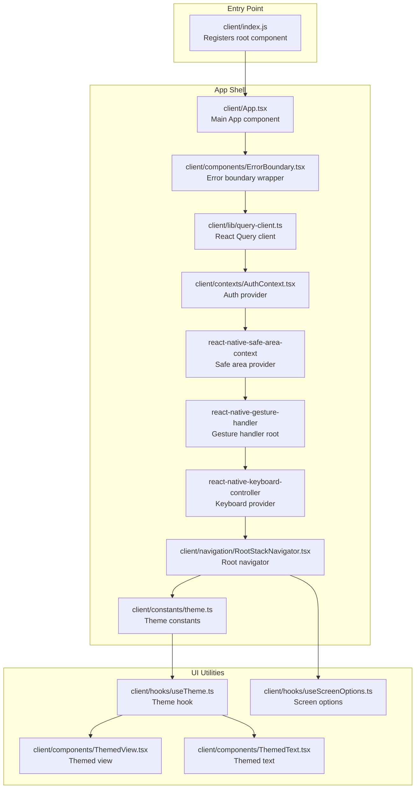
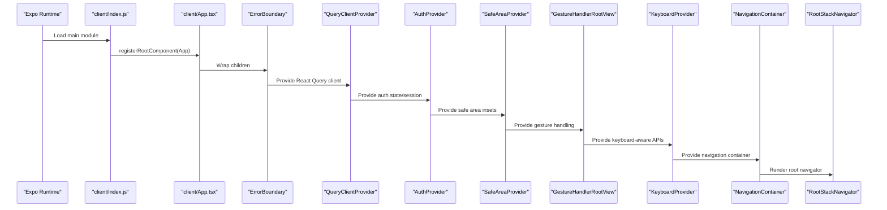
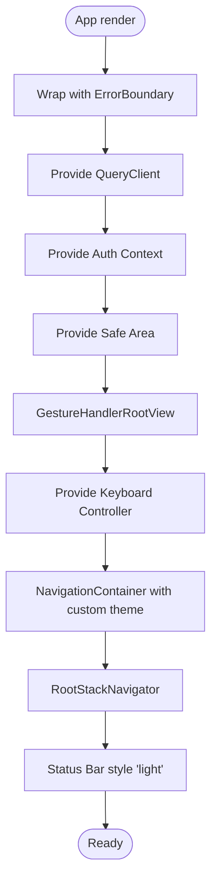
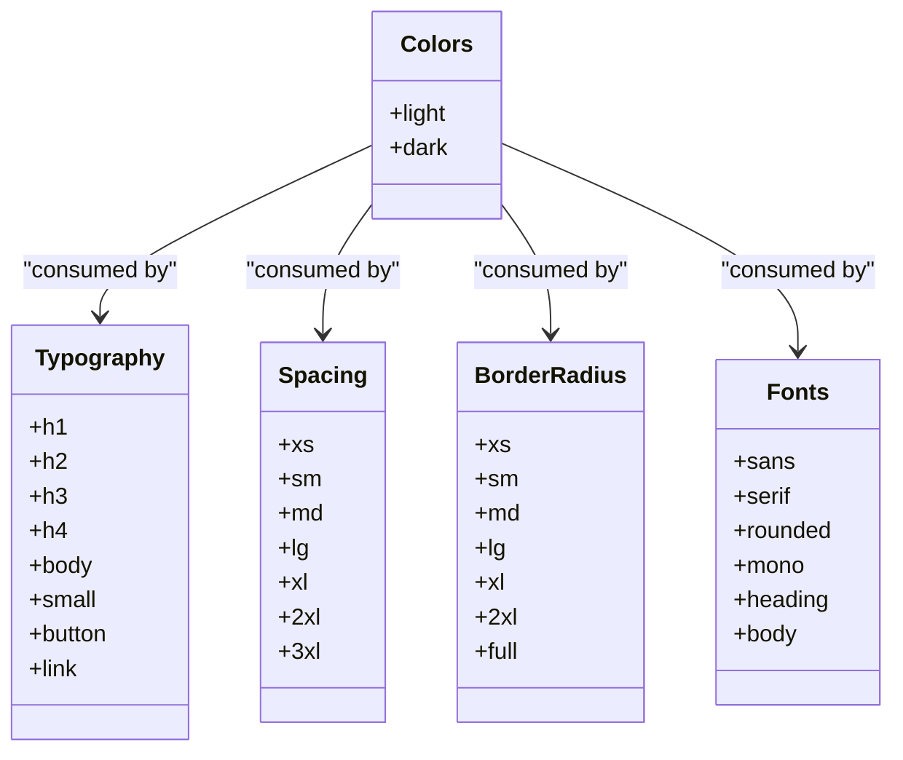
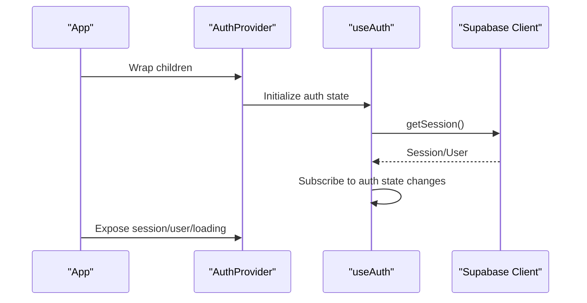
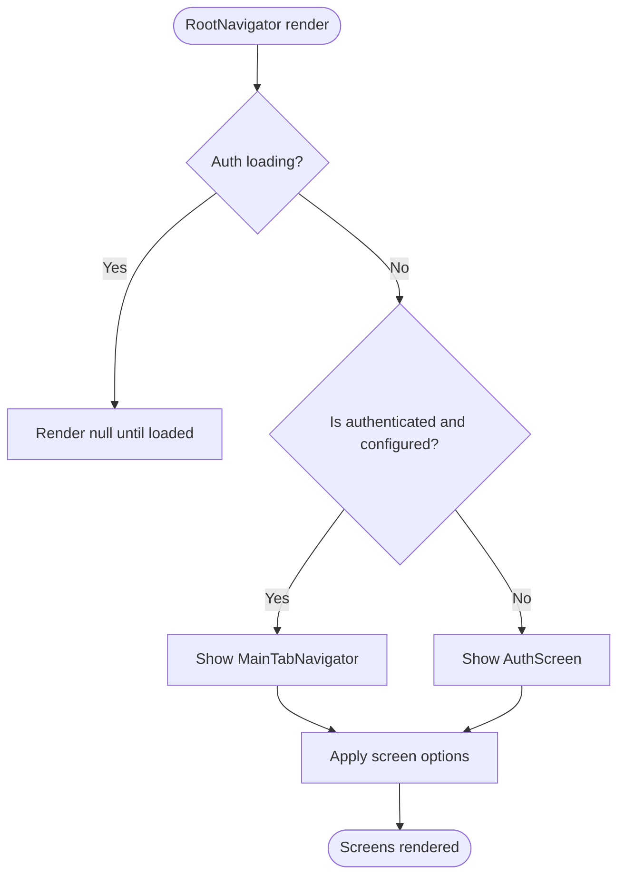
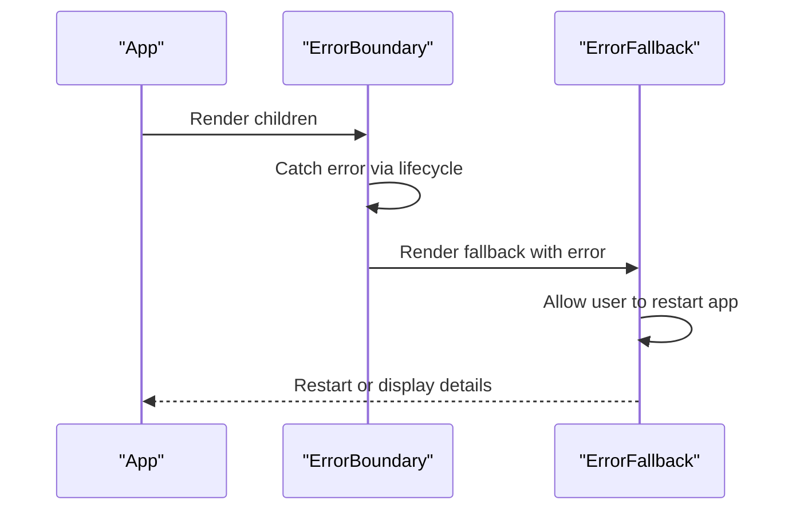
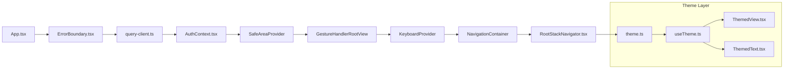

# Application Entry Point

<cite>
**Referenced Files in This Document**
- [App.tsx](file://client/App.tsx)
- [index.js](file://client/index.js)
- [theme.ts](file://client/constants/theme.ts)
- [AuthContext.tsx](file://client/contexts/AuthContext.tsx)
- [useAuth.ts](file://client/hooks/useAuth.ts)
- [query-client.ts](file://client/lib/query-client.ts)
- [RootStackNavigator.tsx](file://client/navigation/RootStackNavigator.tsx)
- [ErrorBoundary.tsx](file://client/components/ErrorBoundary.tsx)
- [ErrorFallback.tsx](file://client/components/ErrorFallback.tsx)
- [useTheme.ts](file://client/hooks/useTheme.ts)
- [useScreenOptions.ts](file://client/hooks/useScreenOptions.ts)
- [ThemedView.tsx](file://client/components/ThemedView.tsx)
- [ThemedText.tsx](file://client/components/ThemedText.tsx)
- [app.json](file://app.json)
- [package.json](file://package.json)
</cite>

## Table of Contents
1. [Introduction](#introduction)
2. [Project Structure](#project-structure)
3. [Core Components](#core-components)
4. [Architecture Overview](#architecture-overview)
5. [Detailed Component Analysis](#detailed-component-analysis)
6. [Dependency Analysis](#dependency-analysis)
7. [Performance Considerations](#performance-considerations)
8. [Troubleshooting Guide](#troubleshooting-guide)
9. [Conclusion](#conclusion)

## Introduction
This document explains the React Native application entry point and initialization flow for the HiddenGem project. It covers the main App component structure, provider hierarchy, theme configuration, navigation setup, error handling, keyboard and gesture handling, and platform-specific initialization. The focus is on how the application bootstraps providers, applies a custom dark theme with gold accents, configures the status bar and safe areas, and integrates error boundaries and keyboard/gesture handlers.

## Project Structure
The application follows a conventional React Native structure with an explicit entry point and a strongly typed provider hierarchy. The entry point registers the root component with Expo, which then renders the main App component. Providers wrap the navigation stack to supply global state and services.

**Diagram sources**
- [index.js](file://client/index.js#L1-L6)
- [App.tsx](file://client/App.tsx#L1-L57)
- [ErrorBoundary.tsx](file://client/components/ErrorBoundary.tsx#L1-L55)
- [query-client.ts](file://client/lib/query-client.ts#L1-L80)
- [AuthContext.tsx](file://client/contexts/AuthContext.tsx#L1-L31)
- [RootStackNavigator.tsx](file://client/navigation/RootStackNavigator.tsx#L1-L124)
- [theme.ts](file://client/constants/theme.ts#L1-L167)
- [useTheme.ts](file://client/hooks/useTheme.ts#L1-L14)
- [ThemedView.tsx](file://client/components/ThemedView.tsx#L1-L27)
- [ThemedText.tsx](file://client/components/ThemedText.tsx#L1-L62)
- [useScreenOptions.ts](file://client/hooks/useScreenOptions.ts#L1-L42)

**Section sources**
- [index.js](file://client/index.js#L1-L6)
- [App.tsx](file://client/App.tsx#L1-L57)
- [app.json](file://app.json#L1-L52)

## Core Components
- Entry registration: The application registers the root component via Expo’s registration mechanism.
- Main App shell: The App component composes providers and the root navigator, defines a custom dark theme with gold accents, and configures the status bar and safe area handling.
- Provider hierarchy: QueryClientProvider, AuthProvider, SafeAreaProvider, GestureHandlerRootView, KeyboardProvider, NavigationContainer, and RootStackNavigator form the core initialization chain.
- Theme system: Centralized theme constants define light/dark palettes, typography, spacing, borders, fonts, and shadows. A theme hook selects the appropriate palette based on the current color scheme.
- Error boundary: A class-based error boundary wraps the entire app to gracefully handle rendering errors.
- Navigation: RootStackNavigator decides between an authentication flow and the main tab-based interface based on authentication state.

**Section sources**
- [index.js](file://client/index.js#L1-L6)
- [App.tsx](file://client/App.tsx#L1-L57)
- [theme.ts](file://client/constants/theme.ts#L1-L167)
- [ErrorBoundary.tsx](file://client/components/ErrorBoundary.tsx#L1-L55)
- [RootStackNavigator.tsx](file://client/navigation/RootStackNavigator.tsx#L1-L124)

## Architecture Overview
The initialization sequence begins at the entry point and proceeds through the provider stack to render the navigation tree. The custom theme augments the default dark theme with gold accent colors, while the status bar and safe area providers ensure proper layout and appearance across platforms.

**Diagram sources**
- [index.js](file://client/index.js#L1-L6)
- [App.tsx](file://client/App.tsx#L30-L49)
- [ErrorBoundary.tsx](file://client/components/ErrorBoundary.tsx#L16-L54)
- [query-client.ts](file://client/lib/query-client.ts#L66-L79)
- [AuthContext.tsx](file://client/contexts/AuthContext.tsx#L19-L22)
- [RootStackNavigator.tsx](file://client/navigation/RootStackNavigator.tsx#L32-L122)

## Detailed Component Analysis

### App Component Initialization
The App component orchestrates the entire initialization sequence:
- Provider nesting order:
  1) ErrorBoundary
  2) QueryClientProvider
  3) AuthProvider
  4) SafeAreaProvider
  5) GestureHandlerRootView
  6) KeyboardProvider
  7) NavigationContainer
  8) RootStackNavigator
- Custom dark theme with gold accents:
  - Extends the default dark theme and overrides primary, background, card, text, border, and notification colors using theme constants.
- Status bar and safe area:
  - Status bar is set to light style.
  - Safe area provider ensures content respects device insets.
- Root view styling:
  - Root view background color matches the dark theme’s root background.

**Diagram sources**
- [App.tsx](file://client/App.tsx#L17-L28)
- [App.tsx](file://client/App.tsx#L30-L49)

**Section sources**
- [App.tsx](file://client/App.tsx#L1-L57)
- [theme.ts](file://client/constants/theme.ts#L22-L40)

### Theme Configuration and Composition
- Color palette:
  - Light and dark palettes include primary, backgrounds, borders, links, and surfaces.
  - Gold accent color (primary/link) is consistently applied across themes.
- Typography and spacing:
  - Predefined font sizes and weights for headings, body, small, and links.
  - Consistent spacing scale for margins, paddings, and component heights.
- Platform-specific fonts:
  - iOS defaults to system UI fonts.
  - Web defines specific font families.
  - Other platforms use generic font families.
- Theme hook:
  - Selects the current palette based on the system color scheme.
- Themed UI primitives:
  - ThemedView and ThemedText apply colors and typography based on the active theme and props.

**Diagram sources**
- [theme.ts](file://client/constants/theme.ts#L3-L167)

**Section sources**
- [theme.ts](file://client/constants/theme.ts#L1-L167)
- [useTheme.ts](file://client/hooks/useTheme.ts#L1-L14)
- [ThemedView.tsx](file://client/components/ThemedView.tsx#L1-L27)
- [ThemedText.tsx](file://client/components/ThemedText.tsx#L1-L62)

### Authentication Provider and Session Management
- AuthProvider exposes session, user, loading state, and authentication actions.
- useAuth initializes Supabase session retrieval and listens to auth state changes.
- Platform-specific OAuth handling:
  - Web uses browser redirects.
  - Non-web uses AuthSession to exchange authorization codes or tokens.

**Diagram sources**
- [AuthContext.tsx](file://client/contexts/AuthContext.tsx#L19-L22)
- [useAuth.ts](file://client/hooks/useAuth.ts#L12-L38)

**Section sources**
- [AuthContext.tsx](file://client/contexts/AuthContext.tsx#L1-L31)
- [useAuth.ts](file://client/hooks/useAuth.ts#L1-L151)

### Navigation and Screen Options
- RootStackNavigator conditionally renders either the Auth screen or the Main tab navigator based on authentication state.
- Screen options:
  - Transparent headers with blur effect on supported platforms.
  - Centered header titles with themed fonts and colors.
  - Full-screen gestures disabled when liquid glass is available; otherwise enabled.
  - Content background aligned with the dark theme.

**Diagram sources**
- [RootStackNavigator.tsx](file://client/navigation/RootStackNavigator.tsx#L32-L122)
- [useScreenOptions.ts](file://client/hooks/useScreenOptions.ts#L11-L41)

**Section sources**
- [RootStackNavigator.tsx](file://client/navigation/RootStackNavigator.tsx#L1-L124)
- [useScreenOptions.ts](file://client/hooks/useScreenOptions.ts#L1-L42)

### Error Boundary Integration
- ErrorBoundary is a class component that catches rendering errors and displays a fallback UI.
- ErrorFallback provides a user-friendly error screen with a restart action and optional developer details modal.

**Diagram sources**
- [ErrorBoundary.tsx](file://client/components/ErrorBoundary.tsx#L16-L54)
- [ErrorFallback.tsx](file://client/components/ErrorFallback.tsx#L22-L144)

**Section sources**
- [ErrorBoundary.tsx](file://client/components/ErrorBoundary.tsx#L1-L55)
- [ErrorFallback.tsx](file://client/components/ErrorFallback.tsx#L1-L247)

### Keyboard Provider Setup
- KeyboardProvider from react-native-keyboard-controller is placed inside the gesture handler root to enable keyboard-aware layouts and animations.
- Combined with SafeAreaProvider, it ensures proper input handling across devices with varying safe area insets.

**Section sources**
- [App.tsx](file://client/App.tsx#L36-L42)

### Gesture Handler Configuration
- GestureHandlerRootView wraps the keyboard provider to enable gesture-based navigation and interactions.
- Works in tandem with NavigationContainer to provide smooth transitions and gestures.

**Section sources**
- [App.tsx](file://client/App.tsx#L36-L42)

### Status Bar and Safe Area Handling
- Status bar style is set to light for the dark theme.
- SafeAreaProvider ensures content respects device-specific insets (notches, home indicators).

**Section sources**
- [App.tsx](file://client/App.tsx#L41-L42)

### Mobile-Specific Initialization Considerations
- Expo configuration:
  - Automatic user interface style selection.
  - Platform-specific identifiers and permissions.
  - Android edge-to-edge and predictive back gesture settings.
  - Splash screen plugin with dark mode support.
- Dependencies:
  - React Native, React Navigation, React Query, Supabase, and related libraries are declared in package.json.
  - Expo plugins and experiments are configured in app.json.

**Section sources**
- [app.json](file://app.json#L1-L52)
- [package.json](file://package.json#L1-L85)

## Dependency Analysis
The provider stack exhibits tight coupling around initialization order and shared state. Each provider depends on others to function correctly, particularly the navigation stack depending on auth and query clients.

**Diagram sources**
- [App.tsx](file://client/App.tsx#L1-L57)
- [ErrorBoundary.tsx](file://client/components/ErrorBoundary.tsx#L1-L55)
- [query-client.ts](file://client/lib/query-client.ts#L1-L80)
- [AuthContext.tsx](file://client/contexts/AuthContext.tsx#L1-L31)
- [RootStackNavigator.tsx](file://client/navigation/RootStackNavigator.tsx#L1-L124)
- [theme.ts](file://client/constants/theme.ts#L1-L167)
- [useTheme.ts](file://client/hooks/useTheme.ts#L1-L14)
- [ThemedView.tsx](file://client/components/ThemedView.tsx#L1-L27)
- [ThemedText.tsx](file://client/components/ThemedText.tsx#L1-L62)

**Section sources**
- [App.tsx](file://client/App.tsx#L1-L57)
- [RootStackNavigator.tsx](file://client/navigation/RootStackNavigator.tsx#L1-L124)

## Performance Considerations
- Provider ordering minimizes re-renders by placing heavy providers early (QueryClientProvider, AuthProvider).
- React Query default options disable window focus refetch and retries to reduce network overhead.
- Theme constants avoid recomputation by referencing pre-defined scales and palettes.
- Safe area and gesture handlers are lightweight wrappers that do not introduce significant overhead.

[No sources needed since this section provides general guidance]

## Troubleshooting Guide
- Authentication not initializing:
  - Verify Supabase configuration and environment variables.
  - Check that the auth provider is mounted and that session retrieval completes.
- Navigation not switching between auth/main:
  - Confirm that loading state resolves and that authentication state reflects the expected values.
- Keyboard or gesture issues:
  - Ensure GestureHandlerRootView wraps the keyboard provider and navigation container.
- Error boundary not catching errors:
  - Verify ErrorBoundary is at the root level and that child components are rendering without unhandled exceptions.
- Theme inconsistencies:
  - Confirm useTheme hook is used and that themed components receive the correct props.

**Section sources**
- [useAuth.ts](file://client/hooks/useAuth.ts#L12-L38)
- [RootStackNavigator.tsx](file://client/navigation/RootStackNavigator.tsx#L32-L40)
- [App.tsx](file://client/App.tsx#L36-L42)
- [ErrorBoundary.tsx](file://client/components/ErrorBoundary.tsx#L28-L36)
- [useTheme.ts](file://client/hooks/useTheme.ts#L4-L12)

## Conclusion
The application entry point establishes a robust initialization pipeline with a clear provider hierarchy, a custom dark theme with gold accents, and platform-aware configurations. The error boundary, keyboard provider, and gesture handler are integrated early to ensure stability and responsiveness. The navigation stack dynamically adapts to authentication state, while theme utilities consistently apply design tokens across components.