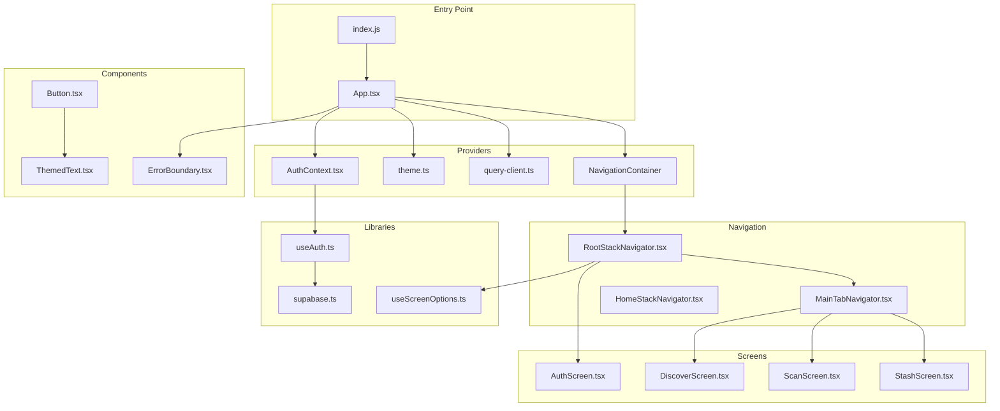
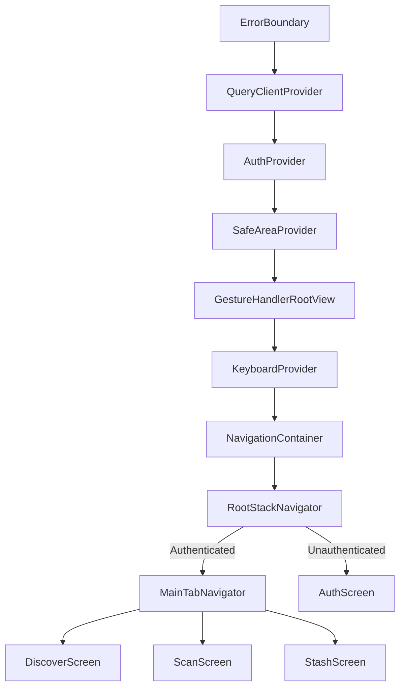
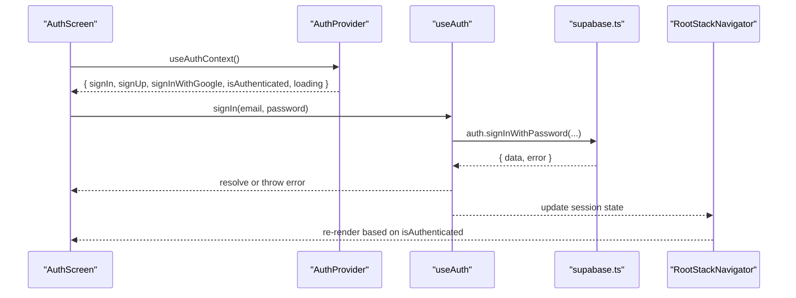
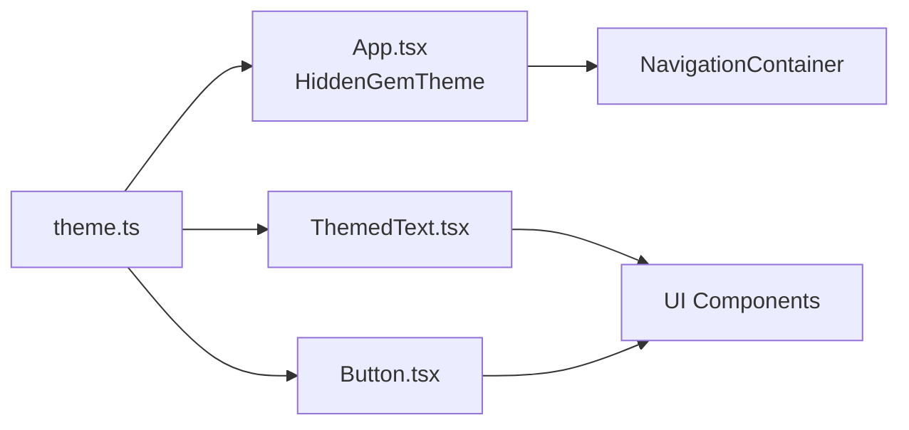
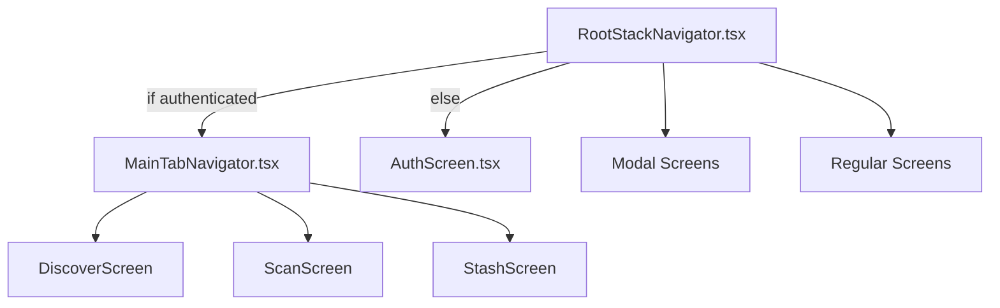
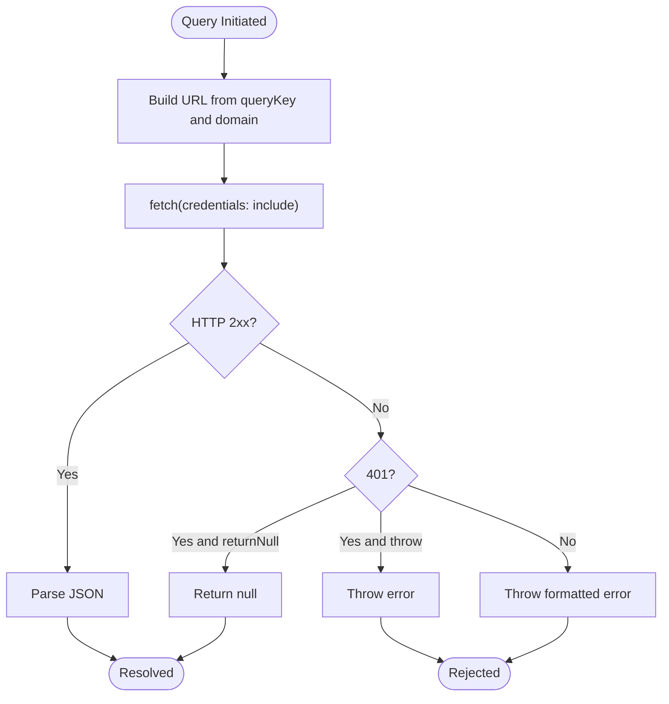
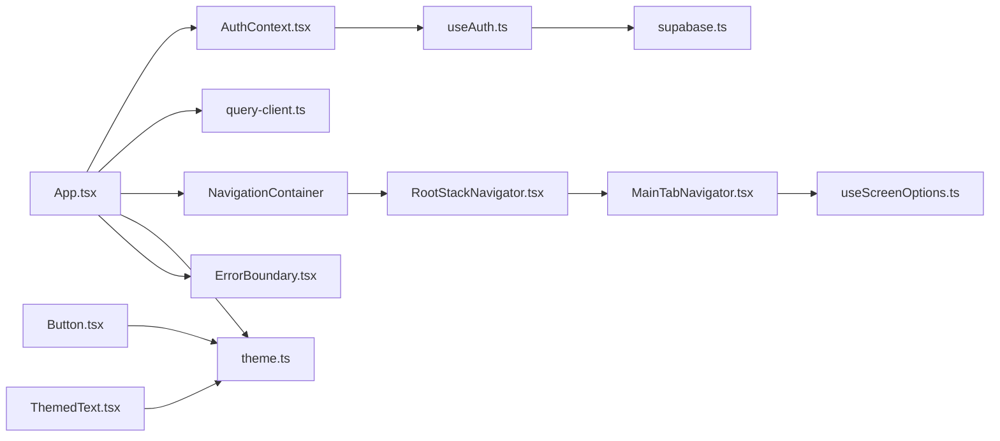

# Client-Side Architecture

<cite>
**Referenced Files in This Document**
- [App.tsx](file://client/App.tsx)
- [index.js](file://client/index.js)
- [AuthContext.tsx](file://client/contexts/AuthContext.tsx)
- [useAuth.ts](file://client/hooks/useAuth.ts)
- [supabase.ts](file://client/lib/supabase.ts)
- [theme.ts](file://client/constants/theme.ts)
- [RootStackNavigator.tsx](file://client/navigation/RootStackNavigator.tsx)
- [MainTabNavigator.tsx](file://client/navigation/MainTabNavigator.tsx)
- [HomeStackNavigator.tsx](file://client/navigation/HomeStackNavigator.tsx)
- [useScreenOptions.ts](file://client/hooks/useScreenOptions.ts)
- [ErrorBoundary.tsx](file://client/components/ErrorBoundary.tsx)
- [Button.tsx](file://client/components/Button.tsx)
- [ThemedText.tsx](file://client/components/ThemedText.tsx)
- [AuthScreen.tsx](file://client/screens/AuthScreen.tsx)
- [query-client.ts](file://client/lib/query-client.ts)
</cite>

## Table of Contents
1. [Introduction](#introduction)
2. [Project Structure](#project-structure)
3. [Core Components](#core-components)
4. [Architecture Overview](#architecture-overview)
5. [Detailed Component Analysis](#detailed-component-analysis)
6. [Dependency Analysis](#dependency-analysis)
7. [Performance Considerations](#performance-considerations)
8. [Troubleshooting Guide](#troubleshooting-guide)
9. [Conclusion](#conclusion)

## Introduction
This document describes the client-side architecture of the React Native mobile application. It covers the application entry point, provider pattern for authentication and theme management, hierarchical navigation with tab-based and stack-based routing, reusable UI components, screen organization, state management via React Query, authentication flow using Supabase, error boundary implementation, and the theme system with dark mode support. It also addresses mobile-specific considerations such as touch interactions, responsive design, and platform differences between iOS and Android.

## Project Structure
The client application follows a feature-based structure with clear separation of concerns:
- Entry point registers the root component with Expo.
- Providers wrap the app to supply authentication, theme, navigation, keyboard, safe area, and React Query context.
- Navigation defines stacks and tabs for routing.
- Screens implement domain-specific views.
- Components encapsulate UI primitives and themed elements.
- Hooks centralize cross-cutting concerns like authentication and screen options.
- Constants define theme tokens and typography.
- Libraries integrate third-party services (Supabase, React Query).

**Diagram sources**
- [index.js](file://client/index.js#L1-L6)
- [App.tsx](file://client/App.tsx#L1-L57)
- [AuthContext.tsx](file://client/contexts/AuthContext.tsx#L1-L31)
- [useAuth.ts](file://client/hooks/useAuth.ts#L1-L151)
- [supabase.ts](file://client/lib/supabase.ts#L1-L39)
- [theme.ts](file://client/constants/theme.ts#L1-L167)
- [RootStackNavigator.tsx](file://client/navigation/RootStackNavigator.tsx#L1-L124)
- [MainTabNavigator.tsx](file://client/navigation/MainTabNavigator.tsx#L1-L192)
- [HomeStackNavigator.tsx](file://client/navigation/HomeStackNavigator.tsx#L1-L28)
- [AuthScreen.tsx](file://client/screens/AuthScreen.tsx#L1-L435)
- [Button.tsx](file://client/components/Button.tsx#L1-L93)
- [ThemedText.tsx](file://client/components/ThemedText.tsx#L1-L62)
- [ErrorBoundary.tsx](file://client/components/ErrorBoundary.tsx#L1-L55)
- [useScreenOptions.ts](file://client/hooks/useScreenOptions.ts#L1-L42)
- [query-client.ts](file://client/lib/query-client.ts#L1-L80)

**Section sources**
- [index.js](file://client/index.js#L1-L6)
- [App.tsx](file://client/App.tsx#L1-L57)

## Core Components
- Application entry point registers the root component with Expo and initializes providers.
- Provider pattern supplies authentication state and methods, theme tokens, and React Query client.
- Navigation container configures theme and gesture handling.
- Theme constants define colors, spacing, typography, fonts, and shadows for both light and dark modes.
- Error boundary wraps the app to gracefully handle rendering errors.

**Section sources**
- [index.js](file://client/index.js#L1-L6)
- [App.tsx](file://client/App.tsx#L1-L57)
- [theme.ts](file://client/constants/theme.ts#L1-L167)
- [ErrorBoundary.tsx](file://client/components/ErrorBoundary.tsx#L1-L55)

## Architecture Overview
The app uses a layered provider hierarchy:
- ErrorBoundary at the topmost level.
- QueryClientProvider manages caching and data fetching.
- AuthProvider exposes session and auth actions.
- SafeAreaProvider, GestureHandlerRootView, and KeyboardProvider enable platform-specific UI behaviors.
- NavigationContainer hosts the navigator tree.
- RootStackNavigator conditionally renders AuthScreen or MainTabNavigator based on authentication state.
- MainTabNavigator organizes Discover, Scan, and Stash screens with custom headers and badges.

**Diagram sources**
- [App.tsx](file://client/App.tsx#L30-L49)
- [RootStackNavigator.tsx](file://client/navigation/RootStackNavigator.tsx#L32-L123)
- [MainTabNavigator.tsx](file://client/navigation/MainTabNavigator.tsx#L64-L144)
- [AuthContext.tsx](file://client/contexts/AuthContext.tsx#L19-L22)

## Detailed Component Analysis

### Authentication Flow with Supabase
The authentication system is built around a custom hook that manages session state and exposes sign-in/sign-up/sign-out and Google OAuth flows. Supabase client initialization handles platform-specific storage and redirect URLs. The AuthProvider exposes the hook’s state and methods to consumers.

**Diagram sources**
- [AuthScreen.tsx](file://client/screens/AuthScreen.tsx#L13-L58)
- [AuthContext.tsx](file://client/contexts/AuthContext.tsx#L19-L30)
- [useAuth.ts](file://client/hooks/useAuth.ts#L40-L70)
- [supabase.ts](file://client/lib/supabase.ts#L26-L34)
- [RootStackNavigator.tsx](file://client/navigation/RootStackNavigator.tsx#L34-L40)

Implementation highlights:
- Session restoration and auth state subscription occur on mount.
- Google OAuth uses platform-aware redirect handling and browser session completion.
- Auth state updates drive conditional rendering of AuthScreen vs MainTabNavigator.

**Section sources**
- [useAuth.ts](file://client/hooks/useAuth.ts#L12-L151)
- [supabase.ts](file://client/lib/supabase.ts#L1-L39)
- [AuthContext.tsx](file://client/contexts/AuthContext.tsx#L1-L31)
- [RootStackNavigator.tsx](file://client/navigation/RootStackNavigator.tsx#L32-L123)
- [AuthScreen.tsx](file://client/screens/AuthScreen.tsx#L1-L435)

### Theme System and Dark Mode Support
The theme system centralizes design tokens and applies them through themed components. The navigation theme merges dark mode colors with brand-specific tokens. Components consume theme via a dedicated hook and props for overrides.

**Diagram sources**
- [theme.ts](file://client/constants/theme.ts#L1-L167)
- [App.tsx](file://client/App.tsx#L17-L28)
- [ThemedText.tsx](file://client/components/ThemedText.tsx#L12-L61)
- [Button.tsx](file://client/components/Button.tsx#L31-L80)

Design tokens include:
- Colors for light/dark palettes, surfaces, borders, and semantic states.
- Spacing and border radius scales.
- Typography scales and font families per platform.
- Shadow configurations for elevation and blur effects.

**Section sources**
- [theme.ts](file://client/constants/theme.ts#L1-L167)
- [App.tsx](file://client/App.tsx#L17-L28)
- [ThemedText.tsx](file://client/components/ThemedText.tsx#L1-L62)
- [Button.tsx](file://client/components/Button.tsx#L1-L93)

### Hierarchical Navigation: Tabs and Stacks
The navigation hierarchy consists of:
- RootStackNavigator: conditionally shows AuthScreen or MainTabNavigator; includes modal and regular screens.
- MainTabNavigator: bottom-tabbed interface with custom header left/right elements, a floating scan action, and platform-specific styling.
- HomeStackNavigator: minimal stack example for demonstration.

**Diagram sources**
- [RootStackNavigator.tsx](file://client/navigation/RootStackNavigator.tsx#L32-L123)
- [MainTabNavigator.tsx](file://client/navigation/MainTabNavigator.tsx#L64-L144)

Key behaviors:
- Conditional rendering based on authentication and configuration state.
- Custom header elements display user name and a scan badge with dynamic counts.
- Platform-specific tab styling and blur effect on iOS.

**Section sources**
- [RootStackNavigator.tsx](file://client/navigation/RootStackNavigator.tsx#L17-L123)
- [MainTabNavigator.tsx](file://client/navigation/MainTabNavigator.tsx#L18-L192)
- [useScreenOptions.ts](file://client/hooks/useScreenOptions.ts#L11-L42)

### Reusable UI Components and Touch Interactions
Reusable components:
- Button: animated press feedback with spring physics and themed colors.
- ThemedText: type-based typography and color selection based on theme and props.
- ErrorBoundary: class-based error boundary with fallback rendering and optional error callback.

Touch interactions:
- Animated pressable scaling for buttons.
- Pressable opacity adjustments for visual feedback.
- Platform-specific gesture handling and full-screen gestures.

**Section sources**
- [Button.tsx](file://client/components/Button.tsx#L1-L93)
- [ThemedText.tsx](file://client/components/ThemedText.tsx#L1-L62)
- [ErrorBoundary.tsx](file://client/components/ErrorBoundary.tsx#L1-L55)

### State Management with React Query
React Query is configured globally with a custom query function that:
- Builds URLs from query keys and the configured domain.
- Handles 401 responses according to policy (throw or return null).
- Enforces credentials inclusion and disables retries/refetch on focus.

**Diagram sources**
- [query-client.ts](file://client/lib/query-client.ts#L46-L80)

**Section sources**
- [query-client.ts](file://client/lib/query-client.ts#L1-L80)

### Component Lifecycle Management and Prop Drilling Solutions
- Provider pattern eliminates prop drilling by exposing context at the root.
- AuthProvider wraps children with authentication state and methods.
- useAuth encapsulates lifecycle effects for session restoration and auth state subscriptions.
- useScreenOptions centralizes navigation options for consistent styling across screens.

**Section sources**
- [AuthContext.tsx](file://client/contexts/AuthContext.tsx#L19-L30)
- [useAuth.ts](file://client/hooks/useAuth.ts#L17-L38)
- [useScreenOptions.ts](file://client/hooks/useScreenOptions.ts#L11-L42)

### Mobile-Specific Considerations
- Platform differences:
  - iOS: transparent tab backgrounds, blur effects, adjusted tab bar padding.
  - Android: solid tab background and elevation for material design.
- Gesture and keyboard:
  - GestureHandlerRootView enables advanced gestures.
  - KeyboardProvider improves keyboard handling.
- Responsive design:
  - Theme tokens for spacing and typography scale across devices.
  - SafeAreaProvider ensures content respects device insets.

**Section sources**
- [MainTabNavigator.tsx](file://client/navigation/MainTabNavigator.tsx#L74-L98)
- [App.tsx](file://client/App.tsx#L3-L6)
- [theme.ts](file://client/constants/theme.ts#L42-L108)

## Dependency Analysis
The following diagram shows key dependencies among core modules:

**Diagram sources**
- [App.tsx](file://client/App.tsx#L1-L57)
- [AuthContext.tsx](file://client/contexts/AuthContext.tsx#L1-L31)
- [useAuth.ts](file://client/hooks/useAuth.ts#L1-L151)
- [supabase.ts](file://client/lib/supabase.ts#L1-L39)
- [RootStackNavigator.tsx](file://client/navigation/RootStackNavigator.tsx#L1-L124)
- [MainTabNavigator.tsx](file://client/navigation/MainTabNavigator.tsx#L1-L192)
- [useScreenOptions.ts](file://client/hooks/useScreenOptions.ts#L1-L42)
- [theme.ts](file://client/constants/theme.ts#L1-L167)
- [ErrorBoundary.tsx](file://client/components/ErrorBoundary.tsx#L1-L55)
- [Button.tsx](file://client/components/Button.tsx#L1-L93)
- [ThemedText.tsx](file://client/components/ThemedText.tsx#L1-L62)

**Section sources**
- [App.tsx](file://client/App.tsx#L1-L57)
- [AuthContext.tsx](file://client/contexts/AuthContext.tsx#L1-L31)
- [useAuth.ts](file://client/hooks/useAuth.ts#L1-L151)
- [supabase.ts](file://client/lib/supabase.ts#L1-L39)
- [RootStackNavigator.tsx](file://client/navigation/RootStackNavigator.tsx#L1-L124)
- [MainTabNavigator.tsx](file://client/navigation/MainTabNavigator.tsx#L1-L192)
- [useScreenOptions.ts](file://client/hooks/useScreenOptions.ts#L1-L42)
- [theme.ts](file://client/constants/theme.ts#L1-L167)
- [ErrorBoundary.tsx](file://client/components/ErrorBoundary.tsx#L1-L55)
- [Button.tsx](file://client/components/Button.tsx#L1-L93)
- [ThemedText.tsx](file://client/components/ThemedText.tsx#L1-L62)

## Performance Considerations
- React Query defaults disable automatic refetch on window focus and retries to reduce network overhead.
- Stale-time is set to Infinity for long-lived data to avoid unnecessary refetches.
- Animated components use lightweight transforms for smooth interactions.
- Platform-specific styling minimizes layout thrashing on iOS and Android.

[No sources needed since this section provides general guidance]

## Troubleshooting Guide
Common areas to inspect:
- Authentication configuration: ensure environment variables for Supabase URL and anonymous key are present.
- Navigation theme: verify HiddenGemTheme merges dark mode colors with brand tokens.
- Error boundaries: confirm ErrorBoundary is wrapping the root and fallback rendering is handled.
- Query client: check domain configuration and 401 handling policy.

**Section sources**
- [supabase.ts](file://client/lib/supabase.ts#L6-L9)
- [App.tsx](file://client/App.tsx#L17-L28)
- [ErrorBoundary.tsx](file://client/components/ErrorBoundary.tsx#L16-L54)
- [query-client.ts](file://client/lib/query-client.ts#L7-L17)

## Conclusion
The client-side architecture employs a clean provider pattern, robust navigation hierarchy, and a centralized theme system to deliver a consistent and responsive user experience across platforms. Authentication is securely managed via Supabase with platform-aware OAuth handling, while React Query provides efficient data fetching and caching. Error boundaries and reusable UI components improve reliability and maintainability.