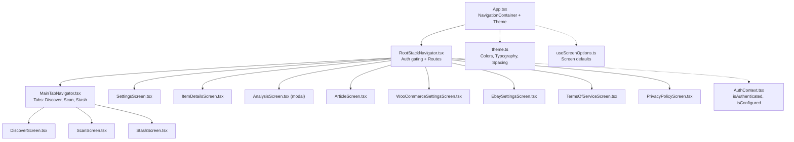
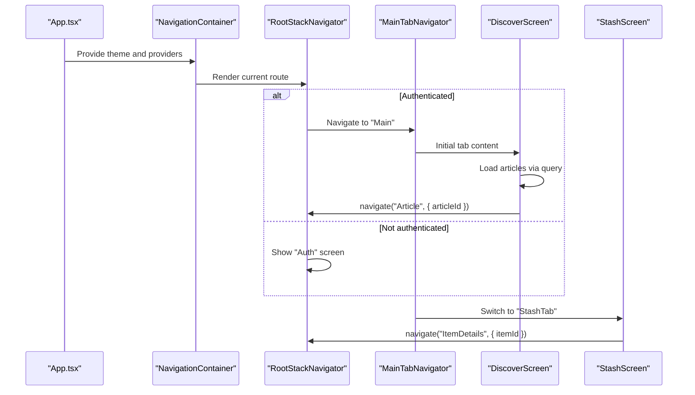
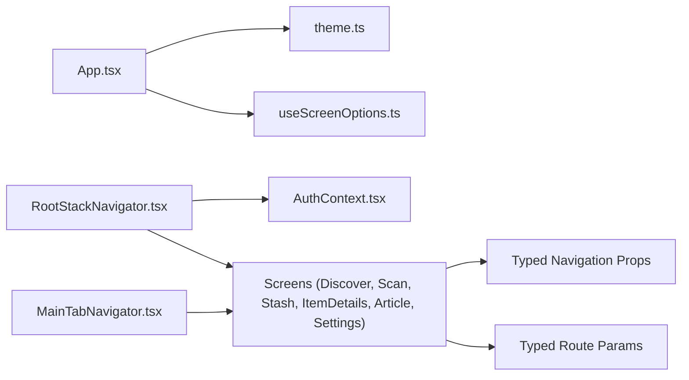

# Navigation System

<cite>
**Referenced Files in This Document**
- [App.tsx](file://client/App.tsx)
- [RootStackNavigator.tsx](file://client/navigation/RootStackNavigator.tsx)
- [MainTabNavigator.tsx](file://client/navigation/MainTabNavigator.tsx)
- [MainTabNavigator26.tsx](file://client/navigation/MainTabNavigator26.tsx)
- [HomeStackNavigator.tsx](file://client/navigation/HomeStackNavigator.tsx)
- [ProfileStackNavigator.tsx](file://client/navigation/ProfileStackNavigator.tsx)
- [useScreenOptions.ts](file://client/hooks/useScreenOptions.ts)
- [theme.ts](file://client/constants/theme.ts)
- [AuthContext.tsx](file://client/contexts/AuthContext.tsx)
- [DiscoverScreen.tsx](file://client/screens/DiscoverScreen.tsx)
- [ScanScreen.tsx](file://client/screens/ScanScreen.tsx)
- [StashScreen.tsx](file://client/screens/StashScreen.tsx)
- [ItemDetailsScreen.tsx](file://client/screens/ItemDetailsScreen.tsx)
- [ArticleScreen.tsx](file://client/screens/ArticleScreen.tsx)
- [SettingsScreen.tsx](file://client/screens/SettingsScreen.tsx)
</cite>

## Table of Contents
1. [Introduction](#introduction)
2. [Project Structure](#project-structure)
3. [Core Components](#core-components)
4. [Architecture Overview](#architecture-overview)
5. [Detailed Component Analysis](#detailed-component-analysis)
6. [Dependency Analysis](#dependency-analysis)
7. [Performance Considerations](#performance-considerations)
8. [Troubleshooting Guide](#troubleshooting-guide)
9. [Conclusion](#conclusion)

## Introduction
This document describes the navigation system for the React Native application. It explains the hierarchical structure built with React Navigation v6, including the RootStackNavigator, MainTabNavigator, and specialized stack navigators for different sections. It covers tab-based navigation, stack navigation for feature-specific screens, route configuration, parameter passing, screen transitions, and navigation guards. It also documents the custom navigation theme, navigation state management, deep linking configuration, navigation ref usage, and best practices for performance optimization.

## Project Structure
The navigation system is organized around a single entry point that wires the entire hierarchy. The main pieces are:
- App.tsx initializes the NavigationContainer and applies a custom theme.
- RootStackNavigator orchestrates authentication gating and routes to the main app flow.
- MainTabNavigator defines the bottom-tabbed interface for Discover, Scan, and Stash.
- Specialized stack navigators (HomeStackNavigator, ProfileStackNavigator) encapsulate feature-specific stacks.
- Screens receive navigation parameters via typed route props and navigate to other screens using typed navigation props.

**Diagram sources**
- [App.tsx](file://client/App.tsx#L17-L28)
- [RootStackNavigator.tsx](file://client/navigation/RootStackNavigator.tsx#L17-L28)
- [MainTabNavigator.tsx](file://client/navigation/MainTabNavigator.tsx#L18-L24)
- [DiscoverScreen.tsx](file://client/screens/DiscoverScreen.tsx#L88-L175)
- [ScanScreen.tsx](file://client/screens/ScanScreen.tsx#L17-L394)
- [StashScreen.tsx](file://client/screens/StashScreen.tsx#L93-L290)
- [SettingsScreen.tsx](file://client/screens/SettingsScreen.tsx#L76-L284)
- [theme.ts](file://client/constants/theme.ts#L3-L40)
- [useScreenOptions.ts](file://client/hooks/useScreenOptions.ts#L11-L41)
- [AuthContext.tsx](file://client/contexts/AuthContext.tsx#L5-L15)

**Section sources**
- [App.tsx](file://client/App.tsx#L30-L49)
- [RootStackNavigator.tsx](file://client/navigation/RootStackNavigator.tsx#L32-L123)
- [MainTabNavigator.tsx](file://client/navigation/MainTabNavigator.tsx#L64-L144)
- [HomeStackNavigator.tsx](file://client/navigation/HomeStackNavigator.tsx#L13-L27)
- [ProfileStackNavigator.tsx](file://client/navigation/ProfileStackNavigator.tsx#L13-L27)

## Core Components
- RootStackNavigator: Defines top-level routes and handles authentication gating. It conditionally renders the Auth screen or the Main tab navigator. It also exposes standalone screens (Settings, ItemDetails, Analysis modal, Article, and legal pages) as needed.
- MainTabNavigator: Implements a bottom tab bar with three tabs (Discover, Scan, Stash). It configures tab styling, icons, header content, and integrates with the global screen options hook.
- Screen-level navigation: Screens use typed navigation and route props to pass parameters and navigate to other screens. They also integrate with external services and UI libraries.

Key typed route parameters:
- RootStackParamList: Defines route names and their parameters (e.g., ItemDetails requires an itemId, Article requires an articleId, Analysis expects two image URIs).
- MainTabParamList: Defines tab-level routes (DiscoverTab, ScanTab, StashTab).

Customization:
- useScreenOptions centralizes screen options (header transparency, blur, gestures, content background).
- App.tsx composes a custom theme extending DarkTheme with brand colors.

**Section sources**
- [RootStackNavigator.tsx](file://client/navigation/RootStackNavigator.tsx#L17-L28)
- [MainTabNavigator.tsx](file://client/navigation/MainTabNavigator.tsx#L18-L24)
- [useScreenOptions.ts](file://client/hooks/useScreenOptions.ts#L11-L41)
- [App.tsx](file://client/App.tsx#L17-L28)

## Architecture Overview
The navigation architecture follows a layered approach:
- App.tsx wraps the app with providers and sets up the NavigationContainer with a custom theme.
- RootStackNavigator decides whether to show the Auth screen or the Main tab navigator based on authentication state.
- MainTabNavigator organizes feature areas behind tabs and provides a unified header with contextual actions.
- Screens coordinate navigation using typed navigation props and route params.

**Diagram sources**
- [App.tsx](file://client/App.tsx#L30-L49)
- [RootStackNavigator.tsx](file://client/navigation/RootStackNavigator.tsx#L32-L123)
- [MainTabNavigator.tsx](file://client/navigation/MainTabNavigator.tsx#L64-L144)
- [DiscoverScreen.tsx](file://client/screens/DiscoverScreen.tsx#L88-L175)
- [StashScreen.tsx](file://client/screens/StashScreen.tsx#L93-L163)

## Detailed Component Analysis

### RootStackNavigator
Responsibilities:
- Authentication gating: Renders Auth when not authenticated but configured.
- Top-level routes: Main tab navigator, Settings, ItemDetails, Analysis modal, Article, and legal screens.
- Parameterized navigation: Passes parameters like itemId, articleId, and image URIs.

Navigation guards:
- Uses authentication state from AuthContext to decide whether to show Auth or Main.

Transitions:
- Uses modal presentation for Analysis.
- Uses standard push/pop for other screens.

Deep linking:
- No explicit deep linking configuration is present in the provided files.

**Section sources**
- [RootStackNavigator.tsx](file://client/navigation/RootStackNavigator.tsx#L17-L28)
- [RootStackNavigator.tsx](file://client/navigation/RootStackNavigator.tsx#L32-L123)
- [AuthContext.tsx](file://client/contexts/AuthContext.tsx#L5-L15)

### MainTabNavigator
Responsibilities:
- Bottom tab bar with Discover, Scan, and Stash.
- Custom header with user info and settings button.
- Dynamic scan badge count fetched via a query.
- Custom tab styling and iOS blur effect.

Navigation:
- Navigates to Settings from the header.
- Navigates to nested stacks or screens within the tab context.

**Section sources**
- [MainTabNavigator.tsx](file://client/navigation/MainTabNavigator.tsx#L18-L24)
- [MainTabNavigator.tsx](file://client/navigation/MainTabNavigator.tsx#L64-L144)

### DiscoverScreen
Responsibilities:
- Lists articles and allows navigation to Article screen.
- Integrates with queries for article data and pull-to-refresh.

Parameter passing:
- Navigates to Article with articleId.

**Section sources**
- [DiscoverScreen.tsx](file://client/screens/DiscoverScreen.tsx#L88-L175)

### ScanScreen
Responsibilities:
- Multi-step scanning flow capturing full item and label images.
- Camera permissions and fallback to gallery selection.
- Navigates to Analysis modal with both image URIs after capturing the second image.

Parameter passing:
- Navigates to Analysis with fullImageUri and labelImageUri.

**Section sources**
- [ScanScreen.tsx](file://client/screens/ScanScreen.tsx#L17-L394)

### StashScreen
Responsibilities:
- Displays scanned items in a grid with estimated values.
- Provides navigation to ItemDetails and a floating action to scan.

Parameter passing:
- Navigates to ItemDetails with itemId.
- Navigates to Main tab’s ScanTab.

**Section sources**
- [StashScreen.tsx](file://client/screens/StashScreen.tsx#L93-L163)

### ItemDetailsScreen
Responsibilities:
- Shows item details and actions (share, delete).
- Publishes items to marketplaces (WooCommerce, eBay) and navigates to settings if not connected.

Parameter receiving:
- Reads itemId from route params.

**Section sources**
- [ItemDetailsScreen.tsx](file://client/screens/ItemDetailsScreen.tsx#L42-L197)

### ArticleScreen
Responsibilities:
- Displays article content based on articleId parameter.

Parameter receiving:
- Reads articleId from route params.

**Section sources**
- [ArticleScreen.tsx](file://client/screens/ArticleScreen.tsx#L26-L58)

### SettingsScreen
Responsibilities:
- Manages app settings, integrations, and account actions.
- Navigates to marketplace settings and legal screens.

**Section sources**
- [SettingsScreen.tsx](file://client/screens/SettingsScreen.tsx#L76-L284)

### Additional Stack Navigators
- HomeStackNavigator: Minimal stack with a single Home screen.
- ProfileStackNavigator: Minimal stack with a single Profile screen.
- MainTabNavigator26: Alternative tab navigator using unstable native bottom tabs with nested stacks.

**Section sources**
- [HomeStackNavigator.tsx](file://client/navigation/HomeStackNavigator.tsx#L13-L27)
- [ProfileStackNavigator.tsx](file://client/navigation/ProfileStackNavigator.tsx#L13-L27)
- [MainTabNavigator26.tsx](file://client/navigation/MainTabNavigator26.tsx#L14-L50)

## Dependency Analysis
The navigation system exhibits clear separation of concerns:
- App.tsx depends on theme.ts and useScreenOptions.ts to configure the theme and screen defaults.
- RootStackNavigator depends on AuthContext for authentication gating.
- MainTabNavigator depends on screens and uses typed navigation props to coordinate navigation.
- Screens depend on typed navigation and route props to pass parameters and trigger navigation.

**Diagram sources**
- [App.tsx](file://client/App.tsx#L17-L28)
- [theme.ts](file://client/constants/theme.ts#L3-L40)
- [useScreenOptions.ts](file://client/hooks/useScreenOptions.ts#L11-L41)
- [RootStackNavigator.tsx](file://client/navigation/RootStackNavigator.tsx#L32-L123)
- [AuthContext.tsx](file://client/contexts/AuthContext.tsx#L5-L15)
- [MainTabNavigator.tsx](file://client/navigation/MainTabNavigator.tsx#L64-L144)

**Section sources**
- [App.tsx](file://client/App.tsx#L17-L28)
- [RootStackNavigator.tsx](file://client/navigation/RootStackNavigator.tsx#L32-L123)
- [MainTabNavigator.tsx](file://client/navigation/MainTabNavigator.tsx#L64-L144)

## Performance Considerations
- Prefer lazy loading of heavy screens by deferring imports or using dynamic imports at the navigation level.
- Use stable keys for lists (e.g., FlatList) to minimize re-renders.
- Avoid unnecessary re-renders by memoizing callbacks passed to navigation handlers.
- Keep modals minimal and dismiss them promptly after use to reduce memory footprint.
- Use query caching and invalidation strategically to avoid redundant network requests during navigation.
- Leverage platform-specific optimizations (e.g., iOS blur effects) judiciously to balance UX and performance.

[No sources needed since this section provides general guidance]

## Troubleshooting Guide
Common issues and resolutions:
- Authentication loop or incorrect gating:
  - Verify authentication state and isConfigured flag from AuthContext.
  - Ensure RootStackNavigator conditionally renders Auth vs Main.
- Navigation parameter errors:
  - Confirm typed param lists match the parameters being passed.
  - Use typed navigation and route props to prevent runtime mismatches.
- Screen options not applied:
  - Ensure useScreenOptions is consistently applied to all stacks.
  - Verify theme composition in App.tsx aligns with intended colors.
- Tab header actions not working:
  - Confirm navigation prop typing and that the header functions are rendered within the tab navigator’s screen options.

**Section sources**
- [RootStackNavigator.tsx](file://client/navigation/RootStackNavigator.tsx#L32-L123)
- [AuthContext.tsx](file://client/contexts/AuthContext.tsx#L5-L15)
- [useScreenOptions.ts](file://client/hooks/useScreenOptions.ts#L11-L41)
- [MainTabNavigator.tsx](file://client/navigation/MainTabNavigator.tsx#L64-L144)

## Conclusion
The navigation system is structured around a clean hierarchy with strong typing, centralized screen options, and a custom theme. RootStackNavigator manages authentication gating and top-level routes, while MainTabNavigator organizes core features. Screens use typed navigation and route props to pass parameters reliably. The system leverages React Navigation v6 capabilities and integrates with external services and UI libraries. For further enhancements, consider adding deep linking support, navigation refs for imperative navigation, and performance monitoring for navigation-heavy flows.