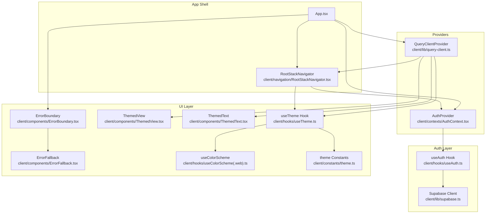
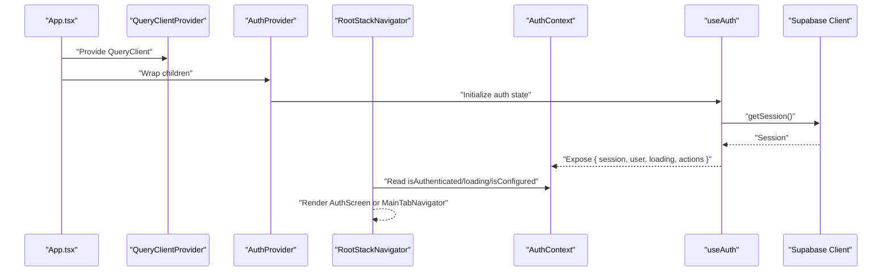
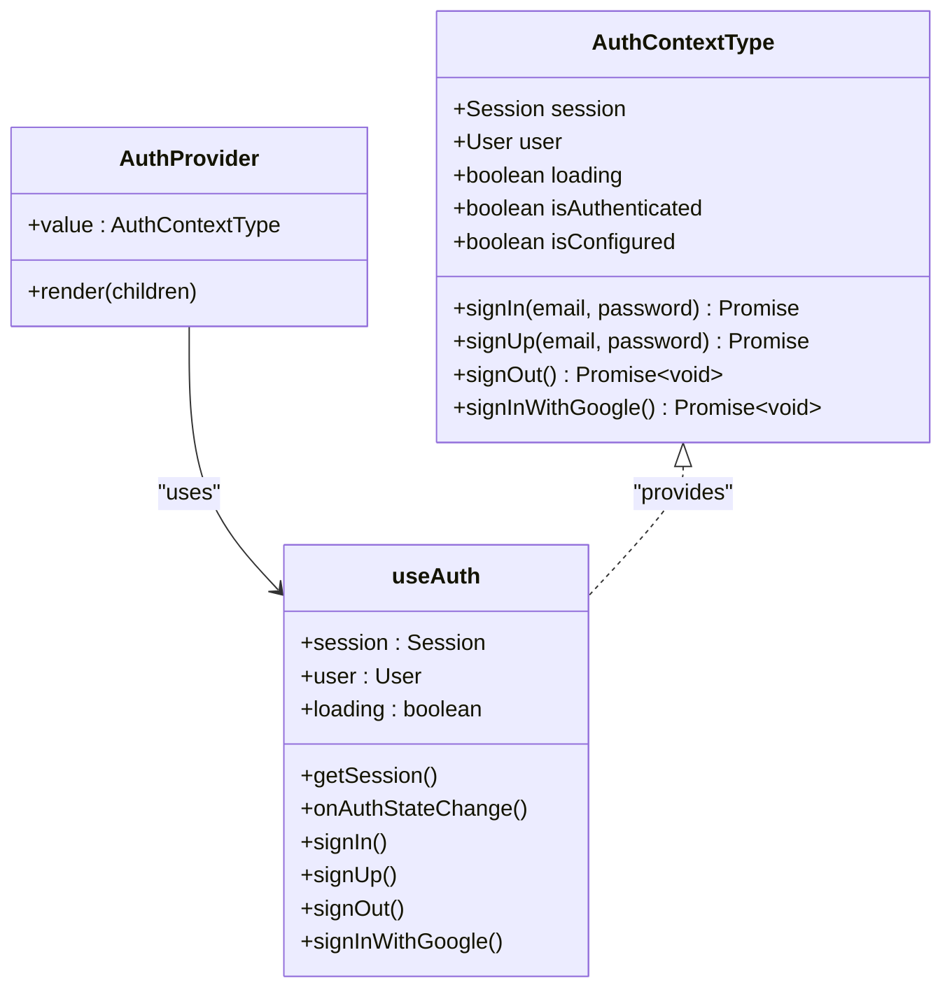
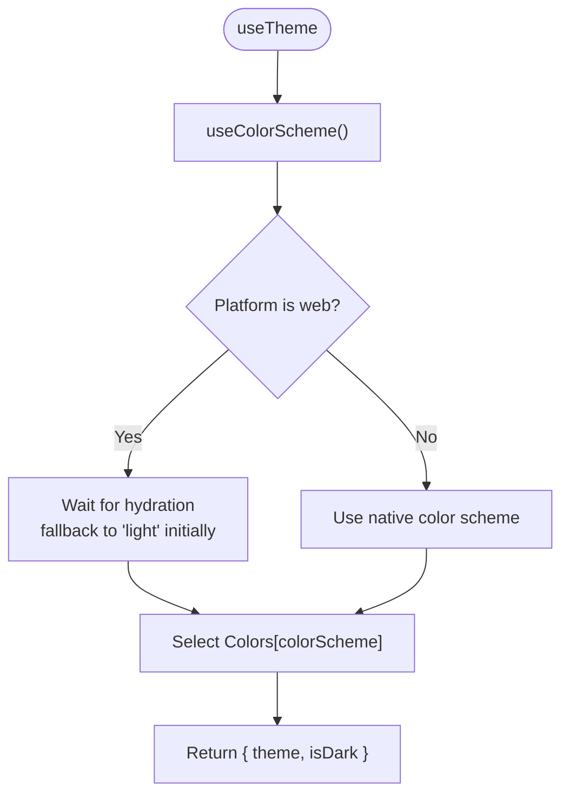
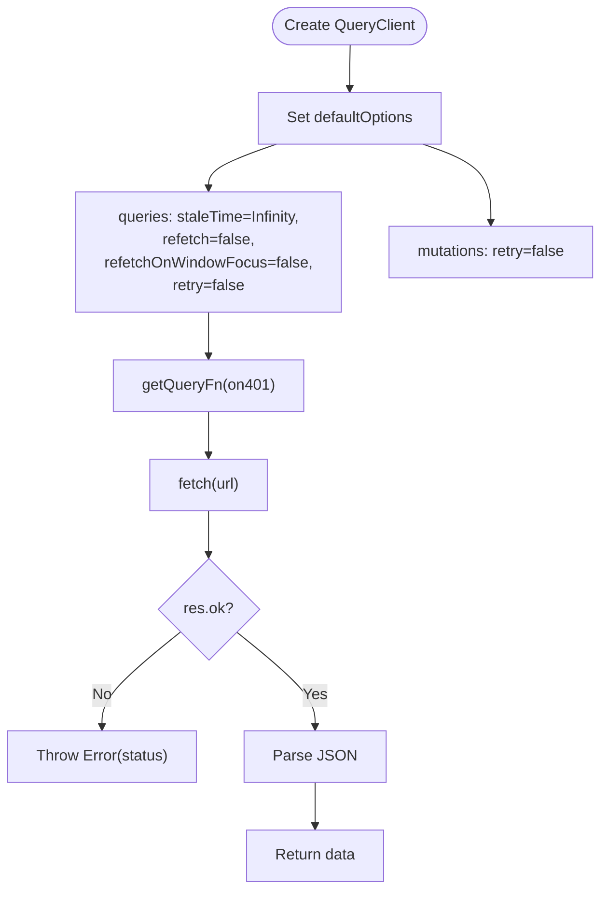
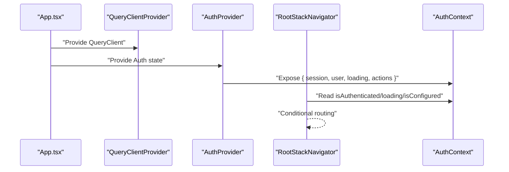
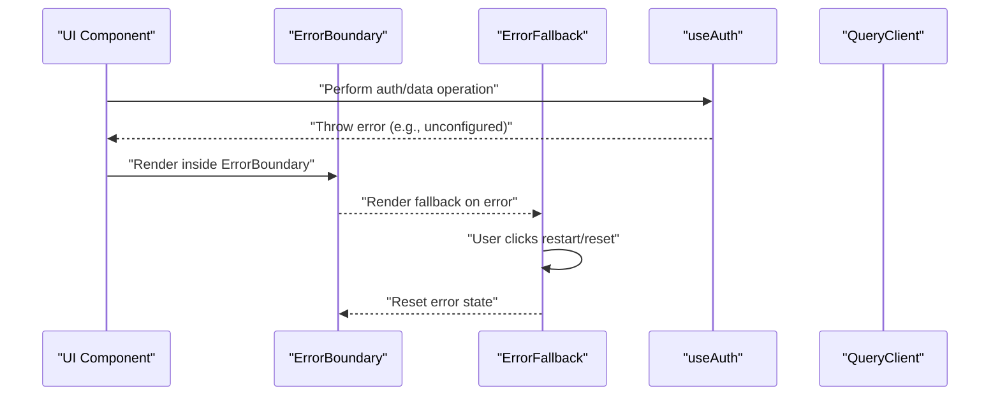
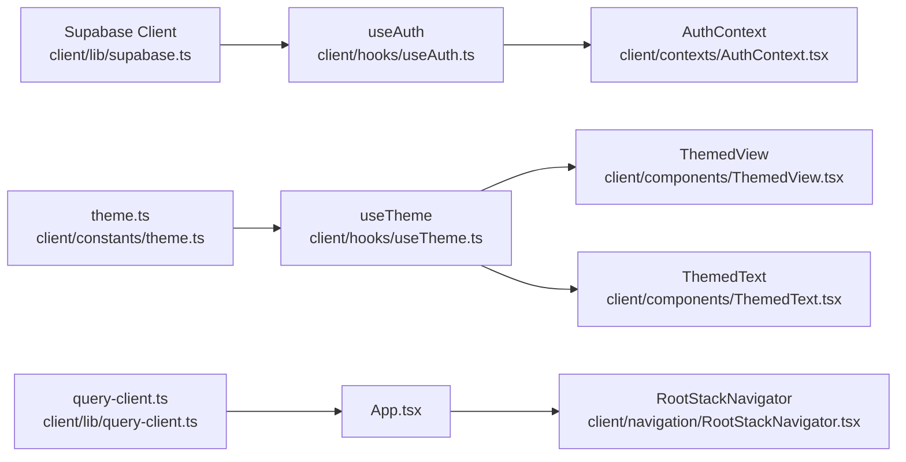

# State Management

<cite>
**Referenced Files in This Document**
- [App.tsx](file://client/App.tsx)
- [AuthContext.tsx](file://client/contexts/AuthContext.tsx)
- [useAuth.ts](file://client/hooks/useAuth.ts)
- [supabase.ts](file://client/lib/supabase.ts)
- [query-client.ts](file://client/lib/query-client.ts)
- [RootStackNavigator.tsx](file://client/navigation/RootStackNavigator.tsx)
- [ErrorBoundary.tsx](file://client/components/ErrorBoundary.tsx)
- [ErrorFallback.tsx](file://client/components/ErrorFallback.tsx)
- [useTheme.ts](file://client/hooks/useTheme.ts)
- [useColorScheme.ts](file://client/hooks/useColorScheme.ts)
- [useColorScheme.web.ts](file://client/hooks/useColorScheme.web.ts)
- [theme.ts](file://client/constants/theme.ts)
- [ThemedView.tsx](file://client/components/ThemedView.tsx)
- [ThemedText.tsx](file://client/components/ThemedText.tsx)
- [package.json](file://package.json)
</cite>

## Table of Contents
1. [Introduction](#introduction)
2. [Project Structure](#project-structure)
3. [Core Components](#core-components)
4. [Architecture Overview](#architecture-overview)
5. [Detailed Component Analysis](#detailed-component-analysis)
6. [Dependency Analysis](#dependency-analysis)
7. [Performance Considerations](#performance-considerations)
8. [Troubleshooting Guide](#troubleshooting-guide)
9. [Conclusion](#conclusion)

## Introduction
This document explains the state management architecture of the client application, focusing on:
- The provider pattern for authentication state via a dedicated AuthContext
- Custom hooks for consuming authentication state
- Theme context and platform-aware color scheme resolution
- React Query integration for API data fetching, caching, and synchronization
- Provider hierarchy, state propagation, and error handling strategies
- Loading state management and performance optimization techniques

## Project Structure
The state management stack is organized around three pillars:
- Authentication state via a React Context provider
- Theme state via a composition of color scheme detection and theme constants
- Data fetching and caching via React Query’s QueryClient

**Diagram sources**
- [App.tsx](file://client/App.tsx#L30-L49)
- [AuthContext.tsx](file://client/contexts/AuthContext.tsx#L19-L22)
- [useAuth.ts](file://client/hooks/useAuth.ts#L12-L38)
- [supabase.ts](file://client/lib/supabase.ts#L6-L38)
- [query-client.ts](file://client/lib/query-client.ts#L66-L79)
- [RootStackNavigator.tsx](file://client/navigation/RootStackNavigator.tsx#L32-L38)
- [ErrorBoundary.tsx](file://client/components/ErrorBoundary.tsx#L16-L54)
- [ErrorFallback.tsx](file://client/components/ErrorFallback.tsx#L22-L144)
- [useTheme.ts](file://client/hooks/useTheme.ts#L4-L13)
- [useColorScheme.ts](file://client/hooks/useColorScheme.ts#L1-L2)
- [useColorScheme.web.ts](file://client/hooks/useColorScheme.web.ts#L7-L21)
- [theme.ts](file://client/constants/theme.ts#L3-L40)
- [ThemedView.tsx](file://client/components/ThemedView.tsx#L10-L26)
- [ThemedText.tsx](file://client/components/ThemedText.tsx#L12-L61)

**Section sources**
- [App.tsx](file://client/App.tsx#L30-L49)
- [RootStackNavigator.tsx](file://client/navigation/RootStackNavigator.tsx#L32-L38)

## Core Components
- AuthContext provider and consumer:
  - Exposes session, user, loading, sign-in/sign-up/sign-out helpers, and flags for authentication state and configuration status.
  - Wraps children with a Context provider so any component can consume authentication state via a custom hook.
- useAuth hook:
  - Initializes Supabase session and subscribes to auth state changes.
  - Provides sign-in/sign-up/sign-out and Google OAuth flows with platform-specific handling.
  - Manages loading state and guards against unconfigured environments.
- Theme context:
  - useTheme composes platform-aware color scheme detection and theme constants.
  - ThemedView and ThemedText automatically apply colors and typography based on current theme.
- React Query client:
  - Centralized configuration with strict defaults: no automatic refetch, infinite stale time, and explicit 401 handling.
  - Provides a typed query function factory and a reusable fetch wrapper for API requests.

**Section sources**
- [AuthContext.tsx](file://client/contexts/AuthContext.tsx#L5-L30)
- [useAuth.ts](file://client/hooks/useAuth.ts#L12-L151)
- [useTheme.ts](file://client/hooks/useTheme.ts#L4-L13)
- [theme.ts](file://client/constants/theme.ts#L3-L40)
- [query-client.ts](file://client/lib/query-client.ts#L66-L79)

## Architecture Overview
The provider hierarchy ensures that state flows from providers to consumers:
- App initializes QueryClientProvider and AuthProvider at the root.
- RootStackNavigator reads authentication state to decide whether to render AuthScreen or MainTabNavigator.
- UI components rely on useTheme for consistent theming and on ThemedView/ThemedText for styled rendering.
- ErrorBoundary wraps the app to gracefully handle runtime errors.

**Diagram sources**
- [App.tsx](file://client/App.tsx#L33-L45)
- [AuthContext.tsx](file://client/contexts/AuthContext.tsx#L19-L22)
- [useAuth.ts](file://client/hooks/useAuth.ts#L17-L38)
- [RootStackNavigator.tsx](file://client/navigation/RootStackNavigator.tsx#L34-L40)
- [supabase.ts](file://client/lib/supabase.ts#L20-L38)

## Detailed Component Analysis

### AuthContext Provider and Custom Hook
- Provider:
  - Creates an AuthContext with a typed interface exposing session, user, loading, sign actions, and flags.
  - Renders children wrapped in the provider, passing the result of useAuth as the context value.
- Consumer:
  - useAuthContext enforces that consumers are wrapped in AuthProvider and throws if not used within the provider.
- useAuth:
  - Initializes session and user from Supabase, sets loading, and unsubscribes on cleanup.
  - Implements sign-in, sign-up, sign-out, and Google OAuth with platform-specific redirect handling.
  - Guards operations when Supabase is not configured and surfaces errors appropriately.

**Diagram sources**
- [AuthContext.tsx](file://client/contexts/AuthContext.tsx#L5-L30)
- [useAuth.ts](file://client/hooks/useAuth.ts#L12-L151)

**Section sources**
- [AuthContext.tsx](file://client/contexts/AuthContext.tsx#L19-L30)
- [useAuth.ts](file://client/hooks/useAuth.ts#L17-L38)
- [useAuth.ts](file://client/hooks/useAuth.ts#L40-L70)
- [useAuth.ts](file://client/hooks/useAuth.ts#L72-L137)

### Theme Context Implementation
- useTheme:
  - Reads the current color scheme (platform-aware) and selects the appropriate theme palette.
- ThemedView and ThemedText:
  - Apply background/text colors and typography based on theme and props.
- Color scheme resolution:
  - On web, hydrates the color scheme after initial render to avoid SSR mismatches.
  - On native, uses the built-in hook directly.

**Diagram sources**
- [useTheme.ts](file://client/hooks/useTheme.ts#L4-L13)
- [useColorScheme.web.ts](file://client/hooks/useColorScheme.web.ts#L7-L21)
- [useColorScheme.ts](file://client/hooks/useColorScheme.ts#L1-L2)
- [theme.ts](file://client/constants/theme.ts#L3-L40)

**Section sources**
- [useTheme.ts](file://client/hooks/useTheme.ts#L4-L13)
- [ThemedView.tsx](file://client/components/ThemedView.tsx#L10-L26)
- [ThemedText.tsx](file://client/components/ThemedText.tsx#L12-L61)
- [useColorScheme.web.ts](file://client/hooks/useColorScheme.web.ts#L7-L21)
- [useColorScheme.ts](file://client/hooks/useColorScheme.ts#L1-L2)
- [theme.ts](file://client/constants/theme.ts#L3-L40)

### React Query Client Configuration and API Synchronization
- QueryClient defaults:
  - Infinite staleTime to prevent unnecessary refetches.
  - Disabled window focus refetch and retries for predictable behavior.
  - Centralized query function that respects 401 handling policy.
- API request wrapper:
  - Enforces response OK semantics and throws on non-OK responses.
- Integration:
  - App wraps the UI tree with QueryClientProvider, enabling all screens and components to benefit from caching and invalidation strategies.

**Diagram sources**
- [query-client.ts](file://client/lib/query-client.ts#L66-L79)
- [query-client.ts](file://client/lib/query-client.ts#L46-L64)
- [query-client.ts](file://client/lib/query-client.ts#L19-L24)

**Section sources**
- [query-client.ts](file://client/lib/query-client.ts#L66-L79)
- [query-client.ts](file://client/lib/query-client.ts#L19-L24)
- [query-client.ts](file://client/lib/query-client.ts#L26-L43)

### Context Provider Hierarchy and State Propagation
- App initializes providers:
  - QueryClientProvider wraps the entire app for data fetching.
  - AuthProvider wraps children to expose authentication state.
  - ErrorBoundary wraps the app to catch rendering errors.
- Root navigation depends on authentication:
  - Reads isAuthenticated, loading, and isConfigured to choose between AuthScreen and MainTabNavigator.
- Theme-aware UI:
  - Components use useTheme to render with consistent colors and typography.

**Diagram sources**
- [App.tsx](file://client/App.tsx#L33-L45)
- [AuthContext.tsx](file://client/contexts/AuthContext.tsx#L19-L22)
- [RootStackNavigator.tsx](file://client/navigation/RootStackNavigator.tsx#L34-L40)

**Section sources**
- [App.tsx](file://client/App.tsx#L30-L49)
- [RootStackNavigator.tsx](file://client/navigation/RootStackNavigator.tsx#L32-L38)

### Error Handling in State Providers
- ErrorBoundary:
  - Captures rendering errors via lifecycle methods and renders a fallback component.
  - Exposes a reset function to recover from errors.
- ErrorFallback:
  - Provides a user-friendly UI with a restart action and optional developer details modal.
  - Uses theme-aware components for consistent styling.
- Auth and Query layers:
  - useAuth throws meaningful errors when Supabase is not configured.
  - query-client enforces response validation and throws on non-OK responses.

**Diagram sources**
- [ErrorBoundary.tsx](file://client/components/ErrorBoundary.tsx#L16-L54)
- [ErrorFallback.tsx](file://client/components/ErrorFallback.tsx#L22-L144)
- [useAuth.ts](file://client/hooks/useAuth.ts#L41-L43)
- [query-client.ts](file://client/lib/query-client.ts#L19-L24)

**Section sources**
- [ErrorBoundary.tsx](file://client/components/ErrorBoundary.tsx#L16-L54)
- [ErrorFallback.tsx](file://client/components/ErrorFallback.tsx#L22-L144)
- [useAuth.ts](file://client/hooks/useAuth.ts#L41-L43)
- [query-client.ts](file://client/lib/query-client.ts#L19-L24)

## Dependency Analysis
- External libraries:
  - @supabase/supabase-js for authentication and session persistence
  - @tanstack/react-query for caching and data synchronization
  - react-native-safe-area-context, react-native-gesture-handler, react-native-keyboard-controller for cross-platform UI stability
- Internal dependencies:
  - AuthContext depends on useAuth
  - useAuth depends on Supabase client and platform utilities
  - Theme system depends on useColorScheme and theme constants
  - UI components depend on useTheme and theme constants

**Diagram sources**
- [supabase.ts](file://client/lib/supabase.ts#L6-L38)
- [useAuth.ts](file://client/hooks/useAuth.ts#L12-L151)
- [AuthContext.tsx](file://client/contexts/AuthContext.tsx#L19-L22)
- [theme.ts](file://client/constants/theme.ts#L3-L40)
- [useTheme.ts](file://client/hooks/useTheme.ts#L4-L13)
- [ThemedView.tsx](file://client/components/ThemedView.tsx#L10-L26)
- [ThemedText.tsx](file://client/components/ThemedText.tsx#L12-L61)
- [query-client.ts](file://client/lib/query-client.ts#L66-L79)
- [App.tsx](file://client/App.tsx#L33-L45)
- [RootStackNavigator.tsx](file://client/navigation/RootStackNavigator.tsx#L32-L38)

**Section sources**
- [package.json](file://package.json#L19-L67)

## Performance Considerations
- Caching strategy:
  - Infinite staleTime prevents unnecessary refetches; pair with explicit invalidation on mutations to keep data fresh.
- Refetch controls:
  - Disabled refetchOnWindowFocus and retries reduce network churn during normal usage.
- Loading states:
  - useAuth sets loading while initializing session; RootStackNavigator conditionally renders until loading completes to avoid flicker.
- Platform-specific optimizations:
  - useColorScheme.web.ts hydrates after mount to prevent SSR mismatches and ensure consistent initial theme.
- Error short-circuit:
  - Early throws in useAuth and query-client avoid wasted work when Supabase is not configured.

[No sources needed since this section provides general guidance]

## Troubleshooting Guide
- Authentication not configured:
  - Symptom: Sign-in/sign-up/sign-out throws an error indicating missing Supabase credentials.
  - Resolution: Ensure environment variables for Supabase URL and anon key are set and loaded at runtime.
- OAuth redirects:
  - Symptom: Google OAuth fails or does not return to the app.
  - Resolution: Verify redirect URL generation and platform-specific handling; confirm browser session completion on native platforms.
- 401 responses:
  - Symptom: API requests fail with 401.
  - Resolution: Configure on401 behavior in getQueryFn; ensure session validity and token refresh are enabled.
- Theme mismatch:
  - Symptom: Initial theme appears incorrect on web during SSR.
  - Resolution: Allow hydration to complete before reading color scheme; platform-specific hook handles this automatically.
- Error boundary activation:
  - Symptom: App displays fallback UI after an error.
  - Resolution: Use the restart option in ErrorFallback to reload the app; inspect the modal details for stack traces.

**Section sources**
- [useAuth.ts](file://client/hooks/useAuth.ts#L41-L43)
- [useAuth.ts](file://client/hooks/useAuth.ts#L72-L137)
- [query-client.ts](file://client/lib/query-client.ts#L45-L64)
- [useColorScheme.web.ts](file://client/hooks/useColorScheme.web.ts#L7-L21)
- [ErrorFallback.tsx](file://client/components/ErrorFallback.tsx#L22-L144)

## Conclusion
The application employs a clean separation of concerns:
- Authentication state is encapsulated in a dedicated provider and hook, with robust error handling and platform-aware OAuth flows.
- Theme state is derived from a simple composition of color scheme detection and theme constants, ensuring consistent UI rendering across platforms.
- React Query provides a predictable caching and synchronization model tailored to the app’s needs, with explicit control over refetch and retry behavior.
Together, these patterns enable scalable, maintainable state management with clear boundaries and strong guarantees around error handling and performance.