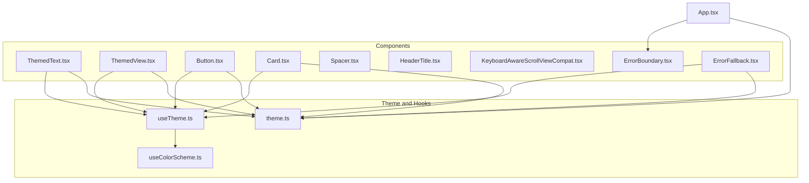
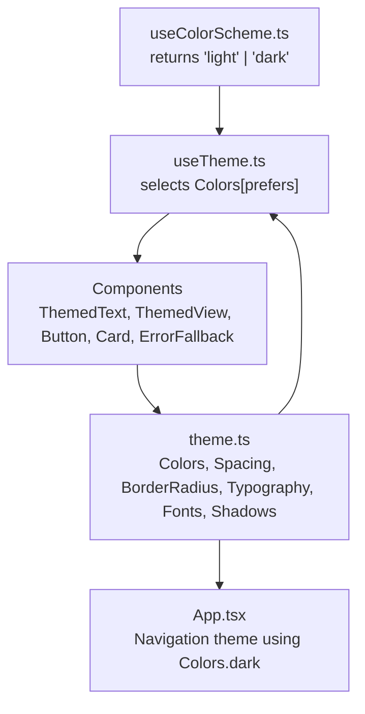
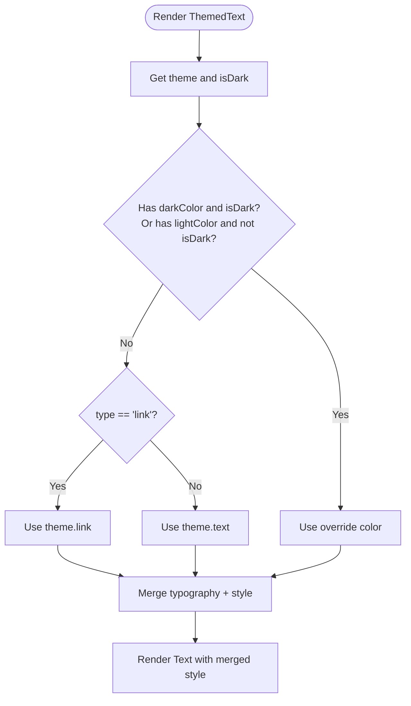
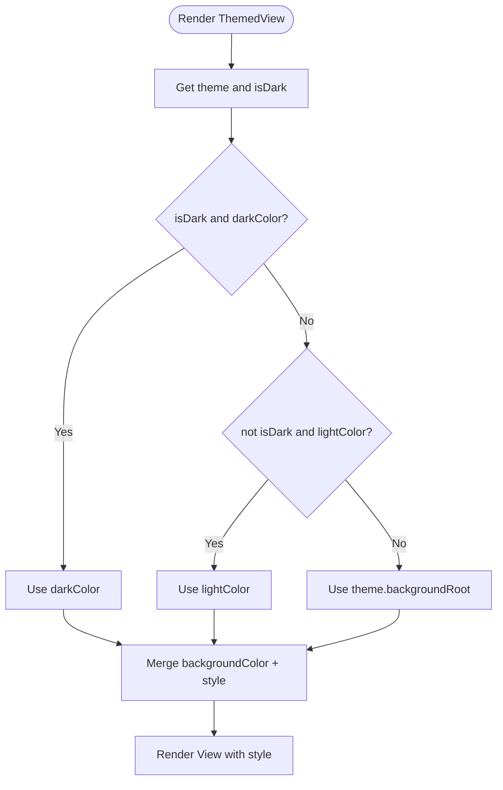
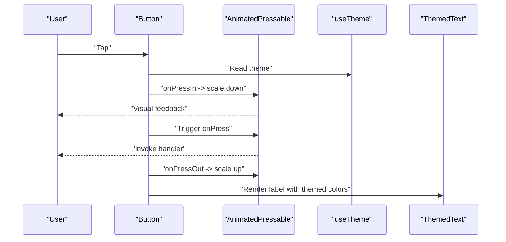
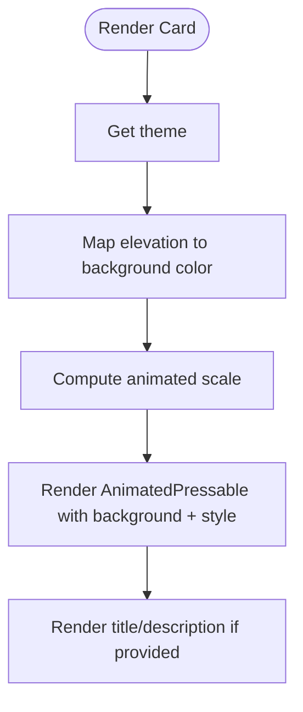
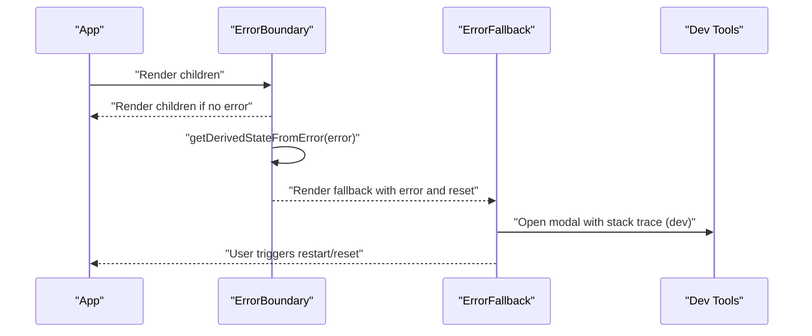
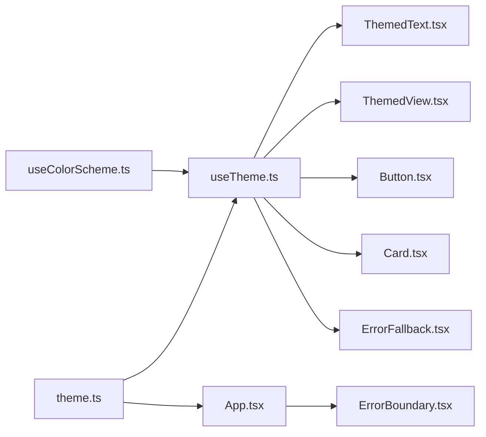

# UI Components

<cite>
**Referenced Files in This Document**
- [ThemedText.tsx](file://client/components/ThemedText.tsx)
- [ThemedView.tsx](file://client/components/ThemedView.tsx)
- [Button.tsx](file://client/components/Button.tsx)
- [Card.tsx](file://client/components/Card.tsx)
- [Spacer.tsx](file://client/components/Spacer.tsx)
- [theme.ts](file://client/constants/theme.ts)
- [useTheme.ts](file://client/hooks/useTheme.ts)
- [useColorScheme.ts](file://client/hooks/useColorScheme.ts)
- [ErrorBoundary.tsx](file://client/components/ErrorBoundary.tsx)
- [ErrorFallback.tsx](file://client/components/ErrorFallback.tsx)
- [App.tsx](file://client/App.tsx)
- [HeaderTitle.tsx](file://client/components/HeaderTitle.tsx)
- [KeyboardAwareScrollViewCompat.tsx](file://client/components/KeyboardAwareScrollViewCompat.tsx)
- [auth_flow.yml](file://.maestro/auth_flow.yml)
</cite>

## Table of Contents
1. [Introduction](#introduction)
2. [Project Structure](#project-structure)
3. [Core Components](#core-components)
4. [Architecture Overview](#architecture-overview)
5. [Detailed Component Analysis](#detailed-component-analysis)
6. [Dependency Analysis](#dependency-analysis)
7. [Performance Considerations](#performance-considerations)
8. [Accessibility Considerations](#accessibility-considerations)
9. [Responsive Design Patterns](#responsive-design-patterns)
10. [Component Testing Strategies](#component-testing-strategies)
11. [Troubleshooting Guide](#troubleshooting-guide)
12. [Conclusion](#conclusion)
13. [Appendices](#appendices)

## Introduction
This document describes the reusable UI component library used across the application. It focuses on the purpose, props interface, styling approach, and usage patterns of key components. It also explains how themed components integrate with the theme system, how components compose, and how to extend and optimize the library. Accessibility, responsive design, and testing strategies are included to guide robust usage.

## Project Structure
The UI component library resides under client/components and integrates with theme constants and hooks located under client/constants and client/hooks respectively. The ErrorBoundary and ErrorFallback provide graceful degradation and diagnostics. App wiring demonstrates how components and theme are integrated into the app shell.

**Diagram sources**
- [ThemedText.tsx](file://client/components/ThemedText.tsx#L1-L62)
- [ThemedView.tsx](file://client/components/ThemedView.tsx#L1-L27)
- [Button.tsx](file://client/components/Button.tsx#L1-L93)
- [Card.tsx](file://client/components/Card.tsx#L1-L115)
- [Spacer.tsx](file://client/components/Spacer.tsx#L1-L21)
- [HeaderTitle.tsx](file://client/components/HeaderTitle.tsx#L1-L40)
- [KeyboardAwareScrollViewCompat.tsx](file://client/components/KeyboardAwareScrollViewCompat.tsx#L1-L38)
- [theme.ts](file://client/constants/theme.ts#L1-L167)
- [useTheme.ts](file://client/hooks/useTheme.ts#L1-L14)
- [useColorScheme.ts](file://client/hooks/useColorScheme.ts#L1-L2)
- [ErrorBoundary.tsx](file://client/components/ErrorBoundary.tsx#L1-L55)
- [ErrorFallback.tsx](file://client/components/ErrorFallback.tsx#L1-L247)
- [App.tsx](file://client/App.tsx#L1-L57)

**Section sources**
- [App.tsx](file://client/App.tsx#L1-L57)
- [theme.ts](file://client/constants/theme.ts#L1-L167)
- [useTheme.ts](file://client/hooks/useTheme.ts#L1-L14)
- [useColorScheme.ts](file://client/hooks/useColorScheme.ts#L1-L2)

## Core Components
This section documents the primary reusable components and their roles in the UI library.

- ThemedText
  - Purpose: Renders text with typography and color that adapt to the current theme and supports semantic types.
  - Props: Extends TextProps with optional lightColor, darkColor, and type ("h1"|"h2"|"h3"|"h4"|"body"|"small"|"link").
  - Styling: Applies color via theme and merges a typography style based on type. Supports prop-forwarding to underlying Text.
  - Usage patterns: Use type for semantic sizing and weight; override color with lightColor/darkColor when needed.

- ThemedView
  - Purpose: Provides a themed background container with optional overrides for light/dark modes.
  - Props: Extends ViewProps with optional lightColor, darkColor.
  - Styling: Chooses background color based on theme and mode, with explicit overrides taking precedence.
  - Usage patterns: Wrap content areas that require consistent themed backgrounds.

- Button
  - Purpose: Interactive pressable element with animated feedback and themed colors.
  - Props: onPress, children, style, disabled.
  - Styling: Uses theme colors for background and text; applies spring-based scaling on press; integrates ThemedText for label.
  - Usage patterns: Prefer for primary actions; disable via disabled prop; forward style for alignment and spacing.

- Card
  - Purpose: A pressable content container with elevation-aware background and optional title/description.
  - Props: elevation (1|2|3|default), title, description, children, onPress, style.
  - Styling: Background color mapped to elevation tiers; includes spring scaling; renders ThemedText for title and description.
  - Usage patterns: Encapsulate content blocks; use elevation to express depth; leverage onPress for navigational cards.

- Spacer
  - Purpose: Minimal spacer element for layout control.
  - Props: width, height (numbers).
  - Styling: Renders a View with fixed width and height.
  - Usage patterns: Replace empty views for spacing; useful in flex layouts.

- ErrorBoundary and ErrorFallback
  - Purpose: Graceful error handling with optional developer diagnostics.
  - Props: ErrorBoundary accepts FallbackComponent and onError; ErrorFallback receives error and reset callback.
  - Styling: Uses theme colors and spacing; includes a modal with scrollable stack trace in development.
  - Usage patterns: Wrap top-level app rendering to catch errors; customize fallback via props.

**Section sources**
- [ThemedText.tsx](file://client/components/ThemedText.tsx#L6-L61)
- [ThemedView.tsx](file://client/components/ThemedView.tsx#L5-L26)
- [Button.tsx](file://client/components/Button.tsx#L14-L80)
- [Card.tsx](file://client/components/Card.tsx#L14-L101)
- [Spacer.tsx](file://client/components/Spacer.tsx#L3-L20)
- [ErrorBoundary.tsx](file://client/components/ErrorBoundary.tsx#L4-L54)
- [ErrorFallback.tsx](file://client/components/ErrorFallback.tsx#L17-L144)

## Architecture Overview
The theme system is centralized in theme.ts, exposing Colors, Spacing, BorderRadius, Typography, Fonts, and Shadows. Components consume theme values via useTheme, which reads the OS color scheme and selects the appropriate palette. App wiring configures navigation themes using the shared Colors.

**Diagram sources**
- [useColorScheme.ts](file://client/hooks/useColorScheme.ts#L1-L2)
- [useTheme.ts](file://client/hooks/useTheme.ts#L4-L12)
- [theme.ts](file://client/constants/theme.ts#L3-L167)
- [App.tsx](file://client/App.tsx#L17-L28)

**Section sources**
- [useTheme.ts](file://client/hooks/useTheme.ts#L1-L14)
- [theme.ts](file://client/constants/theme.ts#L1-L167)
- [App.tsx](file://client/App.tsx#L17-L28)

## Detailed Component Analysis

### ThemedText
- Composition: Wraps RN Text; merges color and typography styles; forwards rest props.
- Prop forwarding: Rest props are passed to the underlying Text element.
- Theme integration: Reads theme and mode; supports per-type styles and overrides.

**Diagram sources**
- [ThemedText.tsx](file://client/components/ThemedText.tsx#L12-L61)

**Section sources**
- [ThemedText.tsx](file://client/components/ThemedText.tsx#L6-L61)
- [theme.ts](file://client/constants/theme.ts#L67-L108)

### ThemedView
- Composition: Wraps RN View; chooses backgroundColor based on mode and overrides.
- Prop forwarding: Forwards remaining props to View.

**Diagram sources**
- [ThemedView.tsx](file://client/components/ThemedView.tsx#L10-L26)

**Section sources**
- [ThemedView.tsx](file://client/components/ThemedView.tsx#L5-L26)

### Button
- Composition: AnimatedPressable with spring scaling; uses ThemedText for label; integrates theme colors.
- Prop forwarding: Passes style and other props to AnimatedPressable; disables onPress when disabled.
- Animation: Spring scaling on pressIn/pressOut; opacity change when disabled.

**Diagram sources**
- [Button.tsx](file://client/components/Button.tsx#L31-L80)

**Section sources**
- [Button.tsx](file://client/components/Button.tsx#L14-L93)
- [theme.ts](file://client/constants/theme.ts#L3-L40)

### Card
- Composition: AnimatedPressable with elevation-aware background; optional title/description; renders ThemedText.
- Prop forwarding: Forwards style and other props to AnimatedPressable.

**Diagram sources**
- [Card.tsx](file://client/components/Card.tsx#L49-L101)

**Section sources**
- [Card.tsx](file://client/components/Card.tsx#L14-L115)
- [theme.ts](file://client/constants/theme.ts#L3-L40)

### Spacer
- Composition: Stateless View with numeric width/height.
- Prop forwarding: None; renders fixed-size spacer.

**Section sources**
- [Spacer.tsx](file://client/components/Spacer.tsx#L3-L20)

### ErrorBoundary and ErrorFallback
- Composition: Class ErrorBoundary catches rendering errors; ErrorFallback displays a friendly UI and optional dev diagnostics.
- Prop forwarding: ErrorBoundary forwards children or fallback; ErrorFallback renders buttons and modal.

**Diagram sources**
- [ErrorBoundary.tsx](file://client/components/ErrorBoundary.tsx#L16-L54)
- [ErrorFallback.tsx](file://client/components/ErrorFallback.tsx#L22-L144)

**Section sources**
- [ErrorBoundary.tsx](file://client/components/ErrorBoundary.tsx#L4-L54)
- [ErrorFallback.tsx](file://client/components/ErrorFallback.tsx#L17-L144)

## Dependency Analysis
- Components depend on useTheme for color and typography values.
- useTheme depends on useColorScheme to detect OS preference.
- App wires theme into navigation and sets global background.
- ErrorBoundary/ErrorFallback provide top-level resilience.

**Diagram sources**
- [useColorScheme.ts](file://client/hooks/useColorScheme.ts#L1-L2)
- [useTheme.ts](file://client/hooks/useTheme.ts#L1-L14)
- [theme.ts](file://client/constants/theme.ts#L1-L167)
- [App.tsx](file://client/App.tsx#L1-L57)
- [ErrorBoundary.tsx](file://client/components/ErrorBoundary.tsx#L1-L55)

**Section sources**
- [useTheme.ts](file://client/hooks/useTheme.ts#L1-L14)
- [theme.ts](file://client/constants/theme.ts#L1-L167)
- [App.tsx](file://client/App.tsx#L17-L28)

## Performance Considerations
- Prefer memoization for frequently rendered lists (e.g., FlatList with memoized row components).
- Minimize deep style objects; reuse theme tokens to avoid style recomputation.
- Keep animations local to components (as in Button and Card) to limit cross-component updates.
- Avoid unnecessary re-renders by passing stable callbacks and avoiding inline object/function creation in render.
- Use Animated components sparingly; ensure spring configs are tuned for responsiveness without lag.

## Accessibility Considerations
- Touch targets: Ensure interactive components meet minimum touch target sizes (Button and Card already define heights suitable for taps).
- Color contrast: Rely on theme colors for sufficient contrast; verify against WCAG guidelines.
- Focus order: Maintain logical focus order in forms and navigations.
- Screen reader: Provide meaningful labels for interactive elements; use testIDs for automation.
- Dynamic type: Use theme-provided font sizes and weights; avoid hard-coded font metrics.

## Responsive Design Patterns
- Flexible layouts: Use flex properties and spacing tokens from theme for consistent gutters across devices.
- Adaptive content: Use ThemedText types to maintain hierarchy; avoid fixed pixel sizes for text.
- Safe areas: Wrap content with SafeAreaProvider as done in App.
- Platform differences: KeyboardAwareScrollViewCompat adapts behavior per platform.

**Section sources**
- [App.tsx](file://client/App.tsx#L30-L49)
- [KeyboardAwareScrollViewCompat.tsx](file://client/components/KeyboardAwareScrollViewCompat.tsx#L13-L37)

## Component Testing Strategies
- Unit/integration tests: Use component snapshots and behavior tests for Button and Card interactions (press, disabled state).
- Theming tests: Verify color selection under light/dark modes by mocking useColorScheme.
- Accessibility tests: Assert presence of labels and testIDs; simulate interactions with testIDs.
- E2E tests: Leverage Maestro flows to validate end-to-end journeys; use testID conventions for reliable selectors.

**Section sources**
- [auth_flow.yml](file://.maestro/auth_flow.yml#L55-L61)

## Troubleshooting Guide
- Theme mismatch: Confirm useTheme resolves the correct Colors for the current mode; verify useColorScheme returns expected value.
- Layout issues: Check that ThemedView and ThemedText receive style overrides correctly; ensure prop forwarding is intact.
- Animation glitches: Tune springConfig values in Button and Card for smoother feedback.
- Error surfaces: Use ErrorBoundary to catch rendering errors; inspect ErrorFallback modal for stack traces in development.

**Section sources**
- [useTheme.ts](file://client/hooks/useTheme.ts#L4-L12)
- [ErrorBoundary.tsx](file://client/components/ErrorBoundary.tsx#L28-L36)
- [ErrorFallback.tsx](file://client/components/ErrorFallback.tsx#L26-L41)

## Conclusion
The component library leverages a centralized theme system to deliver consistent, adaptive UI. ThemedText and ThemedView provide foundational styling primitives; Button and Card encapsulate interactive and content containers with animation and elevation awareness. ErrorBoundary and ErrorFallback ensure resilient user experiences. By following the documented patterns, you can extend the library while maintaining accessibility, responsiveness, and performance.

## Appendices
- Extending the library: Add new tokens to theme.ts; create components that consume useTheme; export them from client/components; update tests and docs.
- Best practices: Reuse theme tokens; keep components declarative; isolate animations; provide testIDs for E2E flows.