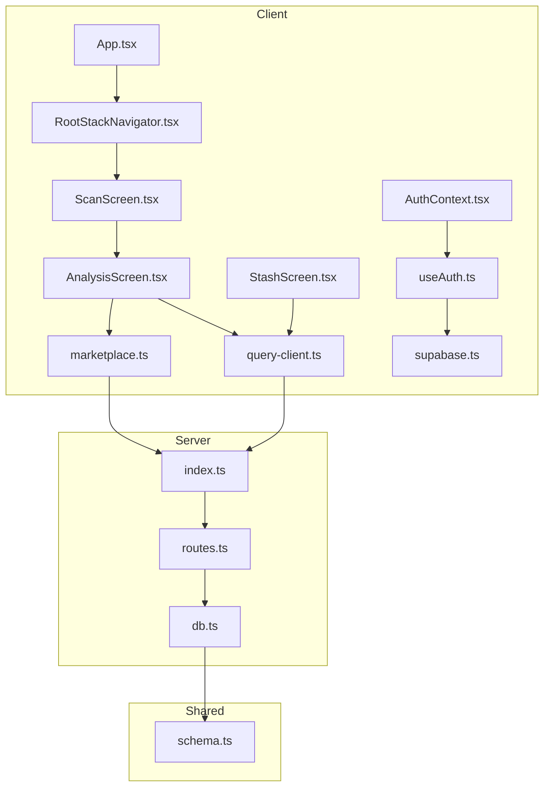
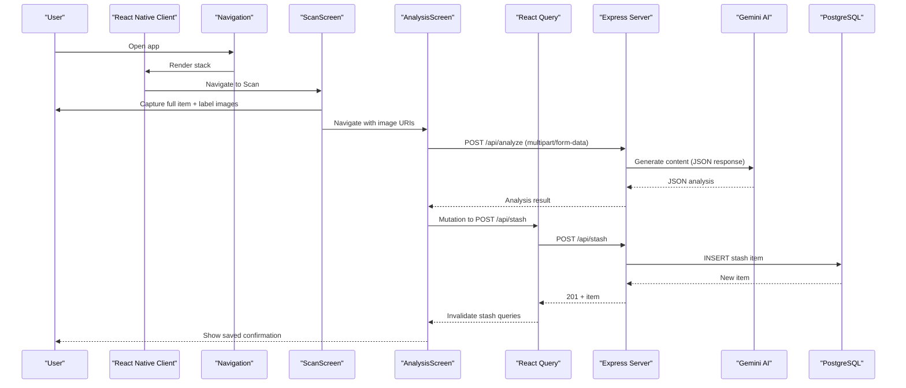
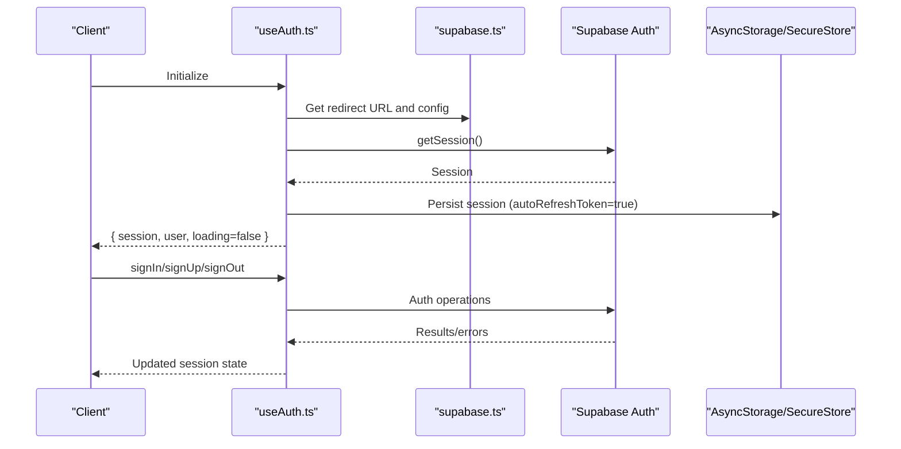
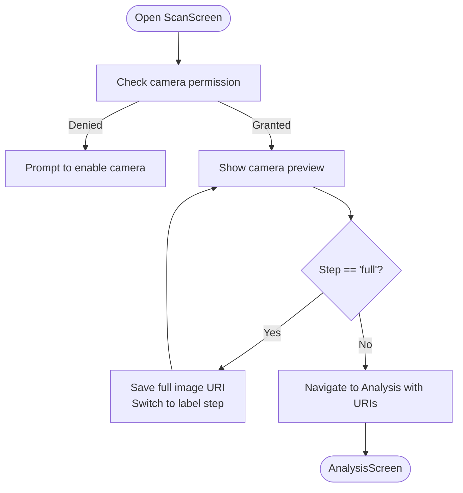
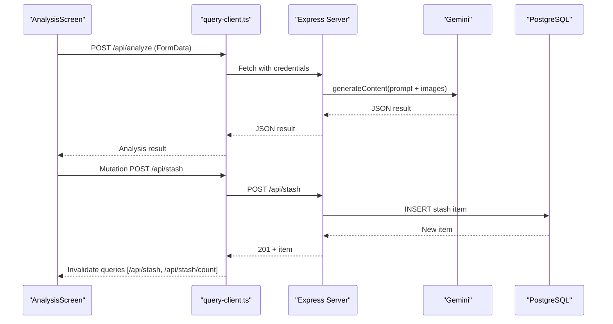
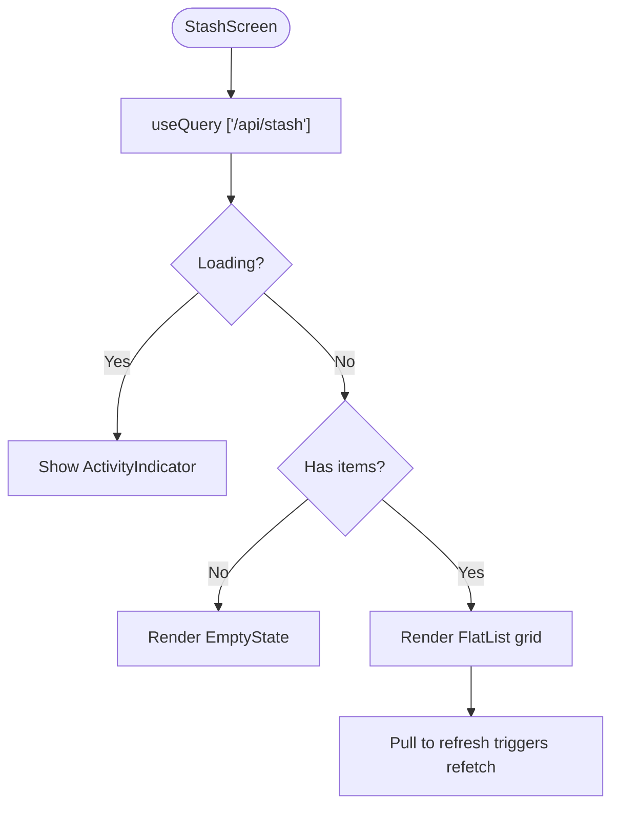
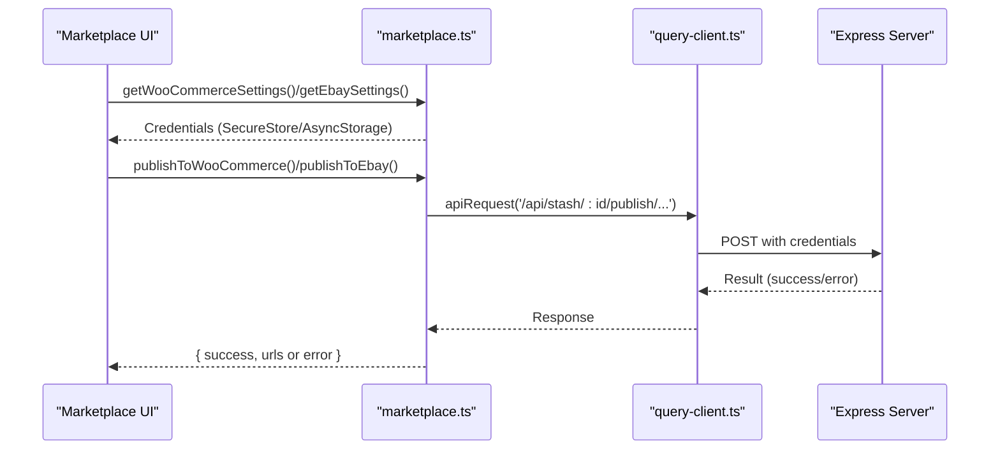
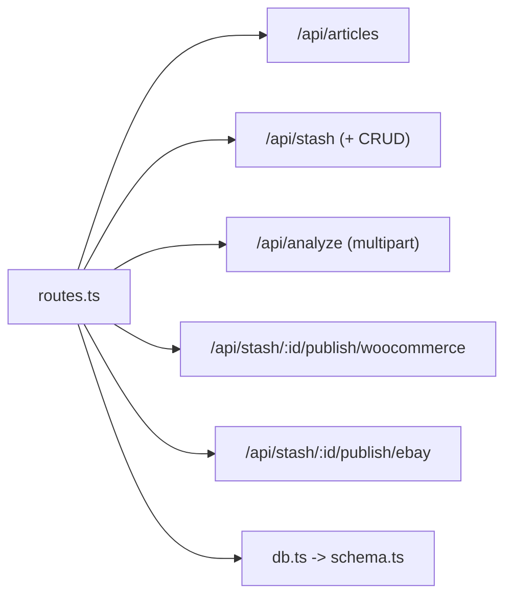
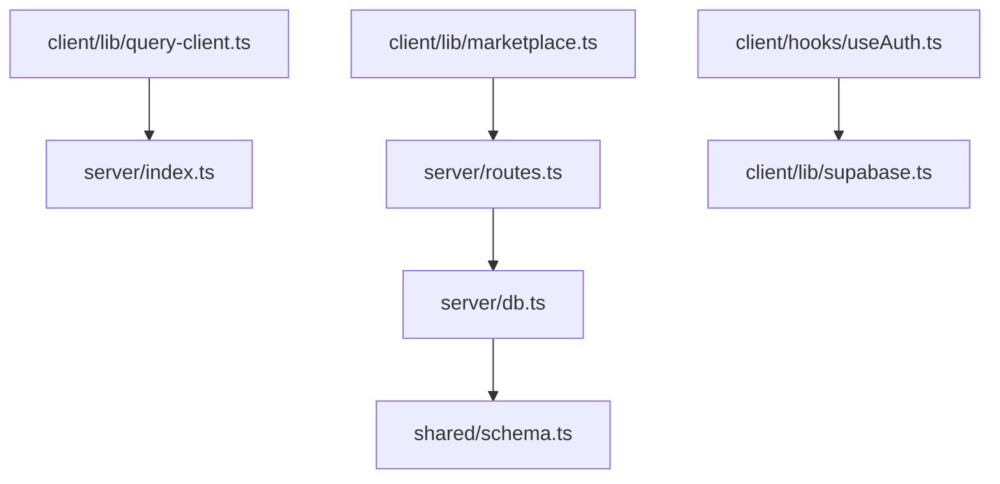

# Data Flow Patterns

<cite>
**Referenced Files in This Document**
- [App.tsx](file://client/App.tsx)
- [RootStackNavigator.tsx](file://client/navigation/RootStackNavigator.tsx)
- [ScanScreen.tsx](file://client/screens/ScanScreen.tsx)
- [AnalysisScreen.tsx](file://client/screens/AnalysisScreen.tsx)
- [StashScreen.tsx](file://client/screens/StashScreen.tsx)
- [AuthContext.tsx](file://client/contexts/AuthContext.tsx)
- [useAuth.ts](file://client/hooks/useAuth.ts)
- [supabase.ts](file://client/lib/supabase.ts)
- [query-client.ts](file://client/lib/query-client.ts)
- [marketplace.ts](file://client/lib/marketplace.ts)
- [index.ts](file://server/index.ts)
- [routes.ts](file://server/routes.ts)
- [db.ts](file://server/db.ts)
- [schema.ts](file://shared/schema.ts)
</cite>

## Table of Contents
1. [Introduction](#introduction)
2. [Project Structure](#project-structure)
3. [Core Components](#core-components)
4. [Architecture Overview](#architecture-overview)
5. [Detailed Component Analysis](#detailed-component-analysis)
6. [Dependency Analysis](#dependency-analysis)
7. [Performance Considerations](#performance-considerations)
8. [Troubleshooting Guide](#troubleshooting-guide)
9. [Conclusion](#conclusion)

## Introduction
This document explains the end-to-end data flow in Hidden-Gem, from mobile camera capture through image processing and AI analysis, to database storage and marketplace publishing. It also covers request-response patterns, authentication and session management, API key handling, data validation, React Query state management, error propagation, loading states, offline-first strategies, and synchronization mechanisms.

## Project Structure
The application follows a clear separation of concerns:
- Client (React Native) handles UI, navigation, authentication, local caching via React Query, and marketplace integrations.
- Server (Express) exposes REST endpoints for articles, stash items, AI analysis, and marketplace publishing.
- Shared schema defines database models used by both client and server.
- Supabase manages authentication and session persistence.

**Diagram sources**
- [App.tsx](file://client/App.tsx#L30-L49)
- [RootStackNavigator.tsx](file://client/navigation/RootStackNavigator.tsx#L32-L122)
- [ScanScreen.tsx](file://client/screens/ScanScreen.tsx#L17-L217)
- [AnalysisScreen.tsx](file://client/screens/AnalysisScreen.tsx#L29-L261)
- [StashScreen.tsx](file://client/screens/StashScreen.tsx#L93-L162)
- [AuthContext.tsx](file://client/contexts/AuthContext.tsx#L19-L30)
- [useAuth.ts](file://client/hooks/useAuth.ts#L12-L150)
- [supabase.ts](file://client/lib/supabase.ts#L20-L38)
- [query-client.ts](file://client/lib/query-client.ts#L7-L79)
- [marketplace.ts](file://client/lib/marketplace.ts#L81-L128)
- [index.ts](file://server/index.ts#L224-L246)
- [routes.ts](file://server/routes.ts#L24-L492)
- [db.ts](file://server/db.ts#L1-L19)
- [schema.ts](file://shared/schema.ts#L1-L122)

**Section sources**
- [App.tsx](file://client/App.tsx#L30-L49)
- [RootStackNavigator.tsx](file://client/navigation/RootStackNavigator.tsx#L32-L122)
- [index.ts](file://server/index.ts#L224-L246)

## Core Components
- Authentication and session management via Supabase with persistent sessions and OAuth support.
- React Query for caching, synchronization, and optimistic updates.
- Marketplace integrations for WooCommerce and eBay using secure local storage for credentials.
- Server-side AI analysis powered by Gemini and marketplace APIs for publishing.

Key responsibilities:
- Client initialization and theme wiring.
- Navigation and conditional auth gating.
- Camera capture and image selection.
- AI-powered analysis and saving results to stash.
- Listing publication to marketplaces.
- Database access via Drizzle ORM.

**Section sources**
- [supabase.ts](file://client/lib/supabase.ts#L20-L38)
- [useAuth.ts](file://client/hooks/useAuth.ts#L12-L150)
- [query-client.ts](file://client/lib/query-client.ts#L66-L79)
- [marketplace.ts](file://client/lib/marketplace.ts#L19-L79)
- [routes.ts](file://server/routes.ts#L11-L17)

## Architecture Overview
The system uses a client-server architecture with a React Native client and an Express server. The client authenticates users, captures images, sends them to the server for AI analysis, persists results to the database, and publishes listings to external marketplaces.

**Diagram sources**
- [RootStackNavigator.tsx](file://client/navigation/RootStackNavigator.tsx#L49-L83)
- [ScanScreen.tsx](file://client/screens/ScanScreen.tsx#L26-L62)
- [AnalysisScreen.tsx](file://client/screens/AnalysisScreen.tsx#L62-L112)
- [routes.ts](file://server/routes.ts#L140-L226)
- [db.ts](file://server/db.ts#L1-L19)

## Detailed Component Analysis

### Authentication and Session Management
- Supabase client is initialized with environment variables and platform-specific storage.
- Persistent sessions are enabled; OAuth flows support browser redirects and token exchange.
- Auth context exposes session, user, loading state, and sign-in/sign-out helpers.

**Diagram sources**
- [useAuth.ts](file://client/hooks/useAuth.ts#L17-L38)
- [supabase.ts](file://client/lib/supabase.ts#L20-L38)
- [AuthContext.tsx](file://client/contexts/AuthContext.tsx#L19-L30)

**Section sources**
- [supabase.ts](file://client/lib/supabase.ts#L20-L38)
- [useAuth.ts](file://client/hooks/useAuth.ts#L12-L150)
- [AuthContext.tsx](file://client/contexts/AuthContext.tsx#L19-L30)

### Camera Capture and Image Selection
- Uses camera permissions and device camera/image picker.
- Two-step capture: full item image followed by label close-up.
- Navigates to Analysis screen with both URIs.

**Diagram sources**
- [ScanScreen.tsx](file://client/screens/ScanScreen.tsx#L26-L93)

**Section sources**
- [ScanScreen.tsx](file://client/screens/ScanScreen.tsx#L17-L217)

### AI Analysis Pipeline
- Sends both images as multipart/form-data to /api/analyze.
- Server constructs a Gemini prompt with both images and expects structured JSON.
- On success, displays analysis results; on failure, shows retry option.
- Saves the analyzed item to stash via a mutation that invalidates related queries.

**Diagram sources**
- [AnalysisScreen.tsx](file://client/screens/AnalysisScreen.tsx#L62-L122)
- [query-client.ts](file://client/lib/query-client.ts#L26-L43)
- [routes.ts](file://server/routes.ts#L140-L226)
- [db.ts](file://server/db.ts#L1-L19)

**Section sources**
- [AnalysisScreen.tsx](file://client/screens/AnalysisScreen.tsx#L29-L261)
- [routes.ts](file://server/routes.ts#L140-L226)

### Stash Data Management with React Query
- Queries stash items and count using query keys aligned with server routes.
- Uses a custom query function that attaches cookies for authenticated requests.
- Provides pull-to-refresh and loading states; empty-state rendering.

**Diagram sources**
- [StashScreen.tsx](file://client/screens/StashScreen.tsx#L98-L162)
- [query-client.ts](file://client/lib/query-client.ts#L46-L64)

**Section sources**
- [StashScreen.tsx](file://client/screens/StashScreen.tsx#L93-L162)
- [query-client.ts](file://client/lib/query-client.ts#L46-L79)

### Marketplace Publishing
- Retrieves marketplace credentials from secure storage (per platform).
- Publishes to WooCommerce and eBay via dedicated endpoints.
- Handles errors and returns user-friendly messages.

**Diagram sources**
- [marketplace.ts](file://client/lib/marketplace.ts#L19-L128)
- [query-client.ts](file://client/lib/query-client.ts#L26-L43)
- [routes.ts](file://server/routes.ts#L228-L488)

**Section sources**
- [marketplace.ts](file://client/lib/marketplace.ts#L19-L128)
- [routes.ts](file://server/routes.ts#L228-L488)

### Server Routing and Data Persistence
- Registers routes for articles, stash CRUD, AI analysis, and marketplace publishing.
- Uses Drizzle ORM with PostgreSQL; enforces strict schemas.
- Implements CORS, logging, and error handling middleware.

**Diagram sources**
- [routes.ts](file://server/routes.ts#L24-L492)
- [db.ts](file://server/db.ts#L1-L19)
- [schema.ts](file://shared/schema.ts#L29-L50)

**Section sources**
- [routes.ts](file://server/routes.ts#L24-L492)
- [db.ts](file://server/db.ts#L1-L19)
- [schema.ts](file://shared/schema.ts#L29-L50)

## Dependency Analysis
- Client depends on Supabase for auth, React Query for caching, and marketplace utilities for secure credential retrieval.
- Server depends on Drizzle ORM, PostgreSQL, and external marketplace APIs.
- Routes depend on schema definitions for data modeling.

**Diagram sources**
- [query-client.ts](file://client/lib/query-client.ts#L7-L17)
- [marketplace.ts](file://client/lib/marketplace.ts#L81-L128)
- [routes.ts](file://server/routes.ts#L24-L492)
- [db.ts](file://server/db.ts#L1-L19)
- [schema.ts](file://shared/schema.ts#L1-L122)

**Section sources**
- [query-client.ts](file://client/lib/query-client.ts#L7-L17)
- [routes.ts](file://server/routes.ts#L24-L492)
- [db.ts](file://server/db.ts#L1-L19)
- [schema.ts](file://shared/schema.ts#L1-L122)

## Performance Considerations
- React Query defaults disable automatic refetch on focus and retries, reducing network overhead.
- Stale-time is set to Infinity for queries, minimizing redundant fetches.
- API requests include credentials for authenticated endpoints.
- Image uploads use FormData with memory-based storage; consider streaming for very large files.
- Server-side rate-limiting and prompt validation reduce unnecessary AI calls.

[No sources needed since this section provides general guidance]

## Troubleshooting Guide
Common issues and resolutions:
- Supabase credentials missing: Ensure environment variables are set; client warns when not configured.
- Authentication failures: Verify OAuth redirect URLs and session persistence settings.
- API domain not set: EXPO_PUBLIC_DOMAIN must be defined for client API requests.
- AI analysis errors: Server falls back to default structured response if parsing fails.
- Marketplace publishing errors: Server validates credentials and returns detailed error messages.

**Section sources**
- [supabase.ts](file://client/lib/supabase.ts#L20-L24)
- [query-client.ts](file://client/lib/query-client.ts#L7-L17)
- [routes.ts](file://server/routes.ts#L206-L226)
- [routes.ts](file://server/routes.ts#L228-L488)

## Conclusion
Hidden-Gem implements a robust data flow from device capture to AI analysis and marketplace publishing. Authentication is handled securely with Supabase, state is managed efficiently with React Query, and server routes provide clear endpoints for all operations. The design supports offline-first principles via cached queries and secure local storage for marketplace credentials, while maintaining strong error handling and user feedback.