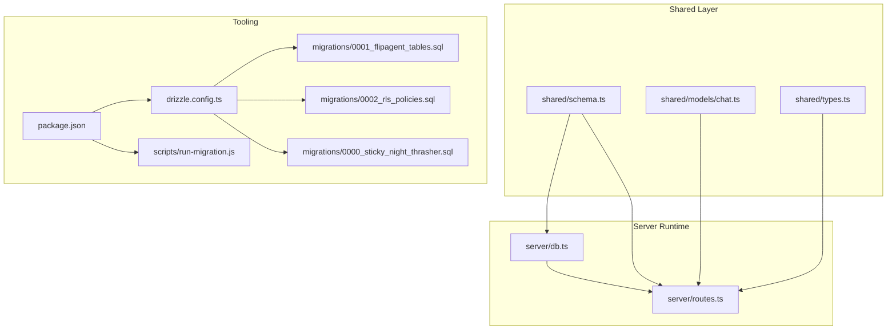
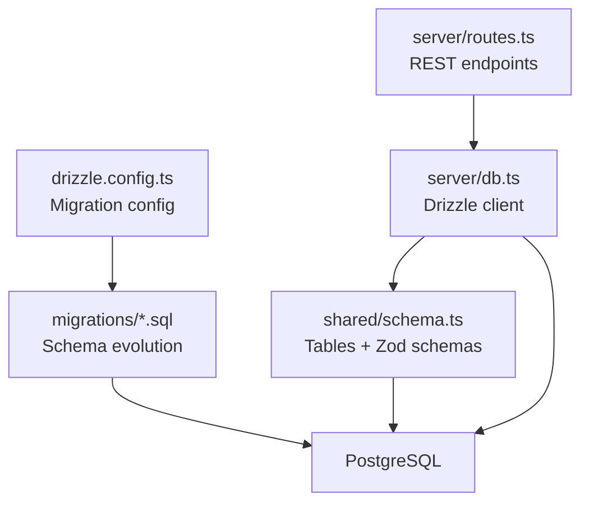
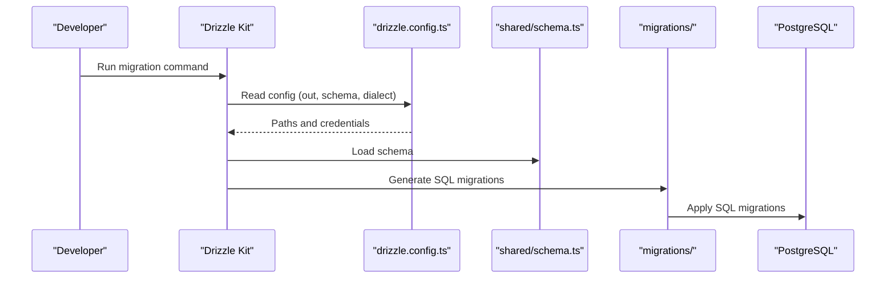
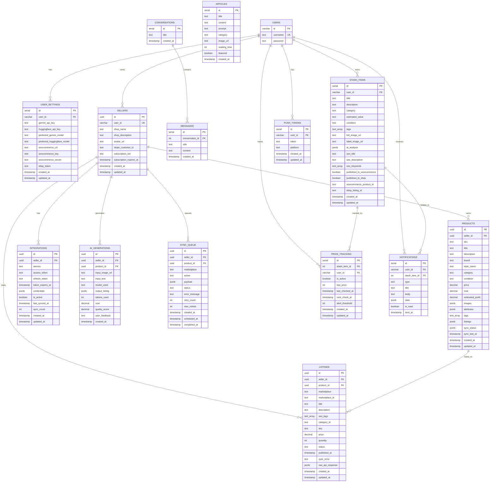
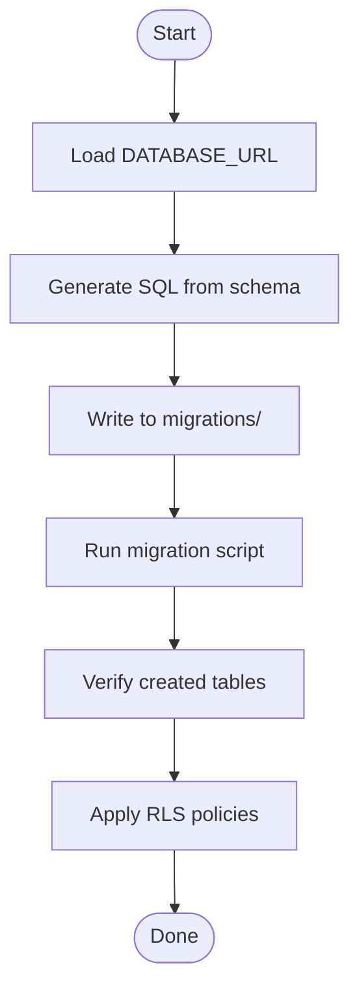
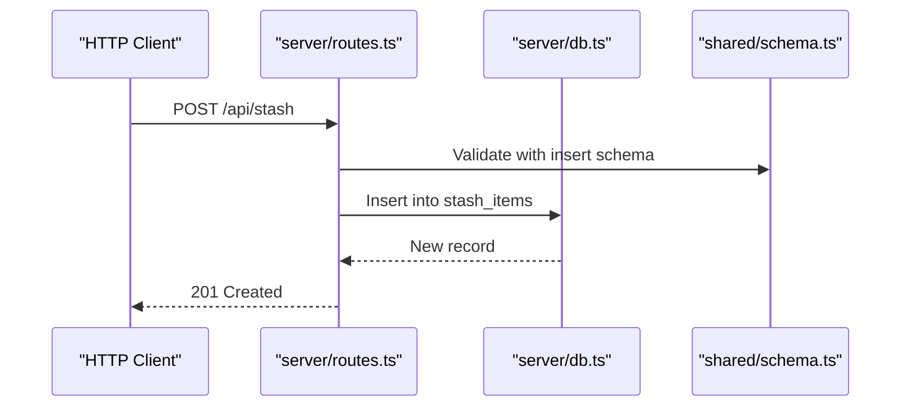
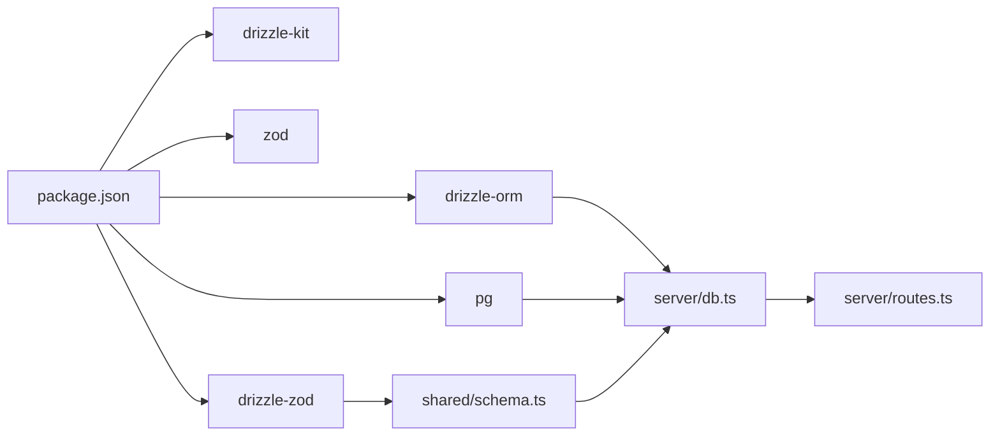

# Data Layer Design

<cite>
**Referenced Files in This Document**
- [drizzle.config.ts](file://drizzle.config.ts)
- [shared/schema.ts](file://shared/schema.ts)
- [server/db.ts](file://server/db.ts)
- [migrations/0000_sticky_night_thrasher.sql](file://migrations/0000_sticky_night_thrasher.sql)
- [migrations/0001_flipagent_tables.sql](file://migrations/0001_flipagent_tables.sql)
- [migrations/0002_rls_policies.sql](file://migrations/0002_rls_policies.sql)
- [scripts/run-migration.js](file://scripts/run-migration.js)
- [server/routes.ts](file://server/routes.ts)
- [shared/models/chat.ts](file://shared/models/chat.ts)
- [shared/types.ts](file://shared/types.ts)
- [package.json](file://package.json)
</cite>

## Table of Contents
1. [Introduction](#introduction)
2. [Project Structure](#project-structure)
3. [Core Components](#core-components)
4. [Architecture Overview](#architecture-overview)
5. [Detailed Component Analysis](#detailed-component-analysis)
6. [Dependency Analysis](#dependency-analysis)
7. [Performance Considerations](#performance-considerations)
8. [Troubleshooting Guide](#troubleshooting-guide)
9. [Conclusion](#conclusion)
10. [Appendices](#appendices)

## Introduction
This document describes the data layer architecture for Hidden-Gem’s PostgreSQL-backed backend. It covers Drizzle ORM configuration and integration, the shared schema design and entity relationships, the migration strategy and deployment automation, the repository pattern for database operations, and operational considerations such as data integrity, indexing, transactions, and separation of concerns between shared models and database-specific implementations.

## Project Structure
The data layer is organized around a shared schema module consumed by the server runtime and managed via Drizzle migrations. The server exposes REST endpoints that operate on the schema-defined tables through Drizzle ORM.

**Diagram sources**
- [drizzle.config.ts](file://drizzle.config.ts#L1-L19)
- [shared/schema.ts](file://shared/schema.ts#L1-L344)
- [shared/models/chat.ts](file://shared/models/chat.ts#L1-L35)
- [shared/types.ts](file://shared/types.ts#L1-L116)
- [server/db.ts](file://server/db.ts#L1-L19)
- [server/routes.ts](file://server/routes.ts#L1-L400)
- [migrations/0000_sticky_night_thrasher.sql](file://migrations/0000_sticky_night_thrasher.sql#L1-L82)
- [migrations/0001_flipagent_tables.sql](file://migrations/0001_flipagent_tables.sql#L1-L117)
- [migrations/0002_rls_policies.sql](file://migrations/0002_rls_policies.sql#L1-L66)
- [scripts/run-migration.js](file://scripts/run-migration.js#L1-L34)
- [package.json](file://package.json#L1-L95)

**Section sources**
- [drizzle.config.ts](file://drizzle.config.ts#L1-L19)
- [shared/schema.ts](file://shared/schema.ts#L1-L344)
- [server/db.ts](file://server/db.ts#L1-L19)
- [migrations/0000_sticky_night_thrasher.sql](file://migrations/0000_sticky_night_thrasher.sql#L1-L82)
- [migrations/0001_flipagent_tables.sql](file://migrations/0001_flipagent_tables.sql#L1-L117)
- [migrations/0002_rls_policies.sql](file://migrations/0002_rls_policies.sql#L1-L66)
- [scripts/run-migration.js](file://scripts/run-migration.js#L1-L34)
- [package.json](file://package.json#L1-L95)

## Core Components
- Drizzle ORM configuration: Defines schema location, output directory for migrations, and database credentials.
- Shared schema: Centralized table definitions, constraints, indexes, and Zod insert schemas for validation.
- Server database client: Drizzle client configured with a PostgreSQL connection pool and schema namespace.
- Migration system: SQL-based migrations with Drizzle Kit and a manual runner script for targeted steps.
- Routes: Application endpoints that perform CRUD operations using Drizzle.

**Section sources**
- [drizzle.config.ts](file://drizzle.config.ts#L1-L19)
- [shared/schema.ts](file://shared/schema.ts#L1-L344)
- [server/db.ts](file://server/db.ts#L1-L19)
- [migrations/0001_flipagent_tables.sql](file://migrations/0001_flipagent_tables.sql#L1-L117)
- [migrations/0002_rls_policies.sql](file://migrations/0002_rls_policies.sql#L1-L66)
- [server/routes.ts](file://server/routes.ts#L216-L297)

## Architecture Overview
The data layer follows a layered approach:
- Shared schema defines entities and constraints.
- Drizzle ORM connects to PostgreSQL and exposes typed operations.
- Server routes orchestrate business logic and delegate persistence to Drizzle.
- Migrations evolve the schema while preserving data integrity.

**Diagram sources**
- [server/routes.ts](file://server/routes.ts#L1-L400)
- [server/db.ts](file://server/db.ts#L1-L19)
- [shared/schema.ts](file://shared/schema.ts#L1-L344)
- [drizzle.config.ts](file://drizzle.config.ts#L1-L19)
- [migrations/0001_flipagent_tables.sql](file://migrations/0001_flipagent_tables.sql#L1-L117)

## Detailed Component Analysis

### Drizzle ORM Configuration and Integration
- Drizzle Kit configuration specifies the migrations output directory and the schema module path. It reads DATABASE_URL from environment variables and sets the PostgreSQL dialect.
- The server database client initializes a PostgreSQL connection pool and wraps it with Drizzle, passing the shared schema to enable type-safe queries.
- Package scripts expose a command to push schema changes using Drizzle Kit.

**Diagram sources**
- [drizzle.config.ts](file://drizzle.config.ts#L1-L19)
- [shared/schema.ts](file://shared/schema.ts#L1-L344)
- [migrations/0001_flipagent_tables.sql](file://migrations/0001_flipagent_tables.sql#L1-L117)
- [migrations/0002_rls_policies.sql](file://migrations/0002_rls_policies.sql#L1-L66)

**Section sources**
- [drizzle.config.ts](file://drizzle.config.ts#L1-L19)
- [server/db.ts](file://server/db.ts#L1-L19)
- [package.json](file://package.json#L14-L14)

### Shared Schema Design and Entity Relationships
- Core entities include users, user settings, stash items, articles, conversations, and messages.
- FlipAgent domain extends the schema with sellers, products, listings, integrations, AI generations, and a sync queue.
- Constraints and indexes:
  - Primary keys and foreign keys enforce referential integrity.
  - Unique indexes on (seller_id, sku) and (seller_id, service) prevent duplicates.
  - Indexes on frequently filtered/sorted columns improve query performance.
- JSONB fields store semi-structured data for flexibility.
- Zod insert schemas derived from tables provide runtime validation for inserts.

**Diagram sources**
- [shared/schema.ts](file://shared/schema.ts#L6-L344)

**Section sources**
- [shared/schema.ts](file://shared/schema.ts#L1-L344)

### Migration Strategy and Deployment Automation
- Drizzle Kit generates SQL migrations from the shared schema. The configuration points to the schema module and output directory.
- Manual runner script applies a specific migration file and verifies created tables. This enables targeted deployments during development or CI steps.
- Row-Level Security policies are applied in a dedicated migration to constrain access to seller-owned rows.

**Diagram sources**
- [drizzle.config.ts](file://drizzle.config.ts#L1-L19)
- [scripts/run-migration.js](file://scripts/run-migration.js#L1-L34)
- [migrations/0001_flipagent_tables.sql](file://migrations/0001_flipagent_tables.sql#L1-L117)
- [migrations/0002_rls_policies.sql](file://migrations/0002_rls_policies.sql#L1-L66)

**Section sources**
- [drizzle.config.ts](file://drizzle.config.ts#L1-L19)
- [scripts/run-migration.js](file://scripts/run-migration.js#L1-L34)
- [migrations/0001_flipagent_tables.sql](file://migrations/0001_flipagent_tables.sql#L1-L117)
- [migrations/0002_rls_policies.sql](file://migrations/0002_rls_policies.sql#L1-L66)

### Repository Pattern and CRUD Operations
- The server routes encapsulate CRUD operations using Drizzle. They select, insert, update, and delete records across tables.
- Validation leverages Zod insert schemas derived from the shared schema to ensure data conforms to table definitions before persistence.
- Transactions are not explicitly used in the examined routes; however, Drizzle supports transaction blocks via the client for multi-statement atomicity.

**Diagram sources**
- [server/routes.ts](file://server/routes.ts#L258-L286)
- [shared/schema.ts](file://shared/schema.ts#L89-L93)
- [server/db.ts](file://server/db.ts#L1-L19)

**Section sources**
- [server/routes.ts](file://server/routes.ts#L216-L297)
- [shared/schema.ts](file://shared/schema.ts#L78-L108)

### Data Integrity Constraints, Indexing, and Performance
- Integrity:
  - Foreign keys cascade deletes to maintain referential integrity.
  - Unique indexes prevent duplicate combinations for seller+SKU and seller+service.
- Indexing:
  - Indexes on seller_id, (seller_id, sku), (seller_id, marketplace), status + scheduled_at, and (seller_id, created_at DESC) optimize common filters and sorts.
- JSONB fields:
  - Used for flexible attributes, listings, and metadata; consider selective parsing and validation in application logic.
- Row-Level Security:
  - Policies restrict visibility and modification to rows owned by the authenticated user, enforced at the database level.

**Section sources**
- [shared/schema.ts](file://shared/schema.ts#L149-L151)
- [shared/schema.ts](file://shared/schema.ts#L218-L220)
- [migrations/0001_flipagent_tables.sql](file://migrations/0001_flipagent_tables.sql#L110-L117)
- [migrations/0002_rls_policies.sql](file://migrations/0002_rls_policies.sql#L1-L66)

### Separation of Concerns: Shared Models vs Database Implementations
- Shared schema and types:
  - Define canonical entity shapes and database constraints.
  - Provide Zod insert schemas for validation.
- Database-specific implementations:
  - Drizzle table definitions and indexes live in the shared schema.
  - Server routes and the database client consume the shared schema to perform operations.
- Chat domain reuse:
  - A separate chat model file demonstrates how shared schema can be extended for domain-specific needs while keeping the core consistent.

**Section sources**
- [shared/schema.ts](file://shared/schema.ts#L1-L344)
- [shared/models/chat.ts](file://shared/models/chat.ts#L1-L35)
- [shared/types.ts](file://shared/types.ts#L1-L116)

## Dependency Analysis
- Drizzle ORM and drizzle-orm/node-postgres power the database client.
- Drizzle Kit generates migrations from the shared schema.
- Express routes depend on the database client and shared schema.
- Zod and drizzle-zod provide schema-driven validation.

**Diagram sources**
- [package.json](file://package.json#L24-L76)
- [server/db.ts](file://server/db.ts#L1-L19)
- [shared/schema.ts](file://shared/schema.ts#L1-L344)
- [server/routes.ts](file://server/routes.ts#L1-L400)

**Section sources**
- [package.json](file://package.json#L24-L76)
- [server/db.ts](file://server/db.ts#L1-L19)
- [shared/schema.ts](file://shared/schema.ts#L1-L344)

## Performance Considerations
- Prefer indexed columns for joins and filters (e.g., seller_id, (seller_id, sku)).
- Use RETURNING clauses to minimize round-trips when inserting/updating.
- Avoid N+1 selects by batching queries or using joins where appropriate.
- Consider partitioning or materialized views for high-cardinality analytics workloads.
- Monitor slow queries and add targeted indexes based on query patterns.

## Troubleshooting Guide
- Missing DATABASE_URL:
  - Drizzle Kit and the server client both validate the presence of DATABASE_URL and throw errors if missing.
- Migration failures:
  - Use the manual runner script to apply specific migrations and verify created tables.
- Validation errors:
  - Ensure payloads conform to Zod insert schemas derived from the shared schema.
- Access control:
  - RLS policies restrict rows to owners; confirm authentication and policy enforcement.

**Section sources**
- [drizzle.config.ts](file://drizzle.config.ts#L7-L9)
- [server/db.ts](file://server/db.ts#L7-L9)
- [scripts/run-migration.js](file://scripts/run-migration.js#L5-L28)
- [shared/schema.ts](file://shared/schema.ts#L78-L108)
- [migrations/0002_rls_policies.sql](file://migrations/0002_rls_policies.sql#L1-L66)

## Conclusion
Hidden-Gem’s data layer centers on a shared schema that drives both application logic and migrations. Drizzle ORM provides a type-safe, efficient abstraction over PostgreSQL, while migrations and RLS policies ensure schema evolution and data isolation. The server routes demonstrate a clear repository-like pattern for CRUD operations, with validation grounded in shared Zod schemas. The architecture balances separation of concerns, performance, and operational safety.

## Appendices
- Environment variables:
  - DATABASE_URL is required for both Drizzle Kit and the server database client.
- Commands:
  - Use the package script to push schema changes to the database.

**Section sources**
- [drizzle.config.ts](file://drizzle.config.ts#L7-L9)
- [server/db.ts](file://server/db.ts#L7-L9)
- [package.json](file://package.json#L14-L14)