# Design Patterns

<cite>
**Referenced Files in This Document**
- [App.tsx](file://client/App.tsx)
- [AuthContext.tsx](file://client/contexts/AuthContext.tsx)
- [useAuth.ts](file://client/hooks/useAuth.ts)
- [supabase.ts](file://client/lib/supabase.ts)
- [theme.ts](file://client/constants/theme.ts)
- [useTheme.ts](file://client/hooks/useTheme.ts)
- [Button.tsx](file://client/components/Button.tsx)
- [Card.tsx](file://client/components/Card.tsx)
- [RootStackNavigator.tsx](file://client/navigation/RootStackNavigator.tsx)
- [MainTabNavigator.tsx](file://client/navigation/MainTabNavigator.tsx)
- [HomeStackNavigator.tsx](file://client/navigation/HomeStackNavigator.tsx)
- [query-client.ts](file://client/lib/query-client.ts)
- [routes.ts](file://server/routes.ts)
- [db.ts](file://server/db.ts)
</cite>

## Table of Contents
1. [Introduction](#introduction)
2. [Project Structure](#project-structure)
3. [Core Components](#core-components)
4. [Architecture Overview](#architecture-overview)
5. [Detailed Component Analysis](#detailed-component-analysis)
6. [Dependency Analysis](#dependency-analysis)
7. [Performance Considerations](#performance-considerations)
8. [Troubleshooting Guide](#troubleshooting-guide)
9. [Conclusion](#conclusion)

## Introduction
This document explains the design patterns implemented across the Hidden-Gem application. It focuses on:
- Provider pattern for authentication and theme management
- Repository pattern for database operations abstraction
- Factory pattern for dynamic route registration
- Component-based architecture with reusable UI components
- Observer pattern for state management and event handling
- Strategy pattern for AI model integration and marketplace platform support
- Singleton pattern for database connections and API clients
- Adapter pattern for external service integrations
- Template Method pattern for standardized workflows

Where applicable, we provide code snippet paths to the relevant implementation and explain the benefits within the application context.

## Project Structure
The application follows a clear separation of concerns:
- Client-side React Native application under client/
- Server-side Express application under server/
- Shared resources under shared/

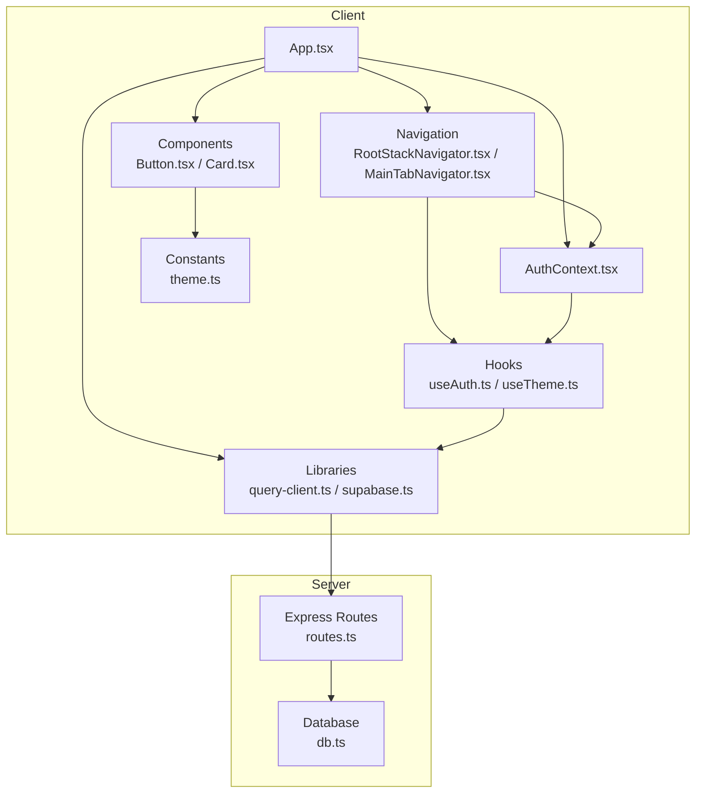

**Diagram sources**
- [App.tsx](file://client/App.tsx#L30-L49)
- [RootStackNavigator.tsx](file://client/navigation/RootStackNavigator.tsx#L32-L122)
- [MainTabNavigator.tsx](file://client/navigation/MainTabNavigator.tsx#L64-L143)
- [AuthContext.tsx](file://client/contexts/AuthContext.tsx#L19-L30)
- [useAuth.ts](file://client/hooks/useAuth.ts#L12-L150)
- [query-client.ts](file://client/lib/query-client.ts#L66-L79)
- [supabase.ts](file://client/lib/supabase.ts#L18-L38)
- [Button.tsx](file://client/components/Button.tsx#L31-L80)
- [Card.tsx](file://client/components/Card.tsx#L49-L100)
- [theme.ts](file://client/constants/theme.ts#L3-L40)
- [routes.ts](file://server/routes.ts#L24-L492)
- [db.ts](file://server/db.ts#L1-L19)

**Section sources**
- [App.tsx](file://client/App.tsx#L1-L57)
- [RootStackNavigator.tsx](file://client/navigation/RootStackNavigator.tsx#L1-L124)
- [MainTabNavigator.tsx](file://client/navigation/MainTabNavigator.tsx#L1-L192)
- [AuthContext.tsx](file://client/contexts/AuthContext.tsx#L1-L31)
- [useAuth.ts](file://client/hooks/useAuth.ts#L1-L151)
- [query-client.ts](file://client/lib/query-client.ts#L1-L80)
- [supabase.ts](file://client/lib/supabase.ts#L1-L39)
- [Button.tsx](file://client/components/Button.tsx#L1-L93)
- [Card.tsx](file://client/components/Card.tsx#L1-L115)
- [theme.ts](file://client/constants/theme.ts#L1-L167)
- [routes.ts](file://server/routes.ts#L1-L493)
- [db.ts](file://server/db.ts#L1-L19)

## Core Components
- Authentication Provider and Hook: Centralized auth state and actions via a Provider and a custom hook.
- Theme Provider and Hook: Unified theme selection and dark/light mode handling.
- UI Components: Reusable Button and Card with animated interactions and theme-aware styling.
- Navigation: Dynamic stack/tab navigation with conditional rendering based on auth state.
- Data Access Layer: React Query client and API helpers for server communication.
- Database Abstraction: Drizzle ORM with a single connection pool.
- Marketplace Publishing: Strategy-like endpoints for publishing to different platforms.
- AI Integration: Template-like workflow for image-based analysis using a hosted AI model.

**Section sources**
- [AuthContext.tsx](file://client/contexts/AuthContext.tsx#L19-L30)
- [useAuth.ts](file://client/hooks/useAuth.ts#L12-L150)
- [useTheme.ts](file://client/hooks/useTheme.ts#L4-L13)
- [theme.ts](file://client/constants/theme.ts#L3-L40)
- [Button.tsx](file://client/components/Button.tsx#L31-L80)
- [Card.tsx](file://client/components/Card.tsx#L49-L100)
- [RootStackNavigator.tsx](file://client/navigation/RootStackNavigator.tsx#L32-L122)
- [query-client.ts](file://client/lib/query-client.ts#L66-L79)
- [db.ts](file://server/db.ts#L1-L19)
- [routes.ts](file://server/routes.ts#L228-L488)

## Architecture Overview
The system uses a layered architecture:
- Presentation layer: React Native UI and navigation
- Domain layer: Hooks and Providers encapsulate business logic
- Data access layer: React Query and API helpers
- Persistence layer: Drizzle ORM with PostgreSQL
- External services: AI model and marketplace APIs

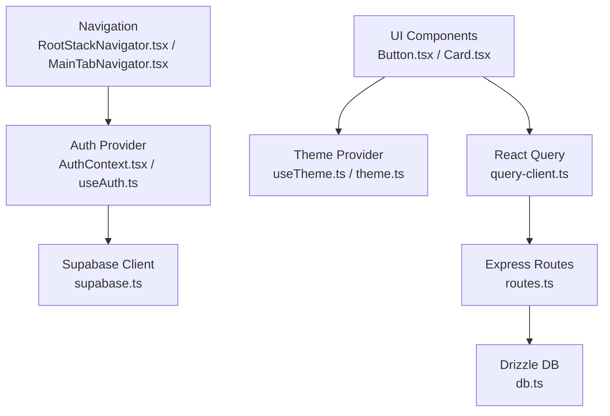

**Diagram sources**
- [Button.tsx](file://client/components/Button.tsx#L31-L80)
- [Card.tsx](file://client/components/Card.tsx#L49-L100)
- [RootStackNavigator.tsx](file://client/navigation/RootStackNavigator.tsx#L32-L122)
- [MainTabNavigator.tsx](file://client/navigation/MainTabNavigator.tsx#L64-L143)
- [AuthContext.tsx](file://client/contexts/AuthContext.tsx#L19-L30)
- [useAuth.ts](file://client/hooks/useAuth.ts#L12-L150)
- [useTheme.ts](file://client/hooks/useTheme.ts#L4-L13)
- [theme.ts](file://client/constants/theme.ts#L3-L40)
- [query-client.ts](file://client/lib/query-client.ts#L66-L79)
- [supabase.ts](file://client/lib/supabase.ts#L18-L38)
- [routes.ts](file://server/routes.ts#L24-L492)
- [db.ts](file://server/db.ts#L1-L19)

## Detailed Component Analysis

### Provider Pattern: Authentication and Theme Management
- Authentication Provider: Wraps the app with an AuthProvider that exposes session, user, and auth actions via a context.
- Theme Provider: Provides theme and dark mode state derived from system preferences.
- Benefits: Centralized state, easy testing, and predictable updates across components.

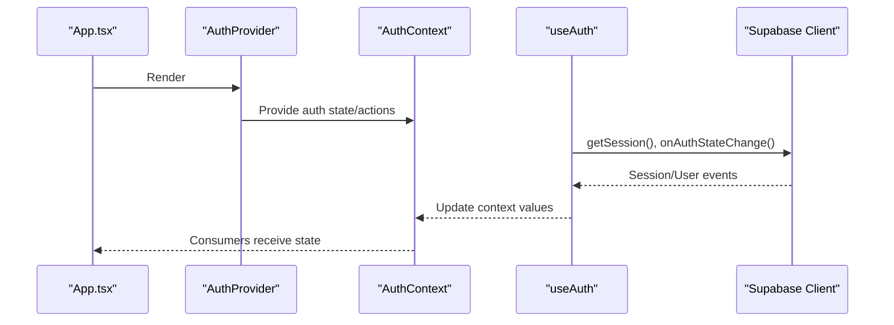

**Diagram sources**
- [App.tsx](file://client/App.tsx#L34-L45)
- [AuthContext.tsx](file://client/contexts/AuthContext.tsx#L19-L30)
- [useAuth.ts](file://client/hooks/useAuth.ts#L17-L38)
- [supabase.ts](file://client/lib/supabase.ts#L18-L38)

Implementation highlights:
- Provider composition in the app shell: [App.tsx](file://client/App.tsx#L34-L45)
- Auth provider and context contract: [AuthContext.tsx](file://client/contexts/AuthContext.tsx#L19-L30)
- Hook orchestrating Supabase auth and subscriptions: [useAuth.ts](file://client/hooks/useAuth.ts#L12-L150)
- Supabase client singleton creation: [supabase.ts](file://client/lib/supabase.ts#L18-L38)
- Theme provider and theme constants: [useTheme.ts](file://client/hooks/useTheme.ts#L4-L13), [theme.ts](file://client/constants/theme.ts#L3-L40)

**Section sources**
- [App.tsx](file://client/App.tsx#L34-L45)
- [AuthContext.tsx](file://client/contexts/AuthContext.tsx#L19-L30)
- [useAuth.ts](file://client/hooks/useAuth.ts#L12-L150)
- [supabase.ts](file://client/lib/supabase.ts#L18-L38)
- [useTheme.ts](file://client/hooks/useTheme.ts#L4-L13)
- [theme.ts](file://client/constants/theme.ts#L3-L40)

### Repository Pattern: Database Operations Abstraction
- The server uses Drizzle ORM to abstract database operations behind a clean API.
- Single connection pool ensures efficient resource usage.
- Benefits: Testability, maintainability, and portability across SQL databases.

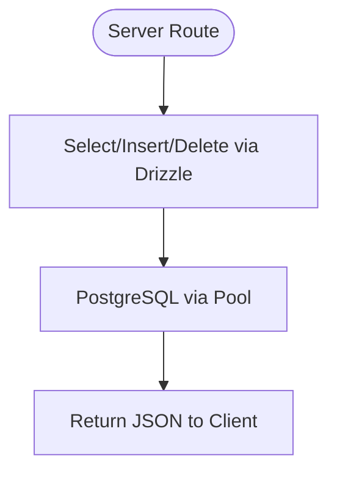

**Diagram sources**
- [routes.ts](file://server/routes.ts#L24-L492)
- [db.ts](file://server/db.ts#L1-L19)

Implementation highlights:
- Drizzle initialization with a pooled connection: [db.ts](file://server/db.ts#L11-L18)
- Example repository-style operations: [routes.ts](file://server/routes.ts#L25-L138)

**Section sources**
- [routes.ts](file://server/routes.ts#L24-L138)
- [db.ts](file://server/db.ts#L1-L19)

### Factory Pattern: Dynamic Route Registration
- The server registers routes dynamically by passing an Express app instance to a factory function.
- Benefits: Centralized route definition, testability, and modularity.

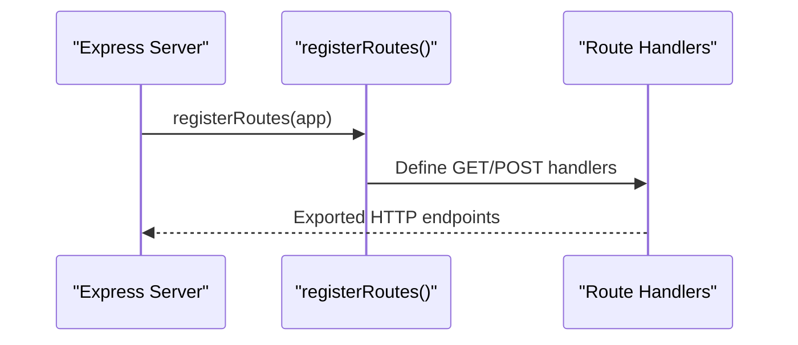

**Diagram sources**
- [routes.ts](file://server/routes.ts#L24-L492)

Implementation highlights:
- Route registration factory: [routes.ts](file://server/routes.ts#L24-L492)

**Section sources**
- [routes.ts](file://server/routes.ts#L24-L492)

### Component-Based Architecture: Reusable UI Components
- Button and Card components encapsulate styling, animations, and interactivity.
- They consume theme values and expose a consistent API.
- Benefits: Consistency, reusability, and simplified customization.

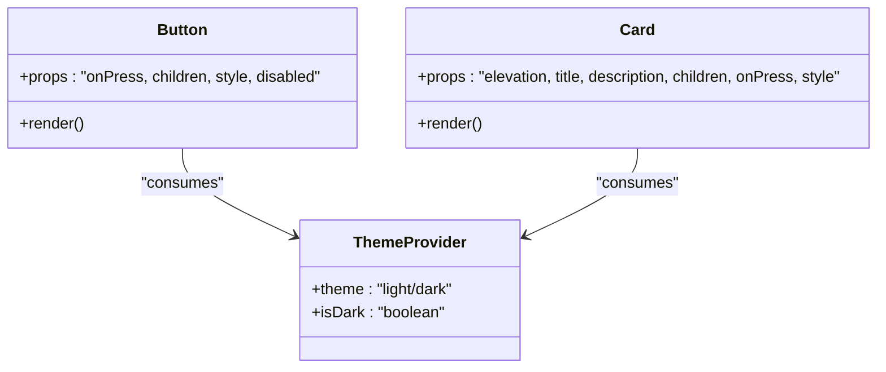

**Diagram sources**
- [Button.tsx](file://client/components/Button.tsx#L31-L80)
- [Card.tsx](file://client/components/Card.tsx#L49-L100)
- [useTheme.ts](file://client/hooks/useTheme.ts#L4-L13)
- [theme.ts](file://client/constants/theme.ts#L3-L40)

Implementation highlights:
- Button component with animated press feedback: [Button.tsx](file://client/components/Button.tsx#L31-L80)
- Card component with elevation-based backgrounds: [Card.tsx](file://client/components/Card.tsx#L49-L100)
- Theme provider and constants: [useTheme.ts](file://client/hooks/useTheme.ts#L4-L13), [theme.ts](file://client/constants/theme.ts#L3-L40)

**Section sources**
- [Button.tsx](file://client/components/Button.tsx#L31-L80)
- [Card.tsx](file://client/components/Card.tsx#L49-L100)
- [useTheme.ts](file://client/hooks/useTheme.ts#L4-L13)
- [theme.ts](file://client/constants/theme.ts#L3-L40)

### Observer Pattern: State Management and Event Handling
- Auth state changes are observed via Supabase’s onAuthStateChange listener.
- Navigation adapts to authentication state and loading conditions.
- Benefits: Reactive UI updates and centralized event handling.

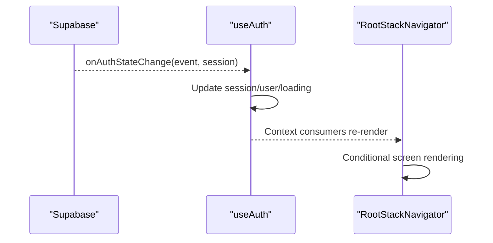

**Diagram sources**
- [useAuth.ts](file://client/hooks/useAuth.ts#L31-L37)
- [RootStackNavigator.tsx](file://client/navigation/RootStackNavigator.tsx#L34-L40)

Implementation highlights:
- Auth subscription and state updates: [useAuth.ts](file://client/hooks/useAuth.ts#L17-L38)
- Conditional navigation based on auth state: [RootStackNavigator.tsx](file://client/navigation/RootStackNavigator.tsx#L34-L40)

**Section sources**
- [useAuth.ts](file://client/hooks/useAuth.ts#L17-L38)
- [RootStackNavigator.tsx](file://client/navigation/RootStackNavigator.tsx#L34-L40)

### Strategy Pattern: AI Model Integration and Marketplace Platform Support
- AI analysis endpoint uses a hosted model with a fixed prompt template.
- Publishing endpoints implement platform-specific strategies (WooCommerce vs eBay).
- Benefits: Pluggable integrations, consistent interfaces, and easy extension.

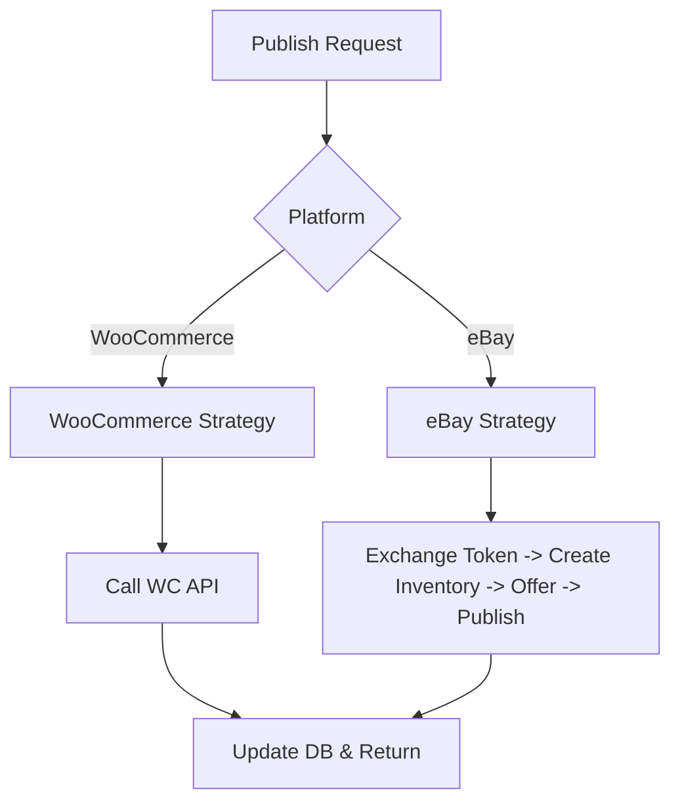

**Diagram sources**
- [routes.ts](file://server/routes.ts#L228-L488)

Implementation highlights:
- AI analysis workflow: [routes.ts](file://server/routes.ts#L140-L226)
- WooCommerce publishing: [routes.ts](file://server/routes.ts#L228-L296)
- eBay publishing: [routes.ts](file://server/routes.ts#L298-L488)

**Section sources**
- [routes.ts](file://server/routes.ts#L140-L226)
- [routes.ts](file://server/routes.ts#L228-L296)
- [routes.ts](file://server/routes.ts#L298-L488)

### Singleton Pattern: Database Connections and API Clients
- Supabase client is initialized once and reused across the app.
- Drizzle DB client uses a single pooled connection.
- Benefits: Resource efficiency, consistent configuration, and reduced overhead.

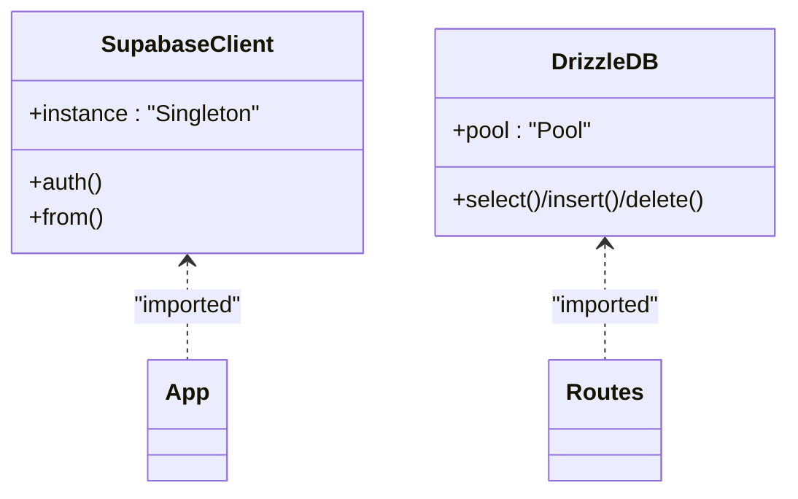

**Diagram sources**
- [supabase.ts](file://client/lib/supabase.ts#L18-L38)
- [db.ts](file://server/db.ts#L11-L18)

Implementation highlights:
- Supabase singleton: [supabase.ts](file://client/lib/supabase.ts#L18-L38)
- Drizzle pool initialization: [db.ts](file://server/db.ts#L11-L18)

**Section sources**
- [supabase.ts](file://client/lib/supabase.ts#L18-L38)
- [db.ts](file://server/db.ts#L11-L18)

### Adapter Pattern: External Service Integrations
- The application adapts external services (WooCommerce, eBay) by normalizing their APIs into consistent server endpoints.
- Benefits: Isolation of third-party specifics and unified client interactions.

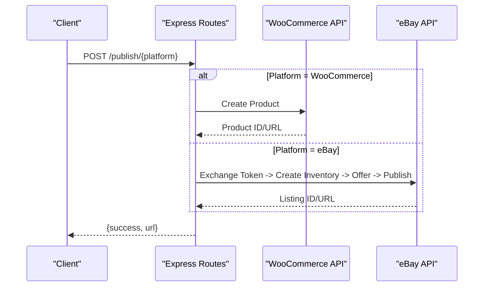

**Diagram sources**
- [routes.ts](file://server/routes.ts#L228-L488)

Implementation highlights:
- Publishing adapters: [routes.ts](file://server/routes.ts#L228-L488)

**Section sources**
- [routes.ts](file://server/routes.ts#L228-L488)

### Template Method Pattern: Standardized Workflows
- The server defines a consistent template for image-based analysis with a fixed prompt and structured JSON response parsing.
- Benefits: Predictable behavior, robust fallbacks, and uniform output.

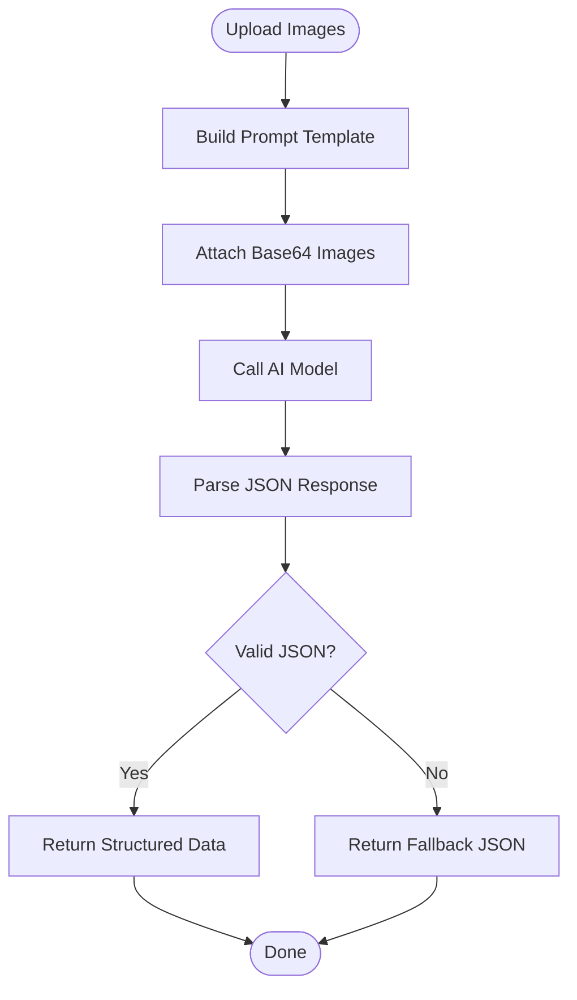

**Diagram sources**
- [routes.ts](file://server/routes.ts#L140-L226)

Implementation highlights:
- Analysis template: [routes.ts](file://server/routes.ts#L140-L226)

**Section sources**
- [routes.ts](file://server/routes.ts#L140-L226)

## Dependency Analysis
- Client depends on:
  - Supabase for auth
  - React Query for data fetching
  - Navigation libraries for routing
  - Theme constants for styling
- Server depends on:
  - Drizzle ORM for database operations
  - Multer for image uploads
  - Express for routing
  - External APIs for marketplace publishing

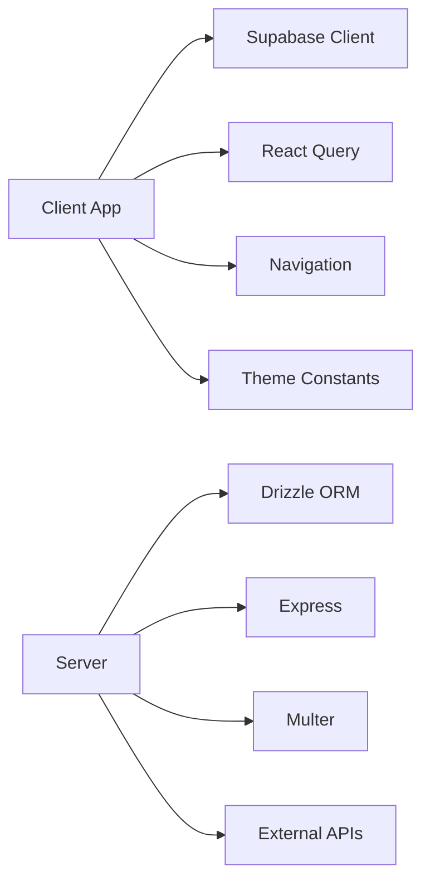

**Diagram sources**
- [supabase.ts](file://client/lib/supabase.ts#L18-L38)
- [query-client.ts](file://client/lib/query-client.ts#L66-L79)
- [RootStackNavigator.tsx](file://client/navigation/RootStackNavigator.tsx#L32-L122)
- [theme.ts](file://client/constants/theme.ts#L3-L40)
- [db.ts](file://server/db.ts#L1-L19)
- [routes.ts](file://server/routes.ts#L24-L492)

**Section sources**
- [supabase.ts](file://client/lib/supabase.ts#L18-L38)
- [query-client.ts](file://client/lib/query-client.ts#L66-L79)
- [RootStackNavigator.tsx](file://client/navigation/RootStackNavigator.tsx#L32-L122)
- [theme.ts](file://client/constants/theme.ts#L3-L40)
- [db.ts](file://server/db.ts#L1-L19)
- [routes.ts](file://server/routes.ts#L24-L492)

## Performance Considerations
- Use a single Supabase client instance to avoid redundant connections.
- Configure React Query defaults to minimize network churn and enable caching strategies appropriate for the domain.
- Keep image sizes reasonable for AI analysis to reduce latency.
- Use connection pooling for database operations to limit overhead.

## Troubleshooting Guide
- Authentication not initializing:
  - Verify environment variables for Supabase and ensure the client is configured before use.
  - Check the auth state subscription and error handling paths.
  - Reference: [supabase.ts](file://client/lib/supabase.ts#L18-L38), [useAuth.ts](file://client/hooks/useAuth.ts#L17-L38)
- Navigation does not update after login:
  - Confirm that the auth context updates and triggers re-render.
  - Reference: [AuthContext.tsx](file://client/contexts/AuthContext.tsx#L19-L30), [RootStackNavigator.tsx](file://client/navigation/RootStackNavigator.tsx#L34-L40)
- API requests fail:
  - Ensure the API base URL is set and credentials are included.
  - Reference: [query-client.ts](file://client/lib/query-client.ts#L7-L17), [query-client.ts](file://client/lib/query-client.ts#L34-L43)
- Database errors:
  - Confirm DATABASE_URL is set and the pool is created successfully.
  - Reference: [db.ts](file://server/db.ts#L7-L18)
- Marketplace publishing failures:
  - Validate credentials and tokens; check platform-specific error messages returned by the adapters.
  - Reference: [routes.ts](file://server/routes.ts#L228-L296), [routes.ts](file://server/routes.ts#L298-L488)

**Section sources**
- [supabase.ts](file://client/lib/supabase.ts#L18-L38)
- [useAuth.ts](file://client/hooks/useAuth.ts#L17-L38)
- [AuthContext.tsx](file://client/contexts/AuthContext.tsx#L19-L30)
- [RootStackNavigator.tsx](file://client/navigation/RootStackNavigator.tsx#L34-L40)
- [query-client.ts](file://client/lib/query-client.ts#L7-L17)
- [query-client.ts](file://client/lib/query-client.ts#L34-L43)
- [db.ts](file://server/db.ts#L7-L18)
- [routes.ts](file://server/routes.ts#L228-L296)
- [routes.ts](file://server/routes.ts#L298-L488)

## Conclusion
Hidden-Gem leverages well-established design patterns to achieve a clean, scalable, and maintainable architecture:
- Provider and Observer patterns centralize state and reactive updates.
- Repository and Singleton patterns streamline persistence and client management.
- Factory and Strategy patterns modularize route registration and platform integrations.
- Component-based architecture promotes reuse and consistency.
- Template Method pattern ensures standardized workflows for AI analysis.

These patterns collectively improve developer productivity, code quality, and long-term maintainability.