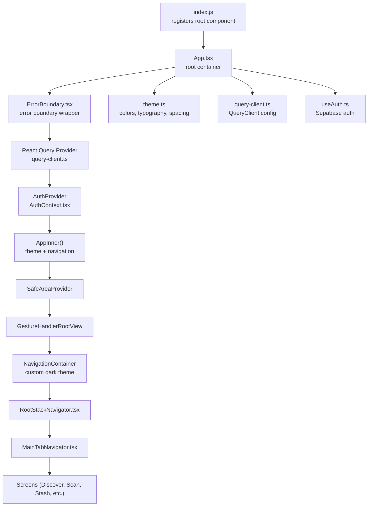
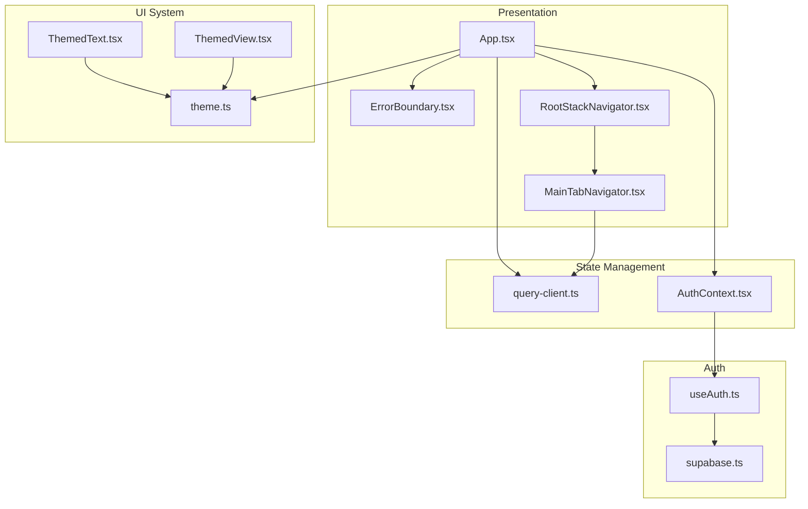
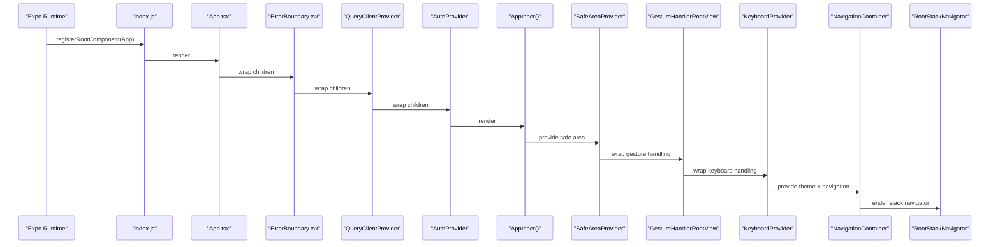
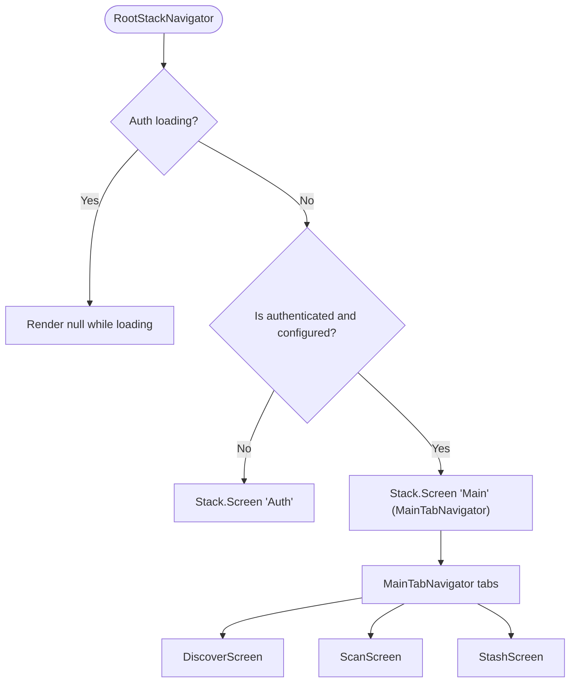
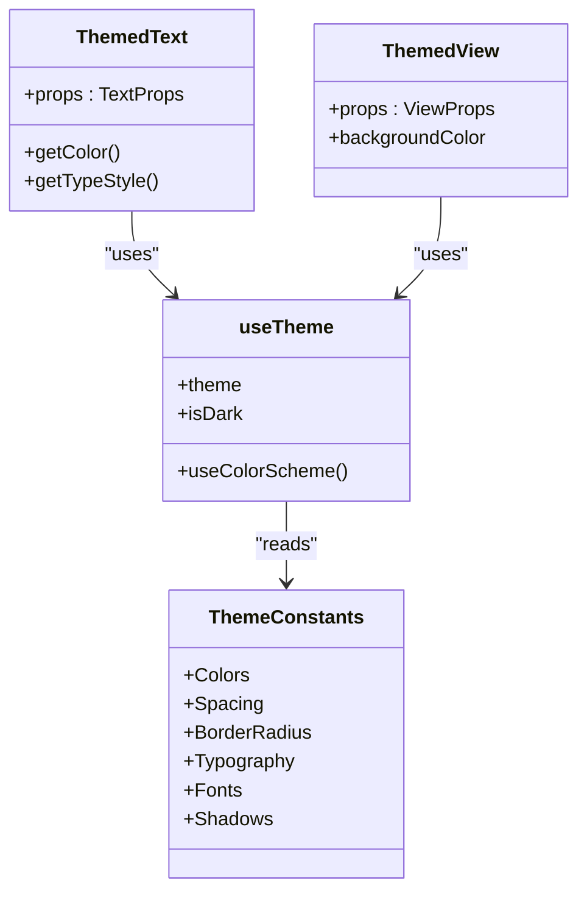
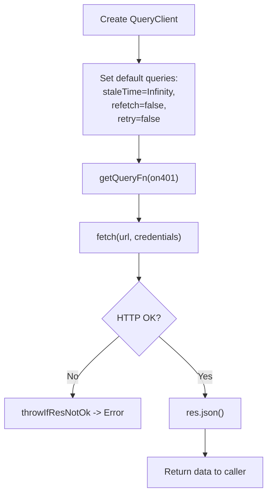
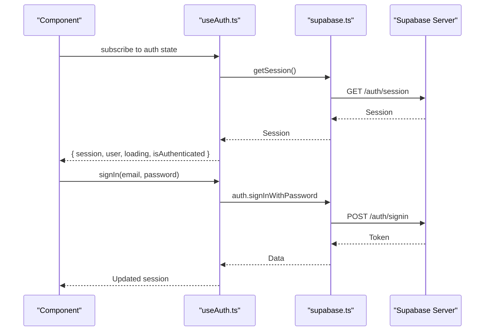
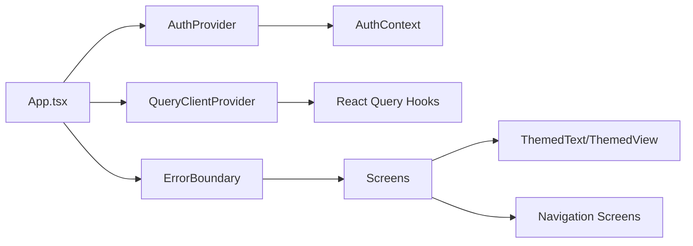
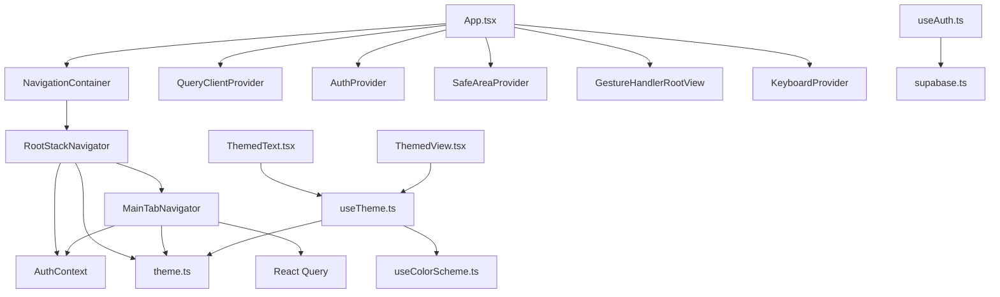

# Frontend Architecture

<cite>
**Referenced Files in This Document**
- [App.tsx](file://client/App.tsx)
- [index.js](file://client/index.js)
- [theme.ts](file://client/constants/theme.ts)
- [query-client.ts](file://client/lib/query-client.ts)
- [AuthContext.tsx](file://client/contexts/AuthContext.tsx)
- [RootStackNavigator.tsx](file://client/navigation/RootStackNavigator.tsx)
- [MainTabNavigator.tsx](file://client/navigation/MainTabNavigator.tsx)
- [ErrorBoundary.tsx](file://client/components/ErrorBoundary.tsx)
- [useAuth.ts](file://client/hooks/useAuth.ts)
- [useTheme.ts](file://client/hooks/useTheme.ts)
- [useColorScheme.ts](file://client/hooks/useColorScheme.ts)
- [ThemedText.tsx](file://client/components/ThemedText.tsx)
- [ThemedView.tsx](file://client/components/ThemedView.tsx)
- [HomeScreen.tsx](file://client/screens/HomeScreen.tsx)
- [supabase.ts](file://client/lib/supabase.ts)
</cite>

## Table of Contents
1. [Introduction](#introduction)
2. [Project Structure](#project-structure)
3. [Core Components](#core-components)
4. [Architecture Overview](#architecture-overview)
5. [Detailed Component Analysis](#detailed-component-analysis)
6. [Dependency Analysis](#dependency-analysis)
7. [Performance Considerations](#performance-considerations)
8. [Troubleshooting Guide](#troubleshooting-guide)
9. [Conclusion](#conclusion)

## Introduction
This document describes the frontend architecture of the Hidden-Gem React Native application. It focuses on the component hierarchy starting from the root App container, the ErrorBoundary wrapper, the React Query state management via QueryClientProvider, and the AuthProvider for authentication context. It also documents the navigation architecture with NavigationContainer, SafeAreaProvider, and GestureHandlerRootView integration, the theme system with a custom dark theme configuration, and the React Query integration for data fetching and caching. Finally, it explains component composition patterns, how context providers prevent prop drilling, and the overall frontend state management strategy.

## Project Structure
The frontend is organized around a clear separation of concerns:
- Root entrypoint registers the App component with Expo.
- App.tsx composes providers and the navigation tree.
- Navigation is implemented with React Navigation native stack and bottom tabs.
- Theme constants and themed components provide a consistent design system.
- React Query manages data fetching and caching.
- Authentication is handled via Supabase with a dedicated hook and context.

**Diagram sources**
- [index.js](file://client/index.js#L1-L6)
- [App.tsx](file://client/App.tsx#L1-L67)
- [ErrorBoundary.tsx](file://client/components/ErrorBoundary.tsx#L1-L55)
- [query-client.ts](file://client/lib/query-client.ts#L1-L80)
- [AuthContext.tsx](file://client/contexts/AuthContext.tsx#L1-L31)
- [RootStackNavigator.tsx](file://client/navigation/RootStackNavigator.tsx#L1-L133)
- [MainTabNavigator.tsx](file://client/navigation/MainTabNavigator.tsx#L1-L192)
- [theme.ts](file://client/constants/theme.ts#L1-L167)
- [useAuth.ts](file://client/hooks/useAuth.ts#L1-L151)

**Section sources**
- [index.js](file://client/index.js#L1-L6)
- [App.tsx](file://client/App.tsx#L1-L67)

## Core Components
- App.tsx: Defines the root container, composes providers, applies a custom dark theme, and renders the navigation stack.
- ErrorBoundary.tsx: Implements a class-based error boundary to gracefully handle rendering errors.
- AuthContext.tsx: Provides authentication state and actions via a context provider and hook.
- RootStackNavigator.tsx: Controls conditional routing based on authentication state and defines top-level screens.
- MainTabNavigator.tsx: Implements the bottom tab bar with custom header elements and integrates React Query for badge counts.
- theme.ts: Centralizes color palettes, typography, spacing, fonts, and shadows for both light and dark modes.
- query-client.ts: Creates a QueryClient with custom defaults, a reusable API request utility, and a typed query function factory.
- useAuth.ts: Manages Supabase authentication state, session persistence, and OAuth flows.
- ThemedText.tsx and ThemedView.tsx: Themed wrappers that adapt to the current color scheme and apply typography or background colors.
- useTheme.ts and useColorScheme.ts: Provide theme-aware props and expose the device color scheme.

**Section sources**
- [App.tsx](file://client/App.tsx#L1-L67)
- [ErrorBoundary.tsx](file://client/components/ErrorBoundary.tsx#L1-L55)
- [AuthContext.tsx](file://client/contexts/AuthContext.tsx#L1-L31)
- [RootStackNavigator.tsx](file://client/navigation/RootStackNavigator.tsx#L1-L133)
- [MainTabNavigator.tsx](file://client/navigation/MainTabNavigator.tsx#L1-L192)
- [theme.ts](file://client/constants/theme.ts#L1-L167)
- [query-client.ts](file://client/lib/query-client.ts#L1-L80)
- [useAuth.ts](file://client/hooks/useAuth.ts#L1-L151)
- [ThemedText.tsx](file://client/components/ThemedText.tsx#L1-L62)
- [ThemedView.tsx](file://client/components/ThemedView.tsx#L1-L27)
- [useTheme.ts](file://client/hooks/useTheme.ts#L1-L14)
- [useColorScheme.ts](file://client/hooks/useColorScheme.ts#L1-L2)

## Architecture Overview
The frontend follows a layered architecture:
- Presentation Layer: App.tsx orchestrates providers and navigation.
- Navigation Layer: Root and tab navigators define routes and screen options.
- Data Layer: React Query manages caching and data fetching with a centralized client.
- Authentication Layer: Supabase-backed context and hook manage sessions and user state.
- Theming Layer: Centralized theme constants and themed components enforce design consistency.

**Diagram sources**
- [App.tsx](file://client/App.tsx#L1-L67)
- [ErrorBoundary.tsx](file://client/components/ErrorBoundary.tsx#L1-L55)
- [RootStackNavigator.tsx](file://client/navigation/RootStackNavigator.tsx#L1-L133)
- [MainTabNavigator.tsx](file://client/navigation/MainTabNavigator.tsx#L1-L192)
- [query-client.ts](file://client/lib/query-client.ts#L1-L80)
- [AuthContext.tsx](file://client/contexts/AuthContext.tsx#L1-L31)
- [theme.ts](file://client/constants/theme.ts#L1-L167)
- [ThemedText.tsx](file://client/components/ThemedText.tsx#L1-L62)
- [ThemedView.tsx](file://client/components/ThemedView.tsx#L1-L27)
- [useAuth.ts](file://client/hooks/useAuth.ts#L1-L151)
- [supabase.ts](file://client/lib/supabase.ts#L1-L39)

## Detailed Component Analysis

### Root Container and Providers
- App.tsx composes:
  - ErrorBoundary at the outermost level.
  - QueryClientProvider wrapping the entire app.
  - AuthProvider for authentication context.
  - AppInner which sets up SafeAreaProvider, GestureHandlerRootView, KeyboardProvider, NavigationContainer with a custom dark theme, and the RootStackNavigator.
- The custom theme merges react-navigation’s DarkTheme with Hidden-Gem-specific colors from theme.ts.

**Diagram sources**
- [index.js](file://client/index.js#L1-L6)
- [App.tsx](file://client/App.tsx#L1-L67)
- [ErrorBoundary.tsx](file://client/components/ErrorBoundary.tsx#L1-L55)
- [query-client.ts](file://client/lib/query-client.ts#L1-L80)
- [AuthContext.tsx](file://client/contexts/AuthContext.tsx#L1-L31)
- [RootStackNavigator.tsx](file://client/navigation/RootStackNavigator.tsx#L1-L133)

**Section sources**
- [App.tsx](file://client/App.tsx#L1-L67)

### Navigation Architecture
- RootStackNavigator decides whether to show the Auth screen or the Main tab navigator based on authentication state.
- MainTabNavigator defines three tabs (Discover, Scan, Stash) and customizes header content, tab bar appearance, and iOS blur effect.
- Both navigators rely on screen options from a shared hook and theme constants for consistent styling.

**Diagram sources**
- [RootStackNavigator.tsx](file://client/navigation/RootStackNavigator.tsx#L1-L133)
- [MainTabNavigator.tsx](file://client/navigation/MainTabNavigator.tsx#L1-L192)

**Section sources**
- [RootStackNavigator.tsx](file://client/navigation/RootStackNavigator.tsx#L1-L133)
- [MainTabNavigator.tsx](file://client/navigation/MainTabNavigator.tsx#L1-L192)

### Theme System and Color Scheme Management
- theme.ts centralizes Colors, Spacing, BorderRadius, Typography, Fonts, and Shadows for both light and dark modes.
- useTheme combines useColorScheme with theme.ts to expose the current palette and mode.
- ThemedText and ThemedView consume useTheme to automatically adapt colors and typography.

**Diagram sources**
- [theme.ts](file://client/constants/theme.ts#L1-L167)
- [useTheme.ts](file://client/hooks/useTheme.ts#L1-L14)
- [ThemedText.tsx](file://client/components/ThemedText.tsx#L1-L62)
- [ThemedView.tsx](file://client/components/ThemedView.tsx#L1-L27)

**Section sources**
- [theme.ts](file://client/constants/theme.ts#L1-L167)
- [useTheme.ts](file://client/hooks/useTheme.ts#L1-L14)
- [ThemedText.tsx](file://client/components/ThemedText.tsx#L1-L62)
- [ThemedView.tsx](file://client/components/ThemedView.tsx#L1-L27)

### React Query Integration
- query-client.ts defines:
  - getApiUrl to resolve the backend base URL from environment variables.
  - apiRequest for generic HTTP requests with credential handling.
  - getQueryFn to create typed query functions with 401 handling behavior.
  - A QueryClient with default options: infinite staleTime, disabled refetches, and no retries.
- Components like MainTabNavigator use useQuery to fetch data (e.g., stash count) and update UI accordingly.

**Diagram sources**
- [query-client.ts](file://client/lib/query-client.ts#L1-L80)
- [MainTabNavigator.tsx](file://client/navigation/MainTabNavigator.tsx#L41-L43)

**Section sources**
- [query-client.ts](file://client/lib/query-client.ts#L1-L80)
- [MainTabNavigator.tsx](file://client/navigation/MainTabNavigator.tsx#L41-L43)

### Authentication Context and Supabase Integration
- AuthContext.tsx provides a typed context and hook for authentication state and actions.
- useAuth.ts manages:
  - Session retrieval and subscription to auth state changes.
  - Sign-in/sign-up/sign-out flows.
  - Google OAuth with platform-specific handling and browser session completion.
  - Returns isAuthenticated and isConfigured flags used by RootStackNavigator.
- supabase.ts encapsulates client creation, environment configuration, and redirect URL resolution.

**Diagram sources**
- [AuthContext.tsx](file://client/contexts/AuthContext.tsx#L1-L31)
- [useAuth.ts](file://client/hooks/useAuth.ts#L1-L151)
- [supabase.ts](file://client/lib/supabase.ts#L1-L39)

**Section sources**
- [AuthContext.tsx](file://client/contexts/AuthContext.tsx#L1-L31)
- [useAuth.ts](file://client/hooks/useAuth.ts#L1-L151)
- [supabase.ts](file://client/lib/supabase.ts#L1-L39)

### Component Composition Patterns and Prop Drilling Prevention
- Providers at the root eliminate prop drilling:
  - ErrorBoundary wraps all children.
  - QueryClientProvider exposes cache and queries globally.
  - AuthProvider makes session and actions available anywhere.
- Themed components (ThemedText, ThemedView) consume theme via hooks, avoiding passing colors down the tree.
- Navigation screens receive props through React Navigation stacks without manual prop passing.

**Diagram sources**
- [App.tsx](file://client/App.tsx#L1-L67)
- [ErrorBoundary.tsx](file://client/components/ErrorBoundary.tsx#L1-L55)
- [query-client.ts](file://client/lib/query-client.ts#L1-L80)
- [AuthContext.tsx](file://client/contexts/AuthContext.tsx#L1-L31)
- [ThemedText.tsx](file://client/components/ThemedText.tsx#L1-L62)
- [ThemedView.tsx](file://client/components/ThemedView.tsx#L1-L27)
- [RootStackNavigator.tsx](file://client/navigation/RootStackNavigator.tsx#L1-L133)

**Section sources**
- [App.tsx](file://client/App.tsx#L1-L67)
- [ThemedText.tsx](file://client/components/ThemedText.tsx#L1-L62)
- [ThemedView.tsx](file://client/components/ThemedView.tsx#L1-L27)
- [RootStackNavigator.tsx](file://client/navigation/RootStackNavigator.tsx#L1-L133)

### Example Screen Integration
- HomeScreen demonstrates:
  - Using useTheme for background color.
  - Using useSafeAreaInsets, useHeaderHeight, and useBottomTabBarHeight for layout adjustments.
  - Applying spacing constants from theme.ts.

**Section sources**
- [HomeScreen.tsx](file://client/screens/HomeScreen.tsx#L1-L29)
- [theme.ts](file://client/constants/theme.ts#L1-L167)

## Dependency Analysis
- App.tsx depends on:
  - NavigationContainer and theme.ts for the custom dark theme.
  - QueryClientProvider and query-client.ts for state management.
  - AuthProvider and AuthContext for authentication.
  - SafeAreaProvider, GestureHandlerRootView, and KeyboardProvider for cross-platform UX.
- RootStackNavigator depends on:
  - AuthContext for conditional routing.
  - theme.ts for consistent background colors.
- MainTabNavigator depends on:
  - useQuery for data fetching.
  - theme.ts and useTheme for styling.
  - AuthContext for header content.
- Themed components depend on:
  - useTheme and theme.ts for color and typography.
- useAuth depends on:
  - supabase.ts for client and environment configuration.

**Diagram sources**
- [App.tsx](file://client/App.tsx#L1-L67)
- [RootStackNavigator.tsx](file://client/navigation/RootStackNavigator.tsx#L1-L133)
- [MainTabNavigator.tsx](file://client/navigation/MainTabNavigator.tsx#L1-L192)
- [AuthContext.tsx](file://client/contexts/AuthContext.tsx#L1-L31)
- [query-client.ts](file://client/lib/query-client.ts#L1-L80)
- [useAuth.ts](file://client/hooks/useAuth.ts#L1-L151)
- [supabase.ts](file://client/lib/supabase.ts#L1-L39)
- [useTheme.ts](file://client/hooks/useTheme.ts#L1-L14)
- [useColorScheme.ts](file://client/hooks/useColorScheme.ts#L1-L2)
- [ThemedText.tsx](file://client/components/ThemedText.tsx#L1-L62)
- [ThemedView.tsx](file://client/components/ThemedView.tsx#L1-L27)
- [theme.ts](file://client/constants/theme.ts#L1-L167)

**Section sources**
- [App.tsx](file://client/App.tsx#L1-L67)
- [RootStackNavigator.tsx](file://client/navigation/RootStackNavigator.tsx#L1-L133)
- [MainTabNavigator.tsx](file://client/navigation/MainTabNavigator.tsx#L1-L192)
- [AuthContext.tsx](file://client/contexts/AuthContext.tsx#L1-L31)
- [query-client.ts](file://client/lib/query-client.ts#L1-L80)
- [useAuth.ts](file://client/hooks/useAuth.ts#L1-L151)
- [supabase.ts](file://client/lib/supabase.ts#L1-L39)
- [useTheme.ts](file://client/hooks/useTheme.ts#L1-L14)
- [useColorScheme.ts](file://client/hooks/useColorScheme.ts#L1-L2)
- [ThemedText.tsx](file://client/components/ThemedText.tsx#L1-L62)
- [ThemedView.tsx](file://client/components/ThemedView.tsx#L1-L27)
- [theme.ts](file://client/constants/theme.ts#L1-L167)

## Performance Considerations
- React Query defaults:
  - Infinite staleTime avoids unnecessary refetches.
  - Disabled refetchOnWindowFocus reduces background network activity.
  - No retries minimize repeated failed requests.
- Navigation:
  - Conditional rendering during auth loading prevents unnecessary work.
  - Safe area and gesture handlers improve UX without heavy computations.
- Theming:
  - Centralized theme constants reduce style recomputation overhead.

[No sources needed since this section provides general guidance]

## Troubleshooting Guide
- Environment variables:
  - EXPO_PUBLIC_SUPABASE_URL and EXPO_PUBLIC_SUPABASE_ANON_KEY must be set for authentication to function.
  - EXPO_PUBLIC_DOMAIN must be set for the API base URL resolution.
- Error boundary:
  - If an unexpected error occurs, the ErrorBoundary displays a fallback UI and allows resetting the error state.
- Authentication:
  - If Supabase is not configured, useAuth throws descriptive errors and marks isConfigured as false.
  - OAuth flows vary by platform; ensure proper redirect handling and browser session completion.
- Navigation:
  - Ensure SafeAreaProvider, GestureHandlerRootView, and KeyboardProvider are present to avoid layout or gesture issues.
- Theme:
  - If colors appear incorrect, verify the current color scheme and theme overrides in themed components.

**Section sources**
- [supabase.ts](file://client/lib/supabase.ts#L1-L39)
- [query-client.ts](file://client/lib/query-client.ts#L1-L80)
- [ErrorBoundary.tsx](file://client/components/ErrorBoundary.tsx#L1-L55)
- [useAuth.ts](file://client/hooks/useAuth.ts#L1-L151)
- [App.tsx](file://client/App.tsx#L1-L67)

## Conclusion
Hidden-Gem’s frontend architecture centers on a robust provider stack, a clear navigation hierarchy, a unified theme system, and a pragmatic React Query configuration. Authentication is encapsulated behind a context and hook, while themed components and navigation options ensure a consistent user experience. The design minimizes prop drilling, leverages platform-specific providers for optimal UX, and establishes a scalable foundation for future enhancements.