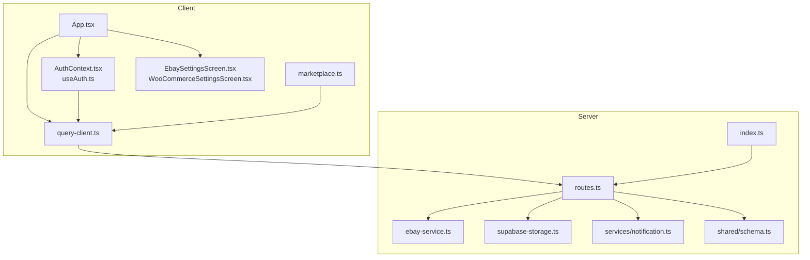
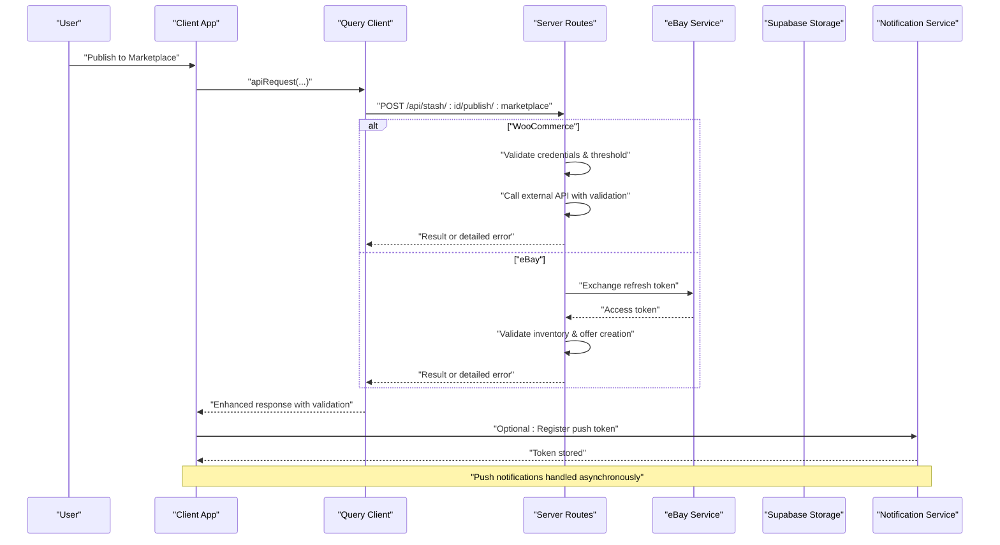
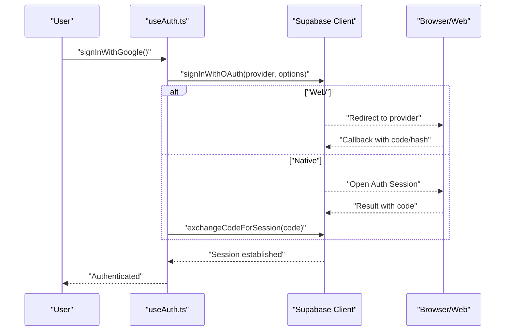
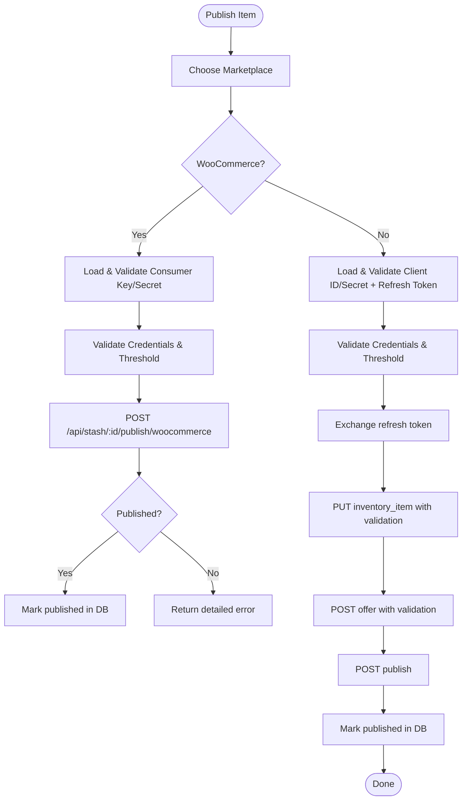
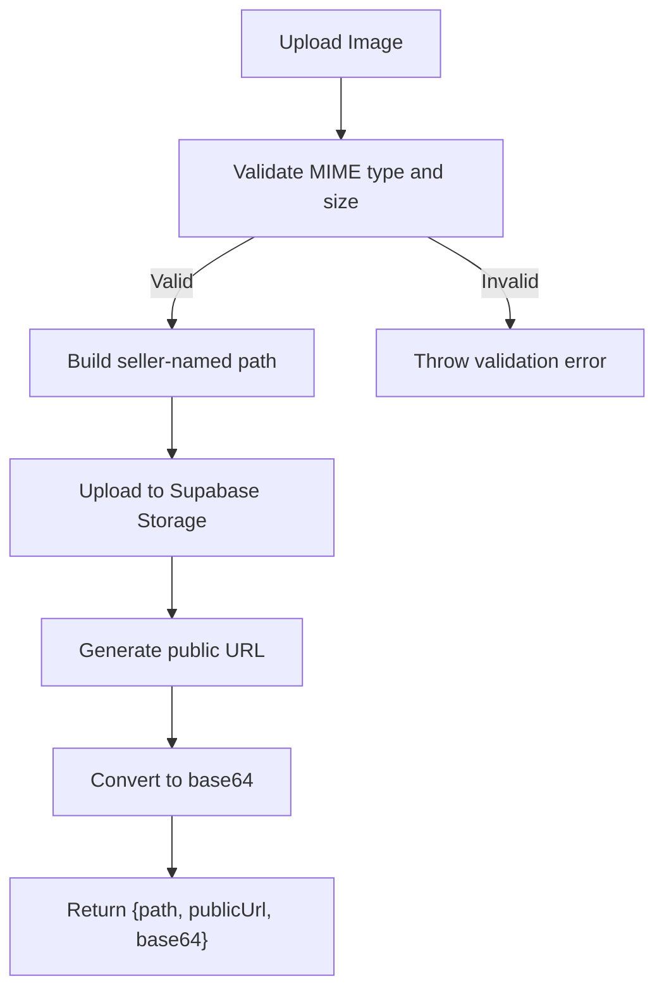
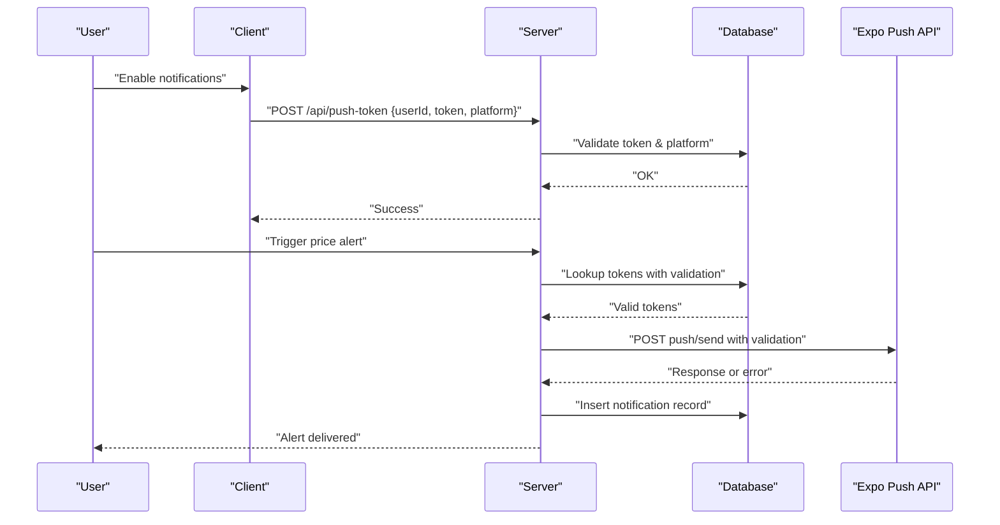
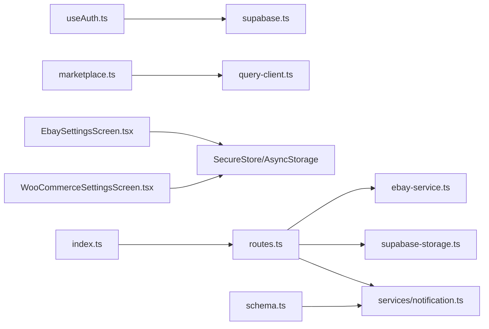

# Integration Patterns

<cite>
**Referenced Files in This Document**
- [supabase.ts](file://client/lib/supabase.ts)
- [AuthContext.tsx](file://client/contexts/AuthContext.tsx)
- [useAuth.ts](file://client/hooks/useAuth.ts)
- [query-client.ts](file://client/lib/query-client.ts)
- [App.tsx](file://client/App.tsx)
- [marketplace.ts](file://client/lib/marketplace.ts)
- [EbaySettingsScreen.tsx](file://client/screens/EbaySettingsScreen.tsx)
- [WooCommerceSettingsScreen.tsx](file://client/screens/WooCommerceSettingsScreen.tsx)
- [routes.ts](file://server/routes.ts)
- [ebay-service.ts](file://server/ebay-service.ts)
- [supabase-storage.ts](file://server/supabase-storage.ts)
- [notification.ts](file://server/services/notification.ts)
- [index.ts](file://server/index.ts)
- [schema.ts](file://shared/schema.ts)
</cite>

## Update Summary
**Changes Made**
- Enhanced marketplace integration error handling and validation patterns
- Improved simplified integration approaches for both eBay and WooCommerce
- Strengthened error handling in server-side marketplace publishing routes
- Enhanced client-side error handling and user feedback mechanisms
- Improved validation for marketplace credentials and API responses

## Table of Contents
1. [Introduction](#introduction)
2. [Project Structure](#project-structure)
3. [Core Components](#core-components)
4. [Architecture Overview](#architecture-overview)
5. [Detailed Component Analysis](#detailed-component-analysis)
6. [Dependency Analysis](#dependency-analysis)
7. [Performance Considerations](#performance-considerations)
8. [Troubleshooting Guide](#troubleshooting-guide)
9. [Conclusion](#conclusion)

## Introduction
This document describes Hidden-Gem's integration patterns with third-party services. It covers:
- Supabase authentication and real-time database integration, including session management and security considerations
- Marketplace integrations for eBay and WooCommerce APIs, including OAuth flows, API rate limiting, and enhanced error handling strategies
- Cloud storage integration patterns using Supabase Storage for image uploads and retrieval
- Notification service architecture for push notifications, including token management, delivery mechanisms, and user preference handling
- Factory pattern implementation for dynamic service selection, configuration management, and fallback strategies for service failures

## Project Structure
The integration architecture spans the client (React Native) and server (Express) layers:
- Client-side authentication and marketplace settings screens manage credentials and user preferences
- Client-side query client centralizes API requests and enhanced error handling
- Server routes orchestrate marketplace publishing with comprehensive validation and error handling
- Shared schema defines database tables for integrations, push tokens, and notifications

**Diagram sources**
- [App.tsx:31-47](file://client/App.tsx#L31-L47)
- [AuthContext.tsx:19-30](file://client/contexts/AuthContext.tsx#L19-L30)
- [useAuth.ts:12-38](file://client/hooks/useAuth.ts#L12-L38)
- [query-client.ts:26-43](file://client/lib/query-client.ts#L26-L43)
- [marketplace.ts:81-129](file://client/lib/marketplace.ts#L81-L129)
- [EbaySettingsScreen.tsx:27-150](file://client/screens/EbaySettingsScreen.tsx#L27-L150)
- [WooCommerceSettingsScreen.tsx:26-146](file://client/screens/WooCommerceSettingsScreen.tsx#L26-L146)
- [routes.ts:44-647](file://server/routes.ts#L44-L647)
- [ebay-service.ts:42-62](file://server/ebay-service.ts#L42-L62)
- [supabase-storage.ts:45-80](file://server/supabase-storage.ts#L45-L80)
- [notification.ts:31-129](file://server/services/notification.ts#L31-L129)
- [index.ts:227-261](file://server/index.ts#L227-L261)
- [schema.ts:259-293](file://shared/schema.ts#L259-L293)

**Section sources**
- [App.tsx:31-47](file://client/App.tsx#L31-L47)
- [routes.ts:44-647](file://server/routes.ts#L44-L647)
- [index.ts:227-261](file://server/index.ts#L227-L261)

## Core Components
- Supabase client initialization and session persistence
- Authentication hooks managing sign-in/sign-out and OAuth flows
- Enhanced marketplace settings and publishing utilities for eBay and WooCommerce with improved validation
- Server routes for marketplace publishing with comprehensive error handling and validation
- Shared database schema for integrations, push tokens, and notifications

**Section sources**
- [supabase.ts:20-36](file://client/lib/supabase.ts#L20-L36)
- [useAuth.ts:40-137](file://client/hooks/useAuth.ts#L40-L137)
- [marketplace.ts:19-129](file://client/lib/marketplace.ts#L19-L129)
- [routes.ts:387-647](file://server/routes.ts#L387-L647)
- [schema.ts:259-293](file://shared/schema.ts#L259-L293)

## Architecture Overview
The integration architecture follows a layered design with enhanced error handling:
- Client authenticates users and manages marketplace credentials with validation
- Client requests are routed through a centralized query client with improved error handling
- Server routes coordinate marketplace publishing with comprehensive validation and error handling
- Notifications are delivered via Expo push tokens stored in the database

**Diagram sources**
- [query-client.ts:26-43](file://client/lib/query-client.ts#L26-L43)
- [routes.ts:387-647](file://server/routes.ts#L387-L647)
- [ebay-service.ts:42-62](file://server/ebay-service.ts#L42-L62)
- [notification.ts:31-129](file://server/services/notification.ts#L31-L129)

## Detailed Component Analysis

### Supabase Authentication and Real-Time Database Integration
- Client initializes Supabase with platform-specific storage and auto-refresh behavior
- Authentication state is tracked via hooks and context, supporting password and OAuth sign-in
- Redirect URLs are adapted for web and native platforms
- Session persistence and auto-refresh are configured for seamless UX

**Diagram sources**
- [useAuth.ts:72-137](file://client/hooks/useAuth.ts#L72-L137)
- [supabase.ts:20-36](file://client/lib/supabase.ts#L20-L36)

Security considerations:
- Credentials are loaded from environment variables
- On native platforms, sessions are persisted in secure storage
- Auto-refresh and persistent sessions reduce friction while maintaining safety

**Section sources**
- [supabase.ts:6-36](file://client/lib/supabase.ts#L6-L36)
- [useAuth.ts:17-137](file://client/hooks/useAuth.ts#L17-L137)
- [AuthContext.tsx:19-30](file://client/contexts/AuthContext.tsx#L19-L30)

### Enhanced Marketplace Integration Architecture: eBay and WooCommerce
- Client screens capture and persist credentials using secure storage on native platforms with enhanced validation
- Publishing flows are initiated from the client and executed on the server with comprehensive validation
- Server routes validate inputs, handle external API calls, and provide detailed error responses
- Enhanced error handling includes threshold validation, credential verification, and user-friendly error messages

WooCommerce integration:
- Credentials are stored in secure storage on native; AsyncStorage on web with enhanced validation
- Test connection validates REST API accessibility with detailed error reporting
- Publishing posts a product to the store with comprehensive validation and returns detailed success/error information
- Threshold validation prevents high-value items from being published without approval

eBay integration:
- Credentials include client ID, client secret, and optional refresh token with enhanced validation
- Test connection validates OAuth client credentials with detailed error reporting
- Publishing exchanges a refresh token for an access token, creates inventory and offer with validation, then publishes
- Comprehensive error handling for policy requirements, token expiration, and API limitations
- Enhanced threshold validation with user approval workflow for high-value items

**Diagram sources**
- [marketplace.ts:81-129](file://client/lib/marketplace.ts#L81-L129)
- [routes.ts:387-647](file://server/routes.ts#L387-L647)
- [ebay-service.ts:42-62](file://server/ebay-service.ts#L42-L62)

**Section sources**
- [EbaySettingsScreen.tsx:44-150](file://client/screens/EbaySettingsScreen.tsx#L44-L150)
- [WooCommerceSettingsScreen.tsx:43-146](file://client/screens/WooCommerceSettingsScreen.tsx#L43-L146)
- [marketplace.ts:19-129](file://client/lib/marketplace.ts#L19-L129)
- [routes.ts:387-647](file://server/routes.ts#L387-L647)
- [ebay-service.ts:42-62](file://server/ebay-service.ts#L42-L62)

### Cloud Storage Integration with Supabase Storage
- Server-side module uploads images to a Supabase Storage bucket with namespace-aware filenames
- Validation ensures acceptable MIME type and size limits
- Returns both public URL and base64 representation for convenience

**Diagram sources**
- [supabase-storage.ts:45-80](file://server/supabase-storage.ts#L45-L80)

**Section sources**
- [supabase-storage.ts:18-93](file://server/supabase-storage.ts#L18-L93)

### Enhanced Notification Service Architecture
- Client registers push tokens upon permission and stores them via server endpoints with validation
- Server persists tokens per user and platform, supports unregistration with validation
- Notification service sends push notifications to Expo and records history with comprehensive error handling
- Scheduled job periodically checks price thresholds and sends alerts with detailed error reporting
- Enhanced error handling includes token validation, platform-specific delivery, and retry mechanisms

**Diagram sources**
- [notification.ts:31-129](file://server/services/notification.ts#L31-L129)
- [index.ts:247-258](file://server/index.ts#L247-L258)

**Section sources**
- [notification.ts:1-414](file://server/services/notification.ts#L1-L414)
- [index.ts:247-258](file://server/index.ts#L247-L258)

### Factory Pattern Implementation for Dynamic Service Selection
- The codebase does not implement a dedicated factory pattern for service selection
- Instead, marketplace publishing is routed by endpoint path (/publish/woocommerce vs /publish/ebay)
- Configuration is managed via environment variables and secure storage, with runtime validation in server routes

Recommendations for future factory pattern adoption:
- Define interfaces for marketplace services (e.g., publish, update, delete)
- Implement concrete adapters for eBay and WooCommerce
- Introduce a factory that selects the adapter based on configuration or request context
- Add fallback strategies for service failures (retry, circuit breaker, graceful degradation)

[No sources needed since this section proposes recommendations without analyzing specific files]

## Dependency Analysis
The following diagram highlights key dependencies among components:

**Diagram sources**
- [useAuth.ts:3-6](file://client/hooks/useAuth.ts#L3-L6)
- [supabase.ts:1-8](file://client/lib/supabase.ts#L1-L8)
- [marketplace.ts:1-4](file://client/lib/marketplace.ts#L1-L4)
- [query-client.ts:1-1](file://client/lib/query-client.ts#L1-L1)
- [EbaySettingsScreen.tsx:10-18](file://client/screens/EbaySettingsScreen.tsx#L10-L18)
- [WooCommerceSettingsScreen.tsx:10-18](file://client/screens/WooCommerceSettingsScreen.tsx#L10-L18)
- [routes.ts:13-29](file://server/routes.ts#L13-L29)
- [ebay-service.ts:1-6](file://server/ebay-service.ts#L1-L6)
- [supabase-storage.ts:7-16](file://server/supabase-storage.ts#L7-L16)
- [notification.ts:1-4](file://server/services/notification.ts#L1-L4)
- [index.ts:1-9](file://server/index.ts#L1-L9)
- [schema.ts:259-293](file://shared/schema.ts#L259-L293)

**Section sources**
- [routes.ts:13-29](file://server/routes.ts#L13-L29)
- [schema.ts:259-293](file://shared/schema.ts#L259-L293)

## Performance Considerations
- API request caching and retries are disabled in the query client to avoid stale data; ensure appropriate caching at the application level
- Server-side logging captures request durations and responses for observability
- Scheduled tasks run periodically; ensure intervals balance responsiveness and resource usage
- Image uploads enforce size limits to prevent excessive bandwidth and storage consumption
- Enhanced error handling reduces unnecessary retries and improves overall performance
- Client-side validation prevents invalid requests from reaching server endpoints

[No sources needed since this section provides general guidance]

## Troubleshooting Guide
Common issues and resolutions:
- Supabase configuration missing: Verify environment variables for URL and anonymous key; the client warns when configuration is incomplete
- OAuth callback handling: Ensure redirect URLs match platform expectations; native flows exchange authorization codes for sessions
- eBay token exchange failure: Confirm refresh token validity and environment selection; server routes return detailed error messages with specific troubleshooting steps
- WooCommerce authentication failure: Validate consumer key and secret; test connection endpoint surfaces HTTP status and error details with user-friendly messages
- Push token registration failures: Check permissions and network connectivity; server routes return structured error responses with validation
- Marketplace threshold validation failures: Review user-defined thresholds and approval workflows for high-value items
- Enhanced error handling provides more specific error messages and recovery options for marketplace integration issues

**Section sources**
- [supabase.ts:20-36](file://client/lib/supabase.ts#L20-L36)
- [useAuth.ts:72-137](file://client/hooks/useAuth.ts#L72-L137)
- [routes.ts:486-500](file://server/routes.ts#L486-L500)
- [routes.ts:12-42](file://server/routes.ts#L12-L42)
- [notification.ts:31-58](file://server/services/notification.ts#L31-L58)

## Conclusion
Hidden-Gem's integration patterns combine robust client-side authentication and marketplace credential management with server-side orchestration for publishing, storage, and notifications. The enhanced marketplace integration patterns provide improved error handling, validation, and user experience while maintaining core functionality. While a formal factory pattern is not currently implemented, the modular design enables straightforward extension to support additional services and improved resilience through standardized adapters and fallback strategies. The simplified integration approaches ensure maintainability while providing comprehensive error handling and validation mechanisms.