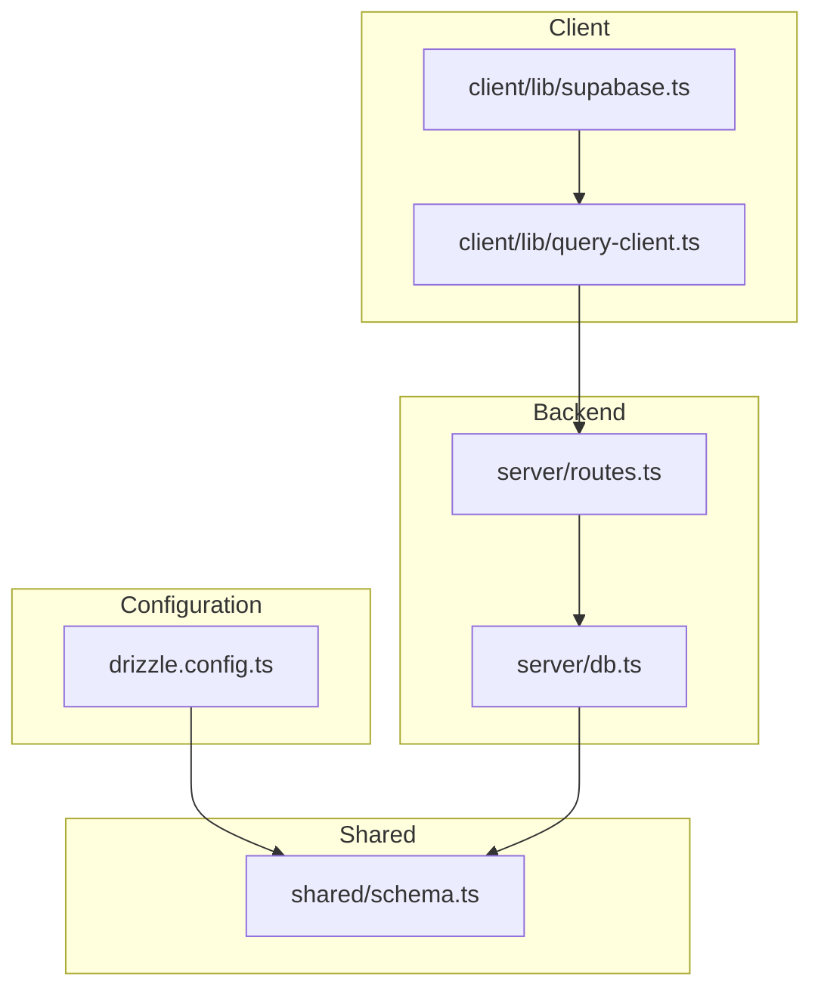
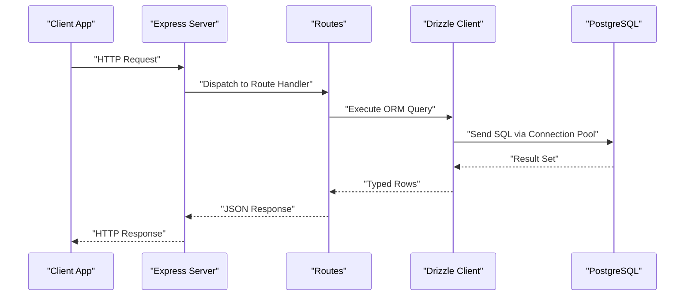
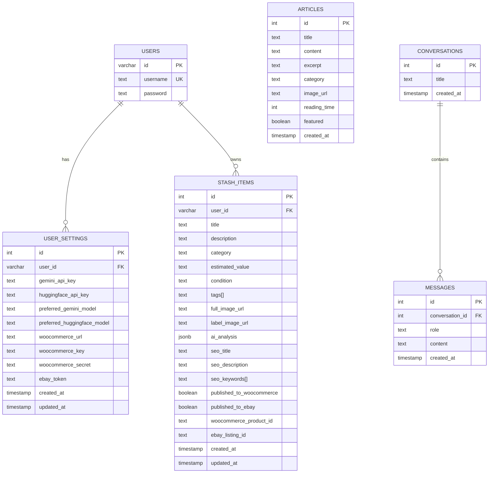
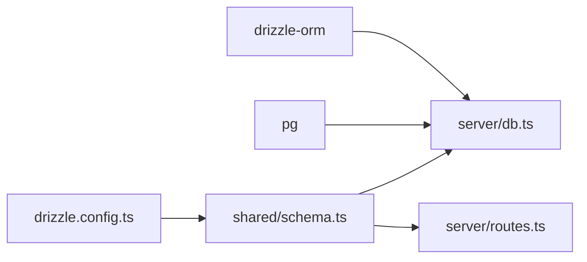

# Database Integration

<cite>
**Referenced Files in This Document**
- [drizzle.config.ts](file://drizzle.config.ts)
- [server/db.ts](file://server/db.ts)
- [shared/schema.ts](file://shared/schema.ts)
- [server/routes.ts](file://server/routes.ts)
- [ENVIRONMENT.md](file://ENVIRONMENT.md)
- [package.json](file://package.json)
- [client/lib/query-client.ts](file://client/lib/query-client.ts)
- [client/lib/supabase.ts](file://client/lib/supabase.ts)
</cite>

## Table of Contents
1. [Introduction](#introduction)
2. [Project Structure](#project-structure)
3. [Core Components](#core-components)
4. [Architecture Overview](#architecture-overview)
5. [Detailed Component Analysis](#detailed-component-analysis)
6. [Dependency Analysis](#dependency-analysis)
7. [Performance Considerations](#performance-considerations)
8. [Troubleshooting Guide](#troubleshooting-guide)
9. [Conclusion](#conclusion)
10. [Appendices](#appendices)

## Introduction
This document explains how the project integrates PostgreSQL using Drizzle ORM, manages schema and migrations, and connects the backend API to the database. It covers connection setup, connection pooling, transaction handling, query optimization strategies, shared schema definitions, entity relationships, migration management, and operational procedures such as connection troubleshooting, performance monitoring, and backup/recovery. Security considerations for database credentials and connection encryption are also addressed.

## Project Structure
The database integration spans three primary areas:
- Drizzle configuration and migrations
- Backend database connection and ORM usage
- Shared schema definitions consumed by both backend and migrations

**Diagram sources**
- [drizzle.config.ts](file://drizzle.config.ts#L1-L15)
- [server/db.ts](file://server/db.ts#L1-L19)
- [shared/schema.ts](file://shared/schema.ts#L1-L122)
- [server/routes.ts](file://server/routes.ts#L1-L493)
- [client/lib/query-client.ts](file://client/lib/query-client.ts#L1-L80)
- [client/lib/supabase.ts](file://client/lib/supabase.ts#L1-L39)

**Section sources**
- [drizzle.config.ts](file://drizzle.config.ts#L1-L15)
- [server/db.ts](file://server/db.ts#L1-L19)
- [shared/schema.ts](file://shared/schema.ts#L1-L122)
- [server/routes.ts](file://server/routes.ts#L1-L493)
- [client/lib/query-client.ts](file://client/lib/query-client.ts#L1-L80)
- [client/lib/supabase.ts](file://client/lib/supabase.ts#L1-L39)

## Core Components
- Drizzle configuration defines migration output, schema location, dialect, and credentials.
- Backend database connection uses a PostgreSQL connection pool and exposes a typed Drizzle client.
- Shared schema defines all tables, columns, constraints, and Zod-based insert schemas.
- Routes demonstrate ORM usage for reads, writes, counts, and updates.

Key responsibilities:
- Drizzle Kit configuration: migration generation and deployment.
- Connection pool: robust, long-lived connections with SSL options.
- ORM usage: select, insert, update, delete, ordering, and aggregation.
- Shared schema: consistent entity definitions and validation.

**Section sources**
- [drizzle.config.ts](file://drizzle.config.ts#L1-L15)
- [server/db.ts](file://server/db.ts#L1-L19)
- [shared/schema.ts](file://shared/schema.ts#L1-L122)
- [server/routes.ts](file://server/routes.ts#L24-L493)

## Architecture Overview
The backend server initializes a PostgreSQL connection pool and wraps it with Drizzle ORM. Routes use the ORM client to perform database operations. The shared schema is imported by both the backend and Drizzle Kit to keep migrations and runtime code aligned.

**Diagram sources**
- [server/routes.ts](file://server/routes.ts#L24-L493)
- [server/db.ts](file://server/db.ts#L1-L19)

## Detailed Component Analysis

### Drizzle Configuration and Migrations
- Migration output directory and schema path are defined.
- Dialect is PostgreSQL.
- Credentials are sourced from the DATABASE_URL environment variable.
- Migration commands are exposed via npm scripts.

Operational notes:
- Use the provided script to apply migrations safely and idempotently.
- Keep schema.ts synchronized with the current database state.

**Section sources**
- [drizzle.config.ts](file://drizzle.config.ts#L1-L15)
- [ENVIRONMENT.md](file://ENVIRONMENT.md#L91-L113)
- [package.json](file://package.json#L12-L12)

### Database Connection Pooling
- A PostgreSQL connection pool is created from the pg library.
- The pool uses the DATABASE_URL environment variable.
- SSL is configured with certificate verification disabled for convenience; see Security section for production guidance.

Connection lifecycle:
- Pool is initialized once per process.
- Drizzle wraps the pool for type-safe queries.

**Section sources**
- [server/db.ts](file://server/db.ts#L1-L19)

### Drizzle ORM Usage in Routes
- Routes import the Drizzle client and shared schema.
- Typical operations include selecting all rows, filtering by primary key, inserting records, deleting records, counting rows, and updating records.
- Sorting uses descending order by creation timestamps for recent-first views.

Example patterns:
- Select all articles ordered by creation time.
- Insert a stash item with structured fields and JSONB analysis.
- Update a stash item’s publication flags after external API calls.

**Section sources**
- [server/routes.ts](file://server/routes.ts#L24-L493)

### Shared Schema Definitions and Entity Relationships
The shared schema defines the following entities and relationships:

**Diagram sources**
- [shared/schema.ts](file://shared/schema.ts#L6-L122)

Additional schema notes:
- UUID primary key for users with a default generator.
- Foreign keys enforce referential integrity with cascade deletes.
- JSONB fields support flexible AI analysis data.
- Arrays are used for tags and SEO keywords.
- Timestamps track creation and updates.

**Section sources**
- [shared/schema.ts](file://shared/schema.ts#L1-L122)

### Transaction Handling
- Current route handlers execute single statements without explicit transaction blocks.
- For multi-step operations (e.g., publishing to external APIs followed by a database update), consider wrapping in a transaction to maintain atomicity.
- Drizzle supports transaction blocks; wrap related inserts/updates/deletes within a transaction callback.

[No sources needed since this section provides general guidance]

### Query Optimization Strategies
- Use selective projections (choose only required columns) to reduce payload size.
- Apply appropriate WHERE filters and ORDER BY clauses to limit result sets.
- Prefer indexed columns (e.g., primary keys, unique constraints) in joins and filters.
- Aggregate queries (e.g., COUNT) should be scoped to necessary partitions.
- Avoid N+1 selects by batching or using joins where appropriate.

[No sources needed since this section provides general guidance]

### Migration Management
- Drizzle Kit generates and applies migrations based on the shared schema.
- The migration command is idempotent and safe to rerun.
- Keep migrations minimal and versioned alongside the shared schema.

**Section sources**
- [drizzle.config.ts](file://drizzle.config.ts#L1-L15)
- [ENVIRONMENT.md](file://ENVIRONMENT.md#L91-L113)

### Seed Data Handling
- No dedicated seed scripts are present in the repository.
- To populate initial data, use Drizzle’s insert helpers against the shared schema and run migrations afterward.
- Alternatively, add a seed script that executes after migrations.

[No sources needed since this section provides general guidance]

### Database Seeding Processes
- Create a seed script that inserts predefined rows into tables using the shared schema.
- Execute the script post-migration to initialize reference data or demo content.

[No sources needed since this section provides general guidance]

## Dependency Analysis
The backend depends on:
- Drizzle ORM for type-safe SQL.
- PostgreSQL driver for connection pooling.
- Shared schema for consistent definitions across runtime and migrations.

**Diagram sources**
- [server/db.ts](file://server/db.ts#L1-L19)
- [shared/schema.ts](file://shared/schema.ts#L1-L122)
- [drizzle.config.ts](file://drizzle.config.ts#L1-L15)

**Section sources**
- [server/db.ts](file://server/db.ts#L1-L19)
- [shared/schema.ts](file://shared/schema.ts#L1-L122)
- [drizzle.config.ts](file://drizzle.config.ts#L1-L15)

## Performance Considerations
- Connection pooling reduces overhead; ensure pool size aligns with workload.
- Use LIMIT and OFFSET for paginated lists.
- Index frequently filtered columns (e.g., user_id, category).
- Monitor slow queries and add targeted indexes.
- Cache infrequent reads using application-level caching where appropriate.

[No sources needed since this section provides general guidance]

## Troubleshooting Guide
Common issues and resolutions:
- Missing DATABASE_URL: Ensure the environment variable is set and exported before starting the server.
- Connection failures: Verify PostgreSQL is reachable and credentials are correct.
- Migration errors: Confirm the schema path and DATABASE_URL match the target database.
- SSL warnings: Adjust SSL settings according to your hosting provider’s requirements.

Operational commands:
- Start the backend server in development mode.
- Apply migrations using the provided script.
- Check ports and kill conflicting processes if needed.

**Section sources**
- [ENVIRONMENT.md](file://ENVIRONMENT.md#L172-L190)
- [ENVIRONMENT.md](file://ENVIRONMENT.md#L69-L113)
- [server/db.ts](file://server/db.ts#L7-L9)

## Conclusion
The project integrates PostgreSQL with Drizzle ORM using a shared schema, a robust connection pool, and straightforward route handlers. Migrations are managed via Drizzle Kit, and the setup supports scalable growth with proper indexing and transactional boundaries. Follow the security and operational guidance to harden deployments and maintain reliability.

## Appendices

### Environment Variables
- DATABASE_URL: PostgreSQL connection string.
- EXPO_PUBLIC_DOMAIN: Base URL for API requests from the client.
- EXPO_PUBLIC_SUPABASE_URL, EXPO_PUBLIC_SUPABASE_ANON_KEY: Supabase configuration for authentication.

**Section sources**
- [ENVIRONMENT.md](file://ENVIRONMENT.md#L18-L32)
- [client/lib/query-client.ts](file://client/lib/query-client.ts#L7-L17)
- [client/lib/supabase.ts](file://client/lib/supabase.ts#L6-L8)

### Security Considerations
- Store DATABASE_URL and other secrets securely (e.g., hosted secrets).
- Avoid committing secrets to version control.
- Use strong passwords and rotate keys regularly.
- For production, enable strict SSL verification and secure transport.
- Limit database user privileges to least-privilege roles.

**Section sources**
- [server/db.ts](file://server/db.ts#L13-L15)
- [ENVIRONMENT.md](file://ENVIRONMENT.md#L18-L32)

### Backup and Recovery Procedures
- Regularly export schema and data snapshots.
- Test restore procedures in a staging environment.
- Automate backups and monitor retention policies.

[No sources needed since this section provides general guidance]