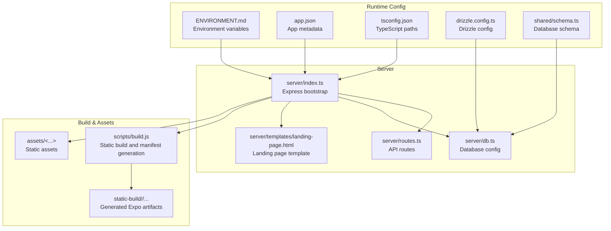
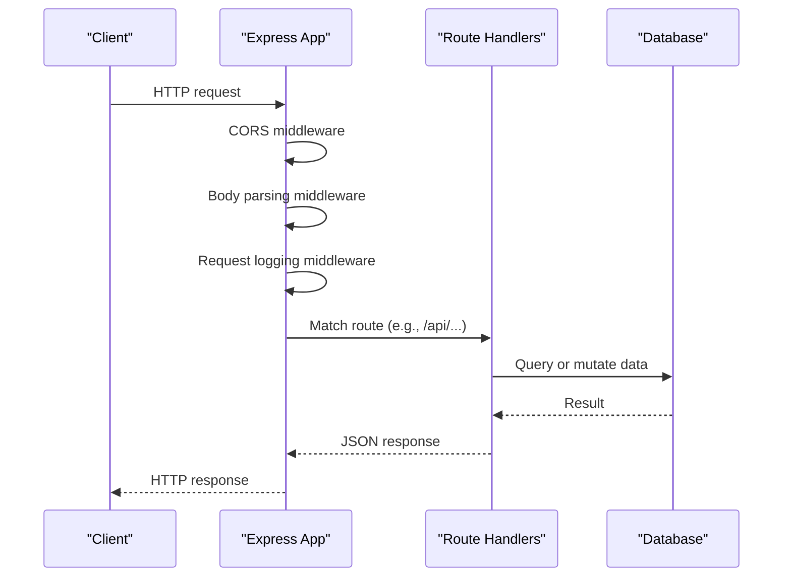
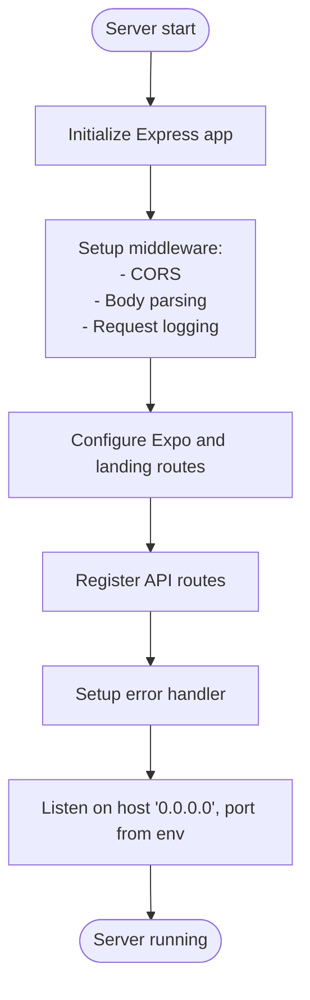
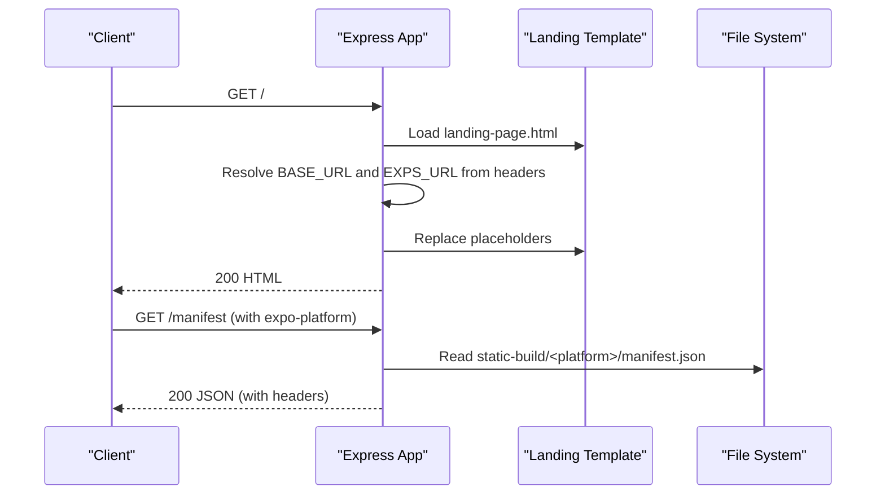
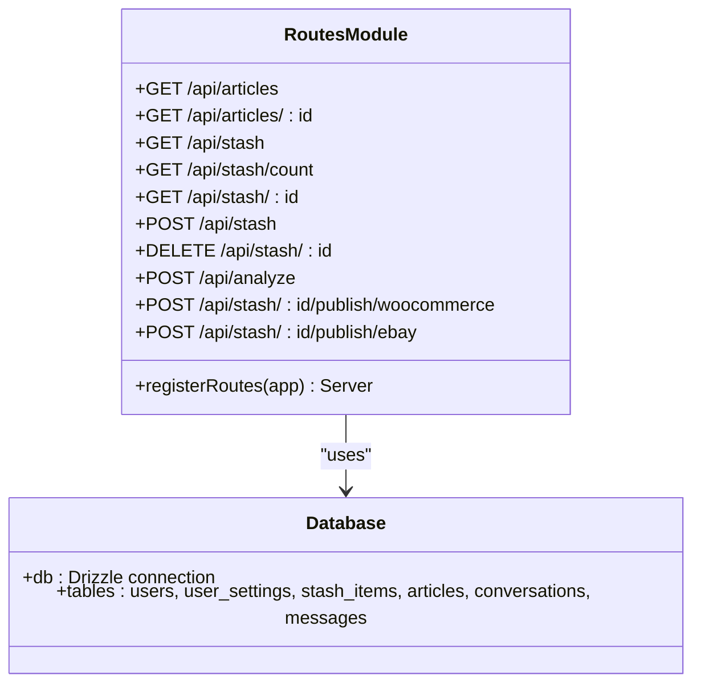
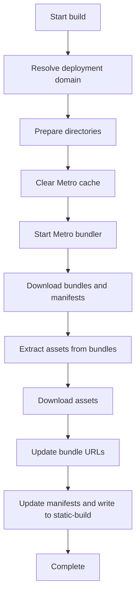
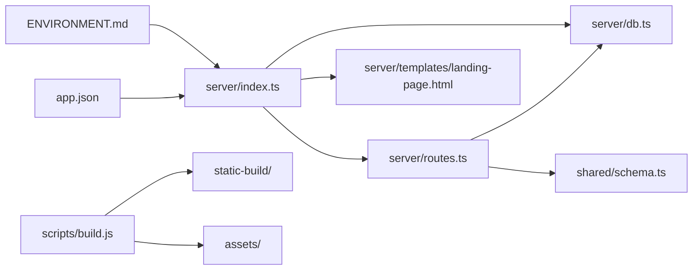

# Express Server Setup

<cite>
**Referenced Files in This Document**
- [server/index.ts](file://server/index.ts)
- [server/routes.ts](file://server/routes.ts)
- [server/db.ts](file://server/db.ts)
- [server/templates/landing-page.html](file://server/templates/landing-page.html)
- [scripts/build.js](file://scripts/build.js)
- [package.json](file://package.json)
- [ENVIRONMENT.md](file://ENVIRONMENT.md)
- [app.json](file://app.json)
- [tsconfig.json](file://tsconfig.json)
- [drizzle.config.ts](file://drizzle.config.ts)
- [shared/schema.ts](file://shared/schema.ts)
</cite>

## Table of Contents
1. [Introduction](#introduction)
2. [Project Structure](#project-structure)
3. [Core Components](#core-components)
4. [Architecture Overview](#architecture-overview)
5. [Detailed Component Analysis](#detailed-component-analysis)
6. [Dependency Analysis](#dependency-analysis)
7. [Performance Considerations](#performance-considerations)
8. [Security Considerations](#security-considerations)
9. [Troubleshooting Guide](#troubleshooting-guide)
10. [Conclusion](#conclusion)

## Introduction
This document explains the Express.js server initialization and configuration for the project. It covers the startup process, port and host binding, middleware pipeline (CORS, body parsing, request logging, error handling), the Expo manifest routing system for delivering mobile app builds, and static file serving. It also documents environment variable usage for domain configuration, request/response modification patterns, and provides security and performance guidance for both development and production deployments.

## Project Structure
The server is implemented as a single Express application with modularized concerns:
- Entry point initializes middleware, routes, and starts the HTTP server.
- Routes module defines API endpoints and integrates with the database.
- Database module configures Drizzle ORM with PostgreSQL.
- Templates provide a landing page served to web clients.
- Build script generates static Expo bundles and manifests for production hosting.

**Diagram sources**
- [server/index.ts](file://server/index.ts#L1-L247)
- [server/routes.ts](file://server/routes.ts#L1-L493)
- [server/db.ts](file://server/db.ts#L1-L19)
- [server/templates/landing-page.html](file://server/templates/landing-page.html#L1-L466)
- [scripts/build.js](file://scripts/build.js#L1-L562)
- [ENVIRONMENT.md](file://ENVIRONMENT.md#L1-L219)
- [app.json](file://app.json#L1-L52)
- [tsconfig.json](file://tsconfig.json#L1-L15)
- [drizzle.config.ts](file://drizzle.config.ts#L1-L15)
- [shared/schema.ts](file://shared/schema.ts#L1-L122)

**Section sources**
- [server/index.ts](file://server/index.ts#L1-L247)
- [server/routes.ts](file://server/routes.ts#L1-L493)
- [server/db.ts](file://server/db.ts#L1-L19)
- [scripts/build.js](file://scripts/build.js#L1-L562)
- [ENVIRONMENT.md](file://ENVIRONMENT.md#L1-L219)
- [app.json](file://app.json#L1-L52)
- [tsconfig.json](file://tsconfig.json#L1-L15)
- [drizzle.config.ts](file://drizzle.config.ts#L1-L15)
- [shared/schema.ts](file://shared/schema.ts#L1-L122)

## Core Components
- Express bootstrap and middleware pipeline
- Route registration and API endpoints
- Database configuration and schema
- Expo manifest routing and landing page serving
- Static file serving for assets and static builds
- Error handling middleware

**Section sources**
- [server/index.ts](file://server/index.ts#L1-L247)
- [server/routes.ts](file://server/routes.ts#L24-L492)
- [server/db.ts](file://server/db.ts#L1-L19)
- [server/templates/landing-page.html](file://server/templates/landing-page.html#L1-L466)

## Architecture Overview
The server composes middleware, registers API routes, and serves both API traffic and Expo app artifacts. The build script prepares static assets and manifests for production hosting.

**Diagram sources**
- [server/index.ts](file://server/index.ts#L16-L98)
- [server/routes.ts](file://server/routes.ts#L24-L492)

## Detailed Component Analysis

### Express Bootstrap and Server Startup
- Initializes Express app and augments incoming message with a raw body buffer.
- Registers middleware in order: CORS, body parsing, request logging, Expo/landing routing, route registration, error handler.
- Starts HTTP server bound to host "0.0.0.0" and configurable port from environment variable with reusePort enabled.

**Diagram sources**
- [server/index.ts](file://server/index.ts#L224-L246)

**Section sources**
- [server/index.ts](file://server/index.ts#L1-L247)

### CORS Middleware
- Dynamically constructs allowed origins from environment variables.
- Allows localhost origins for Expo web development.
- Sends appropriate Access-Control headers and responds to preflight OPTIONS.

**Section sources**
- [server/index.ts](file://server/index.ts#L16-L53)

### Body Parsing Middleware
- Parses JSON bodies and attaches raw bytes to the request for downstream verification.
- Parses URL-encoded forms with extended=false.

**Section sources**
- [server/index.ts](file://server/index.ts#L55-L65)

### Request Logging Middleware
- Wraps response JSON to capture payload for logging.
- Logs only API paths, duration, status, and a truncated JSON payload.
- Ensures logging occurs after response finish event.

**Section sources**
- [server/index.ts](file://server/index.ts#L67-L98)

### Expo Manifest Routing and Landing Page Serving
- Serves a landing page for root path with placeholders replaced by runtime values derived from request headers and app metadata.
- Serves platform-specific manifests when the "expo-platform" header is present.
- Serves static assets and static build artifacts from configured directories.

**Diagram sources**
- [server/index.ts](file://server/index.ts#L133-L205)
- [server/templates/landing-page.html](file://server/templates/landing-page.html#L1-L466)

**Section sources**
- [server/index.ts](file://server/index.ts#L100-L205)
- [server/templates/landing-page.html](file://server/templates/landing-page.html#L1-L466)
- [app.json](file://app.json#L1-L52)

### Static File Serving
- Serves assets from the assets directory.
- Serves static build artifacts from the static-build directory.

**Section sources**
- [server/index.ts](file://server/index.ts#L201-L202)

### Error Handling Middleware
- Extracts status and message from thrown errors.
- Returns JSON error responses with appropriate status codes.
- Re-throws the error after responding.

**Section sources**
- [server/index.ts](file://server/index.ts#L207-L222)

### Route Registration and API Endpoints
- Creates an HTTP server from the Express app and returns it for listening.
- Defines API endpoints for articles, stash items, image analysis, and marketplace publishing integrations (WooCommerce and eBay).
- Uses Multer for multipart uploads and Drizzle ORM for database operations.

**Diagram sources**
- [server/routes.ts](file://server/routes.ts#L24-L492)
- [server/db.ts](file://server/db.ts#L1-L19)
- [shared/schema.ts](file://shared/schema.ts#L1-L122)

**Section sources**
- [server/routes.ts](file://server/routes.ts#L24-L492)
- [server/db.ts](file://server/db.ts#L1-L19)
- [shared/schema.ts](file://shared/schema.ts#L1-L122)

### Database Configuration and Schema
- Drizzle ORM configured with PostgreSQL using DATABASE_URL.
- SSL configuration rejects unauthorized certificates.
- Shared schema defines tables and types used by both frontend and backend.

**Section sources**
- [server/db.ts](file://server/db.ts#L1-L19)
- [drizzle.config.ts](file://drizzle.config.ts#L1-L15)
- [shared/schema.ts](file://shared/schema.ts#L1-L122)

### Expo Static Build and Manifest Generation
- Build script determines deployment domain from environment variables.
- Starts Metro bundler, downloads iOS/Android bundles and manifests, extracts assets, updates URLs, and writes platform manifests.
- Supports Replit deployment domains and local development domains.

**Diagram sources**
- [scripts/build.js](file://scripts/build.js#L497-L553)

**Section sources**
- [scripts/build.js](file://scripts/build.js#L1-L562)
- [ENVIRONMENT.md](file://ENVIRONMENT.md#L1-L219)

## Dependency Analysis
- Express application depends on middleware modules and route handlers.
- Route handlers depend on the database connection and external APIs (WooCommerce, eBay).
- Build script depends on Metro bundler and filesystem operations.
- Runtime configuration relies on environment variables and app metadata.

**Diagram sources**
- [server/index.ts](file://server/index.ts#L1-L247)
- [server/routes.ts](file://server/routes.ts#L1-L493)
- [server/db.ts](file://server/db.ts#L1-L19)
- [server/templates/landing-page.html](file://server/templates/landing-page.html#L1-L466)
- [scripts/build.js](file://scripts/build.js#L1-L562)
- [ENVIRONMENT.md](file://ENVIRONMENT.md#L1-L219)
- [app.json](file://app.json#L1-L52)
- [shared/schema.ts](file://shared/schema.ts#L1-L122)

**Section sources**
- [server/index.ts](file://server/index.ts#L1-L247)
- [server/routes.ts](file://server/routes.ts#L1-L493)
- [server/db.ts](file://server/db.ts#L1-L19)
- [scripts/build.js](file://scripts/build.js#L1-L562)
- [ENVIRONMENT.md](file://ENVIRONMENT.md#L1-L219)
- [app.json](file://app.json#L1-L52)
- [shared/schema.ts](file://shared/schema.ts#L1-L122)

## Performance Considerations
- Request logging captures response payloads and durations; avoid enabling in high-throughput production environments without filtering or sampling.
- Body parsing attaches raw buffers for verification; ensure appropriate limits for production workloads.
- Static file serving is efficient for small to medium sites; consider CDN offload for large assets.
- Database queries use ordered selects and counts; ensure proper indexing on frequently queried columns.

[No sources needed since this section provides general guidance]

## Security Considerations
- CORS allows localhost origins for Expo web development; restrict allowed origins in production using environment variables.
- Error handler returns generic messages; avoid exposing internal error details to clients.
- Database credentials are loaded from environment variables; ensure secrets management and least privilege access.
- Static build generation reads manifests and assets from Metro; ensure secure network boundaries and HTTPS termination.
- Session secrets and API keys should be managed via environment variables and secret stores.

**Section sources**
- [server/index.ts](file://server/index.ts#L16-L53)
- [server/index.ts](file://server/index.ts#L207-L222)
- [server/db.ts](file://server/db.ts#L7-L9)
- [scripts/build.js](file://scripts/build.js#L502-L504)
- [ENVIRONMENT.md](file://ENVIRONMENT.md#L14-L68)

## Troubleshooting Guide
- Port conflicts: Backend runs on port 5000 by default; change via environment variable or kill existing processes.
- Database connectivity: Ensure DATABASE_URL is set and reachable; verify PostgreSQL service status.
- Expo manifest not found: Confirm static-build/<platform>/manifest.json exists after build.
- CORS errors: Verify allowed origins in environment variables and that localhost origins are permitted during development.
- API errors: Review server logs for caught exceptions and ensure proper status codes are returned.

**Section sources**
- [ENVIRONMENT.md](file://ENVIRONMENT.md#L174-L184)
- [server/index.ts](file://server/index.ts#L235-L245)
- [server/db.ts](file://server/db.ts#L7-L9)
- [scripts/build.js](file://scripts/build.js#L118-L152)

## Conclusion
The Express server is modular, environment-driven, and production-ready with careful middleware ordering, robust error handling, and a dedicated static build pipeline for Expo delivery. By configuring environment variables appropriately and securing secrets, teams can deploy reliably across development and production while maintaining a smooth developer experience.