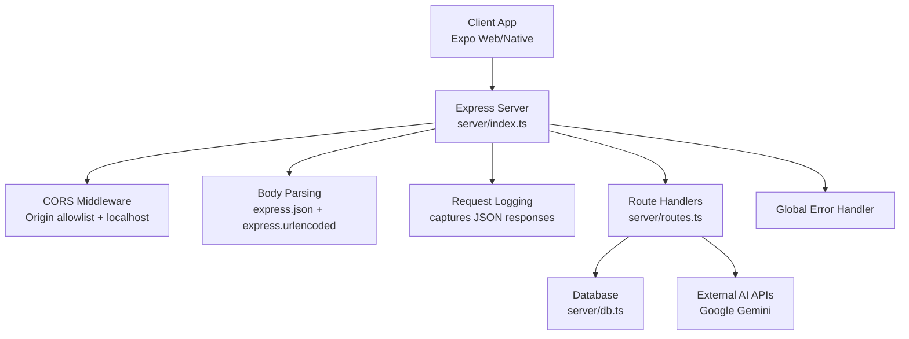
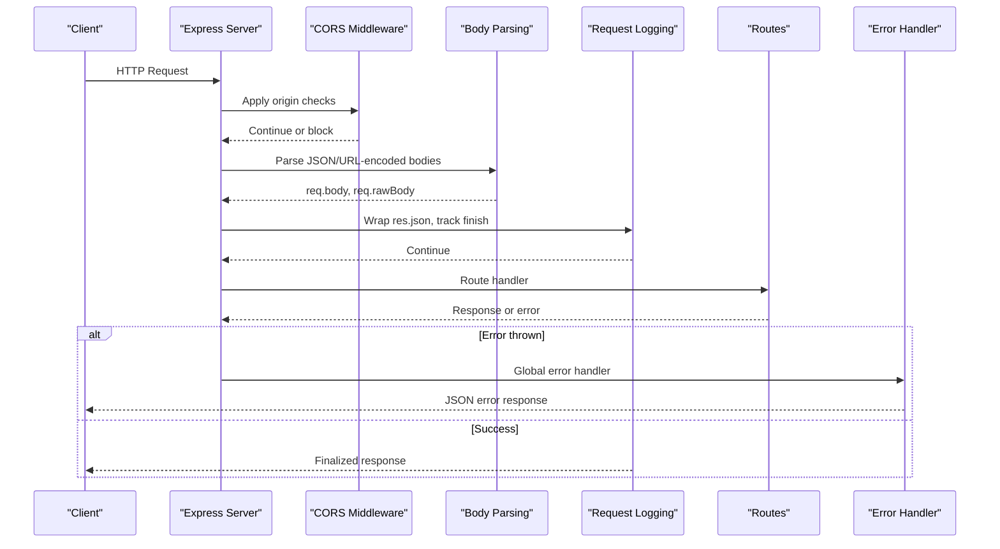
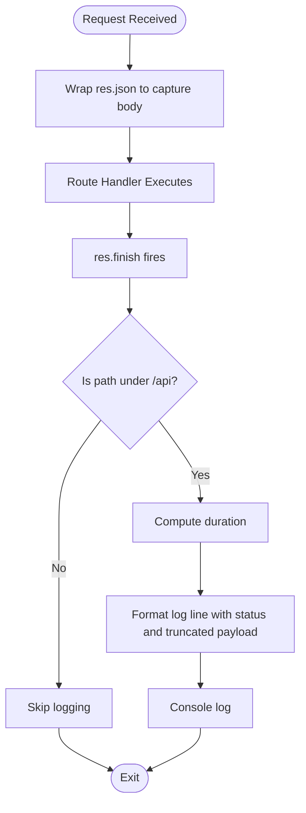
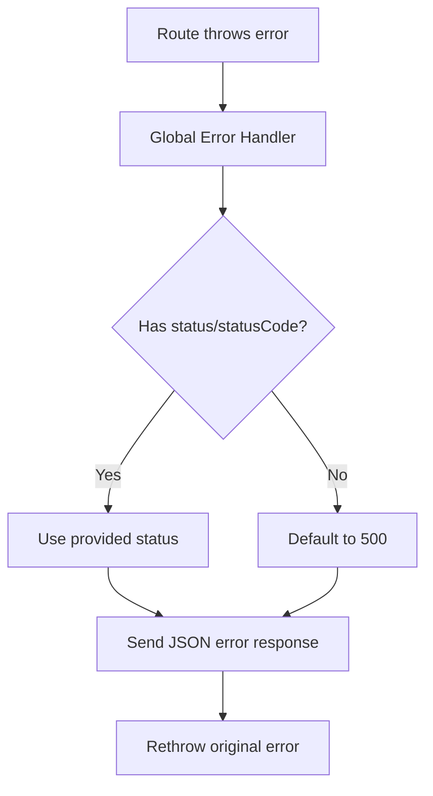
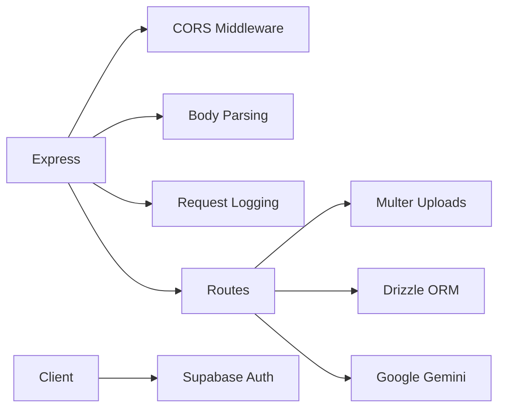

# Middleware and Security

<cite>
**Referenced Files in This Document**
- [server/index.ts](file://server/index.ts)
- [server/routes.ts](file://server/routes.ts)
- [server/db.ts](file://server/db.ts)
- [shared/schema.ts](file://shared/schema.ts)
- [server/replit_integrations/batch/utils.ts](file://server/replit_integrations/batch/utils.ts)
- [client/lib/supabase.ts](file://client/lib/supabase.ts)
- [client/contexts/AuthContext.tsx](file://client/contexts/AuthContext.tsx)
- [ENVIRONMENT.md](file://ENVIRONMENT.md)
</cite>

## Table of Contents
1. [Introduction](#introduction)
2. [Project Structure](#project-structure)
3. [Core Components](#core-components)
4. [Architecture Overview](#architecture-overview)
5. [Detailed Component Analysis](#detailed-component-analysis)
6. [Dependency Analysis](#dependency-analysis)
7. [Performance Considerations](#performance-considerations)
8. [Troubleshooting Guide](#troubleshooting-guide)
9. [Conclusion](#conclusion)

## Introduction
This document explains the middleware stack and security implementation patterns in the backend server, focusing on CORS configuration, request logging with response capture, error handling, input validation, rate limiting strategies, request size limits, content type validation, and authentication/session management. It also outlines how these components integrate with the frontend authentication flow.

## Project Structure
The server is an Express application that registers routes, applies middleware, and serves static assets for the Expo client. The middleware stack includes CORS, body parsing, request logging, and error handling. Routes implement business logic and integrate with external services and the database.

**Diagram sources**
- [server/index.ts](file://server/index.ts#L16-L53)
- [server/index.ts](file://server/index.ts#L55-L65)
- [server/index.ts](file://server/index.ts#L67-L98)
- [server/routes.ts](file://server/routes.ts#L24-L492)
- [server/db.ts](file://server/db.ts#L1-L19)

**Section sources**
- [server/index.ts](file://server/index.ts#L1-L247)
- [server/routes.ts](file://server/routes.ts#L1-L493)
- [server/db.ts](file://server/db.ts#L1-L19)

## Core Components
- CORS middleware: Dynamically allows origins from environment variables and supports localhost for Expo web development.
- Body parsing middleware: Parses JSON and URL-encoded bodies and captures raw request bytes.
- Request logging middleware: Wraps response JSON serialization to capture and log responses for API paths with timing.
- Global error handler: Normalizes thrown errors to JSON responses with appropriate status codes.
- Route handlers: Implement CRUD, file uploads with size limits, and external service integrations.
- Input validation: Uses Zod-backed Drizzle schemas for strict insert/update shapes.
- Rate limiting utilities: Batch processing helpers with concurrency control and retry on rate limit errors.
- Authentication and sessions: Supabase client configuration and context for OAuth and session persistence.

**Section sources**
- [server/index.ts](file://server/index.ts#L16-L53)
- [server/index.ts](file://server/index.ts#L55-L65)
- [server/index.ts](file://server/index.ts#L67-L98)
- [server/index.ts](file://server/index.ts#L207-L222)
- [server/routes.ts](file://server/routes.ts#L19-L22)
- [shared/schema.ts](file://shared/schema.ts#L78-L108)
- [server/replit_integrations/batch/utils.ts](file://server/replit_integrations/batch/utils.ts#L35-L109)
- [client/lib/supabase.ts](file://client/lib/supabase.ts#L1-L39)
- [client/contexts/AuthContext.tsx](file://client/contexts/AuthContext.tsx#L1-L31)

## Architecture Overview
The middleware stack is applied in a specific order to ensure consistent behavior across requests. CORS is applied first to handle preflight and origin checks. Body parsing follows to populate request bodies and raw bytes. Request logging wraps response serialization to capture outcomes. Route registration occurs next, followed by the global error handler.

**Diagram sources**
- [server/index.ts](file://server/index.ts#L16-L53)
- [server/index.ts](file://server/index.ts#L55-L65)
- [server/index.ts](file://server/index.ts#L67-L98)
- [server/index.ts](file://server/index.ts#L207-L222)
- [server/routes.ts](file://server/routes.ts#L24-L492)

## Detailed Component Analysis

### CORS Configuration and Multi-Environment Support
- Origins allowlist: Reads multiple domains from environment variables and adds them dynamically.
- Localhost support: Allows any localhost origin for Expo web development.
- Preflight handling: Responds to OPTIONS with 200 to enable cross-origin requests.
- Credentials: Enables Access-Control-Allow-Credentials for authenticated flows.

Implementation highlights:
- Origin detection and allowlist membership checks.
- Conditional header injection based on matched origin.
- Early exit for OPTIONS requests.

Operational guidance:
- For local development, ensure the client runs on localhost with any port.
- For production, configure the allowlist domains via environment variables so only trusted origins are permitted.

**Section sources**
- [server/index.ts](file://server/index.ts#L16-L53)

### Request Logging Middleware with Response Capture and Performance Monitoring
- Wraps res.json to intercept JSON responses for logging.
- Tracks request duration and logs method, path, status code, and truncated response payload.
- Ignores non-API paths to reduce noise.
- Captures raw response body for visibility into returned data.

**Diagram sources**
- [server/index.ts](file://server/index.ts#L67-L98)

**Section sources**
- [server/index.ts](file://server/index.ts#L67-L98)

### Error Handling Middleware and Status Code Management
- Global error handler normalizes thrown errors to JSON responses.
- Extracts status from error fields with a fallback to 500.
- Propagates the original error after responding to maintain error lifecycle.

**Diagram sources**
- [server/index.ts](file://server/index.ts#L207-L222)

**Section sources**
- [server/index.ts](file://server/index.ts#L207-L222)

### Input Validation Patterns and Data Integrity
- Database schemas define strict column types and constraints.
- Zod-backed insert schemas are generated from Drizzle tables to enforce shape and omit auto-generated fields.
- Route handlers use these schemas to validate incoming data before database operations.

Validation coverage:
- User creation and settings updates.
- Stash item inserts and updates.
- Articles and chat message inserts.

**Section sources**
- [shared/schema.ts](file://shared/schema.ts#L78-L108)
- [server/routes.ts](file://server/routes.ts#L99-L127)

### Content Type Validation and Request Size Limits
- Multer configuration enforces a 10 MB file size limit for multipart uploads.
- Memory storage is used for image analysis endpoints.
- Route handlers validate presence of required fields and handle missing credentials explicitly.

Practical implications:
- Large file uploads are rejected early to protect server resources.
- Image analysis endpoints expect two fields with bounded sizes.

**Section sources**
- [server/routes.ts](file://server/routes.ts#L19-L22)
- [server/routes.ts](file://server/routes.ts#L140-L143)
- [server/routes.ts](file://server/routes.ts#L228-L235)

### Rate Limiting Strategies and Retry Behavior
- Batch processing utilities provide concurrency control and exponential backoff retries.
- Detection of rate limit/quota violations enables targeted retry logic while aborting non-recoverable errors.
- SSE streaming variant supports progress reporting and graceful failure handling.

Recommendations:
- Use concurrency limits aligned with external API quotas.
- Configure retry delays to respect provider limits and avoid cascading failures.

**Section sources**
- [server/replit_integrations/batch/utils.ts](file://server/replit_integrations/batch/utils.ts#L35-L109)
- [server/replit_integrations/batch/utils.ts](file://server/replit_integrations/batch/utils.ts#L114-L160)

### Authentication Middleware Patterns and Session Management
- Supabase client is configured with platform-aware storage and OAuth options.
- Redirect URLs adapt to web vs. native environments.
- Authentication context exposes sign-in/sign-up/sign-out flows and session state.

Integration points:
- Frontend uses Supabase for OAuth with Google.
- Session persistence is handled differently per platform (web vs. native storage).
- The backend does not implement custom session cookies; authentication relies on Supabase.

**Section sources**
- [client/lib/supabase.ts](file://client/lib/supabase.ts#L1-L39)
- [client/contexts/AuthContext.tsx](file://client/contexts/AuthContext.tsx#L1-L31)

### Database Security and SSL Configuration
- Database connection uses environment-provided URL.
- SSL is configured with relaxed enforcement for compatibility in development contexts.

Security note:
- In production, ensure SSL is enabled and certificate verification is enforced.

**Section sources**
- [server/db.ts](file://server/db.ts#L7-L16)

### Environment Variables and Security Keys
- Supabase credentials are exposed to the frontend via public variables and used for authentication.
- Server-side keys are managed as secrets.
- Session secret is documented for secure cookie signing.

**Section sources**
- [ENVIRONMENT.md](file://ENVIRONMENT.md#L23-L38)

## Dependency Analysis
The server middleware and routes depend on:
- Express for HTTP handling and middleware composition.
- Multer for controlled file uploads.
- Drizzle ORM and Zod for schema-driven validation.
- External AI services for content analysis.
- Supabase for authentication and session management.

**Diagram sources**
- [server/index.ts](file://server/index.ts#L16-L53)
- [server/index.ts](file://server/index.ts#L55-L65)
- [server/index.ts](file://server/index.ts#L67-L98)
- [server/routes.ts](file://server/routes.ts#L19-L22)
- [shared/schema.ts](file://shared/schema.ts#L1-L122)
- [client/lib/supabase.ts](file://client/lib/supabase.ts#L1-L39)

**Section sources**
- [server/index.ts](file://server/index.ts#L1-L247)
- [server/routes.ts](file://server/routes.ts#L1-L493)
- [shared/schema.ts](file://shared/schema.ts#L1-L122)
- [client/lib/supabase.ts](file://client/lib/supabase.ts#L1-L39)

## Performance Considerations
- Request logging captures response payloads and durations; keep log verbosity appropriate for production to avoid overhead.
- Multer memory storage is efficient for small images but consider disk storage for very large files to reduce memory pressure.
- Batch processing utilities balance throughput with rate limit compliance; tune concurrency and retry parameters based on provider quotas.
- Database connections rely on environment configuration; ensure connection pooling and SSL settings align with deployment requirements.

[No sources needed since this section provides general guidance]

## Troubleshooting Guide
- CORS blocked requests: Verify allowlist domains and localhost origins are correctly configured; confirm preflight OPTIONS requests are handled.
- Excessive logging: Adjust log truncation thresholds or disable response payload logging in production.
- Rate limit errors: Review batch concurrency and retry settings; monitor provider quotas and adjust accordingly.
- Authentication issues: Confirm Supabase credentials are set and redirect URLs match the platform; check session persistence behavior across platforms.
- Database connectivity: Ensure DATABASE_URL is present and SSL settings are appropriate for the environment.

**Section sources**
- [server/index.ts](file://server/index.ts#L16-L53)
- [server/index.ts](file://server/index.ts#L67-L98)
- [server/replit_integrations/batch/utils.ts](file://server/replit_integrations/batch/utils.ts#L35-L109)
- [client/lib/supabase.ts](file://client/lib/supabase.ts#L1-L39)
- [server/db.ts](file://server/db.ts#L7-L16)

## Conclusion
The server implements a clear middleware stack with CORS, body parsing, request logging, and global error handling. Input validation leverages Zod-backed schemas, and external integrations use controlled upload sizes and robust retry logic. Authentication is delegated to Supabase with platform-aware session management. These patterns collectively provide a secure, observable, and maintainable backend foundation.