# Route Registration System

<cite>
**Referenced Files in This Document**
- [server/index.ts](file://server/index.ts)
- [server/routes.ts](file://server/routes.ts)
- [server/db.ts](file://server/db.ts)
- [server/storage.ts](file://server/storage.ts)
- [shared/schema.ts](file://shared/schema.ts)
- [server/replit_integrations/chat/routes.ts](file://server/replit_integrations/chat/routes.ts)
- [server/replit_integrations/image/routes.ts](file://server/replit_integrations/image/routes.ts)
- [server/replit_integrations/chat/index.ts](file://server/replit_integrations/chat/index.ts)
- [server/replit_integrations/image/index.ts](file://server/replit_integrations/image/index.ts)
- [server/replit_integrations/batch/utils.ts](file://server/replit_integrations/batch/utils.ts)
- [client/lib/marketplace.ts](file://client/lib/marketplace.ts)
- [client/lib/supabase.ts](file://client/lib/supabase.ts)
- [client/contexts/AuthContext.tsx](file://client/contexts/AuthContext.tsx)
</cite>

## Table of Contents
1. [Introduction](#introduction)
2. [Project Structure](#project-structure)
3. [Core Components](#core-components)
4. [Architecture Overview](#architecture-overview)
5. [Detailed Component Analysis](#detailed-component-analysis)
6. [Dependency Analysis](#dependency-analysis)
7. [Performance Considerations](#performance-considerations)
8. [Troubleshooting Guide](#troubleshooting-guide)
9. [Conclusion](#conclusion)

## Introduction
This document describes the modular route registration system powering the backend APIs. It explains how routes are dynamically registered using a factory-like pattern, how functionality is grouped into cohesive modules, and how middleware is applied consistently. The system organizes routes around core domains: content management (articles), personal collection management (stash), AI-powered analysis, marketplace publishing (WooCommerce and eBay), and chat-based AI interactions. The document also covers parameter validation, request/response handling, error propagation, and response formatting standards used across the application.

## Project Structure
The server initializes middleware and delegates route registration to a dedicated factory-style function. Route groups are organized under a single module per domain, enabling clear separation of concerns and maintainability.

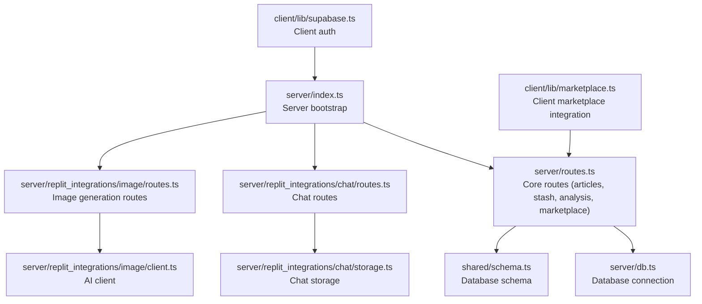

**Diagram sources**
- [server/index.ts](file://server/index.ts#L224-L246)
- [server/routes.ts](file://server/routes.ts#L24-L492)
- [server/db.ts](file://server/db.ts#L1-L19)
- [shared/schema.ts](file://shared/schema.ts#L1-L122)
- [server/replit_integrations/chat/routes.ts](file://server/replit_integrations/chat/routes.ts#L1-L126)
- [server/replit_integrations/image/routes.ts](file://server/replit_integrations/image/routes.ts#L1-L41)
- [client/lib/marketplace.ts](file://client/lib/marketplace.ts#L1-L129)
- [client/lib/supabase.ts](file://client/lib/supabase.ts#L1-L39)

**Section sources**
- [server/index.ts](file://server/index.ts#L1-L247)
- [server/routes.ts](file://server/routes.ts#L1-L493)
- [server/db.ts](file://server/db.ts#L1-L19)
- [shared/schema.ts](file://shared/schema.ts#L1-L122)

## Core Components
- Route registration factory: The server delegates route registration to a function that returns an HTTP server instance after mounting all routes. This enables centralized initialization and consistent middleware application.
- Middleware stack: CORS, body parsing, request logging, Expo manifest and landing page handling, and global error handling are applied before route registration.
- Modular route groups: Routes are grouped by domain (articles, stash, marketplace, chat, image generation) to improve maintainability and scalability.
- Data access: Drizzle ORM connects to PostgreSQL via a managed pool, with typed schemas from shared definitions.
- Storage abstractions: In-memory storage interface and implementation demonstrate a factory-like abstraction for persistence.

**Section sources**
- [server/index.ts](file://server/index.ts#L224-L246)
- [server/routes.ts](file://server/routes.ts#L24-L492)
- [server/db.ts](file://server/db.ts#L1-L19)
- [server/storage.ts](file://server/storage.ts#L1-L39)
- [shared/schema.ts](file://shared/schema.ts#L1-L122)

## Architecture Overview
The system follows a layered architecture:
- Presentation layer: Express server with middleware and route handlers.
- Domain layer: Route modules encapsulate business logic for articles, stash, marketplace publishing, and AI integrations.
- Persistence layer: Drizzle ORM with PostgreSQL and shared schema definitions.
- Client integration: Marketplace publishing utilities and Supabase-based authentication.

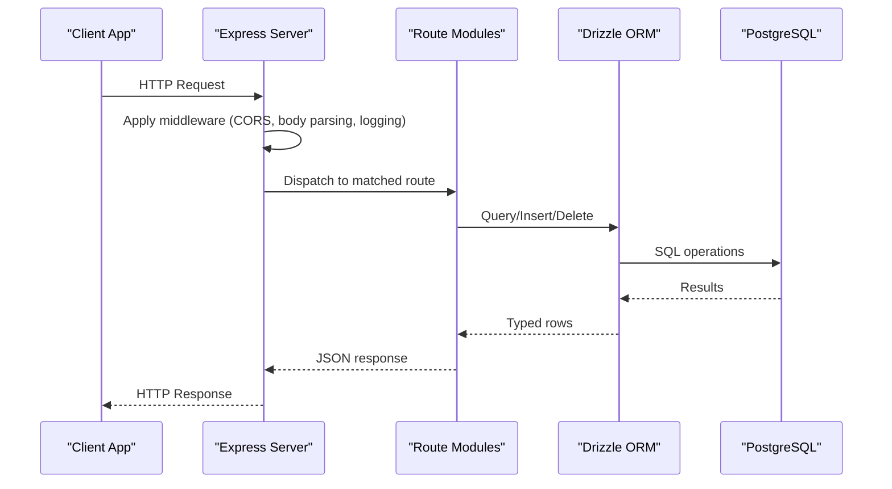

**Diagram sources**
- [server/index.ts](file://server/index.ts#L224-L246)
- [server/routes.ts](file://server/routes.ts#L24-L492)
- [server/db.ts](file://server/db.ts#L1-L19)
- [shared/schema.ts](file://shared/schema.ts#L1-L122)

## Detailed Component Analysis

### Route Registration Factory Pattern
The server initializes middleware and delegates route registration to a factory-style function that mounts endpoints and returns the HTTP server. This pattern centralizes startup logic and allows easy extension with new route groups.

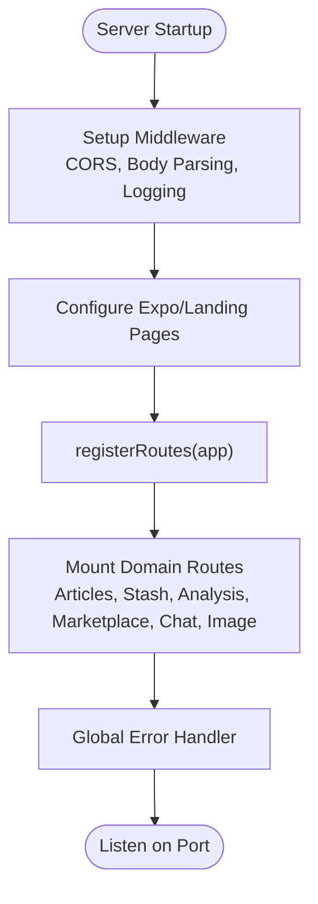

**Diagram sources**
- [server/index.ts](file://server/index.ts#L224-L246)
- [server/routes.ts](file://server/routes.ts#L24-L492)

**Section sources**
- [server/index.ts](file://server/index.ts#L224-L246)

### Articles Management Routes
Endpoints provide listing and retrieval of articles, with robust error handling and consistent JSON responses.

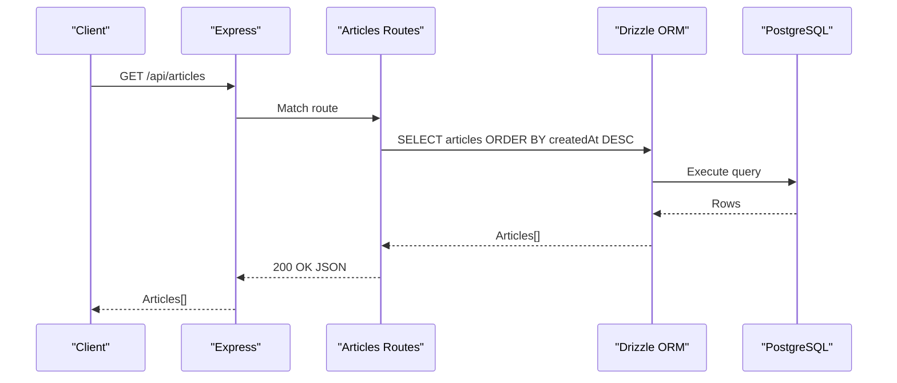

**Diagram sources**
- [server/routes.ts](file://server/routes.ts#L25-L36)
- [server/db.ts](file://server/db.ts#L1-L19)
- [shared/schema.ts](file://shared/schema.ts#L52-L62)

**Section sources**
- [server/routes.ts](file://server/routes.ts#L25-L55)
- [shared/schema.ts](file://shared/schema.ts#L52-L62)

### Stash Management Routes
Endpoints support listing, retrieving, creating, and deleting stash items, with validation and consistent error responses.

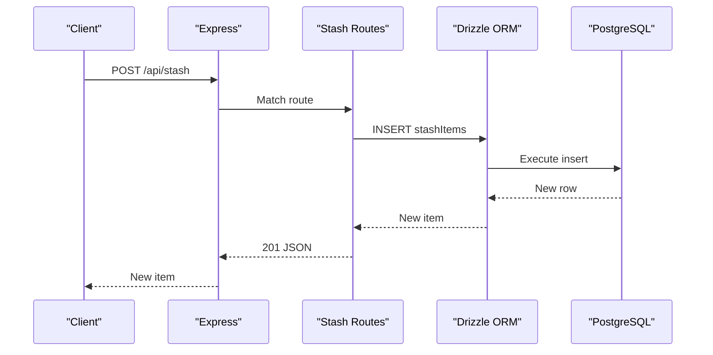

**Diagram sources**
- [server/routes.ts](file://server/routes.ts#L99-L127)
- [server/db.ts](file://server/db.ts#L1-L19)
- [shared/schema.ts](file://shared/schema.ts#L29-L50)

**Section sources**
- [server/routes.ts](file://server/routes.ts#L57-L138)
- [shared/schema.ts](file://shared/schema.ts#L29-L50)

### AI-Powered Analysis Route
The analysis endpoint accepts multipart images, constructs a structured prompt, and returns AI-generated insights with fallback handling.

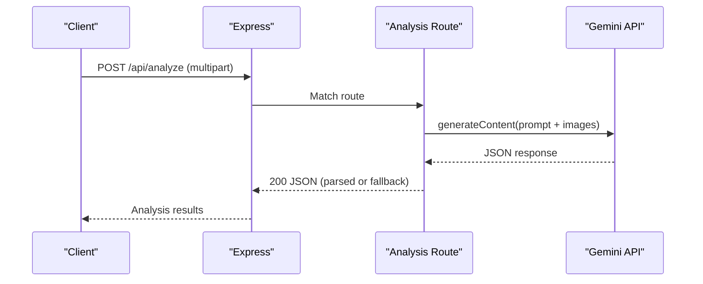

**Diagram sources**
- [server/routes.ts](file://server/routes.ts#L140-L226)

**Section sources**
- [server/routes.ts](file://server/routes.ts#L140-L226)

### Marketplace Publishing Routes
Two marketplace publishing endpoints demonstrate standardized validation, external API integration, and consistent response formatting.

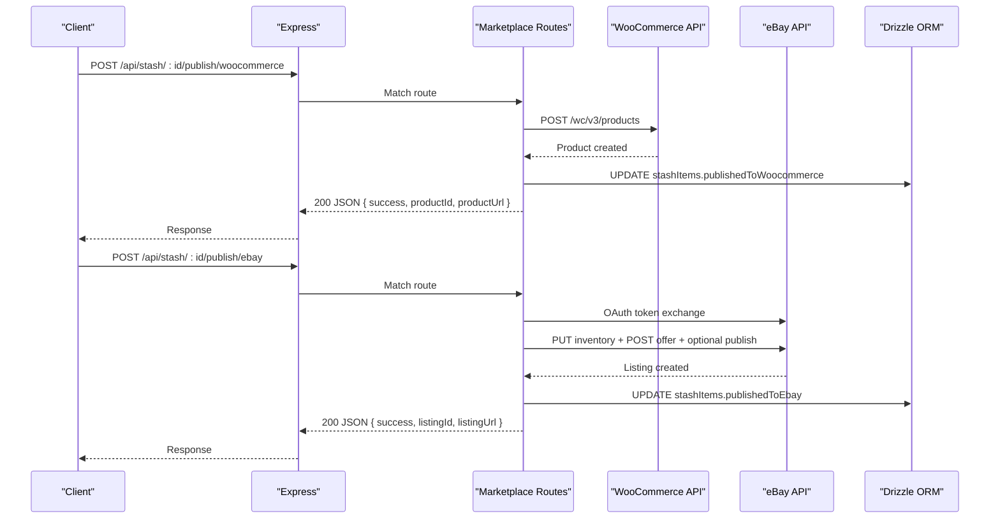

**Diagram sources**
- [server/routes.ts](file://server/routes.ts#L228-L488)
- [server/db.ts](file://server/db.ts#L1-L19)
- [shared/schema.ts](file://shared/schema.ts#L29-L50)

**Section sources**
- [server/routes.ts](file://server/routes.ts#L228-L488)

### Chat AI Routes (Streaming)
The chat routes implement conversation lifecycle management and streaming AI responses using Server-Sent Events.

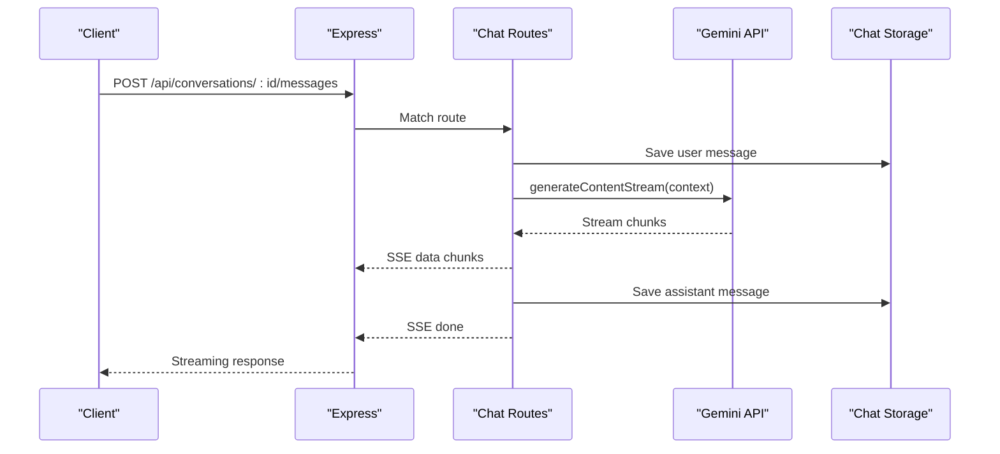

**Diagram sources**
- [server/replit_integrations/chat/routes.ts](file://server/replit_integrations/chat/routes.ts#L71-L123)

**Section sources**
- [server/replit_integrations/chat/routes.ts](file://server/replit_integrations/chat/routes.ts#L1-L126)

### Image Generation Route
The image generation route validates input, calls the AI model, and returns base64-encoded image data with MIME type.

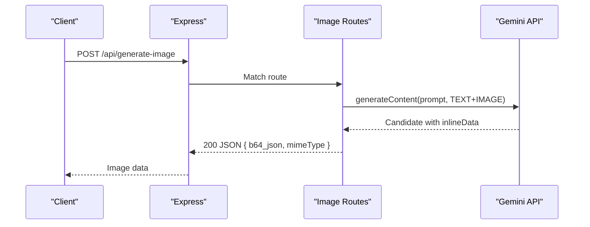

**Diagram sources**
- [server/replit_integrations/image/routes.ts](file://server/replit_integrations/image/routes.ts#L6-L38)

**Section sources**
- [server/replit_integrations/image/routes.ts](file://server/replit_integrations/image/routes.ts#L1-L41)

### Middleware Application Patterns
- CORS: Dynamic origin allowlist with localhost support for development.
- Body parsing: JSON and URL-encoded bodies with rawBody capture for signature verification.
- Request logging: Intercepts response JSON to log structured logs for API paths.
- Expo/Landing pages: Serves manifests and landing page HTML based on headers and paths.
- Global error handler: Normalizes thrown errors to JSON responses with appropriate status codes.

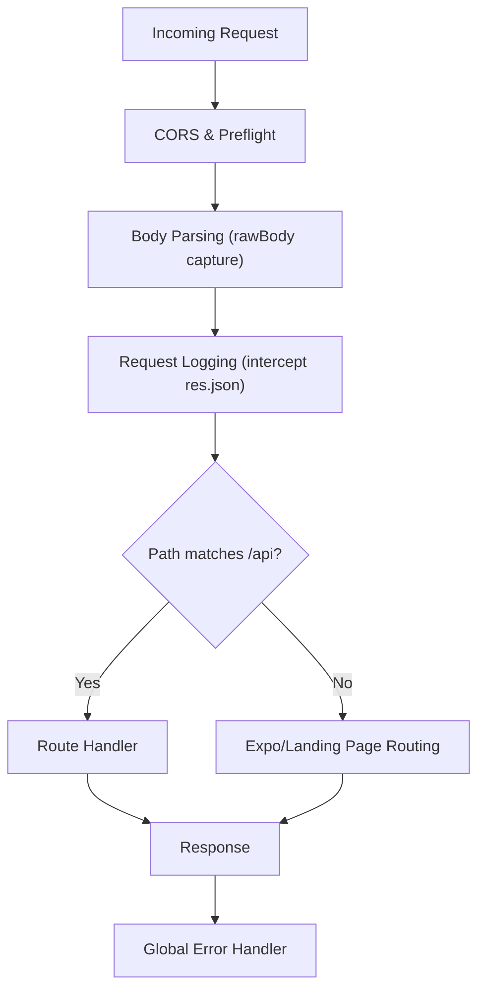

**Diagram sources**
- [server/index.ts](file://server/index.ts#L16-L98)
- [server/index.ts](file://server/index.ts#L163-L205)
- [server/index.ts](file://server/index.ts#L207-L222)

**Section sources**
- [server/index.ts](file://server/index.ts#L16-L98)
- [server/index.ts](file://server/index.ts#L163-L205)
- [server/index.ts](file://server/index.ts#L207-L222)

### Parameter Validation and Request/Response Handling
- Path parameters: Integer parsing with 404 handling for missing resources.
- Request bodies: Structured validation via schema-driven insert schemas; marketplace routes validate credentials presence.
- Responses: Consistent JSON envelopes with either data payload or error object; status codes reflect intent (200, 201, 204, 400, 404, 500).
- Streaming: SSE for chat responses; fallback to JSON for non-streaming routes.

**Section sources**
- [server/routes.ts](file://server/routes.ts#L38-L55)
- [server/routes.ts](file://server/routes.ts#L228-L296)
- [server/routes.ts](file://server/routes.ts#L298-L488)
- [server/replit_integrations/chat/routes.ts](file://server/replit_integrations/chat/routes.ts#L71-L123)

### Authentication Guards and Client Integration
- Client-side authentication: Supabase client configuration with platform-aware storage and redirect URL handling.
- Marketplace integration: Client utilities fetch stored credentials and invoke marketplace endpoints with standardized error handling.
- Context provider: React context exposes session and auth actions for UI components.

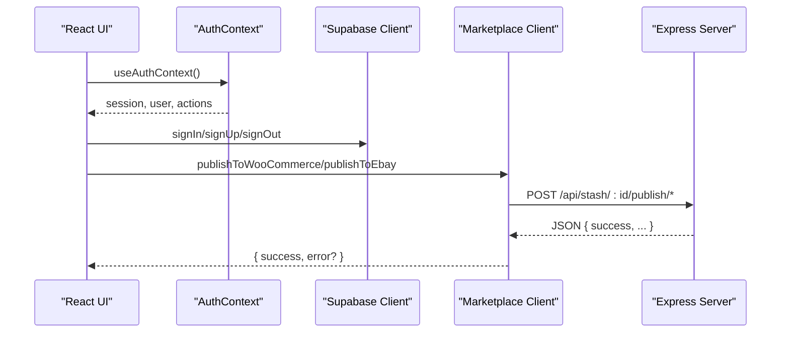

**Diagram sources**
- [client/lib/supabase.ts](file://client/lib/supabase.ts#L1-L39)
- [client/contexts/AuthContext.tsx](file://client/contexts/AuthContext.tsx#L1-L31)
- [client/lib/marketplace.ts](file://client/lib/marketplace.ts#L81-L129)
- [server/routes.ts](file://server/routes.ts#L228-L488)

**Section sources**
- [client/lib/supabase.ts](file://client/lib/supabase.ts#L1-L39)
- [client/contexts/AuthContext.tsx](file://client/contexts/AuthContext.tsx#L1-L31)
- [client/lib/marketplace.ts](file://client/lib/marketplace.ts#L1-L129)

### Storage Abstractions (Factory Pattern Example)
The storage module defines an interface and an in-memory implementation, demonstrating a factory-like abstraction suitable for swapping persistence backends.

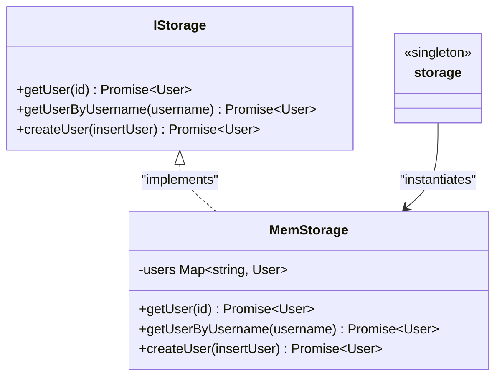

**Diagram sources**
- [server/storage.ts](file://server/storage.ts#L7-L39)

**Section sources**
- [server/storage.ts](file://server/storage.ts#L1-L39)

### Batch Processing Utilities
The batch utilities module provides concurrency control and retry logic for AI workloads, supporting both promise-based and SSE streaming modes.

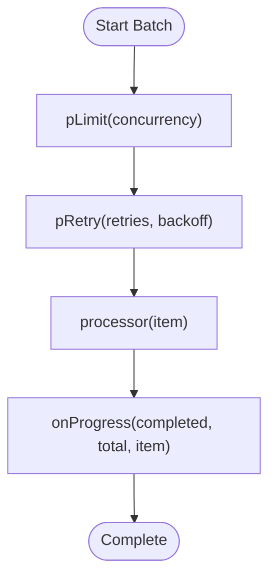

**Diagram sources**
- [server/replit_integrations/batch/utils.ts](file://server/replit_integrations/batch/utils.ts#L69-L109)

**Section sources**
- [server/replit_integrations/batch/utils.ts](file://server/replit_integrations/batch/utils.ts#L1-L161)

## Dependency Analysis
The route modules depend on shared schemas and database access, while client-side modules integrate with server endpoints and authentication providers.

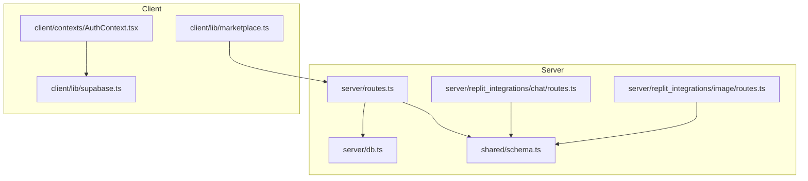

**Diagram sources**
- [server/routes.ts](file://server/routes.ts#L1-L493)
- [server/db.ts](file://server/db.ts#L1-L19)
- [shared/schema.ts](file://shared/schema.ts#L1-L122)
- [server/replit_integrations/chat/routes.ts](file://server/replit_integrations/chat/routes.ts#L1-L126)
- [server/replit_integrations/image/routes.ts](file://server/replit_integrations/image/routes.ts#L1-L41)
- [client/lib/marketplace.ts](file://client/lib/marketplace.ts#L1-L129)
- [client/lib/supabase.ts](file://client/lib/supabase.ts#L1-L39)
- [client/contexts/AuthContext.tsx](file://client/contexts/AuthContext.tsx#L1-L31)

**Section sources**
- [server/routes.ts](file://server/routes.ts#L1-L493)
- [shared/schema.ts](file://shared/schema.ts#L1-L122)
- [client/lib/marketplace.ts](file://client/lib/marketplace.ts#L1-L129)

## Performance Considerations
- Concurrency control: Use the batch utilities to limit concurrent AI requests and apply exponential backoff for rate-limited scenarios.
- Request size limits: Multer configuration restricts uploaded file sizes; adjust as needed for image-heavy workflows.
- Database pooling: Drizzle uses a managed pool; ensure DATABASE_URL is configured for production scaling.
- Streaming responses: Prefer SSE for long-running AI tasks to reduce latency and improve UX.

[No sources needed since this section provides general guidance]

## Troubleshooting Guide
- CORS issues: Verify origin allowlist and localhost allowances for development.
- Body parsing errors: Ensure Content-Type headers match expected formats; rawBody capture supports signature verification.
- Database connectivity: Confirm DATABASE_URL environment variable and SSL settings.
- Marketplace publishing failures: Validate credentials and account setup on target platforms; inspect returned error messages for actionable details.
- Global error handling: Errors are normalized to JSON with status codes; review logs for stack traces.

**Section sources**
- [server/index.ts](file://server/index.ts#L16-L53)
- [server/index.ts](file://server/index.ts#L55-L65)
- [server/db.ts](file://server/db.ts#L7-L9)
- [server/routes.ts](file://server/routes.ts#L228-L296)
- [server/index.ts](file://server/index.ts#L207-L222)

## Conclusion
The modular route registration system leverages a factory pattern to centralize route mounting and middleware application. Functionality is cleanly grouped into domain-specific modules, with consistent validation, error handling, and response formatting. The integration with Supabase and marketplace APIs demonstrates practical patterns for authentication and third-party publishing. The batch utilities provide scalable patterns for AI workloads, while the storage abstraction supports flexible persistence strategies.