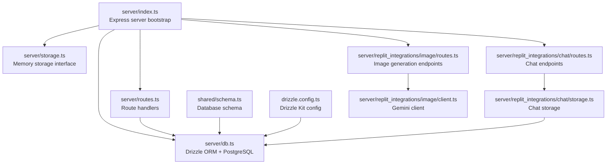
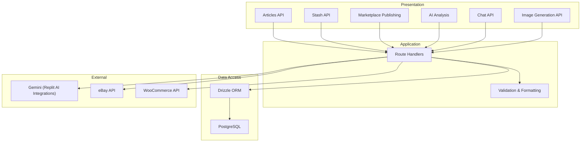
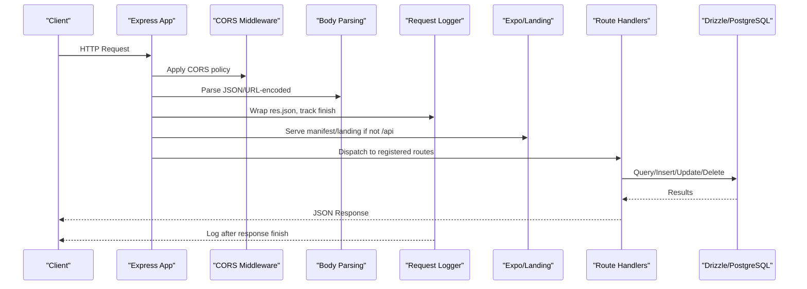
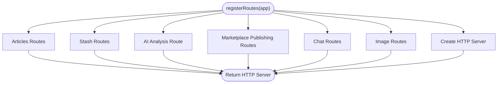
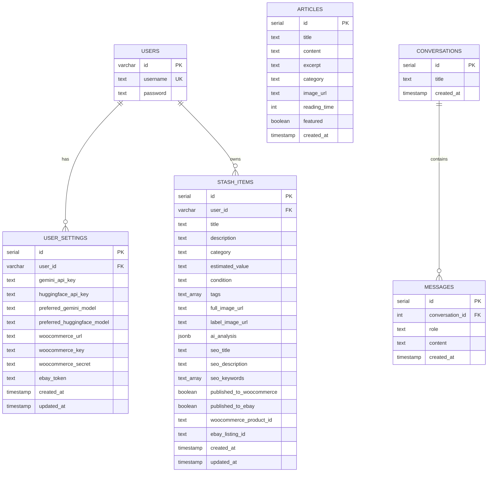
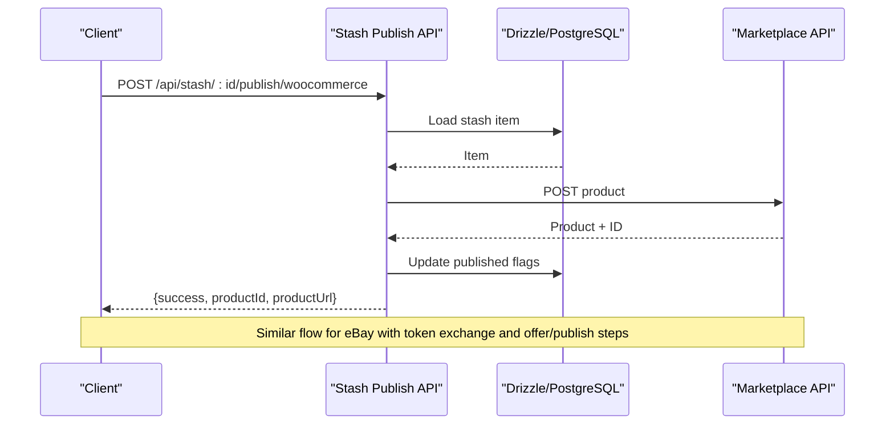
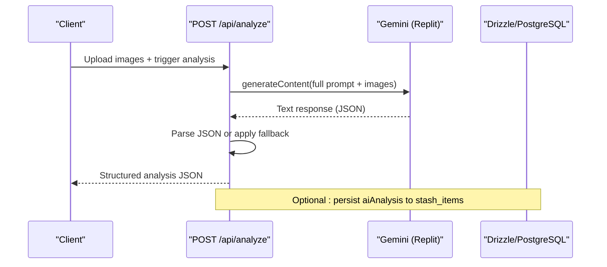
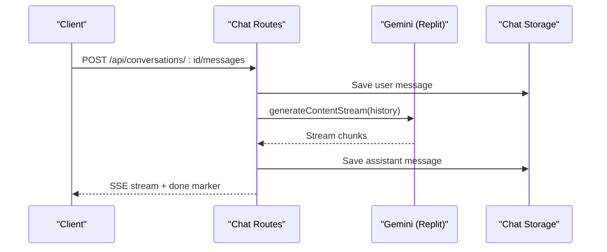
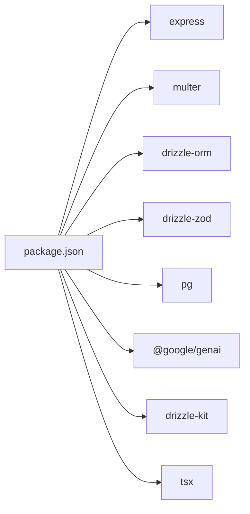
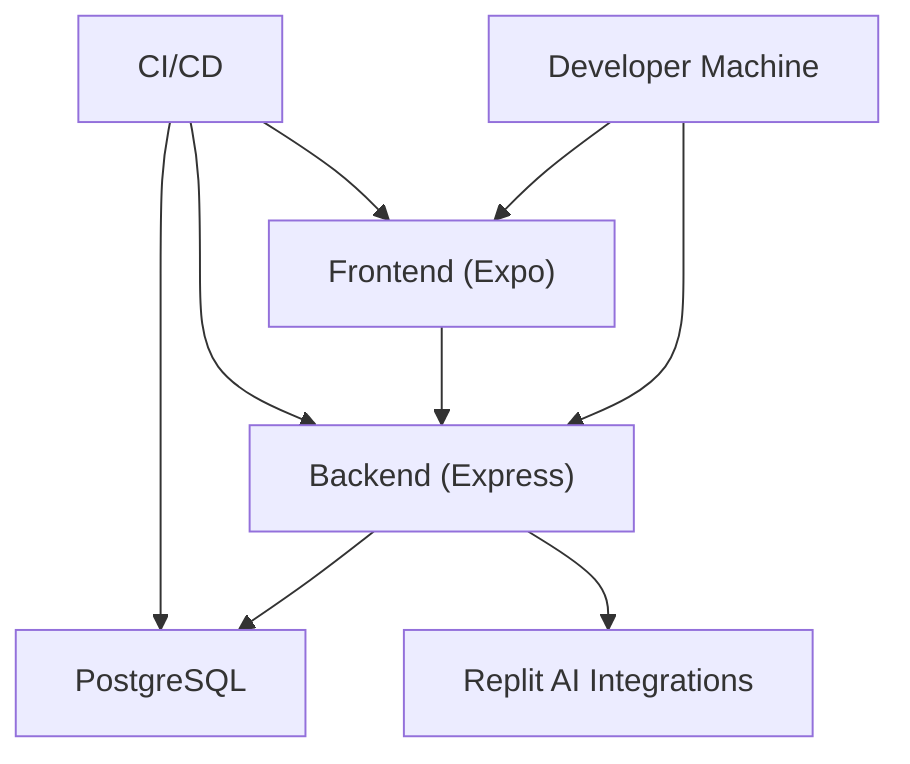

# Server-Side Architecture

<cite>
**Referenced Files in This Document**
- [server/index.ts](file://server/index.ts)
- [server/routes.ts](file://server/routes.ts)
- [server/db.ts](file://server/db.ts)
- [drizzle.config.ts](file://drizzle.config.ts)
- [shared/schema.ts](file://shared/schema.ts)
- [ENVIRONMENT.md](file://ENVIRONMENT.md)
- [server/storage.ts](file://server/storage.ts)
- [server/replit_integrations/chat/routes.ts](file://server/replit_integrations/chat/routes.ts)
- [server/replit_integrations/chat/storage.ts](file://server/replit_integrations/chat/storage.ts)
- [server/replit_integrations/image/client.ts](file://server/replit_integrations/image/client.ts)
- [server/replit_integrations/image/routes.ts](file://server/replit_integrations/image/routes.ts)
- [package.json](file://package.json)
</cite>

## Table of Contents
1. [Introduction](#introduction)
2. [Project Structure](#project-structure)
3. [Core Components](#core-components)
4. [Architecture Overview](#architecture-overview)
5. [Detailed Component Analysis](#detailed-component-analysis)
6. [Dependency Analysis](#dependency-analysis)
7. [Performance Considerations](#performance-considerations)
8. [Security Considerations](#security-considerations)
9. [Deployment Architecture](#deployment-architecture)
10. [Troubleshooting Guide](#troubleshooting-guide)
11. [Conclusion](#conclusion)

## Introduction
This document describes the server-side architecture of the Hidden-Gem Express.js backend API server. It covers server initialization, middleware configuration (CORS, logging, body parsing), modular route registration, database integration with Drizzle ORM and PostgreSQL, API endpoint organization (item analysis, stash management, marketplace integration, content management), error handling, request validation, authentication considerations, response formatting, security, rate limiting, performance optimization, and deployment architecture with environment configuration management.

## Project Structure
The server is organized around a small set of focused modules:
- Entry point initializes the Express app, applies middleware, registers routes, and starts the HTTP server.
- Routes module defines API endpoints for articles, stash items, marketplace publishing, and AI-powered analysis.
- Database module configures Drizzle ORM with a PostgreSQL connection pool.
- Shared schema defines database tables and Zod insert schemas for validation.
- Replit integrations provide AI chat and image generation endpoints backed by Gemini via Replit AI Integrations.
- Environment configuration and scripts are documented for local development and deployment.

**Diagram sources**
- [server/index.ts](file://server/index.ts#L1-L247)
- [server/routes.ts](file://server/routes.ts#L1-L493)
- [server/db.ts](file://server/db.ts#L1-L19)
- [shared/schema.ts](file://shared/schema.ts#L1-L122)
- [drizzle.config.ts](file://drizzle.config.ts#L1-L15)
- [server/storage.ts](file://server/storage.ts#L1-L39)
- [server/replit_integrations/chat/routes.ts](file://server/replit_integrations/chat/routes.ts#L1-L126)
- [server/replit_integrations/chat/storage.ts](file://server/replit_integrations/chat/storage.ts#L1-L44)
- [server/replit_integrations/image/routes.ts](file://server/replit_integrations/image/routes.ts#L1-L41)
- [server/replit_integrations/image/client.ts](file://server/replit_integrations/image/client.ts#L1-L38)

**Section sources**
- [server/index.ts](file://server/index.ts#L1-L247)
- [server/routes.ts](file://server/routes.ts#L1-L493)
- [server/db.ts](file://server/db.ts#L1-L19)
- [shared/schema.ts](file://shared/schema.ts#L1-L122)
- [drizzle.config.ts](file://drizzle.config.ts#L1-L15)
- [ENVIRONMENT.md](file://ENVIRONMENT.md#L1-L219)

## Core Components
- Express server bootstrap and middleware pipeline:
  - CORS setup supports Replit domains and localhost for Expo web development.
  - Body parsing captures raw request bodies and parses JSON/URL-encoded payloads.
  - Request logging records API calls with response payloads and durations.
  - Expo manifest and landing page serving for static builds.
  - Global error handler normalizes errors to JSON responses.
- Modular route registration:
  - Articles endpoints for listing and retrieving content.
  - Stash endpoints for CRUD operations, counts, and publishing to marketplaces.
  - AI-powered item analysis supporting image uploads and Gemini integration.
  - Marketplace publishing endpoints for WooCommerce and eBay.
  - Replit AI integrations for chat and image generation.
- Database integration:
  - Drizzle ORM with PostgreSQL via a connection pool.
  - Shared schema with typed inserts and validations.
- Storage abstraction:
  - Memory-backed storage interface for users (placeholder for future Supabase integration).

**Section sources**
- [server/index.ts](file://server/index.ts#L16-L98)
- [server/index.ts](file://server/index.ts#L163-L205)
- [server/index.ts](file://server/index.ts#L207-L222)
- [server/routes.ts](file://server/routes.ts#L24-L493)
- [server/db.ts](file://server/db.ts#L1-L19)
- [shared/schema.ts](file://shared/schema.ts#L1-L122)
- [server/storage.ts](file://server/storage.ts#L1-L39)

## Architecture Overview
The server follows a layered architecture:
- Presentation layer: Express routes grouped by feature (articles, stash, marketplace, AI).
- Application layer: Route handlers orchestrate data access and external integrations.
- Data access layer: Drizzle ORM queries against PostgreSQL.
- External integrations: AI APIs via Replit AI Integrations, marketplace APIs for eBay and WooCommerce.

**Diagram sources**
- [server/routes.ts](file://server/routes.ts#L24-L493)
- [server/replit_integrations/chat/routes.ts](file://server/replit_integrations/chat/routes.ts#L1-L126)
- [server/replit_integrations/image/routes.ts](file://server/replit_integrations/image/routes.ts#L1-L41)
- [server/db.ts](file://server/db.ts#L1-L19)

## Detailed Component Analysis

### Server Initialization and Middleware Pipeline
- CORS:
  - Dynamically whitelists Replit domains and allows localhost for Expo web dev.
  - Supports preflight OPTIONS and credentials.
- Body parsing:
  - Captures raw body for signature verification scenarios.
  - Parses JSON and URL-encoded forms.
- Logging:
  - Intercepts response JSON to capture payload for logging.
  - Logs only /api paths with method, path, status, duration, and compact payload.
- Expo and landing page:
  - Serves Expo manifests based on platform header.
  - Renders a landing page template with dynamic base URLs.
- Error handling:
  - Centralized handler converts thrown errors to JSON with appropriate status.

**Diagram sources**
- [server/index.ts](file://server/index.ts#L16-L98)
- [server/index.ts](file://server/index.ts#L163-L205)
- [server/index.ts](file://server/index.ts#L207-L222)

**Section sources**
- [server/index.ts](file://server/index.ts#L16-L98)
- [server/index.ts](file://server/index.ts#L163-L205)
- [server/index.ts](file://server/index.ts#L207-L222)

### Modular Route Registration System
- Articles:
  - GET /api/articles and GET /api/articles/:id.
- Stash:
  - GET /api/stash, GET /api/stash/count, GET /api/stash/:id, POST /api/stash, DELETE /api/stash/:id.
- AI Analysis:
  - POST /api/analyze with multipart image uploads and Gemini integration.
- Marketplace Publishing:
  - POST /api/stash/:id/publish/woocommerce and POST /api/stash/:id/publish/ebay.
- Replit AI Integrations:
  - Chat: GET/POST/DELETE conversations and streaming message generation.
  - Image: POST /api/generate-image.

**Diagram sources**
- [server/routes.ts](file://server/routes.ts#L24-L493)
- [server/replit_integrations/chat/routes.ts](file://server/replit_integrations/chat/routes.ts#L19-L124)
- [server/replit_integrations/image/routes.ts](file://server/replit_integrations/image/routes.ts#L5-L39)

**Section sources**
- [server/routes.ts](file://server/routes.ts#L24-L493)
- [server/replit_integrations/chat/routes.ts](file://server/replit_integrations/chat/routes.ts#L19-L124)
- [server/replit_integrations/image/routes.ts](file://server/replit_integrations/image/routes.ts#L5-L39)

### Database Integration with Drizzle ORM and PostgreSQL
- Connection:
  - Uses a PostgreSQL connection pool with DATABASE_URL from environment.
  - SSL configuration set to disable strict certificate validation.
- Schema:
  - Users, user_settings, stash_items, articles, conversations, messages.
  - Arrays for tags and SEO keywords; JSONB for AI analysis.
- Validation:
  - Drizzle-Zod insert schemas for robust request validation.
- Migration:
  - Drizzle Kit configuration pointing to shared schema and migrations directory.

**Diagram sources**
- [shared/schema.ts](file://shared/schema.ts#L6-L76)
- [drizzle.config.ts](file://drizzle.config.ts#L1-L15)
- [server/db.ts](file://server/db.ts#L1-L19)

**Section sources**
- [server/db.ts](file://server/db.ts#L1-L19)
- [shared/schema.ts](file://shared/schema.ts#L1-L122)
- [drizzle.config.ts](file://drizzle.config.ts#L1-L15)

### API Endpoint Organization

#### Articles Management
- Retrieve all articles ordered by creation date.
- Retrieve a single article by ID with 404 handling.

**Section sources**
- [server/routes.ts](file://server/routes.ts#L25-L55)

#### Stash Management
- List all stash items and count.
- Retrieve, create, and delete individual stash items.
- Publish to marketplace endpoints:
  - WooCommerce: validates credentials, posts product, updates local record.
  - eBay: handles OAuth token exchange, inventory creation, offer posting, and optional publishing.

**Diagram sources**
- [server/routes.ts](file://server/routes.ts#L228-L296)
- [server/routes.ts](file://server/routes.ts#L298-L488)

**Section sources**
- [server/routes.ts](file://server/routes.ts#L57-L97)
- [server/routes.ts](file://server/routes.ts#L228-L296)
- [server/routes.ts](file://server/routes.ts#L298-L488)

#### AI-Powered Item Analysis
- Accepts multipart images (full item and label).
- Sends combined prompt and images to Gemini via Replit AI Integrations.
- Returns structured JSON with title, description, category, value, condition, SEO fields, and tags.
- Includes fallback response if AI does not return valid JSON.

**Diagram sources**
- [server/routes.ts](file://server/routes.ts#L140-L226)

**Section sources**
- [server/routes.ts](file://server/routes.ts#L140-L226)

#### Content Management
- Articles table supports listing and retrieval for content consumption.

**Section sources**
- [server/routes.ts](file://server/routes.ts#L25-L55)
- [shared/schema.ts](file://shared/schema.ts#L52-L62)

#### Replit AI Integrations
- Chat:
  - Conversations CRUD and message streaming via Server-Sent Events.
  - Uses Gemini via Replit AI Integrations with streaming support.
- Image:
  - Generates images from prompts using a Gemini multimodal model.

**Diagram sources**
- [server/replit_integrations/chat/routes.ts](file://server/replit_integrations/chat/routes.ts#L72-L123)
- [server/replit_integrations/chat/storage.ts](file://server/replit_integrations/chat/storage.ts#L14-L42)
- [server/replit_integrations/image/routes.ts](file://server/replit_integrations/image/routes.ts#L6-L38)
- [server/replit_integrations/image/client.ts](file://server/replit_integrations/image/client.ts#L16-L36)

**Section sources**
- [server/replit_integrations/chat/routes.ts](file://server/replit_integrations/chat/routes.ts#L19-L124)
- [server/replit_integrations/chat/storage.ts](file://server/replit_integrations/chat/storage.ts#L14-L42)
- [server/replit_integrations/image/routes.ts](file://server/replit_integrations/image/routes.ts#L5-L39)
- [server/replit_integrations/image/client.ts](file://server/replit_integrations/image/client.ts#L1-L38)

### Data Access Patterns
- Select with ordering and counting for lists.
- Insert with returning for created resources.
- Update with selective fields for publishing flags and identifiers.
- Delete cascades for related messages when deleting conversations.

**Section sources**
- [server/routes.ts](file://server/routes.ts#L27-L36)
- [server/routes.ts](file://server/routes.ts#L103-L121)
- [server/routes.ts](file://server/routes.ts#L279-L285)
- [server/replit_integrations/chat/storage.ts](file://server/replit_integrations/chat/storage.ts#L20-L32)

### Request Validation and Response Formatting
- Validation:
  - Drizzle-Zod insert schemas for typed inserts.
  - Manual checks for marketplace credentials and existence of items.
- Response formatting:
  - Consistent JSON responses with compact logging.
  - Status codes reflect success, not found, bad request, or internal errors.

**Section sources**
- [shared/schema.ts](file://shared/schema.ts#L78-L108)
- [server/routes.ts](file://server/routes.ts#L233-L235)
- [server/routes.ts](file://server/routes.ts#L303-L311)
- [server/index.ts](file://server/index.ts#L74-L94)

### Authentication and Authorization Considerations
- Supabase authentication is configured for the frontend but not enforced in the backend routes shown here.
- Session secret is required for server-side sessions.
- Future enhancements could include JWT middleware and route guards.

**Section sources**
- [ENVIRONMENT.md](file://ENVIRONMENT.md#L23-L38)

## Dependency Analysis
- Express dependencies:
  - express, multer, http, fs, path.
- Database and schema:
  - drizzle-orm, drizzle-zod, pg, @shared/schema.
- AI integrations:
  - @google/genai via Replit AI Integrations.
- Development and tooling:
  - tsx, esbuild, drizzle-kit, ESLint, Prettier.

**Diagram sources**
- [package.json](file://package.json#L19-L84)

**Section sources**
- [package.json](file://package.json#L19-L84)

## Performance Considerations
- Connection pooling:
  - PostgreSQL pool configured via DATABASE_URL for efficient resource usage.
- Streaming responses:
  - Chat endpoints use Server-Sent Events to stream AI responses progressively.
- Image processing:
  - Multer memory storage with size limits for image uploads.
- Logging overhead:
  - JSON serialization of responses for logging is bounded by payload length.
- Recommendations:
  - Add rate limiting middleware for AI endpoints.
  - Implement caching for frequently accessed articles.
  - Use pagination for large lists (stash, articles).
  - Consider connection pool tuning and query indexing.

[No sources needed since this section provides general guidance]

## Security Considerations
- CORS:
  - Origin whitelisting and localhost allowance for development.
- Body parsing:
  - Raw body capture for potential signature verification.
- Secrets:
  - DATABASE_URL, Supabase keys, session secret, and marketplace credentials are environment-managed.
- AI integrations:
  - Gemini via Replit AI Integrations; ensure quotas and usage limits are monitored.
- Recommendations:
  - Enforce HTTPS in production.
  - Add rate limiting and input sanitization.
  - Rotate secrets regularly.
  - Validate marketplace credentials and scopes.

**Section sources**
- [server/index.ts](file://server/index.ts#L16-L53)
- [ENVIRONMENT.md](file://ENVIRONMENT.md#L12-L68)

## Deployment Architecture
- Local development:
  - Backend: tsx watches and restarts server on changes.
  - Frontend: Expo dev server on port 8081.
  - Database: Drizzle migrations applied via npm script.
- Production build:
  - Static Expo build and server bundling for production deployment.
- Environment configuration:
  - DATABASE_URL and Supabase keys managed via environment variables/secrets.
  - Replit AI Integrations provide Gemini access without self-hosted keys.

**Diagram sources**
- [ENVIRONMENT.md](file://ENVIRONMENT.md#L69-L113)
- [package.json](file://package.json#L5-L17)

**Section sources**
- [ENVIRONMENT.md](file://ENVIRONMENT.md#L69-L113)
- [package.json](file://package.json#L5-L17)

## Troubleshooting Guide
- Ports in use:
  - Backend runs on port 5000; frontend on 8081.
- Database connectivity:
  - Ensure DATABASE_URL is set and PostgreSQL is reachable.
- Hot reload issues:
  - Clear cache or restart dev servers.
- Supabase authentication failures:
  - Verify Supabase URL and keys; ensure secrets are configured in Replit.
- AI features:
  - Confirm AI_INTEGRATIONS_GEMINI_API_KEY and base URL are configured; check quotas.

**Section sources**
- [ENVIRONMENT.md](file://ENVIRONMENT.md#L172-L195)

## Conclusion
The server employs a clean, modular Express architecture with Drizzle ORM for PostgreSQL, comprehensive logging and CORS, and well-defined API endpoints for articles, stash management, marketplace publishing, and AI integrations. The design supports development workflows, integrates with Replit’s AI and database services, and provides a foundation for adding authentication, rate limiting, and advanced performance optimizations.