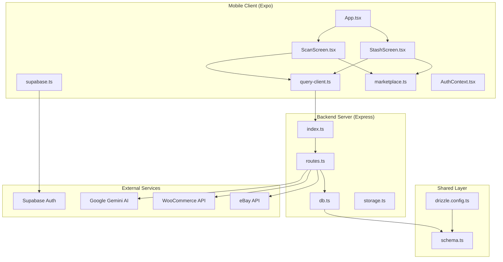
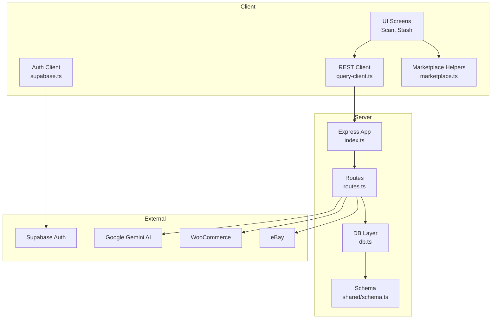
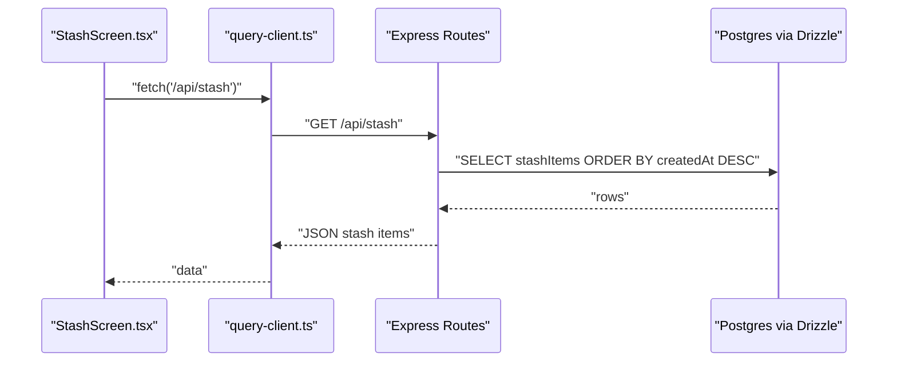
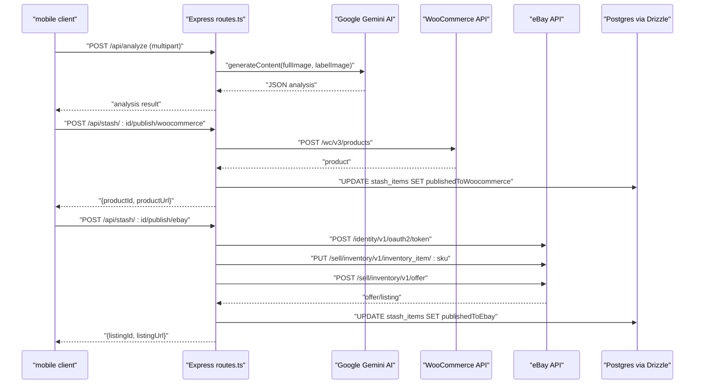
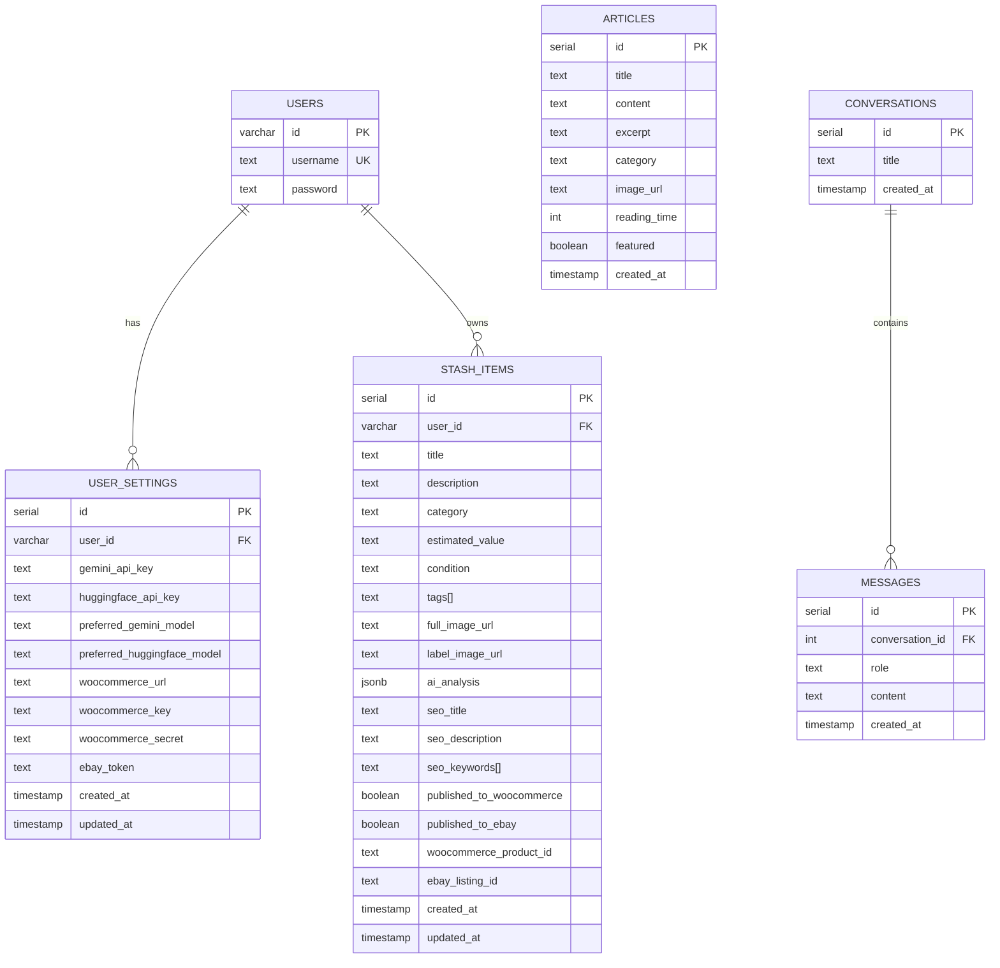
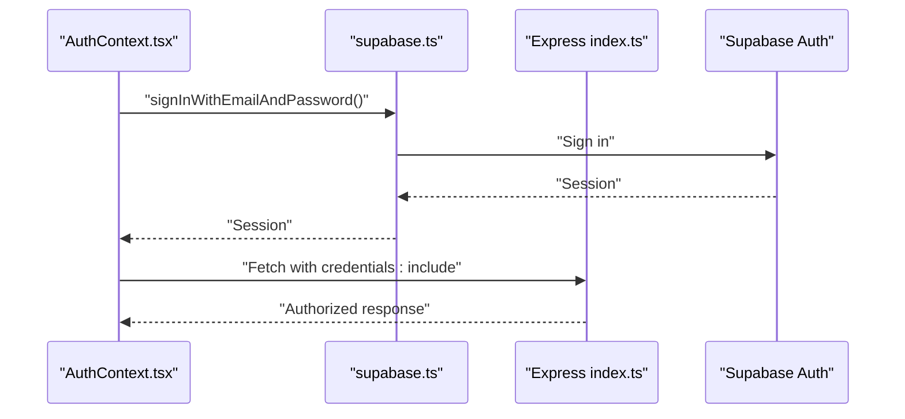
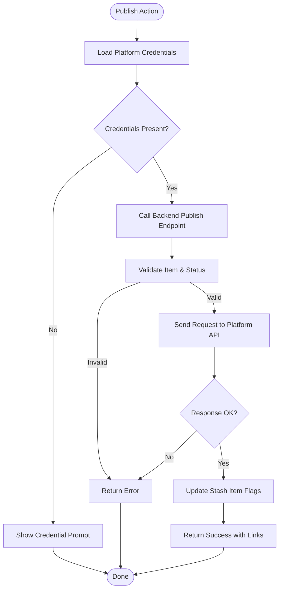
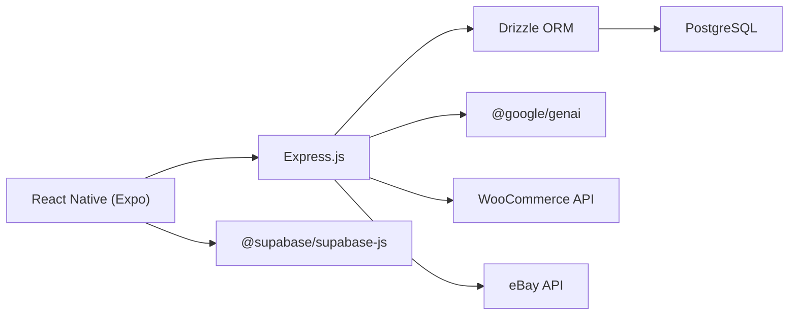
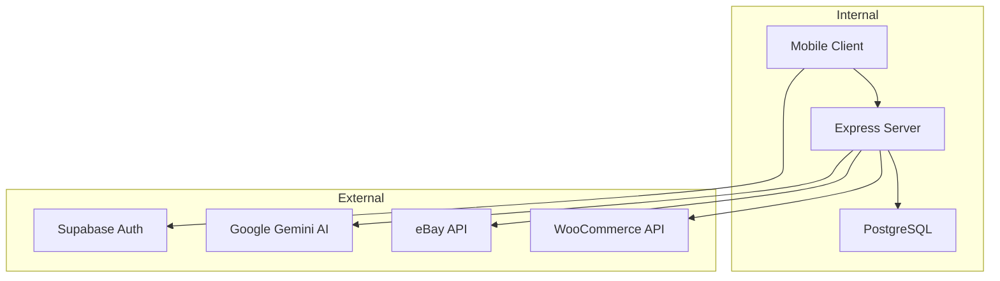

# System Design

<cite>
**Referenced Files in This Document**
- [package.json](file://package.json)
- [ENVIRONMENT.md](file://ENVIRONMENT.md)
- [app.json](file://app.json)
- [drizzle.config.ts](file://drizzle.config.ts)
- [server/index.ts](file://server/index.ts)
- [server/routes.ts](file://server/routes.ts)
- [server/db.ts](file://server/db.ts)
- [server/storage.ts](file://server/storage.ts)
- [shared/schema.ts](file://shared/schema.ts)
- [client/App.tsx](file://client/App.tsx)
- [client/lib/query-client.ts](file://client/lib/query-client.ts)
- [client/lib/supabase.ts](file://client/lib/supabase.ts)
- [client/lib/marketplace.ts](file://client/lib/marketplace.ts)
- [client/contexts/AuthContext.tsx](file://client/contexts/AuthContext.tsx)
- [client/screens/ScanScreen.tsx](file://client/screens/ScanScreen.tsx)
- [client/screens/StashScreen.tsx](file://client/screens/StashScreen.tsx)
</cite>

## Table of Contents
1. [Introduction](#introduction)
2. [Project Structure](#project-structure)
3. [Core Components](#core-components)
4. [Architecture Overview](#architecture-overview)
5. [Detailed Component Analysis](#detailed-component-analysis)
6. [Dependency Analysis](#dependency-analysis)
7. [Performance Considerations](#performance-considerations)
8. [Troubleshooting Guide](#troubleshooting-guide)
9. [Conclusion](#conclusion)
10. [Appendices](#appendices)

## Introduction
This document describes the system design of Hidden-Gem, a mobile-first application that helps users catalog personal collections, analyze items using AI, and publish listings to external marketplaces. The system comprises:
- A React Native mobile client (Expo) that captures item images, displays collected items, and orchestrates marketplace publishing.
- An Express.js backend server that exposes RESTful APIs, integrates AI services, and manages a shared Postgres database.
- A shared database schema managed by Drizzle ORM and persisted via PostgreSQL.
- External service integrations: Supabase for authentication, Google Gemini AI for image analysis, eBay and WooCommerce for marketplace publishing.

The document explains system boundaries, component responsibilities, inter-system communication patterns, scalability considerations, deployment topology, and technology stack rationale.

## Project Structure
The repository is organized into three primary areas:
- client: React Native/Expo front-end with navigation, screens, contexts, and libraries for API and auth.
- server: Express.js backend with route handlers, database integration, and AI integrations.
- shared: Shared database schema definitions and type models used by both client and server.

**Diagram sources**
- [client/App.tsx](file://client/App.tsx#L30-L49)
- [client/screens/ScanScreen.tsx](file://client/screens/ScanScreen.tsx#L17-L62)
- [client/screens/StashScreen.tsx](file://client/screens/StashScreen.tsx#L93-L104)
- [client/lib/query-client.ts](file://client/lib/query-client.ts#L7-L17)
- [client/lib/supabase.ts](file://client/lib/supabase.ts#L6-L9)
- [client/lib/marketplace.ts](file://client/lib/marketplace.ts#L19-L44)
- [server/index.ts](file://server/index.ts#L224-L246)
- [server/routes.ts](file://server/routes.ts#L24-L492)
- [server/db.ts](file://server/db.ts#L1-L19)
- [shared/schema.ts](file://shared/schema.ts#L1-L122)
- [drizzle.config.ts](file://drizzle.config.ts#L1-L15)

**Section sources**
- [package.json](file://package.json#L1-L85)
- [ENVIRONMENT.md](file://ENVIRONMENT.md#L115-L147)
- [app.json](file://app.json#L1-L52)

## Core Components
- Mobile Client (Expo)
  - App bootstrap and theme wiring.
  - Screens for scanning items and viewing the stash.
  - Query client for REST API calls and caching.
  - Supabase client for authentication.
  - Marketplace helpers for publishing to WooCommerce and eBay.
  - Auth provider and context.

- Backend Server (Express)
  - CORS, body parsing, logging, and static asset serving for Expo manifests.
  - REST routes for articles, stash items, AI analysis, and marketplace publishing.
  - Database connection via Drizzle ORM and PostgreSQL.
  - In-memory storage interface for potential future persistence backends.

- Shared Schema and Config
  - Drizzle schema for users, user settings, stash items, articles, conversations, and messages.
  - Drizzle config pointing to PostgreSQL and schema location.

**Section sources**
- [client/App.tsx](file://client/App.tsx#L30-L49)
- [client/screens/ScanScreen.tsx](file://client/screens/ScanScreen.tsx#L17-L62)
- [client/screens/StashScreen.tsx](file://client/screens/StashScreen.tsx#L93-L104)
- [client/lib/query-client.ts](file://client/lib/query-client.ts#L7-L17)
- [client/lib/supabase.ts](file://client/lib/supabase.ts#L6-L9)
- [client/lib/marketplace.ts](file://client/lib/marketplace.ts#L19-L44)
- [client/contexts/AuthContext.tsx](file://client/contexts/AuthContext.tsx#L19-L30)
- [server/index.ts](file://server/index.ts#L224-L246)
- [server/routes.ts](file://server/routes.ts#L24-L492)
- [server/db.ts](file://server/db.ts#L1-L19)
- [server/storage.ts](file://server/storage.ts#L7-L39)
- [shared/schema.ts](file://shared/schema.ts#L1-L122)
- [drizzle.config.ts](file://drizzle.config.ts#L1-L15)

## Architecture Overview
Hidden-Gem follows a mobile-first, thin-server architecture:
- The mobile client handles UI, camera/image capture, and local state.
- The server exposes REST endpoints for data retrieval, item analysis, and marketplace publishing.
- The shared schema ensures consistent data modeling across client and server.
- External services are integrated via secure credentials and controlled flows.

**Diagram sources**
- [client/lib/query-client.ts](file://client/lib/query-client.ts#L26-L43)
- [client/lib/supabase.ts](file://client/lib/supabase.ts#L20-L34)
- [client/lib/marketplace.ts](file://client/lib/marketplace.ts#L81-L129)
- [server/index.ts](file://server/index.ts#L224-L246)
- [server/routes.ts](file://server/routes.ts#L24-L492)
- [server/db.ts](file://server/db.ts#L1-L19)
- [shared/schema.ts](file://shared/schema.ts#L1-L122)

## Detailed Component Analysis

### Mobile Client (Expo)
Responsibilities:
- Provide navigation and themed UI.
- Capture item images and navigate to analysis.
- Fetch and display stash items via REST API.
- Manage authentication state with Supabase.
- Publish items to marketplace platforms using backend endpoints.

Key flows:
- REST API calls use a centralized client that throws on non-OK responses and includes cookies for session affinity.
- Supabase client initializes with environment-provided URLs and persists sessions securely.
- Marketplace helpers encapsulate publishing to WooCommerce and eBay by calling backend routes with stored credentials.

**Diagram sources**
- [client/screens/StashScreen.tsx](file://client/screens/StashScreen.tsx#L98-L100)
- [client/lib/query-client.ts](file://client/lib/query-client.ts#L46-L64)
- [server/routes.ts](file://server/routes.ts#L57-L68)
- [server/db.ts](file://server/db.ts#L1-L19)

**Section sources**
- [client/App.tsx](file://client/App.tsx#L30-L49)
- [client/screens/ScanScreen.tsx](file://client/screens/ScanScreen.tsx#L17-L62)
- [client/screens/StashScreen.tsx](file://client/screens/StashScreen.tsx#L93-L104)
- [client/lib/query-client.ts](file://client/lib/query-client.ts#L7-L17)
- [client/lib/supabase.ts](file://client/lib/supabase.ts#L6-L9)
- [client/contexts/AuthContext.tsx](file://client/contexts/AuthContext.tsx#L19-L30)

### Backend Server (Express)
Responsibilities:
- Configure CORS, body parsing, logging, and Expo manifest/static serving.
- Register REST routes for articles, stash items, AI analysis, and marketplace publishing.
- Integrate with PostgreSQL via Drizzle ORM.
- Call external AI and marketplace APIs with appropriate credentials.

Key flows:
- AI analysis endpoint accepts two images, constructs a multimodal prompt, and returns structured JSON.
- Publishing endpoints validate credentials, construct platform-specific payloads, and update stash records upon success.

**Diagram sources**
- [server/routes.ts](file://server/routes.ts#L140-L226)
- [server/routes.ts](file://server/routes.ts#L228-L296)
- [server/routes.ts](file://server/routes.ts#L298-L488)
- [server/db.ts](file://server/db.ts#L1-L19)

**Section sources**
- [server/index.ts](file://server/index.ts#L16-L53)
- [server/index.ts](file://server/index.ts#L55-L65)
- [server/index.ts](file://server/index.ts#L67-L98)
- [server/index.ts](file://server/index.ts#L163-L205)
- [server/routes.ts](file://server/routes.ts#L24-L492)
- [server/db.ts](file://server/db.ts#L1-L19)

### Shared Database Schema
Responsibilities:
- Define normalized tables for users, user settings, stash items, articles, conversations, and messages.
- Provide insert/update schemas validated by zod for runtime safety.
- Enable migrations via Drizzle Kit and PostgreSQL.

**Diagram sources**
- [shared/schema.ts](file://shared/schema.ts#L6-L76)

**Section sources**
- [shared/schema.ts](file://shared/schema.ts#L1-L122)
- [drizzle.config.ts](file://drizzle.config.ts#L1-L15)

### Authentication and Session Management
Responsibilities:
- Supabase client initialization with environment variables and platform-aware storage.
- Auth provider exposing sign-in/sign-up/sign-out flows and session state.
- Backend relies on cookie-based sessions for cross-request state.

**Diagram sources**
- [client/contexts/AuthContext.tsx](file://client/contexts/AuthContext.tsx#L19-L30)
- [client/lib/supabase.ts](file://client/lib/supabase.ts#L20-L34)
- [server/index.ts](file://server/index.ts#L224-L246)

**Section sources**
- [client/lib/supabase.ts](file://client/lib/supabase.ts#L6-L9)
- [client/contexts/AuthContext.tsx](file://client/contexts/AuthContext.tsx#L19-L30)
- [ENVIRONMENT.md](file://ENVIRONMENT.md#L23-L37)

### Marketplace Publishing Workflows
Responsibilities:
- Mobile client retrieves platform credentials from secure storage and invokes backend endpoints.
- Backend validates credentials, interacts with platform APIs, updates stash records, and returns results.

**Diagram sources**
- [client/lib/marketplace.ts](file://client/lib/marketplace.ts#L81-L129)
- [server/routes.ts](file://server/routes.ts#L228-L296)
- [server/routes.ts](file://server/routes.ts#L298-L488)

**Section sources**
- [client/lib/marketplace.ts](file://client/lib/marketplace.ts#L19-L44)
- [client/lib/marketplace.ts](file://client/lib/marketplace.ts#L81-L129)
- [server/routes.ts](file://server/routes.ts#L228-L296)
- [server/routes.ts](file://server/routes.ts#L298-L488)

## Dependency Analysis
Technology stack and rationale:
- Mobile: React Native (Expo) for cross-platform UI and native device capabilities.
- Backend: Express.js for lightweight, modular API server.
- Data: PostgreSQL with Drizzle ORM for type-safe schema and migrations.
- AI: Google Gemini SDK for multimodal item analysis.
- Auth: Supabase for authentication and session management.
- Marketplaces: Direct API calls to WooCommerce and eBay with credential storage.

**Diagram sources**
- [package.json](file://package.json#L19-L67)
- [server/routes.ts](file://server/routes.ts#L9-L17)
- [server/db.ts](file://server/db.ts#L1-L19)
- [client/lib/supabase.ts](file://client/lib/supabase.ts#L1-L39)
- [client/lib/marketplace.ts](file://client/lib/marketplace.ts#L81-L129)

**Section sources**
- [package.json](file://package.json#L19-L67)
- [ENVIRONMENT.md](file://ENVIRONMENT.md#L115-L147)

## Performance Considerations
- Network efficiency
  - Use React Query with explicit caching and retries disabled for predictable UX.
  - Minimize payload sizes by sending only required fields for analysis and publishing.
- Database efficiency
  - Keep queries simple and indexed where needed; leverage Drizzle’s type-safe builders.
  - Batch operations where feasible (e.g., listing counts).
- AI and external integrations
  - Cache AI-generated metadata per item to avoid repeated calls.
  - Validate credentials early to fail fast and reduce unnecessary network calls.
- Mobile responsiveness
  - Avoid heavy computations on the UI thread; delegate to server where appropriate.
  - Use lazy loading for images and pagination for long lists.

[No sources needed since this section provides general guidance]

## Troubleshooting Guide
Common issues and resolutions:
- Supabase authentication failures
  - Verify environment variables for Supabase URLs and keys.
  - Confirm project is active and keys are valid.
- AI features not working
  - Ensure AI integration keys are configured and quota is available.
- Database connection errors
  - Confirm DATABASE_URL is set and PostgreSQL is reachable.
- Ports already in use
  - Kill processes on ports 5000 (backend) and 8081 (frontend) as needed.
- Hot reload not working
  - Clear caches and restart the dev servers.

**Section sources**
- [ENVIRONMENT.md](file://ENVIRONMENT.md#L172-L210)

## Conclusion
Hidden-Gem employs a clean separation of concerns: the mobile client focuses on user experience and local state, while the server provides REST APIs, AI integrations, and marketplace orchestration. The shared schema and Drizzle ORM ensure consistency and maintainability. With proper environment configuration and credential management, the system supports scalable deployment and extensible marketplace integrations.

[No sources needed since this section summarizes without analyzing specific files]

## Appendices

### System Context Diagrams
- Internal system boundary: client, server, and database.
- External integrations: Supabase, Google Gemini, eBay, and WooCommerce.

[No sources needed since this diagram shows conceptual workflow, not actual code structure]

### Technology Stack Rationale
- Mobile-first: React Native/Expo enables rapid iteration and native-like performance.
- Thin server: Offloads UI to the client; server centralizes AI and marketplace logic.
- Type safety: Drizzle ORM and zod schemas reduce runtime errors.
- Scalability: Stateless server design, externalized auth and AI, and modular routes support horizontal scaling.

[No sources needed since this section provides general guidance]