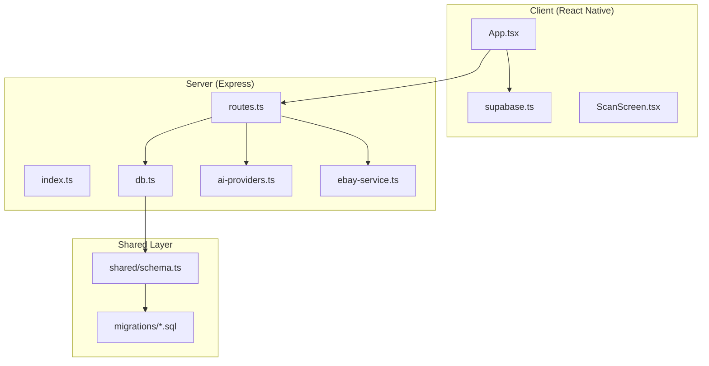
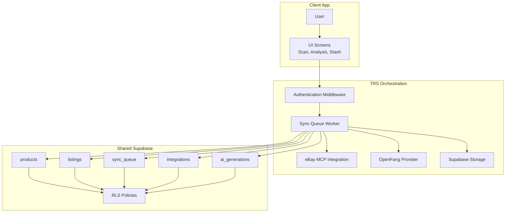
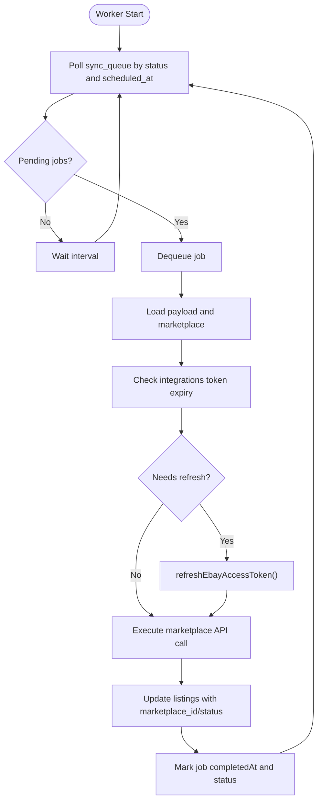
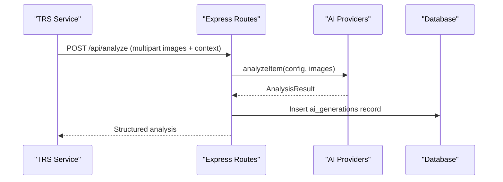
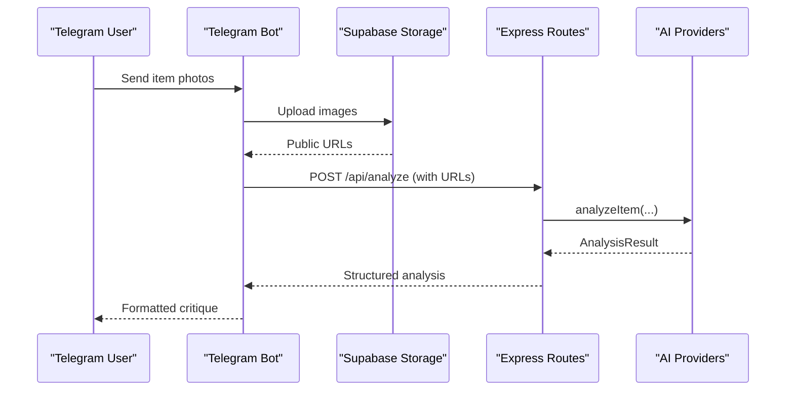
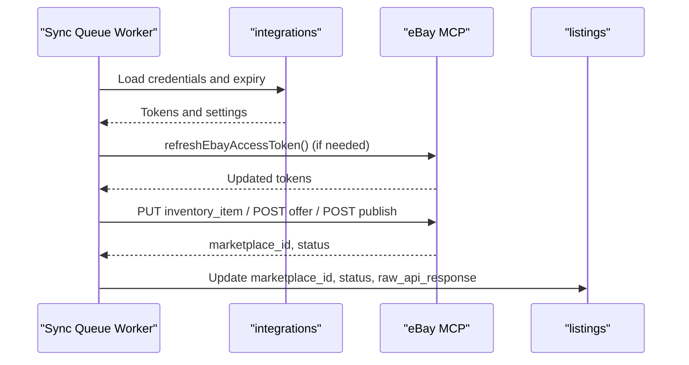
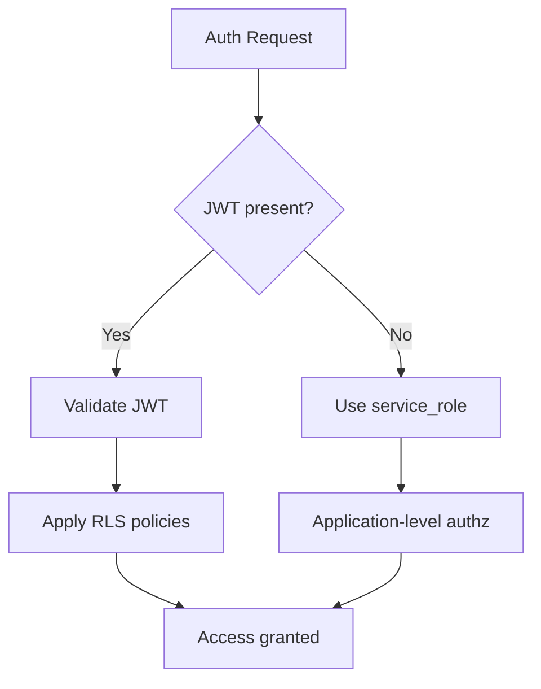
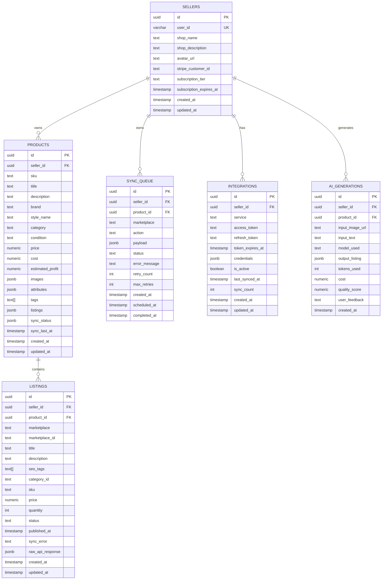
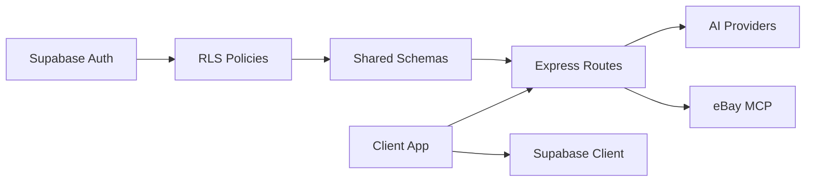

# TRS Integration Plan

<cite>
**Referenced Files in This Document**
- [Hidden-Gem → TRS Integration Plan_ Emma + eBay-MCP.md](file://Hidden-Gem → TRS Integration Plan_ Emma + eBay-MCP.md)
- [package.json](file://package.json)
- [ENVIRONMENT.md](file://ENVIRONMENT.md)
- [design_guidelines.md](file://design_guidelines.md)
- [server/index.ts](file://server/index.ts)
- [server/routes.ts](file://server/routes.ts)
- [server/db.ts](file://server/db.ts)
- [server/ai-providers.ts](file://server/ai-providers.ts)
- [server/ebay-service.ts](file://server/ebay-service.ts)
- [shared/schema.ts](file://shared/schema.ts)
- [migrations/0000_sticky_night_thrasher.sql](file://migrations/0000_sticky_night_thrasher.sql)
- [migrations/0001_flipagent_tables.sql](file://migrations/0001_flipagent_tables.sql)
- [migrations/0002_rls_policies.sql](file://migrations/0002_rls_policies.sql)
- [client/App.tsx](file://client/App.tsx)
- [client/lib/supabase.ts](file://client/lib/supabase.ts)
- [client/screens/ScanScreen.tsx](file://client/screens/ScanScreen.tsx)
</cite>

## Table of Contents
1. [Introduction](#introduction)
2. [Project Structure](#project-structure)
3. [Core Components](#core-components)
4. [Architecture Overview](#architecture-overview)
5. [Detailed Component Analysis](#detailed-component-analysis)
6. [Dependency Analysis](#dependency-analysis)
7. [Performance Considerations](#performance-considerations)
8. [Troubleshooting Guide](#troubleshooting-guide)
9. [Conclusion](#conclusion)

## Introduction
This document presents the TRS Integration Plan for the HiddenGem project. TRS (The Relic Shop) serves as the storefront/admin consumer and orchestration surface over the shared Supabase infrastructure. The plan focuses on integrating Emma (AI system) and OpenFang (stash-critic hand) with TRS, establishing robust marketplace orchestration via a sync queue worker, migrating legacy inventory to the canonical FlipAgent model, and implementing secure authentication and real-time updates.

The project leverages a dual-inventory model where legacy `stash_items` coexists with the richer `products`/`listings` schema. TRS must treat `products` as the canonical inventory source and establish clear migration paths and governance to prevent divergence.

## Project Structure
The repository combines a React Native client, an Express server, shared database schemas, and database migrations. The client handles authentication, scanning, and UI flows. The server exposes REST APIs for AI analysis, marketplace publishing, notifications, and content management. Shared schemas define the canonical database contracts, while migrations establish table structures and Row-Level Security (RLS) policies.

**Diagram sources**
- [client/App.tsx:1-67](file://client/App.tsx#L1-L67)
- [client/lib/supabase.ts:1-39](file://client/lib/supabase.ts#L1-L39)
- [client/screens/ScanScreen.tsx:1-394](file://client/screens/ScanScreen.tsx#L1-L394)
- [server/index.ts:1-262](file://server/index.ts#L1-L262)
- [server/routes.ts:1-800](file://server/routes.ts#L1-L800)
- [server/db.ts:1-19](file://server/db.ts#L1-L19)
- [server/ai-providers.ts:1-840](file://server/ai-providers.ts#L1-L840)
- [server/ebay-service.ts:1-474](file://server/ebay-service.ts#L1-L474)
- [shared/schema.ts:1-349](file://shared/schema.ts#L1-L349)
- [migrations/0000_sticky_night_thrasher.sql:1-82](file://migrations/0000_sticky_night_thrasher.sql#L1-L82)
- [migrations/0001_flipagent_tables.sql:1-117](file://migrations/0001_flipagent_tables.sql#L1-L117)
- [migrations/0002_rls_policies.sql:1-66](file://migrations/0002_rls_policies.sql#L1-L66)

**Section sources**
- [package.json:1-95](file://package.json#L1-L95)
- [ENVIRONMENT.md:1-219](file://ENVIRONMENT.md#L1-L219)
- [design_guidelines.md:1-171](file://design_guidelines.md#L1-L171)

## Core Components
- **Dual Inventory Model**: Legacy `stash_items` and canonical `products`/`listings`. TRS must prioritize `products` for orchestration and migration from `stash_items`.
- **Sync Queue Worker**: A missing component that processes `sync_queue` entries to execute marketplace API calls and update listing states.
- **Emma AI Integration**: The `analyzeWithOpenFang()` pathway and related AI providers support TRS in generating structured listings and analytics.
- **eBay MCP Orchestration**: Functions for token refresh, inventory updates, and listing lifecycle management integrate with TRS workflows.
- **Authentication and RLS**: Supabase-based authentication and RLS policies govern access to seller data and orchestration resources.

**Section sources**
- [Hidden-Gem → TRS Integration Plan_ Emma + eBay-MCP.md:4-8](file://Hidden-Gem → TRS Integration Plan_ Emma + eBay-MCP.md#L4-L8)
- [Hidden-Gem → TRS Integration Plan_ Emma + eBay-MCP.md:13-16](file://Hidden-Gem → TRS Integration Plan_ Emma + eBay-MCP.md#L13-L16)
- [server/ai-providers.ts:334-389](file://server/ai-providers.ts#L334-L389)
- [server/ebay-service.ts:319-364](file://server/ebay-service.ts#L319-L364)
- [migrations/0002_rls_policies.sql:1-66](file://migrations/0002_rls_policies.sql#L1-L66)

## Architecture Overview
The TRS architecture centers on shared Supabase infrastructure with distinct roles:
- **Emma/OpenFang Hand**: Executes AI analysis and provides critique via Telegram or direct API calls.
- **TRS Orchestration**: Manages marketplace OAuth, sync queue processing, and listing lifecycle.
- **Client Application**: Provides scanning, analysis, and inventory management UI for end-users.

**Diagram sources**
- [server/index.ts:227-261](file://server/index.ts#L227-L261)
- [server/routes.ts:44-800](file://server/routes.ts#L44-L800)
- [server/ebay-service.ts:42-473](file://server/ebay-service.ts#L42-L473)
- [server/ai-providers.ts:437-503](file://server/ai-providers.ts#L437-L503)
- [shared/schema.ts:133-225](file://shared/schema.ts#L133-L225)
- [migrations/0002_rls_policies.sql:1-66](file://migrations/0002_rls_policies.sql#L1-L66)

## Detailed Component Analysis

### Sync Queue Worker Implementation
The sync queue is the backbone of automated marketplace publishing. Currently, no worker dequeues and executes jobs. TRS must implement a worker that:
- Reads pending jobs from `sync_queue`
- Executes marketplace API calls (e.g., eBay Inventory API, WooCommerce REST)
- Updates job status, error messages, and completion timestamps
- Updates `listings` table with marketplace identifiers and statuses

**Diagram sources**
- [server/routes.ts:548-760](file://server/routes.ts#L548-L760)
- [server/ebay-service.ts:319-364](file://server/ebay-service.ts#L319-L364)
- [shared/schema.ts:194-208](file://shared/schema.ts#L194-L208)

**Section sources**
- [Hidden-Gem → TRS Integration Plan_ Emma + eBay-MCP.md:43-43](file://Hidden-Gem → TRS Integration Plan_ Emma + eBay-MCP.md#L43-L43)
- [server/routes.ts:548-760](file://server/routes.ts#L548-L760)
- [server/ebay-service.ts:319-364](file://server/ebay-service.ts#L319-L364)
- [shared/schema.ts:194-208](file://shared/schema.ts#L194-L208)

### Emma Analysis API for TRS
TRS needs a clean API surface for Emma analysis with seller context and structured outputs. The existing `/api/analyze` and `/api/analyze/retry` endpoints accept multipart images and return `AnalysisResult`. TRS should:
- Accept sellerId context
- Persist analysis to `ai_generations`
- Support retries with feedback

**Diagram sources**
- [server/routes.ts:299-385](file://server/routes.ts#L299-L385)
- [server/ai-providers.ts:437-455](file://server/ai-providers.ts#L437-L455)
- [shared/schema.ts:179-192](file://shared/schema.ts#L179-L192)

**Section sources**
- [Hidden-Gem → TRS Integration Plan_ Emma + eBay-MCP.md:47-47](file://Hidden-Gem → TRS Integration Plan_ Emma + eBay-MCP.md#L47-L47)
- [server/routes.ts:299-385](file://server/routes.ts#L299-L385)
- [server/ai-providers.ts:437-455](file://server/ai-providers.ts#L437-L455)
- [shared/schema.ts:179-192](file://shared/schema.ts#L179-L192)

### OpenFang Telegram Hand
A Telegram bot handler should:
- Receive item photos
- Upload to Supabase Storage
- Trigger Emma analysis
- Create `products` or `stash_items` row
- Return formatted critique in OpenFang persona

**Diagram sources**
- [server/routes.ts:299-385](file://server/routes.ts#L299-L385)
- [server/ai-providers.ts:437-455](file://server/ai-providers.ts#L437-L455)

**Section sources**
- [Hidden-Gem → TRS Integration Plan_ Emma + eBay-MCP.md:49-49](file://Hidden-Gem → TRS Integration Plan_ Emma + eBay-MCP.md#L49-L49)
- [server/routes.ts:299-385](file://server/routes.ts#L299-L385)
- [server/ai-providers.ts:437-455](file://server/ai-providers.ts#L437-L455)

### eBay-MCP Orchestration
Integrate the sync queue worker with eBay MCP functions:
- `getAccessToken()` for authentication
- Inventory PUT, offer POST, publish POST
- `updateEbayListing()` and `deleteEbayListing()`
- Proactive token refresh via `refreshEbayAccessToken()`

**Diagram sources**
- [server/ebay-service.ts:42-473](file://server/ebay-service.ts#L42-L473)
- [shared/schema.ts:158-177](file://shared/schema.ts#L158-L177)

**Section sources**
- [Hidden-Gem → TRS Integration Plan_ Emma + eBay-MCP.md:51-53](file://Hidden-Gem → TRS Integration Plan_ Emma + eBay-MCP.md#L51-L53)
- [server/ebay-service.ts:42-473](file://server/ebay-service.ts#L42-L473)
- [shared/schema.ts:158-177](file://shared/schema.ts#L158-L177)

### Authentication and Shared Auth Contract
TRS must authenticate to shared Supabase. Options:
- Supabase Auth JWT pass-through
- Service role key for server-to-server operations

Given RLS policies, TRS must implement application-level authorization when using service_role to prevent cross-seller data access.

**Diagram sources**
- [migrations/0002_rls_policies.sql:1-66](file://migrations/0002_rls_policies.sql#L1-L66)

**Section sources**
- [Hidden-Gem → TRS Integration Plan_ Emma + eBay-MCP.md:45-45](file://Hidden-Gem → TRS Integration Plan_ Emma + eBay-MCP.md#L45-L45)
- [migrations/0002_rls_policies.sql:1-66](file://migrations/0002_rls_policies.sql#L1-L66)

### Database Contracts and Migrations
TRS interacts with several key tables:
- `products`: Canonical inventory with SKU, pricing, and attributes
- `listings`: Per-marketplace listing state and identifiers
- `sync_queue`: Async job orchestration
- `integrations`: OAuth credentials and token lifecycle
- `ai_generations`: Audit trail for AI analysis

**Diagram sources**
- [shared/schema.ts:120-225](file://shared/schema.ts#L120-L225)
- [migrations/0001_flipagent_tables.sql:5-117](file://migrations/0001_flipagent_tables.sql#L5-L117)
- [migrations/0002_rls_policies.sql:1-66](file://migrations/0002_rls_policies.sql#L1-L66)

**Section sources**
- [shared/schema.ts:120-225](file://shared/schema.ts#L120-L225)
- [migrations/0001_flipagent_tables.sql:5-117](file://migrations/0001_flipagent_tables.sql#L5-L117)
- [migrations/0002_rls_policies.sql:1-66](file://migrations/0002_rls_policies.sql#L1-L66)

## Dependency Analysis
The TRS integration depends on:
- Supabase authentication and RLS policies
- Database schemas and migrations
- Express routes for AI analysis and marketplace operations
- eBay MCP integration functions
- Client-side authentication and navigation

**Diagram sources**
- [server/index.ts:227-261](file://server/index.ts#L227-L261)
- [server/routes.ts:44-800](file://server/routes.ts#L44-L800)
- [shared/schema.ts:1-349](file://shared/schema.ts#L1-L349)
- [client/lib/supabase.ts:1-39](file://client/lib/supabase.ts#L1-L39)

**Section sources**
- [server/index.ts:227-261](file://server/index.ts#L227-L261)
- [server/routes.ts:44-800](file://server/routes.ts#L44-L800)
- [shared/schema.ts:1-349](file://shared/schema.ts#L1-L349)
- [client/lib/supabase.ts:1-39](file://client/lib/supabase.ts#L1-L39)

## Performance Considerations
- **Sync Queue Worker**: Implement efficient polling with backoff, parallel processing per marketplace, and idempotent job execution to avoid duplicate listings.
- **AI Analysis**: Cache provider configurations and use structured prompts to reduce latency and improve consistency.
- **Database Operations**: Use bulk operations for listing updates and ensure proper indexing on `sync_queue` and `listings` tables.
- **Real-time Updates**: Consider Supabase Realtime subscriptions or database triggers for live UI updates instead of polling.

## Troubleshooting Guide
Common issues and resolutions:
- **Dual Inventory Divergence**: Implement a one-way promotion function from `stash_items` to `products` to maintain canonical inventory integrity.
- **No Sync Queue Worker**: Build a worker that processes pending jobs and updates statuses; monitor `maxRetries` and error messages.
- **RLS vs Service Role**: When using service_role, enforce application-level authorization to prevent unauthorized cross-seller access.
- **eBay Token Expiry**: Proactively check `integrations.token_expires_at` and call `refreshEbayAccessToken()` before API calls.
- **OpenFang Availability**: Add circuit breakers and fallback logic to alternate providers when OpenFang is unavailable.
- **API Authentication**: Add auth middleware to protect `/api/*` endpoints; ensure JWT validation and RLS enforcement.
- **Supabase Realtime**: Configure Realtime subscriptions or triggers for live updates on `products`, `listings`, and `sync_queue`.

**Section sources**
- [Hidden-Gem → TRS Integration Plan_ Emma + eBay-MCP.md:59-67](file://Hidden-Gem → TRS Integration Plan_ Emma + eBay-MCP.md#L59-L67)
- [server/routes.ts:44-800](file://server/routes.ts#L44-L800)
- [server/ebay-service.ts:319-364](file://server/ebay-service.ts#L319-L364)
- [shared/schema.ts:194-208](file://shared/schema.ts#L194-L208)

## Conclusion
The TRS Integration Plan establishes a clear path to unify Emma/OpenFang capabilities with TRS orchestration. By implementing a sync queue worker, migrating legacy inventory to the canonical `products` model, securing authentication with RLS-aware access controls, and integrating eBay MCP workflows, TRS can achieve automated, reliable, and scalable marketplace publishing. The phased sequencing prioritizes foundational components first, ensuring a robust and maintainable system.
