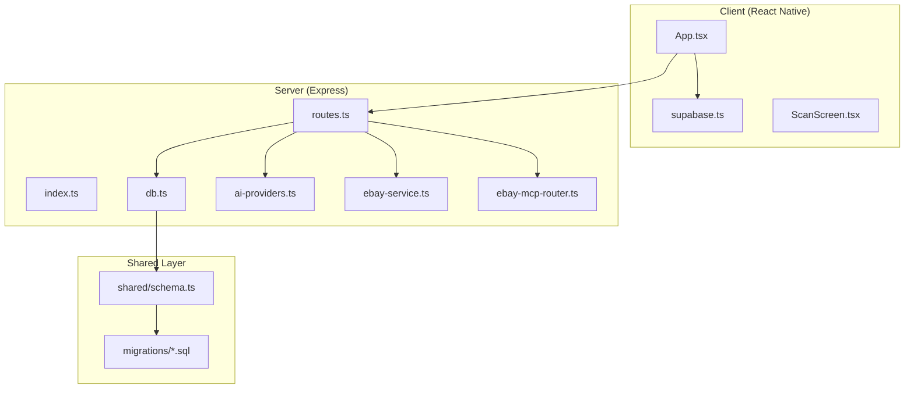
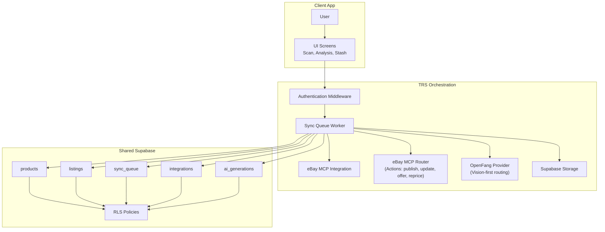
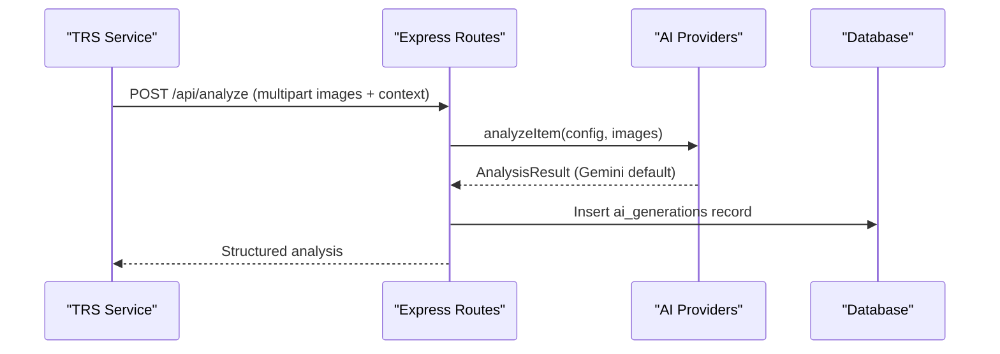
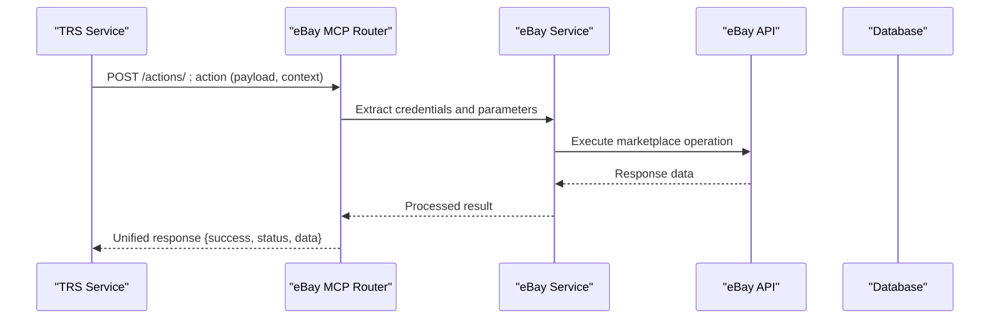
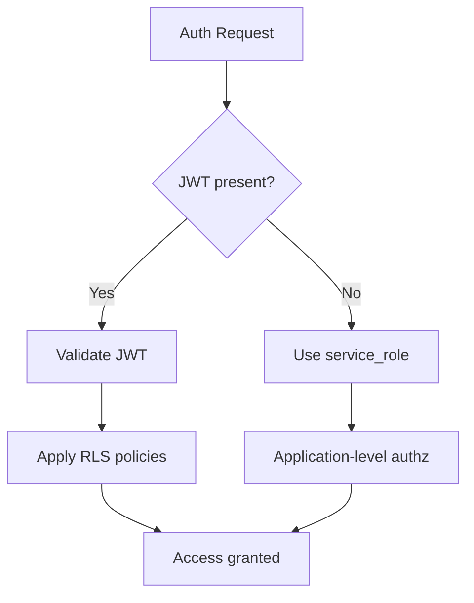
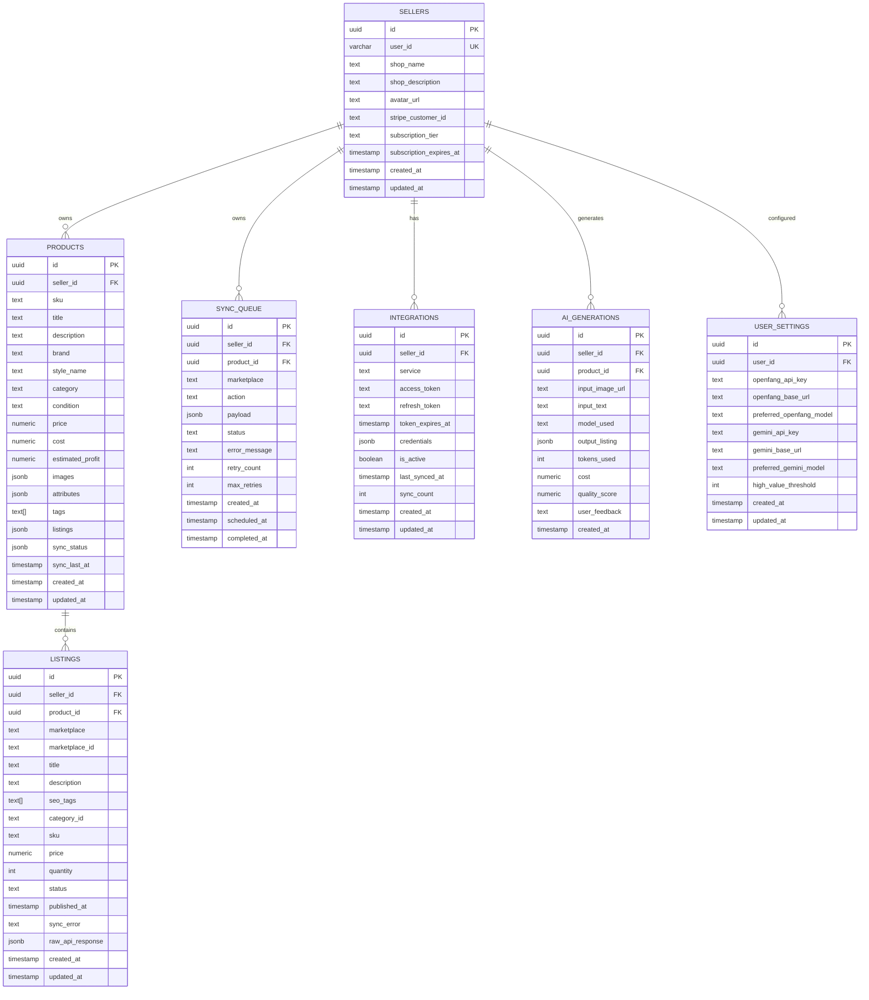
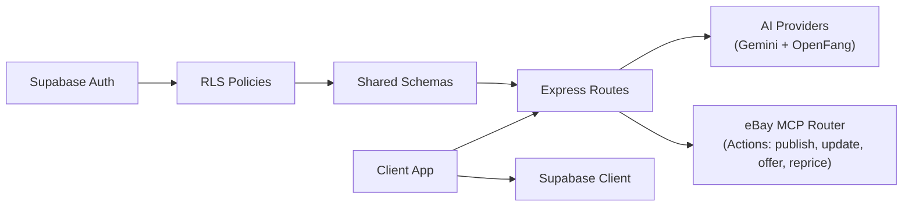

# TRS Integration Plan

<cite>
**Referenced Files in This Document**
- [Hidden-Gem → TRS Integration Plan_ Emma + eBay-MCP.md](file://Hidden-Gem → TRS Integration Plan_ Emma + eBay-MCP.md)
- [package.json](file://package.json)
- [ENVIRONMENT.md](file://ENVIRONMENT.md)
- [design_guidelines.md](file://design_guidelines.md)
- [server/index.ts](file://server/index.ts)
- [server/routes.ts](file://server/routes.ts)
- [server/db.ts](file://server/db.ts)
- [server/ai-providers.ts](file://server/ai-providers.ts)
- [server/ebay-service.ts](file://server/ebay-service.ts)
- [server/ebay-mcp-router.ts](file://server/ebay-mcp-router.ts)
- [shared/schema.ts](file://shared/schema.ts)
- [migrations/0000_sticky_night_thrasher.sql](file://migrations/0000_sticky_night_thrasher.sql)
- [migrations/0001_flipagent_tables.sql](file://migrations/0001_flipagent_tables.sql)
- [migrations/0002_rls_policies.sql](file://migrations/0002_rls_policies.sql)
- [migrations/0004_openfang_settings.sql](file://migrations/0004_openfang_settings.sql)
- [client/App.tsx](file://client/App.tsx)
- [client/lib/supabase.ts](file://client/lib/supabase.ts)
- [client/screens/ScanScreen.tsx](file://client/screens/ScanScreen.tsx)
</cite>

## Update Summary
**Changes Made**
- Updated execution status to reflect that Sync Queue Worker is now "In Progress" with cloud worker deployment
- Enhanced eBay MCP integration documentation with new router-based workflow architecture
- Updated AI-first architecture to emphasize Gemini as baseline with OpenFang as optional multi-model routing
- Added comprehensive sync queue management documentation with queue inspection endpoints
- Updated database schema documentation to include OpenFang settings table structure
- Enhanced troubleshooting guidance with new eBay MCP router implementation

## Table of Contents
1. [Introduction](#introduction)
2. [Project Structure](#project-structure)
3. [Core Components](#core-components)
4. [Architecture Overview](#architecture-overview)
5. [Detailed Component Analysis](#detailed-component-analysis)
6. [Dependency Analysis](#dependency-analysis)
7. [Performance Considerations](#performance-considerations)
8. [Troubleshooting Guide](#troubleshooting-guide)
9. [Conclusion](#conclusion)

## Introduction
This document presents the TRS Integration Plan for the HiddenGem project. TRS (The Relic Shop) serves as the storefront/admin consumer and orchestration surface over the shared Supabase infrastructure. The plan focuses on integrating Emma (AI system) and OpenFang (multi-model execution hand) with TRS, establishing robust marketplace orchestration via a sync queue worker, migrating legacy inventory to the canonical FlipAgent model, and implementing secure authentication and real-time updates.

The project leverages a dual-inventory model where legacy `stash_items` coexists with the richer `products`/`listings` schema. TRS must treat `products` as the canonical inventory source and establish clear migration paths and governance to prevent divergence.

**Updated** The implementation now follows a Gemini-first execution approach where Gemini serves as the baseline identification hand, with OpenFang available as an optional multi-model routing provider. The eBay MCP integration has been enhanced with a dedicated router-based workflow that supports publish, update, offer, and pricing actions through a unified API interface.

## Project Structure
The repository combines a React Native client, an Express server, shared database schemas, and database migrations. The client handles authentication, scanning, and UI flows. The server exposes REST APIs for AI analysis, marketplace publishing, notifications, and content management. Shared schemas define the canonical database contracts, while migrations establish table structures and Row-Level Security (RLS) policies.

**Diagram sources**
- [client/App.tsx:1-67](file://client/App.tsx#L1-L67)
- [client/lib/supabase.ts:1-39](file://client/lib/supabase.ts#L1-L39)
- [client/screens/ScanScreen.tsx:1-394](file://client/screens/ScanScreen.tsx#L1-L394)
- [server/index.ts:1-262](file://server/index.ts#L1-L262)
- [server/routes.ts:1-1389](file://server/routes.ts#L1-L1389)
- [server/db.ts:1-19](file://server/db.ts#L1-L19)
- [server/ai-providers.ts:1-983](file://server/ai-providers.ts#L1-L983)
- [server/ebay-service.ts:1-678](file://server/ebay-service.ts#L1-L678)
- [server/ebay-mcp-router.ts:1-181](file://server/ebay-mcp-router.ts#L1-L181)
- [shared/schema.ts:1-453](file://shared/schema.ts#L1-L453)
- [migrations/0000_sticky_night_thrasher.sql:1-82](file://migrations/0000_sticky_night_thrasher.sql#L1-L82)
- [migrations/0001_flipagent_tables.sql:1-117](file://migrations/0001_flipagent_tables.sql#L1-L117)
- [migrations/0002_rls_policies.sql:1-66](file://migrations/0002_rls_policies.sql#L1-L66)

**Section sources**
- [package.json:1-95](file://package.json#L1-L95)
- [ENVIRONMENT.md:1-219](file://ENVIRONMENT.md#L1-L219)
- [design_guidelines.md:1-171](file://design_guidelines.md#L1-L171)

## Core Components
- **Dual Inventory Model**: Legacy `stash_items` and canonical `products`/`listings`. TRS must prioritize `products` for orchestration and migration from `stash_items`.
- **Sync Queue Worker**: A cloud-based worker that processes `sync_queue` entries to execute marketplace API calls and update listing states.
- **Emma AI Integration**: The `analyzeWithOpenFang()` pathway and related AI providers support TRS in generating structured listings and analytics, with Gemini as the baseline provider and OpenFang as optional multi-model routing.
- **Enhanced eBay MCP Orchestration**: A dedicated router-based system for token refresh, inventory updates, and listing lifecycle management with unified action endpoints.
- **Authentication and RLS**: Supabase-based authentication and RLS policies govern access to seller data and orchestration resources.

**Updated** The AI integration now implements a Gemini-first approach where Gemini serves as the default provider for analysis requests, with OpenFang available as an optional multi-model routing provider that can fall back to GPT-4o, Gemini-2.5-flash, and Claude-sonnet-4-20250514 when needed. The eBay MCP integration has been enhanced with a router-based architecture supporting multiple action types.

**Section sources**
- [Hidden-Gem → TRS Integration Plan_ Emma + eBay-MCP.md:4-8](file://Hidden-Gem → TRS Integration Plan_ Emma + eBay-MCP.md#L4-L8)
- [Hidden-Gem → TRS Integration Plan_ Emma + eBay-MCP.md:13-16](file://Hidden-Gem → TRS Integration Plan_ Emma + eBay-MCP.md#L13-L16)
- [server/ai-providers.ts:398-463](file://server/ai-providers.ts#L398-L463)
- [server/ebay-service.ts:348-384](file://server/ebay-service.ts#L348-L384)
- [server/ebay-mcp-router.ts:44-178](file://server/ebay-mcp-router.ts#L44-L178)
- [migrations/0002_rls_policies.sql:1-66](file://migrations/0002_rls_policies.sql#L1-L66)

## Architecture Overview
The TRS architecture centers on shared Supabase infrastructure with distinct roles:
- **Emma/OpenFang Hand**: Executes AI analysis with Gemini as the baseline provider and OpenFang as optional multi-model routing. The OpenFang system prioritizes vision-based models while falling back to other providers.
- **TRS Orchestration**: Manages marketplace OAuth, sync queue processing, and listing lifecycle through the enhanced eBay MCP router.
- **Client Application**: Provides scanning, analysis, and inventory management UI for end-users.

**Updated** The architecture now reflects the Gemini-first execution approach where OpenFang serves as the optional multi-model routing provider with vision-based priority and fallback capabilities. The eBay MCP integration has been enhanced with a router-based workflow that supports unified action endpoints for different marketplace operations.

**Diagram sources**
- [server/index.ts:227-261](file://server/index.ts#L227-L261)
- [server/routes.ts:1254-1269](file://server/routes.ts#L1254-L1269)
- [server/ebay-service.ts:42-678](file://server/ebay-service.ts#L42-L678)
- [server/ebay-mcp-router.ts:13-181](file://server/ebay-mcp-router.ts#L13-L181)
- [server/ai-providers.ts:437-503](file://server/ai-providers.ts#L437-L503)
- [shared/schema.ts:133-225](file://shared/schema.ts#L133-L225)
- [migrations/0002_rls_policies.sql:1-66](file://migrations/0002_rls_policies.sql#L1-L66)

## Detailed Component Analysis

### Enhanced Sync Queue Worker Implementation
The sync queue is the backbone of automated marketplace publishing. The worker is now deployed as a cloud-based solution that processes `sync_queue` entries to execute marketplace API calls and update listing states.

**Updated** The sync queue worker is now in progress with cloud deployment, providing reliable background processing for marketplace operations.

**Diagram sources**
- [server/routes.ts:1254-1269](file://server/routes.ts#L1254-L1269)
- [server/ebay-service.ts:348-384](file://server/ebay-service.ts#L348-L384)
- [shared/schema.ts:257-279](file://shared/schema.ts#L257-L279)

**Section sources**
- [Hidden-Gem → TRS Integration Plan_ Emma + eBay-MCP.md:5-5](file://Hidden-Gem → TRS Integration Plan_ Emma + eBay-MCP.md#L5-L5)
- [server/routes.ts:1254-1269](file://server/routes.ts#L1254-L1269)
- [server/ebay-service.ts:348-384](file://server/ebay-service.ts#L348-L384)
- [shared/schema.ts:257-279](file://shared/schema.ts#L257-L279)

### Emma Analysis API for TRS
TRS needs a clean API surface for Emma analysis with seller context and structured outputs. The existing `/api/analyze` and `/api/analyze/retry` endpoints accept multipart images and return `AnalysisResult`. TRS should:
- Accept sellerId context
- Persist analysis to `ai_generations`
- Support retries with feedback
- Default to Gemini provider with OpenFang fallback capability

**Updated** The analysis API now defaults to Gemini as the baseline provider, with OpenFang available as an optional provider that can be selected for multi-model routing. The OpenFang implementation includes vision-first routing with fallback to other providers.

**Diagram sources**
- [server/routes.ts:349-418](file://server/routes.ts#L349-L418)
- [server/ai-providers.ts:515-533](file://server/ai-providers.ts#L515-L533)
- [shared/schema.ts:236-255](file://shared/schema.ts#L236-L255)

**Section sources**
- [Hidden-Gem → TRS Integration Plan_ Emma + eBay-MCP.md:60-60](file://Hidden-Gem → TRS Integration Plan_ Emma + eBay-MCP.md#L60-L60)
- [server/routes.ts:349-418](file://server/routes.ts#L349-L418)
- [server/ai-providers.ts:515-533](file://server/ai-providers.ts#L515-L533)
- [shared/schema.ts:236-255](file://shared/schema.ts#L236-L255)

### Enhanced eBay MCP Router Integration
The eBay MCP integration now features a dedicated router-based architecture that provides unified action endpoints for marketplace operations:

**Updated** The eBay MCP integration has been enhanced with a router-based architecture that supports multiple action types: publish, update, offer, and reprice. This provides a unified interface for marketplace operations while maintaining the underlying eBay service functions.

**Diagram sources**
- [server/ebay-mcp-router.ts:44-178](file://server/ebay-mcp-router.ts#L44-L178)
- [server/ebay-service.ts:520-678](file://server/ebay-service.ts#L520-L678)

**Section sources**
- [Hidden-Gem → TRS Integration Plan_ Emma + eBay-MCP.md:63-70](file://Hidden-Gem → TRS Integration Plan_ Emma + eBay-MCP.md#L63-L70)
- [server/ebay-mcp-router.ts:44-178](file://server/ebay-mcp-router.ts#L44-L178)
- [server/ebay-service.ts:520-678](file://server/ebay-service.ts#L520-L678)

### Authentication and Shared Auth Contract
TRS must authenticate to shared Supabase. Options:
- Supabase Auth JWT pass-through
- Service role key for server-to-server operations

Given RLS policies, TRS must implement application-level authorization when using service_role to prevent cross-seller data access.

**Diagram sources**
- [migrations/0002_rls_policies.sql:1-66](file://migrations/0002_rls_policies.sql#L1-L66)

**Section sources**
- [Hidden-Gem → TRS Integration Plan_ Emma + eBay-MCP.md:58-58](file://Hidden-Gem → TRS Integration Plan_ Emma + eBay-MCP.md#L58-L58)
- [migrations/0002_rls_policies.sql:1-66](file://migrations/0002_rls_policies.sql#L1-L66)

### Database Contracts and Migrations
TRS interacts with several key tables:
- `products`: Canonical inventory with SKU, pricing, and attributes
- `listings`: Per-marketplace listing state and identifiers
- `sync_queue`: Async job orchestration with enhanced queue management
- `integrations`: OAuth credentials and token lifecycle
- `ai_generations`: Audit trail for AI analysis

**Updated** The database schema now includes OpenFang settings in the `user_settings` table with columns for API key, base URL, and preferred model, supporting the optional OpenFang provider configuration. The sync queue table has been enhanced with comprehensive status tracking and retry mechanisms.

**Diagram sources**
- [shared/schema.ts:154-307](file://shared/schema.ts#L154-L307)
- [migrations/0001_flipagent_tables.sql:5-117](file://migrations/0001_flipagent_tables.sql#L5-L117)
- [migrations/0002_rls_policies.sql:1-66](file://migrations/0002_rls_policies.sql#L1-L66)
- [migrations/0004_openfang_settings.sql:1-4](file://migrations/0004_openfang_settings.sql#L1-L4)

**Section sources**
- [shared/schema.ts:154-307](file://shared/schema.ts#L154-L307)
- [migrations/0001_flipagent_tables.sql:5-117](file://migrations/0001_flipagent_tables.sql#L5-L117)
- [migrations/0002_rls_policies.sql:1-66](file://migrations/0002_rls_policies.sql#L1-L66)

## Dependency Analysis
The TRS integration depends on:
- Supabase authentication and RLS policies
- Database schemas and migrations
- Express routes for AI analysis and marketplace operations
- Enhanced eBay MCP integration functions with router architecture
- Client-side authentication and navigation

**Updated** The dependency graph now includes OpenFang as an optional AI provider dependency with Gemini as the baseline provider, and the eBay MCP router as a core integration component.

**Diagram sources**
- [server/index.ts:227-261](file://server/index.ts#L227-L261)
- [server/routes.ts:1-1389](file://server/routes.ts#L1-L1389)
- [shared/schema.ts:1-453](file://shared/schema.ts#L1-L453)
- [client/lib/supabase.ts:1-39](file://client/lib/supabase.ts#L1-L39)

**Section sources**
- [server/index.ts:227-261](file://server/index.ts#L227-L261)
- [server/routes.ts:1-1389](file://server/routes.ts#L1-L1389)
- [shared/schema.ts:1-453](file://shared/schema.ts#L1-L453)
- [client/lib/supabase.ts:1-39](file://client/lib/supabase.ts#L1-L39)

## Performance Considerations
- **Cloud-Based Sync Queue Worker**: The worker is now deployed in the cloud for improved reliability and scalability compared to local development environments.
- **AI Analysis**: Cache provider configurations and use structured prompts to reduce latency and improve consistency. Gemini serves as the baseline provider for optimal performance.
- **Enhanced eBay MCP Router**: The router-based architecture reduces API call complexity and improves error handling across different marketplace operations.
- **Database Operations**: Use bulk operations for listing updates and ensure proper indexing on `sync_queue` and `listings` tables.
- **Real-time Updates**: Consider Supabase Realtime subscriptions or database triggers for live UI updates instead of polling.
- **OpenFang Routing**: The vision-first routing system optimizes for image analysis performance while providing fallback options when needed.

**Updated** Performance considerations now include the cloud-based deployment of the sync queue worker and the router-based eBay MCP architecture for improved reliability and scalability.

## Troubleshooting Guide
Common issues and resolutions:
- **Dual Inventory Divergence**: Implement a one-way promotion function from `stash_items` to `products` to maintain canonical inventory integrity.
- **Cloud Sync Queue Worker Deployment**: Monitor cloud worker logs and ensure proper environment variable configuration for production deployment.
- **RLS vs Service Role**: When using service_role, enforce application-level authorization to prevent unauthorized cross-seller access.
- **Enhanced eBay MCP Router**: Verify action endpoints are properly configured and credentials are correctly extracted from context objects.
- **OpenFang Availability**: Add circuit breakers and fallback logic to alternate providers when OpenFang is unavailable. Gemini serves as the baseline fallback.
- **API Authentication**: Add auth middleware to protect `/api/*` endpoints; ensure JWT validation and RLS enforcement.
- **Supabase Realtime**: Configure Realtime subscriptions or triggers for live updates on `products`, `listings`, and `sync_queue`.
- **Gemini Provider Issues**: Monitor Gemini API quotas and fallback mechanisms when OpenFang routing fails.
- **Sync Queue Inspection**: Use the `/api/sync-queue` endpoint to debug queue processing and job status tracking.

**Updated** Troubleshooting now includes cloud deployment considerations, router-based eBay MCP integration, and enhanced sync queue management capabilities.

**Section sources**
- [Hidden-Gem → TRS Integration Plan_ Emma + eBay-MCP.md:76-85](file://Hidden-Gem → TRS Integration Plan_ Emma + eBay-MCP.md#L76-L85)
- [server/routes.ts:1254-1269](file://server/routes.ts#L1254-L1269)
- [server/ebay-mcp-router.ts:15-27](file://server/ebay-mcp-router.ts#L15-L27)
- [shared/schema.ts:257-279](file://shared/schema.ts#L257-L279)

## Conclusion
The TRS Integration Plan establishes a clear path to unify Emma and OpenFang capabilities with TRS orchestration. By implementing a cloud-based sync queue worker, migrating legacy inventory to the canonical `products` model, securing authentication with RLS-aware access controls, and integrating enhanced eBay MCP workflows, TRS can achieve automated, reliable, and scalable marketplace publishing.

**Updated** The implementation now follows a Gemini-first execution approach where OpenFang serves as the optional multi-model routing provider with vision-based priority and fallback capabilities. The eBay MCP integration has been enhanced with a router-based architecture that provides unified action endpoints for marketplace operations. The sync queue worker is now deployed in the cloud, providing reliable background processing for marketplace automation.

The phased sequencing prioritizes foundational components first, ensuring a robust and maintainable system that leverages Gemini as the baseline identification hand while preserving OpenFang as a powerful optional provider for specialized use cases. The enhanced eBay MCP router and cloud-based worker deployment provide the foundation for scalable marketplace automation and real-time inventory management.