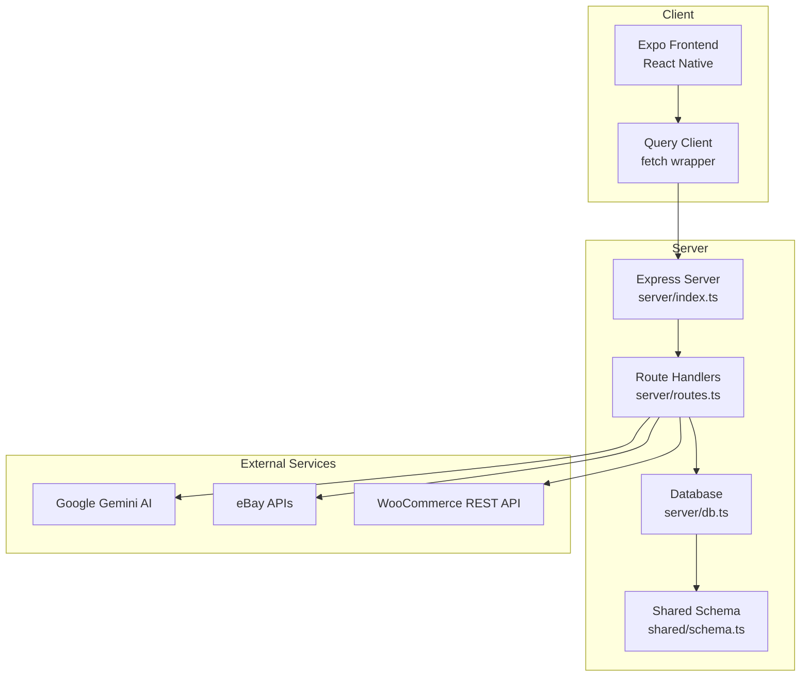
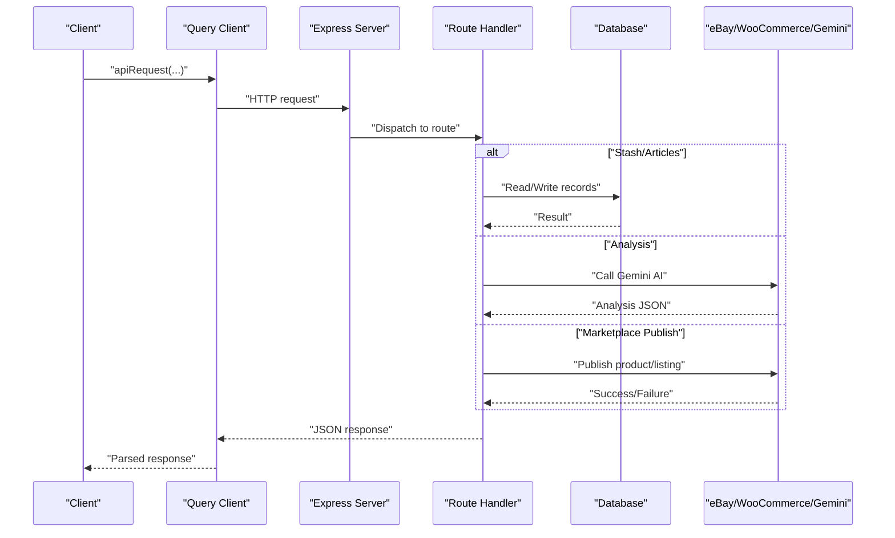
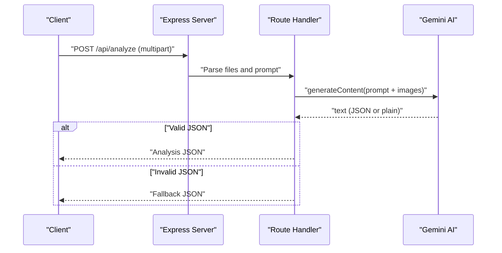
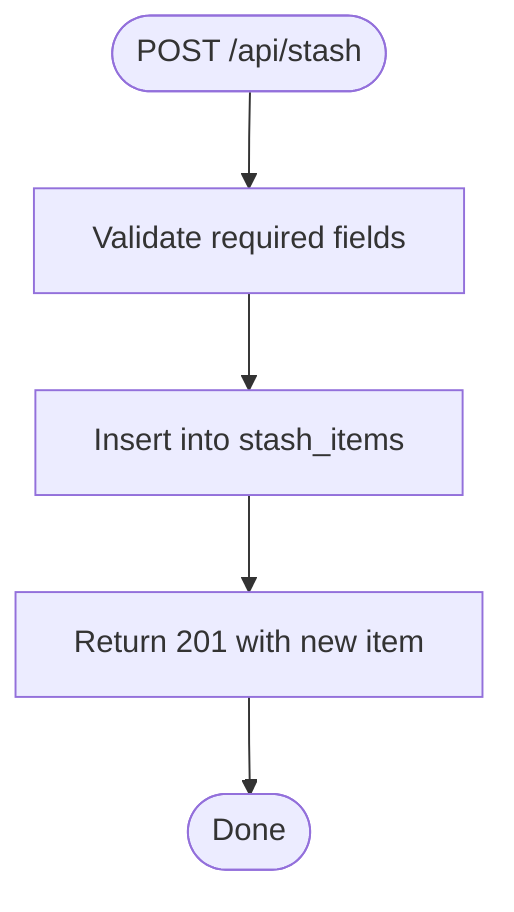
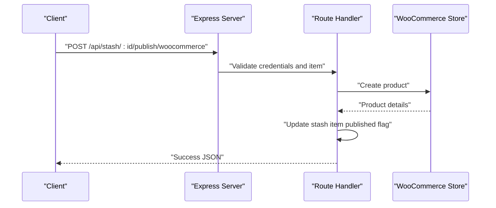
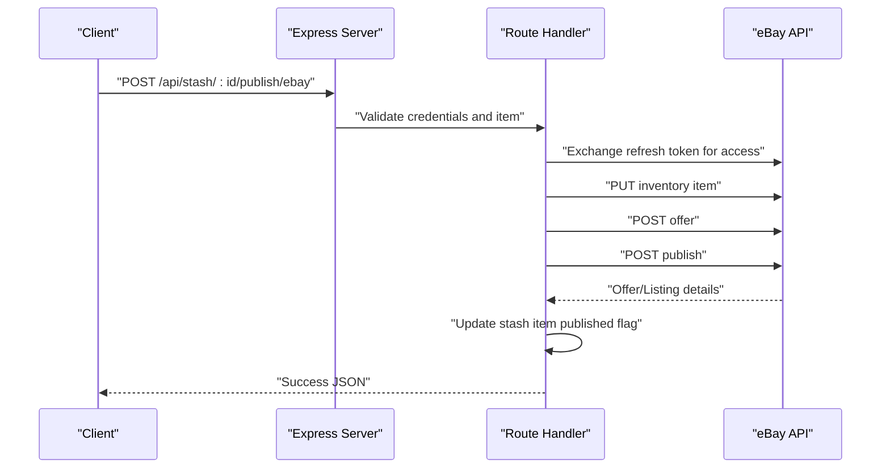
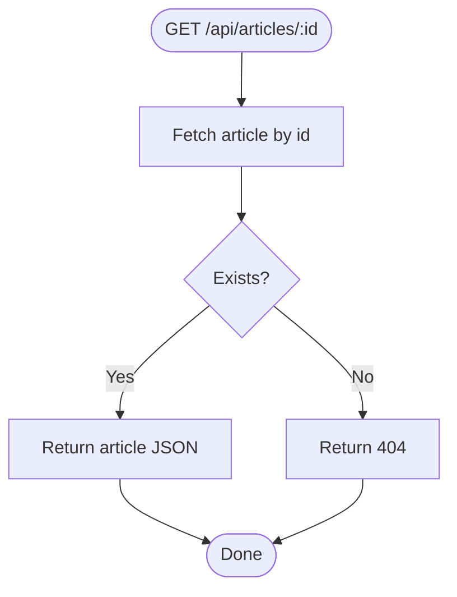
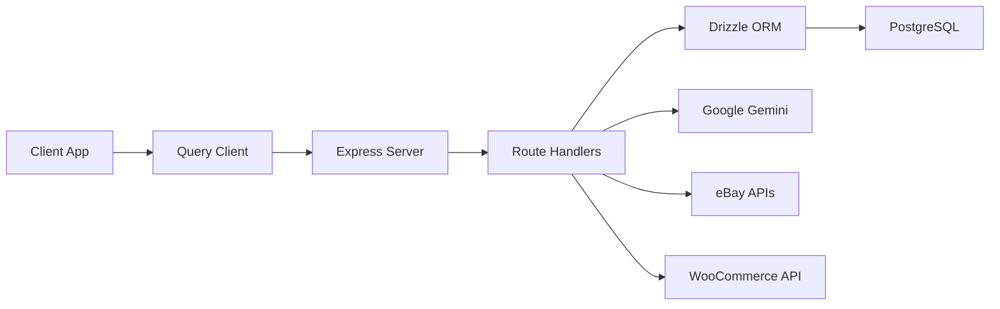

# API Endpoints

<cite>
**Referenced Files in This Document**
- [server/index.ts](file://server/index.ts)
- [server/routes.ts](file://server/routes.ts)
- [server/db.ts](file://server/db.ts)
- [shared/schema.ts](file://shared/schema.ts)
- [client/lib/query-client.ts](file://client/lib/query-client.ts)
- [client/lib/marketplace.ts](file://client/lib/marketplace.ts)
- [client/lib/supabase.ts](file://client/lib/supabase.ts)
- [ENVIRONMENT.md](file://ENVIRONMENT.md)
- [package.json](file://package.json)
</cite>

## Table of Contents
1. [Introduction](#introduction)
2. [Project Structure](#project-structure)
3. [Core Components](#core-components)
4. [Architecture Overview](#architecture-overview)
5. [Detailed Component Analysis](#detailed-component-analysis)
6. [Dependency Analysis](#dependency-analysis)
7. [Performance Considerations](#performance-considerations)
8. [Troubleshooting Guide](#troubleshooting-guide)
9. [Conclusion](#conclusion)

## Introduction
This document provides comprehensive API documentation for the RESTful endpoints powering item analysis, stash management, marketplace integration, and content management. It covers HTTP methods, URL patterns, request/response schemas, authentication requirements, error handling, and integration patterns with external services such as Google Gemini AI, eBay, and WooCommerce.

## Project Structure
The API is implemented in an Express server with route handlers for:
- Content management: Articles listing and retrieval
- Stash management: CRUD operations for collected items
- Item analysis: Image upload and AI-powered analysis via Google Gemini
- Marketplace publishing: Integration with eBay and WooCommerce

**Diagram sources**
- [server/index.ts](file://server/index.ts#L1-L247)
- [server/routes.ts](file://server/routes.ts#L1-L493)
- [server/db.ts](file://server/db.ts#L1-L19)
- [shared/schema.ts](file://shared/schema.ts#L1-L122)

**Section sources**
- [server/index.ts](file://server/index.ts#L1-L247)
- [server/routes.ts](file://server/routes.ts#L1-L493)
- [server/db.ts](file://server/db.ts#L1-L19)
- [shared/schema.ts](file://shared/schema.ts#L1-L122)

## Core Components
- Express server bootstrapping and middleware setup
- Route registration and CORS configuration
- Database connection via Drizzle ORM
- Shared schema definitions for stash items, articles, and related entities
- Client-side API request utilities and marketplace helpers

Key responsibilities:
- Expose REST endpoints under /api
- Parse JSON bodies and handle multipart/form-data for image uploads
- Authenticate and authorize requests (via Supabase on the client; server routes do not enforce auth)
- Integrate with external AI and marketplace APIs
- Return structured JSON responses and standardized error payloads

**Section sources**
- [server/index.ts](file://server/index.ts#L1-L247)
- [server/routes.ts](file://server/routes.ts#L1-L493)
- [server/db.ts](file://server/db.ts#L1-L19)
- [shared/schema.ts](file://shared/schema.ts#L1-L122)
- [client/lib/query-client.ts](file://client/lib/query-client.ts#L1-L80)

## Architecture Overview
The API follows a layered architecture:
- Presentation layer: Express routes
- Application logic: Route handlers performing validations and orchestrating external integrations
- Persistence layer: Drizzle ORM with PostgreSQL
- External integrations: Google Gemini, eBay, and WooCommerce APIs

**Diagram sources**
- [server/routes.ts](file://server/routes.ts#L1-L493)
- [client/lib/query-client.ts](file://client/lib/query-client.ts#L1-L80)

**Section sources**
- [server/routes.ts](file://server/routes.ts#L1-L493)
- [client/lib/query-client.ts](file://client/lib/query-client.ts#L1-L80)

## Detailed Component Analysis

### Item Analysis Endpoint
- Purpose: Upload item images and receive AI-powered analysis
- Method: POST
- URL: /api/analyze
- Content-Type: multipart/form-data
- Upload fields:
  - fullImage: primary item image
  - labelImage: label/tag image
- Limits: Max file size 10MB per file
- AI Integration: Google Gemini (model configurable via environment)
- Request payload:
  - Files: fullImage, labelImage (optional)
- Response payload:
  - title: string
  - description: string
  - category: string
  - estimatedValue: string (currency range)
  - condition: string
  - seoTitle: string
  - seoDescription: string
  - seoKeywords: string[]
  - tags: string[]
- Error handling:
  - 400: Malformed request or missing files
  - 500: Internal server error or AI parsing failure
- Notes:
  - If AI response is not valid JSON, a fallback response is returned

**Diagram sources**
- [server/routes.ts](file://server/routes.ts#L140-L226)

**Section sources**
- [server/routes.ts](file://server/routes.ts#L140-L226)
- [ENVIRONMENT.md](file://ENVIRONMENT.md#L43-L46)

### Stash Management Endpoints
- Base URL: /api/stash
- Methods and URLs:
  - GET /api/stash: List all stash items (sorted by creation date)
  - GET /api/stash/count: Get total stash item count
  - GET /api/stash/:id: Retrieve a specific stash item
  - POST /api/stash: Create a new stash item
  - DELETE /api/stash/:id: Remove a stash item
- Request/response schemas:
  - Stash item fields (selected):
    - id: number
    - userId: string
    - title: string
    - description: string
    - category: string
    - estimatedValue: string
    - condition: string
    - tags: string[]
    - fullImageUrl: string
    - labelImageUrl: string
    - aiAnalysis: JSON object
    - seoTitle: string
    - seoDescription: string
    - seoKeywords: string[]
    - publishedToWoocommerce: boolean
    - publishedToEbay: boolean
    - woocommerceProductId: string
    - ebayListingId: string
    - createdAt: datetime
    - updatedAt: datetime
- Validation and constraints:
  - POST creates items with defaults for userId and timestamps
  - GET by ID returns 404 if not found
  - DELETE removes the record and returns 204 on success
- Error handling:
  - 404: Item not found
  - 500: Database or server error

**Diagram sources**
- [server/routes.ts](file://server/routes.ts#L99-L127)
- [shared/schema.ts](file://shared/schema.ts#L29-L50)

**Section sources**
- [server/routes.ts](file://server/routes.ts#L57-L138)
- [shared/schema.ts](file://shared/schema.ts#L29-L50)

### Marketplace Integration Endpoints

#### Publish to WooCommerce
- Method: POST
- URL: /api/stash/:id/publish/woocommerce
- Path params:
  - id: stash item identifier
- Request payload:
  - storeUrl: string
  - consumerKey: string
  - consumerSecret: string
- Response payload:
  - success: boolean
  - productId: string
  - productUrl: string
- Error handling:
  - 400: Missing credentials or item already published
  - 404: Item not found
  - 5xx: External API error (propagated with message)

**Diagram sources**
- [server/routes.ts](file://server/routes.ts#L228-L296)

**Section sources**
- [server/routes.ts](file://server/routes.ts#L228-L296)

#### Publish to eBay
- Method: POST
- URL: /api/stash/:id/publish/ebay
- Path params:
  - id: stash item identifier
- Request payload:
  - clientId: string
  - clientSecret: string
  - refreshToken: string
  - environment: "sandbox" | "production"
  - merchantLocationKey: string (optional)
- Response payload:
  - success: boolean
  - listingId: string
  - listingUrl: string
  - message: string
- Error handling:
  - 400: Missing credentials, item already published, or eBay policy errors
  - 404: Item not found
  - 5xx: Authentication or listing creation failures

**Diagram sources**
- [server/routes.ts](file://server/routes.ts#L298-L488)

**Section sources**
- [server/routes.ts](file://server/routes.ts#L298-L488)

### Content Management Endpoints
- Base URL: /api/articles
- Methods and URLs:
  - GET /api/articles: List all articles (sorted by creation date)
  - GET /api/articles/:id: Retrieve a specific article
- Request/response schemas:
  - Article fields (selected):
    - id: number
    - title: string
    - content: string
    - excerpt: string
    - category: string
    - imageUrl: string
    - readingTime: number
    - featured: boolean
    - createdAt: datetime
- Error handling:
  - 404: Article not found
  - 500: Server error

**Diagram sources**
- [server/routes.ts](file://server/routes.ts#L25-L55)
- [shared/schema.ts](file://shared/schema.ts#L52-L62)

**Section sources**
- [server/routes.ts](file://server/routes.ts#L25-L55)
- [shared/schema.ts](file://shared/schema.ts#L52-L62)

## Dependency Analysis
- Server dependencies:
  - Express for HTTP routing
  - Multer for multipart/form-data handling
  - Drizzle ORM for database operations
  - Google GenAI SDK for AI analysis
  - PostgreSQL via node-postgres
- Client dependencies:
  - Supabase for authentication
  - TanStack Query for caching and error handling
  - Expo SecureStore and AsyncStorage for credential storage

**Diagram sources**
- [server/routes.ts](file://server/routes.ts#L1-L493)
- [client/lib/query-client.ts](file://client/lib/query-client.ts#L1-L80)
- [client/lib/supabase.ts](file://client/lib/supabase.ts#L1-L39)
- [package.json](file://package.json#L19-L67)

**Section sources**
- [server/routes.ts](file://server/routes.ts#L1-L493)
- [client/lib/query-client.ts](file://client/lib/query-client.ts#L1-L80)
- [client/lib/supabase.ts](file://client/lib/supabase.ts#L1-L39)
- [package.json](file://package.json#L19-L67)

## Performance Considerations
- Image upload size limit: 10MB per file to prevent memory pressure
- JSON body parsing with rawBody capture for logging
- Minimal ORM usage with targeted selects and counts
- External API calls are synchronous; consider adding retries and timeouts for eBay/WooCommerce
- Database SSL configuration allows self-signed certs for development

[No sources needed since this section provides general guidance]

## Troubleshooting Guide
Common issues and resolutions:
- Database connectivity:
  - Ensure DATABASE_URL is set and reachable
  - Verify PostgreSQL is running and accepting connections
- AI integration:
  - Confirm AI_INTEGRATIONS_GEMINI_API_KEY and base URL are configured
  - Check quotas and network access
- Authentication:
  - Client uses Supabase; ensure EXPO_PUBLIC_SUPABASE_URL and keys are configured
  - Server does not enforce auth; rely on client session cookies
- Marketplace publishing:
  - For eBay: ensure refresh token and environment are correct; business policies must be configured
  - For WooCommerce: verify store URL and consumer credentials
- CORS and proxy:
  - Server supports localhost origins for Expo web dev; ensure EXPO_PUBLIC_DOMAIN is set on the client

**Section sources**
- [ENVIRONMENT.md](file://ENVIRONMENT.md#L12-L68)
- [server/index.ts](file://server/index.ts#L16-L53)
- [client/lib/query-client.ts](file://client/lib/query-client.ts#L7-L17)
- [client/lib/supabase.ts](file://client/lib/supabase.ts#L1-L39)

## Conclusion
The API provides a cohesive set of endpoints for item analysis, stash management, and marketplace publishing. It integrates external services while maintaining clear request/response contracts and robust error handling. For production deployments, consider adding authentication enforcement, rate limiting, and improved error propagation to clients.