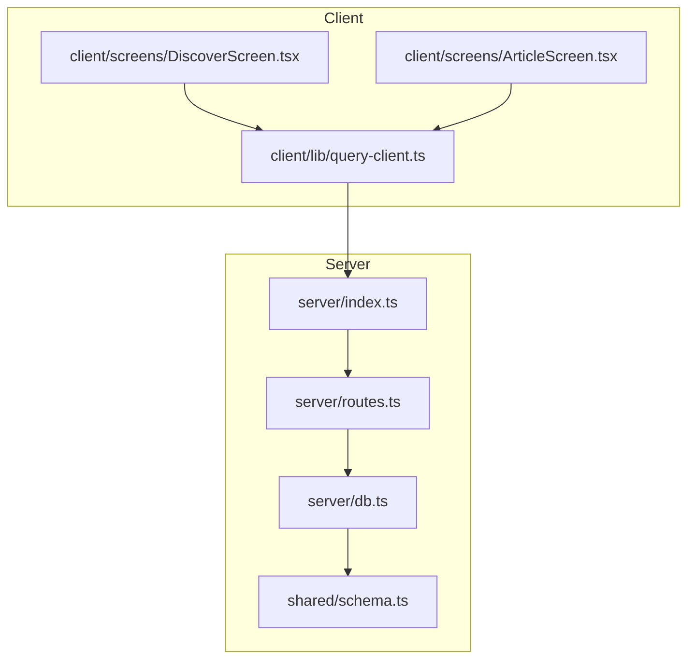
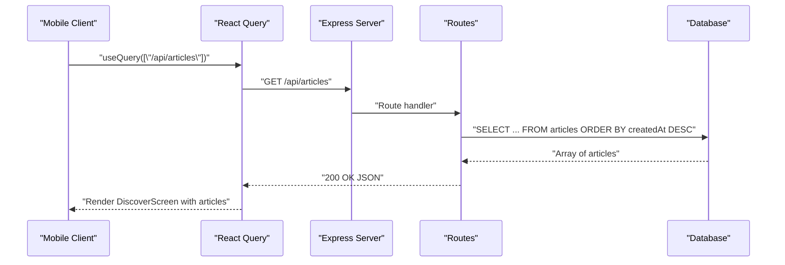
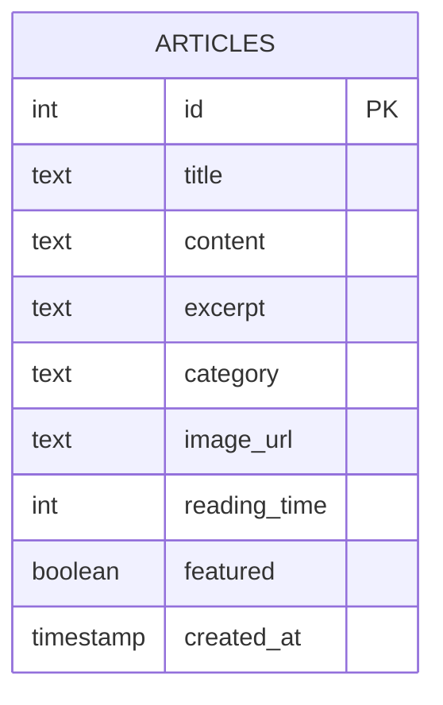
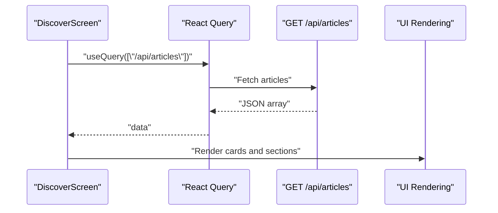
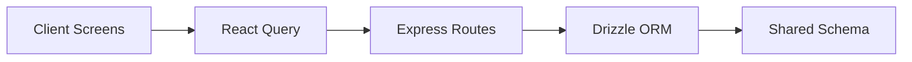

# Content Management API

<cite>
**Referenced Files in This Document**
- [server/index.ts](file://server/index.ts)
- [server/routes.ts](file://server/routes.ts)
- [server/db.ts](file://server/db.ts)
- [shared/schema.ts](file://shared/schema.ts)
- [client/screens/DiscoverScreen.tsx](file://client/screens/DiscoverScreen.tsx)
- [client/screens/ArticleScreen.tsx](file://client/screens/ArticleScreen.tsx)
- [client/lib/query-client.ts](file://client/lib/query-client.ts)
- [ENVIRONMENT.md](file://ENVIRONMENT.md)
</cite>

## Table of Contents
1. [Introduction](#introduction)
2. [Project Structure](#project-structure)
3. [Core Components](#core-components)
4. [Architecture Overview](#architecture-overview)
5. [Detailed Component Analysis](#detailed-component-analysis)
6. [Dependency Analysis](#dependency-analysis)
7. [Performance Considerations](#performance-considerations)
8. [Troubleshooting Guide](#troubleshooting-guide)
9. [Conclusion](#conclusion)
10. [Appendices](#appendices)

## Introduction
This document provides comprehensive API documentation for content management endpoints focused on educational articles. It covers:
- Retrieving all articles ordered by creation date
- Fetching individual articles by ID
- The article data model and metadata fields
- Content management workflow, validation, and response formatting
- Examples of article data structures
- Common use cases for displaying educational content
- Integration patterns with the mobile application's Discover screen
- Content organization, search capabilities, and user engagement features

## Project Structure
The content management API is implemented in the server module and integrates with the shared database schema and the mobile client.

**Diagram sources**
- [server/index.ts](file://server/index.ts#L224-L246)
- [server/routes.ts](file://server/routes.ts#L24-L55)
- [server/db.ts](file://server/db.ts#L1-L19)
- [shared/schema.ts](file://shared/schema.ts#L52-L62)
- [client/screens/DiscoverScreen.tsx](file://client/screens/DiscoverScreen.tsx#L88-L174)
- [client/screens/ArticleScreen.tsx](file://client/screens/ArticleScreen.tsx#L26-L92)
- [client/lib/query-client.ts](file://client/lib/query-client.ts#L7-L80)

**Section sources**
- [server/index.ts](file://server/index.ts#L1-L247)
- [server/routes.ts](file://server/routes.ts#L1-L493)
- [server/db.ts](file://server/db.ts#L1-L19)
- [shared/schema.ts](file://shared/schema.ts#L1-L122)
- [client/screens/DiscoverScreen.tsx](file://client/screens/DiscoverScreen.tsx#L1-L339)
- [client/screens/ArticleScreen.tsx](file://client/screens/ArticleScreen.tsx#L1-L92)
- [client/lib/query-client.ts](file://client/lib/query-client.ts#L1-L80)

## Core Components
- Article data model: Defines the structure of articles stored in the database.
- API routes: Expose endpoints for listing and retrieving articles.
- Client integration: Uses React Query to fetch and display articles in the Discover and Article screens.

Key responsibilities:
- Server: Exposes GET /api/articles and GET /api/articles/:id, orders by creation date, and handles errors.
- Database: Provides typed schema for articles and timestamps.
- Client: Queries the API and renders article lists and individual article views.

**Section sources**
- [shared/schema.ts](file://shared/schema.ts#L52-L62)
- [server/routes.ts](file://server/routes.ts#L25-L55)
- [client/screens/DiscoverScreen.tsx](file://client/screens/DiscoverScreen.tsx#L88-L174)
- [client/screens/ArticleScreen.tsx](file://client/screens/ArticleScreen.tsx#L26-L92)

## Architecture Overview
The content management API follows a straightforward request-response pattern:
- Client requests articles via React Query using the configured base URL.
- Express server registers routes and delegates to the database layer.
- Database returns structured rows based on the shared schema.
- Responses are JSON-formatted arrays or single objects.

**Diagram sources**
- [client/lib/query-client.ts](file://client/lib/query-client.ts#L46-L80)
- [server/routes.ts](file://server/routes.ts#L25-L36)
- [server/db.ts](file://server/db.ts#L1-L19)

**Section sources**
- [server/index.ts](file://server/index.ts#L224-L246)
- [server/routes.ts](file://server/routes.ts#L25-L55)
- [client/lib/query-client.ts](file://client/lib/query-client.ts#L7-L80)

## Detailed Component Analysis

### API Endpoints

#### GET /api/articles
- Purpose: Retrieve all educational articles ordered by creation date (newest first).
- Behavior:
  - Selects all rows from the articles table.
  - Orders by createdAt descending.
  - Returns a JSON array of article objects.
- Status Codes:
  - 200 OK: Successful retrieval.
  - 500 Internal Server Error: Server-side failure with error message.
- Response Format: JSON array of article objects.

Example response shape:
- id: integer
- title: string
- content: string
- excerpt: string or null
- category: string
- imageUrl: string or null
- readingTime: integer
- featured: boolean
- createdAt: timestamp

Common use cases:
- Populate the Discover screen with latest articles.
- Filter featured vs. regular articles client-side.

Integration note:
- The client uses React Query with queryKey ["/api/articles"] to fetch and cache the list.

**Section sources**
- [server/routes.ts](file://server/routes.ts#L25-L36)
- [client/screens/DiscoverScreen.tsx](file://client/screens/DiscoverScreen.tsx#L93-L95)

#### GET /api/articles/:id
- Purpose: Retrieve a single article by its numeric ID.
- Path Parameters:
  - id: integer article identifier.
- Behavior:
  - Queries the articles table by id.
  - Returns the matching article object if found.
  - Returns 404 Not Found if not present.
  - Returns 500 Internal Server Error on server failure.
- Response Format: JSON article object or error object.

Example response shape:
- id: integer
- title: string
- content: string
- excerpt: string or null
- category: string
- imageUrl: string or null
- readingTime: integer
- featured: boolean
- createdAt: timestamp

Common use cases:
- Navigate from Discover to Article screen.
- Load article content for detailed reading.

**Section sources**
- [server/routes.ts](file://server/routes.ts#L38-L55)
- [client/screens/ArticleScreen.tsx](file://client/screens/ArticleScreen.tsx#L32-L34)

### Data Model: Articles
The article entity is defined in the shared schema with the following fields:
- id: serial (primary key)
- title: text (required)
- content: text (required)
- excerpt: text (optional)
- category: text (required)
- imageUrl: text (optional)
- readingTime: integer (default 5)
- featured: boolean (default false)
- createdAt: timestamp (default current timestamp)

Validation and defaults:
- Required fields enforced by database constraints.
- Default values applied for readingTime and featured.
- createdAt is managed by the database.

**Diagram sources**
- [shared/schema.ts](file://shared/schema.ts#L52-L62)

**Section sources**
- [shared/schema.ts](file://shared/schema.ts#L52-L62)

### Content Organization and Metadata
- Categories: Articles are tagged with a category field for grouping.
- Featured flag: Allows prioritizing articles in the Discover screen.
- Reading time: Integer estimate for user engagement.
- Excerpt: Optional summary for list previews.
- Image URL: Optional hero image reference.

Organization patterns:
- Discover screen separates featured and regular articles.
- Latest section displays newest articles ordered by createdAt.

**Section sources**
- [shared/schema.ts](file://shared/schema.ts#L52-L62)
- [client/screens/DiscoverScreen.tsx](file://client/screens/DiscoverScreen.tsx#L97-L98)

### Search Capabilities
- Current implementation: No dedicated search endpoint exists.
- Suggested enhancement: Add GET /api/articles/search?q=query with server-side filtering on title, excerpt, and content.

[No sources needed since this section proposes enhancements not currently implemented]

### User Engagement Features
- Reading time: Provides user expectation for content consumption.
- Featured articles: Highlights curated content.
- Category badges: Improve discoverability in lists.

**Section sources**
- [shared/schema.ts](file://shared/schema.ts#L52-L62)
- [client/screens/DiscoverScreen.tsx](file://client/screens/DiscoverScreen.tsx#L25-L74)

### Client Integration Patterns
- Base URL resolution: The client resolves the API base URL from environment configuration.
- Query client: Centralized fetch logic with error handling and credentials inclusion.
- Discover screen: Fetches article list, separates featured and latest, and supports pull-to-refresh.
- Article screen: Loads a single article by ID and renders content with metadata.

**Diagram sources**
- [client/screens/DiscoverScreen.tsx](file://client/screens/DiscoverScreen.tsx#L88-L174)
- [client/lib/query-client.ts](file://client/lib/query-client.ts#L46-L80)

**Section sources**
- [client/lib/query-client.ts](file://client/lib/query-client.ts#L7-L80)
- [client/screens/DiscoverScreen.tsx](file://client/screens/DiscoverScreen.tsx#L88-L174)
- [client/screens/ArticleScreen.tsx](file://client/screens/ArticleScreen.tsx#L26-L92)

## Dependency Analysis
- Server depends on:
  - Express for routing and middleware
  - Drizzle ORM for database access
  - Shared schema for type-safe queries
- Client depends on:
  - React Query for caching and fetching
  - Environment configuration for base URL

**Diagram sources**
- [client/screens/DiscoverScreen.tsx](file://client/screens/DiscoverScreen.tsx#L88-L174)
- [client/lib/query-client.ts](file://client/lib/query-client.ts#L46-L80)
- [server/routes.ts](file://server/routes.ts#L24-L55)
- [server/db.ts](file://server/db.ts#L1-L19)
- [shared/schema.ts](file://shared/schema.ts#L52-L62)

**Section sources**
- [server/routes.ts](file://server/routes.ts#L1-L493)
- [server/db.ts](file://server/db.ts#L1-L19)
- [shared/schema.ts](file://shared/schema.ts#L1-L122)
- [client/lib/query-client.ts](file://client/lib/query-client.ts#L1-L80)

## Performance Considerations
- Sorting by createdAt: The database sorts by a timestamp column; ensure appropriate indexing for optimal performance.
- Pagination: For large datasets, consider adding pagination parameters (limit, offset) to avoid large payloads.
- Caching: React Query caches responses; consider adjusting staleTime and refetch intervals based on content update frequency.
- Network efficiency: Minimize payload size by avoiding unnecessary fields in list views.

[No sources needed since this section provides general guidance]

## Troubleshooting Guide
Common issues and resolutions:
- Database connectivity:
  - Ensure DATABASE_URL is set and reachable.
  - Confirm PostgreSQL is running and accessible.
- API base URL:
  - Verify EXPO_PUBLIC_DOMAIN is configured correctly in the client.
- CORS and credentials:
  - Server sets Access-Control-Allow-Origin dynamically; ensure origin is whitelisted.
  - Client includes credentials in fetch requests.
- Error responses:
  - Server returns JSON error objects on failures; inspect status codes and messages.

**Section sources**
- [ENVIRONMENT.md](file://ENVIRONMENT.md#L18-L38)
- [server/index.ts](file://server/index.ts#L16-L53)
- [client/lib/query-client.ts](file://client/lib/query-client.ts#L7-L17)

## Conclusion
The content management API provides a simple and effective foundation for delivering educational articles. With minimal endpoints and a clean data model, it integrates seamlessly with the mobile client’s Discover and Article screens. Future enhancements could include search, pagination, and richer metadata to further improve content discovery and user engagement.

[No sources needed since this section summarizes without analyzing specific files]

## Appendices

### API Definitions

- GET /api/articles
  - Description: Retrieve all articles ordered by creation date (newest first)
  - Response: 200 OK with JSON array of articles
  - Errors: 500 Internal Server Error with JSON error object

- GET /api/articles/:id
  - Description: Retrieve a single article by ID
  - Path Parameters: id (integer)
  - Response: 200 OK with JSON article object or 404 Not Found
  - Errors: 500 Internal Server Error with JSON error object

**Section sources**
- [server/routes.ts](file://server/routes.ts#L25-L55)

### Example Article Data Structures
Representative shapes for list and detail views:
- List item: id, title, excerpt, category, imageUrl, readingTime, featured
- Detail item: id, title, content, excerpt, category, imageUrl, readingTime, createdAt

**Section sources**
- [shared/schema.ts](file://shared/schema.ts#L52-L62)
- [client/screens/DiscoverScreen.tsx](file://client/screens/DiscoverScreen.tsx#L15-L24)
- [client/screens/ArticleScreen.tsx](file://client/screens/ArticleScreen.tsx#L15-L24)