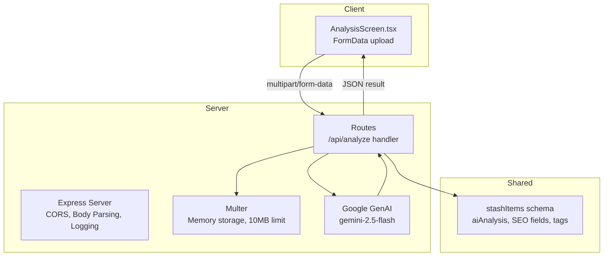
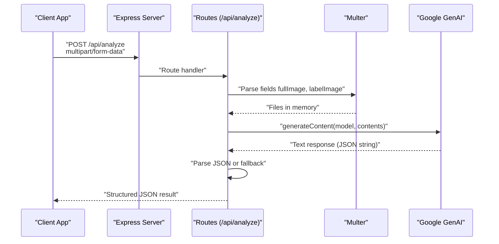
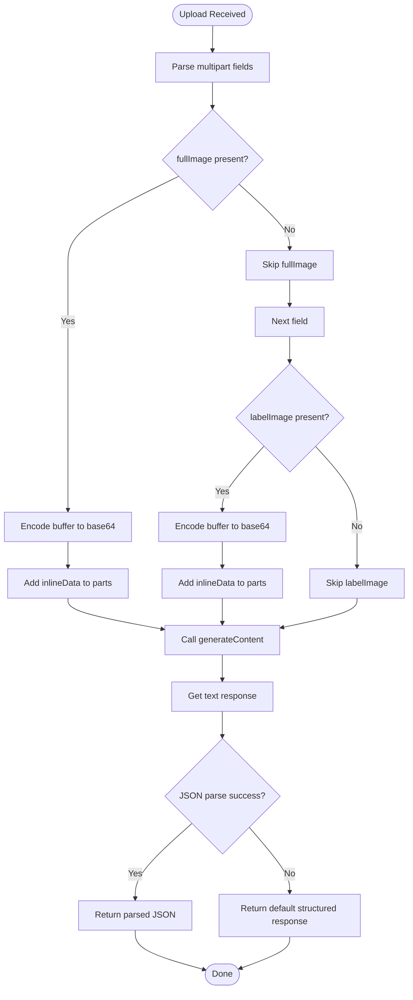
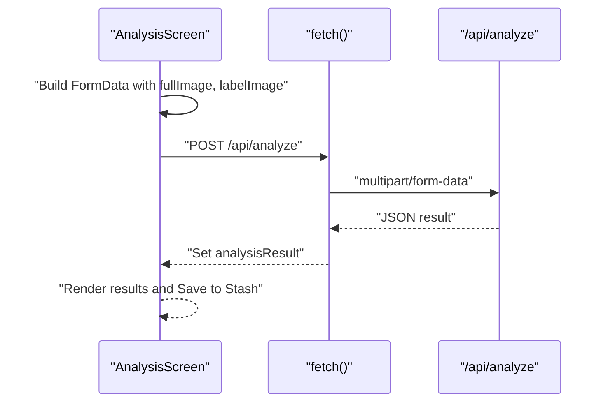
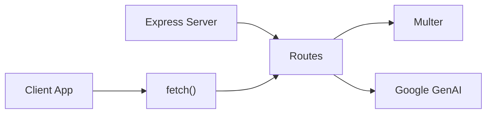

# Item Analysis API

<cite>
**Referenced Files in This Document**
- [server/index.ts](file://server/index.ts)
- [server/routes.ts](file://server/routes.ts)
- [client/screens/AnalysisScreen.tsx](file://client/screens/AnalysisScreen.tsx)
- [shared/schema.ts](file://shared/schema.ts)
- [ENVIRONMENT.md](file://ENVIRONMENT.md)
- [package.json](file://package.json)
</cite>

## Table of Contents
1. [Introduction](#introduction)
2. [Project Structure](#project-structure)
3. [Core Components](#core-components)
4. [Architecture Overview](#architecture-overview)
5. [Detailed Component Analysis](#detailed-component-analysis)
6. [Dependency Analysis](#dependency-analysis)
7. [Performance Considerations](#performance-considerations)
8. [Troubleshooting Guide](#troubleshooting-guide)
9. [Conclusion](#conclusion)
10. [Appendices](#appendices)

## Introduction
This document provides comprehensive API documentation for the item analysis endpoint (/api/analyze). It covers the multipart form data upload process for dual-image capture (fullImage, labelImage), Google Gemini AI integration, and response formatting. It also explains the image processing pipeline, base64 encoding requirements, AI prompt engineering, request/response schemas, error handling scenarios, authentication requirements, and practical examples for successful analysis requests and troubleshooting common issues.

## Project Structure
The item analysis feature spans the client and server layers:
- Client: Captures two images (full item and label) and submits them to the backend.
- Server: Validates and processes the multipart form data, invokes Google Gemini, parses the AI response, and returns structured results.
- Shared: Defines the stash item schema used for storing analysis results.

**Diagram sources**
- [server/index.ts](file://server/index.ts#L16-L98)
- [server/routes.ts](file://server/routes.ts#L140-L226)
- [client/screens/AnalysisScreen.tsx](file://client/screens/AnalysisScreen.tsx#L70-L112)
- [shared/schema.ts](file://shared/schema.ts#L29-L50)

**Section sources**
- [server/index.ts](file://server/index.ts#L16-L98)
- [server/routes.ts](file://server/routes.ts#L140-L226)
- [client/screens/AnalysisScreen.tsx](file://client/screens/AnalysisScreen.tsx#L70-L112)
- [shared/schema.ts](file://shared/schema.ts#L29-L50)

## Core Components
- Endpoint: POST /api/analyze
- Request type: multipart/form-data with two binary parts:
  - fullImage: JPEG/PNG of the full item
  - labelImage: JPEG/PNG of the item label/tag
- Response type: JSON object containing analysis fields
- AI provider: Google Gemini (gemini-2.5-flash)
- Image processing: Base64-encoded inline data sent to Gemini
- Error handling: Graceful fallback to default structured response if AI JSON parsing fails

**Section sources**
- [server/routes.ts](file://server/routes.ts#L140-L226)
- [client/screens/AnalysisScreen.tsx](file://client/screens/AnalysisScreen.tsx#L70-L112)

## Architecture Overview
The item analysis workflow integrates client image capture, server upload handling, AI inference, and structured response formatting.

**Diagram sources**
- [server/routes.ts](file://server/routes.ts#L140-L226)
- [client/screens/AnalysisScreen.tsx](file://client/screens/AnalysisScreen.tsx#L70-L112)

## Detailed Component Analysis

### Endpoint Definition
- Method: POST
- Path: /api/analyze
- Purpose: Accept dual images (full item + label) and return AI-assisted item analysis

**Section sources**
- [server/routes.ts](file://server/routes.ts#L140-L143)

### Request Schema
- Content-Type: multipart/form-data
- Fields:
  - fullImage: Binary image (JPEG/PNG), optional
  - labelImage: Binary image (JPEG/PNG), optional
- Size limit: 10 MB per file
- Notes:
  - At least one field is required for meaningful analysis
  - Images are processed as inlineData with base64 encoding

**Section sources**
- [server/routes.ts](file://server/routes.ts#L19-L22)
- [server/routes.ts](file://server/routes.ts#L178-L194)

### AI Prompt Engineering
The prompt instructs Gemini to:
- Analyze a collectible/vintage item using both full and label images
- Produce a structured JSON with:
  - title, description, category
  - estimatedValue (format: "$XX-$XX")
  - condition (Excellent, Very Good, Good, Fair, Poor)
  - seoTitle, seoDescription, seoKeywords (array), tags (array)

**Section sources**
- [server/routes.ts](file://server/routes.ts#L150-L174)

### Image Processing Pipeline
- Multer configuration:
  - Memory storage to avoid disk I/O
  - 10 MB file size limit
- Base64 encoding:
  - Each image part is encoded to base64 before sending to Gemini
- Gemini payload composition:
  - Text prompt part
  - Optional inlineData parts for fullImage and labelImage

**Diagram sources**
- [server/routes.ts](file://server/routes.ts#L144-L226)

**Section sources**
- [server/routes.ts](file://server/routes.ts#L19-L22)
- [server/routes.ts](file://server/routes.ts#L176-L202)
- [server/routes.ts](file://server/routes.ts#L206-L221)

### Response Formatting
The endpoint returns a JSON object with the following fields:
- title: string
- description: string
- category: string
- estimatedValue: string (format: "$XX-$XX")
- condition: string (Excellent, Very Good, Good, Fair, Poor)
- seoTitle: string
- seoDescription: string
- seoKeywords: string[]
- tags: string[]

If the AI response is not valid JSON, the server responds with a default structured object containing conservative defaults.

**Section sources**
- [server/routes.ts](file://server/routes.ts#L163-L174)
- [server/routes.ts](file://server/routes.ts#L206-L221)

### Client Integration
The client constructs FormData with:
- fullImage: image/jpeg with name "full.jpg"
- labelImage: image/jpeg with name "label.jpg"
It then posts to /api/analyze and displays the returned analysis.

**Diagram sources**
- [client/screens/AnalysisScreen.tsx](file://client/screens/AnalysisScreen.tsx#L70-L112)

**Section sources**
- [client/screens/AnalysisScreen.tsx](file://client/screens/AnalysisScreen.tsx#L70-L112)

### Authentication Requirements
- No authentication required for /api/analyze
- The endpoint is publicly accessible for image analysis
- Subsequent operations (e.g., saving to stash) may require authentication depending on the client flow

**Section sources**
- [server/routes.ts](file://server/routes.ts#L140-L143)
- [client/screens/AnalysisScreen.tsx](file://client/screens/AnalysisScreen.tsx#L40-L60)

### Error Handling Scenarios
- Missing or invalid images:
  - Gemini receives only the prompt; server still returns a structured response
- AI JSON parsing failure:
  - Server falls back to a default structured response
- Server errors:
  - Generic 500 with error message

**Section sources**
- [server/routes.ts](file://server/routes.ts#L222-L225)
- [server/routes.ts](file://server/routes.ts#L206-L221)

## Dependency Analysis
- Express server setup handles CORS, body parsing, logging, and error handling
- Multer manages in-memory file uploads with size limits
- Google GenAI client is initialized with environment variables for API key and base URL
- Client uses fetch to submit FormData to /api/analyze

**Diagram sources**
- [server/index.ts](file://server/index.ts#L224-L246)
- [server/routes.ts](file://server/routes.ts#L11-L17)
- [package.json](file://package.json#L19-L67)

**Section sources**
- [server/index.ts](file://server/index.ts#L224-L246)
- [server/routes.ts](file://server/routes.ts#L11-L17)
- [package.json](file://package.json#L19-L67)

## Performance Considerations
- Multer memory storage avoids disk I/O but increases memory usage; keep images under 10 MB
- Base64 encoding increases payload size by approximately 33%
- Gemini latency depends on network and quota; consider adding client-side timeouts
- Consider compressing images before upload to reduce payload size

[No sources needed since this section provides general guidance]

## Troubleshooting Guide
Common issues and resolutions:
- Missing AI credentials:
  - Ensure AI_INTEGRATIONS_GEMINI_API_KEY is configured via Replit AI Integrations
- Upload failures:
  - Verify multipart/form-data Content-Type
  - Confirm file sizes are under 10 MB
  - Ensure both fullImage and labelImage are valid JPEG/PNG
- JSON parsing errors:
  - Gemini may return non-JSON text; server falls back gracefully
- Network/API errors:
  - Check server logs for Gemini API errors
  - Verify API quota and billing status

**Section sources**
- [ENVIRONMENT.md](file://ENVIRONMENT.md#L43-L46)
- [ENVIRONMENT.md](file://ENVIRONMENT.md#L191-L195)
- [server/routes.ts](file://server/routes.ts#L222-L225)

## Conclusion
The /api/analyze endpoint provides a streamlined dual-image analysis workflow powered by Google Gemini. It accepts multipart form data, processes images with base64 encoding, and returns a structured JSON response suitable for inventory and listing systems. Robust fallbacks and clear error handling ensure reliability even when AI responses are unexpected.

[No sources needed since this section summarizes without analyzing specific files]

## Appendices

### Request/Response Schemas

- Request
  - Method: POST
  - Path: /api/analyze
  - Headers: Content-Type: multipart/form-data
  - Fields:
    - fullImage: image/jpeg or image/png (optional)
    - labelImage: image/jpeg or image/png (optional)
  - Limits: 10 MB per file

- Response (on success)
  - Content-Type: application/json
  - Body fields:
    - title: string
    - description: string
    - category: string
    - estimatedValue: string (format: "$XX-$XX")
    - condition: string (Excellent, Very Good, Good, Fair, Poor)
    - seoTitle: string
    - seoDescription: string
    - seoKeywords: string[]
    - tags: string[]
  - Example response fields:
    - title: "Vintage Leather Handbag"
    - description: "Authentic vintage leather handbag with gold hardware"
    - category: "Handbag"
    - estimatedValue: "$150-$200"
    - condition: "Very Good"
    - seoTitle: "Vintage Leather Handbag for Sale"
    - seoDescription: "Beautiful vintage leather handbag in excellent condition"
    - seoKeywords: ["vintage", "handbag", "leather"]
    - tags: ["vintage", "handbag", "collectible"]

- Error Responses
  - 500 Internal Server Error: Generic failure during analysis
  - 404 Not Found: Item not found (other endpoints)
  - 400 Bad Request: Missing credentials (publish endpoints)

**Section sources**
- [server/routes.ts](file://server/routes.ts#L140-L226)
- [server/routes.ts](file://server/routes.ts#L163-L174)
- [shared/schema.ts](file://shared/schema.ts#L29-L50)

### Practical Examples

- Successful Analysis Request (conceptual)
  - Client builds FormData with:
    - fullImage: image/jpeg named "full.jpg"
    - labelImage: image/jpeg named "label.jpg"
  - Server returns structured JSON with analysis fields

- Troubleshooting Tips
  - If AI response is not JSON, server returns a default structured object
  - If images are missing, server still returns a default structured object
  - If Gemini API key is missing, server initialization uses an empty key; Gemini calls will fail

**Section sources**
- [client/screens/AnalysisScreen.tsx](file://client/screens/AnalysisScreen.tsx#L70-L112)
- [server/routes.ts](file://server/routes.ts#L206-L221)
- [server/routes.ts](file://server/routes.ts#L11-L17)