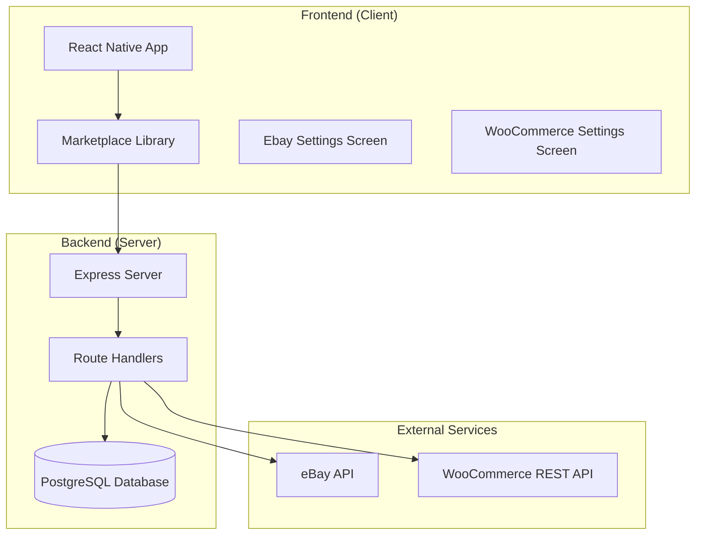
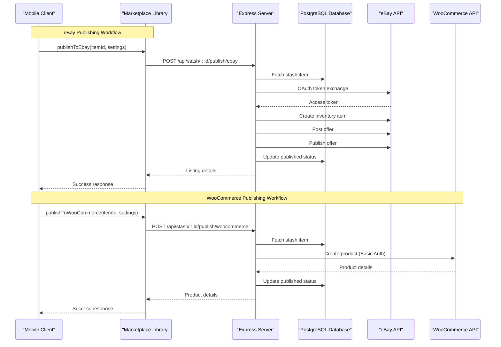
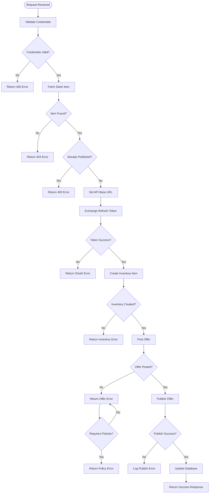
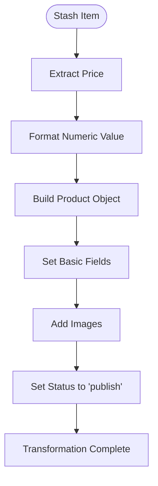
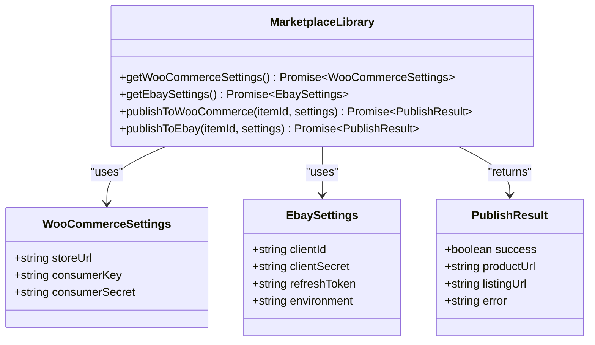
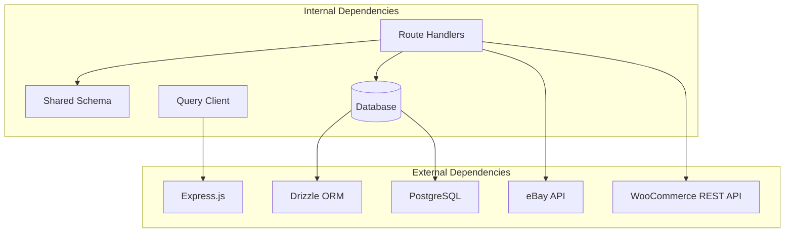

# Marketplace Integration APIs

<cite>
**Referenced Files in This Document**
- [server/index.ts](file://server/index.ts)
- [server/routes.ts](file://server/routes.ts)
- [server/db.ts](file://server/db.ts)
- [client/lib/marketplace.ts](file://client/lib/marketplace.ts)
- [client/lib/query-client.ts](file://client/lib/query-client.ts)
- [client/screens/EbaySettingsScreen.tsx](file://client/screens/EbaySettingsScreen.tsx)
- [client/screens/WooCommerceSettingsScreen.tsx](file://client/screens/WooCommerceSettingsScreen.tsx)
- [shared/schema.ts](file://shared/schema.ts)
- [ENVIRONMENT.md](file://ENVIRONMENT.md)
</cite>

## Table of Contents
1. [Introduction](#introduction)
2. [Project Structure](#project-structure)
3. [Core Components](#core-components)
4. [Architecture Overview](#architecture-overview)
5. [Detailed Component Analysis](#detailed-component-analysis)
6. [Dependency Analysis](#dependency-analysis)
7. [Performance Considerations](#performance-considerations)
8. [Troubleshooting Guide](#troubleshooting-guide)
9. [Conclusion](#conclusion)

## Introduction

This document provides comprehensive API documentation for marketplace publishing endpoints that enable users to publish items to eBay and WooCommerce marketplaces. The system consists of two primary integration points:

- **POST /api/stash/:id/publish/ebay**: Creates eBay listings through OAuth token exchange, inventory item creation, offer posting, and listing publication
- **POST /api/stash/:id/publish/woocommerce**: Publishes products to WooCommerce stores using REST API authentication and product data transformation

The documentation covers endpoint specifications, credential requirements, environment configurations (production vs sandbox), error handling strategies, marketplace-specific data mappings, practical publishing workflows, and troubleshooting guidance for both marketplace platforms.

## Project Structure

The marketplace integration spans both frontend and backend components with clear separation of concerns:



**Diagram sources**
- [server/index.ts](file://server/index.ts#L1-L247)
- [server/routes.ts](file://server/routes.ts#L24-L493)
- [client/lib/marketplace.ts](file://client/lib/marketplace.ts#L1-L129)

**Section sources**
- [server/index.ts](file://server/index.ts#L1-L247)
- [server/routes.ts](file://server/routes.ts#L24-L493)

## Core Components

### eBay Publishing Endpoint

The eBay integration follows a multi-stage process:

1. **OAuth Token Exchange**: Exchanges refresh tokens for access tokens
2. **Inventory Creation**: Creates inventory items with product details
3. **Offer Posting**: Posts offers with pricing and shipping details
4. **Listing Publication**: Publishes offers to create live listings

### WooCommerce Publishing Endpoint

The WooCommerce integration follows a streamlined process:

1. **REST API Authentication**: Uses Basic Authentication with consumer keys
2. **Product Data Transformation**: Maps stash item data to WooCommerce product format
3. **Product Creation**: Creates products via REST API
4. **Response Handling**: Updates local records with remote identifiers

**Section sources**
- [server/routes.ts](file://server/routes.ts#L298-L488)
- [server/routes.ts](file://server/routes.ts#L228-L296)

## Architecture Overview

The marketplace integration architecture demonstrates clear separation between client-side credential management and server-side marketplace interactions:



**Diagram sources**
- [client/lib/marketplace.ts](file://client/lib/marketplace.ts#L105-L128)
- [server/routes.ts](file://server/routes.ts#L298-L488)
- [server/routes.ts](file://server/routes.ts#L228-L296)

## Detailed Component Analysis

### eBay Publishing Endpoint

#### Endpoint Specification

**Method**: POST  
**Path**: `/api/stash/:id/publish/ebay`  
**Authentication**: None (client-side credentials)  
**Request Body**:
```json
{
  "clientId": "string",
  "clientSecret": "string", 
  "refreshToken": "string",
  "environment": "sandbox|production",
  "merchantLocationKey": "string"
}
```

**Response Body**:
```json
{
  "success": true,
  "listingId": "string",
  "listingUrl": "string",
  "message": "string"
}
```

#### OAuth Token Exchange Process

The eBay integration implements a comprehensive OAuth flow:



**Diagram sources**
- [server/routes.ts](file://server/routes.ts#L298-L488)

#### Data Mapping and Transformation

The eBay integration performs extensive data mapping:

| Stash Item Field | eBay Field | Transformation |
|------------------|------------|----------------|
| `title` | `product.title` | Truncated to 80 characters |
| `description` | `product.description` | Wrapped in paragraph tags |
| `fullImageUrl` | `product.imageUrls` | Single image array |
| `estimatedValue` | `pricingSummary.price.value` | Extracted numeric value |
| `condition` | `condition` | Mapped via conditionMap |

#### Environment Configuration

The system supports both sandbox and production environments:

- **Sandbox**: `https://api.sandbox.ebay.com`
- **Production**: `https://api.ebay.com`

#### Error Handling Strategies

Common eBay integration errors and their handling:

1. **Missing Credentials**: Returns 400 with specific error message
2. **OAuth Token Failure**: Returns 401 with detailed error description
3. **Business Policies Required**: Returns 400 with policy configuration guidance
4. **Inventory Creation Errors**: Returns 400 with specific error message
5. **Network Failures**: Returns 500 with generic error message

**Section sources**
- [server/routes.ts](file://server/routes.ts#L298-L488)

### WooCommerce Publishing Endpoint

#### Endpoint Specification

**Method**: POST  
**Path**: `/api/stash/:id/publish/woocommerce`  
**Authentication**: None (client-side credentials)  
**Request Body**:
```json
{
  "storeUrl": "string",
  "consumerKey": "string",
  "consumerSecret": "string"
}
```

**Response Body**:
```json
{
  "success": true,
  "productId": "string",
  "productUrl": "string"
}
```

#### REST API Authentication

The WooCommerce integration uses Basic Authentication:

1. **Credential Preparation**: Concatenate `consumerKey:consumerSecret`
2. **Base64 Encoding**: Encode credentials for Authorization header
3. **API Call**: Send POST request to `/wp-json/wc/v3/products`

#### Product Data Transformation

The system transforms stash item data to WooCommerce product format:



**Diagram sources**
- [server/routes.ts](file://server/routes.ts#L228-L296)

#### Data Mapping and Transformation

| Stash Item Field | WooCommerce Field | Transformation |
|------------------|-------------------|----------------|
| `title` | `name` | Direct assignment |
| `estimatedValue` | `regular_price` | Extracted numeric value |
| `seoDescription` | `description` | Direct assignment |
| `description` | `short_description` | First 200 characters |
| `fullImageUrl` | `images[].src` | Single image array |
| `condition` | Category mapping | No direct mapping |

#### Error Handling Strategies

Common WooCommerce integration errors and their handling:

1. **Missing Credentials**: Returns 400 with credential error message
2. **Invalid Store URL**: Returns 400 with URL validation error
3. **Authentication Failure**: Returns 401 with authentication error
4. **Network Timeout**: Returns 500 with timeout error
5. **API Limit Exceeded**: Returns 429 with rate limit error

**Section sources**
- [server/routes.ts](file://server/routes.ts#L228-L296)

### Client-Side Integration Libraries

#### Marketplace Library Functions

The client-side marketplace library provides unified interfaces for both platforms:



**Diagram sources**
- [client/lib/marketplace.ts](file://client/lib/marketplace.ts#L1-L129)

#### Credential Storage and Retrieval

The system implements secure credential storage using platform-specific approaches:

- **Mobile Devices**: Expo SecureStore for encrypted storage
- **Web Applications**: AsyncStorage for credential storage
- **Environment Separation**: Different storage keys for sandbox/production

**Section sources**
- [client/lib/marketplace.ts](file://client/lib/marketplace.ts#L19-L79)

## Dependency Analysis

The marketplace integration has minimal external dependencies with clear boundary definitions:



**Diagram sources**
- [server/routes.ts](file://server/routes.ts#L1-L17)
- [server/db.ts](file://server/db.ts#L1-L19)

### External Service Dependencies

| Service | Purpose | Authentication Method |
|---------|---------|----------------------|
| eBay API | OAuth token exchange, inventory management, offer posting | Basic Authentication with client credentials |
| WooCommerce REST API | Product creation and management | Basic Authentication with consumer keys |
| PostgreSQL | Data persistence | Connection string environment variable |
| Drizzle ORM | Database abstraction | Connection pooling |

**Section sources**
- [server/routes.ts](file://server/routes.ts#L298-L488)
- [server/routes.ts](file://server/routes.ts#L228-L296)
- [server/db.ts](file://server/db.ts#L1-L19)

## Performance Considerations

### Network Optimization

1. **Connection Pooling**: PostgreSQL connections are pooled for efficient resource utilization
2. **Request Timeout Management**: External API calls implement appropriate timeout handling
3. **Response Caching**: Local caching reduces redundant external API calls
4. **Batch Operations**: Consider batching multiple publishing operations

### Memory Management

1. **Image Processing**: Large image uploads are handled efficiently using streaming
2. **JSON Parsing**: Response bodies are parsed incrementally to prevent memory spikes
3. **Error Recovery**: Graceful degradation prevents cascading failures

### Scalability Factors

1. **Database Indexing**: Proper indexing on frequently queried fields
2. **API Rate Limiting**: Respect external service rate limits
3. **Horizontal Scaling**: Stateless design enables easy scaling

## Troubleshooting Guide

### Common eBay Integration Issues

#### OAuth Token Exchange Failures
**Symptoms**: 400 errors with OAuth-related messages  
**Causes**: Invalid client credentials, expired refresh tokens, network issues  
**Solutions**: 
1. Verify client ID and client secret in eBay settings
2. Generate new refresh tokens from eBay Developer Portal
3. Check network connectivity to eBay API endpoints

#### Business Policies Required
**Symptoms**: 400 errors mentioning policy requirements  
**Causes**: Missing shipping, payment, or return policies  
**Solutions**:
1. Configure business policies in eBay Seller Hub
2. Set up fulfillment, payment, and return policies
3. Retry the publishing operation

#### Inventory Creation Errors
**Symptoms**: 400 errors during inventory item creation  
**Causes**: Invalid product data, missing required fields  
**Solutions**:
1. Validate stash item data completeness
2. Check product title length (must be ≤ 80 characters)
3. Ensure valid image URLs are provided

### Common WooCommerce Integration Issues

#### Authentication Failures
**Symptoms**: 401 Unauthorized responses  
**Causes**: Invalid consumer key/secret combination  
**Solutions**:
1. Verify WooCommerce store URL format
2. Confirm consumer key and secret validity
3. Check WooCommerce REST API is enabled

#### Network Connectivity Issues
**Symptoms**: Timeout errors or connection refused  
**Causes**: Network connectivity problems, firewall restrictions  
**Solutions**:
1. Test store URL accessibility
2. Verify firewall settings allow outbound connections
3. Check WooCommerce installation health

#### Data Validation Errors
**Symptoms**: 400 errors with validation messages  
**Causes**: Invalid product data format  
**Solutions**:
1. Validate stash item data structure
2. Check price formatting requirements
3. Ensure required fields are populated

### Environment Configuration Issues

#### Database Connection Problems
**Symptoms**: Application fails to start or database operations fail  
**Causes**: Incorrect DATABASE_URL configuration  
**Solutions**:
1. Verify DATABASE_URL environment variable
2. Check PostgreSQL server accessibility
3. Validate database credentials

#### API Domain Configuration
**Symptoms**: Client cannot reach backend API  
**Causes**: Missing EXPO_PUBLIC_DOMAIN environment variable  
**Solutions**:
1. Set EXPO_PUBLIC_DOMAIN to your deployment domain
2. Ensure proper SSL certificate configuration
3. Verify reverse proxy settings

**Section sources**
- [server/routes.ts](file://server/routes.ts#L298-L488)
- [server/routes.ts](file://server/routes.ts#L228-L296)
- [ENVIRONMENT.md](file://ENVIRONMENT.md#L172-L195)

## Conclusion

The marketplace integration APIs provide robust, secure, and scalable solutions for publishing items to eBay and WooCommerce platforms. The implementation demonstrates:

1. **Security Best Practices**: Client-side credential storage with platform-specific encryption
2. **Error Resilience**: Comprehensive error handling with meaningful user feedback
3. **Extensibility**: Modular design enabling easy addition of new marketplace integrations
4. **Developer Experience**: Clear API specifications and comprehensive documentation

The system successfully abstracts marketplace complexities while maintaining flexibility for future enhancements. The dual-platform support enables users to maximize their sales potential across multiple marketplaces with a unified interface.