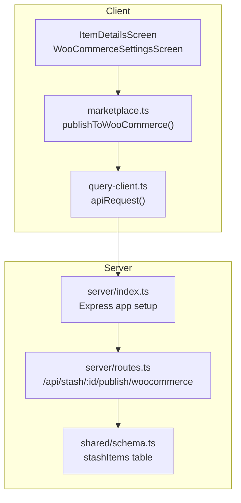
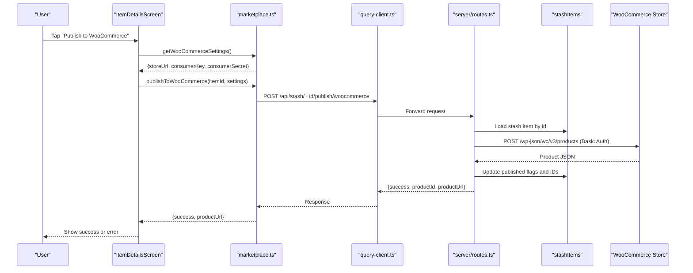
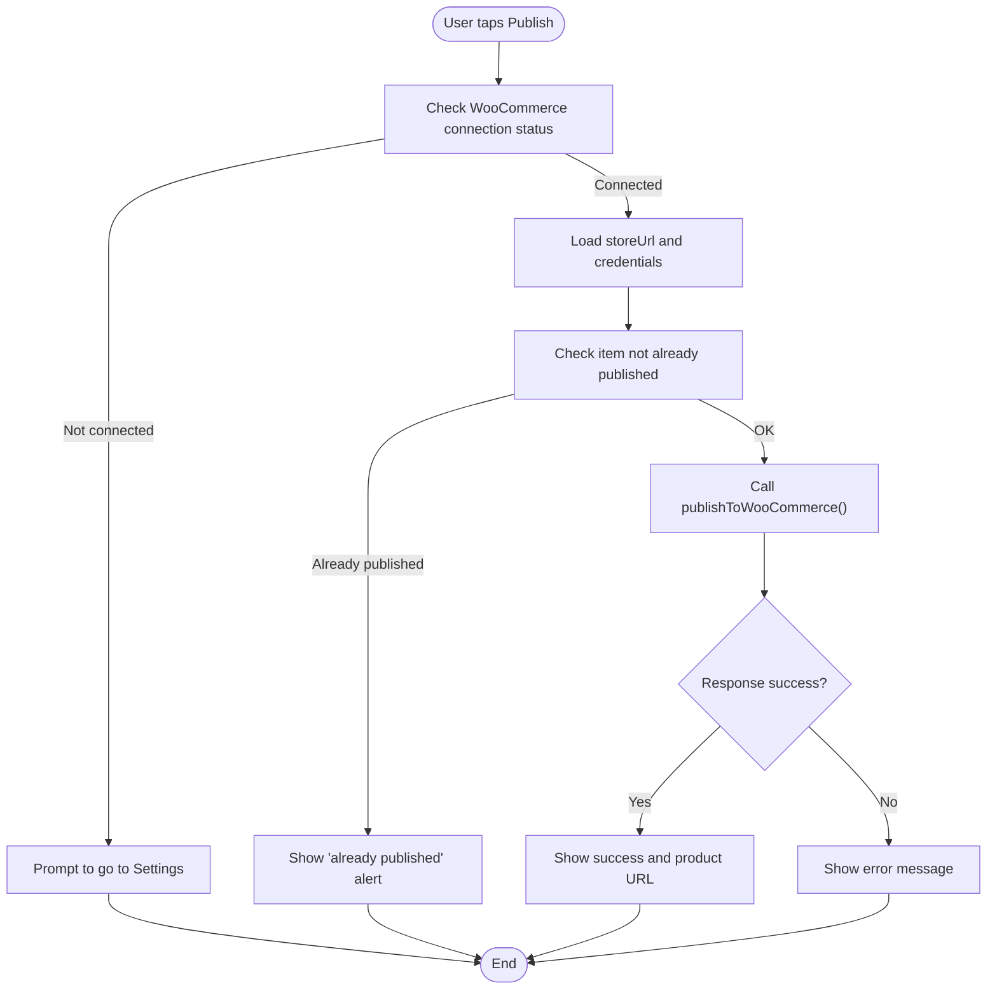
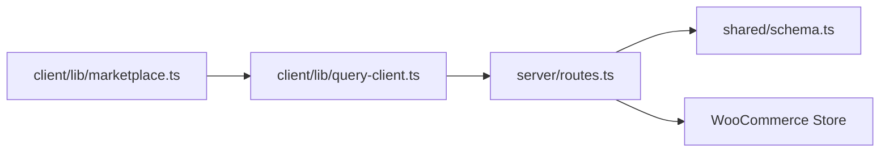

# WooCommerce Publishing Endpoint

<cite>
**Referenced Files in This Document**
- [server/index.ts](file://server/index.ts)
- [server/routes.ts](file://server/routes.ts)
- [client/lib/marketplace.ts](file://client/lib/marketplace.ts)
- [client/lib/query-client.ts](file://client/lib/query-client.ts)
- [client/screens/WooCommerceSettingsScreen.tsx](file://client/screens/WooCommerceSettingsScreen.tsx)
- [client/screens/ItemDetailsScreen.tsx](file://client/screens/ItemDetailsScreen.tsx)
- [shared/schema.ts](file://shared/schema.ts)
</cite>

## Table of Contents
1. [Introduction](#introduction)
2. [Project Structure](#project-structure)
3. [Core Components](#core-components)
4. [Architecture Overview](#architecture-overview)
5. [Detailed Component Analysis](#detailed-component-analysis)
6. [Dependency Analysis](#dependency-analysis)
7. [Performance Considerations](#performance-considerations)
8. [Troubleshooting Guide](#troubleshooting-guide)
9. [Conclusion](#conclusion)

## Introduction
This document provides comprehensive API documentation for the WooCommerce publishing endpoint `/api/stash/:id/publish/woocommerce`. It explains REST API authentication using consumerKey and consumerSecret credentials along with storeUrl configuration, details the complete product creation workflow from stash items to WooCommerce product formats, outlines required product fields, documents error handling scenarios, and includes practical examples and troubleshooting guidance.

## Project Structure
The publishing workflow spans three layers:
- Client-side UI and API requests
- Server-side route handler and database operations
- Shared data schema for persistence

**Diagram sources**
- [server/index.ts](file://server/index.ts#L1-L247)
- [server/routes.ts](file://server/routes.ts#L228-L296)
- [client/lib/marketplace.ts](file://client/lib/marketplace.ts#L81-L103)
- [client/lib/query-client.ts](file://client/lib/query-client.ts#L26-L43)
- [shared/schema.ts](file://shared/schema.ts#L29-L50)

**Section sources**
- [server/index.ts](file://server/index.ts#L1-L247)
- [server/routes.ts](file://server/routes.ts#L228-L296)
- [client/lib/marketplace.ts](file://client/lib/marketplace.ts#L81-L103)
- [client/lib/query-client.ts](file://client/lib/query-client.ts#L26-L43)
- [shared/schema.ts](file://shared/schema.ts#L29-L50)

## Core Components
- Client-side publishing flow:
  - Retrieves stored WooCommerce settings (storeUrl, consumerKey, consumerSecret)
  - Sends a POST request to the backend publishing endpoint
  - Parses the response and updates local state
- Server-side publishing endpoint:
  - Validates input credentials and item existence
  - Transforms stash item data into WooCommerce product payload
  - Calls the WooCommerce REST API to create a product
  - Updates the stash item record with published metadata
- Shared schema:
  - Defines the stashItems table with fields used for publishing

Key responsibilities:
- Authentication: Basic authentication via Base64-encoded consumerKey:consumerSecret
- Data transformation: Maps stash item fields to WooCommerce product fields
- Error handling: Returns structured error responses for missing data, existing publication, and external API failures

**Section sources**
- [client/lib/marketplace.ts](file://client/lib/marketplace.ts#L81-L103)
- [server/routes.ts](file://server/routes.ts#L228-L296)
- [shared/schema.ts](file://shared/schema.ts#L29-L50)

## Architecture Overview
The publishing workflow follows a client-to-server-to-WooCommerce pattern with database persistence.

**Diagram sources**
- [client/screens/ItemDetailsScreen.tsx](file://client/screens/ItemDetailsScreen.tsx#L105-L150)
- [client/lib/marketplace.ts](file://client/lib/marketplace.ts#L81-L103)
- [client/lib/query-client.ts](file://client/lib/query-client.ts#L26-L43)
- [server/routes.ts](file://server/routes.ts#L228-L296)
- [shared/schema.ts](file://shared/schema.ts#L29-L50)

## Detailed Component Analysis

### API Definition: /api/stash/:id/publish/woocommerce
- Method: POST
- Path: /api/stash/:id/publish/woocommerce
- Authentication: Basic authentication using consumerKey:consumerSecret
- Request Body:
  - storeUrl: string (WooCommerce store URL)
  - consumerKey: string (WooCommerce consumer key)
  - consumerSecret: string (WooCommerce consumer secret)
- Response:
  - On success: { success: true, productId: number, productUrl: string }
  - On validation error: { error: string } (400)
  - On item not found: { error: string } (404)
  - On external API failure: { error: string } (mapped from WooCommerce response)
  - On internal server error: { error: string } (500)

Required product fields mapped from stash item:
- name: stash item title
- type: "simple"
- regular_price: parsed numeric value from estimatedValue (fallback "0")
- description: seoDescription or description
- short_description: first 200 chars of description
- categories: []
- images: [{ src: fullImageUrl }] if present
- status: "publish"

Notes:
- The endpoint prevents duplicate publishing for the same item.
- The productUrl returned is either the permalink from WooCommerce or a fallback URL.

**Section sources**
- [server/routes.ts](file://server/routes.ts#L228-L296)
- [shared/schema.ts](file://shared/schema.ts#L29-L50)

### Client-Side Publishing Flow
- Retrieval of credentials:
  - Reads storeUrl and credentials from secure storage
  - Ensures connection status is "connected"
- Request construction:
  - Uses apiRequest to POST to the backend endpoint
  - Sends storeUrl, consumerKey, and consumerSecret
- Response handling:
  - Parses success/failure and displays appropriate alerts
  - Invalidates related queries to refresh UI

**Diagram sources**
- [client/screens/ItemDetailsScreen.tsx](file://client/screens/ItemDetailsScreen.tsx#L105-L150)
- [client/lib/marketplace.ts](file://client/lib/marketplace.ts#L81-L103)

**Section sources**
- [client/screens/ItemDetailsScreen.tsx](file://client/screens/ItemDetailsScreen.tsx#L105-L150)
- [client/lib/marketplace.ts](file://client/lib/marketplace.ts#L81-L103)

### Data Transformation Details
The stash item is transformed into a WooCommerce product payload:
- Name: item.title
- Type: "simple"
- Regular Price: extracted from estimatedValue using a regex pattern and commas removed; defaults to "0" if not found
- Description: seoDescription or description
- Short Description: first 200 characters of description
- Categories: empty array (placeholder for future enhancement)
- Images: fullImageUrl wrapped as [{ src: url }] if present
- Status: "publish"

Constraints:
- If no fullImageUrl is present, images array remains empty
- If no seoDescription or description is present, description fields are empty strings

**Section sources**
- [server/routes.ts](file://server/routes.ts#L246-L259)

### Authentication and Security
- Client-side:
  - Credentials are stored using platform-appropriate secure storage on native platforms and AsyncStorage on web
  - A connection test endpoint validates credentials against the WooCommerce system status endpoint
- Server-side:
  - Accepts consumerKey and consumerSecret in the request body
  - Encodes them as Basic authentication for the WooCommerce API call
  - Returns structured error messages for authentication failures

Common credential issues:
- Missing fields (storeUrl, consumerKey, consumerSecret)
- Incorrect consumer key/secret combination
- Malformed store URL (missing protocol or trailing slash handled)

**Section sources**
- [client/screens/WooCommerceSettingsScreen.tsx](file://client/screens/WooCommerceSettingsScreen.tsx#L68-L146)
- [server/routes.ts](file://server/routes.ts#L233-L235)
- [server/routes.ts](file://server/routes.ts#L261-L268)

### Error Handling
- Validation errors:
  - Missing credentials: 400 with error message
  - Item not found: 404 with error message
  - Already published: 400 with error message
- Network/API errors:
  - WooCommerce API non-OK responses: mapped to JSON error message or status code
  - Fetch/network exceptions: 500 with generic message
- Client-side:
  - apiRequest throws on non-OK responses
  - publishToWooCommerce returns structured { success, error, productUrl }

**Section sources**
- [server/routes.ts](file://server/routes.ts#L233-L235)
- [server/routes.ts](file://server/routes.ts#L237-L244)
- [server/routes.ts](file://server/routes.ts#L270-L275)
- [client/lib/query-client.ts](file://client/lib/query-client.ts#L19-L24)
- [client/lib/marketplace.ts](file://client/lib/marketplace.ts#L95-L102)

### Practical Examples

Successful publishing workflow:
- Preconditions:
  - Item exists in stash and not yet published to WooCommerce
  - WooCommerce store URL and valid consumer credentials are configured
- Steps:
  - User taps "Publish to WooCommerce"
  - Client retrieves credentials and sends POST to /api/stash/:id/publish/woocommerce
  - Server validates, transforms, and posts to WooCommerce
  - Server updates stash item with published flag and product ID
  - Client receives success response and shows product URL

Common integration challenges:
- Malformed credentials:
  - Missing or empty storeUrl, consumerKey, or consumerSecret
  - Incorrect consumer key/secret leading to 401
- Invalid product data:
  - No fullImageUrl may prevent image association
  - Unparseable estimatedValue results in zero price
- Limitations:
  - Categories array is empty; add categories in WooCommerce after creation if needed
  - Only simple products are supported in current implementation

**Section sources**
- [client/screens/ItemDetailsScreen.tsx](file://client/screens/ItemDetailsScreen.tsx#L105-L150)
- [server/routes.ts](file://server/routes.ts#L246-L259)

## Dependency Analysis
The publishing endpoint depends on:
- Express server initialization and middleware
- Database access for stash items
- WooCommerce REST API for product creation
- Client-side API client for request forwarding

**Diagram sources**
- [client/lib/marketplace.ts](file://client/lib/marketplace.ts#L81-L103)
- [client/lib/query-client.ts](file://client/lib/query-client.ts#L26-L43)
- [server/routes.ts](file://server/routes.ts#L228-L296)
- [shared/schema.ts](file://shared/schema.ts#L29-L50)

**Section sources**
- [server/index.ts](file://server/index.ts#L1-L247)
- [server/routes.ts](file://server/routes.ts#L228-L296)
- [client/lib/marketplace.ts](file://client/lib/marketplace.ts#L81-L103)
- [client/lib/query-client.ts](file://client/lib/query-client.ts#L26-L43)
- [shared/schema.ts](file://shared/schema.ts#L29-L50)

## Performance Considerations
- Network latency: The endpoint performs a synchronous fetch to the WooCommerce API; consider adding retries and timeouts for production use.
- Data parsing: Price extraction uses regex and string replacement; ensure estimatedValue format is consistent to avoid unnecessary processing.
- Payload size: Images are included only if available; keep image URLs optimized to reduce payload size.

## Troubleshooting Guide
- Authentication failures:
  - Verify consumerKey and consumerSecret are correct
  - Confirm the store URL is reachable and uses HTTPS
  - Use the built-in connection test to validate credentials
- Network connectivity issues:
  - Ensure the server can reach the WooCommerce store URL
  - Check firewall and CORS configurations
- Product validation errors:
  - Confirm stash item has a title and estimatedValue
  - Ensure fullImageUrl is a valid URL if images are desired
- Duplicate publishing:
  - The endpoint prevents republishing the same item; unpublish or create a copy if needed
- WooCommerce-specific responses:
  - Review the returned error message for details on API failures
  - Check WooCommerce logs for additional context

**Section sources**
- [client/screens/WooCommerceSettingsScreen.tsx](file://client/screens/WooCommerceSettingsScreen.tsx#L108-L146)
- [server/routes.ts](file://server/routes.ts#L270-L275)
- [server/routes.ts](file://server/routes.ts#L246-L259)

## Conclusion
The WooCommerce publishing endpoint provides a streamlined workflow to convert stash items into WooCommerce products. By validating inputs, transforming data consistently, and handling errors gracefully, the system supports reliable publishing. Future enhancements could include variable product support, category mapping, and configurable product attributes.