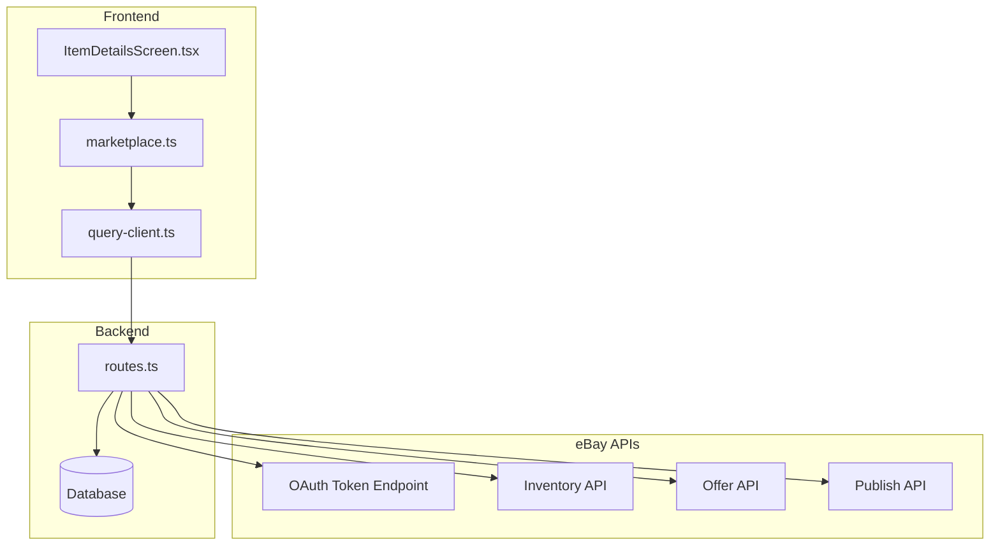
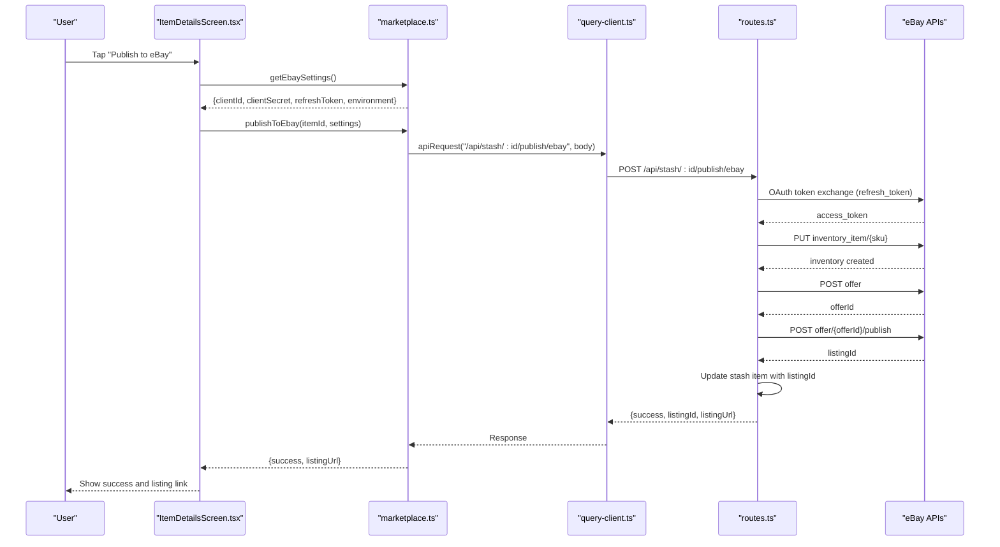
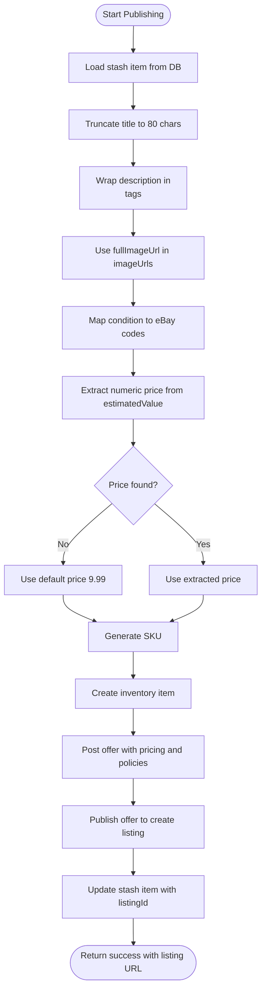
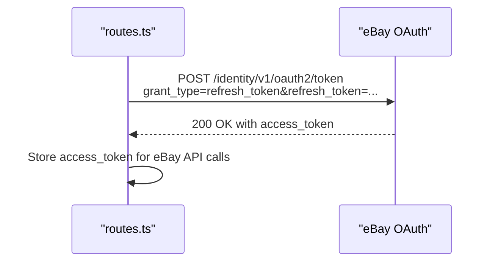
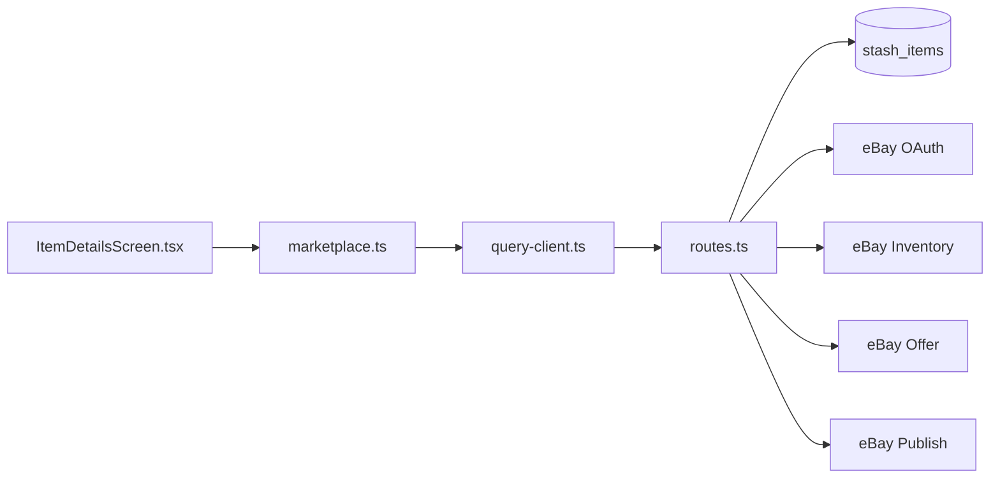

# eBay Publishing Endpoint

<cite>
**Referenced Files in This Document**
- [routes.ts](file://server/routes.ts)
- [marketplace.ts](file://client/lib/marketplace.ts)
- [ItemDetailsScreen.tsx](file://client/screens/ItemDetailsScreen.tsx)
- [EbaySettingsScreen.tsx](file://client/screens/EbaySettingsScreen.tsx)
- [query-client.ts](file://client/lib/query-client.ts)
- [ENVIRONMENT.md](file://ENVIRONMENT.md)
- [schema.ts](file://shared/schema.ts)
</cite>

## Table of Contents
1. [Introduction](#introduction)
2. [Project Structure](#project-structure)
3. [Core Components](#core-components)
4. [Architecture Overview](#architecture-overview)
5. [Detailed Component Analysis](#detailed-component-analysis)
6. [Dependency Analysis](#dependency-analysis)
7. [Performance Considerations](#performance-considerations)
8. [Troubleshooting Guide](#troubleshooting-guide)
9. [Conclusion](#conclusion)

## Introduction
This document provides comprehensive API documentation for the eBay publishing endpoint (/api/stash/:id/publish/ebay). It covers the complete OAuth 2.0 refresh token authentication flow, the multi-step publishing process (inventory item creation, offer posting, and listing publication), and the transformation of stash item data into eBay product formats. It also documents environment configuration for sandbox versus production modes, error handling for authentication failures, policy violations, and API rate limits. Practical examples, common integration errors, and troubleshooting steps for eBay-specific issues are included.

## Project Structure
The eBay publishing functionality spans three primary areas:
- Frontend (React Native) components and utilities that collect user credentials and initiate publishing
- Backend (Express) route handler that authenticates with eBay APIs and performs listing operations
- Shared schema that defines the stash item model persisted in the database



**Diagram sources**
- [routes.ts](file://server/routes.ts#L298-L488)
- [marketplace.ts](file://client/lib/marketplace.ts#L105-L128)
- [ItemDetailsScreen.tsx](file://client/screens/ItemDetailsScreen.tsx#L152-L197)
- [query-client.ts](file://client/lib/query-client.ts#L26-L43)

**Section sources**
- [routes.ts](file://server/routes.ts#L298-L488)
- [marketplace.ts](file://client/lib/marketplace.ts#L105-L128)
- [ItemDetailsScreen.tsx](file://client/screens/ItemDetailsScreen.tsx#L152-L197)
- [query-client.ts](file://client/lib/query-client.ts#L26-L43)

## Core Components
- Backend route handler for eBay publishing
  - Validates credentials and refresh token
  - Authenticates via eBay OAuth 2.0 refresh token flow
  - Creates inventory item, posts offer, and publishes listing
  - Updates stash item with eBay listing identifiers
- Frontend marketplace utilities
  - Retrieve saved eBay settings (clientId, clientSecret, refreshToken, environment)
  - Initiate publishing request to backend
- Frontend settings screen
  - Capture and persist eBay credentials and environment
  - Test connection to eBay OAuth token endpoint
- Shared stash item schema
  - Defines fields transformed to eBay product formats

**Section sources**
- [routes.ts](file://server/routes.ts#L298-L488)
- [marketplace.ts](file://client/lib/marketplace.ts#L46-L79)
- [EbaySettingsScreen.tsx](file://client/screens/EbaySettingsScreen.tsx#L14-L315)
- [schema.ts](file://shared/schema.ts#L29-L50)

## Architecture Overview
The eBay publishing workflow follows a strict sequence:
1. Frontend collects eBay settings and invokes the backend endpoint
2. Backend validates inputs and checks if the item was already published
3. Backend exchanges the refresh token for an access token
4. Backend creates an inventory item on eBay
5. Backend posts an offer for the inventory item
6. Backend publishes the offer to create a live listing
7. Backend updates the stash item with eBay identifiers and returns the listing URL



**Diagram sources**
- [ItemDetailsScreen.tsx](file://client/screens/ItemDetailsScreen.tsx#L152-L197)
- [marketplace.ts](file://client/lib/marketplace.ts#L105-L128)
- [query-client.ts](file://client/lib/query-client.ts#L26-L43)
- [routes.ts](file://server/routes.ts#L298-L488)

## Detailed Component Analysis

### Backend Route Handler: /api/stash/:id/publish/ebay
Responsibilities:
- Validate request payload (clientId, clientSecret, refreshToken, environment)
- Prevent duplicate publishing for the same stash item
- Select stash item from database and transform fields for eBay
- Exchange refresh token for access token using eBay OAuth 2.0
- Create inventory item with eBay product fields
- Post offer with pricing, policies, and marketplace settings
- Publish offer to create a live listing
- Update stash item with eBay listing identifiers
- Return success with listing URL and message

Key behaviors:
- Environment selection: production or sandbox base URLs
- Condition mapping from stash item condition to eBay condition codes
- Price extraction from estimatedValue with fallback
- SKU generation and optional merchant location key
- Offer creation with marketplaceId, format, and pricing summary
- Listing URL construction based on environment and listingId

Error handling:
- Missing credentials or refresh token
- Authentication failure with detailed error messages
- Inventory creation errors
- Offer creation errors, including policy requirement detection
- Publish errors
- General internal server errors

**Section sources**
- [routes.ts](file://server/routes.ts#L298-L488)

### Frontend Marketplace Utilities
Responsibilities:
- Retrieve eBay settings from secure storage (client-side)
- Send publish request to backend with eBay credentials and environment
- Return success or error to the UI

Credential retrieval:
- Reads environment, connection status, and credentials from persistent storage
- Supports both native secure storage and web AsyncStorage
- Ensures minimum required credentials are present

**Section sources**
- [marketplace.ts](file://client/lib/marketplace.ts#L46-L79)
- [marketplace.ts](file://client/lib/marketplace.ts#L105-L128)

### Frontend Settings Screen
Responsibilities:
- Capture and persist eBay credentials and environment
- Test connection to eBay OAuth token endpoint
- Provide UI for refresh token management

Connection testing:
- Builds appropriate base URL based on environment
- Calls eBay OAuth token endpoint with client credentials
- Handles success, authentication failure, and other error responses

**Section sources**
- [EbaySettingsScreen.tsx](file://client/screens/EbaySettingsScreen.tsx#L14-L315)

### Stash Item Schema
Responsibilities:
- Define fields persisted for each stash item
- Support eBay publishing by providing transformed fields

Fields used for eBay transformation:
- title/seoTitle -> product title
- description/seoDescription -> product description
- fullImageUrl -> imageUrls
- condition -> mapped to eBay condition codes
- estimatedValue -> price with numeric extraction and fallback

**Section sources**
- [schema.ts](file://shared/schema.ts#L29-L50)

### Data Transformation to eBay Product Formats
Transformation logic:
- Title: Truncated to 80 characters
- Description: Wrapped in paragraph tags
- Images: Full image URL placed into imageUrls array
- Condition: Mapped from stash item condition to eBay condition codes
- Price: Extracted numeric portion from estimatedValue; defaults to 9.99 if not found
- SKU: Generated using stash item id and timestamp
- Offer: Fixed price, marketplaceId EBAY_US, available quantity 1



**Diagram sources**
- [routes.ts](file://server/routes.ts#L346-L373)
- [routes.ts](file://server/routes.ts#L392-L411)
- [routes.ts](file://server/routes.ts#L464-L470)

**Section sources**
- [routes.ts](file://server/routes.ts#L346-L373)
- [routes.ts](file://server/routes.ts#L392-L411)
- [routes.ts](file://server/routes.ts#L464-L470)

### OAuth 2.0 Refresh Token Authentication Flow
The backend exchanges the user's refresh token for an access token:
- Base URL depends on environment (sandbox or production)
- Basic authentication with clientId:clientSecret
- grant_type=refresh_token with the provided refresh token
- Returns access_token for subsequent eBay API calls



**Diagram sources**
- [routes.ts](file://server/routes.ts#L327-L344)

**Section sources**
- [routes.ts](file://server/routes.ts#L327-L344)

### Multi-Step Publishing Process
1. Inventory Item Creation
   - PUT inventory_item/{sku} with availability, condition, and product details
   - Accepts 204 No Content on success
2. Offer Posting
   - POST offer with marketplaceId, format, pricing, and policies
   - Returns offerId on success
3. Listing Publication
   - POST offer/{offerId}/publish
   - Returns listingId on success

```mermaid
sequenceDiagram
participant BE as "routes.ts"
participant INV as "Inventory API"
participant OFF as "Offer API"
participant PUB as "Publish API"
BE->>INV : PUT inventory_item/{sku}
INV-->>BE : 204 No Content
BE->>OFF : POST offer
OFF-->>BE : 201 Created with offerId
BE->>PUB : POST offer/{offerId}/publish
PUB-->>BE : 200 OK with listingId
```

**Diagram sources**
- [routes.ts](file://server/routes.ts#L375-L390)
- [routes.ts](file://server/routes.ts#L413-L421)
- [routes.ts](file://server/routes.ts#L430-L445)

**Section sources**
- [routes.ts](file://server/routes.ts#L375-L390)
- [routes.ts](file://server/routes.ts#L413-L421)
- [routes.ts](file://server/routes.ts#L430-L445)

### Environment Configuration: Sandbox vs Production
- Environment field controls base URL selection for all eBay API calls
- Production: https://api.ebay.com
- Sandbox: https://api.sandbox.ebay.com
- Listing URL construction reflects environment

**Section sources**
- [routes.ts](file://server/routes.ts#L322-L324)
- [routes.ts](file://server/routes.ts#L472-L476)

### Error Handling
Common error scenarios:
- Missing credentials or refresh token
- Authentication failure (invalid clientId/clientSecret or invalid refresh token)
- Inventory creation errors
- Offer creation errors, including policy requirement detection
- Publish errors
- General internal server errors

Policy violation handling:
- Detects policy-related errors during offer creation
- Returns a user-friendly message instructing to configure business policies in eBay Seller Hub

**Section sources**
- [routes.ts](file://server/routes.ts#L303-L311)
- [routes.ts](file://server/routes.ts#L336-L341)
- [routes.ts](file://server/routes.ts#L385-L390)
- [routes.ts](file://server/routes.ts#L449-L462)

## Dependency Analysis
The eBay publishing endpoint integrates the following dependencies:
- Frontend to Backend: HTTP requests via a shared API client
- Backend to eBay: OAuth token exchange, inventory management, offer management, and publishing
- Backend to Database: Stash item retrieval and update with eBay identifiers



**Diagram sources**
- [ItemDetailsScreen.tsx](file://client/screens/ItemDetailsScreen.tsx#L152-L197)
- [marketplace.ts](file://client/lib/marketplace.ts#L105-L128)
- [query-client.ts](file://client/lib/query-client.ts#L26-L43)
- [routes.ts](file://server/routes.ts#L298-L488)

**Section sources**
- [routes.ts](file://server/routes.ts#L298-L488)
- [schema.ts](file://shared/schema.ts#L29-L50)

## Performance Considerations
- Network latency: The endpoint performs multiple external API calls; consider retry logic and timeouts in future enhancements
- Rate limiting: While the eBay publishing endpoint does not implement explicit rate limiting, external APIs may throttle requests
- Data transformation: Minimal CPU overhead; primarily string manipulation and JSON serialization
- Caching: Consider caching access tokens per user to avoid frequent OAuth exchanges

## Troubleshooting Guide
Common integration errors:
- Invalid or missing refresh token
  - Ensure the refresh token is present and valid
  - Verify environment setting matches the token's intended environment
- Authentication failures
  - Confirm clientId and clientSecret are correct
  - Check that the refresh token corresponds to the provided credentials
- Policy violations
  - eBay requires business policies (shipping, payment, return) to be configured before listing
  - Configure policies in eBay Seller Hub and retry
- API errors
  - Review error messages returned by eBay APIs for specific guidance
  - Check network connectivity and base URL correctness

Practical examples:
- Successful publishing workflow
  - Ensure stash item has a valid estimatedValue for price
  - Confirm eBay settings are connected and environment is set appropriately
  - After successful publish, the backend returns a listing URL for the newly created listing

**Section sources**
- [routes.ts](file://server/routes.ts#L307-L311)
- [routes.ts](file://server/routes.ts#L453-L457)
- [routes.ts](file://server/routes.ts#L484-L487)

## Conclusion
The eBay publishing endpoint provides a robust, end-to-end solution for transforming stash items into eBay listings. It handles OAuth 2.0 authentication, inventory creation, offer posting, and listing publication while offering clear error handling and environment-aware configurations. By following the documented workflows and troubleshooting steps, developers can integrate eBay publishing seamlessly into their applications.