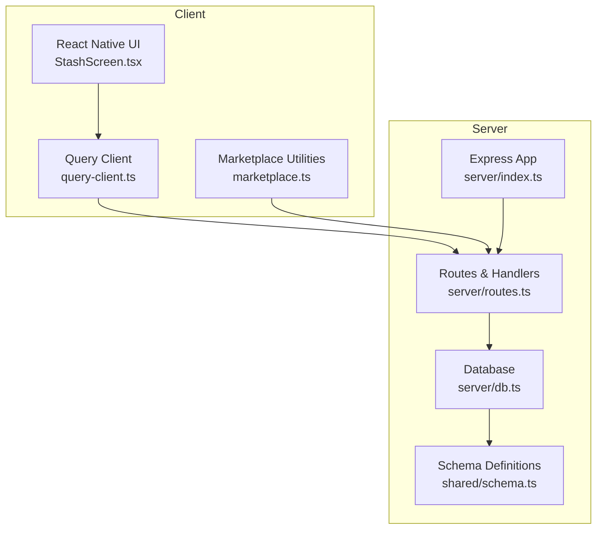
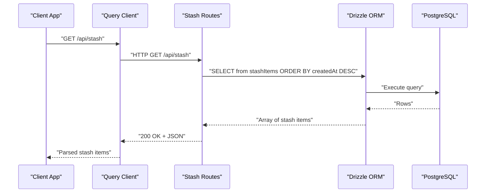
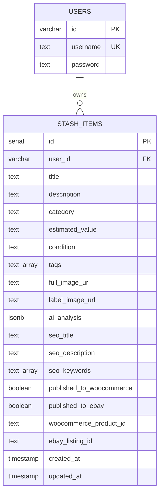
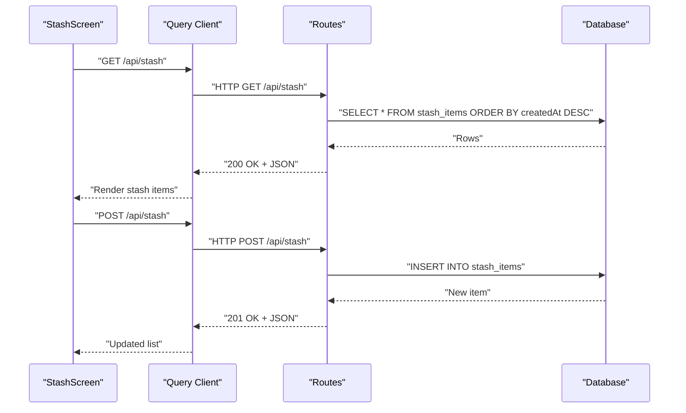
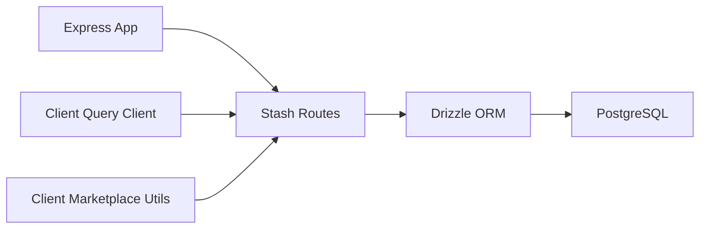

# Stash Management API

<cite>
**Referenced Files in This Document**
- [server/index.ts](file://server/index.ts)
- [server/routes.ts](file://server/routes.ts)
- [server/db.ts](file://server/db.ts)
- [shared/schema.ts](file://shared/schema.ts)
- [client/lib/query-client.ts](file://client/lib/query-client.ts)
- [client/lib/marketplace.ts](file://client/lib/marketplace.ts)
- [client/screens/StashScreen.tsx](file://client/screens/StashScreen.tsx)
</cite>

## Table of Contents
1. [Introduction](#introduction)
2. [Project Structure](#project-structure)
3. [Core Components](#core-components)
4. [Architecture Overview](#architecture-overview)
5. [Detailed Component Analysis](#detailed-component-analysis)
6. [Dependency Analysis](#dependency-analysis)
7. [Performance Considerations](#performance-considerations)
8. [Troubleshooting Guide](#troubleshooting-guide)
9. [Conclusion](#conclusion)

## Introduction
This document provides comprehensive API documentation for the stash management endpoints that power user inventory item CRUD operations. It covers:
- Retrieving all items
- Retrieving a single item by ID
- Creating new items
- Deleting items
- Inventory statistics

It also documents the stash item data model, request/response schemas, validation rules, authentication requirements, error handling patterns, and practical workflows for managing inventory items.

## Project Structure
The stash API is implemented in the server module and integrates with a PostgreSQL database via Drizzle ORM. The client-side application consumes these endpoints using a shared query client and marketplace utilities.

**Diagram sources**
- [server/index.ts](file://server/index.ts#L1-L247)
- [server/routes.ts](file://server/routes.ts#L1-L493)
- [server/db.ts](file://server/db.ts#L1-L19)
- [shared/schema.ts](file://shared/schema.ts#L1-L122)
- [client/lib/query-client.ts](file://client/lib/query-client.ts#L1-L80)
- [client/lib/marketplace.ts](file://client/lib/marketplace.ts#L1-L129)
- [client/screens/StashScreen.tsx](file://client/screens/StashScreen.tsx#L1-L290)

**Section sources**
- [server/index.ts](file://server/index.ts#L1-L247)
- [server/routes.ts](file://server/routes.ts#L1-L493)
- [server/db.ts](file://server/db.ts#L1-L19)
- [shared/schema.ts](file://shared/schema.ts#L1-L122)
- [client/lib/query-client.ts](file://client/lib/query-client.ts#L1-L80)
- [client/lib/marketplace.ts](file://client/lib/marketplace.ts#L1-L129)
- [client/screens/StashScreen.tsx](file://client/screens/StashScreen.tsx#L1-L290)

## Core Components
- Express server with CORS, body parsing, logging, and error handling middleware.
- Route handlers for stash CRUD and statistics endpoints.
- Drizzle ORM integration with PostgreSQL for data persistence.
- Shared schema definitions for stash items and related entities.
- Client-side query client and marketplace utilities for API consumption.

Key implementation references:
- Server bootstrap and middleware: [server/index.ts](file://server/index.ts#L1-L247)
- Stash routes: [server/routes.ts](file://server/routes.ts#L57-L138)
- Database connection: [server/db.ts](file://server/db.ts#L1-L19)
- Schema definitions: [shared/schema.ts](file://shared/schema.ts#L29-L50)
- Client query client: [client/lib/query-client.ts](file://client/lib/query-client.ts#L1-L80)
- Marketplace utilities: [client/lib/marketplace.ts](file://client/lib/marketplace.ts#L81-L128)

**Section sources**
- [server/index.ts](file://server/index.ts#L1-L247)
- [server/routes.ts](file://server/routes.ts#L57-L138)
- [server/db.ts](file://server/db.ts#L1-L19)
- [shared/schema.ts](file://shared/schema.ts#L29-L50)
- [client/lib/query-client.ts](file://client/lib/query-client.ts#L1-L80)
- [client/lib/marketplace.ts](file://client/lib/marketplace.ts#L81-L128)

## Architecture Overview
The stash API follows a straightforward request-response pattern:
- Client sends HTTP requests to server endpoints.
- Server validates inputs, interacts with the database via Drizzle ORM, and returns structured JSON responses.
- Error responses are standardized with appropriate HTTP status codes.

**Diagram sources**
- [server/routes.ts](file://server/routes.ts#L57-L68)
- [server/db.ts](file://server/db.ts#L1-L19)
- [client/lib/query-client.ts](file://client/lib/query-client.ts#L45-L80)

**Section sources**
- [server/routes.ts](file://server/routes.ts#L57-L68)
- [server/db.ts](file://server/db.ts#L1-L19)
- [client/lib/query-client.ts](file://client/lib/query-client.ts#L45-L80)

## Detailed Component Analysis

### Stash Item Data Model
The stash item entity is defined in the shared schema and persisted in PostgreSQL. Below is the entity definition and field descriptions.

Field descriptions:
- id: Unique identifier for the stash item.
- user_id: Foreign key linking to the user who owns the item.
- title: Required display name for the item.
- description: Optional detailed description.
- category: Optional classification (e.g., Collectible, Watch).
- estimated_value: Optional textual value range (e.g., "$150-$200").
- condition: Optional condition rating (e.g., Excellent, Good).
- tags: Array of tags for categorization.
- full_image_url: URL to the primary item image.
- label_image_url: URL to the item label/tag image.
- ai_analysis: Structured JSON containing AI-generated insights.
- seo_title: SEO-optimized title for listings.
- seo_description: SEO-optimized description for listings.
- seo_keywords: Array of SEO keywords.
- published_to_woocommerce: Boolean flag indicating publication status.
- published_to_ebay: Boolean flag indicating publication status.
- woocommerce_product_id: Identifier for the published product.
- ebay_listing_id: Identifier for the eBay listing.
- created_at/updated_at: Timestamps managed by the database.

Validation rules (as inferred from schema):
- title is required.
- user_id is required and references users.
- Arrays (tags, seo_keywords) are supported.
- JSONB (ai_analysis) supports arbitrary structured data.
- Other fields are optional.

**Diagram sources**
- [shared/schema.ts](file://shared/schema.ts#L29-L50)

**Section sources**
- [shared/schema.ts](file://shared/schema.ts#L29-L50)

### Authentication and Authorization
- The client uses a shared query client that includes credentials with requests.
- The query client throws on non-OK responses and handles 401 appropriately.
- Supabase is configured for authentication in the client, but stash endpoints are consumed via the shared query client.

References:
- Client query client behavior: [client/lib/query-client.ts](file://client/lib/query-client.ts#L19-L80)
- Supabase configuration: [client/lib/supabase.ts](file://client/lib/supabase.ts#L1-L39)

**Section sources**
- [client/lib/query-client.ts](file://client/lib/query-client.ts#L19-L80)
- [client/lib/supabase.ts](file://client/lib/supabase.ts#L1-L39)

### API Endpoints

#### GET /api/stash
- Purpose: Retrieve all stash items ordered by creation date (newest first).
- Response: Array of stash item objects.
- Status codes:
  - 200 OK on success.
  - 500 Internal Server Error on failure.

Example request:
- Method: GET
- Path: /api/stash

Example response:
- Status: 200
- Body: Array of stash items

**Section sources**
- [server/routes.ts](file://server/routes.ts#L57-L68)

#### GET /api/stash/:id
- Purpose: Retrieve a specific stash item by ID.
- Path parameters:
  - id: Numeric stash item ID.
- Response: Single stash item object.
- Status codes:
  - 200 OK if found.
  - 404 Not Found if not found.
  - 500 Internal Server Error on failure.

Example request:
- Method: GET
- Path: /api/stash/{id}

Example response:
- Status: 200
- Body: Stash item object

**Section sources**
- [server/routes.ts](file://server/routes.ts#L80-L97)

#### POST /api/stash
- Purpose: Create a new stash item.
- Request body: Partial stash item object (userId defaults to a demo user if omitted).
- Response: Newly created stash item object.
- Status codes:
  - 201 Created on success.
  - 500 Internal Server Error on failure.

Request body fields:
- userId: Optional user identifier (defaults to "demo-user" if not provided).
- title: Required.
- description: Optional.
- category: Optional.
- estimatedValue: Optional.
- condition: Optional.
- tags: Optional array.
- fullImageUrl: Optional.
- labelImageUrl: Optional.
- aiAnalysis: Optional JSON object.
- seoTitle: Optional.
- seoDescription: Optional.
- seoKeywords: Optional array.

Example request:
- Method: POST
- Path: /api/stash
- Headers: Content-Type: application/json
- Body: Partial stash item object

Example response:
- Status: 201
- Body: Full stash item object

**Section sources**
- [server/routes.ts](file://server/routes.ts#L99-L127)

#### DELETE /api/stash/:id
- Purpose: Delete a stash item by ID.
- Path parameters:
  - id: Numeric stash item ID.
- Response: No content.
- Status codes:
  - 204 No Content on success.
  - 500 Internal Server Error on failure.

Example request:
- Method: DELETE
- Path: /api/stash/{id}

Example response:
- Status: 204

**Section sources**
- [server/routes.ts](file://server/routes.ts#L129-L138)

#### GET /api/stash/count
- Purpose: Retrieve the total number of stash items.
- Response: Object with count property.
- Status codes:
  - 200 OK on success.
  - 500 Internal Server Error on failure.

Example request:
- Method: GET
- Path: /api/stash/count

Example response:
- Status: 200
- Body: { count: number }

**Section sources**
- [server/routes.ts](file://server/routes.ts#L70-L78)

### Request/Response Schemas

- Request body for POST /api/stash:
  - Type: Object
  - Fields: userId (string), title (string), description (string), category (string), estimatedValue (string), condition (string), tags (string[]), fullImageUrl (string), labelImageUrl (string), aiAnalysis (object), seoTitle (string), seoDescription (string), seoKeywords (string[])
  - Required: title
  - Defaults: userId defaults to "demo-user"

- Response body for GET /api/stash:
  - Type: Array of stash item objects

- Response body for GET /api/stash/:id:
  - Type: Single stash item object

- Response body for POST /api/stash:
  - Type: Created stash item object

- Response body for GET /api/stash/count:
  - Type: Object with count (number)

Validation rules:
- title is required for creation.
- Arrays (tags, seoKeywords) are optional.
- JSONB (aiAnalysis) is optional.
- Other fields are optional.

**Section sources**
- [server/routes.ts](file://server/routes.ts#L99-L127)
- [shared/schema.ts](file://shared/schema.ts#L29-L50)

### Error Handling Patterns
- Standardized error responses with human-readable messages and appropriate HTTP status codes.
- Centralized error handler logs errors and returns JSON with message and status.

Common patterns:
- 404 Not Found for missing resources (e.g., item not found).
- 500 Internal Server Error for database or processing failures.
- 204 No Content for successful deletions.

**Section sources**
- [server/routes.ts](file://server/routes.ts#L64-L67)
- [server/routes.ts](file://server/routes.ts#L88-L90)
- [server/routes.ts](file://server/routes.ts#L123-L126)
- [server/routes.ts](file://server/routes.ts#L135-L137)
- [server/index.ts](file://server/index.ts#L207-L222)

### Workflows and Examples

#### Complete Stash Workflow
1. Fetch all items
   - Endpoint: GET /api/stash
   - Client usage: [client/screens/StashScreen.tsx](file://client/screens/StashScreen.tsx#L98-L100)
2. Create a new item
   - Endpoint: POST /api/stash
   - Example payload: Partial stash item object with title and optional metadata
3. Retrieve a specific item
   - Endpoint: GET /api/stash/:id
4. Update item (conceptual)
   - Use GET to fetch, then update locally or via PATCH endpoint if added later
5. Delete an item
   - Endpoint: DELETE /api/stash/:id
6. Get inventory statistics
   - Endpoint: GET /api/stash/count

**Diagram sources**
- [client/screens/StashScreen.tsx](file://client/screens/StashScreen.tsx#L98-L100)
- [server/routes.ts](file://server/routes.ts#L57-L68)
- [server/routes.ts](file://server/routes.ts#L99-L127)

**Section sources**
- [client/screens/StashScreen.tsx](file://client/screens/StashScreen.tsx#L98-L100)
- [server/routes.ts](file://server/routes.ts#L57-L68)
- [server/routes.ts](file://server/routes.ts#L99-L127)

## Dependency Analysis
The stash API depends on:
- Express for HTTP routing and middleware.
- Drizzle ORM for database operations.
- PostgreSQL for persistent storage.
- Client-side query client for API consumption.

**Diagram sources**
- [server/index.ts](file://server/index.ts#L1-L247)
- [server/routes.ts](file://server/routes.ts#L1-L493)
- [server/db.ts](file://server/db.ts#L1-L19)
- [client/lib/query-client.ts](file://client/lib/query-client.ts#L1-L80)
- [client/lib/marketplace.ts](file://client/lib/marketplace.ts#L1-L129)

**Section sources**
- [server/index.ts](file://server/index.ts#L1-L247)
- [server/routes.ts](file://server/routes.ts#L1-L493)
- [server/db.ts](file://server/db.ts#L1-L19)
- [client/lib/query-client.ts](file://client/lib/query-client.ts#L1-L80)
- [client/lib/marketplace.ts](file://client/lib/marketplace.ts#L1-L129)

## Performance Considerations
- Sorting by createdAt in descending order ensures recent items appear first.
- Consider adding pagination for large inventories to reduce payload sizes.
- Indexes on frequently queried columns (e.g., user_id, id) can improve performance.
- Client-side caching with React Query can minimize redundant network requests.

## Troubleshooting Guide
Common issues and resolutions:
- 404 Not Found: Verify the stash item ID exists.
- 500 Internal Server Error: Check server logs for database errors or invalid payloads.
- Network errors: Ensure the API base URL is configured correctly in the client environment variables.
- Authentication errors: Confirm credentials are included and valid.

**Section sources**
- [server/routes.ts](file://server/routes.ts#L88-L90)
- [server/routes.ts](file://server/routes.ts#L123-L126)
- [server/routes.ts](file://server/routes.ts#L135-L137)
- [client/lib/query-client.ts](file://client/lib/query-client.ts#L7-L17)
- [client/lib/query-client.ts](file://client/lib/query-client.ts#L19-L24)

## Conclusion
The stash management API provides a robust foundation for inventory item CRUD operations with clear data modeling, standardized error handling, and straightforward client integration. By following the documented schemas, validation rules, and workflows, developers can reliably implement inventory features and extend functionality as needed.