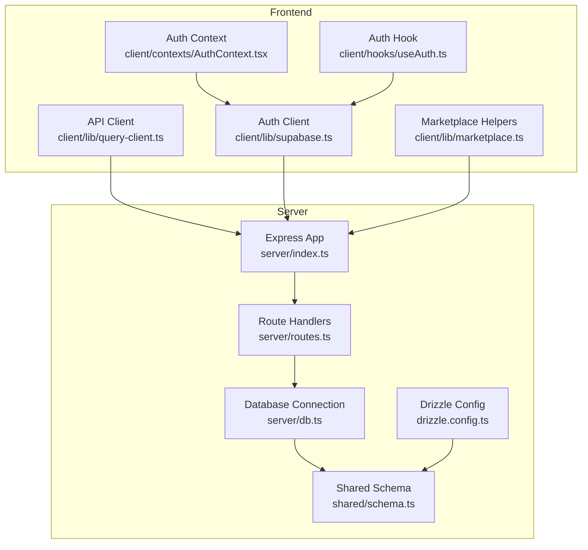
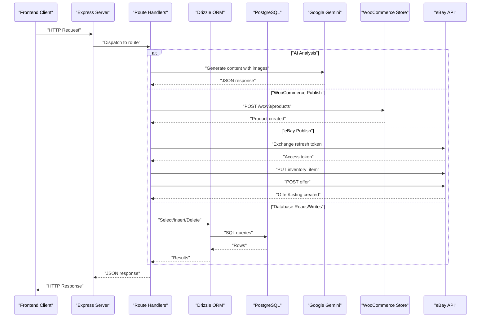
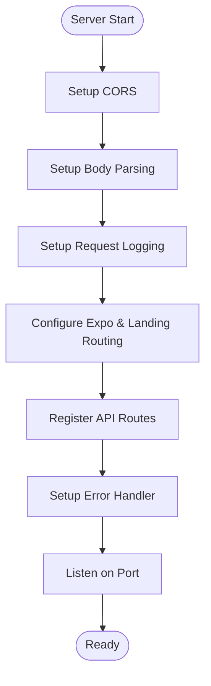
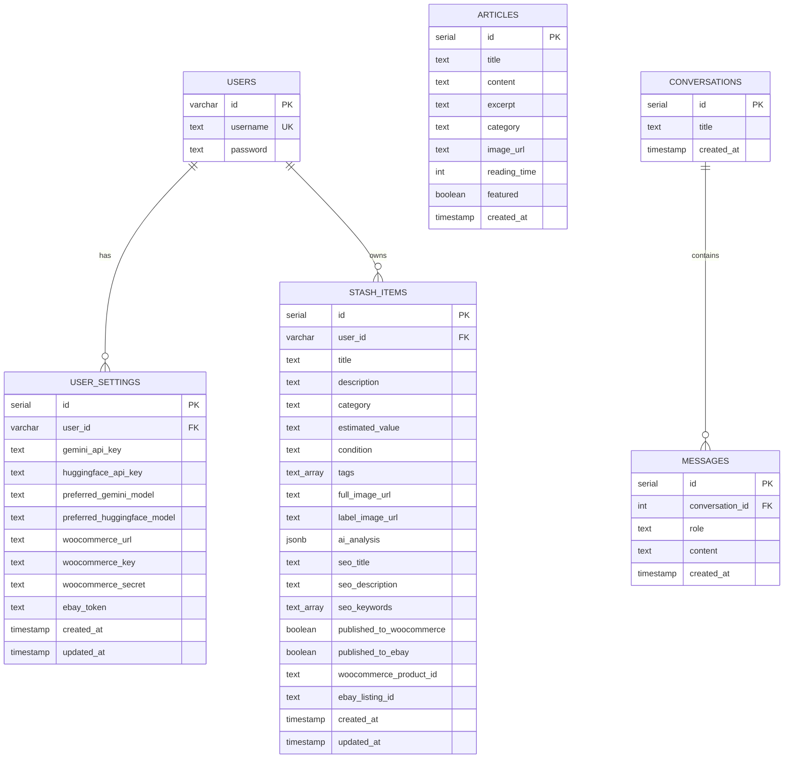
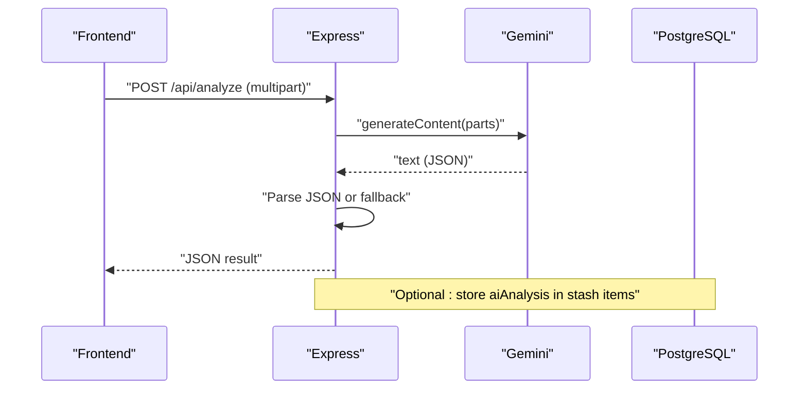
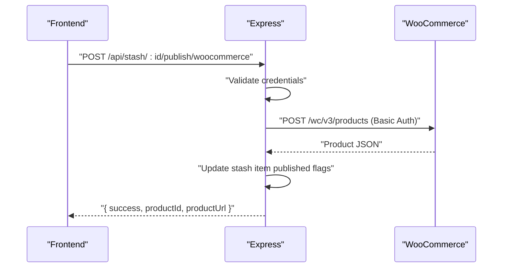
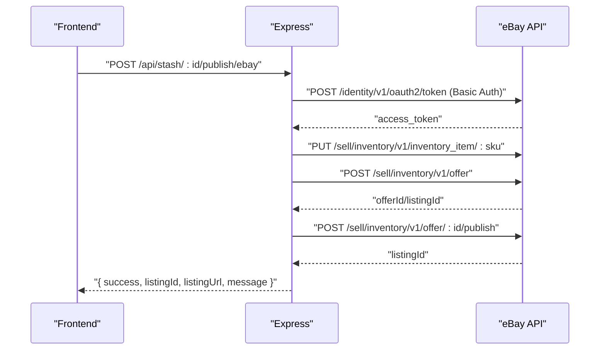
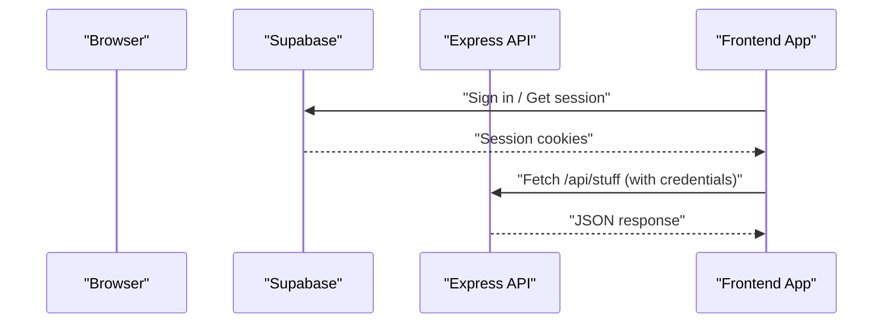
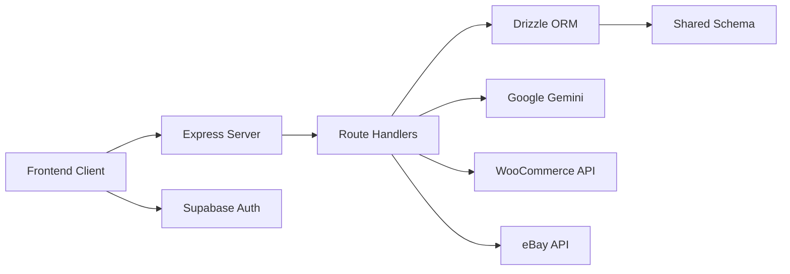

# Backend API Server

<cite>
**Referenced Files in This Document**
- [server/index.ts](file://server/index.ts)
- [server/routes.ts](file://server/routes.ts)
- [server/db.ts](file://server/db.ts)
- [drizzle.config.ts](file://drizzle.config.ts)
- [shared/schema.ts](file://shared/schema.ts)
- [ENVIRONMENT.md](file://ENVIRONMENT.md)
- [package.json](file://package.json)
- [client/lib/query-client.ts](file://client/lib/query-client.ts)
- [client/lib/supabase.ts](file://client/lib/supabase.ts)
- [client/contexts/AuthContext.tsx](file://client/contexts/AuthContext.tsx)
- [client/hooks/useAuth.ts](file://client/hooks/useAuth.ts)
- [client/lib/marketplace.ts](file://client/lib/marketplace.ts)
- [server/replit_integrations/chat/routes.ts](file://server/replit_integrations/chat/routes.ts)
</cite>

## Table of Contents
1. [Introduction](#introduction)
2. [Project Structure](#project-structure)
3. [Core Components](#core-components)
4. [Architecture Overview](#architecture-overview)
5. [Detailed Component Analysis](#detailed-component-analysis)
6. [Dependency Analysis](#dependency-analysis)
7. [Performance Considerations](#performance-considerations)
8. [Troubleshooting Guide](#troubleshooting-guide)
9. [Conclusion](#conclusion)
10. [Appendices](#appendices)

## Introduction
This document provides comprehensive API documentation for the Express.js backend server. It covers server initialization, middleware configuration, CORS setup, request logging, and error handling. It documents all RESTful endpoints for item analysis, stash management, marketplace publishing, and content management. It also explains database integration using Drizzle ORM with PostgreSQL, schema design, and data validation patterns. Authentication flows, API key management, and security considerations are included, along with practical usage examples and integration patterns with external services such as Google Gemini, eBay, and WooCommerce.

## Project Structure
The backend is organized around an Express server with modularized routes, a centralized database connection, and shared schema definitions. The frontend interacts with the backend via a typed API client and Supabase for authentication.

**Diagram sources**
- [server/index.ts](file://server/index.ts#L1-L247)
- [server/routes.ts](file://server/routes.ts#L1-L493)
- [server/db.ts](file://server/db.ts#L1-L19)
- [shared/schema.ts](file://shared/schema.ts#L1-L122)
- [drizzle.config.ts](file://drizzle.config.ts#L1-L15)
- [client/lib/query-client.ts](file://client/lib/query-client.ts#L1-L80)
- [client/lib/supabase.ts](file://client/lib/supabase.ts#L1-L39)
- [client/contexts/AuthContext.tsx](file://client/contexts/AuthContext.tsx#L1-L31)
- [client/hooks/useAuth.ts](file://client/hooks/useAuth.ts#L1-L151)
- [client/lib/marketplace.ts](file://client/lib/marketplace.ts#L1-L79)

**Section sources**
- [server/index.ts](file://server/index.ts#L1-L247)
- [server/routes.ts](file://server/routes.ts#L1-L493)
- [server/db.ts](file://server/db.ts#L1-L19)
- [shared/schema.ts](file://shared/schema.ts#L1-L122)
- [drizzle.config.ts](file://drizzle.config.ts#L1-L15)
- [client/lib/query-client.ts](file://client/lib/query-client.ts#L1-L80)
- [client/lib/supabase.ts](file://client/lib/supabase.ts#L1-L39)
- [client/contexts/AuthContext.tsx](file://client/contexts/AuthContext.tsx#L1-L31)
- [client/hooks/useAuth.ts](file://client/hooks/useAuth.ts#L1-L151)
- [client/lib/marketplace.ts](file://client/lib/marketplace.ts#L1-L79)

## Core Components
- Express server initialization and lifecycle
- Middleware stack: CORS, body parsing, request logging, Expo landing page routing
- Route registration and error handler
- Database connection via Drizzle ORM and PostgreSQL
- Shared schema definitions for users, stash items, articles, and chat entities
- Marketplace publishing endpoints for WooCommerce and eBay
- AI integration with Google Gemini for item analysis

**Section sources**
- [server/index.ts](file://server/index.ts#L1-L247)
- [server/routes.ts](file://server/routes.ts#L1-L493)
- [server/db.ts](file://server/db.ts#L1-L19)
- [shared/schema.ts](file://shared/schema.ts#L1-L122)

## Architecture Overview
The server exposes REST endpoints under /api. Requests are handled by route handlers that interact with the database using Drizzle ORM. Authentication is managed by Supabase on the frontend; the backend relies on cookies/session for authenticated requests. AI analysis integrates with Google Gemini via Replit AI Integrations. Marketplace publishing endpoints integrate with external APIs for WooCommerce and eBay.

**Diagram sources**
- [server/index.ts](file://server/index.ts#L1-L247)
- [server/routes.ts](file://server/routes.ts#L1-L493)
- [server/db.ts](file://server/db.ts#L1-L19)
- [shared/schema.ts](file://shared/schema.ts#L1-L122)

## Detailed Component Analysis

### Server Initialization and Middleware
- CORS: Dynamic origin allowlist based on environment variables and localhost for Expo web development. Supports preflight OPTIONS.
- Body parsing: JSON body verification stores rawBody on the request; URL-encoded bodies supported.
- Request logging: Intercepts responses for API paths, logs method, path, status, duration, and optional JSON payload.
- Expo landing page routing: Serves Expo manifests and a landing page HTML template dynamically.
- Error handling: Centralized error handler converts thrown errors to JSON responses with appropriate status codes.

**Diagram sources**
- [server/index.ts](file://server/index.ts#L16-L246)

**Section sources**
- [server/index.ts](file://server/index.ts#L16-L246)

### Database Integration and Schema
- Connection: Drizzle ORM connects to PostgreSQL using a connection string from environment variables. SSL is configured to disable certificate verification.
- Schema: Shared schema defines tables for users, user settings, stash items, articles, conversations, and messages. Drizzle Zod helpers generate insert schemas for validation.
- Migrations: Drizzle Kit configuration points to the shared schema and migration output directory.

**Diagram sources**
- [shared/schema.ts](file://shared/schema.ts#L6-L122)
- [drizzle.config.ts](file://drizzle.config.ts#L7-L14)
- [server/db.ts](file://server/db.ts#L1-L19)

**Section sources**
- [server/db.ts](file://server/db.ts#L1-L19)
- [shared/schema.ts](file://shared/schema.ts#L1-L122)
- [drizzle.config.ts](file://drizzle.config.ts#L1-L15)

### Endpoint Specifications

#### Item Analysis: POST /api/analyze
- Purpose: Analyze collectible/vintage items using Google Gemini AI with optional full and label images.
- Authentication: Not enforced by backend; relies on frontend session.
- Request
  - Content-Type: multipart/form-data
  - Fields:
    - fullImage: optional image buffer
    - labelImage: optional image buffer
- Response
  - JSON object containing:
    - title, description, category, estimatedValue, condition
    - seoTitle, seoDescription, seoKeywords[], tags[]
  - On AI parse failure, returns a default structured object.
- Errors
  - 500 on internal failures during AI call or database operations.

**Diagram sources**
- [server/routes.ts](file://server/routes.ts#L140-L226)

**Section sources**
- [server/routes.ts](file://server/routes.ts#L140-L226)

#### Stash Management: GET /api/stash
- Purpose: Retrieve all stash items ordered by creation date.
- Response: Array of stash items.

**Section sources**
- [server/routes.ts](file://server/routes.ts#L57-L68)

#### Stash Count: GET /api/stash/count
- Purpose: Get total number of stash items.
- Response: { count: number }

**Section sources**
- [server/routes.ts](file://server/routes.ts#L70-L78)

#### Stash Item: GET /api/stash/:id
- Purpose: Retrieve a specific stash item by ID.
- Path Params: id (integer)
- Response: Single stash item
- Errors: 404 if not found

**Section sources**
- [server/routes.ts](file://server/routes.ts#L80-L97)

#### Create Stash Item: POST /api/stash
- Purpose: Add a new stash item.
- Request Body: Fields for userId, title, description, category, estimatedValue, condition, tags, fullImageUrl, labelImageUrl, aiAnalysis, seoTitle, seoDescription, seoKeywords.
- Response: Created stash item with 201 status.
- Errors: 500 on failure.

**Section sources**
- [server/routes.ts](file://server/routes.ts#L99-L127)

#### Delete Stash Item: DELETE /api/stash/:id
- Purpose: Remove a stash item by ID.
- Path Params: id (integer)
- Response: 204 No Content
- Errors: 500 on failure.

**Section sources**
- [server/routes.ts](file://server/routes.ts#L129-L138)

#### Publish to WooCommerce: POST /api/stash/:id/publish/woocommerce
- Purpose: Publish a stash item to a WooCommerce store.
- Path Params: id (integer)
- Request Body:
  - storeUrl (string)
  - consumerKey (string)
  - consumerSecret (string)
- Response:
  - success (boolean)
  - productId (string)
  - productUrl (string)
- Errors:
  - 400 if missing credentials or already published
  - 404 if item not found
  - 500 on internal or external API errors

**Diagram sources**
- [server/routes.ts](file://server/routes.ts#L228-L296)

**Section sources**
- [server/routes.ts](file://server/routes.ts#L228-L296)

#### Publish to eBay: POST /api/stash/:id/publish/ebay
- Purpose: List a stash item on eBay using OAuth refresh token and eBay APIs.
- Path Params: id (integer)
- Request Body:
  - clientId (string)
  - clientSecret (string)
  - refreshToken (string)
  - environment ("sandbox" | "production")
  - merchantLocationKey (optional string)
- Response:
  - success (boolean)
  - listingId (string)
  - listingUrl (string, conditional)
  - message (string)
- Errors:
  - 400 if missing credentials, missing refresh token, or business policies required
  - 404 if item not found
  - 500 on internal or external API errors

**Diagram sources**
- [server/routes.ts](file://server/routes.ts#L298-L488)

**Section sources**
- [server/routes.ts](file://server/routes.ts#L298-L488)

#### Content Management: Articles
- List Articles: GET /api/articles → Array of articles
- Get Article: GET /api/articles/:id → Single article or 404

**Section sources**
- [server/routes.ts](file://server/routes.ts#L25-L55)

### Authentication and Security
- Authentication: Supabase handles user sessions on the frontend. The backend expects authenticated requests via cookies/sessions. The frontend API client sets credentials to include cookies.
- API Key Management:
  - Gemini API key and base URL are provided via Replit AI Integrations environment variables.
  - Frontend settings support storing keys securely (e.g., HuggingFace key), but backend does not expose dedicated endpoints for managing user API keys.
- Security Considerations:
  - CORS restricts origins and supports credentials.
  - Request logging captures API responses for observability.
  - Sensitive credentials are stored on the device via SecureStore on native platforms.

**Diagram sources**
- [client/lib/supabase.ts](file://client/lib/supabase.ts#L1-L39)
- [client/lib/query-client.ts](file://client/lib/query-client.ts#L26-L43)
- [server/index.ts](file://server/index.ts#L16-L53)

**Section sources**
- [client/lib/supabase.ts](file://client/lib/supabase.ts#L1-L39)
- [client/lib/query-client.ts](file://client/lib/query-client.ts#L1-L80)
- [client/contexts/AuthContext.tsx](file://client/contexts/AuthContext.tsx#L1-L31)
- [client/hooks/useAuth.ts](file://client/hooks/useAuth.ts#L1-L151)
- [ENVIRONMENT.md](file://ENVIRONMENT.md#L12-L68)

### AI Integration Patterns
- Google Gemini: Used for item analysis in /api/analyze. The server initializes the Gemini client with API key and base URL from environment variables. The chat integration demonstrates streaming responses and conversation persistence.

**Section sources**
- [server/routes.ts](file://server/routes.ts#L11-L17)
- [server/replit_integrations/chat/routes.ts](file://server/replit_integrations/chat/routes.ts#L1-L126)

## Dependency Analysis
- Express server depends on route handlers for all API endpoints.
- Route handlers depend on Drizzle ORM for database operations and on shared schema definitions.
- Frontend depends on the API client for HTTP requests and on Supabase for authentication.
- External integrations: Google Gemini, WooCommerce REST API, eBay APIs.

**Diagram sources**
- [server/index.ts](file://server/index.ts#L1-L247)
- [server/routes.ts](file://server/routes.ts#L1-L493)
- [shared/schema.ts](file://shared/schema.ts#L1-L122)
- [client/lib/query-client.ts](file://client/lib/query-client.ts#L1-L80)
- [client/lib/supabase.ts](file://client/lib/supabase.ts#L1-L39)

**Section sources**
- [server/index.ts](file://server/index.ts#L1-L247)
- [server/routes.ts](file://server/routes.ts#L1-L493)
- [shared/schema.ts](file://shared/schema.ts#L1-L122)
- [client/lib/query-client.ts](file://client/lib/query-client.ts#L1-L80)
- [client/lib/supabase.ts](file://client/lib/supabase.ts#L1-L39)

## Performance Considerations
- Request logging adds overhead; ensure it is disabled or minimized in production.
- AI calls can be slow; consider caching or background jobs for repeated analyses.
- Database queries use ordered selects and counts; ensure proper indexing on frequently queried columns.
- Streaming responses are used for chat; similar patterns can improve long-running AI responses.

[No sources needed since this section provides general guidance]

## Troubleshooting Guide
- Database connection fails: Verify DATABASE_URL environment variable and PostgreSQL availability.
- AI features not working: Confirm AI_INTEGRATIONS_GEMINI_API_KEY and base URL are configured; check quotas and logs.
- Supabase authentication issues: Validate EXPO_PUBLIC_SUPABASE_URL and keys; ensure sessions are persisted.
- CORS errors: Ensure origin matches configured domains or localhost for Expo web.
- Marketplace publishing errors: Check credentials and policy configurations on target marketplaces.

**Section sources**
- [ENVIRONMENT.md](file://ENVIRONMENT.md#L18-L68)
- [server/db.ts](file://server/db.ts#L7-L9)
- [server/index.ts](file://server/index.ts#L16-L53)

## Conclusion
The backend provides a robust foundation for item analysis, stash management, and marketplace publishing. It leverages Express middleware for CORS, logging, and routing, integrates Drizzle ORM with PostgreSQL for data persistence, and connects to external AI and marketplace services. Authentication is handled by Supabase on the frontend, while the backend focuses on API orchestration and data operations.

[No sources needed since this section summarizes without analyzing specific files]

## Appendices

### Practical Usage Examples
- Fetch all articles:
  - Method: GET
  - URL: /api/articles
  - Expected Response: Array of articles
- Analyze an item:
  - Method: POST
  - URL: /api/analyze
  - Body: multipart/form-data with fullImage and/or labelImage
  - Expected Response: JSON with analysis fields
- Publish to WooCommerce:
  - Method: POST
  - URL: /api/stash/:id/publish/woocommerce
  - Body: { storeUrl, consumerKey, consumerSecret }
  - Expected Response: { success, productId, productUrl }
- Publish to eBay:
  - Method: POST
  - URL: /api/stash/:id/publish/ebay
  - Body: { clientId, clientSecret, refreshToken, environment, merchantLocationKey? }
  - Expected Response: { success, listingId, listingUrl?, message }

**Section sources**
- [server/routes.ts](file://server/routes.ts#L25-L55)
- [server/routes.ts](file://server/routes.ts#L140-L226)
- [server/routes.ts](file://server/routes.ts#L228-L296)
- [server/routes.ts](file://server/routes.ts#L298-L488)

### Client Implementation Guidelines
- Use the API client to construct URLs from EXPO_PUBLIC_DOMAIN and append route paths.
- Include credentials to enable cookie-based session handling.
- For marketplace integrations, retrieve saved credentials from secure storage and pass them to the backend for publishing.

**Section sources**
- [client/lib/query-client.ts](file://client/lib/query-client.ts#L7-L43)
- [client/lib/marketplace.ts](file://client/lib/marketplace.ts#L19-L79)