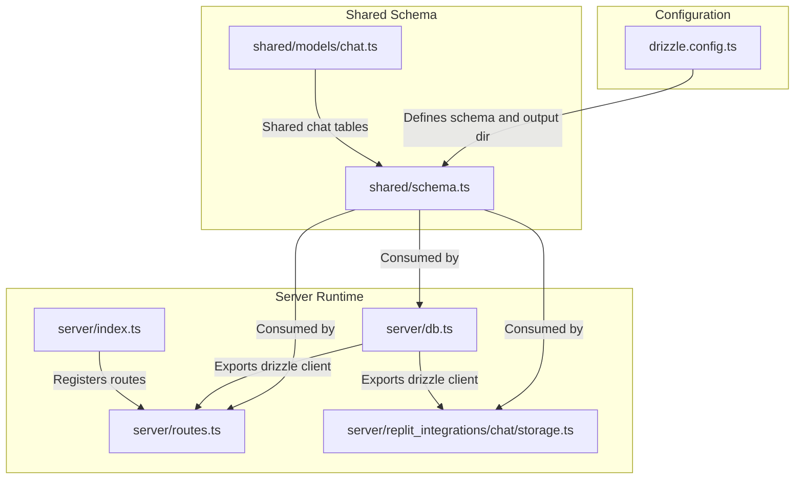
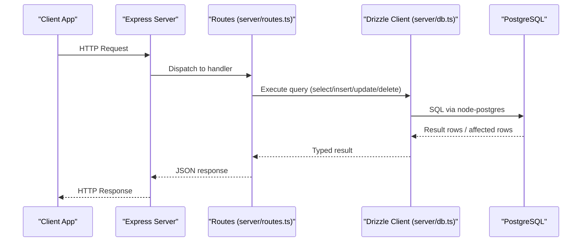
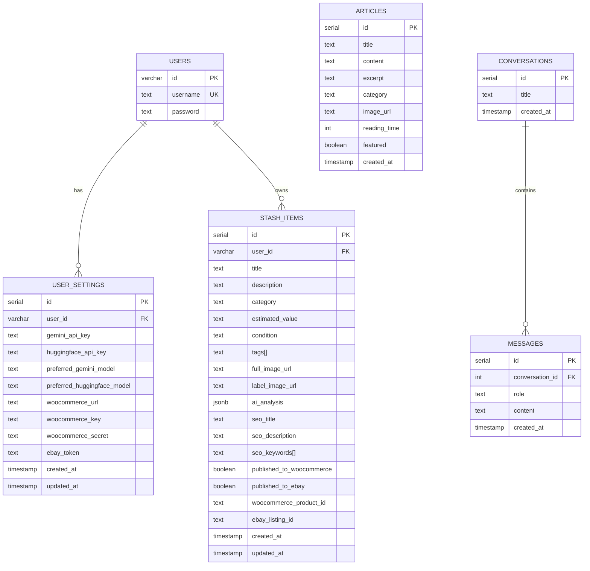
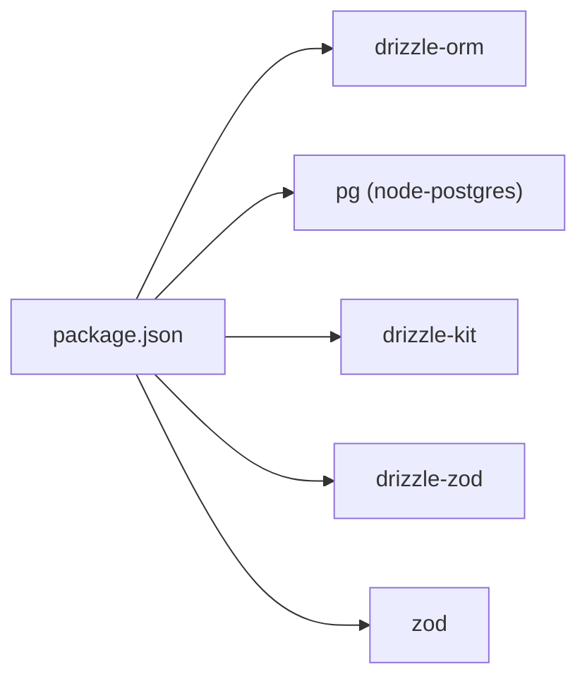

# Database Integration

<cite>
**Referenced Files in This Document**
- [drizzle.config.ts](file://drizzle.config.ts)
- [server/db.ts](file://server/db.ts)
- [shared/schema.ts](file://shared/schema.ts)
- [server/routes.ts](file://server/routes.ts)
- [server/replit_integrations/chat/storage.ts](file://server/replit_integrations/chat/storage.ts)
- [shared/models/chat.ts](file://shared/models/chat.ts)
- [ENVIRONMENT.md](file://ENVIRONMENT.md)
- [package.json](file://package.json)
- [server/index.ts](file://server/index.ts)
</cite>

## Table of Contents
1. [Introduction](#introduction)
2. [Project Structure](#project-structure)
3. [Core Components](#core-components)
4. [Architecture Overview](#architecture-overview)
5. [Detailed Component Analysis](#detailed-component-analysis)
6. [Dependency Analysis](#dependency-analysis)
7. [Performance Considerations](#performance-considerations)
8. [Troubleshooting Guide](#troubleshooting-guide)
9. [Conclusion](#conclusion)
10. [Appendices](#appendices)

## Introduction
This document explains the database integration using Drizzle ORM and PostgreSQL across the project. It covers connection setup, shared schema design, migration management, entity relationships, query patterns, data validation, connection pooling, transactions, performance strategies, and practical CRUD and complex query examples. The schema is defined in a shared location so both client and server can use the same definitions for type safety and consistency.

## Project Structure
The database integration spans three primary areas:
- Drizzle configuration for migrations and schema generation
- A shared schema module consumed by both client and server
- Server-side database access and route handlers using Drizzle ORM

**Diagram sources**
- [drizzle.config.ts](file://drizzle.config.ts#L1-L15)
- [shared/schema.ts](file://shared/schema.ts#L1-L122)
- [shared/models/chat.ts](file://shared/models/chat.ts#L1-L35)
- [server/db.ts](file://server/db.ts#L1-L19)
- [server/routes.ts](file://server/routes.ts#L1-L493)
- [server/replit_integrations/chat/storage.ts](file://server/replit_integrations/chat/storage.ts#L1-L44)
- [server/index.ts](file://server/index.ts#L1-L247)

**Section sources**
- [drizzle.config.ts](file://drizzle.config.ts#L1-L15)
- [shared/schema.ts](file://shared/schema.ts#L1-L122)
- [shared/models/chat.ts](file://shared/models/chat.ts#L1-L35)
- [server/db.ts](file://server/db.ts#L1-L19)
- [server/routes.ts](file://server/routes.ts#L1-L493)
- [server/replit_integrations/chat/storage.ts](file://server/replit_integrations/chat/storage.ts#L1-L44)
- [server/index.ts](file://server/index.ts#L1-L247)

## Core Components
- Drizzle configuration defines migration output directory and schema path for PostgreSQL.
- Shared schema module defines all tables, relationships, and Zod validation schemas for inserts.
- Server database client initializes a connection pool and exposes a typed Drizzle client.
- Route handlers and chat storage modules use the Drizzle client for CRUD and complex queries.

Key responsibilities:
- Drizzle Kit configuration: migration generation and schema synchronization.
- Shared schema: entity definitions, constraints, defaults, and validation schemas.
- Database client: connection pooling, SSL settings, and exported drizzle instance.
- Routes and storage: query building, joins, aggregations, updates, and deletions.

**Section sources**
- [drizzle.config.ts](file://drizzle.config.ts#L1-L15)
- [shared/schema.ts](file://shared/schema.ts#L1-L122)
- [server/db.ts](file://server/db.ts#L1-L19)
- [server/routes.ts](file://server/routes.ts#L1-L493)
- [server/replit_integrations/chat/storage.ts](file://server/replit_integrations/chat/storage.ts#L1-L44)

## Architecture Overview
The runtime architecture connects the Express server to PostgreSQL via Drizzle ORM. The shared schema ensures both sides use identical table definitions and validation rules. Routes orchestrate data operations, while chat storage encapsulates conversation/message persistence.

**Diagram sources**
- [server/index.ts](file://server/index.ts#L224-L246)
- [server/routes.ts](file://server/routes.ts#L24-L493)
- [server/db.ts](file://server/db.ts#L1-L19)

## Detailed Component Analysis

### Drizzle Configuration
- Migration output directory is configured under the migrations folder.
- Schema path points to the shared schema module.
- Dialect is set to PostgreSQL.
- Credentials are loaded from DATABASE_URL.

Operational notes:
- The configuration enforces DATABASE_URL presence at startup.
- Migration commands are exposed via package scripts.

**Section sources**
- [drizzle.config.ts](file://drizzle.config.ts#L1-L15)
- [package.json](file://package.json#L5-L18)

### Shared Schema Design
The shared schema defines the following entities and relationships:

- Users
  - Primary key: id (UUID)
  - Unique constraint: username
  - Fields: id, username, password

- User Settings
  - Primary key: id (serial)
  - Foreign key: userId -> users.id (onDelete: cascade)
  - Fields: userId, geminiApiKey, huggingfaceApiKey, preferredGeminiModel, preferredHuggingfaceModel, woocommerceUrl, woocommerceKey, woocommerceSecret, ebayToken, timestamps

- Stash Items
  - Primary key: id (serial)
  - Foreign key: userId -> users.id (onDelete: cascade)
  - Array fields: tags, seoKeywords
  - JSONB field: aiAnalysis
  - Flags: publishedToWoocommerce, publishedToEbay
  - Identifiers: woocommerceProductId, ebayListingId
  - Timestamps: createdAt, updatedAt

- Articles
  - Primary key: id (serial)
  - Fields: title, content, excerpt, category, imageUrl, readingTime, featured, createdAt

- Conversations
  - Primary key: id (serial)
  - Fields: title, createdAt

- Messages
  - Primary key: id (serial)
  - Foreign key: conversationId -> conversations.id (onDelete: cascade)
  - Fields: conversationId, role, content, createdAt

Validation schemas:
- Zod insert schemas are auto-generated for each table, omitting auto-managed fields (id, timestamps) to enforce safe insert patterns.

**Diagram sources**
- [shared/schema.ts](file://shared/schema.ts#L6-L122)
- [shared/models/chat.ts](file://shared/models/chat.ts#L6-L18)

**Section sources**
- [shared/schema.ts](file://shared/schema.ts#L1-L122)
- [shared/models/chat.ts](file://shared/models/chat.ts#L1-L35)

### Database Client and Connection Pooling
- The server creates a connection pool using node-postgres with DATABASE_URL.
- SSL is configured with certificate verification disabled for convenience.
- Drizzle wraps the pool and schema for type-safe queries.

Connection characteristics:
- Single pool per process.
- Schema binding ensures all queries target the shared schema.
- No explicit pool sizing is configured; defaults apply.

**Section sources**
- [server/db.ts](file://server/db.ts#L1-L19)

### Query Building Patterns and Data Validation
Common patterns observed in routes and storage:
- Select with ordering and filtering
- Aggregation (COUNT)
- Insert with returning
- Update with selective fields
- Delete with cascading behavior
- Joins and nested operations (e.g., chat storage)

Validation approach:
- Zod schemas are generated from Drizzle tables for insert operations.
- Schemas omit auto-managed fields (id, timestamps) to prevent accidental overrides.

Example patterns by file:
- Routes: select, insert, update, delete, aggregation, and complex business logic flows.
- Chat storage: CRUD for conversations and messages with foreign key constraints.

**Section sources**
- [server/routes.ts](file://server/routes.ts#L24-L493)
- [server/replit_integrations/chat/storage.ts](file://server/replit_integrations/chat/storage.ts#L1-L44)
- [shared/schema.ts](file://shared/schema.ts#L78-L122)

### Transaction Handling
- No explicit transaction blocks are present in the current code.
- Operations are executed as individual statements.
- For multi-step writes (e.g., publishing to marketplaces), updates occur after external API responses.

Recommendations:
- Wrap multi-step operations in a transaction to ensure atomicity.
- Use rollback on external API failures to maintain consistency.

[No sources needed since this section provides general guidance]

### Practical Examples

#### CRUD Operations
- Fetch all articles ordered by creation date
  - Reference: [server/routes.ts](file://server/routes.ts#L25-L36)
- Fetch a single article by id
  - Reference: [server/routes.ts](file://server/routes.ts#L38-L55)
- Fetch all stash items ordered by creation date
  - Reference: [server/routes.ts](file://server/routes.ts#L57-L68)
- Fetch stash item count
  - Reference: [server/routes.ts](file://server/routes.ts#L70-L78)
- Fetch a single stash item by id
  - Reference: [server/routes.ts](file://server/routes.ts#L80-L97)
- Create a stash item
  - Reference: [server/routes.ts](file://server/routes.ts#L99-L127)
- Delete a stash item
  - Reference: [server/routes.ts](file://server/routes.ts#L129-L138)

#### Complex Queries and Business Logic
- Analyze item images via AI and return structured JSON
  - Reference: [server/routes.ts](file://server/routes.ts#L140-L226)
- Publish stash item to WooCommerce
  - Reference: [server/routes.ts](file://server/routes.ts#L228-L296)
- Publish stash item to eBay
  - Reference: [server/routes.ts](file://server/routes.ts#L298-L488)

#### Chat Storage Operations
- Get a conversation by id
  - Reference: [server/replit_integrations/chat/storage.ts](file://server/replit_integrations/chat/storage.ts#L14-L18)
- List all conversations ordered by creation date
  - Reference: [server/replit_integrations/chat/storage.ts](file://server/replit_integrations/chat/storage.ts#L20-L22)
- Create a conversation
  - Reference: [server/replit_integrations/chat/storage.ts](file://server/replit_integrations/chat/storage.ts#L24-L26)
- Delete a conversation (with cascade)
  - Reference: [server/replit_integrations/chat/storage.ts](file://server/replit_integrations/chat/storage.ts#L29-L32)
- Retrieve messages for a conversation
  - Reference: [server/replit_integrations/chat/storage.ts](file://server/replit_integrations/chat/storage.ts#L34-L36)
- Create a message
  - Reference: [server/replit_integrations/chat/storage.ts](file://server/replit_integrations/chat/storage.ts#L38-L41)

**Section sources**
- [server/routes.ts](file://server/routes.ts#L24-L493)
- [server/replit_integrations/chat/storage.ts](file://server/replit_integrations/chat/storage.ts#L1-L44)

## Dependency Analysis
- Drizzle ORM and node-postgres are the core database dependencies.
- Drizzle Kit is used for migrations.
- Zod integration generates validation schemas from the schema definitions.
- Express server depends on the database client and routes.

**Diagram sources**
- [package.json](file://package.json#L19-L82)

**Section sources**
- [package.json](file://package.json#L19-L82)

## Performance Considerations
- Connection pooling: The server uses a single pool initialized once. Consider tuning pool size and timeouts for production workloads.
- SSL configuration: Certificate verification is disabled for convenience; enable strict verification in production environments.
- Query patterns: Prefer selective field retrieval, limit heavy aggregations, and add appropriate indexes for frequently filtered columns.
- Batch operations: Group related writes and avoid N+1 selects by preloading associations.
- Caching: Introduce caching for read-heavy endpoints (e.g., articles, stash counts) to reduce database load.

[No sources needed since this section provides general guidance]

## Troubleshooting Guide
Common issues and resolutions:
- Missing DATABASE_URL
  - Symptom: Application fails to start with a database error.
  - Resolution: Ensure DATABASE_URL is set in the environment.
  - Reference: [server/db.ts](file://server/db.ts#L7-L9), [ENVIRONMENT.md](file://ENVIRONMENT.md#L18-L22)
- Port conflicts
  - Symptom: Server fails to bind to port 5000.
  - Resolution: Kill existing processes or change PORT.
  - Reference: [server/index.ts](file://server/index.ts#L235-L245), [ENVIRONMENT.md](file://ENVIRONMENT.md#L174-L177)
- Database connectivity
  - Symptom: Queries fail or timeout.
  - Resolution: Verify DATABASE_URL and test connectivity with psql.
  - Reference: [ENVIRONMENT.md](file://ENVIRONMENT.md#L178-L181)
- Migration errors
  - Symptom: Migration command fails.
  - Resolution: Confirm DATABASE_URL and run the migration script.
  - Reference: [ENVIRONMENT.md](file://ENVIRONMENT.md#L93-L100), [package.json](file://package.json#L12-L12)

**Section sources**
- [server/db.ts](file://server/db.ts#L7-L9)
- [server/index.ts](file://server/index.ts#L235-L245)
- [ENVIRONMENT.md](file://ENVIRONMENT.md#L174-L181)
- [package.json](file://package.json#L12-L12)

## Conclusion
The project integrates Drizzle ORM with PostgreSQL using a shared schema for type safety and consistency. The server initializes a connection pool, exposes a typed client, and implements robust CRUD and complex business logic through routes and storage modules. Migrations are managed via Drizzle Kit, and validation leverages Zod schemas derived from the schema definitions. With proper connection tuning, transaction boundaries, and indexing, the system can scale effectively.

[No sources needed since this section summarizes without analyzing specific files]

## Appendices

### Migration Management
- Command: npm run db:push
- Purpose: Apply migrations from the migrations directory to the database.
- Idempotency: Safe to run multiple times.

**Section sources**
- [ENVIRONMENT.md](file://ENVIRONMENT.md#L93-L100)
- [package.json](file://package.json#L12-L12)

### Seed Data
- No seed scripts or seed data are present in the repository.
- To populate initial data, use INSERT statements or a dedicated seed script.

[No sources needed since this section provides general guidance]