# Express Server Architecture

<cite>
**Referenced Files in This Document**
- [server/index.ts](file://server/index.ts)
- [server/routes.ts](file://server/routes.ts)
- [server/db.ts](file://server/db.ts)
- [server/templates/landing-page.html](file://server/templates/landing-page.html)
- [scripts/build.js](file://scripts/build.js)
- [shared/schema.ts](file://shared/schema.ts)
- [package.json](file://package.json)
- [app.json](file://app.json)
- [ENVIRONMENT.md](file://ENVIRONMENT.md)
- [server/replit_integrations/chat/routes.ts](file://server/replit_integrations/chat/routes.ts)
- [server/replit_integrations/image/routes.ts](file://server/replit_integrations/image/routes.ts)
- [server/replit_integrations/batch/utils.ts](file://server/replit_integrations/batch/utils.ts)
</cite>

## Table of Contents
1. [Introduction](#introduction)
2. [Project Structure](#project-structure)
3. [Core Components](#core-components)
4. [Architecture Overview](#architecture-overview)
5. [Detailed Component Analysis](#detailed-component-analysis)
6. [Dependency Analysis](#dependency-analysis)
7. [Performance Considerations](#performance-considerations)
8. [Troubleshooting Guide](#troubleshooting-guide)
9. [Conclusion](#conclusion)
10. [Appendices](#appendices)

## Introduction
This document provides comprehensive documentation for the Express.js server architecture powering the HiddenGem project. It covers server initialization, middleware configuration, request handling patterns, CORS setup with dynamic origin handling, body parsing with raw body capture, request logging with performance monitoring, error handling strategies, and Expo integration for mobile app distribution including manifest serving, landing page generation, and static asset serving. It also includes server startup configuration, environment variable handling, and deployment considerations with practical examples of middleware chain execution, custom error handling, and server configuration patterns.

## Project Structure
The server architecture is organized around a modular Express application with dedicated modules for routing, database connectivity, and Expo integration. The build system generates static assets for production deployment, while environment-specific configurations enable seamless development and deployment across platforms.

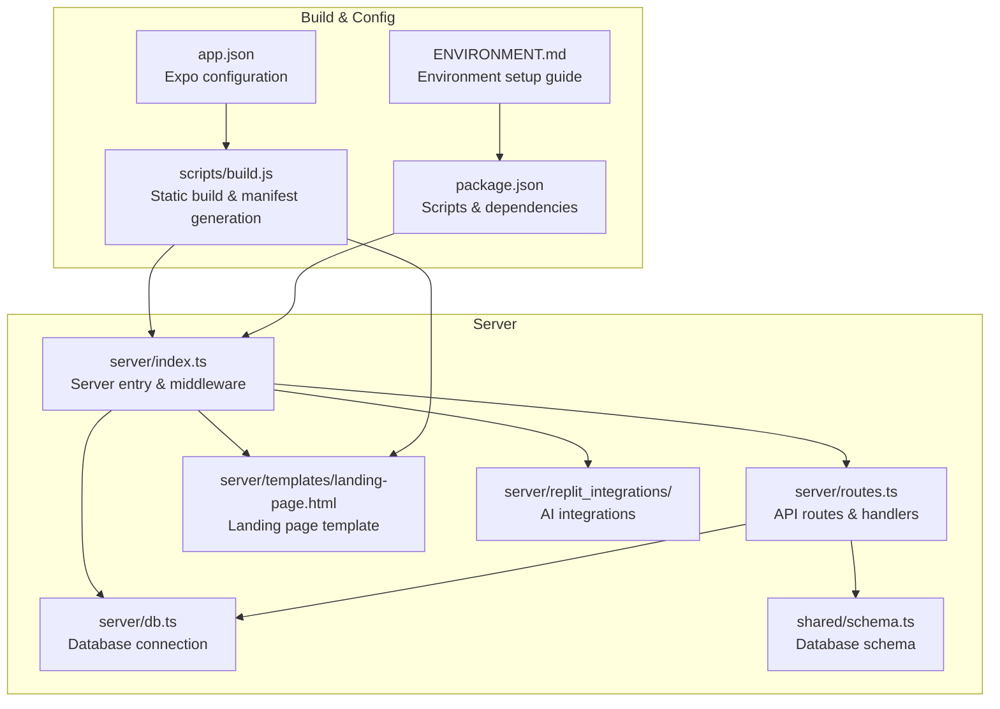

**Diagram sources**
- [server/index.ts](file://server/index.ts#L1-L247)
- [server/routes.ts](file://server/routes.ts#L1-L493)
- [server/db.ts](file://server/db.ts#L1-L19)
- [server/templates/landing-page.html](file://server/templates/landing-page.html#L1-L466)
- [scripts/build.js](file://scripts/build.js#L1-L562)
- [package.json](file://package.json#L1-L85)
- [app.json](file://app.json#L1-L52)
- [ENVIRONMENT.md](file://ENVIRONMENT.md#L1-L219)

**Section sources**
- [server/index.ts](file://server/index.ts#L1-L247)
- [server/routes.ts](file://server/routes.ts#L1-L493)
- [scripts/build.js](file://scripts/build.js#L1-L562)
- [package.json](file://package.json#L1-L85)
- [app.json](file://app.json#L1-L52)
- [ENVIRONMENT.md](file://ENVIRONMENT.md#L1-L219)

## Core Components
This section outlines the primary building blocks of the server architecture, focusing on middleware configuration, request handling, and integration points.

- Express server initialization and middleware stack
- CORS configuration with dynamic origin handling for development and production
- Body parsing with raw body capture for signature verification
- Request logging middleware with performance monitoring
- Expo integration for manifest serving, landing page generation, and static asset serving
- Error handling middleware with structured responses
- Route registration and API endpoint definitions
- Database connectivity and schema integration

**Section sources**
- [server/index.ts](file://server/index.ts#L1-L247)
- [server/routes.ts](file://server/routes.ts#L1-L493)
- [server/db.ts](file://server/db.ts#L1-L19)
- [shared/schema.ts](file://shared/schema.ts#L1-L122)

## Architecture Overview
The server follows a layered architecture with clear separation of concerns:
- Middleware layer handles CORS, body parsing, logging, and Expo routing
- Route layer defines API endpoints and integrates with database operations
- Integration layer manages AI services and batch processing utilities
- Build layer generates static assets and manifests for production deployment

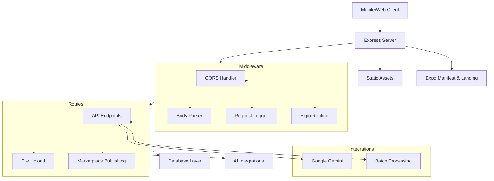

**Diagram sources**
- [server/index.ts](file://server/index.ts#L16-L53)
- [server/index.ts](file://server/index.ts#L55-L65)
- [server/index.ts](file://server/index.ts#L67-L98)
- [server/index.ts](file://server/index.ts#L163-L205)
- [server/routes.ts](file://server/routes.ts#L24-L492)

## Detailed Component Analysis

### Server Initialization and Middleware Chain
The server initializes with a carefully ordered middleware stack that ensures proper request processing and response handling.

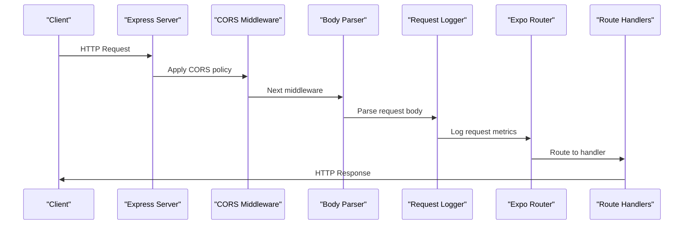

**Diagram sources**
- [server/index.ts](file://server/index.ts#L224-L246)
- [server/index.ts](file://server/index.ts#L16-L53)
- [server/index.ts](file://server/index.ts#L55-L65)
- [server/index.ts](file://server/index.ts#L67-L98)
- [server/index.ts](file://server/index.ts#L163-L205)

**Section sources**
- [server/index.ts](file://server/index.ts#L224-L246)

### CORS Configuration with Dynamic Origin Handling
The CORS middleware dynamically configures allowed origins based on environment variables and supports both development and production scenarios.

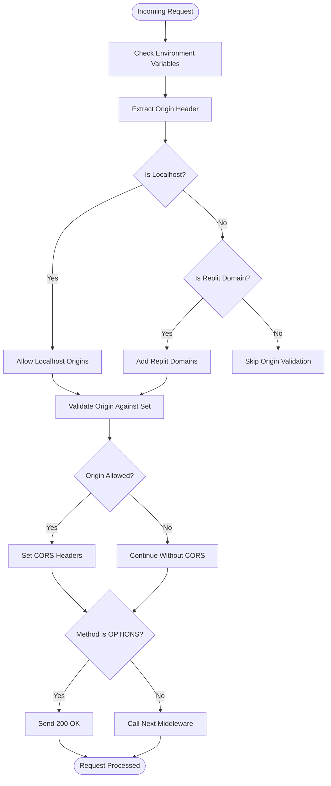

**Diagram sources**
- [server/index.ts](file://server/index.ts#L16-L53)

**Section sources**
- [server/index.ts](file://server/index.ts#L16-L53)

### Body Parsing Configuration with Raw Body Capture
The body parsing middleware captures raw request bodies for cryptographic signature verification and supports both JSON and URL-encoded content.

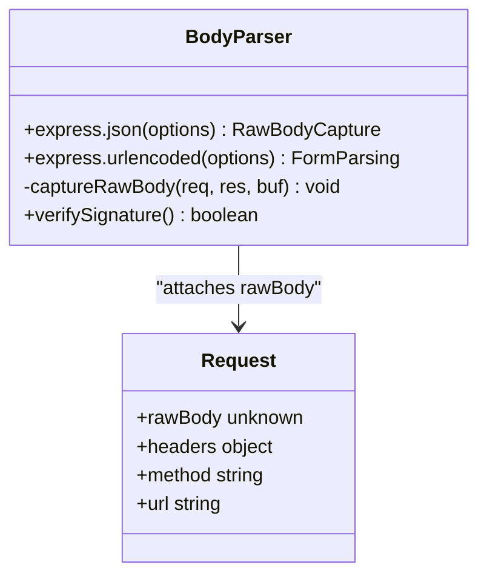

**Diagram sources**
- [server/index.ts](file://server/index.ts#L55-L65)

**Section sources**
- [server/index.ts](file://server/index.ts#L55-L65)

### Request Logging Middleware with Performance Monitoring
The logging middleware monitors request performance and captures response data for debugging and analytics.

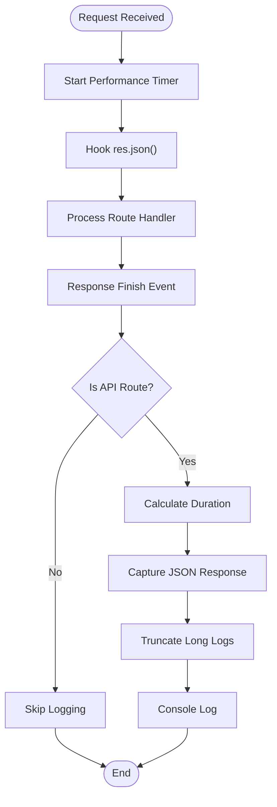

**Diagram sources**
- [server/index.ts](file://server/index.ts#L67-L98)

**Section sources**
- [server/index.ts](file://server/index.ts#L67-L98)

### Expo Integration for Mobile App Distribution
The server provides comprehensive Expo integration including manifest serving, landing page generation, and static asset serving.

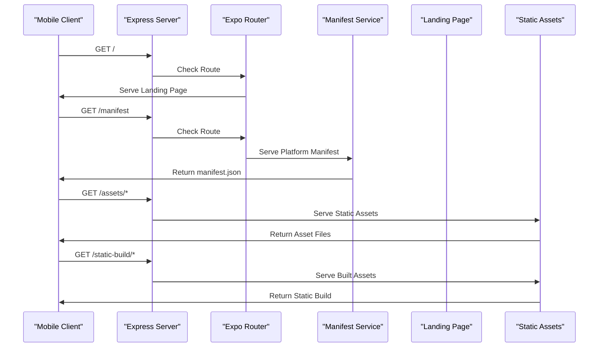

**Diagram sources**
- [server/index.ts](file://server/index.ts#L163-L205)
- [server/index.ts](file://server/index.ts#L111-L131)
- [server/index.ts](file://server/index.ts#L133-L161)
- [server/templates/landing-page.html](file://server/templates/landing-page.html#L1-L466)

**Section sources**
- [server/index.ts](file://server/index.ts#L111-L161)
- [server/index.ts](file://server/index.ts#L163-L205)
- [server/templates/landing-page.html](file://server/templates/landing-page.html#L1-L466)

### API Routes and Request Handling Patterns
The server implements comprehensive API endpoints for articles, stash items, AI analysis, and marketplace publishing.

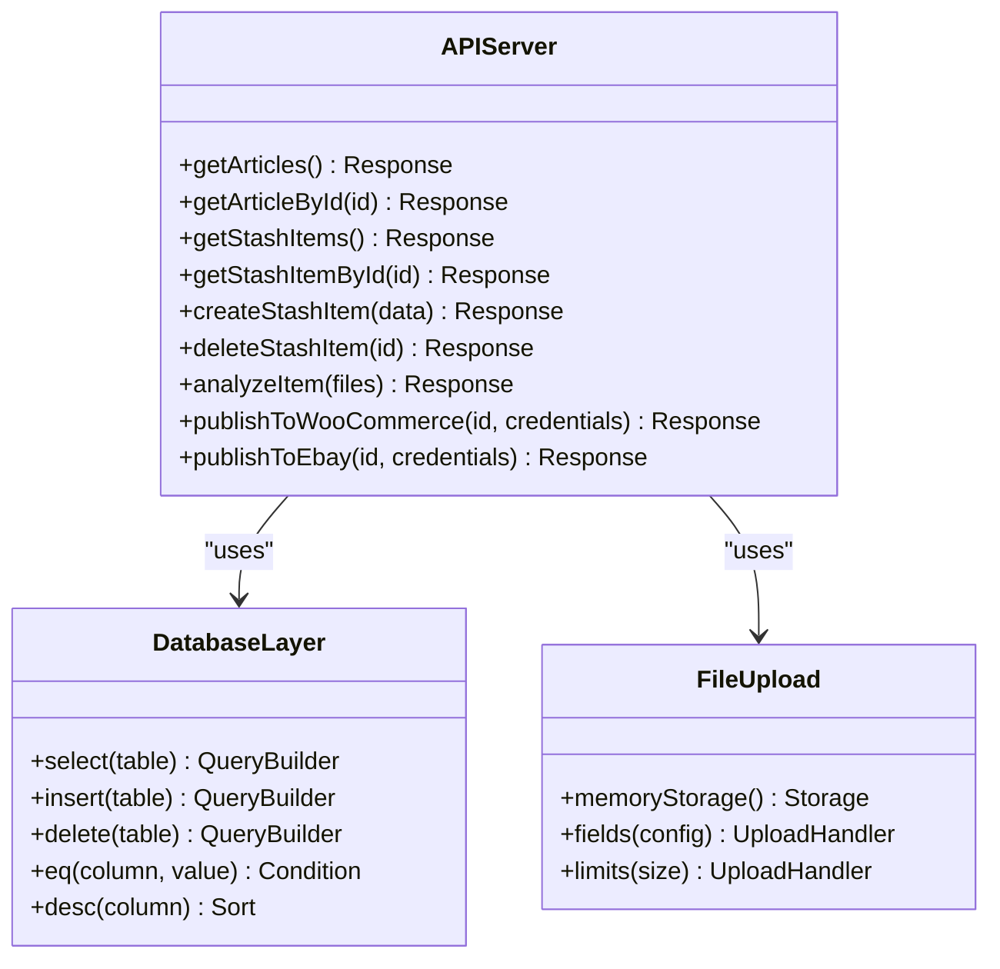

**Diagram sources**
- [server/routes.ts](file://server/routes.ts#L24-L492)

**Section sources**
- [server/routes.ts](file://server/routes.ts#L24-L492)

### Error Handling Strategies
The server implements centralized error handling with structured responses and proper error propagation.

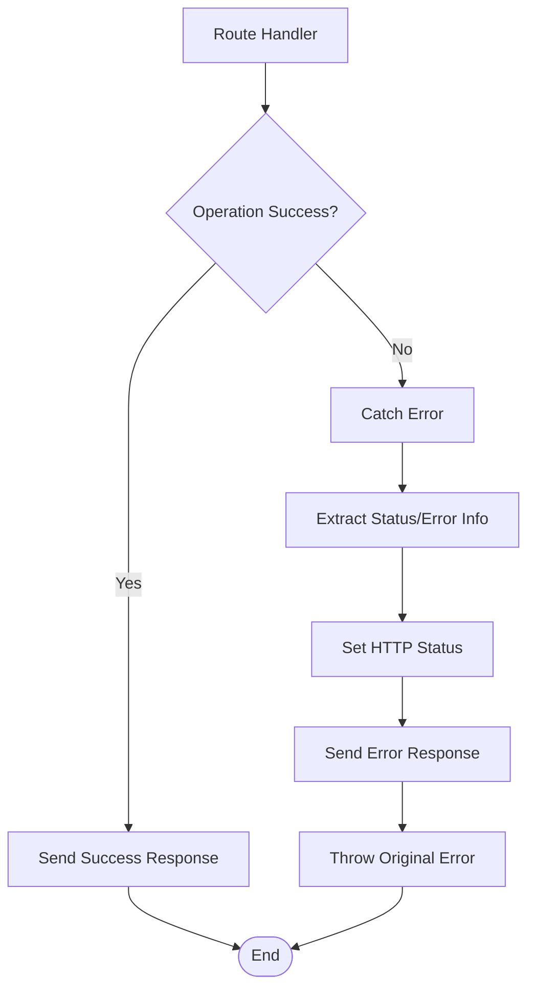

**Diagram sources**
- [server/index.ts](file://server/index.ts#L207-L222)

**Section sources**
- [server/index.ts](file://server/index.ts#L207-L222)

### Database Connectivity and Schema Integration
The server connects to PostgreSQL using Drizzle ORM with proper SSL configuration and schema integration.

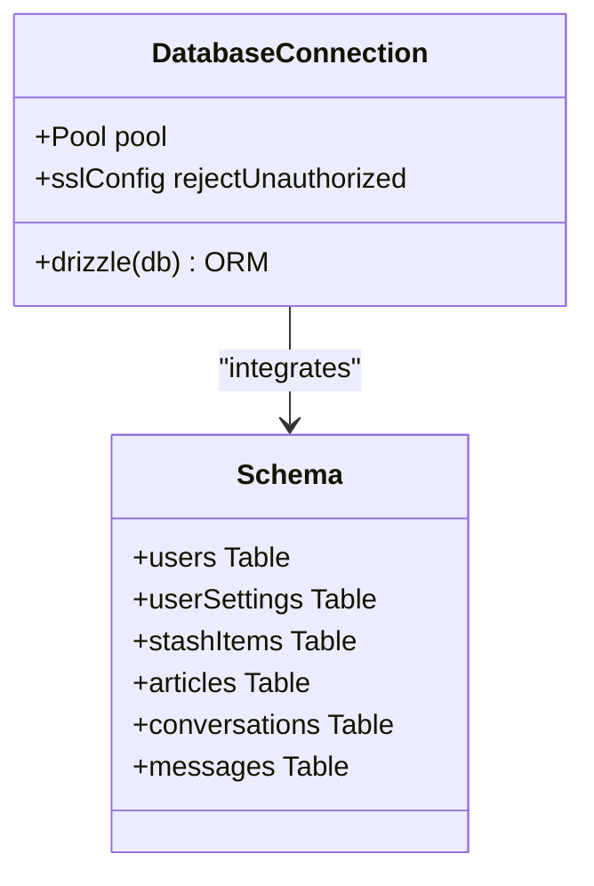

**Diagram sources**
- [server/db.ts](file://server/db.ts#L1-L19)
- [shared/schema.ts](file://shared/schema.ts#L1-L122)

**Section sources**
- [server/db.ts](file://server/db.ts#L1-L19)
- [shared/schema.ts](file://shared/schema.ts#L1-L122)

### AI Integrations and Batch Processing
The server integrates with Google Gemini for AI-powered features and provides batch processing utilities for handling rate limits and retries.

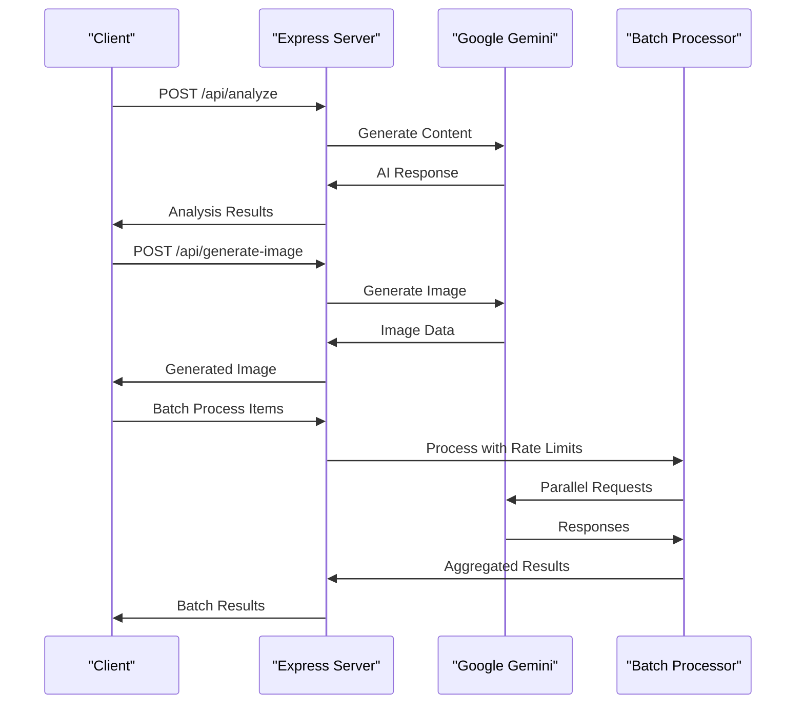

**Diagram sources**
- [server/routes.ts](file://server/routes.ts#L140-L226)
- [server/replit_integrations/chat/routes.ts](file://server/replit_integrations/chat/routes.ts#L71-L123)
- [server/replit_integrations/image/routes.ts](file://server/replit_integrations/image/routes.ts#L5-L39)
- [server/replit_integrations/batch/utils.ts](file://server/replit_integrations/batch/utils.ts#L69-L109)

**Section sources**
- [server/routes.ts](file://server/routes.ts#L140-L226)
- [server/replit_integrations/chat/routes.ts](file://server/replit_integrations/chat/routes.ts#L19-L123)
- [server/replit_integrations/image/routes.ts](file://server/replit_integrations/image/routes.ts#L5-L39)
- [server/replit_integrations/batch/utils.ts](file://server/replit_integrations/batch/utils.ts#L48-L109)

## Dependency Analysis
The server architecture demonstrates clear dependency relationships and modular design patterns.

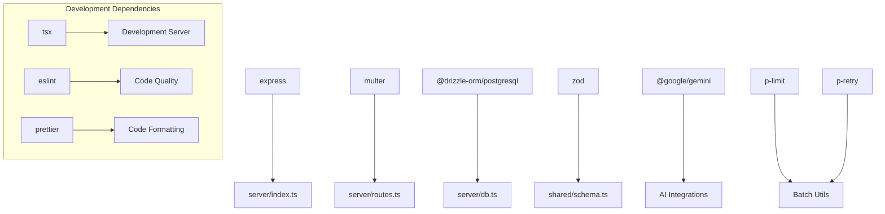

**Diagram sources**
- [package.json](file://package.json#L19-L82)
- [server/index.ts](file://server/index.ts#L1-L7)
- [server/routes.ts](file://server/routes.ts#L1-L10)

**Section sources**
- [package.json](file://package.json#L19-L82)

## Performance Considerations
The server implements several performance optimization strategies:
- Request logging with minimal overhead using finish event listeners
- Efficient CORS handling with early origin validation
- Memory-efficient file uploads using multer memory storage
- Database connection pooling for optimal resource utilization
- Static asset serving for reduced server load
- Batch processing with configurable concurrency limits

## Troubleshooting Guide
Common issues and their resolutions:

### CORS Configuration Issues
- Verify environment variables REPLIT_DEV_DOMAIN and REPLIT_DOMAINS are properly set
- Check localhost origins are allowed for Expo development
- Ensure origin validation logic matches actual client domains

### Database Connection Problems
- Confirm DATABASE_URL environment variable is set correctly
- Verify PostgreSQL server is accessible and credentials are valid
- Check SSL configuration for production deployments

### Expo Manifest Serving Errors
- Ensure static-build directory exists and contains platform-specific manifests
- Verify manifest.json files are properly generated during build process
- Check file permissions for static asset serving

### API Endpoint Failures
- Review error handling middleware for proper error propagation
- Check database schema consistency with application expectations
- Validate file upload limits and storage configuration

**Section sources**
- [server/index.ts](file://server/index.ts#L16-L53)
- [server/db.ts](file://server/db.ts#L7-L9)
- [ENVIRONMENT.md](file://ENVIRONMENT.md#L172-L195)

## Conclusion
The HiddenGem Express server architecture demonstrates robust design patterns for modern web applications. The modular middleware stack, comprehensive API endpoints, and integrated Expo support create a scalable foundation for mobile app distribution. The implementation balances development flexibility with production readiness through careful environment configuration, performance monitoring, and error handling strategies.

## Appendices

### Server Startup Configuration
The server supports multiple deployment scenarios with flexible configuration options:
- Development mode with hot reloading via tsx
- Production mode with compiled server_dist
- Static build generation for Expo distribution
- Environment-specific CORS and routing configurations

**Section sources**
- [package.json](file://package.json#L5-L17)
- [scripts/build.js](file://scripts/build.js#L497-L553)

### Environment Variable Reference
Key environment variables and their purposes:
- DATABASE_URL: PostgreSQL connection string
- AI_INTEGRATIONS_GEMINI_API_KEY: Gemini API authentication
- AI_INTEGRATIONS_GEMINI_BASE_URL: Gemini API endpoint
- EXPO_PUBLIC_SUPABASE_URL: Supabase project URL
- EXPO_PUBLIC_SUPABASE_ANON_KEY: Supabase public key
- SESSION_SECRET: Express session encryption key
- REPLIT_DEV_DOMAIN: Development domain for CORS
- REPLIT_DOMAINS: Production domains for CORS

**Section sources**
- [ENVIRONMENT.md](file://ENVIRONMENT.md#L12-L68)

### Practical Examples

#### Middleware Chain Execution Example
```typescript
// Order of middleware execution
setupCors(app);
setupBodyParsing(app);
setupRequestLogging(app);
configureExpoAndLanding(app);
registerRoutes(app);
setupErrorHandler(app);
```

#### Custom Error Handling Pattern
```typescript
app.use((err, req, res, next) => {
  const error = err as { status?: number; statusCode?: number; message?: string };
  const status = error.status || error.statusCode || 500;
  const message = error.message || "Internal Server Error";
  res.status(status).json({ message });
  throw err; // Re-throw for logging/tracing
});
```

#### Server Configuration Pattern
```typescript
const port = parseInt(process.env.PORT || "5000", 10);
server.listen({
  port,
  host: "0.0.0.0",
  reusePort: true,
}, () => {
  console.log(`express server serving on port ${port}`);
});
```

**Section sources**
- [server/index.ts](file://server/index.ts#L224-L246)
- [server/index.ts](file://server/index.ts#L207-L222)