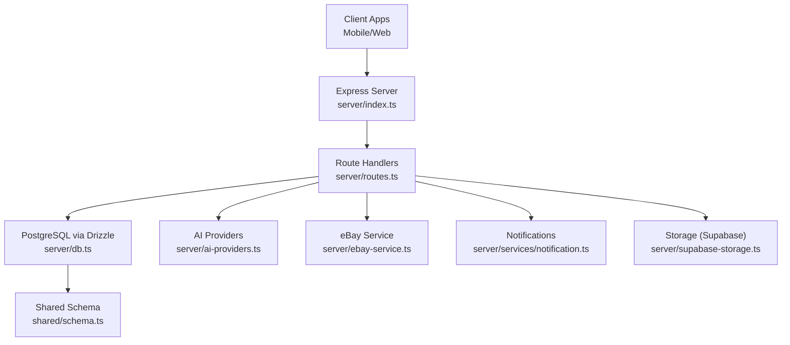
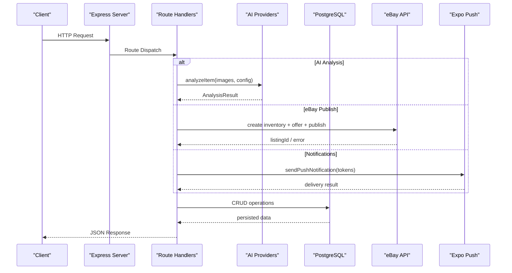
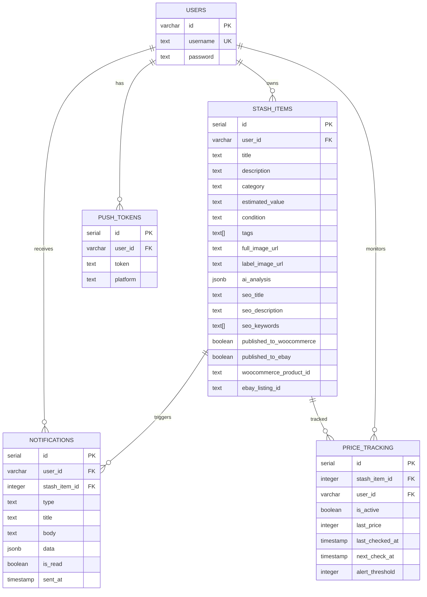
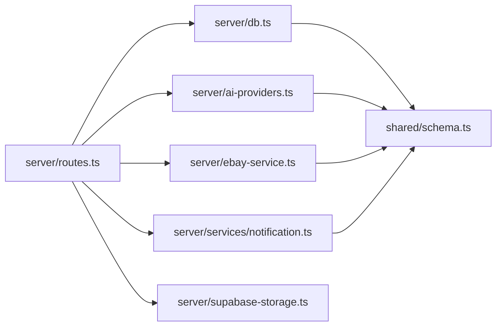

# API Endpoints

<cite>
**Referenced Files in This Document**
- [server/index.ts](file://server/index.ts)
- [server/routes.ts](file://server/routes.ts)
- [server/db.ts](file://server/db.ts)
- [server/ebay-service.ts](file://server/ebay-service.ts)
- [server/services/notification.ts](file://server/services/notification.ts)
- [server/ai-providers.ts](file://server/ai-providers.ts)
- [server/ai-seo.ts](file://server/ai-seo.ts)
- [server/storage.ts](file://server/storage.ts)
- [server/supabase-storage.ts](file://server/supabase-storage.ts)
- [shared/schema.ts](file://shared/schema.ts)
- [shared/types.ts](file://shared/types.ts)
- [migrations/0001_flipagent_tables.sql](file://migrations/0001_flipagent_tables.sql)
</cite>

## Table of Contents
1. [Introduction](#introduction)
2. [Project Structure](#project-structure)
3. [Core Components](#core-components)
4. [Architecture Overview](#architecture-overview)
5. [Detailed Component Analysis](#detailed-component-analysis)
6. [Dependency Analysis](#dependency-analysis)
7. [Performance Considerations](#performance-considerations)
8. [Troubleshooting Guide](#troubleshooting-guide)
9. [Conclusion](#conclusion)

## Introduction
This document provides comprehensive API documentation for the backend server. It covers:
- Authentication endpoints (login, logout, session management) via Supabase
- Item analysis endpoints powered by AI providers (Gemini, OpenAI, Anthropic, Custom)
- Marketplace integration endpoints for eBay and WooCommerce (listing creation, publishing, inventory updates)
- Notification endpoints for push token registration and alert management
- Endpoint specifications, request/response schemas, authentication requirements, and error handling

## Project Structure
The server is implemented as an Express application with route registration and database integration. Key areas:
- Route handlers define endpoints under /api
- Services encapsulate business logic (eBay integration, notifications, AI analysis)
- Shared schema defines database tables and types
- Environment variables configure external integrations (AI, Supabase, eBay)

**Diagram sources**
- [server/index.ts](file://server/index.ts#L1-L262)
- [server/routes.ts](file://server/routes.ts#L1-L929)
- [server/db.ts](file://server/db.ts#L1-L19)
- [server/ai-providers.ts](file://server/ai-providers.ts#L1-L696)
- [server/ebay-service.ts](file://server/ebay-service.ts#L1-L474)
- [server/services/notification.ts](file://server/services/notification.ts#L1-L414)
- [server/supabase-storage.ts](file://server/supabase-storage.ts#L1-L93)
- [shared/schema.ts](file://shared/schema.ts#L1-L344)

**Section sources**
- [server/index.ts](file://server/index.ts#L1-L262)
- [server/routes.ts](file://server/routes.ts#L1-L929)
- [shared/schema.ts](file://shared/schema.ts#L1-L344)

## Core Components
- Express server with CORS, body parsing, logging, and error handling
- Route registry that mounts endpoints for:
  - Articles and stash items (CRUD)
  - AI-powered item analysis (image uploads, retry analysis)
  - Marketplace publishing (WooCommerce, eBay)
  - Notifications (push tokens, alerts, price tracking)
  - AI provider testing
- Database integration via Drizzle ORM against PostgreSQL
- eBay integration utilities for listings, inventory, and token refresh
- Notification service for push tokens, alerts, and scheduled price checks
- AI provider abstraction supporting multiple backends with retry and validation
- Supabase storage for product images

**Section sources**
- [server/index.ts](file://server/index.ts#L1-L262)
- [server/routes.ts](file://server/routes.ts#L1-L929)
- [server/db.ts](file://server/db.ts#L1-L19)
- [server/ebay-service.ts](file://server/ebay-service.ts#L1-L474)
- [server/services/notification.ts](file://server/services/notification.ts#L1-L414)
- [server/ai-providers.ts](file://server/ai-providers.ts#L1-L696)
- [server/supabase-storage.ts](file://server/supabase-storage.ts#L1-L93)

## Architecture Overview
The API follows a layered architecture:
- Transport and middleware (CORS, body parsing, logging)
- Routing layer (route.ts)
- Domain services (eBay, notifications, AI)
- Persistence (Drizzle ORM + PostgreSQL)
- External integrations (eBay APIs, Supabase Storage, Expo Push)

**Diagram sources**
- [server/routes.ts](file://server/routes.ts#L299-L385)
- [server/ai-providers.ts](file://server/ai-providers.ts#L380-L396)
- [server/ebay-service.ts](file://server/ebay-service.ts#L386-L430)
- [server/services/notification.ts](file://server/services/notification.ts#L72-L129)

## Detailed Component Analysis

### Authentication Endpoints
Authentication is handled by Supabase on the client side. The backend exposes:
- Supabase Auth state management and OAuth callbacks (handled by client hooks)
- No dedicated backend login/logout endpoints in the provided routes

Recommended client-side flow:
- Password-based sign-in/sign-up
- OAuth with Google
- Session persistence and state subscription

Notes:
- The backend does not expose explicit /login or /logout endpoints
- Supabase manages sessions and tokens; ensure redirect URLs and browser completion are configured

**Section sources**
- [client/hooks/useAuth.ts](file://client/hooks/useAuth.ts#L1-L122)
- [client/screens/AuthScreen.tsx](file://client/screens/AuthScreen.tsx#L24-L69)

### Item Analysis Endpoints
Purpose: AI-powered item analysis from uploaded images with optional retry and feedback.

- POST /api/analyze
  - Purpose: Analyze item images (full and label) and return structured results
  - Authentication: None (public)
  - Request: multipart/form-data with fields fullImage and labelImage
  - Response: JSON object with fields including title, description, category, estimatedValue, condition, SEO fields, tags, and enhanced fields
  - Errors: 400 on missing files; 500 on analysis failure
  - Example usage: Upload two images; receive JSON with valuation and SEO metadata

- POST /api/analyze/retry
  - Purpose: Re-analyze an item with previous result and user feedback
  - Authentication: None (public)
  - Request: multipart/form-data (optional images) plus previousResult and feedback; optional provider, apiKey, model
  - Response: Updated AnalysisResult
  - Errors: 400 on missing required fields; 500 on analysis failure

- POST /api/ai-providers/test
  - Purpose: Test connectivity to configured AI providers
  - Authentication: None (public)
  - Request: JSON with provider, apiKey, endpoint, model
  - Response: { success: boolean, message: string }
  - Errors: 500 on test failure

Validation and behavior:
- Image validation occurs in the handler; invalid or missing images are handled gracefully
- AI provider selection supports gemini, openai, anthropic, custom
- Retry pipeline incorporates user feedback into a refined prompt

**Section sources**
- [server/routes.ts](file://server/routes.ts#L299-L385)
- [server/routes.ts](file://server/routes.ts#L672-L711)
- [server/routes.ts](file://server/routes.ts#L649-L670)
- [server/ai-providers.ts](file://server/ai-providers.ts#L1-L696)

### Marketplace Integration Endpoints

#### eBay Integration
Endpoints for listing creation and publishing via eBay APIs.

- POST /api/stash/:id/publish/ebay
  - Purpose: Publish a stash item to eBay using OAuth refresh token
  - Authentication: Requires userId query param; request body includes credentials and environment
  - Request: JSON with clientId, clientSecret, refreshToken, environment ("production" or "sandbox"), merchantLocationKey (optional)
  - Response: { success: true, listingId, listingUrl?, message? }
  - Errors: 400 on missing credentials or item already published; 400 with policy requirement message; 500 on API errors
  - Behavior: Creates inventory item, creates offer, optionally publishes; stores listingId and environment-aware URL

- GET /api/listings/ebay
  - Purpose: Fetch eBay listings summary
  - Authentication: Requires credentials; uses stored refresh token
  - Request: Query params environment, limit, offset
  - Response: { listings: EbayListingSummary[], total: number }
  - Errors: Propagates eBay API errors

- GET /api/inventory/ebay
  - Purpose: Fetch eBay inventory items
  - Authentication: Requires credentials
  - Request: Query params environment, limit, offset
  - Response: { items: EbayInventoryItem[], total: number }
  - Errors: Propagates eBay API errors

- PUT /api/listings/ebay/:itemId
  - Purpose: Update eBay inventory item
  - Authentication: Requires credentials
  - Request: Path itemId; JSON body with partial fields (title, description, price, quantity, categoryId, imageUrls, condition)
  - Response: { itemId, status, message, url? }
  - Errors: Propagates eBay API errors

- DELETE /api/listings/ebay/:itemId
  - Purpose: Delete eBay inventory item
  - Authentication: Requires credentials
  - Request: Path itemId
  - Response: { itemId, status, message }
  - Errors: Propagates eBay API errors

- POST /api/ebay/token/refresh
  - Purpose: Refresh eBay access token
  - Authentication: Requires clientId, clientSecret, refreshToken
  - Request: JSON with clientId, clientSecret, refreshToken, environment
  - Response: { accessToken, refreshToken, expiresAt }
  - Errors: Propagates eBay API errors

Validation and behavior:
- Environment-aware base URLs for production vs sandbox
- Token refresh returns updated tokens and expiry
- Listing updates support partial fields; deletion uses 204 handling

**Section sources**
- [server/routes.ts](file://server/routes.ts#L457-L647)
- [server/ebay-service.ts](file://server/ebay-service.ts#L64-L109)
- [server/ebay-service.ts](file://server/ebay-service.ts#L111-L149)
- [server/ebay-service.ts](file://server/ebay-service.ts#L386-L430)
- [server/ebay-service.ts](file://server/ebay-service.ts#L435-L473)
- [server/ebay-service.ts](file://server/ebay-service.ts#L329-L364)

#### WooCommerce Integration
Endpoint for publishing a stash item to WooCommerce.

- POST /api/stash/:id/publish/woocommerce
  - Purpose: Publish a stash item to WooCommerce store
  - Authentication: Requires userId query param; request body includes storeUrl, consumerKey, consumerSecret
  - Request: JSON with storeUrl, consumerKey, consumerSecret
  - Response: { success: true, productId, productUrl }
  - Errors: 400 on missing credentials or already published; 404 if item not found; 500 on API errors
  - Behavior: Parses estimatedValue for price; posts product to /wp-json/wc/v3/products; marks item as published

Validation and behavior:
- Validates presence of credentials and item existence
- Uses Basic auth with consumerKey:consumerSecret
- Stores published identifiers on stash item

**Section sources**
- [server/routes.ts](file://server/routes.ts#L387-L455)

### Notification Endpoints
Push notifications and price tracking management.

- POST /api/push-token
  - Purpose: Register a push token for a user
  - Authentication: None (public)
  - Request: JSON with userId, token, platform
  - Response: { success: true }
  - Errors: 400 on missing fields; 500 on storage error

- DELETE /api/push-token
  - Purpose: Unregister a push token
  - Authentication: None (public)
  - Request: JSON with userId, token
  - Response: { success: true }
  - Errors: 500 on storage error

- GET /api/notifications
  - Purpose: Retrieve user notifications
  - Authentication: None (public)
  - Request: Query param userId
  - Response: Array of notifications
  - Errors: 400 on missing userId; 500 on DB error

- GET /api/notifications/unread-count
  - Purpose: Get unread notification count
  - Authentication: None (public)
  - Request: Query param userId
  - Response: { count: number }
  - Errors: 400 on missing userId; 500 on DB error

- POST /api/notifications/:id/read
  - Purpose: Mark a notification as read
  - Authentication: None (public)
  - Request: Query param userId; Path param id
  - Response: { success: true }
  - Errors: 400 on missing fields; 500 on DB error

- POST /api/notifications/read-all
  - Purpose: Mark all notifications as read
  - Authentication: None (public)
  - Request: Query param userId
  - Response: { success: true }
  - Errors: 400 on missing userId; 500 on DB error

- POST /api/stash/:id/price-tracking
  - Purpose: Enable price tracking with alert threshold
  - Authentication: None (public)
  - Request: Query param userId; Path param id; Body alertThreshold
  - Response: { success: true }
  - Errors: 400 on missing fields; 500 on DB error

- DELETE /api/stash/:id/price-tracking
  - Purpose: Disable price tracking
  - Authentication: None (public)
  - Request: Query param userId; Path param id
  - Response: { success: true }
  - Errors: 400 on missing fields; 500 on DB error

- GET /api/stash/:id/price-tracking
  - Purpose: Get price tracking status
  - Authentication: None (public)
  - Request: Query param userId; Path param id
  - Response: { isActive: boolean, alertThreshold: number } or null
  - Errors: 400 on missing fields; 500 on DB error

Validation and behavior:
- Push tokens are stored with platform; duplicates are updated
- Notifications include type, title, body, and optional data payload
- Price tracking stores thresholds and schedules periodic checks

**Section sources**
- [server/routes.ts](file://server/routes.ts#L46-L72)
- [server/routes.ts](file://server/routes.ts#L74-L129)
- [server/routes.ts](file://server/routes.ts#L132-L182)
- [server/services/notification.ts](file://server/services/notification.ts#L31-L58)
- [server/services/notification.ts](file://server/services/notification.ts#L63-L67)
- [server/services/notification.ts](file://server/services/notification.ts#L274-L284)
- [server/services/notification.ts](file://server/services/notification.ts#L317-L326)
- [server/services/notification.ts](file://server/services/notification.ts#L162-L223)
- [server/services/notification.ts](file://server/services/notification.ts#L228-L241)
- [server/services/notification.ts](file://server/services/notification.ts#L246-L269)

### Data Model Overview
Core tables and relationships used by the API:

**Diagram sources**
- [shared/schema.ts](file://shared/schema.ts#L6-L50)
- [shared/schema.ts](file://shared/schema.ts#L259-L293)

**Section sources**
- [shared/schema.ts](file://shared/schema.ts#L1-L344)

### API Specifications

#### Authentication Endpoints
- POST /api/push-token
  - Description: Register a push token for a user
  - Authentication: None
  - Request JSON: { userId, token, platform }
  - Response: { success: true }
  - Errors: 400 (missing fields), 500 (server error)

- DELETE /api/push-token
  - Description: Unregister a push token
  - Authentication: None
  - Request JSON: { userId, token }
  - Response: { success: true }
  - Errors: 500 (server error)

#### Notification Management
- GET /api/notifications?userId={string}
  - Description: List notifications for a user
  - Authentication: None
  - Response: Array of notifications
  - Errors: 400 (missing userId), 500 (server error)

- GET /api/notifications/unread-count?userId={string}
  - Description: Count of unread notifications
  - Authentication: None
  - Response: { count: number }
  - Errors: 400 (missing userId), 500 (server error)

- POST /api/notifications/:id/read?userId={string}
  - Description: Mark a notification as read
  - Authentication: None
  - Response: { success: true }
  - Errors: 400 (missing fields), 500 (server error)

- POST /api/notifications/read-all?userId={string}
  - Description: Mark all notifications as read
  - Authentication: None
  - Response: { success: true }
  - Errors: 400 (missing userId), 500 (server error)

#### Price Tracking
- POST /api/stash/:id/price-tracking?userId={string}
  - Description: Enable price tracking with threshold
  - Authentication: None
  - Request JSON: { alertThreshold }
  - Response: { success: true }
  - Errors: 400 (missing fields), 500 (server error)

- DELETE /api/stash/:id/price-tracking?userId={string}
  - Description: Disable price tracking
  - Authentication: None
  - Response: { success: true }
  - Errors: 400 (missing fields), 500 (server error)

- GET /api/stash/:id/price-tracking?userId={string}
  - Description: Get tracking status
  - Authentication: None
  - Response: { isActive: boolean, alertThreshold: number } or null
  - Errors: 400 (missing fields), 500 (server error)

#### Item Analysis
- POST /api/analyze
  - Description: Analyze item images (full and label)
  - Authentication: None
  - Request: multipart/form-data with fullImage and labelImage
  - Response: AnalysisResult JSON
  - Errors: 400 (missing files), 500 (server error)

- POST /api/analyze/retry
  - Description: Re-analyze with previous result and feedback
  - Authentication: None
  - Request: multipart/form-data (optional images) + previousResult, feedback, provider, apiKey, model
  - Response: AnalysisResult JSON
  - Errors: 400 (missing fields), 500 (server error)

- POST /api/ai-providers/test
  - Description: Test AI provider connectivity
  - Authentication: None
  - Request: JSON { provider, apiKey, endpoint, model }
  - Response: { success: boolean, message: string }
  - Errors: 500 (server error)

#### eBay Publishing and Management
- POST /api/stash/:id/publish/ebay
  - Description: Publish stash item to eBay
  - Authentication: None
  - Request: JSON { clientId, clientSecret, refreshToken, environment, merchantLocationKey? }
  - Response: { success: true, listingId, listingUrl?, message? }
  - Errors: 400 (missing credentials/item exists), 500 (server/API error)

- GET /api/listings/ebay?environment={string}&limit={number}&offset={number}
  - Description: Fetch eBay listings
  - Authentication: None
  - Response: { listings: EbayListingSummary[], total: number }
  - Errors: Propagates eBay errors

- GET /api/inventory/ebay?environment={string}&limit={number}&offset={number}
  - Description: Fetch eBay inventory items
  - Authentication: None
  - Response: { items: EbayInventoryItem[], total: number }
  - Errors: Propagates eBay errors

- PUT /api/listings/ebay/:itemId
  - Description: Update eBay inventory item
  - Authentication: None
  - Request: Path :itemId; JSON body with partial fields
  - Response: { itemId, status, message, url? }
  - Errors: Propagates eBay errors

- DELETE /api/listings/ebay/:itemId
  - Description: Delete eBay inventory item
  - Authentication: None
  - Request: Path :itemId
  - Response: { itemId, status, message }
  - Errors: Propagates eBay errors

- POST /api/ebay/token/refresh
  - Description: Refresh eBay access token
  - Authentication: None
  - Request: JSON { clientId, clientSecret, refreshToken, environment }
  - Response: { accessToken, refreshToken, expiresAt }
  - Errors: Propagates eBay errors

#### WooCommerce Publishing
- POST /api/stash/:id/publish/woocommerce
  - Description: Publish stash item to WooCommerce
  - Authentication: None
  - Request: JSON { storeUrl, consumerKey, consumerSecret }
  - Response: { success: true, productId, productUrl }
  - Errors: 400 (missing credentials/item exists), 404 (item not found), 500 (server/API error)

### Example Usage Scenarios

#### Analyze an Item
- Upload two images (full and label) to POST /api/analyze
- Receive structured JSON with valuation, condition, SEO fields, and tags
- Optionally call POST /api/analyze/retry with previousResult and feedback

#### Publish to eBay
- Call POST /api/stash/:id/publish/ebay with eBay credentials and environment
- On success, receive listingId and environment-aware listingUrl

#### Publish to WooCommerce
- Call POST /api/stash/:id/publish/woocommerce with store credentials
- On success, receive productId and productUrl

#### Manage Push Notifications
- Register tokens via POST /api/push-token
- Fetch notifications via GET /api/notifications?userId=...
- Enable/disable price tracking via POST/DELETE /api/stash/:id/price-tracking?userId=...

### Parameter Validation and Error Handling
- Route handlers validate required fields and return 400 for missing parameters
- External API calls propagate errors with appropriate HTTP status codes
- AI provider tests validate endpoints and credentials before use
- eBay endpoints handle 204 responses for deletes and policy-specific errors for offers

**Section sources**
- [server/routes.ts](file://server/routes.ts#L46-L72)
- [server/routes.ts](file://server/routes.ts#L74-L129)
- [server/routes.ts](file://server/routes.ts#L132-L182)
- [server/routes.ts](file://server/routes.ts#L299-L385)
- [server/routes.ts](file://server/routes.ts#L387-L455)
- [server/routes.ts](file://server/routes.ts#L457-L647)
- [server/ai-providers.ts](file://server/ai-providers.ts#L604-L695)
- [server/ebay-service.ts](file://server/ebay-service.ts#L329-L364)

## Dependency Analysis
- Route handlers depend on:
  - Drizzle ORM for database operations
  - AI provider module for analysis
  - eBay service for marketplace operations
  - Notification service for push/alerts
  - Supabase storage for image uploads
- Shared schema defines table relationships and types used across modules
- Environment variables configure external integrations (AI keys, Supabase, eBay)

**Diagram sources**
- [server/routes.ts](file://server/routes.ts#L1-L929)
- [server/db.ts](file://server/db.ts#L1-L19)
- [server/ai-providers.ts](file://server/ai-providers.ts#L1-L696)
- [server/ebay-service.ts](file://server/ebay-service.ts#L1-L474)
- [server/services/notification.ts](file://server/services/notification.ts#L1-L414)
- [server/supabase-storage.ts](file://server/supabase-storage.ts#L1-L93)
- [shared/schema.ts](file://shared/schema.ts#L1-L344)

**Section sources**
- [server/routes.ts](file://server/routes.ts#L1-L929)
- [shared/schema.ts](file://shared/schema.ts#L1-L344)

## Performance Considerations
- Image uploads are limited to 10MB for analysis; larger files should be preprocessed
- eBay and WooCommerce calls are external; implement retries and circuit breakers as needed
- Scheduled price checks run every 6 hours; ensure database indexing supports queries
- Use pagination for listing retrieval (limit/offset) to avoid large payloads

## Troubleshooting Guide
Common issues and resolutions:
- AI analysis failures: Verify provider credentials and endpoint; use POST /api/ai-providers/test to validate
- eBay publishing errors: Confirm business policies are configured; check environment (production vs sandbox)
- Push token registration: Ensure userId, token, and platform are provided; verify token uniqueness
- Notification retrieval: Confirm userId query parameter is present
- Price tracking: Ensure stash item exists and has aiAnalysis with numerical values

**Section sources**
- [server/routes.ts](file://server/routes.ts#L46-L72)
- [server/routes.ts](file://server/routes.ts#L74-L129)
- [server/routes.ts](file://server/routes.ts#L132-L182)
- [server/routes.ts](file://server/routes.ts#L299-L385)
- [server/routes.ts](file://server/routes.ts#L387-L455)
- [server/routes.ts](file://server/routes.ts#L457-L647)
- [server/ai-providers.ts](file://server/ai-providers.ts#L604-L695)

## Conclusion
The backend provides a robust set of endpoints for item analysis, marketplace publishing, and notifications. Authentication is delegated to Supabase on the client side, while the server focuses on domain logic and integrations. Adhering to the documented schemas and validation rules ensures reliable operation across AI providers, eBay, and WooCommerce.