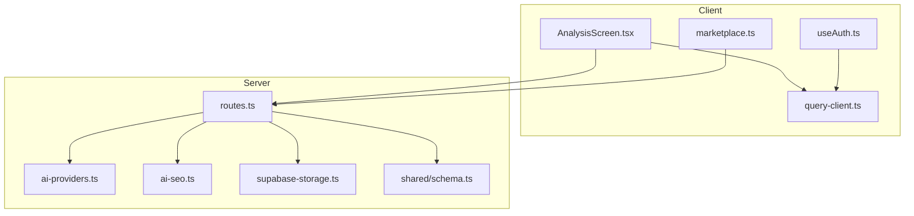
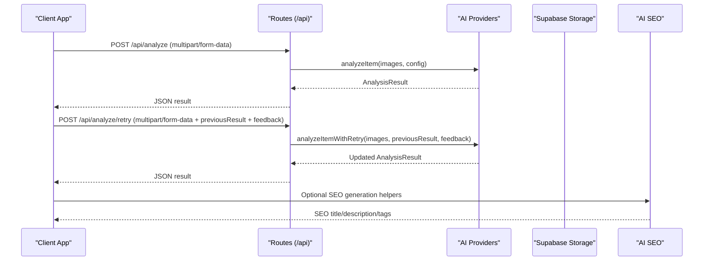
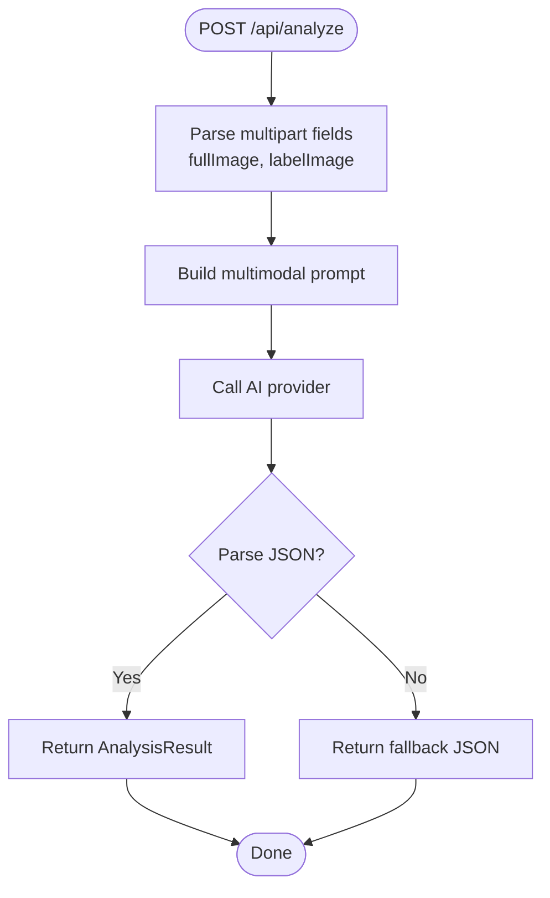
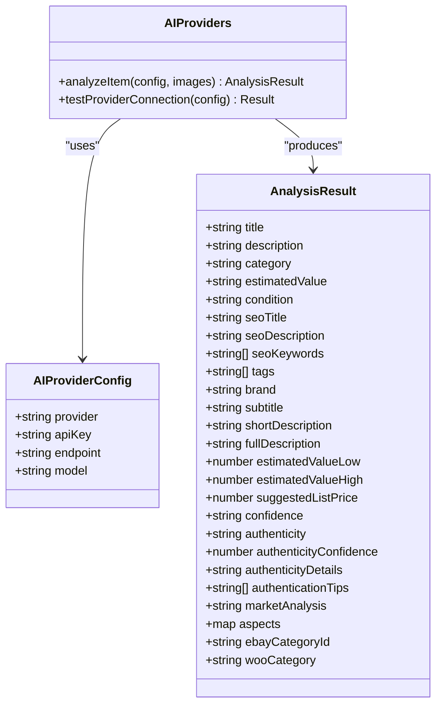
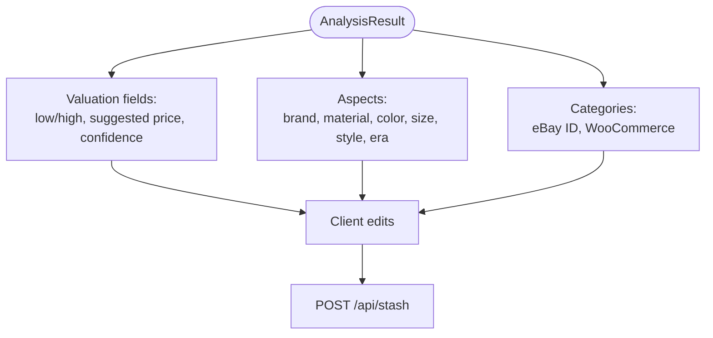
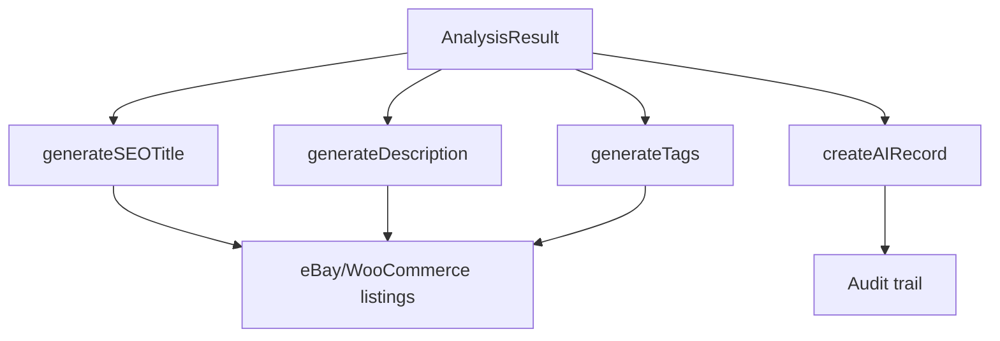
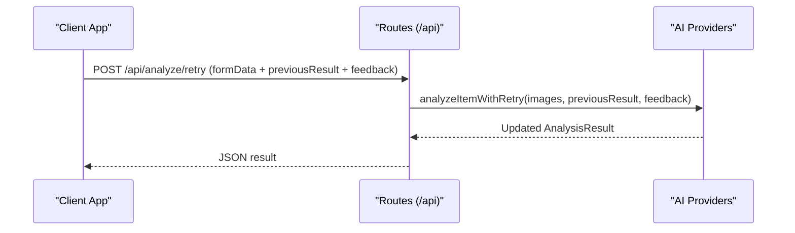
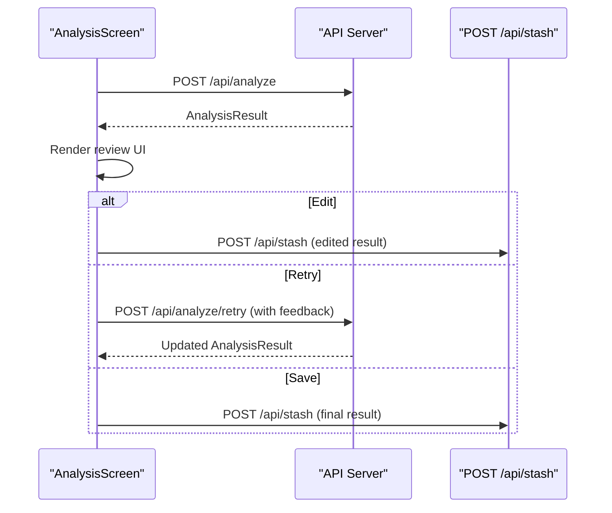
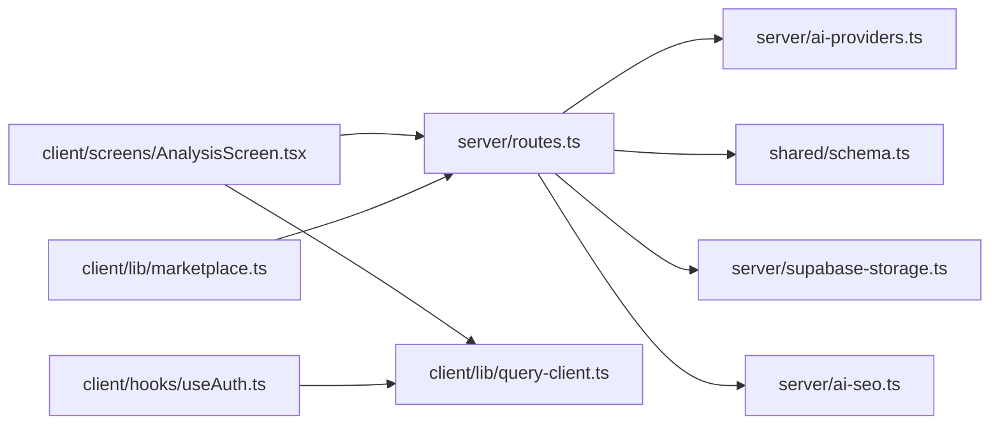

# Analysis Endpoints

<cite>
**Referenced Files in This Document**
- [server/index.ts](file://server/index.ts)
- [server/routes.ts](file://server/routes.ts)
- [server/ai-providers.ts](file://server/ai-providers.ts)
- [server/ai-seo.ts](file://server/ai-seo.ts)
- [server/supabase-storage.ts](file://server/supabase-storage.ts)
- [shared/schema.ts](file://shared/schema.ts)
- [shared/types.ts](file://shared/types.ts)
- [client/screens/AnalysisScreen.tsx](file://client/screens/AnalysisScreen.tsx)
- [client/lib/marketplace.ts](file://client/lib/marketplace.ts)
- [client/lib/query-client.ts](file://client/lib/query-client.ts)
- [client/hooks/useAuth.ts](file://client/hooks/useAuth.ts)
</cite>

## Table of Contents
1. [Introduction](#introduction)
2. [Project Structure](#project-structure)
3. [Core Components](#core-components)
4. [Architecture Overview](#architecture-overview)
5. [Detailed Component Analysis](#detailed-component-analysis)
6. [Dependency Analysis](#dependency-analysis)
7. [Performance Considerations](#performance-considerations)
8. [Troubleshooting Guide](#troubleshooting-guide)
9. [Conclusion](#conclusion)
10. [Appendices](#appendices)

## Introduction
This document describes the item analysis API endpoints that power image-based AI analysis, pricing insights, and SEO optimization. It covers:
- Image upload and processing
- AI analysis orchestration with multiple providers
- Pricing analysis and listing suggestions
- SEO title/description/tag generation
- Retry mechanism with feedback integration
- Client-side workflows and error handling

## Project Structure
The analysis feature spans server-side route handlers, AI provider abstractions, and client-side screens that drive the user experience.

**Diagram sources**
- [client/screens/AnalysisScreen.tsx](file://client/screens/AnalysisScreen.tsx#L111-L143)
- [client/lib/query-client.ts](file://client/lib/query-client.ts#L26-L43)
- [client/lib/marketplace.ts](file://client/lib/marketplace.ts#L81-L128)
- [server/routes.ts](file://server/routes.ts#L299-L385)
- [server/ai-providers.ts](file://server/ai-providers.ts#L380-L396)
- [server/ai-seo.ts](file://server/ai-seo.ts#L17-L74)
- [server/supabase-storage.ts](file://server/supabase-storage.ts#L45-L80)
- [shared/schema.ts](file://shared/schema.ts#L29-L50)

**Section sources**
- [server/routes.ts](file://server/routes.ts#L299-L385)
- [server/ai-providers.ts](file://server/ai-providers.ts#L380-L396)
- [server/ai-seo.ts](file://server/ai-seo.ts#L17-L74)
- [server/supabase-storage.ts](file://server/supabase-storage.ts#L45-L80)
- [shared/schema.ts](file://shared/schema.ts#L29-L50)
- [client/screens/AnalysisScreen.tsx](file://client/screens/AnalysisScreen.tsx#L111-L143)
- [client/lib/query-client.ts](file://client/lib/query-client.ts#L26-L43)
- [client/lib/marketplace.ts](file://client/lib/marketplace.ts#L81-L128)

## Core Components
- Image upload and processing: Multer-backed multipart uploads for full and label images; optional Supabase storage utilities for cloud storage.
- AI analysis orchestration: Unified provider abstraction supporting Gemini, OpenAI, Anthropic, and custom endpoints; robust parsing and fallback handling.
- Pricing analysis and listing suggestions: Enhanced result schema with valuation ranges, suggested list price, and marketplace-specific fields.
- SEO optimization: Functions to generate eBay-compliant titles, formatted descriptions, and SEO tags.
- Retry mechanism with feedback: Re-run analysis with previous result and user feedback to refine outputs.
- Client-side workflow: End-to-end flow from image capture to saved stash item, including retry and edit modes.

**Section sources**
- [server/routes.ts](file://server/routes.ts#L39-L42)
- [server/ai-providers.ts](file://server/ai-providers.ts#L5-L41)
- [server/ai-seo.ts](file://server/ai-seo.ts#L17-L74)
- [server/supabase-storage.ts](file://server/supabase-storage.ts#L45-L80)
- [shared/schema.ts](file://shared/schema.ts#L29-L50)
- [client/screens/AnalysisScreen.tsx](file://client/screens/AnalysisScreen.tsx#L111-L179)

## Architecture Overview
The analysis pipeline integrates client uploads, server route handlers, AI provider adapters, and optional storage and SEO services.

**Diagram sources**
- [server/routes.ts](file://server/routes.ts#L299-L385)
- [server/routes.ts](file://server/routes.ts#L672-L711)
- [server/ai-providers.ts](file://server/ai-providers.ts#L380-L396)
- [server/ai-providers.ts](file://server/ai-providers.ts#L418-L442)
- [server/ai-seo.ts](file://server/ai-seo.ts#L17-L74)

## Detailed Component Analysis

### Image Upload and Processing
- Endpoint: POST /api/analyze
- Multipart fields:
  - fullImage: Full-item image
  - labelImage: Close-up label/tag image
- Limits: Memory-based storage with 10 MB file size limit via multer.
- Processing:
  - Builds a multimodal prompt with embedded images.
  - Calls AI provider to generate structured JSON.
  - On parsing failure, returns a fallback JSON with conservative defaults.

**Diagram sources**
- [server/routes.ts](file://server/routes.ts#L299-L385)

**Section sources**
- [server/routes.ts](file://server/routes.ts#L39-L42)
- [server/routes.ts](file://server/routes.ts#L299-L385)

### AI Analysis Orchestration
- Provider configuration:
  - provider: gemini | openai | anthropic | custom
  - apiKey: provider API key (optional for custom)
  - endpoint: custom endpoint URL (required for custom)
  - model: provider model identifier
- Supported providers:
  - Gemini: uses @google/genai SDK with configurable base URL and model.
  - OpenAI: uses chat/completions with JSON response format.
  - Anthropic: uses messages API with JSON-like content.
  - Custom: generic OpenAI-compatible endpoint with validation.
- Parsing and fallback:
  - Robust JSON parsing with fallback to a comprehensive default result.
  - Merges partial results with defaults for backward compatibility.

**Diagram sources**
- [server/ai-providers.ts](file://server/ai-providers.ts#L5-L41)
- [server/ai-providers.ts](file://server/ai-providers.ts#L380-L396)
- [server/ai-providers.ts](file://server/ai-providers.ts#L604-L695)

**Section sources**
- [server/ai-providers.ts](file://server/ai-providers.ts#L5-L41)
- [server/ai-providers.ts](file://server/ai-providers.ts#L224-L248)
- [server/ai-providers.ts](file://server/ai-providers.ts#L250-L287)
- [server/ai-providers.ts](file://server/ai-providers.ts#L289-L332)
- [server/ai-providers.ts](file://server/ai-providers.ts#L334-L378)
- [server/ai-providers.ts](file://server/ai-providers.ts#L131-L180)
- [server/ai-providers.ts](file://server/ai-providers.ts#L604-L695)

### Pricing Analysis and Listing Suggestions
- Enhanced result fields include:
  - estimatedValueLow/high: numeric valuation range
  - suggestedListPrice: recommended listing price
  - confidence: high | medium | low
  - aspects: key-value pairs for marketplace categorization
  - ebayCategoryId, wooCategory: marketplace-specific categories
- Client-side editing allows manual adjustments to price, condition, descriptions, and specifics.

**Diagram sources**
- [server/ai-providers.ts](file://server/ai-providers.ts#L12-L41)
- [client/screens/AnalysisScreen.tsx](file://client/screens/AnalysisScreen.tsx#L32-L60)
- [client/screens/AnalysisScreen.tsx](file://client/screens/AnalysisScreen.tsx#L181-L191)

**Section sources**
- [server/ai-providers.ts](file://server/ai-providers.ts#L12-L41)
- [client/screens/AnalysisScreen.tsx](file://client/screens/AnalysisScreen.tsx#L32-L60)
- [client/screens/AnalysisScreen.tsx](file://client/screens/AnalysisScreen.tsx#L181-L191)

### SEO Optimization Endpoints
- SEO generation functions:
  - generateSEOTitle: eBay-compliant 80-character title
  - generateDescription: formatted marketplace listing body
  - generateTags: SEO tag array
  - createAIRecord: persist AI generation record to ai_generations table
- Integration with existing schema supports audit trails and analytics.

**Diagram sources**
- [server/ai-seo.ts](file://server/ai-seo.ts#L17-L74)
- [server/ai-seo.ts](file://server/ai-seo.ts#L80-L111)
- [shared/schema.ts](file://shared/schema.ts#L174-L187)

**Section sources**
- [server/ai-seo.ts](file://server/ai-seo.ts#L17-L74)
- [server/ai-seo.ts](file://server/ai-seo.ts#L80-L111)
- [shared/schema.ts](file://shared/schema.ts#L174-L187)

### Retry Mechanism with Feedback Integration
- Endpoint: POST /api/analyze/retry
- Inputs:
  - fullImage, labelImage: optional replacement images
  - previousResult: prior AnalysisResult (stringified or object)
  - feedback: user feedback text
  - provider, apiKey, model: optional override for provider configuration
- Behavior:
  - Constructs a retry prompt incorporating previous result and feedback.
  - Re-runs analysis with the same provider stack.
  - Returns updated AnalysisResult.

**Diagram sources**
- [server/routes.ts](file://server/routes.ts#L672-L711)
- [server/ai-providers.ts](file://server/ai-providers.ts#L418-L442)
- [server/ai-providers.ts](file://server/ai-providers.ts#L444-L602)

**Section sources**
- [server/routes.ts](file://server/routes.ts#L672-L711)
- [server/ai-providers.ts](file://server/ai-providers.ts#L398-L416)
- [server/ai-providers.ts](file://server/ai-providers.ts#L418-L442)

### Client-Side Workflow
- AnalysisScreen orchestrates:
  - Captures fullImage and labelImage URIs
  - Calls POST /api/analyze
  - Presents review/edit/retry/save UI
  - Saves to stash via POST /api/stash
- Uses query-client for API requests and Supabase for authentication.

**Diagram sources**
- [client/screens/AnalysisScreen.tsx](file://client/screens/AnalysisScreen.tsx#L111-L143)
- [client/screens/AnalysisScreen.tsx](file://client/screens/AnalysisScreen.tsx#L145-L179)
- [client/screens/AnalysisScreen.tsx](file://client/screens/AnalysisScreen.tsx#L181-L191)

**Section sources**
- [client/screens/AnalysisScreen.tsx](file://client/screens/AnalysisScreen.tsx#L111-L179)
- [client/screens/AnalysisScreen.tsx](file://client/screens/AnalysisScreen.tsx#L181-L191)
- [client/lib/query-client.ts](file://client/lib/query-client.ts#L26-L43)
- [client/hooks/useAuth.ts](file://client/hooks/useAuth.ts#L12-L38)

## Dependency Analysis
- Route handlers depend on:
  - AI provider abstraction for analysis
  - Supabase storage utilities for optional cloud storage
  - Shared schema for database models
- Client depends on:
  - query-client for API communication
  - Supabase auth for session management
  - marketplace helpers for publishing integrations

**Diagram sources**
- [server/routes.ts](file://server/routes.ts#L1-L30)
- [server/ai-providers.ts](file://server/ai-providers.ts#L1-L10)
- [server/supabase-storage.ts](file://server/supabase-storage.ts#L1-L16)
- [shared/schema.ts](file://shared/schema.ts#L1-L10)
- [client/screens/AnalysisScreen.tsx](file://client/screens/AnalysisScreen.tsx#L24-L26)
- [client/lib/query-client.ts](file://client/lib/query-client.ts#L26-L43)
- [client/lib/marketplace.ts](file://client/lib/marketplace.ts#L81-L128)
- [client/hooks/useAuth.ts](file://client/hooks/useAuth.ts#L12-L38)

**Section sources**
- [server/routes.ts](file://server/routes.ts#L1-L30)
- [server/ai-providers.ts](file://server/ai-providers.ts#L1-L10)
- [server/supabase-storage.ts](file://server/supabase-storage.ts#L1-L16)
- [shared/schema.ts](file://shared/schema.ts#L1-L10)
- [client/screens/AnalysisScreen.tsx](file://client/screens/AnalysisScreen.tsx#L24-L26)
- [client/lib/query-client.ts](file://client/lib/query-client.ts#L26-L43)
- [client/lib/marketplace.ts](file://client/lib/marketplace.ts#L81-L128)
- [client/hooks/useAuth.ts](file://client/hooks/useAuth.ts#L12-L38)

## Performance Considerations
- Image size limits: Multer memory storage with 10 MB per file; consider Supabase storage for larger assets.
- AI provider timeouts: Configure provider clients appropriately; implement retries at the application level where needed.
- JSON parsing: Fallback ensures resilience against provider output inconsistencies.
- Client caching: Use React Query to avoid redundant requests; invalidate queries after stash saves.

[No sources needed since this section provides general guidance]

## Troubleshooting Guide
Common issues and resolutions:
- Validation errors:
  - Missing multipart fields or invalid file types: Ensure both fullImage and labelImage are included and are images under 10 MB.
  - Missing provider configuration: Provide apiKey for OpenAI/Anthropic/custom or appropriate environment variables for Gemini.
- AI parsing failures:
  - Provider returned non-JSON: The server falls back to a default result; verify provider output format or adjust prompts.
- Retry errors:
  - previousResult or feedback missing: Supply both previousResult and feedback for /api/analyze/retry.
- Authentication:
  - Supabase not configured: Ensure EXPO_PUBLIC_SUPABASE_URL and keys are set; client will throw if not configured.
- CORS and logging:
  - Origin handling and request logging are enabled; verify allowed origins and request timing in logs.

**Section sources**
- [server/routes.ts](file://server/routes.ts#L39-L42)
- [server/routes.ts](file://server/routes.ts#L299-L385)
- [server/routes.ts](file://server/routes.ts#L672-L711)
- [server/ai-providers.ts](file://server/ai-providers.ts#L131-L180)
- [client/hooks/useAuth.ts](file://client/hooks/useAuth.ts#L18-L21)
- [server/index.ts](file://server/index.ts#L19-L56)
- [server/index.ts](file://server/index.ts#L70-L101)

## Conclusion
The analysis endpoints provide a robust, extensible pipeline for image-based AI analysis, pricing insights, and SEO optimization. With support for multiple AI providers, a structured result schema, and a feedback-driven retry mechanism, the system enables accurate and actionable item assessments. Client-side integration offers a smooth user experience from capture to saved stash.

[No sources needed since this section summarizes without analyzing specific files]

## Appendices

### API Reference

- POST /api/analyze
  - Purpose: Analyze item images and return structured result.
  - Content-Type: multipart/form-data
  - Fields:
    - fullImage: Full-item image
    - labelImage: Close-up label/tag image
  - Response: AnalysisResult JSON

- POST /api/analyze/retry
  - Purpose: Re-analyze with previous result and user feedback.
  - Content-Type: multipart/form-data
  - Fields:
    - fullImage, labelImage: optional replacement images
    - previousResult: prior AnalysisResult (stringified or object)
    - feedback: user feedback text
    - provider, apiKey, model: optional provider overrides
  - Response: Updated AnalysisResult JSON

- POST /api/stash
  - Purpose: Save analyzed item to stash.
  - Body: Stash item payload including aiAnalysis and image URLs.
  - Response: Saved stash item JSON

- POST /api/stash/:id/publish/woocommerce
  - Purpose: Publish to WooCommerce.
  - Body: { storeUrl, consumerKey, consumerSecret }
  - Response: { success, productUrl? }

- POST /api/stash/:id/publish/ebay
  - Purpose: Publish to eBay.
  - Body: { clientId, clientSecret, refreshToken, environment }
  - Response: { success, listingUrl? }

- POST /api/ai-providers/test
  - Purpose: Test provider connectivity.
  - Body: { provider, apiKey, endpoint, model }
  - Response: { success, message }

**Section sources**
- [server/routes.ts](file://server/routes.ts#L299-L385)
- [server/routes.ts](file://server/routes.ts#L672-L711)
- [server/routes.ts](file://server/routes.ts#L258-L286)
- [server/routes.ts](file://server/routes.ts#L387-L455)
- [server/routes.ts](file://server/routes.ts#L457-L647)
- [server/routes.ts](file://server/routes.ts#L649-L670)

### Request Schemas

- AIProviderConfig
  - provider: gemini | openai | anthropic | custom
  - apiKey: string (required for openai/anthropic/custom)
  - endpoint: string (required for custom)
  - model: string (provider model)

- AnalysisResult
  - Legacy fields: title, description, category, estimatedValue, condition, seoTitle, seoDescription, seoKeywords, tags
  - Enhanced fields: brand, subtitle, shortDescription, fullDescription, estimatedValueLow, estimatedValueHigh, suggestedListPrice, confidence, authenticity, authenticityConfidence, authenticityDetails, authenticationTips, marketAnalysis, aspects, ebayCategoryId, wooCategory

- Stash Item Payload
  - Includes all AnalysisResult fields plus image URLs and aiAnalysis JSON.

**Section sources**
- [server/ai-providers.ts](file://server/ai-providers.ts#L5-L41)
- [server/ai-providers.ts](file://server/ai-providers.ts#L12-L41)
- [shared/schema.ts](file://shared/schema.ts#L29-L50)

### Example Workflows

- Basic Analysis
  - Capture images in client
  - POST /api/analyze with fullImage and labelImage
  - Receive AnalysisResult and render UI
  - Save to stash via POST /api/stash

- Retry with Feedback
  - User identifies issues in the result
  - POST /api/analyze/retry with previousResult and feedback
  - Receive refined AnalysisResult

- Publishing to Marketplaces
  - Retrieve stored credentials via marketplace helpers
  - POST /api/stash/:id/publish/woocommerce or /api/stash/:id/publish/ebay

**Section sources**
- [client/screens/AnalysisScreen.tsx](file://client/screens/AnalysisScreen.tsx#L111-L179)
- [client/lib/marketplace.ts](file://client/lib/marketplace.ts#L81-L128)
- [server/routes.ts](file://server/routes.ts#L299-L385)
- [server/routes.ts](file://server/routes.ts#L672-L711)