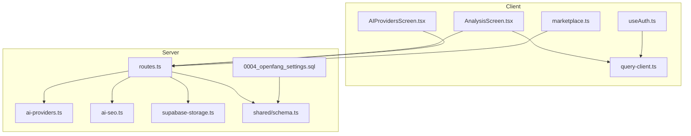
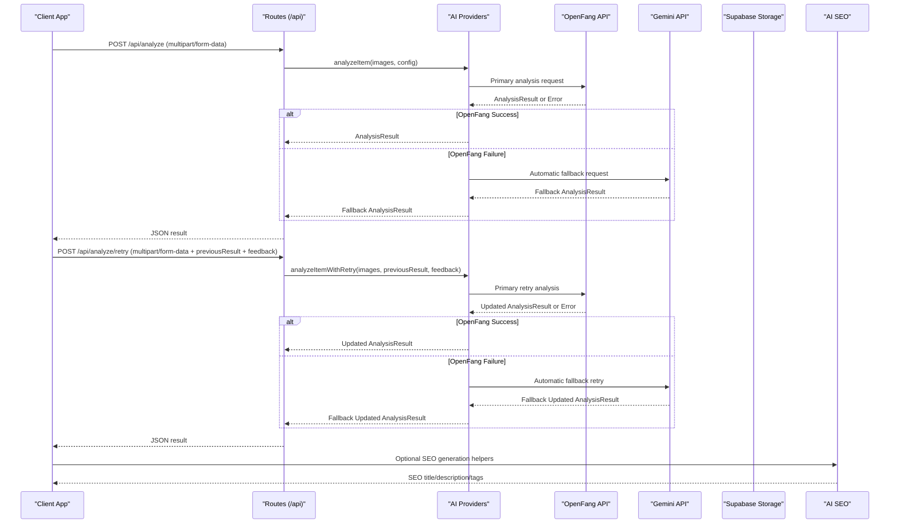
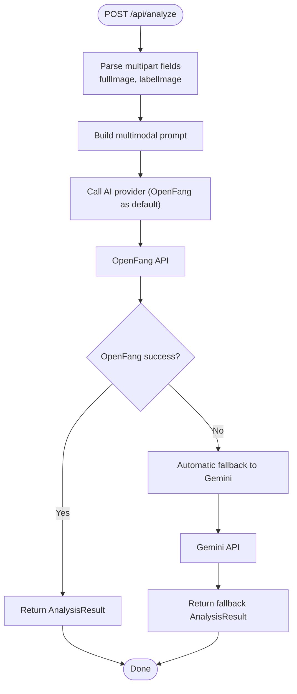
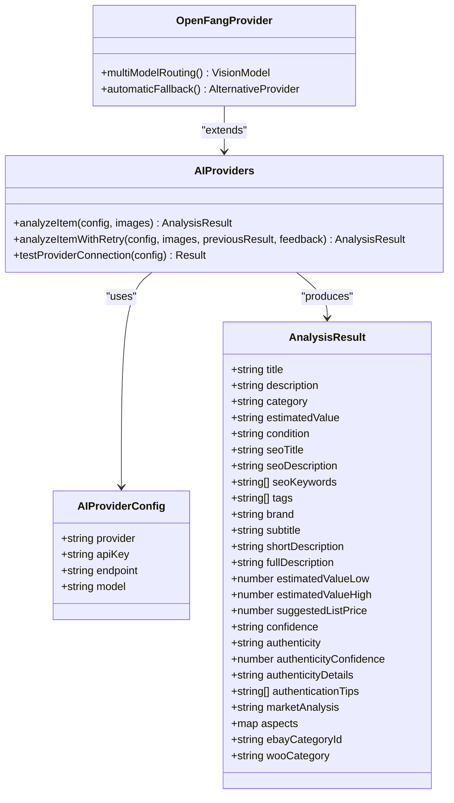
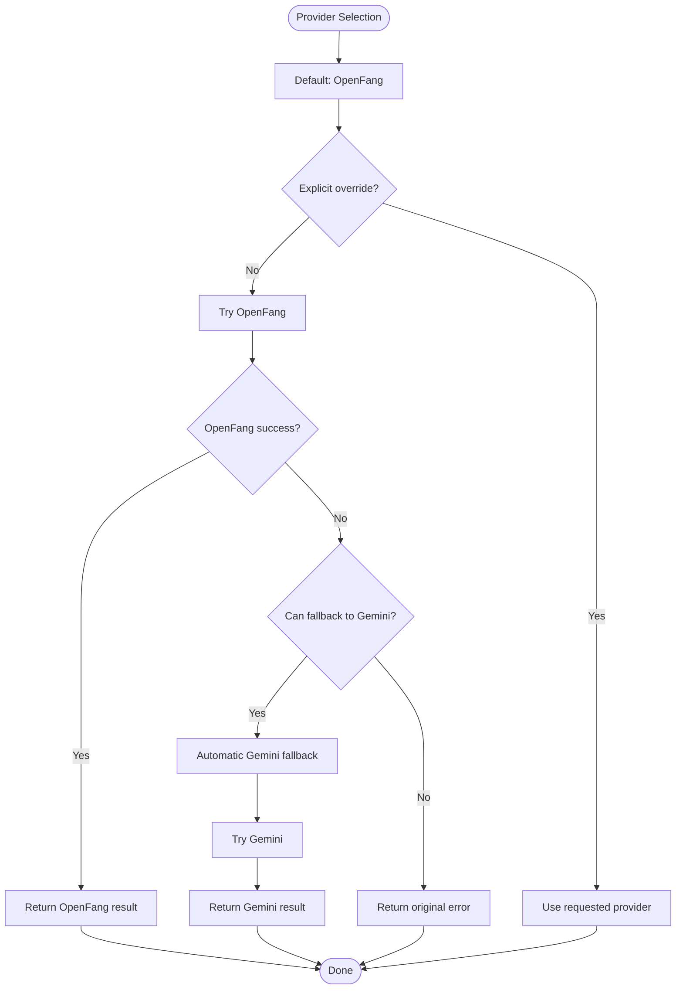
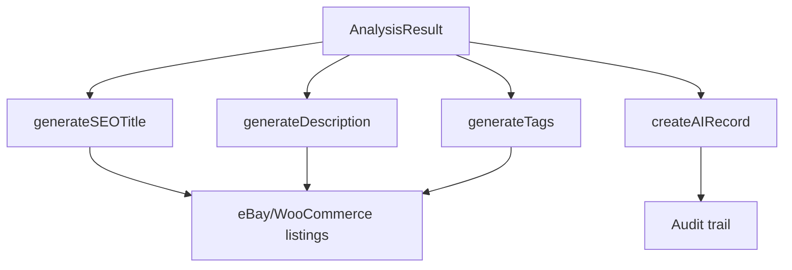
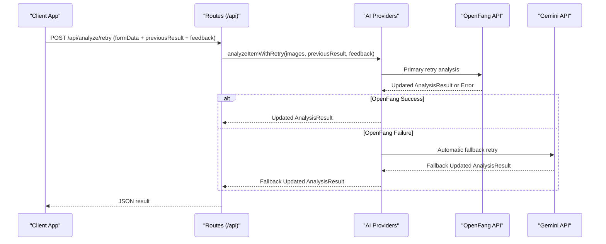
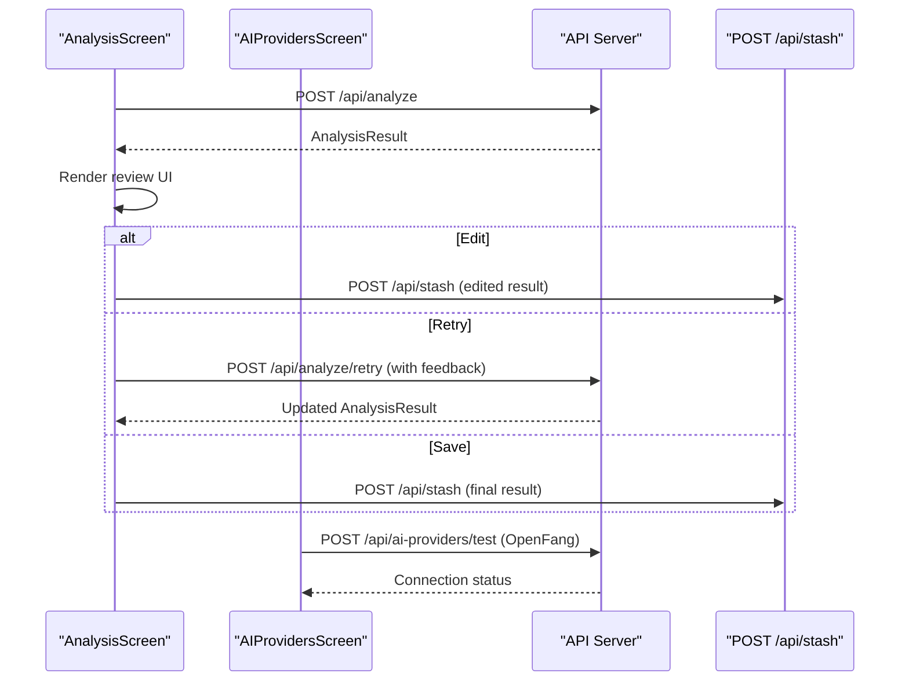
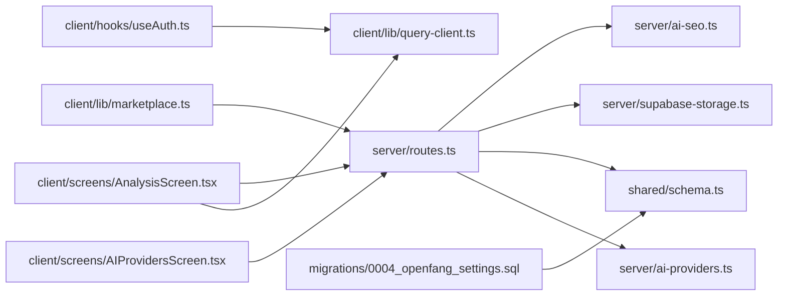

# Analysis Endpoints

<cite>
**Referenced Files in This Document**
- [server/index.ts](file://server/index.ts)
- [server/routes.ts](file://server/routes.ts)
- [server/ai-providers.ts](file://server/ai-providers.ts)
- [server/ai-seo.ts](file://server/ai-seo.ts)
- [server/supabase-storage.ts](file://server/supabase-storage.ts)
- [shared/schema.ts](file://shared/schema.ts)
- [shared/types.ts](file://shared/types.ts)
- [client/screens/AnalysisScreen.tsx](file://client/screens/AnalysisScreen.tsx)
- [client/screens/AIProvidersScreen.tsx](file://client/screens/AIProvidersScreen.tsx)
- [client/lib/marketplace.ts](file://client/lib/marketplace.ts)
- [client/lib/query-client.ts](file://client/lib/query-client.ts)
- [client/hooks/useAuth.ts](file://client/hooks/useAuth.ts)
- [migrations/0004_openfang_settings.sql](file://migrations/0004_openfang_settings.sql)
</cite>

## Update Summary
**Changes Made**
- Added comprehensive OpenFang provider support with intelligent fallback mechanisms
- Enhanced dynamic provider selection with automatic fallback to Gemini
- Updated server-side routing to support OpenFang configuration parameters
- Added OpenFang-specific environment variables and database schema support
- Integrated OpenFang's multi-model AI routing with automatic vision model selection

## Table of Contents
1. [Introduction](#introduction)
2. [Project Structure](#project-structure)
3. [Core Components](#core-components)
4. [Architecture Overview](#architecture-overview)
5. [Detailed Component Analysis](#detailed-component-analysis)
6. [Dependency Analysis](#dependency-analysis)
7. [Performance Considerations](#performance-considerations)
8. [Troubleshooting Guide](#troubleshooting-guide)
9. [Conclusion](#conclusion)
10. [Appendices](#appendices)

## Introduction
This document describes the item analysis API endpoints that power image-based AI analysis, pricing insights, and SEO optimization. It covers:
- Image upload and processing
- AI analysis orchestration with multiple providers including OpenFang
- Intelligent fallback mechanisms with automatic provider switching
- Pricing analysis and listing suggestions
- SEO title/description/tag generation
- Retry mechanism with feedback integration
- Client-side workflows and error handling

**Updated** Enhanced with OpenFang provider support featuring multi-model AI routing and automatic fallback capabilities.

## Project Structure
The analysis feature spans server-side route handlers, AI provider abstractions, and client-side screens that drive the user experience. The system now includes intelligent provider selection with OpenFang as the primary choice and automatic fallback to Gemini.

**Diagram sources**
- [client/screens/AnalysisScreen.tsx:111-143](file://client/screens/AnalysisScreen.tsx#L111-L143)
- [client/screens/AIProvidersScreen.tsx:530-600](file://client/screens/AIProvidersScreen.tsx#L530-L600)
- [client/lib/query-client.ts:26-43](file://client/lib/query-client.ts#L26-L43)
- [client/lib/marketplace.ts:81-128](file://client/lib/marketplace.ts#L81-L128)
- [server/routes.ts:299-385](file://server/routes.ts#L299-L385)
- [server/ai-providers.ts:380-396](file://server/ai-providers.ts#L380-L396)
- [server/ai-seo.ts:17-74](file://server/ai-seo.ts#L17-L74)
- [server/supabase-storage.ts:45-80](file://server/supabase-storage.ts#L45-L80)
- [shared/schema.ts:29-50](file://shared/schema.ts#L29-L50)
- [migrations/0004_openfang_settings.sql:1-4](file://migrations/0004_openfang_settings.sql#L1-L4)

**Section sources**
- [server/routes.ts:299-385](file://server/routes.ts#L299-L385)
- [server/ai-providers.ts:380-396](file://server/ai-providers.ts#L380-L396)
- [server/ai-seo.ts:17-74](file://server/ai-seo.ts#L17-L74)
- [server/supabase-storage.ts:45-80](file://server/supabase-storage.ts#L45-L80)
- [shared/schema.ts:29-50](file://shared/schema.ts#L29-L50)
- [client/screens/AnalysisScreen.tsx:111-143](file://client/screens/AnalysisScreen.tsx#L111-L143)
- [client/screens/AIProvidersScreen.tsx:530-600](file://client/screens/AIProvidersScreen.tsx#L530-L600)
- [client/lib/query-client.ts:26-43](file://client/lib/query-client.ts#L26-L43)
- [client/lib/marketplace.ts:81-128](file://client/lib/marketplace.ts#L81-L128)
- [migrations/0004_openfang_settings.sql:1-4](file://migrations/0004_openfang_settings.sql#L1-L4)

## Core Components
- Image upload and processing: Multer-backed multipart uploads for full and label images; optional Supabase storage utilities for cloud storage.
- AI analysis orchestration: Unified provider abstraction supporting Gemini, OpenAI, Anthropic, OpenFang, and custom endpoints with intelligent fallback mechanisms.
- Intelligent provider selection: OpenFang as default provider with automatic fallback to Gemini when OpenFang is unavailable.
- Multi-model AI routing: OpenFang's advanced routing system with vision model preference and fallback to GPT-4o, Gemini, or Claude.
- Pricing analysis and listing suggestions: Enhanced result schema with valuation ranges, suggested list price, and marketplace-specific fields.
- SEO optimization: Functions to generate eBay-compliant titles, formatted descriptions, and SEO tags.
- Retry mechanism with feedback: Re-run analysis with previous result and user feedback to refine outputs.
- Client-side workflow: End-to-end flow from image capture to saved stash item, including retry and edit modes.

**Updated** Added OpenFang provider with multi-model AI routing and automatic fallback capabilities.

**Section sources**
- [server/routes.ts:39-42](file://server/routes.ts#L39-L42)
- [server/ai-providers.ts:3-10](file://server/ai-providers.ts#L3-L10)
- [server/ai-providers.ts:5-41](file://server/ai-providers.ts#L5-L41)
- [server/ai-seo.ts:17-74](file://server/ai-seo.ts#L17-L74)
- [server/supabase-storage.ts:45-80](file://server/supabase-storage.ts#L45-L80)
- [shared/schema.ts:29-50](file://shared/schema.ts#L29-L50)
- [client/screens/AnalysisScreen.tsx:111-179](file://client/screens/AnalysisScreen.tsx#L111-L179)
- [migrations/0004_openfang_settings.sql:1-4](file://migrations/0004_openfang_settings.sql#L1-L4)

## Architecture Overview
The analysis pipeline integrates client uploads, server route handlers, AI provider adapters, and optional storage and SEO services. The system now features intelligent provider selection with OpenFang as the primary choice and automatic fallback to Gemini.

**Updated** Added intelligent fallback mechanism showing OpenFang-to-Gemini automatic switching.

**Diagram sources**
- [server/routes.ts:299-385](file://server/routes.ts#L299-L385)
- [server/routes.ts:672-711](file://server/routes.ts#L672-L711)
- [server/ai-providers.ts:334-389](file://server/ai-providers.ts#L334-L389)
- [server/ai-providers.ts:418-442](file://server/ai-providers.ts#L418-L442)
- [server/ai-seo.ts:17-74](file://server/ai-seo.ts#L17-L74)

## Detailed Component Analysis

### Image Upload and Processing
- Endpoint: POST /api/analyze
- Multipart fields:
  - fullImage: Full-item image
  - labelImage: Close-up label/tag image
- Limits: Memory-based storage with 10 MB file size limit via multer.
- Processing:
  - Builds a multimodal prompt with embedded images.
  - Calls AI provider to generate structured JSON.
  - On parsing failure, returns a fallback JSON with conservative defaults.

**Updated** Added OpenFang-to-Gemini automatic fallback flow.

**Diagram sources**
- [server/routes.ts:299-385](file://server/routes.ts#L299-L385)
- [server/routes.ts:322-346](file://server/routes.ts#L322-L346)

**Section sources**
- [server/routes.ts:39-42](file://server/routes.ts#L39-L42)
- [server/routes.ts:299-385](file://server/routes.ts#L299-L385)

### AI Analysis Orchestration
- Provider configuration:
  - provider: gemini | openai | anthropic | openfang | custom
  - apiKey: provider API key (optional for custom)
  - endpoint: custom endpoint URL (required for custom)
  - model: provider model identifier
- Supported providers:
  - Gemini: uses @google/genai SDK with configurable base URL and model.
  - OpenAI: uses chat/completions with JSON response format.
  - Anthropic: uses messages API with JSON-like content.
  - OpenFang: multi-model AI routing with vision model preference and fallback to GPT-4o, Gemini, or Claude.
  - Custom: generic OpenAI-compatible endpoint with validation.
- Intelligent fallback:
  - OpenFang as default provider with automatic fallback to Gemini when unavailable.
  - Supports explicit provider override via request parameters.
- Parsing and fallback:
  - Robust JSON parsing with fallback to a comprehensive default result.
  - Merges partial results with defaults for backward compatibility.

**Updated** Added OpenFang provider with multi-model AI routing and intelligent fallback mechanisms.

**Diagram sources**
- [server/ai-providers.ts:3-10](file://server/ai-providers.ts#L3-L10)
- [server/ai-providers.ts:5-41](file://server/ai-providers.ts#L5-L41)
- [server/ai-providers.ts:334-389](file://server/ai-providers.ts#L334-L389)
- [server/ai-providers.ts:618-674](file://server/ai-providers.ts#L618-L674)

**Section sources**
- [server/ai-providers.ts:3-10](file://server/ai-providers.ts#L3-L10)
- [server/ai-providers.ts:5-41](file://server/ai-providers.ts#L5-L41)
- [server/ai-providers.ts:224-248](file://server/ai-providers.ts#L224-L248)
- [server/ai-providers.ts:250-287](file://server/ai-providers.ts#L250-L287)
- [server/ai-providers.ts:289-332](file://server/ai-providers.ts#L289-L332)
- [server/ai-providers.ts:334-389](file://server/ai-providers.ts#L334-L389)
- [server/ai-providers.ts:391-435](file://server/ai-providers.ts#L391-L435)
- [server/ai-providers.ts:131-180](file://server/ai-providers.ts#L131-L180)
- [server/ai-providers.ts:604-695](file://server/ai-providers.ts#L604-L695)

### Intelligent Provider Selection and Fallback
- Default provider: OpenFang with multi-model AI routing
- Automatic fallback: When OpenFang fails or is unavailable, automatically switches to Gemini
- Fallback conditions:
  - Explicit provider override prevents fallback (only OpenFang can trigger fallback)
  - Requested provider is not OpenFang: no automatic fallback
  - OpenFang API error or timeout: triggers Gemini fallback
- Multi-model AI routing:
  - Vision model preference for image analysis
  - Fallback to GPT-4o, Gemini-2.5-flash, or Claude-sonnet-4-20250514
  - Automatic model selection based on image content and provider capabilities

**Updated** New intelligent provider selection and fallback mechanism.

**Diagram sources**
- [server/routes.ts:322-346](file://server/routes.ts#L322-L346)
- [server/routes.ts:774-802](file://server/routes.ts#L774-L802)

**Section sources**
- [server/routes.ts:322-346](file://server/routes.ts#L322-L346)
- [server/routes.ts:774-802](file://server/routes.ts#L774-L802)
- [server/ai-providers.ts:334-389](file://server/ai-providers.ts#L334-L389)

### Pricing Analysis and Listing Suggestions
- Enhanced result fields include:
  - estimatedValueLow/high: numeric valuation range
  - suggestedListPrice: recommended listing price
  - confidence: high | medium | low
  - aspects: key-value pairs for marketplace categorization
  - ebayCategoryId, wooCategory: marketplace-specific categories
- Client-side editing allows manual adjustments to price, condition, descriptions, and specifics.

**Diagram sources**
- [server/ai-providers.ts:12-41](file://server/ai-providers.ts#L12-L41)
- [client/screens/AnalysisScreen.tsx:32-60](file://client/screens/AnalysisScreen.tsx#L32-L60)
- [client/screens/AnalysisScreen.tsx:181-191](file://client/screens/AnalysisScreen.tsx#L181-L191)

**Section sources**
- [server/ai-providers.ts:12-41](file://server/ai-providers.ts#L12-L41)
- [client/screens/AnalysisScreen.tsx:32-60](file://client/screens/AnalysisScreen.tsx#L32-L60)
- [client/screens/AnalysisScreen.tsx:181-191](file://client/screens/AnalysisScreen.tsx#L181-L191)

### SEO Optimization Endpoints
- SEO generation functions:
  - generateSEOTitle: eBay-compliant 80-character title
  - generateDescription: formatted marketplace listing body
  - generateTags: SEO tag array
  - createAIRecord: persist AI generation record to ai_generations table
- Integration with existing schema supports audit trails and analytics.

**Diagram sources**
- [server/ai-seo.ts:17-74](file://server/ai-seo.ts#L17-L74)
- [server/ai-seo.ts:80-111](file://server/ai-seo.ts#L80-L111)
- [shared/schema.ts:174-187](file://shared/schema.ts#L174-L187)

**Section sources**
- [server/ai-seo.ts:17-74](file://server/ai-seo.ts#L17-L74)
- [server/ai-seo.ts:80-111](file://server/ai-seo.ts#L80-L111)
- [shared/schema.ts:174-187](file://shared/schema.ts#L174-L187)

### Retry Mechanism with Feedback Integration
- Endpoint: POST /api/analyze/retry
- Inputs:
  - fullImage, labelImage: optional replacement images
  - previousResult: prior AnalysisResult (stringified or object)
  - feedback: user feedback text
  - provider, apiKey, model: optional override for provider configuration
- Behavior:
  - Constructs a retry prompt incorporating previous result and feedback.
  - Re-runs analysis with the same provider stack including intelligent fallback.
  - Returns updated AnalysisResult.

**Updated** Retry mechanism now includes intelligent provider fallback.

**Updated** Added OpenFang-to-Gemini automatic fallback in retry flow.

**Diagram sources**
- [server/routes.ts:672-711](file://server/routes.ts#L672-L711)
- [server/ai-providers.ts:418-442](file://server/ai-providers.ts#L418-L442)
- [server/ai-providers.ts:444-602](file://server/ai-providers.ts#L444-L602)

**Section sources**
- [server/routes.ts:672-711](file://server/routes.ts#L672-L711)
- [server/ai-providers.ts:398-416](file://server/ai-providers.ts#L398-L416)
- [server/ai-providers.ts:418-442](file://server/ai-providers.ts#L418-L442)

### Client-Side Workflow
- AnalysisScreen orchestrates:
  - Captures fullImage and labelImage URIs
  - Calls POST /api/analyze
  - Presents review/edit/retry/save UI
  - Saves to stash via POST /api/stash
- AIProvidersScreen manages OpenFang configuration:
  - API key management with secure input
  - Base URL configuration for custom OpenFang deployments
  - Model selection with automatic routing option
  - Connection testing for provider validation

**Updated** Added OpenFang configuration management in client.

**Diagram sources**
- [client/screens/AnalysisScreen.tsx:111-143](file://client/screens/AnalysisScreen.tsx#L111-L143)
- [client/screens/AnalysisScreen.tsx:145-179](file://client/screens/AnalysisScreen.tsx#L145-L179)
- [client/screens/AnalysisScreen.tsx:181-191](file://client/screens/AnalysisScreen.tsx#L181-L191)
- [client/screens/AIProvidersScreen.tsx:530-600](file://client/screens/AIProvidersScreen.tsx#L530-L600)

**Section sources**
- [client/screens/AnalysisScreen.tsx:111-179](file://client/screens/AnalysisScreen.tsx#L111-L179)
- [client/screens/AnalysisScreen.tsx:181-191](file://client/screens/AnalysisScreen.tsx#L181-L191)
- [client/screens/AIProvidersScreen.tsx:530-600](file://client/screens/AIProvidersScreen.tsx#L530-L600)
- [client/lib/query-client.ts:26-43](file://client/lib/query-client.ts#L26-L43)
- [client/hooks/useAuth.ts:12-38](file://client/hooks/useAuth.ts#L12-L38)

## Dependency Analysis
- Route handlers depend on:
  - AI provider abstraction for analysis with OpenFang support
  - Supabase storage utilities for optional cloud storage
  - Shared schema for database models
- Client depends on:
  - query-client for API communication
  - Supabase auth for session management
  - marketplace helpers for publishing integrations
  - AIProvidersScreen for OpenFang configuration management

**Updated** Added OpenFang configuration dependency.

**Diagram sources**
- [server/routes.ts:1-30](file://server/routes.ts#L1-L30)
- [server/ai-providers.ts:1-10](file://server/ai-providers.ts#L1-L10)
- [server/supabase-storage.ts:1-16](file://server/supabase-storage.ts#L1-L16)
- [shared/schema.ts:1-10](file://shared/schema.ts#L1-L10)
- [client/screens/AnalysisScreen.tsx:24-26](file://client/screens/AnalysisScreen.tsx#L24-L26)
- [client/screens/AIProvidersScreen.tsx:530-600](file://client/screens/AIProvidersScreen.tsx#L530-L600)
- [client/lib/query-client.ts:26-43](file://client/lib/query-client.ts#L26-L43)
- [client/lib/marketplace.ts:81-128](file://client/lib/marketplace.ts#L81-L128)
- [client/hooks/useAuth.ts:12-38](file://client/hooks/useAuth.ts#L12-L38)
- [migrations/0004_openfang_settings.sql:1-4](file://migrations/0004_openfang_settings.sql#L1-L4)

**Section sources**
- [server/routes.ts:1-30](file://server/routes.ts#L1-L30)
- [server/ai-providers.ts:1-10](file://server/ai-providers.ts#L1-L10)
- [server/supabase-storage.ts:1-16](file://server/supabase-storage.ts#L1-L16)
- [shared/schema.ts:1-10](file://shared/schema.ts#L1-L10)
- [client/screens/AnalysisScreen.tsx:24-26](file://client/screens/AnalysisScreen.tsx#L24-L26)
- [client/screens/AIProvidersScreen.tsx:530-600](file://client/screens/AIProvidersScreen.tsx#L530-L600)
- [client/lib/query-client.ts:26-43](file://client/lib/query-client.ts#L26-L43)
- [client/lib/marketplace.ts:81-128](file://client/lib/marketplace.ts#L81-L128)
- [client/hooks/useAuth.ts:12-38](file://client/hooks/useAuth.ts#L12-L38)
- [migrations/0004_openfang_settings.sql:1-4](file://migrations/0004_openfang_settings.sql#L1-L4)

## Performance Considerations
- Image size limits: Multer memory storage with 10 MB per file; consider Supabase storage for larger assets.
- AI provider timeouts: Configure provider clients appropriately; implement retries at the application level where needed.
- Intelligent fallback: OpenFang-to-Gemini fallback adds minimal latency overhead.
- Multi-model routing: OpenFang's routing system optimizes model selection for different image types.
- JSON parsing: Fallback ensures resilience against provider output inconsistencies.
- Client caching: Use React Query to avoid redundant requests; invalidate queries after stash saves.

**Updated** Added considerations for OpenFang multi-model routing and intelligent fallback performance.

## Troubleshooting Guide
Common issues and resolutions:
- Validation errors:
  - Missing multipart fields or invalid file types: Ensure both fullImage and labelImage are included and are images under 10 MB.
  - Missing provider configuration: Provide apiKey for OpenAI/Anthropic/custom or appropriate environment variables for Gemini/OpenFang.
- AI parsing failures:
  - Provider returned non-JSON: The server falls back to a default result; verify provider output format or adjust prompts.
- Retry errors:
  - previousResult or feedback missing: Supply both previousResult and feedback for /api/analyze/retry.
- Authentication:
  - Supabase not configured: Ensure EXPO_PUBLIC_SUPABASE_URL and keys are set; client will throw if not configured.
- OpenFang configuration:
  - Missing OPENFANG_BASE_URL or OPENFANG_API_KEY: Configure environment variables or use client settings screen.
  - Multi-model routing issues: Ensure OpenFang endpoint supports vision model routing.
- Intelligent fallback:
  - Explicit provider override: When specifying a provider other than OpenFang, automatic fallback is disabled.
  - Gemini fallback failures: Verify Gemini API key and configuration.
- CORS and logging:
  - Origin handling and request logging are enabled; verify allowed origins and request timing in logs.

**Updated** Added OpenFang-specific troubleshooting and intelligent fallback guidance.

**Section sources**
- [server/routes.ts:39-42](file://server/routes.ts#L39-L42)
- [server/routes.ts:299-385](file://server/routes.ts#L299-L385)
- [server/routes.ts:672-711](file://server/routes.ts#L672-L711)
- [server/ai-providers.ts:131-180](file://server/ai-providers.ts#L131-L180)
- [server/ai-providers.ts:334-389](file://server/ai-providers.ts#L334-L389)
- [client/hooks/useAuth.ts:18-21](file://client/hooks/useAuth.ts#L18-L21)
- [server/index.ts:19-56](file://server/index.ts#L19-L56)
- [server/index.ts:70-101](file://server/index.ts#L70-L101)

## Conclusion
The analysis endpoints provide a robust, extensible pipeline for image-based AI analysis, pricing insights, and SEO optimization. With support for multiple AI providers including OpenFang's intelligent multi-model routing, a structured result schema, and a feedback-driven retry mechanism with automatic fallback capabilities, the system enables accurate and actionable item assessments. The intelligent provider selection ensures optimal performance and reliability through automatic fallback to Gemini when OpenFang is unavailable. Client-side integration offers a smooth user experience from capture to saved stash with comprehensive OpenFang configuration management.

**Updated** Enhanced conclusion to reflect OpenFang provider support and intelligent fallback mechanisms.

## Appendices

### API Reference

- POST /api/analyze
  - Purpose: Analyze item images and return structured result with intelligent provider selection.
  - Content-Type: multipart/form-data
  - Fields:
    - fullImage: Full-item image
    - labelImage: Close-up label/tag image
    - provider: gemini | openai | anthropic | openfang | custom (optional)
    - apiKey: provider API key (optional)
    - endpoint: custom endpoint URL (optional)
    - model: provider model (optional)
  - Response: AnalysisResult JSON
  - Behavior: Defaults to OpenFang with automatic Gemini fallback

- POST /api/analyze/retry
  - Purpose: Re-analyze with previous result and user feedback using intelligent provider selection.
  - Content-Type: multipart/form-data
  - Fields:
    - fullImage, labelImage: optional replacement images
    - previousResult: prior AnalysisResult (stringified or object)
    - feedback: user feedback text
    - provider, apiKey, model: optional provider overrides
  - Response: Updated AnalysisResult JSON
  - Behavior: Maintains same provider selection logic as primary endpoint

- POST /api/stash
  - Purpose: Save analyzed item to stash.
  - Body: Stash item payload including aiAnalysis and image URLs.
  - Response: Saved stash item JSON

- POST /api/stash/:id/publish/woocommerce
  - Purpose: Publish to WooCommerce.
  - Body: { storeUrl, consumerKey, consumerSecret }
  - Response: { success, productUrl? }

- POST /api/stash/:id/publish/ebay
  - Purpose: Publish to eBay.
  - Body: { clientId, clientSecret, refreshToken, environment }
  - Response: { success, listingUrl? }

- POST /api/ai-providers/test
  - Purpose: Test provider connectivity including OpenFang.
  - Body: { provider, apiKey, endpoint, model }
  - Response: { success, message }

**Updated** Added OpenFang provider support and intelligent fallback behavior.

**Section sources**
- [server/routes.ts:299-385](file://server/routes.ts#L299-L385)
- [server/routes.ts:672-711](file://server/routes.ts#L672-L711)
- [server/routes.ts:258-286](file://server/routes.ts#L258-L286)
- [server/routes.ts:387-455](file://server/routes.ts#L387-L455)
- [server/routes.ts:457-647](file://server/routes.ts#L457-L647)
- [server/routes.ts:649-670](file://server/routes.ts#L649-L670)

### Request Schemas

- AIProviderConfig
  - provider: gemini | openai | anthropic | openfang | custom
  - apiKey: string (required for openai/anthropic/custom/openfang)
  - endpoint: string (required for custom, optional for openfang)
  - model: string (provider model, optional)

- AnalysisResult
  - Legacy fields: title, description, category, estimatedValue, condition, seoTitle, seoDescription, seoKeywords, tags
  - Enhanced fields: brand, subtitle, shortDescription, fullDescription, estimatedValueLow, estimatedValueHigh, suggestedListPrice, confidence, authenticity, authenticityConfidence, authenticityDetails, authenticationTips, marketAnalysis, aspects, ebayCategoryId, wooCategory

- Stash Item Payload
  - Includes all AnalysisResult fields plus image URLs and aiAnalysis JSON.

**Updated** Added OpenFang provider type and enhanced field descriptions.

**Section sources**
- [server/ai-providers.ts:3-10](file://server/ai-providers.ts#L3-L10)
- [server/ai-providers.ts:12-41](file://server/ai-providers.ts#L12-L41)
- [shared/schema.ts:29-50](file://shared/schema.ts#L29-L50)

### Example Workflows

- Basic Analysis with Intelligent Fallback
  - Capture images in client
  - POST /api/analyze with fullImage and labelImage (no provider specified)
  - Server attempts OpenFang analysis, automatically falls back to Gemini if unavailable
  - Receive AnalysisResult and render UI
  - Save to stash via POST /api/stash

- Retry with Feedback and Provider Override
  - User identifies issues in the result
  - POST /api/analyze/retry with previousResult, feedback, and explicit provider override
  - Server respects override and does not attempt automatic fallback
  - Receive refined AnalysisResult

- Publishing to Marketplaces
  - Retrieve stored credentials via marketplace helpers
  - POST /api/stash/:id/publish/woocommerce or /api/stash/:id/publish/ebay

- OpenFang Configuration Management
  - Navigate to AIProvidersScreen
  - Enter OpenFang API key and base URL
  - Test connection to validate configuration
  - Save settings for automatic provider selection

**Updated** Added OpenFang configuration and intelligent fallback workflow examples.

**Section sources**
- [client/screens/AnalysisScreen.tsx:111-179](file://client/screens/AnalysisScreen.tsx#L111-L179)
- [client/screens/AIProvidersScreen.tsx:530-600](file://client/screens/AIProvidersScreen.tsx#L530-L600)
- [client/lib/marketplace.ts:81-128](file://client/lib/marketplace.ts#L81-L128)
- [server/routes.ts:299-385](file://server/routes.ts#L299-L385)
- [server/routes.ts:672-711](file://server/routes.ts#L672-L711)

### OpenFang Configuration Parameters

- Environment Variables:
  - OPENFANG_BASE_URL: OpenFang API base URL (default: "")
  - OPENFANG_API_KEY: OpenFang API key (required for OpenFang provider)
  - AI_INTEGRATIONS_GEMINI_API_KEY: Gemini API key (for fallback)
  - AI_INTEGRATIONS_GEMINI_BASE_URL: Gemini base URL (for fallback)

- Database Schema:
  - user_settings.openfang_api_key: User-specific OpenFang API key
  - user_settings.openfang_base_url: User-specific OpenFang base URL
  - user_settings.preferred_openfang_model: User's preferred OpenFang model

- Multi-Model AI Routing:
  - Vision model preference for image analysis
  - Automatic fallback to GPT-4o, Gemini-2.5-flash, or Claude-sonnet-4-20250514
  - Dynamic model selection based on image content and provider capabilities

**Updated** New section documenting OpenFang-specific configuration and routing capabilities.

**Section sources**
- [migrations/0004_openfang_settings.sql:1-4](file://migrations/0004_openfang_settings.sql#L1-L4)
- [server/ai-providers.ts:334-389](file://server/ai-providers.ts#L334-L389)
- [server/ai-providers.ts:618-674](file://server/ai-providers.ts#L618-L674)
- [client/screens/AIProvidersScreen.tsx:530-600](file://client/screens/AIProvidersScreen.tsx#L530-L600)