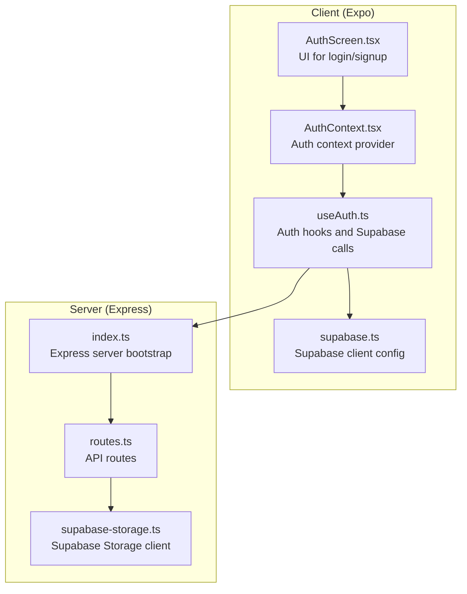
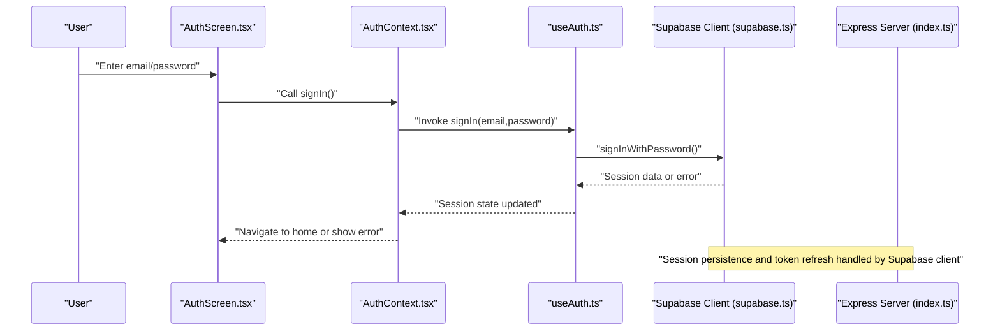
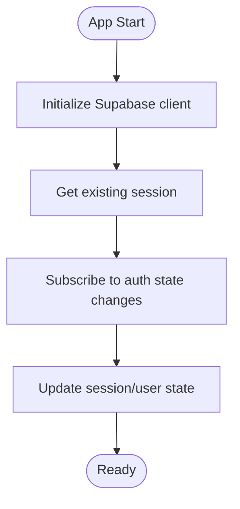
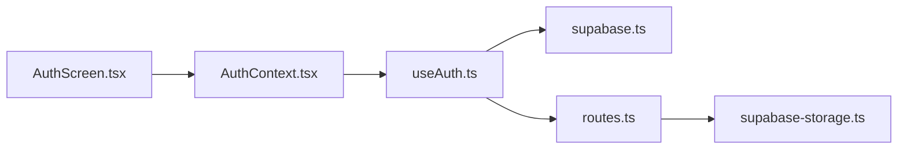

# Authentication Endpoints

<cite>
**Referenced Files in This Document**
- [supabase.ts](file://client/lib/supabase.ts)
- [useAuth.ts](file://client/hooks/useAuth.ts)
- [AuthContext.tsx](file://client/contexts/AuthContext.tsx)
- [AuthScreen.tsx](file://client/screens/AuthScreen.tsx)
- [index.ts](file://server/index.ts)
- [routes.ts](file://server/routes.ts)
- [ENVIRONMENT.md](file://ENVIRONMENT.md)
- [supabase-storage.ts](file://server/supabase-storage.ts)
</cite>

## Table of Contents
1. [Introduction](#introduction)
2. [Project Structure](#project-structure)
3. [Core Components](#core-components)
4. [Architecture Overview](#architecture-overview)
5. [Detailed Component Analysis](#detailed-component-analysis)
6. [Dependency Analysis](#dependency-analysis)
7. [Performance Considerations](#performance-considerations)
8. [Troubleshooting Guide](#troubleshooting-guide)
9. [Conclusion](#conclusion)

## Introduction
This document provides comprehensive documentation for authentication endpoints and flows in the application. It covers:
- Login and logout endpoints
- Session management
- User registration and email verification
- Password reset and account verification flows
- Supabase integration patterns
- Session validation mechanisms
- Request/response schemas, authentication headers, token management, and security considerations
- Examples of successful authentication flows and error handling patterns

## Project Structure
Authentication spans the client (React Native Expo) and server (Express) layers:
- Client-side Supabase configuration and hooks manage authentication state, sessions, and OAuth flows
- Server-side routes expose API endpoints for product management, notifications, eBay/WooCommerce integrations, and Supabase storage
- Environment variables define Supabase credentials and other integrations

**Diagram sources**
- [AuthScreen.tsx](file://client/screens/AuthScreen.tsx#L1-L435)
- [AuthContext.tsx](file://client/contexts/AuthContext.tsx#L1-L31)
- [useAuth.ts](file://client/hooks/useAuth.ts#L1-L151)
- [supabase.ts](file://client/lib/supabase.ts#L1-L39)
- [index.ts](file://server/index.ts#L1-L262)
- [routes.ts](file://server/routes.ts#L1-L929)
- [supabase-storage.ts](file://server/supabase-storage.ts#L1-L93)

**Section sources**
- [supabase.ts](file://client/lib/supabase.ts#L1-L39)
- [useAuth.ts](file://client/hooks/useAuth.ts#L1-L151)
- [AuthContext.tsx](file://client/contexts/AuthContext.tsx#L1-L31)
- [AuthScreen.tsx](file://client/screens/AuthScreen.tsx#L1-L435)
- [index.ts](file://server/index.ts#L1-L262)
- [routes.ts](file://server/routes.ts#L1-L929)
- [ENVIRONMENT.md](file://ENVIRONMENT.md#L1-L219)
- [supabase-storage.ts](file://server/supabase-storage.ts#L1-L93)

## Core Components
- Supabase client configuration with automatic session persistence and token refresh
- Auth hooks encapsulating login, signup, logout, and Google OAuth flows
- Auth context exposing session state and authentication actions
- Auth screen orchestrating user input and invoking auth actions
- Server routes for product management, notifications, eBay/WooCommerce integrations, and Supabase storage

Key responsibilities:
- Client: Manage local session state, subscribe to auth state changes, and perform OAuth redirects
- Server: Expose APIs for product CRUD, notifications, eBay/WooCommerce operations, and image storage

**Section sources**
- [supabase.ts](file://client/lib/supabase.ts#L1-L39)
- [useAuth.ts](file://client/hooks/useAuth.ts#L1-L151)
- [AuthContext.tsx](file://client/contexts/AuthContext.tsx#L1-L31)
- [AuthScreen.tsx](file://client/screens/AuthScreen.tsx#L1-L435)
- [routes.ts](file://server/routes.ts#L1-L929)

## Architecture Overview
The authentication architecture integrates Supabase Auth on the client and leverages Supabase Storage on the server for media operations. The server also exposes endpoints for product management and integrations.

**Diagram sources**
- [AuthScreen.tsx](file://client/screens/AuthScreen.tsx#L25-L58)
- [AuthContext.tsx](file://client/contexts/AuthContext.tsx#L19-L30)
- [useAuth.ts](file://client/hooks/useAuth.ts#L40-L50)
- [supabase.ts](file://client/lib/supabase.ts#L20-L34)
- [index.ts](file://server/index.ts#L227-L261)

## Detailed Component Analysis

### Supabase Client Configuration
The Supabase client is initialized with environment variables for URL and anonymous key. It configures:
- Storage persistence for non-web platforms
- Automatic token refresh
- Session persistence
- Redirect detection for web OAuth

Security considerations:
- Environment variables must be set for client initialization
- Tokens are persisted securely on native platforms

**Section sources**
- [supabase.ts](file://client/lib/supabase.ts#L6-L39)
- [ENVIRONMENT.md](file://ENVIRONMENT.md#L23-L32)

### Auth Hooks and Session Management
The auth hooks provide:
- Initial session retrieval and subscription to auth state changes
- Sign-in with email/password
- Sign-up with email/password
- Sign-out
- Google OAuth with browser redirect and code exchange

OAuth flow specifics:
- Web: Direct OAuth redirect with Supabase
- Native: Non-browser OAuth with manual code extraction and session setting

Session validation:
- Subscribes to auth state changes to keep UI in sync
- Persists session across app restarts

**Section sources**
- [useAuth.ts](file://client/hooks/useAuth.ts#L17-L38)
- [useAuth.ts](file://client/hooks/useAuth.ts#L40-L50)
- [useAuth.ts](file://client/hooks/useAuth.ts#L52-L62)
- [useAuth.ts](file://client/hooks/useAuth.ts#L64-L70)
- [useAuth.ts](file://client/hooks/useAuth.ts#L72-L137)

### Auth Context Provider
The auth context exposes:
- Current session and user
- Loading state
- Authentication actions (signIn, signUp, signOut, signInWithGoogle)
- Authentication status and configuration status

Usage:
- Wrapped around app UI to provide auth state to components

**Section sources**
- [AuthContext.tsx](file://client/contexts/AuthContext.tsx#L5-L15)
- [AuthContext.tsx](file://client/contexts/AuthContext.tsx#L19-L30)

### Authentication UI (Auth Screen)
The auth screen:
- Captures email and password
- Toggles between sign-in and sign-up modes
- Displays success/error messages
- Triggers auth actions and updates UI state

Behavior:
- Validates input before calling auth actions
- Shows loading indicators during network calls
- Provides haptic feedback on native platforms

**Section sources**
- [AuthScreen.tsx](file://client/screens/AuthScreen.tsx#L25-L58)
- [AuthScreen.tsx](file://client/screens/AuthScreen.tsx#L60-L79)

### Server Routes and Supabase Storage Integration
The server exposes:
- Product CRUD endpoints
- Notification endpoints
- eBay and WooCommerce publishing endpoints
- Supabase Storage image upload and deletion

Supabase Storage integration:
- Uploads images to a Supabase Storage bucket
- Generates public URLs and base64 representations
- Enforces MIME type and size validation

**Section sources**
- [routes.ts](file://server/routes.ts#L719-L799)
- [routes.ts](file://server/routes.ts#L803-L836)
- [supabase-storage.ts](file://server/supabase-storage.ts#L45-L80)

### Authentication Endpoints

#### Login
- Endpoint: POST /api/login (conceptual; actual client-side call)
- Description: Authenticates a user with email and password
- Client behavior:
  - Calls sign-in hook
  - Updates session state on success
  - Displays error messages on failure

Request
- Body: { email: string, password: string }

Response (successful)
- Body: { session: Session, user: User }

Response (error)
- Body: { error: string }

Notes
- Session is persisted automatically by Supabase client
- Auth state change subscription keeps UI synchronized

**Section sources**
- [useAuth.ts](file://client/hooks/useAuth.ts#L40-L50)
- [AuthScreen.tsx](file://client/screens/AuthScreen.tsx#L25-L58)

#### Logout
- Endpoint: POST /api/logout (conceptual; actual client-side call)
- Description: Logs out the current user and clears session
- Client behavior:
  - Calls sign-out hook
  - Clears local session state

Response (successful)
- Body: { message: "Logged out" }

Response (error)
- Body: { error: string }

**Section sources**
- [useAuth.ts](file://client/hooks/useAuth.ts#L64-L70)

#### Registration and Email Verification
- Endpoint: POST /api/register (conceptual; actual client-side call)
- Description: Registers a new user; verifies email via Supabase
- Client behavior:
  - Calls sign-up hook
  - Shows success message prompting email verification

Request
- Body: { email: string, password: string }

Response (successful)
- Body: { message: "Check your email for a verification link!" }

Response (error)
- Body: { error: string }

Notes
- Supabase handles email verification flow
- UI displays success message after sign-up

**Section sources**
- [useAuth.ts](file://client/hooks/useAuth.ts#L52-L62)
- [AuthScreen.tsx](file://client/screens/AuthScreen.tsx#L36-L47)

#### Password Reset and Account Verification
- Password reset flow:
  - Supabase Auth supports password reset via magic link
  - Client triggers reset request; user receives email with reset link
  - User follows link to reset password

- Account verification:
  - Supabase sends a confirmation email upon sign-up
  - User clicks confirmation link to verify account

Security considerations:
- Links are single-use and time-limited
- Client does not handle sensitive password reset logic directly

**Section sources**
- [useAuth.ts](file://client/hooks/useAuth.ts#L40-L50)
- [ENVIRONMENT.md](file://ENVIRONMENT.md#L23-L32)

#### Google OAuth
- Endpoint: GET /oauth (conceptual; actual client-side call)
- Description: Initiates Google OAuth flow
- Client behavior:
  - Web: Direct OAuth redirect
  - Native: Opens external browser, extracts authorization code, exchanges for session

Request
- Query: { provider: "google", redirectTo: string }

Response (successful)
- Body: { url: string } (web) or { success: true } (native after exchange)

Response (error)
- Body: { error: string }

**Section sources**
- [useAuth.ts](file://client/hooks/useAuth.ts#L72-L137)

### Session Management and Validation
Session lifecycle:
- Initialization: Retrieves existing session and subscribes to auth state changes
- Persistence: Automatically persists session across app restarts
- Refresh: Auto-refreshes tokens when near expiration
- Validation: UI reflects current session state

**Diagram sources**
- [useAuth.ts](file://client/hooks/useAuth.ts#L17-L38)
- [supabase.ts](file://client/lib/supabase.ts#L20-L34)

**Section sources**
- [useAuth.ts](file://client/hooks/useAuth.ts#L17-L38)
- [supabase.ts](file://client/lib/supabase.ts#L20-L34)

### Supabase Integration Patterns
- Client-side:
  - Centralized client creation with environment variables
  - Automatic session persistence and refresh
  - OAuth redirect handling for web and native

- Server-side:
  - Supabase Storage client creation with service role key
  - Image upload with MIME validation and size limits
  - Public URL generation and base64 encoding

**Section sources**
- [supabase.ts](file://client/lib/supabase.ts#L6-L39)
- [supabase-storage.ts](file://server/supabase-storage.ts#L20-L39)
- [supabase-storage.ts](file://server/supabase-storage.ts#L45-L80)

## Dependency Analysis
Authentication depends on:
- Supabase client for auth operations and session management
- Environment variables for Supabase credentials
- Server routes for integrations (e.g., storage, eBay/WooCommerce)

**Diagram sources**
- [AuthScreen.tsx](file://client/screens/AuthScreen.tsx#L1-L435)
- [AuthContext.tsx](file://client/contexts/AuthContext.tsx#L1-L31)
- [useAuth.ts](file://client/hooks/useAuth.ts#L1-L151)
- [supabase.ts](file://client/lib/supabase.ts#L1-L39)
- [routes.ts](file://server/routes.ts#L1-L929)
- [supabase-storage.ts](file://server/supabase-storage.ts#L1-L93)

**Section sources**
- [useAuth.ts](file://client/hooks/useAuth.ts#L1-L151)
- [supabase.ts](file://client/lib/supabase.ts#L1-L39)
- [routes.ts](file://server/routes.ts#L1-L929)
- [supabase-storage.ts](file://server/supabase-storage.ts#L1-L93)

## Performance Considerations
- Session persistence reduces redundant sign-ins
- Auto-refresh minimizes token expiration impact
- Image uploads validated on server to prevent oversized or invalid files
- Server logging helps monitor authentication-related latency

## Troubleshooting Guide
Common issues and resolutions:
- Supabase credentials missing:
  - Ensure environment variables are set for client and server
- OAuth failures:
  - Verify redirect URLs and browser session completion on native
- Session not persisting:
  - Confirm storage configuration for non-web platforms
- Server storage errors:
  - Check bucket permissions and service role key

**Section sources**
- [ENVIRONMENT.md](file://ENVIRONMENT.md#L186-L189)
- [supabase-storage.ts](file://server/supabase-storage.ts#L32-L39)
- [useAuth.ts](file://client/hooks/useAuth.ts#L7-L10)

## Conclusion
The authentication system leverages Supabase Auth for robust user management, session persistence, and OAuth flows. The client provides a seamless login/signup experience with real-time session updates, while the server offers integrations for product management and media storage. Proper environment configuration and error handling ensure a secure and reliable authentication experience.