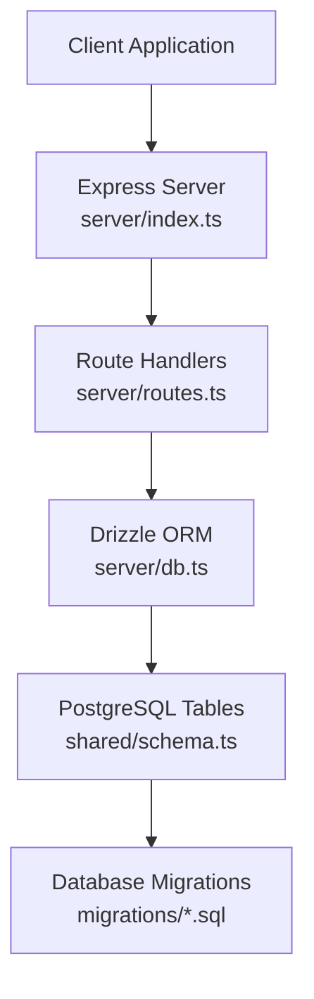
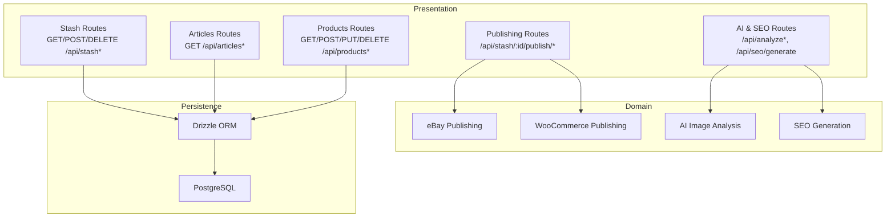
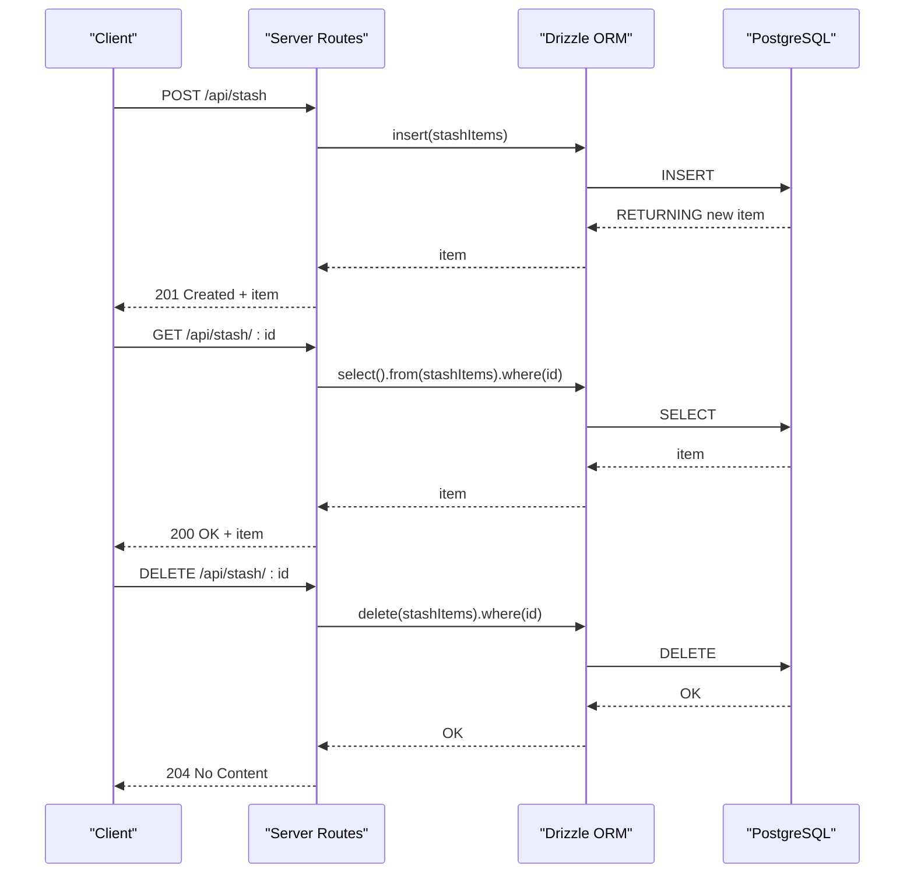
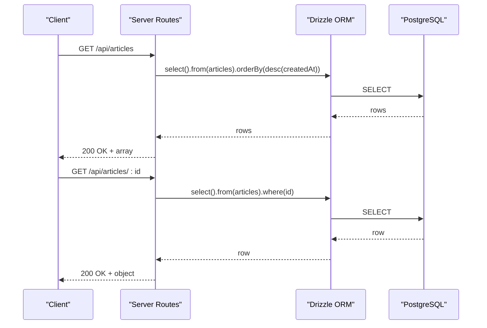
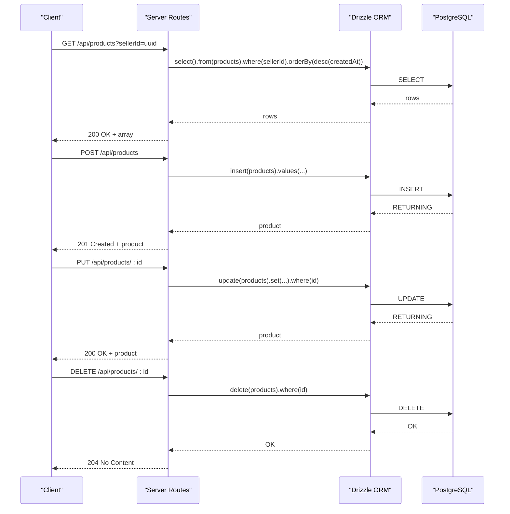
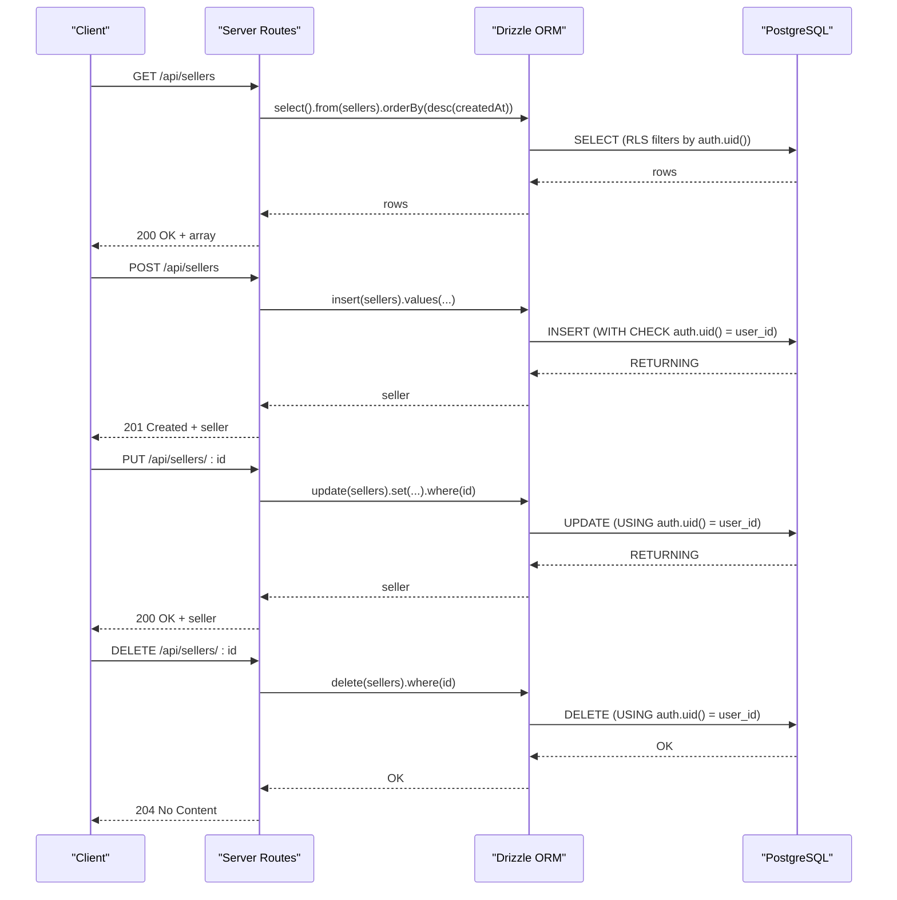
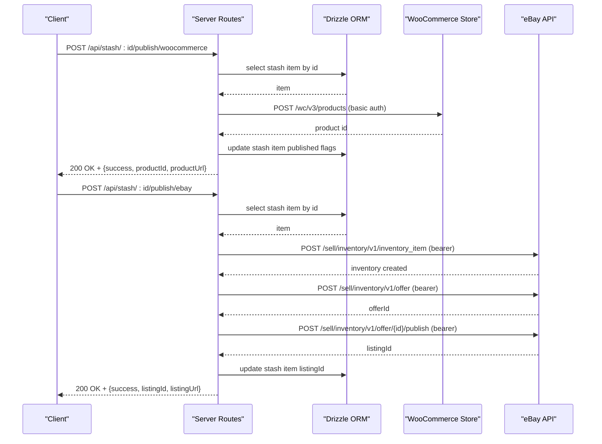
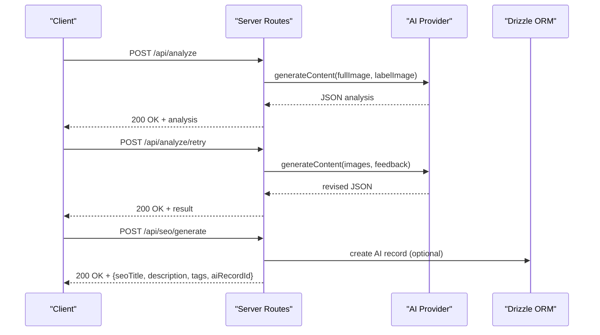
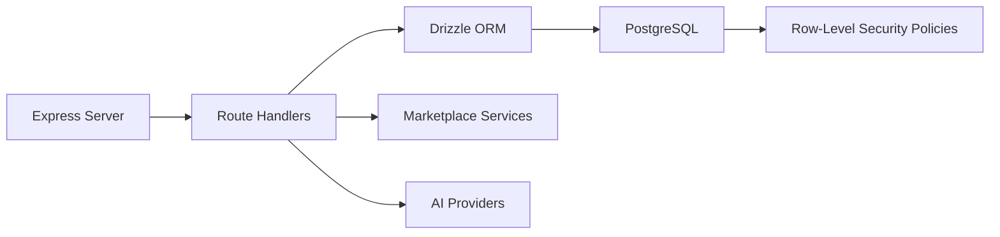

# Data Management Endpoints

<cite>
**Referenced Files in This Document**
- [server/index.ts](file://server/index.ts)
- [server/routes.ts](file://server/routes.ts)
- [server/db.ts](file://server/db.ts)
- [shared/schema.ts](file://shared/schema.ts)
- [migrations/0001_flipagent_tables.sql](file://migrations/0001_flipagent_tables.sql)
- [migrations/0002_rls_policies.sql](file://migrations/0002_rls_policies.sql)
</cite>

## Table of Contents
1. [Introduction](#introduction)
2. [Project Structure](#project-structure)
3. [Core Components](#core-components)
4. [Architecture Overview](#architecture-overview)
5. [Detailed Component Analysis](#detailed-component-analysis)
6. [Dependency Analysis](#dependency-analysis)
7. [Performance Considerations](#performance-considerations)
8. [Troubleshooting Guide](#troubleshooting-guide)
9. [Conclusion](#conclusion)

## Introduction
This document provides comprehensive documentation for the data management API endpoints that handle CRUD operations for stash items, articles, products, and sellers. It covers request/response schemas, validation rules, filtering and pagination patterns, error handling, and the complete data lifecycle from creation to deletion. Authorization and row-level security (RLS) policies are also documented to ensure secure access to resources.

## Project Structure
The data management APIs are implemented in the server-side routes and backed by a PostgreSQL database accessed via Drizzle ORM. Shared schema definitions define the canonical data models used across server and client.

**Diagram sources**
- [server/index.ts](file://server/index.ts#L1-L262)
- [server/routes.ts](file://server/routes.ts#L1-L929)
- [server/db.ts](file://server/db.ts#L1-L19)
- [shared/schema.ts](file://shared/schema.ts#L1-L344)
- [migrations/0001_flipagent_tables.sql](file://migrations/0001_flipagent_tables.sql#L1-L117)
- [migrations/0002_rls_policies.sql](file://migrations/0002_rls_policies.sql#L1-L66)

**Section sources**
- [server/index.ts](file://server/index.ts#L1-L262)
- [server/routes.ts](file://server/routes.ts#L1-L929)
- [server/db.ts](file://server/db.ts#L1-L19)
- [shared/schema.ts](file://shared/schema.ts#L1-L344)
- [migrations/0001_flipagent_tables.sql](file://migrations/0001_flipagent_tables.sql#L1-L117)
- [migrations/0002_rls_policies.sql](file://migrations/0002_rls_policies.sql#L1-L66)

## Core Components
- Express server bootstrap and middleware setup for CORS, body parsing, logging, and error handling.
- Route handlers for stash items, articles, products, sellers, and marketplace integrations.
- Drizzle ORM configuration connecting to PostgreSQL using DATABASE_URL.
- Shared schema definitions for stash items, articles, sellers, products, listings, integrations, and related entities.
- Database migrations defining table structures and indexes.
- Row-level security policies ensuring data isolation per authenticated user.

**Section sources**
- [server/index.ts](file://server/index.ts#L1-L262)
- [server/routes.ts](file://server/routes.ts#L1-L929)
- [server/db.ts](file://server/db.ts#L1-L19)
- [shared/schema.ts](file://shared/schema.ts#L1-L344)
- [migrations/0001_flipagent_tables.sql](file://migrations/0001_flipagent_tables.sql#L1-L117)
- [migrations/0002_rls_policies.sql](file://migrations/0002_rls_policies.sql#L1-L66)

## Architecture Overview
The API follows a layered architecture:
- Presentation layer: Express routes
- Domain layer: Business logic for publishing to marketplaces and AI analysis
- Persistence layer: Drizzle ORM queries against PostgreSQL
- Security layer: Supabase Auth-based RLS policies enforced at the database level

**Diagram sources**
- [server/routes.ts](file://server/routes.ts#L184-L297)
- [server/routes.ts](file://server/routes.ts#L387-L455)
- [server/routes.ts](file://server/routes.ts#L457-L647)
- [server/routes.ts](file://server/routes.ts#L299-L385)
- [server/routes.ts](file://server/routes.ts#L840-L859)
- [server/db.ts](file://server/db.ts#L1-L19)

## Detailed Component Analysis

### Stash Items API
Stash items represent collected/vintage items with optional AI analysis and SEO metadata. CRUD endpoints support listing, filtering by user, and publishing to marketplaces.

- Base URL: `/api/stash`
- Supported endpoints:
  - GET `/api/stash` – List all stash items ordered by creation date
  - GET `/api/stash/count` – Get total stash item count
  - GET `/api/stash/:id` – Retrieve a specific stash item by ID
  - POST `/api/stash` – Create a new stash item
  - DELETE `/api/stash/:id` – Delete a stash item by ID

Request/Response Schemas
- Request body for POST `/api/stash`:
  - Fields: userId, title, description, category, estimatedValue, condition, tags, fullImageUrl, labelImageUrl, aiAnalysis, seoTitle, seoDescription, seoKeywords
  - Validation: Required fields include title; additional fields are optional
- Response body for successful POST/GET: Full stash item object including computed timestamps
- Response body for GET `/api/stash/count`: `{ count: number }`
- Error responses: 400 for invalid parameters, 404 for not found, 500 for internal errors

Filtering and Pagination
- Filtering: No query parameters supported for filtering; use client-side filtering after retrieving lists
- Pagination: Not implemented; use LIMIT/OFFSET at the client or extend routes to support query parameters

Authorization and Security
- Authorization: Not enforced in route handlers; rely on external auth middleware
- Data ownership: Not enforced at the database level for stash items in the provided routes

Example Workflows
- Create stash item:
  - POST `/api/stash` with item details
  - On success: receive newly created stash item with 201 status
- Publish to marketplace:
  - POST `/api/stash/:id/publish/ebay` or `/api/stash/:id/publish/woocommerce` with credentials
  - On success: receive listing identifiers and URLs
- Delete stash item:
  - DELETE `/api/stash/:id`
  - On success: 204 No Content

**Diagram sources**
- [server/routes.ts](file://server/routes.ts#L258-L297)
- [server/routes.ts](file://server/routes.ts#L216-L256)
- [server/db.ts](file://server/db.ts#L1-L19)

**Section sources**
- [server/routes.ts](file://server/routes.ts#L216-L297)
- [shared/schema.ts](file://shared/schema.ts#L29-L50)

### Articles API
Articles provide informational content with optional excerpts and featured flags.

- Base URL: `/api/articles`
- Supported endpoints:
  - GET `/api/articles` – List all articles ordered by creation date
  - GET `/api/articles/:id` – Retrieve a specific article by ID

Request/Response Schemas
- Response body for GET `/api/articles`: Array of article objects
- Response body for GET `/api/articles/:id`: Single article object
- Error responses: 404 for not found, 500 for internal errors

Filtering and Pagination
- Filtering: None supported
- Pagination: Not implemented

Authorization and Security
- Authorization: Not enforced in route handlers
- Data ownership: Not enforced at the database level

**Diagram sources**
- [server/routes.ts](file://server/routes.ts#L184-L214)
- [server/db.ts](file://server/db.ts#L1-L19)

**Section sources**
- [server/routes.ts](file://server/routes.ts#L184-L214)
- [shared/schema.ts](file://shared/schema.ts#L52-L62)

### Products API (FlipAgent)
Products represent inventory items with SKU, pricing, and marketplace listings. CRUD endpoints support filtering by seller.

- Base URL: `/api/products`
- Supported endpoints:
  - GET `/api/products` – List products optionally filtered by sellerId
  - GET `/api/products/:id` – Retrieve a specific product by ID
  - POST `/api/products` – Create a new product
  - PUT `/api/products/:id` – Update an existing product
  - DELETE `/api/products/:id` – Delete a product by ID

Request/Response Schemas
- Request body for POST `/api/products`:
  - Fields: sellerId, sku, title, description, brand, styleName, category, condition, price, cost, estimatedProfit, images, attributes, tags
  - Validation: Required fields include sellerId, sku, title
- Request body for PUT `/api/products/:id`: Partial updates allowed
- Response body for successful operations: Full product object including computed timestamps
- Error responses: 404 for not found, 500 for internal errors

Filtering and Pagination
- Filtering: Query parameter sellerId supported for GET `/api/products`
- Pagination: Not implemented

Authorization and Security
- Authorization: Enforced via RLS policies; operations are restricted to the authenticated user’s seller records
- Ownership: RLS ensures users can only access their own sellers’ products

**Diagram sources**
- [server/routes.ts](file://server/routes.ts#L719-L800)
- [server/db.ts](file://server/db.ts#L1-L19)
- [migrations/0002_rls_policies.sql](file://migrations/0002_rls_policies.sql#L21-L29)

**Section sources**
- [server/routes.ts](file://server/routes.ts#L719-L800)
- [shared/schema.ts](file://shared/schema.ts#L128-L151)
- [migrations/0001_flipagent_tables.sql](file://migrations/0001_flipagent_tables.sql#L18-L40)
- [migrations/0002_rls_policies.sql](file://migrations/0002_rls_policies.sql#L21-L29)

### Sellers API (FlipAgent)
Sellers define shop profiles linked to authenticated users. CRUD operations are governed by RLS policies.

- Base URL: `/api/sellers`
- Supported endpoints:
  - GET `/api/sellers` – List sellers (filtered by authenticated user via RLS)
  - GET `/api/sellers/:id` – Retrieve a specific seller by ID
  - POST `/api/sellers` – Create a new seller profile
  - PUT `/api/sellers/:id` – Update an existing seller
  - DELETE `/api/sellers/:id` – Delete a seller by ID

Request/Response Schemas
- Request body for POST `/api/sellers`:
  - Fields: userId, shopName, shopDescription, avatarUrl, stripeCustomerId, subscriptionTier, subscriptionExpiresAt
  - Validation: Required fields include userId, shopName
- Request body for PUT `/api/sellers/:id`: Partial updates allowed
- Response body for successful operations: Full seller object including computed timestamps
- Error responses: 404 for not found, 500 for internal errors

Authorization and Security
- Authorization: Enforced via RLS policies; operations are restricted to the authenticated user’s seller records
- Ownership: RLS ensures users can only access their own sellers

**Diagram sources**
- [server/routes.ts](file://server/routes.ts#L1-L929)
- [server/db.ts](file://server/db.ts#L1-L19)
- [migrations/0002_rls_policies.sql](file://migrations/0002_rls_policies.sql#L13-L19)

**Section sources**
- [shared/schema.ts](file://shared/schema.ts#L115-L126)
- [migrations/0001_flipagent_tables.sql](file://migrations/0001_flipagent_tables.sql#L5-L16)
- [migrations/0002_rls_policies.sql](file://migrations/0002_rls_policies.sql#L13-L19)

### Marketplace Publishing APIs
Publish stash items to WooCommerce or eBay with credential-based authentication and marketplace-specific payloads.

- Base URL: `/api/stash/:id/publish/woocommerce`
  - Method: POST
  - Body: storeUrl, consumerKey, consumerSecret
  - Behavior: Creates a product on WooCommerce and updates stash item with published flag and product ID
  - Responses: 200 with success and product URL; 400/500 on errors

- Base URL: `/api/stash/:id/publish/ebay`
  - Method: POST
  - Body: clientId, clientSecret, refreshToken, environment, merchantLocationKey
  - Behavior: Creates eBay inventory item and offer, publishes listing, updates stash item with listing ID
  - Responses: 200 with listing info and URL; 400/500 on errors

Validation Rules
- Required credentials must be present
- Item must exist and not already published to the target marketplace
- eBay requires business policies configured before listing

**Diagram sources**
- [server/routes.ts](file://server/routes.ts#L387-L455)
- [server/routes.ts](file://server/routes.ts#L457-L647)
- [server/db.ts](file://server/db.ts#L1-L19)

**Section sources**
- [server/routes.ts](file://server/routes.ts#L387-L455)
- [server/routes.ts](file://server/routes.ts#L457-L647)

### AI Analysis and SEO Generation APIs
- Base URL: `/api/analyze`
  - Method: POST
  - Body: multipart/form-data with fullImage and labelImage
  - Behavior: Sends images to AI provider and returns structured analysis
  - Responses: 200 with analysis JSON; 500 on errors

- Base URL: `/api/analyze/retry`
  - Method: POST
  - Body: previousResult, feedback, provider, apiKey, model, plus optional images
  - Behavior: Retries analysis with feedback
  - Responses: 200 with revised result; 500 on errors

- Base URL: `/api/seo/generate`
  - Method: POST
  - Body: analysis, sellerId, productId, imageUrl
  - Behavior: Generates SEO title, description, and tags; optionally creates AI record
  - Responses: 200 with generated SEO data; 500 on errors

Validation Rules
- Required fields: images for analyze, previousResult and feedback for retry, analysis for SEO
- Optional: provider, apiKey, model for retry

**Diagram sources**
- [server/routes.ts](file://server/routes.ts#L299-L385)
- [server/routes.ts](file://server/routes.ts#L672-L711)
- [server/routes.ts](file://server/routes.ts#L840-L859)

**Section sources**
- [server/routes.ts](file://server/routes.ts#L299-L385)
- [server/routes.ts](file://server/routes.ts#L672-L711)
- [server/routes.ts](file://server/routes.ts#L840-L859)

## Dependency Analysis
The API depends on:
- Express for HTTP routing and middleware
- Drizzle ORM for database queries
- PostgreSQL for persistence
- Supabase Auth for user identity and RLS enforcement
- External services for marketplace publishing and AI analysis

**Diagram sources**
- [server/index.ts](file://server/index.ts#L1-L262)
- [server/routes.ts](file://server/routes.ts#L1-L929)
- [server/db.ts](file://server/db.ts#L1-L19)
- [migrations/0002_rls_policies.sql](file://migrations/0002_rls_policies.sql#L1-L66)

**Section sources**
- [server/index.ts](file://server/index.ts#L1-L262)
- [server/routes.ts](file://server/routes.ts#L1-L929)
- [server/db.ts](file://server/db.ts#L1-L19)
- [migrations/0002_rls_policies.sql](file://migrations/0002_rls_policies.sql#L1-L66)

## Performance Considerations
- Indexes: The migrations define indexes on frequently queried columns (e.g., products seller_id, listings seller_id/marketplace). Ensure these remain aligned with query patterns.
- Query patterns: Routes order results by createdAt descending; consider adding LIMIT/OFFSET for large datasets.
- Image handling: Supabase storage replaces local Multer uploads for persistent images; leverage this to reduce local storage overhead.
- Async operations: Publishing to marketplaces and AI analysis are external calls; consider implementing retry mechanisms and timeouts.

[No sources needed since this section provides general guidance]

## Troubleshooting Guide
Common issues and resolutions:
- Authentication failures:
  - Ensure requests include valid Supabase Auth headers for RLS-protected endpoints.
  - Verify user_id matches the seller’s user_id for product and listing operations.
- Marketplace publishing errors:
  - eBay: Confirm business policies are configured in Seller Hub; ensure environment and refresh token are valid.
  - WooCommerce: Validate store URL and credentials; confirm API endpoints are reachable.
- Internal server errors:
  - Check server logs for detailed error messages.
  - Validate request bodies against schema requirements.
- CORS issues:
  - Confirm allowed origins and headers are configured in the server setup.

**Section sources**
- [server/index.ts](file://server/index.ts#L19-L56)
- [server/routes.ts](file://server/routes.ts#L457-L647)
- [server/routes.ts](file://server/routes.ts#L387-L455)

## Conclusion
The data management API provides robust CRUD capabilities for stash items, articles, products, and sellers, with marketplace publishing and AI-driven workflows. Security is enforced via Supabase Auth and RLS policies, ensuring data isolation per authenticated user. Extending endpoints with filtering, pagination, and stricter validation will further improve usability and reliability.