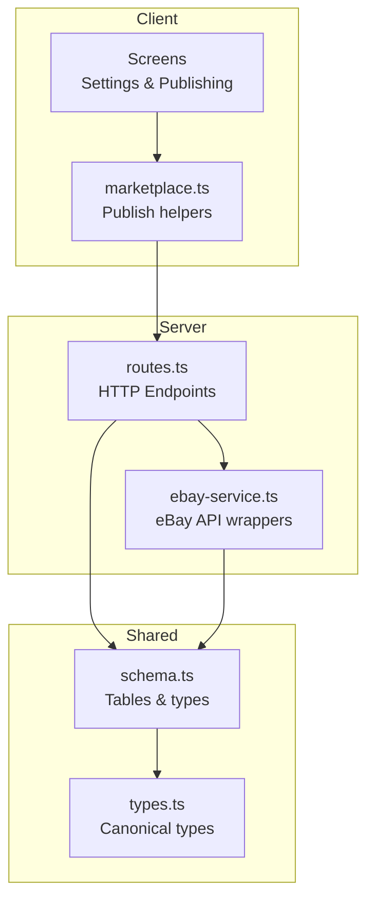
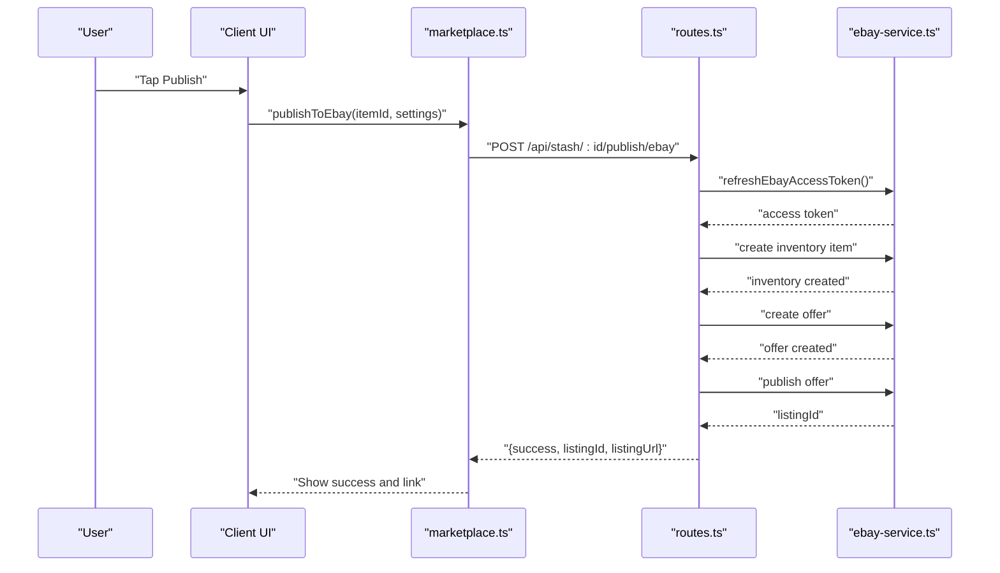
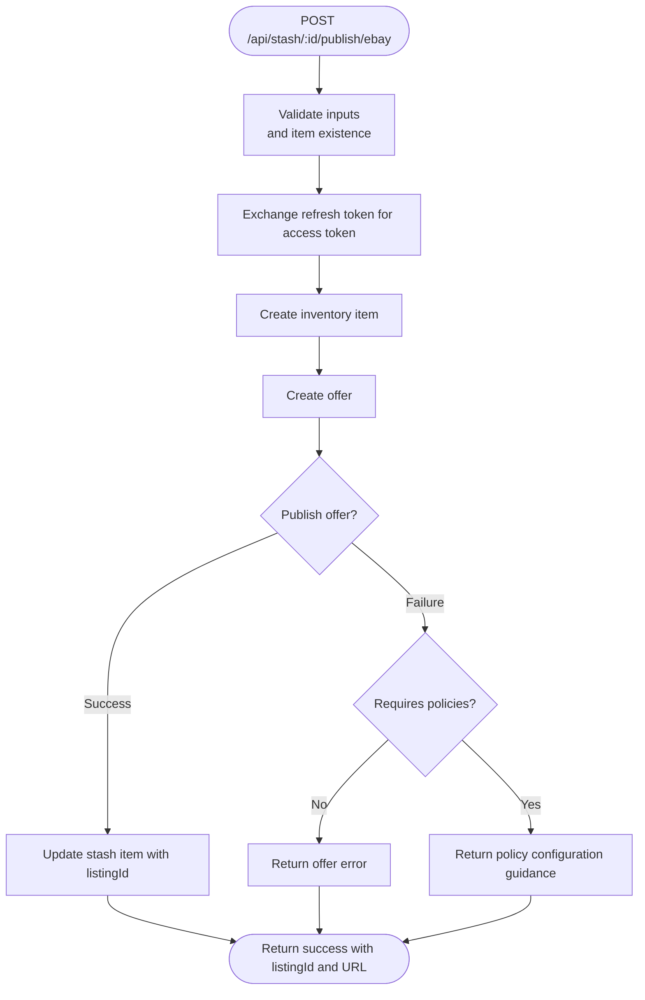
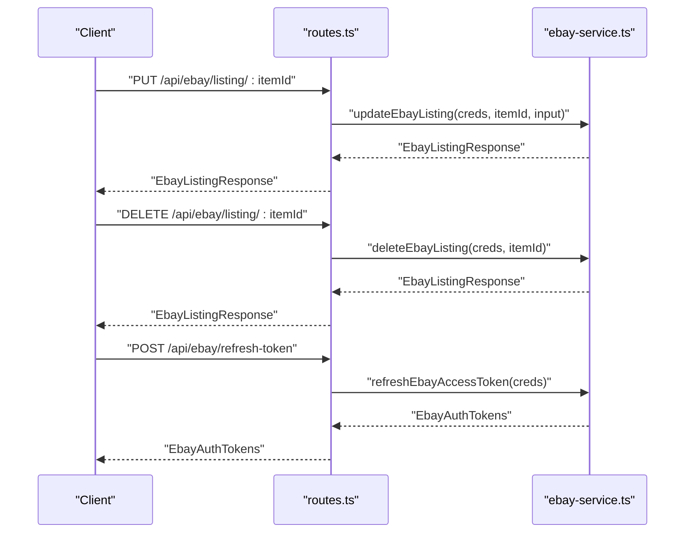
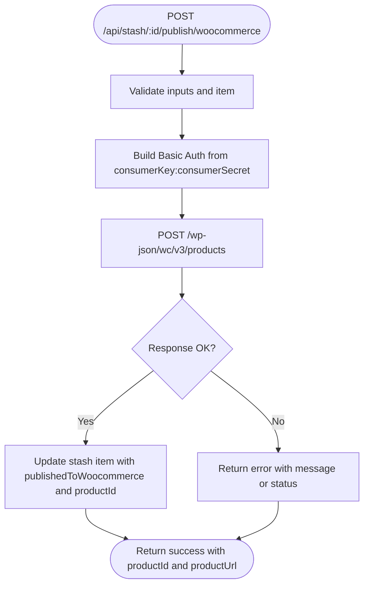
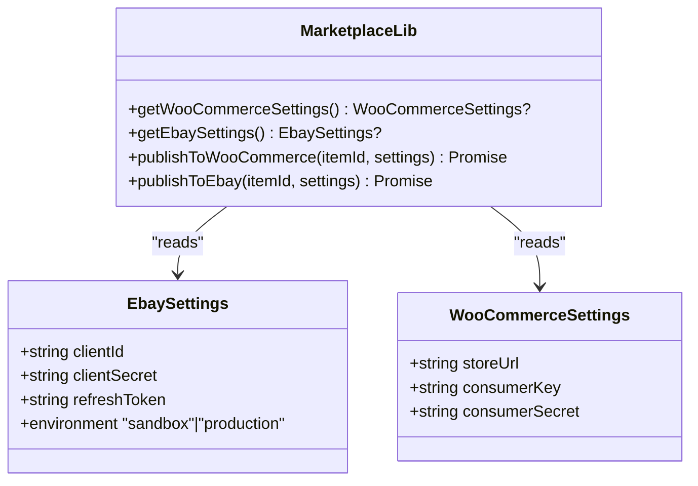
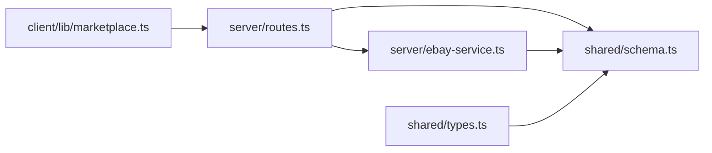

# Marketplace Endpoints

<cite>
**Referenced Files in This Document**
- [routes.ts](file://server/routes.ts)
- [ebay-service.ts](file://server/ebay-service.ts)
- [marketplace.ts](file://client/lib/marketplace.ts)
- [EbaySettingsScreen.tsx](file://client/screens/EbaySettingsScreen.tsx)
- [WooCommerceSettingsScreen.tsx](file://client/screens/WooCommerceSettingsScreen.tsx)
- [schema.ts](file://shared/schema.ts)
- [types.ts](file://shared/types.ts)
- [ebay_settings_flow.yml](file://.maestro/ebay_settings_flow.yml)
- [woocommerce_settings_flow.yml](file://.maestro/woocommerce_settings_flow.yml)
</cite>

## Table of Contents
1. [Introduction](#introduction)
2. [Project Structure](#project-structure)
3. [Core Components](#core-components)
4. [Architecture Overview](#architecture-overview)
5. [Detailed Component Analysis](#detailed-component-analysis)
6. [Dependency Analysis](#dependency-analysis)
7. [Performance Considerations](#performance-considerations)
8. [Troubleshooting Guide](#troubleshooting-guide)
9. [Conclusion](#conclusion)

## Introduction
This document describes the marketplace integration endpoints for eBay and WooCommerce, covering product publishing, listing management, and API credential handling. It also documents the complete publishing pipeline from item analysis to marketplace listing creation, along with OAuth flows, request/response schemas, and error handling patterns.

## Project Structure
The marketplace integration spans three layers:
- Server-side routes expose endpoints for publishing to eBay and WooCommerce, listing management, and token refresh.
- Client-side libraries manage secure credential storage and publish requests.
- Shared schema and types define data models for marketplace operations.

**Diagram sources**
- [routes.ts](file://server/routes.ts#L44-L929)
- [ebay-service.ts](file://server/ebay-service.ts#L1-L474)
- [marketplace.ts](file://client/lib/marketplace.ts#L1-L129)
- [schema.ts](file://shared/schema.ts#L1-L344)
- [types.ts](file://shared/types.ts#L1-L116)

**Section sources**
- [routes.ts](file://server/routes.ts#L44-L929)
- [ebay-service.ts](file://server/ebay-service.ts#L1-L474)
- [marketplace.ts](file://client/lib/marketplace.ts#L1-L129)
- [schema.ts](file://shared/schema.ts#L1-L344)
- [types.ts](file://shared/types.ts#L1-L116)

## Core Components
- eBay publishing and listing management endpoints:
  - Publish stash item to eBay
  - Update eBay listing
  - Delete eBay listing
  - Refresh eBay access token
- WooCommerce publishing endpoint:
  - Publish stash item to WooCommerce
- Credential management:
  - Client-side secure storage for credentials
  - Settings screens for configuration and testing

**Section sources**
- [routes.ts](file://server/routes.ts#L457-L647)
- [routes.ts](file://server/routes.ts#L863-L906)
- [marketplace.ts](file://client/lib/marketplace.ts#L19-L129)
- [EbaySettingsScreen.tsx](file://client/screens/EbaySettingsScreen.tsx#L75-L150)
- [WooCommerceSettingsScreen.tsx](file://client/screens/WooCommerceSettingsScreen.tsx#L68-L146)

## Architecture Overview
The publishing pipeline:
1. User captures item images and optionally a label.
2. The app analyzes the item and generates SEO-optimized content.
3. The user selects a marketplace (e.g., eBay or WooCommerce).
4. The client retrieves stored credentials and invokes the appropriate server endpoint.
5. The server validates inputs, authenticates with the marketplace API, and performs the requested operation.
6. The server updates local state and returns a structured response.

**Diagram sources**
- [routes.ts](file://server/routes.ts#L457-L647)
- [ebay-service.ts](file://server/ebay-service.ts#L329-L364)
- [marketplace.ts](file://client/lib/marketplace.ts#L105-L128)

## Detailed Component Analysis

### eBay Publishing Endpoint
- Endpoint: POST /api/stash/:id/publish/ebay
- Purpose: Create an eBay listing from a stash item using OAuth refresh flow.
- Request body:
  - clientId, clientSecret: OAuth credentials
  - refreshToken: User OAuth refresh token
  - environment: "sandbox" or "production"
  - merchantLocationKey: Optional location key for inventory placement
- Behavior:
  - Validates inputs and item existence.
  - Exchanges refresh token for access token.
  - Creates inventory item and offer, then publishes the offer.
  - Updates stash item with listing identifiers.
- Response:
  - On success: { success, listingId, listingUrl, message }
  - On policy errors: Guidance to configure eBay business policies.
  - On API errors: Structured error with message.

**Diagram sources**
- [routes.ts](file://server/routes.ts#L457-L647)

**Section sources**
- [routes.ts](file://server/routes.ts#L457-L647)

### eBay Listing Management Endpoints
- Update listing: PUT /api/ebay/listing/:itemId
  - Body: { clientId, clientSecret, refreshToken, environment, ...input }
  - Returns canonical listing response with status and URL.
- Delete listing: DELETE /api/ebay/listing/:itemId
  - Body: { clientId, clientSecret, refreshToken, environment }
  - Returns success or error.
- Refresh token: POST /api/ebay/refresh-token
  - Body: { clientId, clientSecret, refreshToken, environment }
  - Returns { accessToken, refreshToken, expiresAt }.

**Diagram sources**
- [routes.ts](file://server/routes.ts#L863-L906)
- [ebay-service.ts](file://server/ebay-service.ts#L386-L473)
- [ebay-service.ts](file://server/ebay-service.ts#L329-L364)

**Section sources**
- [routes.ts](file://server/routes.ts#L863-L906)
- [ebay-service.ts](file://server/ebay-service.ts#L386-L473)
- [ebay-service.ts](file://server/ebay-service.ts#L329-L364)

### eBay API Schemas
- Credentials:
  - clientId, clientSecret, refreshToken, environment
- Listing summary:
  - listingId, title, price, currency, quantity, quantitySold, status, listingUrl, sku
- Inventory item:
  - sku, title, description, condition, quantity, imageUrls
- Auth tokens:
  - accessToken, refreshToken, expiresAt
- Listing input/response:
  - Input: title, description, price, quantity, categoryId, imageUrls, condition
  - Response: { itemId, status, message, url }

**Section sources**
- [ebay-service.ts](file://server/ebay-service.ts#L1-L474)

### WooCommerce Publishing Endpoint
- Endpoint: POST /api/stash/:id/publish/woocommerce
- Purpose: Publish a stash item to a WooCommerce store.
- Request body:
  - storeUrl, consumerKey, consumerSecret
- Behavior:
  - Validates inputs and item existence.
  - Uses Basic Auth with consumerKey:consumerSecret against /wp-json/wc/v3/products.
  - Updates stash item with published flag and product identifier.
- Response:
  - On success: { success, productId, productUrl }
  - On API errors: { error: message or status text }

**Diagram sources**
- [routes.ts](file://server/routes.ts#L387-L455)

**Section sources**
- [routes.ts](file://server/routes.ts#L387-L455)

### Client-Side Credential Management
- Secure storage:
  - Mobile: expo-secure-store for sensitive keys
  - Web: AsyncStorage with warnings
- Retrieval helpers:
  - getWooCommerceSettings()
  - getEbaySettings()
- Publishing helpers:
  - publishToWooCommerce(itemId, settings)
  - publishToEbay(itemId, settings)

**Diagram sources**
- [marketplace.ts](file://client/lib/marketplace.ts#L1-L129)

**Section sources**
- [marketplace.ts](file://client/lib/marketplace.ts#L19-L129)
- [EbaySettingsScreen.tsx](file://client/screens/EbaySettingsScreen.tsx#L75-L150)
- [WooCommerceSettingsScreen.tsx](file://client/screens/WooCommerceSettingsScreen.tsx#L68-L146)

### Data Models and Types
- Stash items track publishing state and marketplace identifiers:
  - publishedToWoocommerce, publishedToEbay, woocommerceProductId, ebayListingId
- Canonical types for product, listing, AI generation, seller, and integration mirror database schema.

**Section sources**
- [schema.ts](file://shared/schema.ts#L29-L50)
- [types.ts](file://shared/types.ts#L7-L100)

## Dependency Analysis
- Server routes depend on:
  - eBay service for OAuth and listing operations
  - Drizzle ORM for database updates
  - Supabase storage for image uploads (auxiliary)
- Client depends on:
  - Secure storage APIs for credentials
  - HTTP client for API requests
- Shared schema and types provide contract enforcement across layers.

**Diagram sources**
- [routes.ts](file://server/routes.ts#L44-L929)
- [ebay-service.ts](file://server/ebay-service.ts#L1-L474)
- [schema.ts](file://shared/schema.ts#L1-L344)
- [types.ts](file://shared/types.ts#L1-L116)

**Section sources**
- [routes.ts](file://server/routes.ts#L44-L929)
- [ebay-service.ts](file://server/ebay-service.ts#L1-L474)
- [schema.ts](file://shared/schema.ts#L1-L344)
- [types.ts](file://shared/types.ts#L1-L116)

## Performance Considerations
- Minimize round trips by batching operations where feasible.
- Cache access tokens per session to avoid repeated OAuth exchanges.
- Use environment-specific base URLs to reduce latency in sandbox vs production.
- Compress images before upload to reduce bandwidth and processing time.

## Troubleshooting Guide
Common issues and resolutions:
- eBay business policies required:
  - Symptom: Offer creation fails with policy-related errors.
  - Resolution: Configure shipping, payment, and return policies in eBay Seller Hub.
- Invalid credentials:
  - Symptom: Token exchange or listing creation returns 401/invalid grant.
  - Resolution: Re-enter Client ID/Secret and ensure correct environment selection.
- Network/API errors:
  - Symptom: HTTP errors from marketplace APIs.
  - Resolution: Retry with exponential backoff; inspect error messages for specifics.
- Duplicate publishing:
  - Symptom: Attempt to publish an already-listed item.
  - Resolution: Check published flags and avoid re-publishing.

**Section sources**
- [routes.ts](file://server/routes.ts#L608-L621)
- [routes.ts](file://server/routes.ts#L495-L500)
- [routes.ts](file://server/routes.ts#L405-L407)

## Conclusion
The marketplace integration provides robust endpoints for publishing to eBay and WooCommerce, with secure credential handling, OAuth support, and structured responses. The documented schemas and flows enable reliable automation of the publishing pipeline from item analysis to live listings.