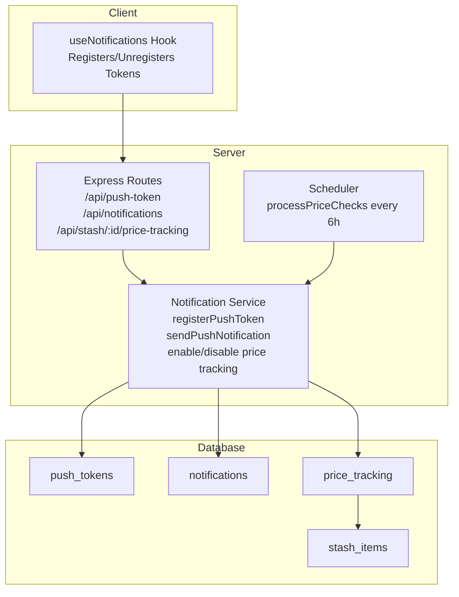
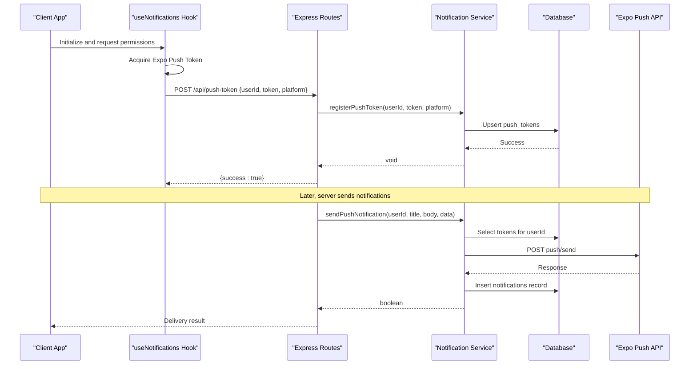
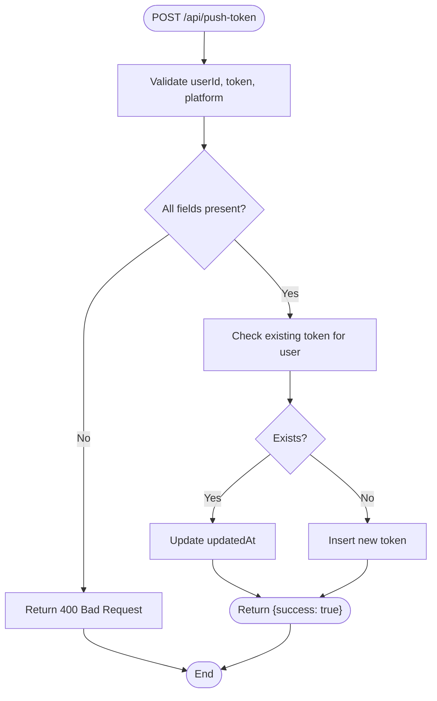
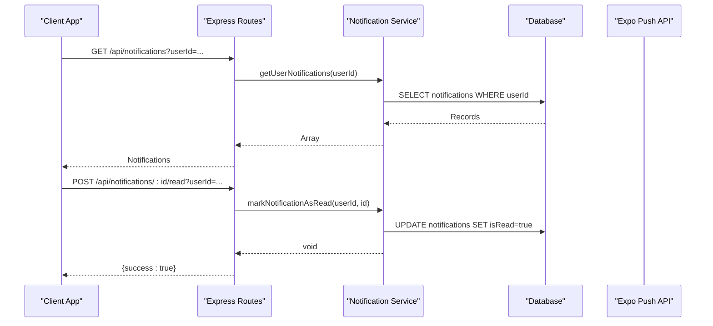
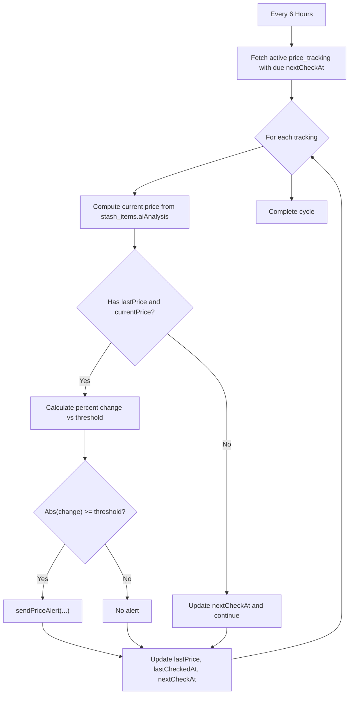
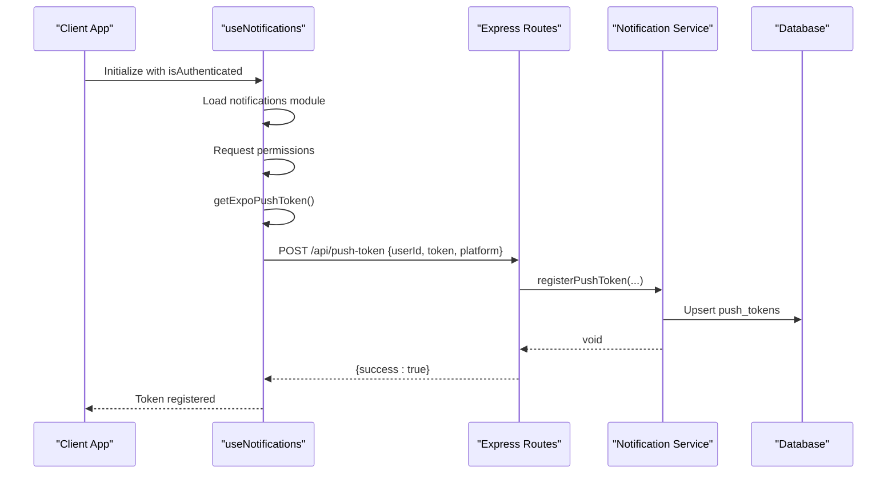
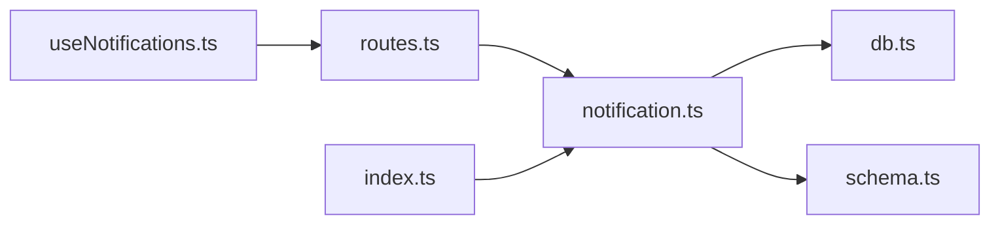

# Notification Endpoints

<cite>
**Referenced Files in This Document**
- [notification.ts](file://server/services/notification.ts)
- [routes.ts](file://server/routes.ts)
- [schema.ts](file://shared/schema.ts)
- [useNotifications.ts](file://client/hooks/useNotifications.ts)
- [index.ts](file://server/index.ts)
- [db.ts](file://server/db.ts)
</cite>

## Table of Contents
1. [Introduction](#introduction)
2. [Project Structure](#project-structure)
3. [Core Components](#core-components)
4. [Architecture Overview](#architecture-overview)
5. [Detailed Component Analysis](#detailed-component-analysis)
6. [Dependency Analysis](#dependency-analysis)
7. [Performance Considerations](#performance-considerations)
8. [Troubleshooting Guide](#troubleshooting-guide)
9. [Conclusion](#conclusion)

## Introduction
This document provides comprehensive documentation for the notification system endpoints, covering push token registration, notification subscription management, and price tracking functionality. It explains notification delivery mechanisms, scheduling systems, and user preference management. The documentation includes request/response schemas, workflow examples, and error handling strategies for delivery failures, tracing the complete notification lifecycle from registration to price tracking alerts.

## Project Structure
The notification system spans backend services, database schema, and client-side integration:

- Backend services define endpoints and orchestrate notification delivery and price tracking.
- Database schema defines persistent structures for push tokens, notifications, and price tracking.
- Client-side hooks manage push token registration/unregistration and permissions.

**Diagram sources**
- [routes.ts](file://server/routes.ts#L44-L182)
- [notification.ts](file://server/services/notification.ts#L1-L414)
- [schema.ts](file://shared/schema.ts#L258-L293)
- [useNotifications.ts](file://client/hooks/useNotifications.ts#L51-L136)
- [index.ts](file://server/index.ts#L247-L258)

**Section sources**
- [routes.ts](file://server/routes.ts#L44-L182)
- [notification.ts](file://server/services/notification.ts#L1-L414)
- [schema.ts](file://shared/schema.ts#L258-L293)
- [useNotifications.ts](file://client/hooks/useNotifications.ts#L51-L136)
- [index.ts](file://server/index.ts#L247-L258)

## Core Components
- Push Token Management: Registers and unregisters device tokens per user/platform.
- Notification Delivery: Sends push notifications via Expo Push API and persists delivery records.
- Price Tracking: Enables/disables price alerts for stash items with configurable thresholds.
- Scheduler: Periodically evaluates price changes and triggers alerts.
- Client Integration: Handles token acquisition, permission requests, and registration.

**Section sources**
- [notification.ts](file://server/services/notification.ts#L28-L129)
- [notification.ts](file://server/services/notification.ts#L131-L157)
- [notification.ts](file://server/services/notification.ts#L159-L241)
- [notification.ts](file://server/services/notification.ts#L328-L413)
- [useNotifications.ts](file://client/hooks/useNotifications.ts#L51-L136)

## Architecture Overview
The notification system integrates client-side token management with server-side endpoints and a scheduler. The flow begins with client registration of push tokens, followed by server-side delivery and persistence of notifications. Price tracking runs on a schedule to evaluate item values and dispatch alerts when thresholds are met.

**Diagram sources**
- [useNotifications.ts](file://client/hooks/useNotifications.ts#L51-L136)
- [routes.ts](file://server/routes.ts#L46-L72)
- [notification.ts](file://server/services/notification.ts#L28-L129)
- [schema.ts](file://shared/schema.ts#L258-L293)

## Detailed Component Analysis

### Push Token Registration and Unregistration
- Endpoint: POST /api/push-token
  - Purpose: Register a device push token for a user.
  - Request Body:
    - userId: string (required)
    - token: string (required)
    - platform: "ios" | "android" | "web" (required)
  - Response: { success: true }
  - Behavior:
    - If token exists for the user, updates the last updated timestamp.
    - Otherwise inserts a new token with platform metadata.
- Endpoint: DELETE /api/push-token
  - Purpose: Remove a registered push token.
  - Request Body:
    - userId: string (required)
    - token: string (required)
  - Response: { success: true }

**Diagram sources**
- [routes.ts](file://server/routes.ts#L46-L58)
- [notification.ts](file://server/services/notification.ts#L28-L58)

**Section sources**
- [routes.ts](file://server/routes.ts#L46-L72)
- [notification.ts](file://server/services/notification.ts#L28-L67)
- [schema.ts](file://shared/schema.ts#L258-L266)

### Notification Delivery and History
- Endpoint: GET /api/notifications?userId={string}
  - Purpose: Retrieve recent notifications for a user.
  - Response: Array of notification records.
- Endpoint: GET /api/notifications/unread-count?userId={string}
  - Purpose: Get unread notification count.
  - Response: { count: number }
- Endpoint: POST /api/notifications/:id/read?userId={string}
  - Purpose: Mark a specific notification as read.
  - Response: { success: true }
- Endpoint: POST /api/notifications/read-all?userId={string}
  - Purpose: Mark all notifications as read.
  - Response: { success: true }

Notification delivery:
- Service: sendPushNotification(userId, title, body, data)
  - Retrieves user tokens, constructs messages, posts to Expo Push API, and persists a notification record.
  - Returns boolean indicating success/failure.
- Service: sendPriceAlert(userId, stashItemId, itemTitle, oldPrice, newPrice, percentChange)
  - Builds contextual title/body based on price movement and dispatches via sendPushNotification.

**Diagram sources**
- [routes.ts](file://server/routes.ts#L74-L129)
- [notification.ts](file://server/services/notification.ts#L271-L312)
- [schema.ts](file://shared/schema.ts#L282-L293)

**Section sources**
- [routes.ts](file://server/routes.ts#L74-L129)
- [notification.ts](file://server/services/notification.ts#L71-L129)
- [notification.ts](file://server/services/notification.ts#L271-L312)
- [schema.ts](file://shared/schema.ts#L282-L293)

### Price Tracking Endpoints and Scheduling
- Endpoint: POST /api/stash/:id/price-tracking?userId={string}
  - Purpose: Enable price tracking for a stash item with optional alert threshold.
  - Request Body: { alertThreshold?: number }
  - Response: { success: true }
- Endpoint: DELETE /api/stash/:id/price-tracking?userId={string}
  - Purpose: Disable price tracking for a stash item.
  - Response: { success: true }
- Endpoint: GET /api/stash/:id/price-tracking?userId={string}
  - Purpose: Get tracking status (isActive, alertThreshold).
  - Response: { isActive: boolean, alertThreshold: number } | null

Scheduling:
- Server initializes a periodic scheduler that runs processPriceChecks every 6 hours.
- processPriceChecks:
  - Identifies active tracking entries due for evaluation.
  - Calculates percentage change against stored lastPrice.
  - Triggers sendPriceAlert when threshold is exceeded.
  - Updates tracking timestamps and lastPrice.

**Diagram sources**
- [index.ts](file://server/index.ts#L247-L258)
- [notification.ts](file://server/services/notification.ts#L328-L413)
- [schema.ts](file://shared/schema.ts#L268-L280)

**Section sources**
- [routes.ts](file://server/routes.ts#L131-L182)
- [notification.ts](file://server/services/notification.ts#L159-L241)
- [notification.ts](file://server/services/notification.ts#L328-L413)
- [schema.ts](file://shared/schema.ts#L268-L280)

### Client-Side Token Management
- Hook: useNotifications(isAuthenticated)
  - Loads notification modules on supported platforms.
  - Requests notification permissions if not granted.
  - Acquires Expo push token and registers it via POST /api/push-token.
  - Provides unregisterToken to remove tokens when needed.
  - Listens to notification events for future UI integration.

**Diagram sources**
- [useNotifications.ts](file://client/hooks/useNotifications.ts#L51-L136)
- [routes.ts](file://server/routes.ts#L46-L58)
- [notification.ts](file://server/services/notification.ts#L28-L58)

**Section sources**
- [useNotifications.ts](file://client/hooks/useNotifications.ts#L51-L136)

## Dependency Analysis
The notification system relies on:
- Express routes for HTTP endpoints.
- Drizzle ORM for database operations.
- PostgreSQL for persistent storage.
- Expo Push API for cross-platform push delivery.
- Scheduled job for periodic price tracking evaluation.

**Diagram sources**
- [routes.ts](file://server/routes.ts#L19-L29)
- [notification.ts](file://server/services/notification.ts#L1-L3)
- [db.ts](file://server/db.ts#L1-L19)
- [schema.ts](file://shared/schema.ts#L1-L5)
- [index.ts](file://server/index.ts#L4-L5)
- [useNotifications.ts](file://client/hooks/useNotifications.ts#L1-L5)

**Section sources**
- [routes.ts](file://server/routes.ts#L19-L29)
- [notification.ts](file://server/services/notification.ts#L1-L3)
- [db.ts](file://server/db.ts#L1-L19)
- [schema.ts](file://shared/schema.ts#L1-L5)
- [index.ts](file://server/index.ts#L4-L5)
- [useNotifications.ts](file://client/hooks/useNotifications.ts#L1-L5)

## Performance Considerations
- Batch delivery: The service constructs an array of messages and sends them in a single POST to Expo Push API, reducing overhead.
- Idempotent token registration: Existing tokens are updated rather than duplicated, minimizing database writes.
- Scheduled evaluation: Price checks run every 6 hours, balancing responsiveness with resource usage.
- Database indexing: Consider adding indexes on push_tokens(userId), notifications(userId), and price_tracking(nextCheckAt) for improved query performance.

[No sources needed since this section provides general guidance]

## Troubleshooting Guide
Common issues and resolutions:
- Push token registration fails:
  - Verify required fields (userId, token, platform) are present.
  - Check server logs for error responses and ensure DATABASE_URL is configured.
- No notifications delivered:
  - Confirm user has registered tokens and platform matches device.
  - Validate Expo Push API response and inspect server logs for network errors.
- Price tracking not triggering:
  - Ensure alertThreshold is set appropriately and item has aiAnalysis with price data.
  - Verify scheduler is running and nextCheckAt is due.
- Notification read status not updating:
  - Confirm userId and notification id are provided and valid.
  - Check database updates for isRead flag.

**Section sources**
- [routes.ts](file://server/routes.ts#L46-L72)
- [routes.ts](file://server/routes.ts#L74-L129)
- [routes.ts](file://server/routes.ts#L131-L182)
- [notification.ts](file://server/services/notification.ts#L71-L129)
- [notification.ts](file://server/services/notification.ts#L328-L413)
- [db.ts](file://server/db.ts#L7-L9)

## Conclusion
The notification system provides a robust foundation for push token management, notification delivery, and price tracking with configurable thresholds. The architecture cleanly separates concerns between client-side token acquisition, server-side endpoints, and scheduled background processing. By following the documented endpoints, schemas, and workflows, developers can integrate reliable notification delivery and price monitoring into the application.