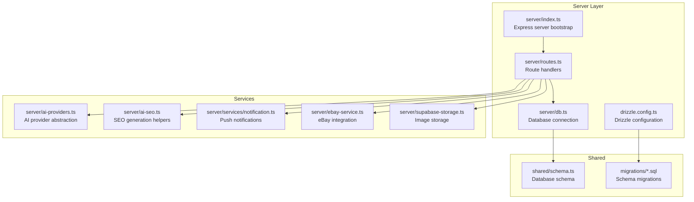
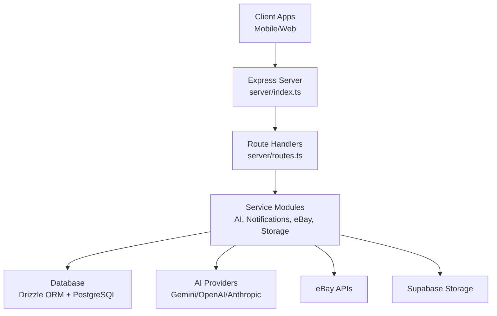
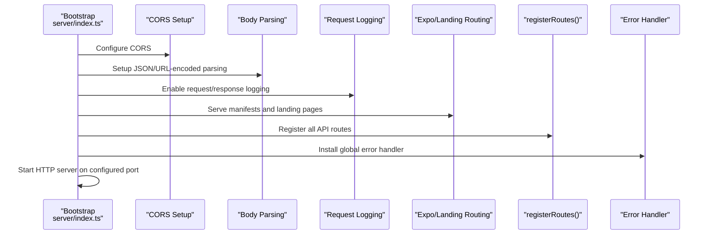
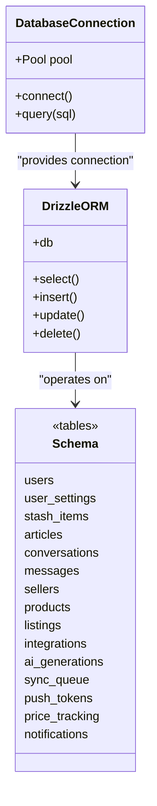
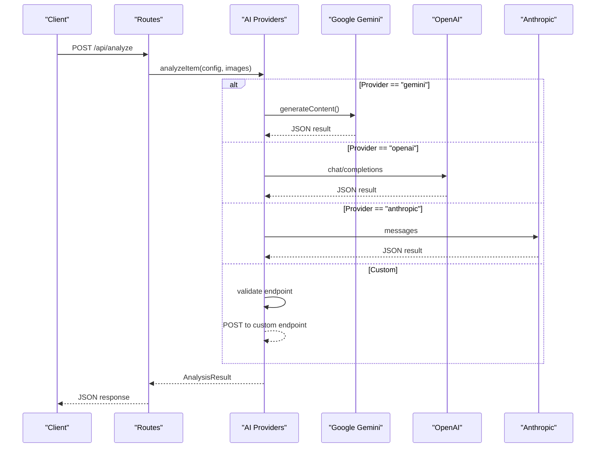
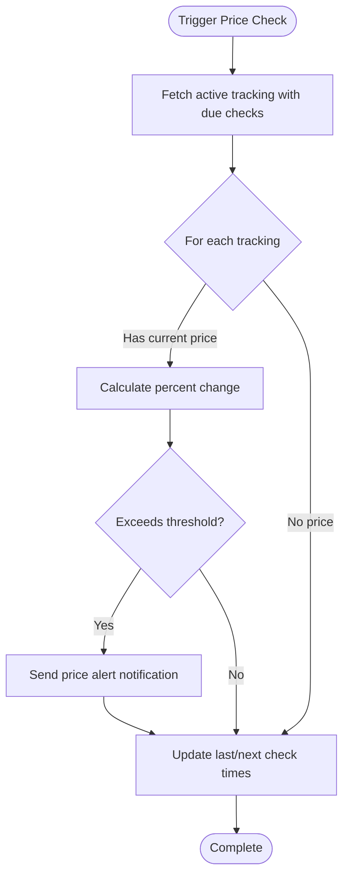
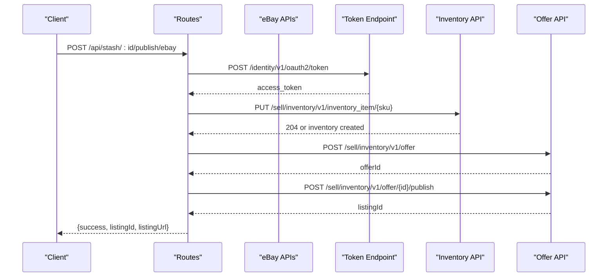
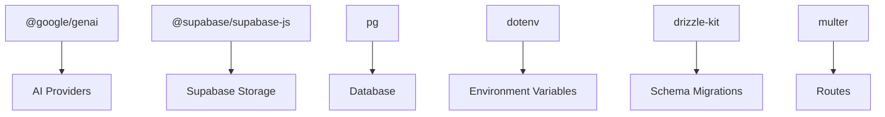

# Backend Services

<cite>
**Referenced Files in This Document**
- [server/index.ts](file://server/index.ts)
- [server/routes.ts](file://server/routes.ts)
- [server/db.ts](file://server/db.ts)
- [drizzle.config.ts](file://drizzle.config.ts)
- [shared/schema.ts](file://shared/schema.ts)
- [server/ai-providers.ts](file://server/ai-providers.ts)
- [server/ai-seo.ts](file://server/ai-seo.ts)
- [server/ebay-service.ts](file://server/ebay-service.ts)
- [server/services/notification.ts](file://server/services/notification.ts)
- [server/storage.ts](file://server/storage.ts)
- [server/supabase-storage.ts](file://server/supabase-storage.ts)
- [ENVIRONMENT.md](file://ENVIRONMENT.md)
- [package.json](file://package.json)
- [migrations/0000_sticky_night_thrasher.sql](file://migrations/0000_sticky_night_thrasher.sql)
- [migrations/0001_flipagent_tables.sql](file://migrations/0001_flipagent_tables.sql)
- [migrations/0002_rls_policies.sql](file://migrations/0002_rls_policies.sql)
</cite>

## Table of Contents
1. [Introduction](#introduction)
2. [Project Structure](#project-structure)
3. [Core Components](#core-components)
4. [Architecture Overview](#architecture-overview)
5. [Detailed Component Analysis](#detailed-component-analysis)
6. [Dependency Analysis](#dependency-analysis)
7. [Performance Considerations](#performance-considerations)
8. [Security Considerations](#security-considerations)
9. [Logging and Monitoring](#logging-and-monitoring)
10. [API Usage Examples](#api-usage-examples)
11. [Database Operations](#database-operations)
12. [Service Integration Patterns](#service-integration-patterns)
13. [Troubleshooting Guide](#troubleshooting-guide)
14. [Conclusion](#conclusion)

## Introduction
This document provides comprehensive backend documentation for the Express.js server layer. It covers server initialization, middleware configuration, error handling patterns, and API endpoint organization. It also details the modular route structure for authentication, item analysis, marketplace integration, and notification management. The database layer implementation using Drizzle ORM, schema design, and migration management are explained. The AI provider integration system supporting Google Gemini and OpenAI, including retry mechanisms and error handling, is documented. Marketplace service implementations for eBay and WooCommerce integration, including OAuth flows and API communication patterns, are included. Security considerations, rate limiting, logging strategies, and monitoring approaches are provided, along with examples of API usage, database operations, and service integration patterns.

## Project Structure
The backend is organized around an Express.js server with modular route handlers, a centralized database layer using Drizzle ORM, and service modules for AI analysis, notifications, and marketplace integrations. Shared schema definitions are used across the backend and migrations manage database evolution.

**Diagram sources**
- [server/index.ts](file://server/index.ts#L1-L262)
- [server/routes.ts](file://server/routes.ts#L1-L929)
- [server/db.ts](file://server/db.ts#L1-L19)
- [drizzle.config.ts](file://drizzle.config.ts#L1-L19)
- [shared/schema.ts](file://shared/schema.ts#L1-L344)
- [migrations/0000_sticky_night_thrasher.sql](file://migrations/0000_sticky_night_thrasher.sql#L1-L82)
- [migrations/0001_flipagent_tables.sql](file://migrations/0001_flipagent_tables.sql#L1-L117)
- [migrations/0002_rls_policies.sql](file://migrations/0002_rls_policies.sql#L1-L66)

**Section sources**
- [server/index.ts](file://server/index.ts#L1-L262)
- [server/routes.ts](file://server/routes.ts#L1-L929)
- [server/db.ts](file://server/db.ts#L1-L19)
- [drizzle.config.ts](file://drizzle.config.ts#L1-L19)
- [shared/schema.ts](file://shared/schema.ts#L1-L344)
- [migrations/0000_sticky_night_thrasher.sql](file://migrations/0000_sticky_night_thrasher.sql#L1-L82)
- [migrations/0001_flipagent_tables.sql](file://migrations/0001_flipagent_tables.sql#L1-L117)
- [migrations/0002_rls_policies.sql](file://migrations/0002_rls_policies.sql#L1-L66)

## Core Components
- Express server bootstrap with CORS, body parsing, request logging, Expo manifest serving, and error handling.
- Modular route registration organizing endpoints by feature areas.
- Drizzle ORM integration with PostgreSQL for data persistence.
- AI provider abstraction supporting multiple backends with retry logic.
- Notification service for push notifications and price tracking alerts.
- Marketplace integrations for eBay and WooCommerce publishing.
- Supabase storage for product image uploads.

**Section sources**
- [server/index.ts](file://server/index.ts#L1-L262)
- [server/routes.ts](file://server/routes.ts#L1-L929)
- [server/db.ts](file://server/db.ts#L1-L19)
- [server/ai-providers.ts](file://server/ai-providers.ts#L1-L696)
- [server/services/notification.ts](file://server/services/notification.ts#L1-L414)
- [server/ebay-service.ts](file://server/ebay-service.ts#L1-L474)
- [server/supabase-storage.ts](file://server/supabase-storage.ts#L1-L93)

## Architecture Overview
The backend follows a layered architecture:
- Presentation layer: Express routes grouped by feature domains.
- Application layer: Service modules encapsulating business logic.
- Data layer: Drizzle ORM with PostgreSQL, managed via migrations.
- External integrations: AI providers, eBay APIs, and Supabase storage.

**Diagram sources**
- [server/index.ts](file://server/index.ts#L1-L262)
- [server/routes.ts](file://server/routes.ts#L1-L929)
- [server/db.ts](file://server/db.ts#L1-L19)
- [server/ai-providers.ts](file://server/ai-providers.ts#L1-L696)
- [server/ebay-service.ts](file://server/ebay-service.ts#L1-L474)
- [server/supabase-storage.ts](file://server/supabase-storage.ts#L1-L93)

## Detailed Component Analysis

### Express Server Initialization and Middleware
The server initializes with:
- CORS configuration supporting Replit domains and localhost origins.
- Body parsing with raw body capture for signature verification.
- Request logging middleware capturing API responses.
- Expo manifest and landing page serving for non-API routes.
- Centralized error handler.
- Scheduled price checks every six hours.

**Diagram sources**
- [server/index.ts](file://server/index.ts#L19-L261)

**Section sources**
- [server/index.ts](file://server/index.ts#L1-L262)

### Route Organization and API Domains
Routes are organized into logical domains:
- Push notifications: token registration, retrieval, read status, and price tracking controls.
- Articles and stash items: CRUD operations for content and collected items.
- AI analysis: image-based item analysis with provider selection and retry logic.
- Marketplace publishing: WooCommerce and eBay listing creation and management.
- AI provider testing and retry analysis.

```mermaid
graph TB
subgraph "Notification Domain"
N1["POST /api/push-token"]
N2["DELETE /api/push-token"]
N3["GET /api/notifications"]
N4["GET /api/notifications/unread-count"]
N5["POST /api/notifications/:id/read"]
N6["POST /api/notifications/read-all"]
PT1["POST /api/stash/:id/price-tracking"]
PT2["DELETE /api/stash/:id/price-tracking"]
PT3["GET /api/stash/:id/price-tracking"]
end
subgraph "Content Domain"
C1["GET /api/articles"]
C2["GET /api/articles/:id"]
S1["GET /api/stash"]
S2["GET /api/stash/count"]
S3["GET /api/stash/:id"]
S4["POST /api/stash"]
S5["DELETE /api/stash/:id"]
end
subgraph "AI Analysis Domain"
A1["POST /api/analyze"]
A2["POST /api/ai-providers/test"]
A3["POST /api/analyze/retry"]
end
subgraph "Marketplace Domain"
M1["POST /api/stash/:id/publish/woocommerce"]
M2["POST /api/stash/:id/publish/ebay"]
end
Routes["server/routes.ts"] --> N1
Routes --> N2
Routes --> N3
Routes --> N4
Routes --> N5
Routes --> N6
Routes --> PT1
Routes --> PT2
Routes --> PT3
Routes --> C1
Routes --> C2
Routes --> S1
Routes --> S2
Routes --> S3
Routes --> S4
Routes --> S5
Routes --> A1
Routes --> A2
Routes --> A3
Routes --> M1
Routes --> M2
```

**Diagram sources**
- [server/routes.ts](file://server/routes.ts#L44-L929)

**Section sources**
- [server/routes.ts](file://server/routes.ts#L1-L929)

### Database Layer with Drizzle ORM
The database layer connects to PostgreSQL using Drizzle ORM:
- Connection pooling with SSL configuration.
- Schema imported from shared definitions.
- Migration management via drizzle-kit.

**Diagram sources**
- [server/db.ts](file://server/db.ts#L1-L19)
- [shared/schema.ts](file://shared/schema.ts#L1-L344)

**Section sources**
- [server/db.ts](file://server/db.ts#L1-L19)
- [drizzle.config.ts](file://drizzle.config.ts#L1-L19)
- [shared/schema.ts](file://shared/schema.ts#L1-L344)
- [migrations/0000_sticky_night_thrasher.sql](file://migrations/0000_sticky_night_thrasher.sql#L1-L82)
- [migrations/0001_flipagent_tables.sql](file://migrations/0001_flipagent_tables.sql#L1-L117)
- [migrations/0002_rls_policies.sql](file://migrations/0002_rls_policies.sql#L1-L66)

### AI Provider Integration System
The AI provider system supports multiple backends:
- Provider abstraction with validation and custom endpoint restrictions.
- Retry mechanism with feedback-driven re-analysis.
- Provider testing utilities.
- Enhanced analysis result schema with authentication, market analysis, and categorization.

**Diagram sources**
- [server/routes.ts](file://server/routes.ts#L299-L385)
- [server/ai-providers.ts](file://server/ai-providers.ts#L380-L396)

**Section sources**
- [server/ai-providers.ts](file://server/ai-providers.ts#L1-L696)
- [server/routes.ts](file://server/routes.ts#L299-L385)

### Notification Management and Price Tracking
The notification service handles:
- Push token registration and unregistration.
- Sending push notifications via Expo.
- Price tracking with configurable thresholds and periodic checks.
- Notification history and read status management.

**Diagram sources**
- [server/services/notification.ts](file://server/services/notification.ts#L332-L413)

**Section sources**
- [server/services/notification.ts](file://server/services/notification.ts#L1-L414)

### eBay Marketplace Integration
eBay integration provides:
- OAuth2 token refresh with environment-aware base URLs.
- Inventory item management and listing creation.
- Price and quantity updates.
- Category mapping and listing publication.

**Diagram sources**
- [server/routes.ts](file://server/routes.ts#L457-L647)
- [server/ebay-service.ts](file://server/ebay-service.ts#L329-L430)

**Section sources**
- [server/ebay-service.ts](file://server/ebay-service.ts#L1-L474)
- [server/routes.ts](file://server/routes.ts#L457-L647)

### WooCommerce Integration
WooCommerce integration enables:
- Basic authentication using consumer key and secret.
- Product creation with mapped pricing and images.
- Status tracking and permalink generation.

**Section sources**
- [server/routes.ts](file://server/routes.ts#L387-L455)

### Supabase Storage Integration
Supabase storage provides:
- Secure image uploads with namespace scoping.
- Validation for MIME type and size limits.
- Public URL generation and base64 encoding.

**Section sources**
- [server/supabase-storage.ts](file://server/supabase-storage.ts#L1-L93)

### AI SEO Generation
SEO generation utilities:
- eBay-compliant title generation (80 characters).
- Formatted marketplace descriptions.
- Tag generation from analysis results.
- Audit trail persistence.

**Section sources**
- [server/ai-seo.ts](file://server/ai-seo.ts#L1-L112)

## Dependency Analysis
External dependencies and their roles:
- Express: Web framework for HTTP server and routing.
- Drizzle ORM: Database toolkit for PostgreSQL.
- @google/genai: Google AI Gemini integration.
- @supabase/supabase-js: Supabase client for storage and auth.
- pg: PostgreSQL driver for connection pooling.
- dotenv: Environment variable loading.
- drizzle-kit: Migration tooling.
- multer: In-memory multipart file handling for image uploads.

**Diagram sources**
- [package.json](file://package.json#L24-L76)

**Section sources**
- [package.json](file://package.json#L1-L95)

## Performance Considerations
- Connection pooling: PostgreSQL pool configured with SSL and environment variables.
- Request logging overhead: Minimal impact due to conditional logging for API paths.
- Image processing: Multer memory storage for small images; consider streaming for larger files.
- Scheduled tasks: Price checks run every six hours to minimize load.
- Database indexing: Indexes on frequently queried columns in FlipAgent tables.

[No sources needed since this section provides general guidance]

## Security Considerations
- CORS: Origin validation with Replit domains and localhost support.
- Environment variables: Sensitive keys loaded via dotenv; ensure secrets management.
- Custom AI endpoints: Validation prevents internal/private network access.
- Supabase credentials: Required for storage operations; ensure secure configuration.
- Session management: Session secret required for encrypted sessions.

**Section sources**
- [server/index.ts](file://server/index.ts#L19-L56)
- [ENVIRONMENT.md](file://ENVIRONMENT.md#L12-L68)

## Logging and Monitoring
- Request logging captures method, path, status, duration, and response payload for API routes.
- Centralized error handler ensures consistent error responses.
- Scheduled job logs indicate periodic maintenance execution.
- Consider adding structured logging, metrics collection, and health checks for production deployments.

**Section sources**
- [server/index.ts](file://server/index.ts#L70-L101)
- [server/index.ts](file://server/index.ts#L210-L225)

## API Usage Examples
Below are example API interactions without code content:

- Register a push token
  - Method: POST
  - Path: /api/push-token
  - Body: { userId, token, platform }
  - Response: { success: true }

- Fetch user notifications
  - Method: GET
  - Path: /api/notifications?userId={userId}
  - Response: Array of notifications

- Enable price tracking
  - Method: POST
  - Path: /api/stash/:id/price-tracking?userId={userId}
  - Body: { alertThreshold }
  - Response: { success: true }

- Analyze item with images
  - Method: POST
  - Path: /api/analyze
  - Form fields: fullImage, labelImage
  - Response: Analysis result JSON

- Publish to eBay
  - Method: POST
  - Path: /api/stash/:id/publish/ebay
  - Body: { clientId, clientSecret, refreshToken, environment, merchantLocationKey }
  - Response: { success, listingId, listingUrl }

- Publish to WooCommerce
  - Method: POST
  - Path: /api/stash/:id/publish/woocommerce
  - Body: { storeUrl, consumerKey, consumerSecret }
  - Response: { success, productId, productUrl }

**Section sources**
- [server/routes.ts](file://server/routes.ts#L46-L72)
- [server/routes.ts](file://server/routes.ts#L74-L129)
- [server/routes.ts](file://server/routes.ts#L132-L182)
- [server/routes.ts](file://server/routes.ts#L299-L385)
- [server/routes.ts](file://server/routes.ts#L457-L647)
- [server/routes.ts](file://server/routes.ts#L387-L455)

## Database Operations
Common database operations using Drizzle ORM:
- Select all stash items ordered by creation date.
- Insert a new stash item with computed fields.
- Update item fields and timestamps.
- Delete an item by ID.
- Insert or update push tokens for users.
- Manage price tracking with thresholds and scheduling.

**Section sources**
- [server/routes.ts](file://server/routes.ts#L216-L297)
- [server/routes.ts](file://server/routes.ts#L258-L286)
- [server/routes.ts](file://server/routes.ts#L387-L455)
- [server/services/notification.ts](file://server/services/notification.ts#L31-L67)
- [server/services/notification.ts](file://server/services/notification.ts#L162-L223)

## Service Integration Patterns
- AI provider abstraction allows pluggable backends with unified retry logic.
- eBay integration encapsulates OAuth flows and API calls with environment awareness.
- Supabase storage provides a secure, scalable image storage solution.
- Notification service centralizes push messaging and price tracking alerts.

**Section sources**
- [server/ai-providers.ts](file://server/ai-providers.ts#L380-L396)
- [server/ebay-service.ts](file://server/ebay-service.ts#L329-L430)
- [server/supabase-storage.ts](file://server/supabase-storage.ts#L45-L80)
- [server/services/notification.ts](file://server/services/notification.ts#L72-L129)

## Troubleshooting Guide
- Database connection failures: Verify DATABASE_URL and PostgreSQL availability.
- AI provider errors: Check provider-specific API keys and quotas.
- eBay OAuth issues: Confirm refresh token validity and environment configuration.
- Supabase storage errors: Validate Supabase URL and keys.
- CORS errors: Ensure origin is whitelisted in environment variables.
- Scheduled job failures: Review logs for price tracking exceptions.

**Section sources**
- [ENVIRONMENT.md](file://ENVIRONMENT.md#L178-L194)
- [server/index.ts](file://server/index.ts#L210-L225)
- [server/services/notification.ts](file://server/services/notification.ts#L406-L412)

## Conclusion
The backend provides a robust, modular Express.js server with strong database integration, flexible AI provider support, comprehensive marketplace integrations, and reliable notification services. The architecture emphasizes separation of concerns, maintainable schema evolution through migrations, and clear service boundaries. Proper environment configuration, logging, and monitoring practices are essential for production readiness.